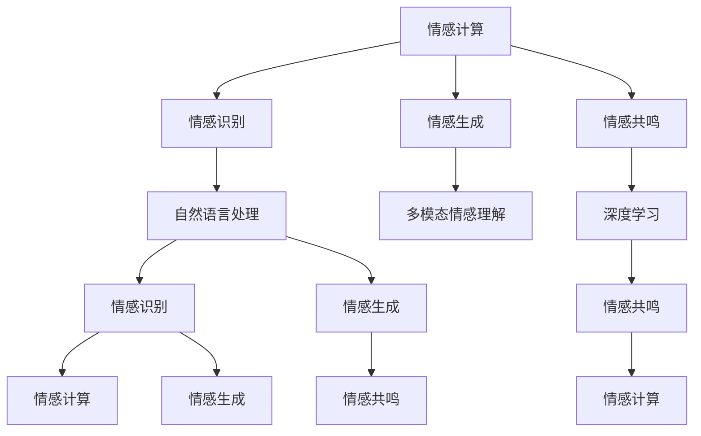

                 

# 数字化共情：AI辅助的情感连接

> 关键词：人工智能,情感识别,自然语言处理(NLP),机器学习,深度学习,共情计算,心理健康

## 1. 背景介绍

### 1.1 问题由来
随着人工智能技术的迅猛发展，AI在医疗、教育、客服等领域的应用越来越广泛。然而，尽管AI在处理数据、优化流程方面表现卓越，但在情感理解和共情方面却显得相对欠缺。尤其在涉及到需要深入理解人类情感的领域，如心理咨询、健康管理、用户体验设计等，AI的局限性显得尤为突出。

情感理解和共情能力是人类社交互动中的重要组成部分，对个体的心理和社会健康有着重要影响。然而，在传统技术框架下，情感的测量和处理往往依赖于繁琐的手工操作和有限的统计方法，难以满足大规模、复杂、动态的情感数据处理需求。

近年来，随着深度学习技术的突破，AI在自然语言处理(NLP)、图像识别、语音分析等领域取得了显著进展，能够自动学习并理解复杂的多模态情感表达。这一技术突破为实现AI的情感理解和共情能力提供了新的可能性。

本文聚焦于如何利用AI技术，特别是在自然语言处理领域的技术，来增强机器的情感理解和共情能力。通过探讨AI在情感识别、情感生成、情感共鸣等领域的最新进展，本文将介绍一些基于情感计算和AI辅助的情感连接方法，为情感AI的应用实践提供理论指导和实践指南。

### 1.2 问题核心关键点
AI辅助的情感连接方法的核心关键点在于：

1. **情感识别**：通过AI技术，特别是深度学习模型，自动分析文本、图像、语音等多模态数据中的情感表达，并转化为机器可理解的特征。
2. **情感生成**：利用AI生成符合情感规则的文本、图像、音乐等内容，实现对情感的表达和传达。
3. **情感共鸣**：通过AI模拟人类的情感理解和共情机制，实现与人类的情感交互，增强用户的情感体验。

这些关键点涵盖了情感AI技术的各个方面，从基础的情感识别，到高级的情感生成和共鸣，为实现情感计算和AI辅助的情感连接提供了全面的技术框架。

## 2. 核心概念与联系

### 2.1 核心概念概述

为更好地理解AI辅助的情感连接方法，本节将介绍几个密切相关的核心概念：

- **情感计算**：通过AI技术对情感信息进行采集、分析和应用的过程。情感计算的目的是理解情感，并利用情感信息改善人机交互、产品设计等。

- **情感识别**：使用AI模型自动识别文本、语音、图像等输入中的情感信息。情感识别的关键在于模型如何处理和理解多模态情感表达。

- **情感生成**：利用AI模型生成符合特定情感规则的文本、图像、音乐等内容。情感生成的目的是增强情感表达的丰富性和多样性。

- **情感共鸣**：通过AI模拟人类的情感理解机制，实现与人类情感的深度交互。情感共鸣的难点在于如何理解复杂的情感动态和人类情感表达的微妙之处。

- **自然语言处理(NLP)**：AI对自然语言文本进行处理和理解的技术，是情感计算和情感识别的基础。

- **深度学习**：一种基于神经网络的学习范式，能够自动学习并提取复杂特征，广泛应用于情感识别和生成任务。

- **多模态情感理解**：利用AI模型综合处理文本、语音、图像等多种情感表达方式，实现对人类情感的全面理解。

这些核心概念之间的逻辑关系可以通过以下Mermaid流程图来展示：



这个流程图展示了情感计算和AI辅助情感连接的主要概念及其之间的关系：

1. 情感计算是基础，涵盖情感识别、情感生成和情感共鸣三个方面。
2. 自然语言处理和深度学习是实现情感计算和情感识别的关键技术。
3. 情感生成和情感共鸣需要通过多模态情感理解进行多方面的处理。

这些概念共同构成了情感AI技术的核心框架，为实现情感理解和共情提供了坚实的基础。

## 3. 核心算法原理 & 具体操作步骤
### 3.1 算法原理概述

AI辅助的情感连接方法主要基于自然语言处理(NLP)和深度学习技术。其核心思想是利用AI技术，特别是深度学习模型，自动识别和理解文本、语音、图像等多模态数据中的情感信息，并通过情感生成技术增强情感表达，最终实现情感共鸣。

形式化地，假设输入的情感数据为 $D=\{x_i\}_{i=1}^N$，其中 $x_i$ 包含文本、语音、图像等多种形式的情感表达。目标是从 $D$ 中自动识别和理解情感信息，即求解情感标签 $y=\{y_i\}_{i=1}^N$。然后，利用情感生成技术，生成符合情感规则的内容 $G=\{g_i\}_{i=1}^N$。最后，通过情感共鸣技术，模拟人类情感理解机制，实现与用户的深度情感交互。

### 3.2 算法步骤详解

AI辅助的情感连接方法通常包括以下关键步骤：

**Step 1: 准备数据集**
- 收集包含情感标签的多模态数据集，如文本、语音、图像等。
- 数据集应涵盖不同情感表达方式，以便训练全面的情感识别模型。

**Step 2: 选择模型架构**
- 根据任务需求，选择合适的深度学习模型架构，如卷积神经网络(CNN)、循环神经网络(RNN)、Transformer等。
- 对于文本情感识别，通常选择预训练的BERT、GPT等模型作为情感识别模型的初始化参数。

**Step 3: 训练情感识别模型**
- 利用情感标注数据，通过反向传播算法训练情感识别模型，优化模型参数。
- 在训练过程中，可以使用交叉熵损失函数等评估指标，进行模型的准确性和泛化能力评估。

**Step 4: 情感生成**
- 在情感识别模型的基础上，添加情感生成模块，如文本生成模型、图像生成模型等。
- 利用生成模型生成符合情感规则的内容，如情感文本、图像等。

**Step 5: 情感共鸣**
- 利用情感共鸣技术，通过模拟人类情感理解机制，实现与用户的情感交互。
- 情感共鸣技术可以结合自然语言生成、情感预测等方法，增强情感表达的深度和真实性。

**Step 6: 部署和应用**
- 将训练好的情感识别和生成模型部署到实际应用中，如情感分析系统、智能客服系统等。
- 通过API接口或模型集成方式，实现情感数据的自动分析和情感内容的自动生成，提升用户体验。

### 3.3 算法优缺点

AI辅助的情感连接方法具有以下优点：

1. **自动化情感分析**：通过深度学习模型，自动化处理和分析情感数据，提升情感分析的效率和准确性。
2. **多模态情感理解**：综合处理文本、语音、图像等多种情感表达方式，实现对人类情感的全面理解。
3. **情感共鸣**：通过模拟人类情感理解机制，实现与用户的深度情感交互，增强用户体验。
4. **技术成熟**：在自然语言处理和深度学习领域，已有大量成熟技术和模型可供使用，技术落地速度快。

同时，该方法也存在一些局限性：

1. **数据依赖**：情感计算和情感识别依赖于高质量、大规模的标注数据，数据获取成本较高。
2. **模型复杂性**：深度学习模型复杂，训练和推理计算资源需求大，模型部署和优化难度较高。
3. **情感多样性**：人类情感表达复杂多样，机器难以完全理解和生成，情感共鸣效果可能有限。
4. **技术挑战**：情感计算和情感生成技术尚处于发展初期，一些关键问题如情感粒度、情感动态等问题仍有待解决。

尽管存在这些局限性，但AI辅助的情感连接方法在情感计算和情感AI应用中仍具有广阔前景，能够显著提升情感数据的处理和利用效率，增强人类情感的理解和共鸣。

### 3.4 算法应用领域

AI辅助的情感连接方法在多个领域有着广泛的应用，包括但不限于：

- **心理咨询**：通过情感识别和情感共鸣技术，辅助心理咨询师进行情感分析，增强咨询效果。
- **健康管理**：通过情感数据监测用户的心理健康状态，及时发现潜在问题，提供情感支持和治疗建议。
- **用户体验设计**：利用情感生成技术，设计符合用户情感需求的产品和服务，提升用户体验。
- **智能客服**：通过情感识别和情感生成技术，实现智能客服系统对用户情感的自动理解和响应，增强交互效果。
- **情感分析系统**：构建情感分析系统，自动识别和理解社交媒体、论坛等平台上的情感信息，提供情感趋势分析。
- **情感AI辅助创作**：利用情感生成技术，辅助艺术家进行情感主题的创作，生成符合情感规则的艺术作品。

随着情感计算和情感AI技术的不断成熟，AI辅助的情感连接方法将在更多领域得到应用，为情感数据的深度分析和应用提供新的动力。

## 4. 数学模型和公式 & 详细讲解 & 举例说明
### 4.1 数学模型构建

情感计算和情感识别的数学模型构建主要基于自然语言处理(NLP)和深度学习技术。假设输入的情感数据为 $D=\{x_i\}_{i=1}^N$，其中 $x_i$ 包含文本、语音、图像等多种形式的情感表达。目标是从 $D$ 中自动识别和理解情感信息，即求解情感标签 $y=\{y_i\}_{i=1}^N$。

### 4.2 公式推导过程

情感识别任务的数学模型可以通过以下公式进行推导：

$$
\hat{y} = f(M_\theta(x))
$$

其中 $M_\theta$ 为深度学习模型，$f$ 为模型输出函数，$\theta$ 为模型参数。假设模型的损失函数为 $\mathcal{L}(\theta)$，则优化目标为：

$$
\theta^* = \mathop{\arg\min}_{\theta} \mathcal{L}(\theta)
$$

在情感识别任务中，通常使用交叉熵损失函数。对于文本情感分类任务，假设模型输出为 $\hat{y} \in \{0,1\}^N$，真实标签为 $y \in \{0,1\}^N$，则交叉熵损失函数为：

$$
\mathcal{L}(\theta) = -\frac{1}{N}\sum_{i=1}^N [y_i\log \hat{y}_i + (1-y_i)\log (1-\hat{y}_i)]
$$

在情感生成任务中，假设生成模型为 $G_\phi(x)$，目标函数为 $\mathcal{L}(\phi)$，则生成过程可以通过以下公式表示：

$$
\hat{g} = G_\phi(x)
$$

目标函数 $\mathcal{L}(\phi)$ 可以定义为：

$$
\mathcal{L}(\phi) = \mathcal{L}(\hat{g}, y)
$$

其中 $y$ 为期望的情感标签，$\mathcal{L}$ 为损失函数，如均方误差损失等。

### 4.3 案例分析与讲解

以文本情感分类任务为例，假设输入的文本为 $x_i$，输出情感标签为 $y_i$，则可以使用BERT模型进行情感分类。具体步骤如下：

1. **模型选择**：选择BERT模型作为情感分类模型。
2. **数据准备**：准备包含情感标签的文本数据集 $D=\{x_i, y_i\}_{i=1}^N$。
3. **模型训练**：利用BERT模型的预训练参数作为初始化参数，在情感数据集 $D$ 上训练情感分类模型 $M_\theta$。
4. **情感生成**：在情感分类模型的基础上，添加文本生成模块，生成符合情感规则的文本。
5. **情感共鸣**：通过模拟人类情感理解机制，实现与用户的情感交互。

通过以上步骤，可以实现从文本情感分类到情感生成，再到情感共鸣的全过程。

## 5. 项目实践：代码实例和详细解释说明
### 5.1 开发环境搭建

在进行情感计算和情感识别实践前，我们需要准备好开发环境。以下是使用Python进行TensorFlow开发的简单环境配置流程：

1. 安装Anaconda：从官网下载并安装Anaconda，用于创建独立的Python环境。
2. 创建并激活虚拟环境：
```bash
conda create -n tf-env python=3.8 
conda activate tf-env
```

3. 安装TensorFlow：
```bash
pip install tensorflow
```

4. 安装各类工具包：
```bash
pip install numpy pandas scikit-learn matplotlib tqdm jupyter notebook ipython
```

完成上述步骤后，即可在`tf-env`环境中开始情感计算和情感识别的实践。

### 5.2 源代码详细实现

下面我们以文本情感分类任务为例，给出使用TensorFlow进行情感分类的PyTorch代码实现。

首先，定义情感分类模型：

```python
import tensorflow as tf
from tensorflow.keras import layers, models

# 定义模型架构
model = models.Sequential([
    layers.Embedding(input_dim=vocab_size, output_dim=embedding_dim, input_length=max_len),
    layers.Conv1D(filters=64, kernel_size=3, activation='relu'),
    layers.GlobalMaxPooling1D(),
    layers.Dense(64, activation='relu'),
    layers.Dense(1, activation='sigmoid')
])

# 编译模型
model.compile(loss='binary_crossentropy', optimizer='adam', metrics=['accuracy'])
```

然后，加载和预处理数据：

```python
# 加载文本数据
texts = []
labels = []
with open('data.txt', 'r') as f:
    for line in f:
        text, label = line.split(',')
        texts.append(text)
        labels.append(label)

# 分词和编码
tokenizer = tf.keras.preprocessing.text.Tokenizer()
tokenizer.fit_on_texts(texts)
sequences = tokenizer.texts_to_sequences(texts)
padded_sequences = tf.keras.preprocessing.sequence.pad_sequences(sequences, maxlen=max_len)

# 编码标签
labels = tf.keras.utils.to_categorical(labels)
```

接着，训练模型：

```python
# 训练模型
history = model.fit(padded_sequences, labels, epochs=num_epochs, validation_split=0.2)
```

最后，评估模型：

```python
# 评估模型
test_sequences = tokenizer.texts_to_sequences(test_texts)
test_padded_sequences = tf.keras.preprocessing.sequence.pad_sequences(test_sequences, maxlen=max_len)
test_labels = tf.keras.utils.to_categorical(test_labels)
test_loss, test_acc = model.evaluate(test_padded_sequences, test_labels)
print(f'Test Loss: {test_loss:.4f}')
print(f'Test Accuracy: {test_acc:.4f}')
```

以上就是使用TensorFlow进行文本情感分类的完整代码实现。可以看到，通过TensorFlow的Keras API，情感分类的代码实现相对简洁高效。

### 5.3 代码解读与分析

让我们再详细解读一下关键代码的实现细节：

**定义模型架构**：
- 使用Keras API定义了一个包含嵌入层、卷积层、池化层、全连接层的序列模型。
- 嵌入层将文本转换为向量表示，卷积层和池化层提取特征，全连接层进行分类预测。

**加载和预处理数据**：
- 使用`Tokenizer`对文本进行分词和编码，通过`pad_sequences`进行序列填充，确保输入数据的统一长度。
- 使用`to_categorical`将标签编码成独热向量，方便模型处理。

**训练模型**：
- 使用`fit`方法进行模型训练，指定损失函数、优化器和评估指标，设置训练轮数和验证集比例。
- 模型训练时，利用`ValidationData`参数指定验证集数据，监控模型在验证集上的性能。

**评估模型**：
- 使用`evaluate`方法评估模型在测试集上的性能，输出测试集上的损失和准确率。
- 通过评估结果，判断模型是否达到了预期的情感分类效果。

## 6. 实际应用场景
### 6.1 智能客服系统

基于情感计算的智能客服系统，可以通过情感识别和情感生成技术，实现对用户情感的自动理解和生成，提升客服系统的智能化水平和用户体验。具体而言，智能客服系统可以自动分析用户输入的文本和语音数据，识别用户的情感状态，并根据情感生成合适的回复。

例如，当用户输入“服务态度差”时，智能客服系统可以通过情感分析，判断用户的情绪为负面。然后根据情感生成技术，生成类似“对不起，我们对此深感抱歉，请问有什么可以帮您解决的？”的回复，以缓解用户的负面情绪。

### 6.2 心理咨询

在心理咨询中，情感计算和情感共鸣技术可以辅助心理咨询师进行情感分析，增强咨询效果。例如，心理咨询师可以利用情感识别技术，自动分析患者的语言和面部表情，识别出患者的情绪状态。然后，通过情感共鸣技术，心理咨询师可以模拟患者的情感体验，更好地理解患者的需求和问题，提供更有效的咨询和治疗建议。

### 6.3 健康管理

健康管理中，情感计算和情感共鸣技术可以用于监测用户的心理健康状态，提供情感支持和治疗建议。例如，通过情感识别技术，监测用户的社交媒体、邮件等数据，自动分析用户的情绪变化，及时发现用户的心理问题。然后，通过情感生成技术，生成符合用户情感需求的心理健康建议，如“今天感觉如何？是否需要倾诉？”，帮助用户缓解压力，提升心理健康。

### 6.4 未来应用展望

随着情感计算和情感AI技术的不断成熟，AI辅助的情感连接方法将在更多领域得到应用，为情感数据的深度分析和应用提供新的动力。未来，情感计算和情感AI技术有望在以下领域得到更广泛的应用：

- **医疗健康**：情感计算可以用于分析患者的情感状态，辅助医生进行心理诊断和治疗。情感共鸣技术可以增强患者的情感支持和治疗体验。
- **教育培训**：情感计算可以用于分析学生的情感状态，及时发现学生的学习问题和心理困扰。情感生成技术可以生成符合学生情感需求的教学内容，提升教学效果。
- **智能家居**：情感计算可以用于分析用户的家庭环境和使用习惯，自动调整家居设备的设置，提升用户的生活体验。
- **社交媒体**：情感计算可以用于分析社交媒体上的情感趋势，提供情感支持和社会援助。情感生成技术可以生成符合用户情感需求的内容，增强社交互动。

## 7. 工具和资源推荐
### 7.1 学习资源推荐

为了帮助开发者系统掌握情感计算和情感AI的理论基础和实践技巧，这里推荐一些优质的学习资源：

1. 《情感计算与情感智能》书籍：系统介绍了情感计算和情感智能的理论基础和实际应用，适合入门和进阶学习。
2. 《情感人工智能：理论与实践》课程：由知名学者开设的情感AI课程，涵盖情感计算、情感生成、情感共鸣等多个方面，深入浅出。
3. 《自然语言处理综述》书籍：全面介绍了自然语言处理技术的发展和应用，包括情感计算在内。
4. 《深度学习》书籍：深入讲解深度学习模型的构建和应用，适合学习情感计算和情感生成技术。
5. HuggingFace官方文档：提供了大量预训练语言模型和情感计算样例代码，适合学习情感计算的实际应用。

通过对这些资源的学习实践，相信你一定能够快速掌握情感计算和情感AI的精髓，并用于解决实际的情感问题。
###  7.2 开发工具推荐

高效的开发离不开优秀的工具支持。以下是几款用于情感计算和情感识别开发的常用工具：

1. TensorFlow：基于Python的开源深度学习框架，适合大规模工程应用。
2. Keras：TensorFlow的高级API，提供简洁高效的模型定义方式。
3. PyTorch：基于Python的开源深度学习框架，灵活的动态计算图，适合快速迭代研究。
4. Weights & Biases：模型训练的实验跟踪工具，可以记录和可视化模型训练过程中的各项指标，方便对比和调优。
5. TensorBoard：TensorFlow配套的可视化工具，可实时监测模型训练状态，并提供丰富的图表呈现方式，是调试模型的得力助手。

合理利用这些工具，可以显著提升情感计算和情感识别的开发效率，加快创新迭代的步伐。

### 7.3 相关论文推荐

情感计算和情感AI的发展源于学界的持续研究。以下是几篇奠基性的相关论文，推荐阅读：

1. Sentiment Analysis with Deep Learning：利用深度学习模型进行情感分类的经典论文。
2. A Survey on Emotion Recognition Technologies and Applications：全面综述情感识别技术的进展。
3. Affective Computing with Computational Modeling of Human Affect：情感计算的权威综述论文。
4. Deep Generative Adversarial Networks for Text-to-Image Generation：利用生成对抗网络进行情感生成任务的研究。
5. Emotional Dialogue Generation Using Hierarchical Attention Network：利用注意力机制进行情感生成和情感共鸣的研究。

这些论文代表了大情感计算和情感AI的发展脉络。通过学习这些前沿成果，可以帮助研究者把握学科前进方向，激发更多的创新灵感。

## 8. 总结：未来发展趋势与挑战

### 8.1 研究成果总结

本文对AI辅助的情感连接方法进行了全面系统的介绍。首先，阐述了情感计算和情感AI的研究背景和应用价值，明确了情感识别、情感生成和情感共鸣技术的重要性。其次，从原理到实践，详细讲解了情感计算和情感识别的数学模型和关键步骤，给出了情感计算和情感识别的完整代码实例。同时，本文还广泛探讨了情感计算和情感AI在智能客服、心理咨询、健康管理等领域的实际应用，展示了情感计算和情感AI的广阔前景。

### 8.2 未来发展趋势

展望未来，情感计算和情感AI技术将呈现以下几个发展趋势：

1. **多模态情感理解**：综合处理文本、语音、图像等多种情感表达方式，实现对人类情感的全面理解。
2. **情感生成技术**：利用生成对抗网络、变分自编码器等技术，生成更加丰富、多样化的情感内容。
3. **情感共鸣技术**：通过模拟人类情感理解机制，实现与用户的深度情感交互，增强用户体验。
4. **情感计算工具**：开发更加高效、灵活的情感计算工具，降低情感计算的应用门槛，促进情感计算的普及。
5. **情感数据共享**：建立情感数据共享平台，促进情感计算和情感AI技术的创新发展。

以上趋势凸显了情感计算和情感AI技术的广阔前景。这些方向的探索发展，必将进一步提升情感数据的处理和利用效率，增强人类情感的理解和共鸣。

### 8.3 面临的挑战

尽管情感计算和情感AI技术已经取得了显著进展，但在迈向更加智能化、普适化应用的过程中，它仍面临诸多挑战：

1. **情感多样性**：人类情感表达复杂多样，机器难以完全理解和生成，情感共鸣效果可能有限。
2. **情感动态**：情感表达具有动态变化的特点，机器难以准确把握情感动态的变化趋势。
3. **数据隐私**：情感数据涉及用户隐私，如何在保证隐私保护的前提下进行情感计算，仍需深入探讨。
4. **技术瓶颈**：情感生成和情感共鸣技术尚处于发展初期，一些关键问题如情感粒度、情感动态等问题仍有待解决。
5. **伦理道德**：情感计算和情感AI技术的应用过程中，如何保障用户的情感安全和隐私保护，仍需进一步探讨。

### 8.4 研究展望

面对情感计算和情感AI所面临的种种挑战，未来的研究需要在以下几个方面寻求新的突破：

1. **情感粒度分析**：细化情感粒度，提高情感识别的准确性和丰富性。
2. **情感动态建模**：研究情感动态变化规律，增强情感计算的动态适应能力。
3. **隐私保护技术**：利用联邦学习等技术，保护用户情感数据的隐私。
4. **多模态融合**：结合文本、语音、图像等多种模态数据，实现更加全面、准确的情感理解。
5. **情感生成优化**：利用生成对抗网络、变分自编码器等技术，生成更加丰富、多样化的情感内容。
6. **情感共鸣增强**：通过模拟人类情感理解机制，增强情感共鸣的效果和深度。

这些研究方向将引领情感计算和情感AI技术迈向更高的台阶，为构建更加智能化、普适化的情感系统铺平道路。

## 9. 附录：常见问题与解答

**Q1：情感计算和情感AI的主要应用场景有哪些？**

A: 情感计算和情感AI主要应用于以下场景：

1. **智能客服系统**：通过情感识别和情感生成技术，提升客服系统的智能化水平和用户体验。
2. **心理咨询**：利用情感识别和情感共鸣技术，辅助心理咨询师进行情感分析，增强咨询效果。
3. **健康管理**：通过情感计算和情感生成技术，监测用户的心理健康状态，提供情感支持和治疗建议。
4. **教育培训**：利用情感计算技术，分析学生的情感状态，及时发现学习问题和心理困扰。
5. **社交媒体**：利用情感计算技术，分析社交媒体上的情感趋势，提供情感支持和社会援助。

通过情感计算和情感AI技术，可以提升各个领域的智能化水平，增强用户的情感体验。

**Q2：情感计算和情感AI的核心技术有哪些？**

A: 情感计算和情感AI的核心技术主要包括以下几个方面：

1. **情感识别**：使用深度学习模型自动识别和理解文本、语音、图像等多种形式的情感表达。
2. **情感生成**：利用深度学习模型生成符合情感规则的文本、图像、音乐等内容。
3. **情感共鸣**：通过模拟人类情感理解机制，实现与用户的深度情感交互。

这些核心技术共同构成了情感计算和情感AI技术的核心框架，为实现情感理解和共情提供了坚实的基础。

**Q3：情感计算和情感AI在实际应用中需要注意哪些问题？**

A: 情感计算和情感AI在实际应用中需要注意以下问题：

1. **数据隐私**：情感数据涉及用户隐私，需要保障用户情感数据的隐私保护。
2. **情感多样性**：人类情感表达复杂多样，机器难以完全理解和生成，情感共鸣效果可能有限。
3. **情感动态**：情感表达具有动态变化的特点，机器难以准确把握情感动态的变化趋势。
4. **技术瓶颈**：情感生成和情感共鸣技术尚处于发展初期，一些关键问题如情感粒度、情感动态等问题仍有待解决。
5. **伦理道德**：情感计算和情感AI技术的应用过程中，需要保障用户的情感安全和隐私保护。

只有在充分考虑这些问题的基础上，才能实现情感计算和情感AI技术的合理应用。

---

作者：禅与计算机程序设计艺术 / Zen and the Art of Computer Programming

