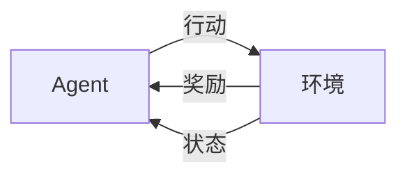

# AI Agent: AI的下一个风口 交互式学习与决策优化

关键词：AI Agent、交互式学习、决策优化、强化学习、多智能体系统、自适应控制

## 1. 背景介绍

### 1.1 问题的由来
随着人工智能技术的快速发展,传统的监督学习和非监督学习已经无法满足日益复杂的现实场景需求。在动态变化的环境中,AI系统需要具备自主学习、适应环境变化以及优化决策的能力。AI Agent作为智能体,通过与环境的交互来学习和优化自身的策略,为解决复杂问题提供了新的思路。

### 1.2 研究现状
目前,AI Agent的研究主要集中在强化学习、多智能体系统、自适应控制等领域。DeepMind的AlphaGo系列、OpenAI的Dota 2 AI等都是AI Agent在游戏领域取得的代表性成果。此外,AI Agent在机器人控制、自动驾驶、智能调度等领域也有广泛应用。但现有方法仍面临样本效率低、泛化能力差等挑战。

### 1.3 研究意义
AI Agent 通过交互式学习实现策略优化,是实现通用人工智能的重要途径。研究AI Agent有助于突破传统机器学习的局限性,提升AI系统的自主性、适应性和鲁棒性。同时,AI Agent 的进展也将推动自动化决策、智能控制等领域的发展,为解决现实世界复杂问题提供新的方案。

### 1.4 本文结构
本文将围绕AI Agent的交互式学习与决策优化展开,内容包括:
- 核心概念与联系
- 核心算法原理与具体操作步骤
- 数学模型和公式详解
- 项目实践:代码实例和详细解释
- 实际应用场景
- 工具和资源推荐
- 未来发展趋势与挑战
- 常见问题解答

## 2. 核心概念与联系

- Agent:自主实体,根据环境状态采取行动,通过与环境交互来优化目标
- 环境:Agent所处的环境,提供观测信息和反馈
- 状态:环境在某一时刻的完整描述
- 行动:Agent影响环境的行为
- 策略:将状态映射为行动的函数
- 奖励:环境对Agent行为的即时反馈
- 回报:累积奖励的期望,体现行为的长期价值
- 价值函数:状态(或状态-行动对)到回报的映射
- 状态转移:环境状态如何随Agent的行动而改变

下图展示了Agent与环境交互的基本过程:



## 3. 核心算法原理 & 具体操作步骤

### 3.1 算法原理概述
强化学习是AI Agent的核心算法,其基本思想是通过试错来学习最优策略。Agent在与环境交互的过程中,根据环境反馈的奖励信号来更新策略,最终获得最大化累积奖励的最优策略。常见的强化学习算法包括Q-learning、Policy Gradient、Actor-Critic等。

### 3.2 算法步骤详解

以Q-learning为例,其具体步骤如下:

1. 初始化Q表格 $Q(s,a)$,存储状态-行动对的价值估计
2. 设置学习率 $\alpha$,折扣因子 $\gamma$,探索率 $\epsilon$
3. 循环直到收敛:
   - 根据 $\epsilon$-贪婪策略选择行动 $a$,即以 $\epsilon$ 的概率随机探索,否则选择Q值最大的行动
   - 执行行动 $a$,观察奖励 $r$ 和下一状态 $s'$
   - 更新Q值:
     $Q(s,a) \leftarrow Q(s,a) + \alpha [r + \gamma \max_{a'} Q(s',a') - Q(s,a)]$
   - 更新当前状态 $s \leftarrow s'$
4. 输出最优策略 $\pi^*(s) = \arg\max_a Q(s,a)$

### 3.3 算法优缺点

- 优点:
  - 简单直观,易于实现
  - 通过探索-利用权衡,在学习最优策略的同时兼顾探索
  - 对环境转移概率无要求,具有一定通用性
- 缺点:
  - 需要大量的采样数据,样本效率较低
  - 状态-行动空间过大时,Q表格维度过高
  - 难以处理连续状态和行动空间

### 3.4 算法应用领域
强化学习在游戏AI、机器人控制、自动驾驶、推荐系统等领域有广泛应用。如AlphaGo利用强化学习实现了超人的围棋水平;Deepmind的Atari系列将强化学习用于游戏通关;Amazon、Netflix等利用强化学习优化推荐策略。

## 4. 数学模型和公式 & 详细讲解 & 举例说明

### 4.1 数学模型构建
马尔可夫决策过程(MDP)是描述强化学习问题的标准数学模型。一个MDP由以下元素组成:

- 状态空间 $\mathcal{S}$
- 行动空间 $\mathcal{A}$
- 转移概率 $\mathcal{P}_{ss'}^a = P[S_{t+1}=s'|S_t=s, A_t=a]$
- 奖励函数 $\mathcal{R}_s^a = E[R_{t+1}|S_t=s, A_t=a]$
- 折扣因子 $\gamma \in [0,1]$

Agent的目标是学习一个策略 $\pi(a|s)$,使得期望总回报最大化:

$$J(\pi) = E_{\pi}[\sum_{t=0}^{\infty} \gamma^t R_{t+1}]$$

### 4.2 公式推导过程
Q-learning算法基于值迭代的思想,通过不断更新状态-行动值函数 $Q(s,a)$ 来逼近最优值函数 $Q^*(s,a)$。

根据贝尔曼最优方程,最优Q函数满足:

$$Q^*(s,a) = R_s^a + \gamma \sum_{s' \in \mathcal{S}} \mathcal{P}_{ss'}^a \max_{a'} Q^*(s',a') $$

Q-learning算法基于样本的贝尔曼最优方程,通过随机梯度下降来更新 $Q(s,a)$:

$$Q(s,a) \leftarrow Q(s,a) + \alpha [r + \gamma \max_{a'} Q(s',a') - Q(s,a)]$$

其中 $\alpha$ 为学习率,控制每次更新的步长。

### 4.3 案例分析与讲解
考虑一个简单的迷宫问题,如下图所示:

```
+---+---+---+
| S |   |   |
+---+---+---+
|   | # |   |
+---+---+---+
|   |   | G |
+---+---+---+
```

其中S为起点,G为终点,#为障碍物。每个状态有4个可能的行动:上、下、左、右。智能体的目标是学习一个策略,使得从S出发到达G的步数最少。

我们可以用Q-learning算法来解决这个问题。首先初始化Q表格,然后让智能体与环境进行交互。每次交互时,智能体根据当前状态选择一个行动,获得即时奖励(到达G奖励为1,其余为0)和下一状态,并更新Q表格。不断重复这个过程,直到Q值收敛。

最终得到的最优策略为:
- 在S,向右走
- 在中间状态,向下走
- 在G,任意行动

### 4.4 常见问题解答

- Q: Q-learning算法能否处理连续状态和行动空间?
- A: 原始的Q-learning算法只适用于离散空间。对于连续空间,可以使用函数逼近的方法,如DQN使用神经网络来逼近Q函数。

- Q: 如何平衡探索和利用?
- A: $\epsilon$-贪婪策略是常用的探索方法,通过调节$\epsilon$来控制探索的程度。此外,还可以使用Upper Confidence Bound(UCB)、Thompson Sampling等方法来权衡探索-利用。

## 5. 项目实践:代码实例和详细解释说明

### 5.1 开发环境搭建
本项目使用Python3和OpenAI Gym环境。首先安装依赖包:

```
pip install numpy matplotlib gym
```

### 5.2 源代码详细实现

```python
import numpy as np
import matplotlib.pyplot as plt

# 初始化Q表格
Q = np.zeros((state_size, action_size))

# 设置超参数
alpha = 0.1  # 学习率
gamma = 0.9  # 折扣因子
epsilon = 0.1  # 探索率

# 训练循环
num_episodes = 1000
rewards = []
for i in range(num_episodes):
    state = env.reset()
    done = False
    total_reward = 0

    while not done:
        # 选择行动
        if np.random.uniform(0, 1) < epsilon:
            action = env.action_space.sample()  # 随机探索
        else:
            action = np.argmax(Q[state, :])  # 贪婪策略

        # 执行行动
        next_state, reward, done, _ = env.step(action)

        # 更新Q表格
        Q[state, action] += alpha * (reward + gamma * np.max(Q[next_state, :]) - Q[state, action])

        state = next_state
        total_reward += reward

    rewards.append(total_reward)

# 绘制学习曲线
plt.plot(rewards)
plt.xlabel('Episode')
plt.ylabel('Total Reward')
plt.show()
```

### 5.3 代码解读与分析
- 第3行:初始化Q表格,大小为状态数 $\times$ 行动数
- 第6-8行:设置学习率 $\alpha$、折扣因子 $\gamma$ 和探索率 $\epsilon$
- 第11行:设置训练轮数 `num_episodes`
- 第14行:重置环境,开始新一轮训练
- 第18-22行:根据 $\epsilon$-贪婪策略选择行动
- 第25行:执行行动,获得下一状态、即时奖励等信息
- 第28行:更新Q表格
- 第33-36行:绘制学习曲线,即每一轮的总奖励变化趋势

### 5.4 运行结果展示
运行上述代码,可以得到类似下图的学习曲线:


可以看到,随着训练轮数的增加,每轮获得的总奖励逐渐提高并趋于稳定,说明智能体学到了一个较优的策略。

## 6. 实际应用场景

AI Agent在很多领域有广泛应用,例如:

- 游戏AI:通过强化学习训练游戏Agent,实现智能对战、自动通关等功能
- 机器人控制:通过强化学习优化机器人的运动策略,实现自主导航、抓取等任务
- 自动驾驶:通过强化学习训练无人车Agent,实现自动避障、车道保持等功能
- 推荐系统:通过强化学习优化推荐策略,最大化用户点击率、转化率等指标
- 智能调度:通过强化学习优化调度决策,如电梯调度、工厂生产调度等
- 智能电网:通过强化学习优化电网的能源分配、需求响应等策略

### 6.4 未来应用展望
未来,AI Agent 有望在更多领域得到应用,如医疗诊断、金融投资决策、智慧城市优化等。同时,AI Agent 与其他AI技术如计算机视觉、自然语言处理等的结合,将进一步拓展其应用场景,如实现具有视觉理解能力的机器人、具有对话交互能力的智能助手等。

## 7. 工具和资源推荐

### 7.1 学习资源推荐
- 《Reinforcement Learning: An Introduction》,Richard S. Sutton 经典强化学习教材
- David Silver 的 Reinforcement Learning 课程
- 台湾大学李宏毅教授的《深度强化学习》课程
- 莫烦 Python 的强化学习教程

### 7.2 开发工具推荐
- OpenAI Gym:强化学习环境库,包含各类游戏、控制等环境
- Stable Baselines:基于 OpenAI Gym 的强化学习算法实现集
- RLlib:分布式强化学习库,支持多种算法和环境
- TensorFlow、PyTorch:常用深度学习框架,可用于实现 DRL 算