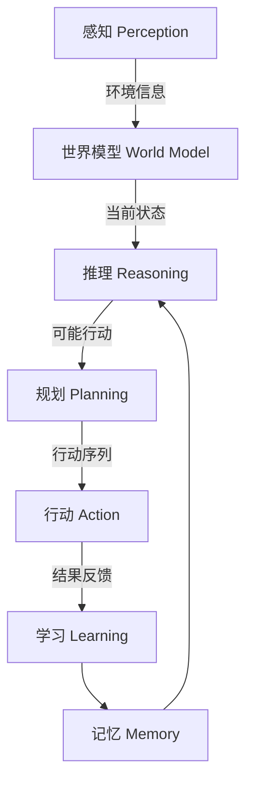

# AI Agent: AI的下一个风口 大模型时代狂飙猛进

## 1. 背景介绍

### 1.1 问题的由来

在过去的几年里,人工智能(AI)领域取得了令人瞩目的进展。自2017年以来,transformer模型的出现,以及大规模语言模型(LLM)和多模态模型的兴起,极大地推动了AI的发展。这些突破性的进展为AI系统带来了前所未有的能力,使它们能够理解和生成自然语言、分析和生成图像、视频和其他多模态数据。

然而,这些模型的规模和复杂性也带来了新的挑战。训练和部署这些大型模型需要大量的计算资源,这使得它们的使用成本很高,并且对环境产生了不利影响。此外,这些模型的内在机理仍然是一个黑盒子,缺乏可解释性和可控性,这可能会导致不可预测的行为和潜在的风险。

### 1.2 研究现状

为了应对这些挑战,研究人员提出了AI Agent的概念,旨在开发一种新型的AI系统,能够更高效、更可解释、更可控地执行各种任务。AI Agent被设计为一种通用的智能体,能够根据用户的需求和环境的变化动态调整自身的行为和决策。

目前,AI Agent的研究主要集中在以下几个方面:

1. **多模态交互**:开发能够通过自然语言、图像、视频等多种模态与人类进行无缝交互的AI Agent。
2. **可解释性和可控性**:提高AI Agent的可解释性和可控性,使其决策过程更加透明,并允许人类对其行为进行监督和调整。
3. **持续学习和自我调整**:赋予AI Agent持续学习和自我调整的能力,使其能够根据新的数据和环境动态更新自身的知识和行为。
4. **任务规划和决策**:开发高效的任务规划和决策算法,使AI Agent能够根据目标和约束条件生成最优的行动序列。
5. **多智能体协作**:探索多个AI Agent之间的协作机制,以解决复杂的问题和任务。

### 1.3 研究意义

AI Agent的研究对于推动人工智能的发展具有重要意义:

1. **提高AI系统的效率和可扩展性**:通过设计通用的智能体架构,AI Agent能够更高效地处理各种任务,并且易于扩展到新的领域。
2. **增强AI系统的可解释性和可控性**:提高AI Agent的可解释性和可控性,有助于建立人类对AI系统的信任,并降低潜在的风险。
3. **促进人机协作**:AI Agent能够与人类进行自然的交互和协作,从而扩展人类的认知和决策能力。
4. **推动AI技术的实际应用**:AI Agent的研究有助于将AI技术应用于更多的实际场景,如智能助手、自动驾驶、智能制造等。

### 1.4 本文结构

本文将全面介绍AI Agent的核心概念、算法原理、数学模型、实践应用和未来发展趋势。具体内容安排如下:

1. 核心概念与联系
2. 核心算法原理与具体操作步骤
3. 数学模型和公式详细讲解与举例说明
4. 项目实践:代码实例和详细解释说明
5. 实际应用场景
6. 工具和资源推荐
7. 总结:未来发展趋势与挑战
8. 附录:常见问题与解答

## 2. 核心概念与联系

AI Agent是一种通用的智能体架构,旨在集成多种AI技术,如自然语言处理、计算机视觉、知识表示与推理、规划与决策等,以实现高效、可解释和可控的智能行为。AI Agent的核心概念包括:

1. **感知(Perception)**:通过各种传感器(如摄像头、麦克风等)获取环境信息,并将其转换为内部表示。
2. **世界模型(World Model)**:基于感知到的信息构建对环境的内部表示,包括物体、事件、规则等。
3. **记忆(Memory)**:存储过去的经验和知识,用于指导未来的决策和行为。
4. **推理(Reasoning)**:基于世界模型和记忆,对当前状态进行分析和推理,生成可能的行动方案。
5. **规划(Planning)**:根据目标和约束条件,从可能的行动方案中选择最优序列。
6. **行动(Action)**:执行选定的行动序列,并观察其对环境的影响。
7. **学习(Learning)**:根据行动的结果和反馈,更新世界模型、记忆和决策策略。

这些核心概念相互关联,构成了AI Agent的基本框架。感知和世界模型为推理和规划提供了必要的信息;推理和规划生成行动序列;行动的执行和结果反馈用于更新记忆和学习新的策略。

## 3. 核心算法原理 & 具体操作步骤

### 3.1 算法原理概述

AI Agent的核心算法原理基于马尔可夫决策过程(MDP)和强化学习(RL)理论。MDP是一种用于建模序列决策问题的数学框架,描述了智能体在环境中采取行动、获得奖励并转移到下一个状态的过程。RL则是一种基于MDP的机器学习算法,旨在通过试错和反馈来学习最优的决策策略。

在AI Agent中,世界模型可以看作是MDP的一个近似表示,包括状态空间、行动空间和状态转移概率。推理模块根据当前状态和世界模型,生成可能的行动序列。规划模块则利用RL算法,从这些行动序列中选择能够最大化累积奖励的序列。

具体来说,AI Agent的核心算法可以分为以下几个步骤:

1. **状态表示**:将环境信息转换为内部状态表示,作为MDP的状态空间。
2. **奖励函数**:定义奖励函数,用于量化行动序列的好坏。
3. **策略估计**:利用RL算法(如Q-Learning、策略梯度等)估计最优的决策策略,即在给定状态下选择最优行动的函数。
4. **策略改进**:根据行动的结果和奖励,不断更新策略,使其逼近最优策略。
5. **行动选择**:根据当前状态和估计的策略,选择最优的行动序列执行。

### 3.2 算法步骤详解

以下是AI Agent核心算法的详细步骤:

1. **初始化**:
   - 定义状态空间 $\mathcal{S}$、行动空间 $\mathcal{A}$ 和奖励函数 $R(s, a)$。
   - 初始化策略 $\pi(a|s)$,表示在状态 $s$ 下选择行动 $a$ 的概率分布。
   - 初始化值函数 $Q(s, a)$,表示在状态 $s$ 下执行行动 $a$ 的长期累积奖励。

2. **感知环境**:
   - 通过传感器获取环境信息,并将其转换为内部状态表示 $s_t \in \mathcal{S}$。

3. **选择行动**:
   - 根据当前策略 $\pi(a|s_t)$ 选择行动 $a_t \in \mathcal{A}$。
   - 常用的选择方法包括 $\epsilon$-贪婪策略和软max策略。

4. **执行行动**:
   - 在环境中执行选定的行动 $a_t$。
   - 观察环境的反馈,获取下一个状态 $s_{t+1}$ 和即时奖励 $r_t = R(s_t, a_t)$。

5. **更新值函数**:
   - 根据经验 $(s_t, a_t, r_t, s_{t+1})$ 更新值函数 $Q(s_t, a_t)$。
   - 常用的更新方法包括Q-Learning和SARSA算法。

6. **更新策略**:
   - 根据更新后的值函数 $Q(s, a)$,更新策略 $\pi(a|s)$。
   - 常用的更新方法包括策略梯度算法和Actor-Critic算法。

7. **重复步骤2-6**,直到策略收敛或达到预定的迭代次数。

8. **输出最终策略**:
   - 得到最优策略 $\pi^*(a|s)$,用于在新的状态下选择最优行动。

### 3.3 算法优缺点

AI Agent核心算法的优点包括:

1. **通用性**:基于MDP和RL理论,可以应用于各种序列决策问题。
2. **自适应性**:通过不断学习和更新策略,能够适应环境的变化。
3. **最优性**:理论上可以找到最优的决策策略。

缺点包括:

1. **维数灾难**:状态空间和行动空间过大时,算法效率低下。
2. **样本效率低**:需要大量的经验样本才能学习到有效的策略。
3. **奖励稀疏**:当即时奖励信号稀疏时,算法收敛缓慢。

### 3.4 算法应用领域

AI Agent核心算法可以应用于各种序列决策问题,包括但不限于:

1. **机器人控制**:规划机器人在复杂环境中的运动轨迹和操作序列。
2. **游戏AI**:训练AI代理人在各种游戏中做出最优决策。
3. **自动驾驶**:规划无人驾驶汽车在复杂交通环境中的行驶路线和操作。
4. **智能调度**:优化资源分配和任务调度,如工厂生产线调度、计算资源调度等。
5. **智能对话**:根据对话历史和上下文,生成自然且合理的回复。

## 4. 数学模型和公式 & 详细讲解 & 举例说明

### 4.1 数学模型构建

AI Agent的数学模型基于马尔可夫决策过程(MDP)理论。MDP是一种用于建模序列决策问题的数学框架,由一个五元组 $(\mathcal{S}, \mathcal{A}, P, R, \gamma)$ 定义:

- $\mathcal{S}$ 是状态空间的集合,表示环境的所有可能状态。
- $\mathcal{A}$ 是行动空间的集合,表示智能体可以执行的所有行动。
- $P(s'|s, a)$ 是状态转移概率函数,表示在状态 $s$ 下执行行动 $a$ 后,转移到状态 $s'$ 的概率。
- $R(s, a)$ 是奖励函数,定义在状态 $s$ 下执行行动 $a$ 获得的即时奖励。
- $\gamma \in [0, 1)$ 是折现因子,用于权衡即时奖励和长期累积奖励的重要性。

在MDP框架下,智能体的目标是找到一个策略 $\pi: \mathcal{S} \rightarrow \mathcal{A}$,使得在遵循该策略时,能够最大化预期的长期累积奖励,即:

$$
\max_\pi \mathbb{E}_\pi \left[ \sum_{t=0}^\infty \gamma^t R(s_t, a_t) \right]
$$

其中,$s_t$ 和 $a_t$ 分别表示在时间步 $t$ 的状态和行动,它们遵循策略 $\pi$ 和状态转移概率 $P$。

### 4.2 公式推导过程

为了找到最优策略,我们可以定义状态值函数 $V^\pi(s)$ 和状态-行动值函数 $Q^\pi(s, a)$,分别表示在策略 $\pi$ 下,从状态 $s$ 开始执行,预期的长期累积奖励:

$$
\begin{aligned}
V^\pi(s) &= \mathbb{E}_\pi \left[ \sum_{t=0}^\infty \gamma^t R(s_t, a_t) \mid s_0 = s \right] \
Q^\pi(s, a) &= \mathbb{E}_\pi \left[ \sum_{t=0}^\infty \gamma^t R(s_t, a_t) \mid s_0 = s, a_0 = a \right]
\end{aligned}
$$

利用贝尔