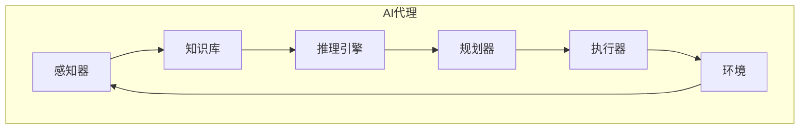

好的,我明白了您的要求。以下是题为《AI Agent: AI的下一个风口 高度自动化带来生产力革命》的技术博客文章正文部分:

# AI Agent: AI的下一个风口 高度自动化带来生产力革命

## 1. 背景介绍

### 1.1 问题的由来

在当今快节奏的商业环境中,企业面临着前所未有的压力,需要提高效率、降低成本并加快创新步伐。人工智能(AI)技术的出现为解决这些挑战提供了新的途径。AI代理(AI Agent)作为AI技术的一个重要分支,正在引领着自动化革命的新浪潮。

传统的自动化系统通常是基于预定义的规则和流程,缺乏灵活性和适应性。而AI代理则具有自主学习和决策的能力,可以根据环境的变化做出智能响应,从而实现更高层次的自动化。

### 1.2 研究现状

近年来,AI代理技术取得了长足的进步,在多个领域展现出巨大的潜力。例如,在客户服务领域,AI代理可以通过自然语言处理技术与用户进行自然对话,提供个性化的服务体验。在制造业,AI代理可以优化生产流程,提高效率和产品质量。在金融领域,AI代理可以进行实时风险评估和投资决策。

然而,AI代理技术仍然面临着一些挑战,例如可解释性、安全性和可靠性等问题。此外,AI代理的广泛应用也带来了一些伦理和社会影响的考量。

### 1.3 研究意义

AI代理技术的发展将带来生产力的革命性提升,有望深刻影响各行各业的运营模式。通过自动化复杂任务和优化决策流程,AI代理可以显著提高企业的效率和竞争力。同时,AI代理也将为人类创造新的就业机会,释放出更多的创造力和创新潜能。

本文将全面探讨AI代理技术的核心概念、算法原理、数学模型、实际应用以及未来发展趋势,旨在为读者提供一个深入的技术视角,并启发思考AI代理技术带来的影响和挑战。

### 1.4 本文结构

本文共分为9个部分:

1. 背景介绍
2. 核心概念与联系
3. 核心算法原理与具体操作步骤
4. 数学模型和公式详细讲解与举例说明
5. 项目实践:代码实例和详细解释说明
6. 实际应用场景
7. 工具和资源推荐
8. 总结:未来发展趋势与挑战
9. 附录:常见问题与解答

## 2. 核心概念与联系

AI代理是一种具有自主性的软件实体,能够感知环境、处理信息、做出决策并采取行动。它是AI技术在实际应用中的关键载体,体现了AI系统的智能特性。

AI代理通常由以下几个核心组件构成:

1. **感知器(Sensor)**: 用于从环境中获取数据和信息,如视觉、语音、文本等输入。
2. **知识库(Knowledge Base)**: 存储代理所掌握的领域知识和规则。
3. **推理引擎(Inference Engine)**: 根据知识库和感知器获取的信息,进行推理和决策。
4. **规划器(Planner)**: 制定行动计划,确定实现目标所需的一系列操作步骤。
5. **执行器(Actuator)**: 将规划器生成的行动计划转化为具体的行动,如控制机器人运动或发送指令。

这些组件通过复杂的交互实现了AI代理的智能行为。下图展示了AI代理的基本架构:

AI代理可以广泛应用于不同领域,如机器人控制、游戏AI、自动驾驶、智能助理等。根据应用场景的不同,AI代理的具体实现和算法也会有所差异。

## 3. 核心算法原理与具体操作步骤

### 3.1 算法原理概述

AI代理的核心算法原理是基于**有限状态机(Finite State Machine, FSM)**和**马尔可夫决策过程(Markov Decision Process, MDP)**等概念。

**有限状态机**描述了代理在不同状态下的行为模式。每个状态对应一种特定的情况,代理根据当前状态和接收到的输入,按照预定义的转移规则切换到下一个状态,并执行相应的动作。

**马尔可夫决策过程**则是一种更加通用和强大的框架,用于描述代理在不确定环境中的决策过程。MDP包括以下几个要素:

- **状态集合(State Space) S**: 描述代理所处的所有可能状态。
- **动作集合(Action Space) A**: 代理可执行的所有可能动作。
- **转移概率(Transition Probability) P(s'|s,a)**: 在当前状态 s 下执行动作 a 后,转移到状态 s' 的概率。
- **奖励函数(Reward Function) R(s,a,s')**: 在当前状态 s 下执行动作 a 并转移到状态 s' 时获得的即时奖励。
- **折扣因子(Discount Factor) γ**: 用于权衡即时奖励和长期累积奖励的重要性。

MDP的目标是找到一个最优策略 π*,使代理在执行该策略时能够maximizeize其预期的长期累积奖励。

### 3.2 算法步骤详解

基于MDP框架,AI代理通常采用**强化学习(Reinforcement Learning)**算法来学习最优策略。以下是一种常见的强化学习算法 **Q-Learning** 的具体步骤:

1. **初始化**: 初始化 Q 表格,其中 Q(s,a) 表示在状态 s 下执行动作 a 的长期累积奖励估计值。所有 Q 值初始化为任意值(如 0)。

2. **选择动作**: 对于当前状态 s,根据某种策略(如 ε-greedy)选择一个动作 a。ε-greedy 策略表示有 ε 的概率随机选择动作(探索),1-ε 的概率选择 Q 值最大的动作(利用)。

3. **执行动作并观察结果**: 执行选择的动作 a,观察环境的反馈,获取执行该动作后的新状态 s' 和即时奖励 r。

4. **更新 Q 值**: 根据下式更新 Q(s,a) 的估计值:

$$Q(s,a) \leftarrow Q(s,a) + \alpha \left[ r + \gamma \max_{a'} Q(s',a') - Q(s,a) \right]$$

其中:
- α 是学习率,控制新信息对 Q 值的影响程度。
- γ 是折扣因子,控制未来奖励的重要性。
- $\max_{a'} Q(s',a')$ 是在新状态 s' 下可获得的最大预期累积奖励。

5. **重复步骤 2-4**: 重复以上过程,直到 Q 值收敛或达到预定的终止条件。

通过不断与环境交互并更新 Q 值,算法最终会收敛到一个近似最优的策略。在实际应用中,还可以结合神经网络等技术来提高算法的性能和泛化能力。

### 3.3 算法优缺点

**优点**:

- **通用性强**: 强化学习算法不需要事先的模型知识,只需要通过与环境交互来学习,因此具有很强的通用性。
- **可处理连续状态和动作空间**: 与传统的有限状态机相比,强化学习算法可以处理连续的状态和动作空间,更加贴近实际应用场景。
- **在线学习**: 算法可以在与环境交互的过程中持续学习和改进策略,无需事先收集大量训练数据。

**缺点**:

- **收敛性**: 强化学习算法的收敛性和收敛速度受到状态空间大小、奖励函数设计等多方面因素的影响,在复杂问题上可能需要大量的训练时间和计算资源。
- **样本利用效率低**: 与监督学习相比,强化学习算法通常需要更多的探索和交互来获取有效的训练样本。
- **奖励函数设计困难**: 合理设计奖励函数对算法的性能至关重要,但在复杂场景下很难手动设计出合适的奖励函数。

### 3.4 算法应用领域

强化学习算法在以下领域有广泛的应用:

- **机器人控制**: 训练机器人在各种环境下执行复杂任务,如行走、抓取、导航等。
- **游戏AI**: 训练AI代理玩各种电子游戏,如国际象棋、围棋、视频游戏等。
- **自动驾驶**: 训练自动驾驶系统在复杂的道路环境中安全行驶。
- **智能调度**: 优化资源调度、作业调度等决策过程。
- **自动化交易**: 设计智能交易策略,实现自动化交易决策。
- **智能控制**: 应用于工业控制、能源系统控制等领域。

## 4. 数学模型和公式详细讲解与举例说明

### 4.1 数学模型构建

在构建AI代理的数学模型时,我们通常采用**马尔可夫决策过程(MDP)** 作为基础框架。MDP可以形式化描述代理与环境的交互过程,并为求解最优策略提供了理论基础。

一个MDP可以用一个五元组 $(S, A, P, R, \gamma)$ 来表示,其中:

- $S$ 是代理可能处于的**状态集合**,通常是一个有限或可数无穷集合。
- $A$ 是代理可执行的**动作集合**,也是一个有限或可数无穷集合。
- $P(s'|s,a)$ 是**状态转移概率函数**,表示在状态 $s$ 下执行动作 $a$ 后,转移到状态 $s'$ 的概率。
- $R(s,a,s')$ 是**奖励函数**,表示在状态 $s$ 下执行动作 $a$ 并转移到状态 $s'$ 时获得的即时奖励。
- $\gamma \in [0,1)$ 是**折扣因子**,用于权衡即时奖励和长期累积奖励的重要性。

在MDP框架下,我们的目标是找到一个**策略(Policy) $\pi$**,使得在执行该策略时,代理可以获得最大的预期长期累积奖励。策略 $\pi$ 是一个映射函数,将状态映射到动作,即 $\pi: S \rightarrow A$。

对于给定的策略 $\pi$,我们可以定义其在状态 $s$ 下的**价值函数(Value Function) $V^\pi(s)$**,表示执行该策略时从状态 $s$ 开始所能获得的预期长期累积奖励:

$$V^\pi(s) = \mathbb{E}_\pi \left[ \sum_{t=0}^\infty \gamma^t R(s_t, a_t, s_{t+1}) \mid s_0 = s \right]$$

其中,$ \mathbb{E}_\pi$ 表示在策略 $\pi$ 下的期望值计算。

类似地,我们还可以定义**状态-动作价值函数(State-Action Value Function) $Q^\pi(s,a)$**,表示在状态 $s$ 下执行动作 $a$,之后继续执行策略 $\pi$ 所能获得的预期长期累积奖励:

$$Q^\pi(s,a) = \mathbb{E}_\pi \left[ \sum_{t=0}^\infty \gamma^t R(s_t, a_t, s_{t+1}) \mid s_0 = s, a_0 = a \right]$$

价值函数和状态-动作价值函数为我们提供了评估策略优劣的标准,并为求解最优策略奠定了基础。

### 4.2 公式推导过程

在强化学习算法中,我们通常采用**贝尔曼方程(Bellman Equation)**来表示价值函数和状态-动作价值函数,并基于此推导出更新规则。

对于价值函数 $V^\pi(s)$,其贝尔曼方程可以写为:

$$V^\pi(s) = \sum_{a \in A} \pi(a|s) \sum_{s' \in S} P(s'|s,a) \left[ R(s,a,s') + \gamma V^\pi(s