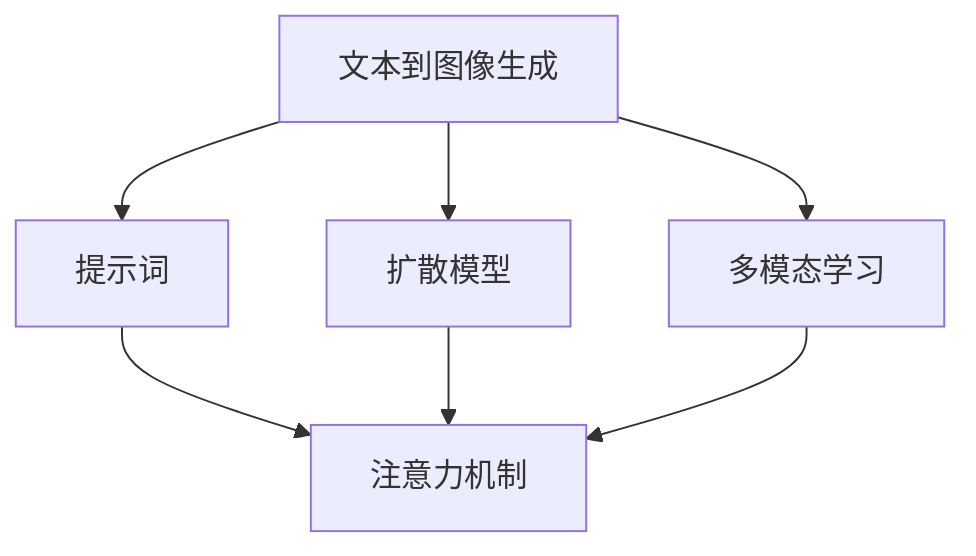

# AIGC从入门到实战：绘制美丽小姐姐的提示词写作技巧

## 1. 背景介绍

### 1.1 问题的由来

在人工智能生成内容(AIGC)领域中,文本到图像生成(Text-to-Image)技术近年来取得了长足进展。通过输入自然语言描述,AI模型能够生成逼真的图像,为创作者提供了无限可能。然而,如何编写高质量的提示词(Prompts)以获得理想的生成结果,仍然是一个挑战。

### 1.2 研究现状

目前,提示词工程(Prompt Engineering)已成为AIGC领域的热门话题。研究人员和爱好者们不断探索优化提示词的方法,以提高生成图像的质量和控制能力。一些常见的技巧包括:

- 使用详细的描述性语言
- 融入风格参考
- 添加约束条件
- 采用迭代优化策略

然而,这些技巧往往依赖于大量的试错和经验积累,缺乏系统性的指导。

### 1.3 研究意义

掌握提示词写作技巧对于AIGC创作者至关重要。高质量的提示词不仅能够生成更加精美的图像,还能够更好地捕捉创作者的意图,提高创作效率。本文旨在系统地探讨提示词写作的原理和方法,为AIGC爱好者提供实用的指导。

### 1.4 本文结构

本文将从以下几个方面深入探讨提示词写作技巧:

1. 核心概念与联系
2. 核心算法原理与具体操作步骤
3. 数学模型和公式详细讲解与案例分析
4. 项目实践:代码实例和详细解释
5. 实际应用场景
6. 工具和资源推荐
7. 总结:未来发展趋势与挑战
8. 附录:常见问题与解答

## 2. 核心概念与联系

在深入探讨提示词写作技巧之前,我们需要了解一些核心概念及其相互关系。

### 2.1 文本到图像生成(Text-to-Image)

文本到图像生成是指根据自然语言描述生成相应图像的任务。它属于AIGC领域的一个重要分支,涉及自然语言处理(NLP)和计算机视觉(CV)等多个领域的知识。

### 2.2 提示词(Prompts)

提示词是指用于描述期望生成图像的自然语言文本。高质量的提示词对于获得理想的生成结果至关重要。提示词写作技巧旨在优化提示词的表达,以提高生成图像的质量和控制能力。

### 2.3 扩散模型(Diffusion Models)

扩散模型是当前文本到图像生成任务中广泛采用的一种生成模型。它通过学习数据分布,逐步从噪声中"扩散"出图像。提示词写作技巧与扩散模型的内部机制密切相关。

### 2.4 多模态学习(Multimodal Learning)

多模态学习是指同时处理多种模态数据(如文本、图像、视频等)的机器学习范式。文本到图像生成任务属于多模态学习的一个典型应用场景,需要同时处理文本和图像两种模态数据。

### 2.5 注意力机制(Attention Mechanism)

注意力机制是深度学习中的一种关键技术,它允许模型selectively关注输入数据的不同部分。在文本到图像生成任务中,注意力机制被用于捕捉提示词和生成图像之间的关系。

### 2.6 概念关系总结

以上核心概念之间的关系可以用下图总结:

提示词写作技巧需要综合考虑这些核心概念及其内在联系,才能更好地指导AIGC创作实践。

## 3. 核心算法原理与具体操作步骤

### 3.1 算法原理概述

文本到图像生成任务的核心算法原理可以概括为以下几个关键步骤:

1. **文本编码**:将提示词(自然语言描述)编码为语义向量表示。
2. **条件噪声采样**:根据语义向量,从先验噪声分布中采样条件噪声。
3. **反向扩散过程**:通过反向扩散网络,逐步从条件噪声中"扩散"出图像。
4. **注意力融合**:在反向扩散过程中,使用注意力机制融合语义向量和图像特征。

这一原理在不同的扩散模型架构中有所体现,但核心思想是相似的。

### 3.2 算法步骤详解

我们以广为人知的稳定扩散(Stable Diffusion)模型为例,详细解释算法的具体步骤。

#### 3.2.1 文本编码

稳定扩散模型使用CLIP(对比语言图像预训练)模型对提示词进行编码。CLIP是一种双编码器结构,包含一个文本编码器和一个图像编码器。文本编码器将提示词映射为语义向量表示,用于后续的条件噪声采样和注意力融合。

#### 3.2.2 条件噪声采样

根据文本编码得到的语义向量,稳定扩散模型从高斯噪声先验分布中采样条件噪声。这一步骤将语义信息融入到噪声中,为后续的反向扩散过程提供条件。

#### 3.2.3 反向扩散过程

反向扩散过程是稳定扩散模型的核心部分。它包含多个反向扩散步骤,每一步都会从当前的噪声图像中"扩散"出更清晰的图像。这一过程由一个U-Net结构的反向扩散网络完成。

在每个反向扩散步骤中,反向扩散网络会融合当前噪声图像的特征和语义向量,并预测出一个残差图像。通过将残差图像与当前噪声图像相加,就能得到下一步的噪声图像,逐步向最终的目标图像逼近。

#### 3.2.4 注意力融合

在反向扩散过程中,稳定扩散模型采用注意力机制将语义向量和图像特征进行融合。具体来说,反向扩散网络的每个注意力块都会计算语义向量和图像特征之间的注意力权重,并据此对特征进行加权融合。

这一机制确保了语义信息在整个反向扩散过程中得到充分利用,从而使生成的图像能够更好地匹配提示词的描述。

### 3.3 算法优缺点

#### 优点

- **生成质量高**:扩散模型能够生成逼真、细节丰富的图像,质量优于以前的生成对抗网络(GAN)等模型。
- **控制能力强**:通过优化提示词,可以较好地控制生成图像的内容、风格等方面。
- **训练稳定**:扩散模型的训练过程相对稳定,不易出现模式崩溃等问题。

#### 缺点

- **推理速度慢**:反向扩散过程需要多个迭代步骤,推理速度较慢。
- **计算资源消耗大**:训练和推理过程都需要大量的计算资源。
- **提示词工程挑战**:编写高质量的提示词需要一定的技巧和经验,存在一定的学习曲线。

### 3.4 算法应用领域

文本到图像生成技术及其核心算法可以应用于多个领域,包括但不限于:

- **数字艺术创作**:艺术家可以使用提示词生成创意图像,辅助艺术创作。
- **视觉设计**:设计师可以快速生成参考图像,加速设计流程。
- **游戏开发**:游戏开发者可以生成游戏资产,如角色、场景等。
- **科研可视化**:研究人员可以将复杂的概念可视化,辅助科研工作。
- **教育辅助**:教师可以生成教学素材,提高教学效率。

总的来说,文本到图像生成技术为多个领域带来了新的创作和表达方式,具有广阔的应用前景。

## 4. 数学模型和公式详细讲解与举例说明

### 4.1 数学模型构建

为了更好地理解扩散模型的原理,我们需要构建相应的数学模型。假设我们希望学习一个潜在的数据分布 $p_{\text{data}}(x)$,其中 $x$ 表示数据样本(如图像)。扩散模型的基本思想是通过一个正向过程将数据样本逐步"扩散"为噪声,然后再通过一个反向过程从噪声中"扩散"出数据样本。

#### 4.1.1 正向扩散过程

正向扩散过程可以表示为一个马尔可夫链,其中每一步都会将当前的数据样本 $x_t$ 进一步"扩散"为 $x_{t+1}$,直到最终得到纯噪声样本 $x_T$。具体来说,我们定义一个从 $\mathcal{N}(0, 1)$ 分布采样的噪声序列 $\{\epsilon_t\}_{t=1}^T$,则正向过程可以表示为:

$$
q\left(x_{t+1} | x_t\right)=\mathcal{N}\left(x_{t+1} ; \sqrt{1-\beta_t} x_t, \beta_t \mathbf{I}\right)
$$

其中 $\beta_t$ 是一个预定义的方差schedual,控制每一步扩散的程度。通过对该过程进行积分,我们可以得到正向过程的边缘概率密度:

$$
q\left(x_T | x_0\right)=\mathcal{N}\left(x_T ; 0, \sigma_T^2 \mathbf{I}\right), \quad \text { where } \sigma_T^2=\sum_{t=1}^T \beta_t
$$

这表明最终的噪声样本 $x_T$ 服从一个均值为 0、方差为 $\sigma_T^2$ 的高斯分布。

#### 4.1.2 反向扩散过程

反向扩散过程的目标是从噪声样本 $x_T$ 中重构出原始数据样本 $x_0$。根据贝叶斯公式,我们可以得到反向过程的后验概率密度:

$$
p_{\theta}\left(x_{0: T}\right)=p_{\theta}\left(x_T\right) \prod_{t=1}^T p_{\theta}\left(x_{t-1} | x_t\right)
$$

其中 $p_{\theta}(x_T)$ 是噪声先验分布,而 $p_{\theta}(x_{t-1} | x_t)$ 则是由反向扩散模型 $\theta$ 参数化的转移概率密度。我们的目标是最大化该后验概率密度,从而得到最优的反向扩散模型参数 $\theta^*$:

$$
\theta^*=\arg \max _{\theta} \mathbb{E}_{x_0 \sim p_{\text {data }}}\left[\log p_{\theta}\left(x_0\right)\right]
$$

在实际应用中,我们通常采用基于神经网络的近似推断方法,以高效地优化反向扩散模型的参数。

### 4.2 公式推导过程

接下来,我们将推导出反向扩散过程中的关键公式,即条件转移概率密度 $p_{\theta}(x_{t-1} | x_t, x_0)$。这一公式描述了在给定当前噪声样本 $x_t$ 和原始数据样本 $x_0$ 的条件下,如何重构出前一步的样本 $x_{t-1}$。

根据贝叶斯公式,我们有:

$$
\begin{aligned}
p_{\theta}\left(x_{t-1} | x_t, x_0\right) &=\frac{p_{\theta}\left(x_t | x_{t-1}, x_0\right) p_{\theta}\left(x_{t-1} | x_0\right)}{p_{\theta}\left(x_t | x_0\right)} \
&=\frac{p_{\theta}\left(x_t | x_{t-1}, x_0\right) p_{\theta}\left(x_{t-1}\right)}{p_{\theta}\left(x_t\right)}
\end{aligned}
$$

其中:

- $p_{\theta}(x_t | x_{t-1}, x_0)$ 是已知的正向扩散过程的转移概率密度,即 $q(x_t | x_{t-1})$。
- $p_{\theta}(x_{