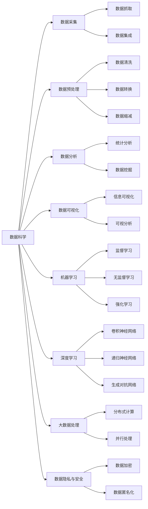

# Data Science 原理与代码实战案例讲解

## 1. 背景介绍

### 1.1 问题的由来

在当今时代，数据已经成为推动商业、科学和社会发展的关键驱动力。随着数据量的快速增长和多样性的扩展,如何高效地从海量数据中提取有价值的信息和知识,已经成为各行业面临的共同挑战。传统的数据处理和分析方法已经无法满足当前复杂数据环境的需求,因此数据科学(Data Science)应运而生。

数据科学是一门跨学科的领域,融合了数学、统计学、计算机科学、领域知识等多种学科,旨在从原始数据中发现模式和洞见,为数据驱动的决策提供支持。它涉及数据采集、处理、分析、可视化和建模等多个环节,需要综合运用多种理论和技术手段。

### 1.2 研究现状

近年来,数据科学受到了广泛的关注和重视。越来越多的企业和组织开始将数据科学作为核心竞争力,并投入大量资源进行相关研究和应用。同时,数据科学也在学术界引起了热烈的讨论和探索,涌现出了诸多创新理论和方法。

当前,数据科学的研究主要集中在以下几个方面:

1. **数据采集和预处理**: 开发高效的数据采集和清洗技术,确保数据的质量和完整性。
2. **数据分析和建模**: 探索新的机器学习和统计学模型,提高数据分析的准确性和可解释性。
3. **大数据处理**: 研究分布式计算和并行处理技术,应对海量数据的挑战。
4. **数据可视化**: 开发直观和交互式的数据可视化工具,帮助人们更好地理解数据。
5. **数据隐私和安全**: 研究数据加密和匿名化技术,保护个人隐私和数据安全。

### 1.3 研究意义

数据科学的研究和应用具有重要的理论和现实意义:

1. **理论意义**:数据科学融合了多个学科的理论和方法,推动了相关学科的交叉融合和发展。同时,数据科学也催生了新的理论和技术,丰富了相关领域的知识体系。

2. **现实意义**:数据科学可以帮助企业和组织从海量数据中挖掘有价值的信息和知识,为决策提供数据驱动的支持。同时,数据科学也在科学研究、社会治理等领域发挥着越来越重要的作用。

### 1.4 本文结构

本文将全面介绍数据科学的核心概念、算法原理、数学模型、代码实践、应用场景、工具资源等内容,旨在为读者提供一个系统的数据科学知识框架。文章结构如下:

```mermaid
graph TD
    A[Data Science 原理与代码实战案例讲解] --> B[背景介绍]
    B --> C1[问题的由来]
    B --> C2[研究现状]
    B --> C3[研究意义]
    B --> C4[本文结构]
    A --> D[核心概念与联系]
    A --> E[核心算法原理&具体操作步骤]
    E --> E1[算法原理概述]
    E --> E2[算法步骤详解]
    E --> E3[算法优缺点]
    E --> E4[算法应用领域]
    A --> F[数学模型和公式&详细讲解&举例说明]
    F --> F1[数学模型构建]
    F --> F2[公式推导过程]
    F --> F3[案例分析与讲解]
    F --> F4[常见问题解答]
    A --> G[项目实践:代码实例和详细解释说明]
    G --> G1[开发环境搭建]
    G --> G2[源代码详细实现]
    G --> G3[代码解读与分析]
    G --> G4[运行结果展示]
    A --> H[实际应用场景]
    H --> H1[应用场景介绍]
    H --> H2[未来应用展望]
    A --> I[工具和资源推荐]
    I --> I1[学习资源推荐]
    I --> I2[开发工具推荐]
    I --> I3[相关论文推荐]
    I --> I4[其他资源推荐]
    A --> J[总结:未来发展趋势与挑战]
    J --> J1[研究成果总结]
    J --> J2[未来发展趋势]
    J --> J3[面临的挑战]
    J --> J4[研究展望]
    A --> K[附录:常见问题与解答]
```

## 2. 核心概念与联系

数据科学是一个庞大而复杂的领域,涉及多个学科的理论和方法。在深入探讨具体技术之前,我们有必要先了解数据科学的核心概念及它们之间的联系。

上图展示了数据科学的核心概念及其内在联系。下面我们将对这些概念进行简要介绍:

1. **数据采集**:数据采集是数据科学的第一步,包括数据抓取和数据集成两个主要环节。数据抓取是从各种数据源(如网站、传感器、日志文件等)获取原始数据的过程;数据集成则是将来自不同源的数据进行整合,形成统一的数据集。

2. **数据预处理**:由于原始数据通常存在噪声、缺失值、不一致性等问题,因此需要进行数据清洗、数据转换和数据缩减等预处理操作,以提高数据质量和可用性。

3. **数据分析**:数据分析是数据科学的核心环节,包括统计分析和数据挖掘两个主要方向。统计分析利用统计学理论和方法对数据进行描述和推断;数据挖掘则是从大量数据中发现隐藏的模式和规律。

4. **数据可视化**:数据可视化是将数据以图形或图像的形式呈现出来,有助于人们更直观地理解和探索数据。信息可视化和可视分析是数据可视化的两个重要分支。

5. **机器学习**:机器学习是数据科学的核心技术之一,它赋予计算机从数据中自动学习和改进的能力。机器学习可分为监督学习、无监督学习和强化学习三大类。

6. **深度学习**:深度学习是机器学习的一个新兴热点方向,它基于人工神经网络,能够自动从数据中学习多层次特征表示。卷积神经网络、递归神经网络和生成对抗网络是深度学习的三大主流模型。

7. **大数据处理**:随着数据量的快速增长,传统的数据处理方法已无法满足需求,因此需要采用分布式计算和并行处理等大数据技术来提高计算效率。

8. **数据隐私与安全**:在数据科学的应用过程中,保护个人隐私和数据安全是一个重要的考虑因素。数据加密和数据匿名化是两种常用的隐私保护技术。

以上概念相互关联、相互依赖,共同构建了数据科学的理论体系和技术框架。只有全面掌握这些核心概念及其内在联系,才能真正理解和应用数据科学。

## 3. 核心算法原理 & 具体操作步骤

### 3.1 算法原理概述

在数据科学中,算法扮演着至关重要的角色。算法是一种明确定义的计算过程,用于解决特定问题或执行特定任务。数据科学算法主要包括以下几个类别:

1. **数据预处理算法**:用于清洗、转换和缩减原始数据,提高数据质量和可用性。常见算法包括插值、归一化、主成分分析(PCA)等。

2. **统计分析算法**:基于统计学理论,对数据进行描述和推断。常见算法包括回归分析、方差分析、时间序列分析等。

3. **数据挖掘算法**:从大量数据中发现隐藏的模式和规律。常见算法包括关联规则挖掘、聚类分析、异常检测等。

4. **机器学习算法**:赋予计算机从数据中自动学习和改进的能力。常见算法包括决策树、支持向量机(SVM)、神经网络等。

5. **优化算法**:用于求解机器学习模型中的参数优化问题。常见算法包括梯度下降、遗传算法、模拟退火等。

6. **并行计算算法**:提高大数据处理效率的关键技术。常见算法包括MapReduce、Spark等。

这些算法各具特色,在数据科学的不同环节发挥着重要作用。掌握它们的原理和实现方法,是成为优秀数据科学家的必备技能。

### 3.2 算法步骤详解

为了更好地理解算法的工作原理,我们以k-means聚类算法为例,详细介绍其具体操作步骤。

k-means是一种常用的无监督学习算法,旨在将n个数据点划分为k个聚类,使得同一聚类内的数据点相似度较高,不同聚类之间的相似度较低。算法步骤如下:

1. **初始化**:随机选择k个数据点作为初始聚类中心。

2. **计算距离**:对于每个数据点,计算它与k个聚类中心的距离,通常使用欧几里得距离:

$$d(x, c) = \sqrt{\sum_{i=1}^{n}(x_i - c_i)^2}$$

其中,x是数据点,c是聚类中心,n是特征维数。

3. **分配簇**:将每个数据点分配到与之距离最近的聚类中。

4. **更新中心**:对于每个聚类,重新计算其所有数据点的均值作为新的聚类中心:

$$c_j = \frac{1}{|C_j|}\sum_{x \in C_j}x$$

其中,j是聚类编号,|C_j|是第j个聚类的数据点个数。

5. **迭代**:重复步骤2-4,直到聚类中心不再发生变化或达到最大迭代次数。

6. **输出结果**:输出最终的k个聚类及其中心。

以上就是k-means算法的基本流程。需要注意的是,k-means算法对初始聚类中心的选择比较敏感,不同的初始值可能导致最终结果差异较大。因此,通常需要多次运行算法,选择最优解作为输出。

### 3.3 算法优缺点

任何算法都有其优缺点,了解这些优缺点有助于我们更好地选择和应用算法。以k-means算法为例,其主要优缺点如下:

**优点**:

1. **简单高效**:算法原理简单,计算复杂度较低,可以快速处理大规模数据集。
2. **易于并行**:k-means算法的各个步骤都可以很好地并行化,适合分布式计算环境。
3. **可解释性强**:聚类结果直观,便于人类理解和分析。

**缺点**:

1. **需要预设k值**:算法需要预先指定聚类数量k,但在实际应用中,合适的k值往往是未知的。
2. **敏感于噪声和异常值**:k-means算法对噪声和异常值比较敏感,可能导致聚类结果偏离真实情况。
3. **难以处理非凸形状的聚类**:k-means算法假设聚类呈现球形或超球形,对非凸形状的聚类效果较差。
4. **