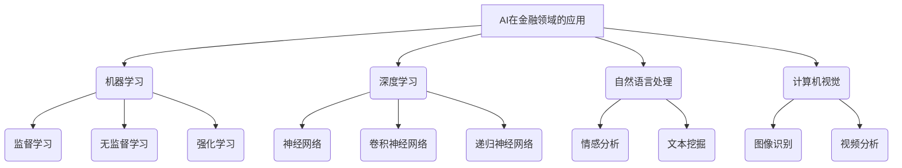

好的，我会尽力遵循您提供的要求和约束条件，撰写一篇高质量的技术博客文章。以下是正文部分：

# 一切皆是映射：AI在金融领域的应用探究

## 1. 背景介绍

### 1.1 问题的由来

在当今快节奏的金融世界中，准确预测市场趋势和做出明智的投资决策是一项艰巨的挑战。传统的金融分析方法往往依赖于人工分析和有限的历史数据,难以全面捕捉市场的复杂性和动态性。随着大数据和人工智能(AI)技术的飞速发展,金融行业正在经历一场前所未有的变革。

### 1.2 研究现状

近年来,机器学习和深度学习等AI技术在金融领域的应用日益受到关注。研究人员和从业者正在探索利用这些技术来提高交易策略的效率、降低风险、发现隐藏的市场模式等。然而,将AI技术成功应用于金融领域仍面临诸多挑战,例如数据质量、模型的可解释性、监管合规性等。

### 1.3 研究意义

本文旨在深入探讨AI在金融领域的应用,包括其核心概念、算法原理、数学模型、实际应用场景等。通过全面的分析和案例研究,我们将揭示AI如何为金融决策提供强大的支持,并指出未来的发展方向和潜在挑战。

### 1.4 本文结构

本文将按照以下结构展开:

1. 背景介绍
2. 核心概念与联系
3. 核心算法原理与具体操作步骤
4. 数学模型和公式详细讲解与举例说明
5. 项目实践:代码实例和详细解释说明
6. 实际应用场景
7. 工具和资源推荐
8. 总结:未来发展趋势与挑战
9. 附录:常见问题与解答

## 2. 核心概念与联系

在探讨AI在金融领域的应用之前,我们需要了解一些核心概念及其相互关系。这些概念将为后续的讨论奠定基础。

上图展示了AI在金融领域应用的核心概念及其关系。机器学习、深度学习、自然语言处理和计算机视觉是AI的四大支柱,它们在金融领域有着广泛的应用。

例如,机器学习可用于建模和预测金融时间序列;深度学习可用于识别复杂的市场模式;自然语言处理可用于分析新闻报道和社交媒体信息,从而获取有价值的见解;计算机视觉可用于分析图表和视频,以发现潜在的交易机会。

这些概念相互关联、相辅相成,共同推动了AI在金融领域的创新应用。

## 3. 核心算法原理与具体操作步骤

在本节中,我们将探讨AI在金融领域应用中的核心算法原理及其具体操作步骤。

### 3.1 算法原理概述

AI在金融领域的应用通常涉及以下几种核心算法:

1. **监督学习算法**: 这类算法基于已标记的训练数据,学习映射输入到输出的函数。常见的监督学习算法包括线性回归、逻辑回归、决策树、支持向量机等。在金融领域,监督学习算法可用于预测股票价格、评估信用风险等任务。

2. **无监督学习算法**: 这类算法旨在从未标记的数据中发现隐藏的模式或结构。常见的无监督学习算法包括聚类算法(如K-Means、层次聚类)和降维算法(如主成分分析、t-SNE)。在金融领域,无监督学习算法可用于发现市场分割、识别异常交易等。

3. **强化学习算法**: 这类算法通过与环境交互并获得反馈来学习最优策略。常见的强化学习算法包括Q-Learning、策略梯度等。在金融领域,强化学习算法可用于自动交易系统、投资组合优化等。

4. **深度学习算法**: 这类算法基于人工神经网络,能够从原始数据中自动学习特征表示。常见的深度学习算法包括卷积神经网络、递归神经网络、长短期记忆网络等。在金融领域,深度学习算法可用于预测金融时间序列、分析文本和图像等。

### 3.2 算法步骤详解

以下是一个典型的监督学习算法(如线性回归)在金融领域应用的步骤:

1. **数据收集和预处理**: 收集相关的金融数据,如股票历史价格、技术指标、新闻等。对数据进行清洗、标准化和特征工程等预处理。

2. **数据划分**: 将数据集划分为训练集、验证集和测试集。

3. **模型训练**: 使用训练集数据训练线性回归模型,通过优化损失函数(如均方误差)来学习模型参数。

4. **模型评估**: 在验证集上评估模型的性能,根据指标(如均方根误差)进行模型选择和调参。

5. **模型预测**: 使用训练好的模型对测试集进行预测,评估模型在未见数据上的泛化能力。

6. **模型部署**: 将模型集成到交易系统或决策支持系统中,用于实际的金融应用。

7. **模型监控和更新**: 持续监控模型的性能,根据新的数据和环境变化定期更新模型。

### 3.3 算法优缺点

每种算法都有其优缺点,在实际应用中需要权衡利弊。

- **监督学习算法**:
  - 优点:模型可解释性强,训练过程相对简单。
  - 缺点:需要大量标记数据,难以捕捉复杂的非线性模式。

- **无监督学习算法**:
  - 优点:不需要标记数据,可发现隐藏的数据模式。
  - 缺点:结果解释性较差,难以直接应用于预测任务。

- **强化学习算法**:
  - 优点:可自主学习最优策略,适用于序列决策问题。
  - 缺点:训练过程复杂,收敛性能受到环境复杂度的影响。

- **深度学习算法**:
  - 优点:能够自动学习特征表示,捕捉复杂的非线性模式。
  - 缺点:需要大量数据,模型可解释性较差,存在过拟合风险。

### 3.4 算法应用领域

AI算法在金融领域有着广泛的应用,包括但不限于:

- **量化交易**: 使用机器学习和深度学习算法进行金融时间序列预测,开发算法交易策略。

- **风险管理**: 利用无监督学习算法发现异常交易,评估信用风险和市场风险。

- **投资组合优化**: 使用强化学习算法动态调整投资组合,实现最优化资产配置。

- **金融文本分析**: 应用自然语言处理技术分析新闻报道、社交媒体等文本数据,发现潜在的市场信号。

- **金融图像分析**: 使用计算机视觉技术分析股票图表、财务报表等图像数据,提取有价值的信息。

## 4. 数学模型和公式详细讲解与举例说明

在AI算法的背后,往往存在着复杂的数学模型和公式。本节将详细讲解一些常见的数学模型,并通过具体案例说明其在金融领域的应用。

### 4.1 数学模型构建

许多AI算法都可以用数学模型来表示,例如线性回归模型:

$$y = w^Tx + b$$

其中$y$是预测目标,$x$是输入特征向量,$w$和$b$分别是模型的权重和偏置参数。

在金融领域,我们可以将$y$看作是股票的预测价格,$x$包含了影响股价的各种特征,如历史价格、技术指标等。模型的目标是学习最优的$w$和$b$,使得预测值$y$尽可能接近真实值。

### 4.2 公式推导过程

接下来,我们将推导一个常见的损失函数:均方误差(Mean Squared Error, MSE)。

假设我们有$n$个训练样本$\{(x_i, y_i)\}_{i=1}^n$,其中$x_i$是输入特征,$y_i$是对应的目标值。我们的模型预测值为$\hat{y}_i = f(x_i; \theta)$,其中$\theta$是模型参数。

我们希望最小化预测值与真实值之间的差异,可以定义损失函数为:

$$L(\theta) = \frac{1}{n}\sum_{i=1}^n (y_i - \hat{y}_i)^2$$

对于线性回归模型,$\hat{y}_i = w^Tx_i + b$,代入上式可得:

$$L(w, b) = \frac{1}{n}\sum_{i=1}^n (y_i - w^Tx_i - b)^2$$

通过优化算法(如梯度下降)可以求解出最优的$w$和$b$,使得损失函数$L(w, b)$最小化。

### 4.3 案例分析与讲解

现在,我们来看一个实际案例,利用线性回归模型预测股票价格。

假设我们有一只股票的历史数据,包括开盘价、最高价、最低价、成交量等特征,以及未来5天的实际收盘价作为标签。我们的目标是使用线性回归模型,基于历史数据预测未来5天的收盘价。

首先,我们需要对数据进行预处理,包括填充缺失值、标准化等。然后,我们将数据划分为训练集和测试集。

接下来,我们在训练集上训练线性回归模型,使用均方误差作为损失函数,通过梯度下降算法优化模型参数。

在测试集上评估模型性能,我们可以计算均方根误差(RMSE)作为指标:

$$\text{RMSE} = \sqrt{\frac{1}{n}\sum_{i=1}^n (y_i - \hat{y}_i)^2}$$

其中$y_i$是真实收盘价,$\hat{y}_i$是模型预测值。RMSE越小,模型的预测精度越高。

通过调整模型超参数和特征工程,我们可以进一步提高模型的预测性能。

### 4.4 常见问题解答

在应用数学模型和公式时,我们可能会遇到一些常见问题,例如:

1. **过拟合问题**:
   - 解决方案:增加正则化项、使用dropout技术、进行数据增强等。

2. **异方差问题**:
   - 解决方案:使用加权最小二乘法、转换响应变量等。

3. **多重共线性问题**:
   - 解决方案:特征选择、主成分回归、岭回归等。

4. **非线性问题**:
   - 解决方案:使用非线性模型(如神经网络)、特征工程等。

5. **非平稳时间序列问题**:
   - 解决方案:差分运算、Box-Cox变换等。

通过合理的建模策略和技术手段,我们可以有效解决这些常见问题,提高模型的性能和可靠性。

## 5. 项目实践:代码实例和详细解释说明

在本节中,我们将通过一个实际项目,展示如何使用Python和相关库(如TensorFlow、Keras、Scikit-Learn等)来实现AI在金融领域的应用。

### 5.1 开发环境搭建

首先,我们需要搭建开发环境。以下是一些常用的Python库及其用途:

- **NumPy**: 提供高性能的数值计算功能。
- **Pandas**: 用于数据处理和分析。
- **Matplotlib**: 用于数据可视化。
- **Scikit-Learn**: 提供了多种机器学习算法的实现。
- **TensorFlow/Keras**: 深度学习框架,用于构建和训练神经网络模型。

您可以使用Anaconda或pip等