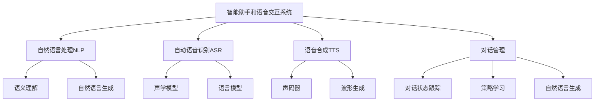

以下是根据您的要求撰写的技术博客文章正文内容：

# 一切皆是映射：智能助手和语音交互系统的未来

## 1. 背景介绍

### 1.1 问题的由来

在当今快节奏的数字时代，人机交互已经成为一个不可忽视的重要课题。传统的键盘和鼠标输入方式已经无法满足人们对于更加自然、高效的交互体验的需求。因此,智能助手和语音交互系统应运而生,旨在提供一种更加人性化的交互方式。

随着深度学习、自然语言处理等技术的不断发展,智能助手和语音交互系统的性能也在不断提升。然而,这些系统仍然面临着诸多挑战,例如语音识别准确率、上下文理解能力、交互自然流畅度等,都有待进一步改进。

### 1.2 研究现状

目前,业界和学术界都在积极探索智能助手和语音交互系统的发展方向。一些知名公司如苹果、谷歌、亚马逊等已经推出了自己的智能助手产品,如Siri、Google Assistant、Alexa等。同时,学术界也在不断探索新的算法和模型,以提高这些系统的性能。

然而,现有的智能助手和语音交互系统仍然存在一些局限性。例如,它们对于复杂的语境理解能力有限,无法很好地处理含有歧义或者隐喻的语句。此外,它们的交互方式往往还是比较生硬,缺乏真正的自然流畅性。

### 1.3 研究意义

提升智能助手和语音交互系统的性能,不仅能够为用户带来更加自然、高效的交互体验,同时也能够推动人工智能技术在更多领域的应用。例如,在医疗、教育、客服等领域,优秀的语音交互系统可以极大地提高工作效率,降低人力成本。

此外,研究智能助手和语音交互系统的核心技术,也将有助于推动自然语言处理、机器学习等相关领域的发展,为解决更加复杂的人工智能问题奠定基础。

### 1.4 本文结构

本文将从以下几个方面深入探讨智能助手和语音交互系统的未来发展:

1. 核心概念与联系
2. 核心算法原理与具体操作步骤
3. 数学模型和公式详细讲解与案例分析
4. 项目实践:代码实例和详细解释说明
5. 实际应用场景
6. 工具和资源推荐
7. 总结:未来发展趋势与挑战
8. 附录:常见问题与解答

## 2. 核心概念与联系

智能助手和语音交互系统涉及多个核心概念,包括自然语言处理(Natural Language Processing, NLP)、自动语音识别(Automatic Speech Recognition, ASR)、语音合成(Text-to-Speech, TTS)、对话管理(Dialogue Management)等。这些概念相互关联,共同构建了一个完整的智能助手和语音交互系统。

1. **自然语言处理(NLP)**:用于理解和生成自然语言文本,包括语义理解和自然语言生成两个主要任务。
2. **自动语音识别(ASR)**:将语音信号转换为文本,主要包括声学模型和语言模型两个部分。
3. **语音合成(TTS)**:将文本转换为语音,主要包括声码器和波形生成两个部分。
4. **对话管理(Dialogue Management)**:控制对话流程,包括对话状态跟踪、策略学习和自然语言生成等任务。

这些核心概念相互依赖、相互影响,共同构建了一个端到端的智能助手和语音交互系统。例如,ASR模块将用户的语音输入转换为文本,NLP模块对文本进行语义理解,对话管理模块根据对话状态进行决策,TTS模块将系统的响应合成为语音输出。

## 3. 核心算法原理与具体操作步骤

### 3.1 算法原理概述

智能助手和语音交互系统的核心算法主要基于深度学习和统计建模方法。以下是一些常见算法的简要概述:

1. **序列到序列模型(Sequence-to-Sequence Model)**:广泛应用于机器翻译、自动问答等任务,能够将一个序列(如文本或语音)映射到另一个序列。常用的序列到序列模型包括RNN、LSTM、Transformer等。

2. **注意力机制(Attention Mechanism)**:用于捕捉输入序列中不同位置的信息,并根据当前状态动态分配注意力权重,提高了模型的性能。

3. **生成对抗网络(Generative Adversarial Networks, GANs)**:常用于语音合成任务,通过生成器和判别器的对抗训练,可以生成更加自然流畅的语音。

4. **隐马尔可夫模型(Hidden Markov Model, HMM)**:常用于声学建模,将语音信号表示为一系列隐藏状态的马尔可夫过程。

5. **端到端模型(End-to-End Model)**:直接从原始输入(如语音或文本)到最终输出(如文本或语音)进行建模,避免了传统系统中的多个模块之间的错误传递。

### 3.2 算法步骤详解

以下以自动语音识别(ASR)任务为例,详细介绍核心算法的具体操作步骤:

1. **特征提取**:将原始语音信号转换为适合模型输入的特征表示,常用的特征包括MFCC、Filter Bank等。

2. **声学建模**:使用HMM、DNN等模型对语音特征进行建模,得到声学模型。

3. **语言建模**:使用N-gram、RNN等模型对文本语料进行建模,得到语言模型。

4. **声学模型和语言模型集成**:将声学模型和语言模型集成,形成完整的ASR系统。

5. **解码**:使用贝叶斯决策理论、前向-后向算法等方法,在集成模型上进行解码,得到最终的文本输出。

6. **模型训练**:使用监督学习、半监督学习等方法,在大规模语音-文本数据集上训练模型,提高模型的性能。

在实际应用中,上述步骤可能会有所调整和优化,以适应特定的任务需求。

### 3.3 算法优缺点

上述核心算法在智能助手和语音交互系统中发挥着重要作用,但也存在一些优缺点:

**优点**:

1. 能够有效地捕捉序列数据中的长期依赖关系,提高了模型的表达能力。
2. 注意力机制提高了模型对输入信息的选择性,提升了性能。
3. 端到端模型避免了传统系统中模块之间的错误传递,简化了系统结构。
4. 生成对抗网络能够生成更加自然流畅的语音,提高了语音质量。

**缺点**:

1. 大型深度学习模型需要大量的计算资源和训练数据,训练和推理过程较为耗时。
2. 模型的可解释性较差,内部工作机制通常是一个黑箱。
3. 对于一些特殊场景(如含有歧义、隐喻等语义信息),模型的性能可能会受到影响。
4. 模型的鲁棒性有待提高,对于噪声和异常输入的处理能力有限。

### 3.4 算法应用领域

上述核心算法在智能助手和语音交互系统中发挥着关键作用,同时也广泛应用于其他自然语言处理和语音信号处理领域,包括但不限于:

1. **机器翻译**:将一种自然语言翻译为另一种自然语言。
2. **自动问答**:自动回答用户提出的问题。
3. **语音识别**:将语音信号转录为文本。
4. **语音合成**:将文本转换为自然语音。
5. **情感分析**:识别文本或语音中表达的情感倾向。
6. **说话人识别**:识别语音中的说话人身份。
7. **关键词检测**:从语音或文本中提取关键词。

## 4. 数学模型和公式详细讲解与举例说明

### 4.1 数学模型构建

在智能助手和语音交互系统中,数学模型扮演着至关重要的角色。以下是一些常见的数学模型:

1. **隐马尔可夫模型(HMM)**:

HMM是一种统计模型,常用于声学建模。它将观测序列(如语音特征序列)建模为由隐藏的马尔可夫链生成的"表面"现象。

设观测序列为$O = \{o_1, o_2, \dots, o_T\}$,隐藏状态序列为$Q = \{q_1, q_2, \dots, q_T\}$,则HMM可以用三个概率分布来描述:

$$
\begin{aligned}
\pi &= P(q_1) &&\text{(初始状态概率)} \
A &= P(q_t | q_{t-1}) &&\text{(状态转移概率)} \
B &= P(o_t | q_t) &&\text{(观测概率)}
\end{aligned}
$$

通过估计这三个概率分布的参数,可以构建HMM模型,并用于声学建模任务。

2. **N-gram语言模型**:

N-gram语言模型是一种基于统计的语言模型,常用于语言建模。它根据历史上的$n-1$个词来预测当前词的概率:

$$P(w_i | w_1, w_2, \dots, w_{i-1}) \approx P(w_i | w_{i-n+1}, \dots, w_{i-1})$$

其中,$w_i$表示第$i$个词,$n$是N-gram的阶数。通过计算语料库中的N-gram统计信息,可以估计该概率模型的参数。

3. **神经网络语言模型**:

神经网络语言模型使用神经网络来建模语言,相比传统的N-gram模型,它能够更好地捕捉长期依赖关系。常见的神经网络语言模型包括RNN语言模型、Transformer语言模型等。

以RNN语言模型为例,它将句子$S = \{w_1, w_2, \dots, w_T\}$编码为一系列隐藏状态$\{h_1, h_2, \dots, h_T\}$,然后基于当前隐藏状态$h_t$预测下一个词$w_{t+1}$的概率:

$$P(w_{t+1} | w_1, \dots, w_t) = \text{softmax}(W_o h_t + b_o)$$

其中,$W_o$和$b_o$是可训练参数。通过在大规模语料库上训练,可以学习到参数值,从而构建神经网络语言模型。

### 4.2 公式推导过程

智能助手和语音交互系统中的许多核心算法都涉及到数学公式的推导,以下以HMM的前向算法为例,详细介绍公式推导过程:

前向算法用于计算观测序列$O$在给定HMM模型$\lambda = (\pi, A, B)$下的概率$P(O | \lambda)$。我们定义前向概率$\alpha_t(i)$为:

$$\alpha_t(i) = P(o_1, o_2, \dots, o_t, q_t = i | \lambda)$$

即在时刻$t$处于状态$i$,并观测到部分观测序列$o_1, o_2, \dots, o_t$的概率。

我们可以按照以下步骤递推计算$\alpha_t(i)$:

1. 初始化:

$$\alpha_1(i) = \pi_i b_i(o_1), \quad 1 \leq i \leq N$$

其中,$\pi_i$是初始状态概率,$b_i(o_1)$是第一个观测在状态$i$下的观测概率。

2. 递推:

$$\alpha_{t+1}(j) = \left[ \sum_{i=1}^N \alpha_t(i) a_{ij} \right] b_j(o_{t+1}