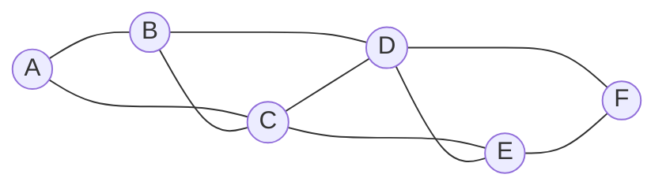
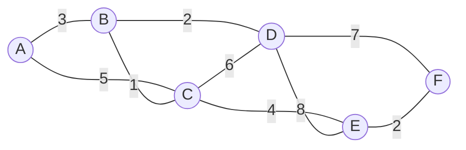

# 最短路径 原理与代码实例讲解

作者：禅与计算机程序设计艺术 / Zen and the Art of Computer Programming

## 1. 背景介绍

### 1.1 问题的由来

在现实生活中,我们经常会遇到寻找最短路径的问题。例如,我们在导航软件中搜索从出发地到目的地的最短路径,物流公司需要为货车规划最优路线以节省运输成本,通信网络中需要找到源节点到目标节点的最短路径来最小化传输延迟等。可以看出,最短路径问题广泛存在于各个领域,解决此类问题对于优化资源配置、提升系统性能具有重要意义。

### 1.2 研究现状

最短路径问题作为图论中的经典问题之一,长期以来受到学术界和工业界的广泛关注。目前已经提出了多种求解最短路径的算法,例如 Dijkstra 算法、Bellman-Ford 算法、Floyd-Warshall 算法、A* 搜索算法等。这些算法在理论和实践中都得到了广泛应用,并衍生出许多变种和优化算法。

随着大数据时代的到来和图规模的不断增大,传统的最短路径算法在处理超大规模图上的效率受到挑战。因此,近年来又涌现出一批面向大规模图的最短路径算法,如可扩展的 Dijkstra 算法、Hub Labeling 算法、Contraction Hierarchies 算法等。这些算法在保证精度的同时,大幅提升了求解效率。

### 1.3 研究意义

最短路径算法在实际应用中有着广泛的需求,深入研究该问题具有重要的理论和实践意义:

1. 优化资源配置:在交通运输、物流配送等领域,找到最短路径可以最小化路程,节省时间和成本。
2. 提升系统性能:在通信网络、互联网等领域,选择最短路径进行数据传输,可以降低网络拥塞,提高传输效率。
3. 辅助决策分析:最短路径算法常用于评估备选方案,如城市规划中选择最佳公交线路,企业选址中确定最佳选址方案等。
4. 算法研究价值:最短路径问题是算法研究中的基础问题,深入研究该问题有助于培养算法思维,促进算法技术发展。

### 1.4 本文结构

本文将围绕最短路径问题展开深入探讨,内容安排如下:

- 第2部分:介绍最短路径的核心概念,阐述相关概念之间的联系。 
- 第3部分:重点介绍求解最短路径的核心算法原理,并给出详细的操作步骤。
- 第4部分:建立最短路径问题的数学模型,推导相关公式,并结合案例进行讲解说明。
- 第5部分:给出最短路径算法的代码实现,并对关键代码进行解释说明。
- 第6部分:总结最短路径算法的实际应用场景,展望其未来应用前景。
- 第7部分:推荐学习最短路径算法的相关工具和资源。
- 第8部分:总结全文,指出最短路径研究的发展趋势和面临的挑战。
- 第9部分:归纳最短路径问题的常见问题,并给出解答。

## 2. 核心概念与联系

在探讨最短路径问题之前,我们先来了解几个核心概念:

- 图(Graph):由若干节点(顶点)及连接节点的边组成的数据结构。最短路径问题就是在图上进行求解的。
- 权重(Weight):图中每条边都可以赋予一个权重值,表示从一个节点到另一个节点的距离或成本。
- 路径(Path):图中从一个节点到另一个节点经过的边的序列。
- 最短路径:图中两个节点之间所有路径中,权重和最小的路径。
- 源节点(Source):最短路径的起始节点。
- 终点节点(Destination):最短路径的目标节点。

这些概念之间有着紧密联系:最短路径问题就是要在带权图中,找到从源节点到终点节点的一条权重和最小的路径。

上图是一个带权无向图的示例,节点之间的数字表示边的权重。例如,要找到从节点A到节点F的最短路径,就是要在所有从A到F的路径中,找到一条权重和最小的路径。

## 3. 核心算法原理 & 具体操作步骤

### 3.1 算法原理概述

求解最短路径的算法有多种,本文重点介绍 Dijkstra 算法的基本原理。Dijkstra 算法是一种基于贪心策略的经典算法,用于求解单源最短路径问题,即找到从一个源节点到图中其他所有节点的最短路径。

Dijkstra 算法的核心思想是:

1. 每次选择距离源节点最近的未访问节点,并确定经过该节点到达其他节点的最短距离。
2. 重复上述过程,直到所有节点都被访问为止。

### 3.2 算法步骤详解

下面给出 Dijkstra 算法的详细步骤:

输入:带权有向图G,源节点s

1. 初始化:
   - 创建距离数组d,记录源节点s到每个节点的最短距离,初始化d[s]=0,其他d[v]=∞。
   - 创建前驱数组p,记录每个节点的前驱节点,初始化p[v]=NIL。
   - 创建访问标记数组vis,记录每个节点是否已访问,初始化vis[v]=false。

2. 循环,直到所有节点都被访问:
   - 在未访问的节点中,选择距离源节点s最近的节点u,即d[u]最小。
   - 标记节点u已访问,vis[u]=true。
   - 遍历与节点u相邻的所有节点v:
     - 如果v未访问 且 d[u]+w(u,v) < d[v],则更新d[v]=d[u]+w(u,v),p[v]=u。
     - 其中,w(u,v)表示边(u,v)的权重。

3. 输出:
   - d数组即为源节点s到每个节点的最短距离。
   - 根据p数组逆向追溯,可得到源节点s到每个节点的最短路径。

### 3.3 算法优缺点

Dijkstra算法的优点:
- 思路清晰,易于理解和实现。
- 能够求出源节点到其他所有节点的最短路径。
- 对于稀疏图,采用合适的优先队列优化,时间复杂度可以达到O((V+E)logV)。

Dijkstra算法的缺点:  
- 要求图中不存在负权边。
- 使用邻接矩阵存储图时,时间复杂度为O(V^2),对于稠密图效率较低。
- 是单源最短路径算法,若需求任意两点间的最短路径,需要多次调用该算法。

### 3.4 算法应用领域

Dijkstra 算法在许多领域都有广泛应用,例如:

- 交通导航:GPS导航系统利用Dijkstra算法规划最短路线。
- 网络路由:路由协议使用Dijkstra算法寻找网络中的最短路径。 
- 资源调度:操作系统利用Dijkstra算法解决资源调度问题。
- 游戏开发:许多游戏中的NPC寻路都使用了Dijkstra算法。
- ...

## 4. 数学模型和公式 & 详细讲解 & 举例说明

### 4.1 数学模型构建

我们可以用数学语言来刻画最短路径问题。假设有一个带权有向图$G=(V,E)$,其中$V$表示节点集合,$E$表示边集合。对于每条边$(u,v) \in E$,定义其权重为$w(u,v)$。

给定源节点$s \in V$,我们的目标是找到从$s$到图中其他每个节点$v \in V$的最短路径,即求解

$$
d(s,v) = \min_{P} \sum_{(u,v) \in P} w(u,v)
$$

其中,$P$表示从节点$s$到节点$v$的所有路径的集合。

### 4.2 公式推导过程

Dijkstra算法可以用以下递推公式来表示:

令$d_k(v)$表示在第$k$次迭代后,源节点$s$到节点$v$的最短距离。$d_0(s)=0$,其他$d_0(v)=\infty$。

则在第$k+1$次迭代时,有:

$$
d_{k+1}(v) = 
\begin{cases}
d_k(v)  & \text{if } v = u_k \
\min\{d_k(v), d_k(u_k) + w(u_k,v)\} & \text{if } v \neq u_k
\end{cases}
$$

其中,$u_k$表示在第$k$次迭代中新加入的节点,即$d_k(u_k)$在未访问节点中取最小值。

重复上述迭代过程,直到所有节点都被访问,最终得到源节点$s$到其他所有节点的最短距离。

### 4.3 案例分析与讲解

下面我们以一个具体的例子来说明Dijkstra算法的执行过程。考虑如下带权有向图:

假设源节点为A,我们来求解从A到其他节点的最短路径。

初始化:
- d[A]=0, d[B]=d[C]=d[D]=d[E]=d[F]=∞
- p[v]=NIL, vis[v]=false

第1次迭代:
- 选择A,标记vis[A]=true
- 更新d[B]=3,p[B]=A; d[C]=5,p[C]=A

第2次迭代:  
- 选择B,标记vis[B]=true
- 更新d[C]=min(5,3+1)=4,p[C]=B; d[D]=3+2=5,p[D]=B

第3次迭代:
- 选择C,标记vis[C]=true  
- 更新d[D]=min(5,4+6)=5; d[E]=4+4=8,p[E]=C

第4次迭代:
- 选择D,标记vis[D]=true
- 更新d[E]=min(8,5+8)=8; d[F]=5+7=12,p[F]=D

第5次迭代:  
- 选择E,标记vis[E]=true
- 更新d[F]=min(12,8+2)=10,p[F]=E

第6次迭代:
- 选择F,标记vis[F]=true

至此,所有节点都已访问,算法结束。我们得到了从节点A到其他节点的最短距离:
- d[A]=0,d[B]=3,d[C]=4,d[D]=5,d[E]=8,d[F]=10

根据前驱数组p,可以追溯出最短路径:
- A到B的最短路径:A->B
- A到C的最短路径:A->B->C
- A到D的最短路径:A->B->D
- A到E的最短路径:A->B->C->E 
- A到F的最短路径:A->B->C->E->F

### 4.4 常见问题解答

Q:Dijkstra算法能否处理负权边?
A:不能。Dijkstra算法要求图中所有边的权重都非负,否则会失效。如果图中包含负权边,可以考虑使用Bellman-Ford算法。

Q:Dijkstra算法的时间复杂度是多少?
A:使用邻接表表示图,并用二叉堆优化寻找最小值的过程,Dijkstra算法的时间复杂度为$O((V+E) \log V)$。如果使用邻接矩阵,时间复杂度为$O(V^2)$。

Q:Dijkstra算法求出的最短路径是否一定唯一?  
A:不一定。当存在多条最短路径时,Dijkstra算法只会求出其中一条。如果需要求出所有最短路径,可以对算法进行适当修改。

## 5. 项目实践：代码实例和详细解释说明

### 5.1 开发环境搭建

本文采用C++语言