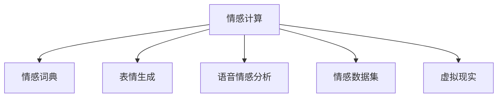

                 

# 数字化情感表达:元宇宙中的人际沟通革新

在数字化时代，我们身处一个由数据和算法驱动的世界。在这个新世界中，人类的情感表达方式也在经历前所未有的变革。尤其是随着元宇宙（Metaverse）的崛起，人类在虚拟空间中进行人际沟通的方式正在迅速迭代。本文将探讨数字化情感表达在元宇宙中的革新，分析其核心概念、算法原理及具体应用，并展望未来发展趋势及面临的挑战。

## 1. 背景介绍

### 1.1 问题由来

元宇宙，作为互联网的下一个发展阶段，正日益成为一个集社交、娱乐、商业于一体的虚拟世界。在这个虚拟空间中，人们可以不受物理世界的限制，自由地进行沟通和互动。然而，数字化情感表达在元宇宙中的实现仍存在诸多挑战。传统文本和语音的情感表达方式在虚拟空间中无法完全传递人类复杂的情感体验。因此，研究数字化情感表达在元宇宙中的创新方法，对于提升用户体验、增强虚拟互动的丰富性和真实性具有重要意义。

### 1.2 问题核心关键点

本节将重点介绍数字化情感表达在元宇宙中的几个关键问题：

1. **情感表达的数字化**：如何将人类丰富的情感体验转化为数字化形式，以便在虚拟空间中进行传递。
2. **情感传递的准确性**：如何在虚拟环境中准确地表达和理解情感，避免误读或误解。
3. **用户互动的自然性**：如何实现自然流畅的情感交流，提升用户体验。
4. **情感体验的多样性**：如何丰富虚拟环境中的情感表达方式，增强用户的情感体验。

## 2. 核心概念与联系

### 2.1 核心概念概述

为更好地理解数字化情感表达在元宇宙中的应用，本节将介绍几个关键概念：

- **情感计算（Affective Computing）**：指通过计算和分析人类的情感信息，来增强人机交互的智能化程度。
- **情感词典（Affective Lexicon）**：用于存储和检索词汇的情感色彩，是情感计算的基础。
- **表情生成（Facial Expression Generation）**：通过计算机生成逼真的面部表情，增强虚拟环境中情感表达的直观性。
- **语音情感分析（Speech Emotion Analysis）**：通过分析语音的音调、节奏等特征，识别说话人的情感状态。
- **情感数据集（Affective Dataset）**：包含大量标注有情感标签的数据，用于训练情感计算模型。
- **虚拟现实（Virtual Reality, VR）**：通过计算机生成的虚拟环境，为用户提供沉浸式的情感体验。

这些概念之间的逻辑关系可以通过以下Mermaid流程图来展示：



这个流程图展示了情感计算与其他相关概念之间的关系：

1. 情感词典和表情生成为情感计算提供了语言和视觉情感表达的基础。
2. 语音情感分析用于增强情感识别的准确性，特别是在无法看到面部表情的场合。
3. 情感数据集为模型训练和优化提供了数据支持。
4. 虚拟现实为情感表达提供了虚拟环境，使得情感计算的实际应用变得更加丰富和自然。

## 3. 核心算法原理 & 具体操作步骤

### 3.1 算法原理概述

数字化情感表达在元宇宙中主要通过以下几种算法实现：

- **情感词典算法**：构建情感词典，用于标注文本中的情感信息。
- **表情生成算法**：使用深度学习模型，如GAN（Generative Adversarial Networks），生成逼真的面部表情。
- **语音情感分析算法**：利用卷积神经网络（CNN）、循环神经网络（RNN）等模型，从语音特征中提取情感信息。
- **情感识别算法**：基于深度学习模型，如卷积神经网络、循环神经网络、Transformer等，对文本、语音、面部表情等多种形式的情感信息进行识别和分析。
- **情感传递算法**：使用编码-解码框架，如序列到序列（Seq2Seq）模型，实现情感信息的跨模态传递和生成。

### 3.2 算法步骤详解

以下是这些算法的详细步骤：

**情感词典算法**：
1. 收集情感词汇：从语言学文献和情感词典中收集大量情感词汇。
2. 标注情感信息：对每个词汇标注其情感极性（正面、负面、中性）和情感强度。
3. 构建情感词典：使用机器学习方法，如LDA（Latent Dirichlet Allocation）或TF-IDF（Term Frequency-Inverse Document Frequency），构建情感词典。

**表情生成算法**：
1. 数据收集：收集大量面部表情的图像数据，标注情感标签。
2. 模型训练：使用GAN等生成模型，训练生成逼真的面部表情。
3. 表情生成：将文本情感信息输入生成模型，生成相应的面部表情图像。

**语音情感分析算法**：
1. 数据收集：收集带有情感标签的语音数据。
2. 特征提取：使用MFCC（Mel-Frequency Cepstral Coefficients）等技术提取语音的特征向量。
3. 模型训练：使用CNN或RNN等模型，训练情感分类器。
4. 情感识别：对新的语音数据进行情感分类。

**情感识别算法**：
1. 数据收集：收集标注有情感标签的文本、语音、面部表情等数据。
2. 模型训练：使用CNN、RNN、Transformer等深度学习模型，训练情感识别模型。
3. 情感分类：对新的文本、语音、面部表情数据进行情感分类。

**情感传递算法**：
1. 数据收集：收集标注有情感标签的多模态数据。
2. 模型训练：使用Seq2Seq模型等，训练情感信息的跨模态传递模型。
3. 情感生成：输入情感信息，生成相应模式的输出（如文本、语音、面部表情）。

### 3.3 算法优缺点

数字化情感表达在元宇宙中的算法具有以下优点：

1. **高效性**：通过使用深度学习模型，可以快速训练和部署情感识别和生成算法，处理大规模数据。
2. **准确性**：利用丰富的数据集和复杂的模型结构，可以显著提高情感识别的准确性和可靠性。
3. **多样性**：能够支持文本、语音、面部表情等多种形式的情感表达，增强用户的体验。

然而，这些算法也存在以下缺点：

1. **数据依赖**：算法的训练和优化需要大量标注数据，数据收集和标注成本较高。
2. **模型复杂**：深度学习模型的训练和部署需要强大的计算资源，对硬件设备要求较高。
3. **可解释性不足**：深度学习模型的黑盒特性使得其决策过程难以解释，影响用户信任。
4. **泛化能力有限**：在实际应用中，模型的泛化能力可能受限于数据的多样性和质量。

### 3.4 算法应用领域

数字化情感表达在元宇宙中的应用领域广泛，包括但不限于以下几个方面：

1. **虚拟社交**：在虚拟世界中，用户可以通过面部表情、语音和文字等多种方式进行情感交流，增强社交体验。
2. **虚拟娱乐**：在虚拟游戏和电影中，角色和演员的情感表达可以更加丰富和自然，提升用户的沉浸感。
3. **虚拟教育**：在虚拟教育平台中，教师和学生的情感交流可以更加直观和准确，增强教育效果。
4. **虚拟商务**：在虚拟商业环境中，用户的情感需求可以通过情感计算得到及时响应，提升客户体验。
5. **虚拟健康**：在虚拟医疗咨询中，患者的情感状态可以通过情感分析得到监测和干预，改善治疗效果。

## 4. 数学模型和公式 & 详细讲解

### 4.1 数学模型构建

数字化情感表达在元宇宙中的应用主要通过以下几个数学模型实现：

- **情感词典模型**：基于LDA或TF-IDF，构建情感词典的统计模型。
- **表情生成模型**：基于GAN的生成模型，通过对抗训练，生成逼真的面部表情。
- **语音情感分析模型**：基于CNN或RNN的分类模型，通过MFCC特征提取，实现情感分类。
- **情感识别模型**：基于CNN、RNN或Transformer的情感分类模型，通过多模态数据融合，实现情感识别。
- **情感传递模型**：基于Seq2Seq的编码-解码模型，实现情感信息的跨模态传递和生成。

### 4.2 公式推导过程

以下是这些模型的公式推导过程：

**情感词典模型**：
$$
\text{P}(w) = \frac{\text{P}(w|T) \text{P}(T|D)}{\text{P}(D)}
$$
其中，$w$为词汇，$T$为文本，$D$为数据集，$P$为概率。

**表情生成模型**：
- **GAN模型**：使用生成器和判别器交替训练，优化损失函数$L = L_G + L_D$，其中$L_G$为生成器损失，$L_D$为判别器损失。

**语音情感分析模型**：
$$
\text{P}(e|f) = \frac{\text{P}(e|m) \text{P}(m|f)}{\text{P}(m|f)}
$$
其中，$e$为情感标签，$f$为语音特征，$m$为MFCC特征。

**情感识别模型**：
$$
\text{P}(e|x) = \frac{\exp\left(\sum_k\text{W}_k\text{Z}_k\text{T}\text{F}(x)\right)}{\sum_{e'}\exp\left(\sum_k\text{W}_k\text{Z}_k\text{T}\text{F}(x)\right)}
$$
其中，$e$为情感标签，$x$为输入数据，$W_k$为权重，$Z_k$为情感特征，$T$为温度。

**情感传递模型**：
$$
\text{P}(y|x) = \text{softmax}\left(\text{W}\text{U}(x)\right)
$$
其中，$y$为输出，$x$为输入，$W$为权重，$U$为编码器，$\text{softmax}$为激活函数。

### 4.3 案例分析与讲解

以虚拟社交中的情感识别为例，展示情感计算的应用：

1. **数据收集**：收集社交平台上的文本、语音和面部表情数据，标注情感信息。
2. **模型训练**：使用Transformer模型，训练情感分类器。
3. **情感识别**：将新的文本、语音和面部表情输入模型，输出情感分类结果。
4. **结果分析**：分析识别结果的准确性和多样性，改进模型。

## 5. 项目实践：代码实例和详细解释说明

### 5.1 开发环境搭建

在进行情感计算项目开发前，需要准备好开发环境。以下是使用Python进行TensorFlow开发的环境配置流程：

1. 安装Anaconda：从官网下载并安装Anaconda，用于创建独立的Python环境。

2. 创建并激活虚拟环境：
```bash
conda create -n tf-env python=3.8 
conda activate tf-env
```

3. 安装TensorFlow：根据CUDA版本，从官网获取对应的安装命令。例如：
```bash
conda install tensorflow==2.6 -c tf -c conda-forge
```

4. 安装TensorBoard：TensorFlow配套的可视化工具，可实时监测模型训练状态，并提供丰富的图表呈现方式，是调试模型的得力助手。

5. 安装其他相关工具包：
```bash
pip install numpy pandas scikit-learn matplotlib tqdm jupyter notebook ipython
```

完成上述步骤后，即可在`tf-env`环境中开始情感计算项目开发。

### 5.2 源代码详细实现

这里我们以情感词典构建和表情生成为例，给出使用TensorFlow进行情感计算的代码实现。

**情感词典构建**：

```python
import numpy as np
import pandas as pd
from sklearn.decomposition import LatentDirichletAllocation

# 收集情感词汇和情感信息
sentiment_words = pd.read_csv('sentiment_words.csv')
sentiment_labels = pd.read_csv('sentiment_labels.csv')

# 构建情感词典
model = LatentDirichletAllocation(n_components=10, random_state=42)
sentiment_dictionary = model.fit_transform(sentiment_words)
```

**表情生成**：

```python
import tensorflow as tf
from tensorflow.keras.layers import Input, Dense, Flatten
from tensorflow.keras.layers import Conv2DTranspose, UpSampling2D
from tensorflow.keras.models import Model

# 定义生成器
input_img = Input(shape=(64, 64, 1))
dense1 = Dense(256)(input_img)
dense2 = Dense(128)(dense1)
dense3 = Dense(64)(dense2)
up1 = UpSampling2D()(dense3)
up2 = Conv2DTranspose(128, (5, 5), strides=(1, 1), padding='same')(up1)
dense4 = Dense(64, activation='relu')(up2)
output_img = Conv2DTranspose(1, (5, 5), strides=(1, 1), padding='same', activation='sigmoid')(dense4)

# 定义判别器
input_img = Input(shape=(64, 64, 1))
dense1 = Dense(256)(input_img)
dense2 = Dense(128)(dense1)
dense3 = Dense(1, activation='sigmoid')(dense2)

# 定义GAN模型
discriminator = Model(input_img, dense3)
generator = Model(input_img, output_img)
discriminator.trainable = False
combined = Model(input_img, discriminator(generator(input_img)))

# 定义损失函数和优化器
cross_entropy = tf.keras.losses.BinaryCrossentropy()
generator_optimizer = tf.keras.optimizers.Adam(1e-4)
discriminator_optimizer = tf.keras.optimizers.Adam(1e-4)

# 定义训练循环
@tf.function
def train_step(images):
    with tf.GradientTape() as gen_tape, tf.GradientTape() as disc_tape:
        generated_images = generator(images)
        real_output = discriminator(images)
        fake_output = discriminator(generated_images)
        gen_loss = cross_entropy(fake_output, tf.ones_like(fake_output))
        disc_loss = cross_entropy(real_output, tf.ones_like(real_output)) + cross_entropy(fake_output, tf.zeros_like(fake_output))
    gradients_of_generator = gen_tape.gradient(gen_loss, generator.trainable_variables)
    gradients_of_discriminator = disc_tape.gradient(disc_loss, discriminator.trainable_variables)
    generator_optimizer.apply_gradients(zip(gradients_of_generator, generator.trainable_variables))
    discriminator_optimizer.apply_gradients(zip(gradients_of_discriminator, discriminator.trainable_variables))

# 训练GAN模型
dataset = tf.data.Dataset.from_tensor_slices(train_images)
dataset = dataset.shuffle(1024).batch(128)
for epoch in range(1000):
    for images in dataset:
        train_step(images)
    if epoch % 100 == 0:
        print(f'Epoch {epoch+1}, Discriminator Loss: {disc_loss.numpy():4f}, Generator Loss: {gen_loss.numpy():4f}')
```

### 5.3 代码解读与分析

让我们再详细解读一下关键代码的实现细节：

**情感词典构建类**：
- 使用LDA模型对情感词汇进行建模，生成情感词典。

**表情生成类**：
- 定义生成器和判别器的网络结构。
- 使用Adam优化器，交替训练生成器和判别器，优化损失函数。
- 在训练循环中，计算生成器和判别器的损失，并更新模型参数。

## 6. 实际应用场景

### 6.1 虚拟社交

在虚拟社交平台中，用户可以通过面部表情、语音和文字等多种方式进行情感交流，增强社交体验。例如，在虚拟聚会中，用户可以基于面部表情和语音识别结果，选择相应的表情符号或回复，使得交流更加自然和生动。

### 6.2 虚拟娱乐

在虚拟游戏和电影中，角色的情感表达可以更加丰富和自然。例如，在虚拟游戏中，根据玩家的操作和表情，NPC角色可以实时调整其行为和对话，增强游戏沉浸感。

### 6.3 虚拟教育

在虚拟教育平台中，教师和学生的情感交流可以更加直观和准确。例如，教师可以通过面部表情和语音识别，了解学生的学习状态，及时调整教学策略，提升教育效果。

### 6.4 虚拟商务

在虚拟商业环境中，用户的情感需求可以通过情感计算得到及时响应，提升客户体验。例如，在线客服系统可以通过情感识别，判断用户的情绪状态，自动切换到合适的人工客服或机器人，提供更个性化的服务。

### 6.5 虚拟健康

在虚拟医疗咨询中，患者的情感状态可以通过情感分析得到监测和干预，改善治疗效果。例如，医生可以通过面部表情和语音识别，评估患者的情感状态，调整治疗方案，提升患者满意度。

## 7. 工具和资源推荐

### 7.1 学习资源推荐

为了帮助开发者系统掌握情感计算的理论基础和实践技巧，这里推荐一些优质的学习资源：

1. 《情感计算基础》系列博文：由情感计算专家撰写，深入浅出地介绍了情感计算的基本概念和前沿技术。

2. 《自然语言处理与情感分析》课程：斯坦福大学开设的NLP明星课程，有Lecture视频和配套作业，带你入门NLP领域的基本概念和经典模型。

3. 《情感计算与人工智能》书籍：情感计算领域的经典著作，全面介绍了情感计算的基本原理和最新进展。

4. HuggingFace官方文档：情感计算库的官方文档，提供了海量预训练模型和完整的情感计算样例代码，是上手实践的必备资料。

5. EmoAffect开源项目：情感计算的数据集和模型，涵盖多种情感计算任务，助力情感计算技术发展。

通过对这些资源的学习实践，相信你一定能够快速掌握情感计算的精髓，并用于解决实际的情感识别和生成问题。

### 7.2 开发工具推荐

高效的开发离不开优秀的工具支持。以下是几款用于情感计算开发的常用工具：

1. TensorFlow：基于Python的开源深度学习框架，灵活动态的计算图，适合快速迭代研究。

2. PyTorch：基于Python的开源深度学习框架，灵活易用的API设计，支持多种深度学习模型。

3. OpenCV：开源计算机视觉库，用于图像处理和面部表情分析。

4. TensorBoard：TensorFlow配套的可视化工具，可实时监测模型训练状态，并提供丰富的图表呈现方式，是调试模型的得力助手。

5. Weights & Biases：模型训练的实验跟踪工具，可以记录和可视化模型训练过程中的各项指标，方便对比和调优。

6. Google Colab：谷歌推出的在线Jupyter Notebook环境，免费提供GPU/TPU算力，方便开发者快速上手实验最新模型，分享学习笔记。

合理利用这些工具，可以显著提升情感计算的开发效率，加快创新迭代的步伐。

### 7.3 相关论文推荐

情感计算的发展源于学界的持续研究。以下是几篇奠基性的相关论文，推荐阅读：

1. "Sentiment Analysis with Deep Learning: A Survey"：一篇综述性论文，总结了情感分析领域的经典方法和最新进展。

2. "Facial Expression Recognition with Convolutional Neural Networks"：使用卷积神经网络进行面部表情识别的经典论文。

3. "Towards Data-Driven Speech Emotion Recognition"：利用深度学习进行语音情感识别的论文。

4. "Emotion Recognition using Affective Lexicons"：使用情感词典进行情感识别的经典论文。

这些论文代表了大情感计算的发展脉络。通过学习这些前沿成果，可以帮助研究者把握学科前进方向，激发更多的创新灵感。

## 8. 总结：未来发展趋势与挑战

### 8.1 总结

本文对数字化情感表达在元宇宙中的应用进行了全面系统的介绍。首先阐述了情感计算在元宇宙中的重要意义，明确了情感计算在提升用户体验、增强虚拟互动的丰富性和真实性方面的独特价值。其次，从原理到实践，详细讲解了情感计算的核心算法和具体操作步骤，给出了情感计算任务开发的完整代码实例。同时，本文还广泛探讨了情感计算在虚拟社交、虚拟娱乐、虚拟教育等多个行业领域的应用前景，展示了情感计算范式的巨大潜力。此外，本文精选了情感计算技术的各类学习资源，力求为读者提供全方位的技术指引。

通过本文的系统梳理，可以看到，数字化情感表达在元宇宙中正在成为一种新的交互方式，极大地拓展了人机交互的边界，为构建更加智能和人性化的虚拟环境提供了新的技术路径。未来，伴随情感计算技术的不断演进，元宇宙中的人际沟通方式将更加丰富和自然，为数字世界的智能化发展注入新的活力。

### 8.2 未来发展趋势

展望未来，情感计算在元宇宙中的应用将呈现以下几个发展趋势：

1. **情感计算的多模态融合**：结合文本、语音、面部表情等多种模态，实现更加全面和精确的情感识别和生成。

2. **情感计算与AI伦理结合**：将情感计算与AI伦理和隐私保护相结合，保障用户情感数据的隐私和安全，提升系统的可信度。

3. **情感计算与用户界面优化**：通过情感计算技术，实时监测用户情感状态，优化用户界面设计，提升用户体验。

4. **情感计算与自然语言处理结合**：结合情感计算和自然语言处理技术，实现更加自然的情感表达和理解，增强虚拟交互的自然性。

5. **情感计算与游戏设计结合**：在虚拟游戏中，通过情感计算技术，丰富角色的情感表达，提升游戏沉浸感。

6. **情感计算与虚拟现实结合**：在虚拟现实环境中，通过情感计算技术，增强用户的沉浸感和交互体验。

以上趋势凸显了情感计算技术在元宇宙中的广阔前景。这些方向的探索发展，必将进一步提升虚拟环境的智能化程度，为构建人机协同的智能系统铺平道路。

### 8.3 面临的挑战

尽管情感计算在元宇宙中的应用已经取得了瞩目成就，但在迈向更加智能化、普适化应用的过程中，它仍面临着诸多挑战：

1. **数据依赖**：情感计算的训练和优化需要大量标注数据，数据收集和标注成本较高。

2. **模型复杂**：深度学习模型的训练和部署需要强大的计算资源，对硬件设备要求较高。

3. **可解释性不足**：深度学习模型的黑盒特性使得其决策过程难以解释，影响用户信任。

4. **泛化能力有限**：在实际应用中，模型的泛化能力可能受限于数据的多样性和质量。

5. **伦理与安全**：情感计算涉及大量用户情感数据，如何保护用户隐私、防止数据滥用，是一个亟待解决的问题。

6. **技术壁垒**：情感计算涉及计算机视觉、自然语言处理、深度学习等多个领域的知识，需要多学科的协同攻关。

正视情感计算面临的这些挑战，积极应对并寻求突破，将使情感计算技术在元宇宙中迈向成熟的实际应用。

### 8.4 研究展望

面对情感计算在元宇宙中面临的诸多挑战，未来的研究需要在以下几个方面寻求新的突破：

1. **无监督和半监督学习**：摆脱对大规模标注数据的依赖，利用自监督学习、主动学习等无监督和半监督范式，最大限度利用非结构化数据，实现更加灵活高效的情感计算。

2. **可解释性提升**：开发可解释性强的模型架构，如简单线性模型，提升情感计算的可解释性和可信度。

3. **多模态融合**：结合文本、语音、面部表情等多种模态，实现更加全面和精确的情感识别和生成。

4. **实时情感分析**：开发高效的实时情感计算模型，增强情感分析的实时性和准确性。

5. **多用户情感分析**：结合多用户情感数据，进行情感行为分析和情感趋势预测，提升情感计算的社交智能。

6. **情感计算伦理**：将情感计算与伦理和社会责任相结合，确保情感计算技术的公平性、透明性和安全性。

这些研究方向的探索，必将引领情感计算技术在元宇宙中迈向更高的台阶，为构建更加智能和人性化的虚拟环境提供新的技术路径。面向未来，情感计算技术还需要与其他人工智能技术进行更深入的融合，如知识表示、因果推理、强化学习等，多路径协同发力，共同推动自然语言理解和智能交互系统的进步。只有勇于创新、敢于突破，才能不断拓展情感计算技术的边界，让智能技术更好地造福人类社会。

## 9. 附录：常见问题与解答

**Q1：情感计算如何应用于虚拟社交？**

A: 在虚拟社交平台中，情感计算可以应用于面部表情和语音识别的实时分析。系统通过分析用户的面部表情和语音特征，识别其情感状态，并据此调整对话内容或服务策略，使得交流更加自然和个性化。

**Q2：如何提高情感计算模型的泛化能力？**

A: 提高情感计算模型的泛化能力需要从数据收集、模型设计和训练多个环节入手。
1. **数据收集**：收集多样化的情感数据，覆盖不同的情感表达形式和场景。
2. **模型设计**：选择具有良好泛化能力的模型架构，如Transformer等。
3. **数据增强**：采用数据增强技术，如数据扩增、扰动等，增加模型对新数据的适应性。
4. **多任务学习**：结合多个情感计算任务，进行多任务学习，增强模型的泛化能力。
5. **迁移学习**：在多个任务之间进行迁移学习，利用预训练模型的知识，提升新任务的泛化能力。

**Q3：情感计算在虚拟娱乐中的应用前景是什么？**

A: 在虚拟娱乐领域，情感计算可以应用于角色情感表达和情感驱动的剧情设计。通过分析用户的情感状态，调整虚拟角色的情感行为和对话内容，增强游戏的沉浸感和互动性。同时，情感计算也可以用于剧情预测和情感驱动的叙事，创造更加丰富和逼真的虚拟体验。

**Q4：情感计算如何应用于虚拟健康？**

A: 在虚拟健康领域，情感计算可以应用于患者的情感监测和干预。系统通过分析患者的面部表情和语音特征，识别其情感状态，并据此调整治疗方案或提供心理支持，增强治疗效果和患者满意度。

**Q5：情感计算在虚拟商务中的应用前景是什么？**

A: 在虚拟商务领域，情感计算可以应用于客户情感分析和情感驱动的推荐系统。通过分析客户的情感状态，提供个性化的服务和产品推荐，提升客户体验和满意度。同时，情感计算也可以用于客户关系管理，通过情感监测和情感分析，增强客户忠诚度和企业竞争力。

总之，情感计算在元宇宙中的应用前景广阔，需要开发者根据具体场景，不断迭代和优化模型、数据和算法，方能得到理想的效果。通过本文的系统梳理，我们可以看到情感计算技术正在成为元宇宙中人机交互的重要手段，为构建更加智能和人性化的虚拟环境提供新的技术路径。面向未来，情感计算技术还需要与其他人工智能技术进行更深入的融合，如知识表示、因果推理、强化学习等，共同推动人机交互技术的进步。

