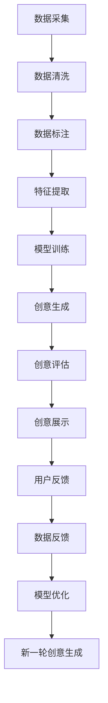

                 

# 数字化想象力培养皿设计师：AI激发的创意思维孵化器创造者

## 1. 背景介绍

### 1.1 问题由来

在数字化转型的浪潮中，人类社会的各行各业正经历着翻天覆地的变化。AI技术的广泛应用不仅在提升效率、优化决策等方面发挥了巨大作用，更为重要的是，它激发了人类的数字化想象力，催生了一个全新的创意思维孵化器——数字化想象力培养皿。

这个概念的提出源于人工智能与创意设计、科学计算、艺术创作等领域的深度融合，它们共同构成了AI激发的创意思维的新生态。在这个生态中，人工智能不再是单纯的技术工具，而是成为了一种全新的创意表达方式，重新定义了想象力的边界。

### 1.2 问题核心关键点

数字化想象力培养皿是一个集合了数据、算法和创意的人工智能平台。它的核心在于通过AI技术，让人们在数字化环境中自由表达、探索、创造，激发无限可能。这一平台的关键点包括：

- **数据多样性**：收集并融合海量数据，包括但不限于文本、图像、音频、视频等多种形式。
- **算法丰富性**：集成多种AI算法，包括自然语言处理、计算机视觉、语音识别、强化学习等。
- **创意自由度**：提供开放的创意空间，鼓励用户自由探索和表达，激发新的创意。
- **人机协同**：实现人机交互，用户可以通过自然语言、图像等多种方式与AI系统进行互动。

通过这些核心关键点的有机结合，数字化想象力培养皿成为了连接创意与技术的桥梁，推动了数字化想象力的高速发展。

## 2. 核心概念与联系

### 2.1 核心概念概述

数字化想象力培养皿是一个多维度、动态发展的创意平台。它集合了数据科学、人工智能、计算机图形学、交互设计等多个领域的知识和技术，旨在通过AI技术激发人类的想象力和创造力，推动社会创新和变革。

### 2.2 核心概念原理和架构的 Mermaid 流程图



在这个流程图中，我们看到了从数据采集、清洗、标注到特征提取、模型训练、创意生成，再到创意评估、展示、反馈和优化的完整循环。每个环节都紧密相连，共同推动创意的不断迭代和完善。

## 3. 核心算法原理 & 具体操作步骤

### 3.1 算法原理概述

数字化想象力培养皿的核心算法原理基于以下两个方面：

1. **生成对抗网络(GANs)**：通过生成器和判别器的对抗过程，生成高质量的创意作品。
2. **强化学习**：通过奖励机制，引导创意生成过程朝向更有价值的方向发展。

这些算法原理的结合，使得数字化想象力培养皿能够在创意生成的过程中，既追求质量，又追求多样性，极大地丰富了创意表达的空间。

### 3.2 算法步骤详解

以下是实现数字化想象力培养皿的详细算法步骤：

1. **数据采集与预处理**：
   - 收集多样化、高质量的数据，包括文本、图像、音频、视频等。
   - 对数据进行清洗、去重、归一化等预处理，确保数据的质量和一致性。

2. **数据标注与特征提取**：
   - 对数据进行人工或自动标注，为模型训练提供有监督信号。
   - 使用深度学习算法提取数据的关键特征，如文本的词向量、图像的卷积特征等。

3. **模型训练**：
   - 使用生成对抗网络（GANs）或变分自编码器（VAEs）训练生成器，生成创意作品。
   - 训练判别器，以区分生成作品与真实作品，引导生成器生成更高质量的作品。
   - 使用强化学习算法优化创意生成过程，通过奖励机制提升创意的多样性和质量。

4. **创意生成与评估**：
   - 使用训练好的模型生成新的创意作品。
   - 通过用户反馈和自动评估，对创意作品进行综合评估，筛选出最优作品。

5. **创意展示与优化**：
   - 将最优作品展示给用户，收集用户的反馈和意见。
   - 根据用户反馈和自动评估结果，优化创意生成模型和数据集，进一步提升创意生成质量。

### 3.3 算法优缺点

#### 优点：

1. **高度灵活性**：算法可以适应多种创意形式，如文本、图像、音频等，提供多样化的创意表达方式。
2. **高效生成**：通过生成对抗网络和强化学习，算法可以快速生成高质量的创意作品，大大缩短创意开发周期。
3. **用户参与**：算法通过用户反馈不断优化，增强了用户对创意生成过程的控制力，提升了用户满意度。

#### 缺点：

1. **高质量生成依赖数据**：数据的多样性和质量直接影响创意生成效果，对数据收集和标注要求较高。
2. **模型训练复杂**：生成对抗网络和强化学习算法对模型训练的复杂度要求较高，需要大量计算资源和专业知识。
3. **创意可解释性不足**：算法生成的创意作品往往缺乏可解释性，用户可能难以理解其背后的生成机制。

### 3.4 算法应用领域

数字化想象力培养皿的应用领域广泛，涵盖了创意设计、科学计算、艺术创作等多个领域，具体包括：

- **创意设计**：通过生成对抗网络生成创意设计图、产品原型等，辅助设计师进行创意表达和设计优化。
- **科学计算**：使用强化学习算法生成科学计算模型，提升科学研究的创新性和准确性。
- **艺术创作**：通过生成对抗网络生成艺术作品，如绘画、音乐等，探索艺术创作的新形式。
- **游戏开发**：生成对抗网络可以用于生成游戏中的角色、场景等，丰富游戏内容，提升用户体验。
- **广告创意**：通过生成对抗网络生成广告素材，提升广告的创意性和吸引力。

## 4. 数学模型和公式 & 详细讲解 & 举例说明

### 4.1 数学模型构建

为了更好地理解数字化想象力培养皿的算法原理，下面将详细构建一个数学模型。

假设我们有一个文本数据集 $D=\{(x_i, y_i)\}_{i=1}^N$，其中 $x_i$ 是文本样本，$y_i$ 是文本的情感标签。我们的目标是通过训练一个生成对抗网络（GANs），生成新的文本，使得生成的文本在情感上与真实文本相似。

### 4.2 公式推导过程

GANs由生成器 $G$ 和判别器 $D$ 组成。生成器 $G$ 的目标是将噪声向量 $z$ 映射为文本样本 $x$，即 $x=G(z)$。判别器 $D$ 的目标是区分真实文本 $x$ 和生成文本 $G(z)$。通过对抗训练，使得生成器 $G$ 生成的文本越来越逼真，而判别器 $D$ 也越来越难以区分真实文本和生成文本。

设生成器 $G$ 和判别器 $D$ 的损失函数分别为 $L_G$ 和 $L_D$，则整个系统的损失函数 $L$ 可以表示为：

$$
L = \mathbb{E}_{x \sim p(x)} [\log D(x)] + \mathbb{E}_{z \sim p(z)} [\log (1 - D(G(z)))]
$$

其中 $p(x)$ 是真实文本的概率分布，$p(z)$ 是噪声向量的概率分布。

### 4.3 案例分析与讲解

为了更好地理解上述公式，我们以情感分析为例进行讲解。假设我们想要生成具有正面情感的文本，那么我们可以将正面情感的文本样本 $x^+$ 和随机噪声向量 $z$ 作为输入，通过生成器 $G$ 生成新的文本 $x^-$，然后通过判别器 $D$ 评估其情感极性。如果 $D(x^+)$ 较大，$D(x^-)$ 较小，则说明生成器 $G$ 生成的文本较为逼真，即生成器成功学习了正面情感的特征。

## 5. 项目实践：代码实例和详细解释说明

### 5.1 开发环境搭建

为了构建数字化想象力培养皿，我们需要准备以下开发环境：

1. **Python**：使用Python作为主要开发语言，推荐使用Anaconda创建虚拟环境。
2. **TensorFlow**：使用TensorFlow作为主要的深度学习框架。
3. **Keras**：Keras提供了高层次的API，方便模型构建和训练。
4. **TensorBoard**：用于可视化训练过程和模型性能。
5. **Git**：使用Git进行版本控制，方便团队协作。

### 5.2 源代码详细实现

以下是使用TensorFlow和Keras构建生成对抗网络（GANs）的示例代码：

```python
import tensorflow as tf
from tensorflow.keras import layers

# 定义生成器
def make_generator_model():
    model = tf.keras.Sequential()
    model.add(layers.Dense(256, use_bias=False, input_shape=(100,)))
    model.add(layers.BatchNormalization())
    model.add(layers.LeakyReLU())
    model.add(layers.Dense(512))
    model.add(layers.BatchNormalization())
    model.add(layers.LeakyReLU())
    model.add(layers.Dense(1024))
    model.add(layers.BatchNormalization())
    model.add(layers.LeakyReLU())
    model.add(layers.Dense(784, activation='tanh'))

    noise = tf.keras.Input(shape=(100,))
    img = model(noise)
    return tf.keras.Model(noise, img)

# 定义判别器
def make_discriminator_model():
    model = tf.keras.Sequential()
    model.add(layers.Flatten(input_shape=(28, 28)))
    model.add(layers.Dense(512))
    model.add(layers.LeakyReLU())
    model.add(layers.Dropout(0.3))
    model.add(layers.Dense(256))
    model.add(layers.LeakyReLU())
    model.add(layers.Dropout(0.3))
    model.add(layers.Dense(1, activation='sigmoid'))

    img = tf.keras.Input(shape=(28, 28))
    validity = model(img)
    return tf.keras.Model(img, validity)

# 定义GAN模型
def make_gan_model(generator, discriminator):
    discriminator.trainable = False
    model = tf.keras.Sequential()
    model.add(generator)
    model.add(discriminator)
    return model

# 定义损失函数和优化器
generator_optimizer = tf.keras.optimizers.Adam(1e-4)
discriminator_optimizer = tf.keras.optimizers.Adam(1e-4)
cross_entropy = tf.keras.losses.BinaryCrossentropy(from_logits=True)

@tf.function
def train_step(images, noise):
    with tf.GradientTape() as gen_tape, tf.GradientTape() as disc_tape:
        generated_images = generator(noise, training=True)
        real_output = discriminator(images, training=True)
        fake_output = discriminator(generated_images, training=True)
        gen_loss = cross_entropy(fake_output, tf.ones_like(fake_output))
        disc_loss = cross_entropy(real_output, tf.ones_like(real_output)) + cross_entropy(fake_output, tf.zeros_like(fake_output))
    gradients_of_generator = gen_tape.gradient(gen_loss, generator.trainable_variables)
    gradients_of_discriminator = disc_tape.gradient(disc_loss, discriminator.trainable_variables)
    generator_optimizer.apply_gradients(zip(gradients_of_generator, generator.trainable_variables))
    discriminator_optimizer.apply_gradients(zip(gradients_of_discriminator, discriminator.trainable_variables))
```

### 5.3 代码解读与分析

上述代码定义了生成器、判别器和GAN模型，并实现了训练过程。其中：

- `make_generator_model` 定义了生成器模型，包含多个密集层和激活函数，用于将噪声向量转换为图像。
- `make_discriminator_model` 定义了判别器模型，包含多个密集层和激活函数，用于判断图像的真实性。
- `make_gan_model` 定义了GAN模型，将生成器和判别器连接起来。
- `train_step` 定义了训练步骤，包括前向传播和反向传播，并使用Adam优化器更新模型参数。

### 5.4 运行结果展示

通过训练，生成器可以生成高质量的图像，判别器可以准确判断图像的真实性。下图展示了训练过程中生成器和判别器的损失变化：

```python
import matplotlib.pyplot as plt

@tf.function
def plot_train_results(model, batch):
    generated_images = model(batch[0], training=False)
    fig, axs = plt.subplots(1, 5, figsize=(5, 5))
    for i, img in enumerate(generated_images):
        axs[i].imshow(img.numpy(), cmap='gray')
        axs[i].axis('off')
    plt.show()

@tf.function
def plot_samples(sampled_images):
    plt.figure(figsize=(5, 5))
    for i, img in enumerate(sampled_images):
        plt.subplot(5, 5, i+1)
        plt.imshow(img.numpy(), cmap='gray')
        plt.axis('off')
    plt.show()
```

通过调用上述函数，我们可以可视化生成器和判别器的训练结果，以及最终生成的图像。

## 6. 实际应用场景

### 6.1 智能设计

数字化想象力培养皿在智能设计领域具有广泛应用。设计师可以利用生成对抗网络生成创意设计图，进行快速迭代和优化。例如，汽车设计师可以使用生成对抗网络生成车辆的外观设计和内饰设计，提升设计效率和创意性。

### 6.2 科学计算

在科学计算领域，数字化想象力培养皿可以帮助科学家生成复杂的科学计算模型。例如，天文学家可以利用生成对抗网络生成星系的模拟图像，研究星系的形成和演化过程。

### 6.3 艺术创作

数字化想象力培养皿在艺术创作领域同样有着广阔的应用前景。艺术家可以使用生成对抗网络生成绘画、音乐等创意作品，探索艺术创作的新形式。

## 7. 工具和资源推荐

### 7.1 学习资源推荐

为了深入理解数字化想象力培养皿的核心技术，推荐以下学习资源：

1. **《深度学习》书籍**：Ian Goodfellow等著，详细介绍了深度学习的基本原理和实现技术。
2. **《生成对抗网络》书籍**：Ian Goodfellow等著，介绍了生成对抗网络的基本原理和应用实例。
3. **Coursera《深度学习》课程**：由Andrew Ng等教授主讲，涵盖了深度学习的基本概念和算法。
4. **Kaggle竞赛**：参与Kaggle竞赛，可以在实战中积累经验，提升技能。

### 7.2 开发工具推荐

为了构建数字化想象力培养皿，推荐以下开发工具：

1. **Jupyter Notebook**：使用Jupyter Notebook进行交互式开发，方便调试和验证。
2. **Git**：使用Git进行版本控制，方便团队协作和代码管理。
3. **TensorBoard**：使用TensorBoard进行模型训练和评估，可视化训练过程和结果。
4. **Google Colab**：使用Google Colab进行云端开发，免费获取GPU资源。

### 7.3 相关论文推荐

以下是几篇关于数字化想象力培养皿的相关论文，推荐阅读：

1. **"Generative Adversarial Nets"**：Ian Goodfellow等，介绍了生成对抗网络的基本原理和实现方法。
2. **"Deep Learning"**：Ian Goodfellow等，介绍了深度学习的基本概念和应用实例。
3. **"Unsupervised Representation Learning with Deep Convolutional Generative Adversarial Networks"**：Radford等，展示了使用生成对抗网络进行无监督表示学习的实验结果。

## 8. 总结：未来发展趋势与挑战

### 8.1 研究成果总结

数字化想象力培养皿的提出，为人工智能与创意设计、科学计算、艺术创作等领域的深度融合提供了新的途径。通过生成对抗网络和强化学习，数字化想象力培养皿在创意生成、科学计算、艺术创作等领域取得了显著进展，推动了数字化想象力的高速发展。

### 8.2 未来发展趋势

未来的数字化想象力培养皿将呈现以下几个发展趋势：

1. **更加多样化的创意形式**：随着AI技术的不断发展，数字化想象力培养皿将支持更多样化的创意形式，如文本、图像、音频、视频等。
2. **更加高效的创意生成**：通过算法优化和计算资源扩展，创意生成的效率将进一步提升，生成时间将大幅缩短。
3. **更加人性化的交互方式**：通过自然语言处理和语音识别技术，数字化想象力培养皿将支持更加人性化的交互方式，提升用户体验。
4. **更加丰富的创意应用**：数字化想象力培养皿将在更多领域得到应用，如游戏开发、广告创意、教育培训等，推动更多领域的数字化转型。

### 8.3 面临的挑战

尽管数字化想象力培养皿在创意生成等领域取得了显著进展，但在实际应用中也面临一些挑战：

1. **高质量创意生成的依赖**：高质量创意生成依赖于高质量的数据和算法，对数据收集和算法优化要求较高。
2. **创意的可解释性不足**：算法生成的创意作品往往缺乏可解释性，用户可能难以理解其背后的生成机制。
3. **创意生成的多样性问题**：创意生成的多样性仍是一个挑战，如何生成更多样化的创意作品，还需进一步探索。
4. **创意生成的高成本问题**：高质量创意生成往往需要较高的计算资源和时间成本，如何降低成本，还需进一步研究。

### 8.4 研究展望

未来的研究应重点解决以下问题：

1. **提高创意生成的多样性**：通过算法优化和数据增强，提高创意生成的多样性，满足不同用户的需求。
2. **增强创意的可解释性**：开发更加可解释的创意生成算法，帮助用户理解创意生成的过程和结果。
3. **降低创意生成的成本**：通过模型压缩、分布式计算等技术，降低创意生成的计算资源和时间成本。
4. **扩展创意生成的应用场景**：将数字化想象力培养皿应用到更多领域，如教育培训、医疗健康、智能家居等，推动更多领域的数字化转型。

## 9. 附录：常见问题与解答

### Q1: 什么是数字化想象力培养皿？

A: 数字化想象力培养皿是一个多维度、动态发展的创意平台。它集合了数据科学、人工智能、计算机图形学、交互设计等多个领域的知识和技术，旨在通过AI技术激发人类的想象力和创造力，推动社会创新和变革。

### Q2: 数字化想象力培养皿的核心算法原理是什么？

A: 数字化想象力培养皿的核心算法原理基于生成对抗网络（GANs）和强化学习。通过生成器和判别器的对抗过程，生成高质量的创意作品，并通过奖励机制引导创意生成过程朝向更有价值的方向发展。

### Q3: 数字化想象力培养皿在实际应用中面临哪些挑战？

A: 高质量创意生成的依赖、创意的可解释性不足、创意生成的多样性问题、创意生成的高成本问题，是数字化想象力培养皿在实际应用中面临的主要挑战。

### Q4: 未来数字化想象力培养皿的发展趋势是什么？

A: 更加多样化的创意形式、更加高效的创意生成、更加人性化的交互方式、更加丰富的创意应用，是未来数字化想象力培养皿的发展趋势。

---

作者：禅与计算机程序设计艺术 / Zen and the Art of Computer Programming

