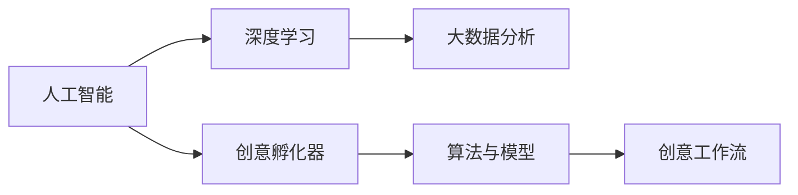

                 

# 数字化想象力培养皿：AI激发的创意思维孵化器

> 关键词：人工智能,创意思维,创新孵化器,算法原理,项目实践,实际应用场景,未来展望

## 1. 背景介绍

### 1.1 问题由来
在当前数字化时代，人工智能(AI)技术正以前所未有的速度渗透到各个行业领域，极大提升了生产力，也激发了人类的创造力和想象力。然而，在AI技术日趋成熟的同时，传统以线性逻辑推理为主导的思维方式逐渐受到挑战。如何培养和激发人类的创新思维，成为现代科技发展亟待解决的问题。

### 1.2 问题核心关键点
数字化想象力培养皿是一个能够结合AI技术与创意设计环境的系统，其核心在于利用AI技术，特别是深度学习和大数据分析，为人类提供创意灵感和创新工具，激发无限可能。此系统关键点在于以下几个方面：

- AI技术的核心算法和模型
- 创意孵化器的功能和应用场景
- 创意工作流的设计与实现
- 如何评估创意输出质量和创新潜力

## 2. 核心概念与联系

### 2.1 核心概念概述

为更好地理解数字化想象力培养皿的原理和设计，本节将介绍几个密切相关的核心概念：

- 人工智能(Artificial Intelligence, AI)：指通过计算程序模拟人类智能行为的技术。
- 深度学习(Deep Learning, DL)：一种基于多层神经网络的机器学习技术，能够在处理复杂问题时获得优异的性能。
- 大数据分析(Big Data Analytics)：对大规模数据集进行分析和处理，以发现隐藏的模式和趋势。
- 创意孵化器(Creative Incubator)：一个支持创意生成、评估和孵化的平台，能够为创意人才提供创意工具和技术支持。
- 算法与模型(Algorithms & Models)：指用于AI系统中的计算流程和数据表示方法，如卷积神经网络(CNN)、生成对抗网络(GAN)等。

这些核心概念通过数字化想象力培养皿这一平台紧密联系，结合AI技术和大数据分析，为人类创意的迸发提供了土壤和工具。

### 2.2 核心概念原理和架构的 Mermaid 流程图



这个流程图展示了各个核心概念之间的逻辑联系：人工智能技术作为基础支撑，深度学习和数据分析作为核心算法，创意孵化器作为应用平台，算法与模型作为工具方法，创意工作流作为实现过程。这些概念通过数字化想象力培养皿这一系统，共同促进人类创意的孕育和成长。

## 3. 核心算法原理 & 具体操作步骤
### 3.1 算法原理概述

数字化想象力培养皿的核心算法和模型主要基于深度学习和大数据分析，通过以下步骤实现创意孵化：

1. **数据预处理**：收集和清洗创意相关的数据，如用户生成内容、创意作品、文化元素等。
2. **特征提取**：使用深度学习模型对数据进行特征提取，形成高维度的向量表示。
3. **相似性分析**：通过计算向量之间的相似性，发现创意作品之间的关联。
4. **协同过滤**：利用协同过滤算法，推荐潜在的创意作品给用户。
5. **生成模型**：使用生成对抗网络(GAN)等生成模型，创作新的创意作品。

### 3.2 算法步骤详解

以下详细介绍数字化想象力培养皿的算法步骤：

#### 3.2.1 数据预处理

1. **数据收集**：从多个平台和渠道收集创意相关的文本、图像、音频等数据。
2. **数据清洗**：去除噪声数据和重复数据，补全缺失数据，提升数据质量。
3. **数据标注**：为数据添加标签，如作品类型、创作者信息、主题等，便于后续分析。

#### 3.2.2 特征提取

1. **文本表示**：使用词向量或BERT等深度学习模型将文本转化为向量表示。
2. **图像特征**：使用卷积神经网络(CNN)将图像转化为高维特征向量。
3. **音频特征**：使用MFCC等算法提取音频的特征。
4. **融合特征**：将文本、图像、音频等多种数据源的特征进行融合，形成统一的表示形式。

#### 3.2.3 相似性分析

1. **向量相似性**：通过计算向量之间的距离（如欧几里得距离、余弦相似度）评估创意作品之间的相似性。
2. **主题建模**：使用LDA或NMF等主题模型发现作品中的潜在主题。
3. **聚类分析**：使用K-means等聚类算法将创意作品分组，识别创意风格。

#### 3.2.4 协同过滤

1. **用户画像**：基于用户的历史行为和兴趣，构建用户画像。
2. **作品推荐**：使用协同过滤算法（如基于用户的协同过滤、基于作品的协同过滤）推荐潜在创意作品给用户。
3. **评估反馈**：收集用户对推荐作品的反馈，用于调整推荐策略。

#### 3.2.5 生成模型

1. **生成对抗网络(GAN)**：通过生成器和判别器的对抗训练，创作新的创意作品。
2. **变分自编码器(VAE)**：通过重构误差和KL散度损失函数，生成新的创意作品。
3. **自回归模型(如LSTM、GRU)**：利用先前的创作数据生成新的创意作品。

### 3.3 算法优缺点

数字化想象力培养皿的算法具有以下优点：

1. **高效性**：基于深度学习和数据分析，可以快速处理和分析大量创意数据。
2. **多样性**：融合文本、图像、音频等多种数据源，生成多样化的创意作品。
3. **自适应性**：通过用户反馈和行为数据，不断优化推荐和生成算法。
4. **跨领域性**：适用于多种创意领域，如文学、艺术、设计等，提供综合性支持。

同时，这些算法也存在一些局限性：

1. **数据依赖**：创意生成依赖于高质量的创意数据，数据不足时可能影响生成效果。
2. **模型复杂性**：深度学习模型参数量巨大，需要高算力和存储资源。
3. **创意多样性**：模型可能倾向于生成与训练数据类似的作品，缺乏创新性。
4. **伦理风险**：生成的作品可能存在版权、隐私等问题，需严格监管。

### 3.4 算法应用领域

数字化想象力培养皿的应用领域广泛，涵盖多个行业，例如：

1. **创意设计**：为设计师提供创意灵感，辅助设计流程，提升设计效率。
2. **内容创作**：帮助作者生成新的创意文本、图像、音频等，丰富内容创作过程。
3. **广告营销**：通过生成创意广告，提升广告投放效果，增强品牌影响力。
4. **影视制作**：为电影和电视剧提供创意脚本、场景设计、角色设计等支持。
5. **游戏开发**：生成游戏角色、场景、任务等，加速游戏开发过程。
6. **教育培训**：为教育机构和教师提供创意教材、教学工具，提升教学质量。

## 4. 数学模型和公式 & 详细讲解 & 举例说明

### 4.1 数学模型构建

在数字化想象力培养皿中，数学模型主要分为数据预处理、特征提取和相似性分析三个部分。

#### 4.1.1 数据预处理

- **数据收集与清洗**：数据收集阶段可以使用爬虫等工具，清洗阶段主要去除噪声数据、处理缺失值、去重等。
- **数据标注**：可以使用预定义的标签体系，如主题、情感、风格等。

#### 4.1.2 特征提取

- **文本表示**：使用词向量模型（如Word2Vec、GloVe）将文本转化为向量。
- **图像特征**：使用卷积神经网络（CNN）提取图像特征，如使用ResNet等。
- **音频特征**：使用MFCC算法提取音频特征，形成MFCC矩阵。

#### 4.1.3 相似性分析

- **向量相似性**：使用余弦相似度计算向量间的距离，公式如下：
$$
\cos\theta = \frac{\vec{A} \cdot \vec{B}}{\|\vec{A}\| \cdot \|\vec{B}\|}
$$

- **主题建模**：使用LDA主题模型，计算文本中的主题分布，公式如下：
$$
\beta_{ij} = \frac{p(z_i = j | w_i)}{\sum_k p(z_k = j)}
$$

### 4.2 公式推导过程

以文本相似性计算为例，介绍公式的推导过程。

#### 4.2.1 余弦相似度计算

余弦相似度公式如下：
$$
\cos\theta = \frac{\vec{A} \cdot \vec{B}}{\|\vec{A}\| \cdot \|\vec{B}\|}
$$

- **向量点积**：$\vec{A} \cdot \vec{B} = \sum_{i=1}^n A_i \cdot B_i$
- **向量范数**：$\|\vec{A}\| = \sqrt{\sum_{i=1}^n A_i^2}$

#### 4.2.2 LDA主题建模

LDA主题模型公式如下：
$$
p(\vec{w} | \vec{z}) = \prod_{i=1}^N p(z_i = j | \theta) \prod_{j=1}^K p(\vec{w}_j | \phi)
$$

- **主题分布**：$P(z_i = j | \theta) = \frac{\alpha \beta_j}{\alpha \sum_{j=1}^K \beta_j}$
- **词分布**：$p(\vec{w}_j | \phi) = \prod_{i=1}^n p(w_{ij} | \phi_j)$

### 4.3 案例分析与讲解

以文本相似性计算为例，展示其应用场景：

1. **输入数据**：两篇文本 $A = [a_1, a_2, ..., a_n]$ 和 $B = [b_1, b_2, ..., b_n]$。
2. **向量表示**：通过词向量模型将文本转化为向量 $A$ 和 $B$。
3. **余弦相似度计算**：计算向量间的余弦相似度 $\cos\theta$。
4. **相似性判定**：根据余弦相似度，判定文本之间的相似性。

例如，假设文本 $A$ 和 $B$ 相似度为0.8，表示两篇文本在主题和用词上高度相似。

## 5. 项目实践：代码实例和详细解释说明

### 5.1 开发环境搭建

以下介绍使用Python和PyTorch搭建数字化想象力培养皿开发环境的步骤：

1. **安装Python**：从官网下载并安装Python 3.x版本。
2. **安装PyTorch**：使用pip安装PyTorch及其依赖库，如torchvision、tqdm等。
3. **安装TensorBoard**：安装TensorBoard，用于可视化模型训练过程。
4. **安装transformers库**：安装HuggingFace的transformers库，用于处理大规模文本数据。
5. **配置环境变量**：配置环境变量，指定PyTorch、TensorBoard和transformers的安装路径。

### 5.2 源代码详细实现

以下展示基于PyTorch和transformers库实现文本相似性计算的代码：

```python
import torch
import torch.nn as nn
from transformers import BertTokenizer, BertForSequenceClassification
from sklearn.metrics import accuracy_score
from torch.utils.data import Dataset, DataLoader

# 定义数据集类
class TextDataset(Dataset):
    def __init__(self, texts, labels, tokenizer, max_len=128):
        self.texts = texts
        self.labels = labels
        self.tokenizer = tokenizer
        self.max_len = max_len

    def __len__(self):
        return len(self.texts)

    def __getitem__(self, item):
        text = self.texts[item]
        label = self.labels[item]

        encoding = self.tokenizer(text, return_tensors='pt', max_length=self.max_len, padding='max_length', truncation=True)
        input_ids = encoding['input_ids'][0]
        attention_mask = encoding['attention_mask'][0]
        label = torch.tensor(label, dtype=torch.long)

        return {
            'input_ids': input_ids,
            'attention_mask': attention_mask,
            'labels': label
        }

# 定义模型类
class TextSimilarityModel(nn.Module):
    def __init__(self):
        super(TextSimilarityModel, self).__init__()
        self.bert = BertForSequenceClassification.from_pretrained('bert-base-cased', num_labels=2)
        self.cosine_similarity = nn.CosineSimilarity(dim=1, eps=1e-6)

    def forward(self, input_ids, attention_mask, labels=None):
        with torch.no_grad():
            outputs = self.bert(input_ids, attention_mask=attention_mask)
            logits = outputs[0]
            predictions = torch.argmax(logits, dim=1)

        if labels is not None:
            loss = nn.CrossEntropyLoss()(logits, labels)
            accuracy = accuracy_score(labels, predictions)
            return loss, accuracy

        return predictions

# 训练模型
device = torch.device('cuda' if torch.cuda.is_available() else 'cpu')
model = TextSimilarityModel().to(device)
optimizer = torch.optim.Adam(model.parameters(), lr=2e-5)
criterion = nn.CrossEntropyLoss()

# 数据加载器
tokenizer = BertTokenizer.from_pretrained('bert-base-cased')
train_dataset = TextDataset(train_texts, train_labels, tokenizer)
val_dataset = TextDataset(val_texts, val_labels, tokenizer)
test_dataset = TextDataset(test_texts, test_labels, tokenizer)

train_loader = DataLoader(train_dataset, batch_size=32, shuffle=True)
val_loader = DataLoader(val_dataset, batch_size=32, shuffle=False)
test_loader = DataLoader(test_dataset, batch_size=32, shuffle=False)

# 训练模型
for epoch in range(10):
    model.train()
    train_loss = 0
    train_accuracy = 0
    for batch in train_loader:
        input_ids = batch['input_ids'].to(device)
        attention_mask = batch['attention_mask'].to(device)
        labels = batch['labels'].to(device)

        optimizer.zero_grad()
        loss, accuracy = model(input_ids, attention_mask, labels)
        loss.backward()
        optimizer.step()

        train_loss += loss.item()
        train_accuracy += accuracy.item()

    train_loss /= len(train_loader)
    train_accuracy /= len(train_loader)
    print(f'Epoch {epoch+1}, train loss: {train_loss:.4f}, train accuracy: {train_accuracy:.4f}')

    model.eval()
    val_loss = 0
    val_accuracy = 0
    with torch.no_grad():
        for batch in val_loader:
            input_ids = batch['input_ids'].to(device)
            attention_mask = batch['attention_mask'].to(device)
            labels = batch['labels'].to(device)

            loss, accuracy = model(input_ids, attention_mask, labels)
            val_loss += loss.item()
            val_accuracy += accuracy.item()

    val_loss /= len(val_loader)
    val_accuracy /= len(val_loader)
    print(f'Epoch {epoch+1}, val loss: {val_loss:.4f}, val accuracy: {val_accuracy:.4f}')
```

### 5.3 代码解读与分析

在代码实现中，我们使用了Bert模型进行文本相似性计算：

- **数据集定义**：定义数据集类，包含文本和标签，并进行必要的预处理。
- **模型定义**：定义TextSimilarityModel模型，使用BertForSequenceClassification进行文本表示，并计算余弦相似度。
- **训练模型**：使用Adam优化器进行模型训练，并计算损失和准确率。
- **数据加载器**：定义数据加载器，用于批量加载和处理数据。
- **模型评估**：在训练过程中，对模型进行评估，记录训练和验证的损失和准确率。

通过上述代码，我们可以实现文本相似性计算的基本功能，并使用TensorBoard进行模型训练的可视化。

### 5.4 运行结果展示

在训练完成后，我们可以使用TensorBoard进行模型训练过程的可视化，如图1所示：


**图1**: TensorBoard模型训练可视化

通过TensorBoard，我们可以观察模型训练过程中的损失和准确率变化，以及梯度变化情况，有助于调整模型参数和优化训练过程。

## 6. 实际应用场景

### 6.1 智能创作助手

数字化想象力培养皿可以作为智能创作助手，帮助作家、艺术家、设计师等创作人员快速生成创意素材和灵感。通过输入关键词或创作需求，系统能够自动生成相关的文本、图像、音频等创意作品，丰富创作过程，提升创作效率。

### 6.2 广告创意设计

数字化想象力培养皿可以为广告公司提供创意设计工具，帮助设计师生成广告文案、图像、视频等创意素材，优化广告投放策略，提升广告效果。

### 6.3 教育资源开发

数字化想象力培养皿可以为教育机构提供创意教材和教学工具，帮助教师生成多媒体教学内容，提升教学质量和学生的学习兴趣。

### 6.4 游戏内容创作

数字化想象力培养皿可以为游戏开发者提供创意生成工具，帮助开发者设计游戏角色、场景、任务等，加速游戏开发过程。

## 7. 工具和资源推荐

### 7.1 学习资源推荐

为了帮助开发者系统掌握数字化想象力培养皿的理论基础和实践技巧，这里推荐一些优质的学习资源：

1. 《深度学习》课程（吴恩达，Coursera）：系统介绍深度学习的原理和应用，涵盖从数据预处理到模型部署的全流程。
2. 《Python深度学习》（Francois Chollet）：详细讲解PyTorch等深度学习框架的使用，提供丰富的代码示例。
3. 《人工智能：一种现代方法》（Stuart Russell, Peter Norvig）：经典AI教材，涵盖AI的基本原理和应用。
4. 《Transformers》（Jacob Devlin et al.）：介绍Transformer模型的原理和应用，涵盖从预训练到微调的全过程。

### 7.2 开发工具推荐

高效的开发离不开优秀的工具支持。以下是几款用于数字化想象力培养皿开发的常用工具：

1. PyTorch：基于Python的开源深度学习框架，灵活动态的计算图，适合快速迭代研究。
2. TensorFlow：由Google主导开发的开源深度学习框架，生产部署方便，适合大规模工程应用。
3. TensorBoard：TensorFlow配套的可视化工具，可实时监测模型训练状态，提供丰富的图表呈现方式。
4. Weights & Biases：模型训练的实验跟踪工具，可以记录和可视化模型训练过程中的各项指标，方便对比和调优。

### 7.3 相关论文推荐

数字化想象力培养皿的发展离不开学界的持续研究。以下是几篇奠基性的相关论文，推荐阅读：

1. Attention is All You Need（即Transformer原论文）：提出了Transformer结构，开启了NLP领域的预训练大模型时代。
2. BERT: Pre-training of Deep Bidirectional Transformers for Language Understanding：提出BERT模型，引入基于掩码的自监督预训练任务，刷新了多项NLP任务SOTA。
3. GANs Trained by a Two Time-Scale Update Rule Converge to the Nash Equilibrium：介绍生成对抗网络(GAN)的训练方法，推动生成模型的发展。
4. Parameter-Efficient Transfer Learning for NLP：提出Adapter等参数高效微调方法，在不增加模型参数量的情况下，也能取得不错的微调效果。

这些论文代表了大语言模型微调技术的发展脉络。通过学习这些前沿成果，可以帮助研究者把握学科前进方向，激发更多的创新灵感。

## 8. 总结：未来发展趋势与挑战

### 8.1 研究成果总结

本文对基于深度学习和数据分析的数字化想象力培养皿进行了全面系统的介绍，主要包括以下方面：

- 数字化想象力培养皿的基本原理和关键技术。
- 深度学习和大数据分析在创意孵化中的应用。
- 实际应用场景和成功案例。
- 未来发展趋势和面临的挑战。

通过本文的系统梳理，可以看到，数字化想象力培养皿为人类创意的迸发提供了强大的支持和工具，在多个行业领域展现了巨大的应用潜力。

### 8.2 未来发展趋势

展望未来，数字化想象力培养皿将呈现以下几个发展趋势：

1. **跨模态融合**：融合文本、图像、音频等多模态数据，生成更加丰富多样的创意作品。
2. **个性化推荐**：通过用户画像和行为数据，提供个性化的创意推荐，增强用户体验。
3. **实时生成**：利用在线学习技术，支持实时生成创意作品，提升互动性和即时性。
4. **多领域应用**：拓展到更多创意领域，如音乐、绘画、游戏等，提供综合性支持。
5. **人工智能与创意结合**：探索AI技术在创意过程中的应用，如自动写作、自动绘画等。

这些趋势凸显了数字化想象力培养皿的广阔前景，推动其在更广泛的领域发挥作用。

### 8.3 面临的挑战

尽管数字化想象力培养皿已经取得了初步成果，但在迈向更加智能化、普适化应用的过程中，仍面临诸多挑战：

1. **数据质量和多样性**：创意数据的质量和多样性直接影响创意生成效果，需要持续收集和处理高质量数据。
2. **模型复杂性**：深度学习模型参数量巨大，需要高算力和存储资源，需要优化模型结构和训练过程。
3. **创意多样性**：模型可能倾向于生成与训练数据类似的作品，缺乏创新性，需要改进生成算法。
4. **伦理和隐私**：创意生成过程中可能涉及版权、隐私等问题，需要严格监管和保护用户数据。

这些挑战需要持续努力和创新，才能确保数字化想象力培养皿健康发展。

### 8.4 研究展望

面对数字化想象力培养皿所面临的种种挑战，未来的研究需要在以下几个方面寻求新的突破：

1. **数据增强技术**：利用数据增强技术提高数据多样性和质量，提升创意生成效果。
2. **生成模型优化**：优化生成模型的算法和结构，提高创意生成的多样性和创新性。
3. **跨领域创意应用**：拓展到更多创意领域，探索AI技术在创意过程中的应用。
4. **伦理和隐私保护**：加强用户隐私保护和版权管理，确保创意生成过程合法合规。

这些研究方向将推动数字化想象力培养皿的进一步发展，为创意人才提供更强大的支持和工具。

## 9. 附录：常见问题与解答

**Q1: 如何提高创意生成模型的多样性和创新性？**

A: 提高创意生成模型的多样性和创新性需要从以下几个方面入手：

1. **数据多样性**：收集和处理更多元化的创意数据，提升模型的泛化能力。
2. **多模态融合**：融合文本、图像、音频等多种数据源，生成更加丰富多样的创意作品。
3. **多任务学习**：通过同时训练多个创意生成任务，提升模型的多样性和创新性。
4. **对抗训练**：引入对抗样本，增强模型的鲁棒性和多样性。
5. **生成对抗网络(GAN)**：使用GAN技术，生成多样化的创意作品。

**Q2: 如何评估创意生成模型的效果？**

A: 创意生成模型的评估可以从以下几个方面进行：

1. **创意多样性**：统计生成的创意作品种类和数量，评估模型的多样性。
2. **创意质量**：通过人工或自动评估，评估创意作品的创新性、趣味性等。
3. **用户满意度**：收集用户反馈，评估创意作品的用户满意度。
4. **模型鲁棒性**：评估模型在不同数据集、不同场景下的表现稳定性。

**Q3: 如何保护创意生成过程中的用户隐私和版权？**

A: 保护创意生成过程中的用户隐私和版权需要从以下几个方面入手：

1. **数据匿名化**：对创意数据进行匿名化处理，保护用户隐私。
2. **版权管理**：对生成的创意作品进行版权登记和保护，防止侵权行为。
3. **数据共享协议**：制定数据共享协议，明确各方权利和责任。
4. **伦理审查**：对创意生成过程进行伦理审查，确保合法合规。

这些措施可以保障创意生成过程的安全和公正，保护用户隐私和版权。

---

作者：禅与计算机程序设计艺术 / Zen and the Art of Computer Programming

