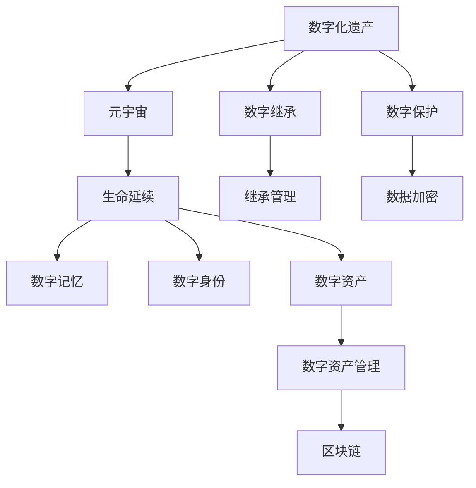

                 

# 数字化遗产：元宇宙中的生命延续

> 关键词：数字化遗产,元宇宙,生命延续,虚拟继承,数字记忆,区块链技术,数据加密,数字资产,数字身份,数字文明

## 1. 背景介绍

### 1.1 问题由来
在数字化迅猛发展的今天，人类社会的每一个角落都在逐步转向数字世界。我们的工作、学习、生活、娱乐以及社会交往，越来越多地依赖于各种数字化的设备和服务。然而，随着个人数字化的深入，我们不仅创造了前所未有的财富和知识，也在不知不觉中留下了巨大的数字遗产。

这些数字遗产包括但不限于数字照片、文档、视频、邮件、社交媒体记录、虚拟现实体验、游戏数据、数字艺术品、音乐和软件等。这些数据虽然看似平凡，但包含了我们的个人记忆、情感、知识和创造力，甚至在某些情况下，是实现个人身份认同的基石。

然而，当前的数字遗产处理方式还较为原始和分散。很多个人数字资产散布在不同的平台和服务中，缺乏有效的管理和继承机制。而随着人口老龄化和数字化程度的不断加深，数字遗产处理的问题将会愈发凸显。如何让个人数字遗产得以延续，如何让数字记忆得到妥善保存，成为了一个亟待解决的问题。

### 1.2 问题核心关键点
如何确保个人数字遗产的完整性和安全性，是当今数字化时代面临的一个重要挑战。具体来说，以下几方面问题尤为关键：

- **数字资产的完整性**：确保所有数字资产不丢失，并保证其真实性和完整性。
- **数字资产的继承性**：制定合理的数字资产继承规则，让继承人能够访问和使用这些资产。
- **数字资产的安全性**：防止数字资产被恶意篡改、盗窃或泄露。
- **数字遗产的法律效力**：制定明确的数据继承法律，确保数字遗产的合法流转。
- **数字遗产的可持续性**：保证数字遗产能够长期保存，并能够随技术的发展而更新。

### 1.3 问题研究意义
研究数字遗产处理问题，对于保护个人隐私、传承数字记忆、保障数字资产安全具有重要意义：

- **个人隐私保护**：通过数字遗产管理，确保个人隐私不被泄露或滥用。
- **文化传承**：数字遗产记录了个人的生活轨迹和创造力，是文化传承的重要载体。
- **经济价值保障**：数字资产具有巨大的经济价值，合理管理和继承数字资产，有助于保障个人财产权利。
- **社会稳定**：明确数字遗产的法律效力，有利于社会稳定和和谐。
- **技术可持续发展**：推动数字遗产技术的发展，促进数字文明的繁荣。

## 2. 核心概念与联系

### 2.1 核心概念概述

为了更好地理解数字遗产在元宇宙中的处理和延续，我们需要明确几个核心概念：

- **数字化遗产**：指个人在数字世界中的所有数据和资产，包括但不限于数字照片、文档、视频、邮件、社交媒体记录、虚拟现实体验、游戏数据、数字艺术品、音乐和软件等。
- **元宇宙**：一个由多个分布式平台和网络空间构成的虚拟世界，用户在其中可以通过虚拟身份进行互动、创造和体验。
- **生命延续**：通过数字化手段，使个人的数字记忆、身份和资产得以跨越时间和空间的延续，实现“永生”的效果。
- **数字记忆**：记录个人的经历、情感、知识和创造力，是个人身份认同的重要组成部分。
- **数字身份**：指个人在数字世界中的虚拟身份，包括但不限于虚拟头像、社交账号、游戏角色等。
- **数字资产**：指个人在数字世界中所拥有的具有经济价值的数据和产品，如数字艺术品、虚拟土地、加密货币等。

这些核心概念通过以下Mermaid流程图展示其联系：



这个流程图展示了数字化遗产在元宇宙中生命延续的基本过程和关键技术：

1. **数字化遗产**在**元宇宙**中通过**生命延续**得以保存和延续。
2. **数字记忆**记录了个人的生活轨迹和创造力，是个人身份认同的重要组成部分。
3. **数字身份**在**元宇宙**中通过身份认证和授权机制得到确认和保护。
4. **数字资产**在**元宇宙**中通过区块链等技术进行管理和流转。
5. **数字继承**确保了个人数字资产的合法流转和合理管理。
6. **数字保护**通过数据加密和权限管理，保障了数字遗产的安全性和完整性。

### 2.2 核心概念原理和架构的 Mermaid 流程图


## 3. 核心算法原理 & 具体操作步骤

### 3.1 算法原理概述

在元宇宙中处理和延续数字遗产，涉及多个复杂的技术层面。核心算法原理可以概括为以下三个部分：

- **数字资产管理**：通过区块链等技术，确保数字资产的透明性、不可篡改性和可追溯性。
- **数字身份认证**：通过分布式身份认证技术，保障数字身份的真实性和唯一性。
- **数字记忆记录**：通过数字记忆技术，将个人的经历、情感和创造力记录并保存在元宇宙中。

### 3.2 算法步骤详解

以下是对元宇宙中数字遗产处理的具体操作步骤：

**Step 1: 数字化遗产准备**

1. **数据整理**：整理个人的所有数字资产，包括但不限于数字照片、文档、视频、邮件、社交媒体记录、虚拟现实体验、游戏数据、数字艺术品、音乐和软件等。
2. **资产分类**：将数字资产分类，明确哪些是公开的、哪些是私人的，哪些需要长期保存、哪些可以销毁。
3. **资产评估**：评估每个数字资产的价值和重要性，决定其是否需要保护和传承。

**Step 2: 数字身份认证**

1. **身份生成**：在元宇宙中创建一个虚拟身份，用于代表个人在数字世界的存在。
2. **身份绑定**：将虚拟身份与现实身份绑定，确保虚拟身份的真实性和唯一性。
3. **权限管理**：通过分布式身份认证技术，设置虚拟身份的权限，确保只有授权人才能访问和修改数字遗产。

**Step 3: 数字记忆记录**

1. **记忆收集**：通过智能设备或手动输入，收集个人的经历、情感、知识和创造力。
2. **记忆存储**：将记忆数据存储在分布式数据库中，确保数据的完整性和可访问性。
3. **记忆分享**：根据需要，将记忆数据分享给特定的继承人或公开，确保数据的传播和共享。

**Step 4: 数字资产管理**

1. **资产上链**：将重要的数字资产通过区块链技术进行上链，确保其不可篡改性和可追溯性。
2. **资产备份**：对重要的数字资产进行备份，防止数据丢失或损坏。
3. **资产流转**：制定数字资产的流转规则，确保其在继承人之间的合理流转。

**Step 5: 数字遗产管理**

1. **遗产继承**：制定数字遗产的继承规则，确保数字遗产能够按照意愿传递给继承人。
2. **遗产保护**：通过数据加密和权限管理，保障数字遗产的安全性和完整性。
3. **遗产维护**：定期更新数字遗产，确保其与技术发展同步。

### 3.3 算法优缺点

**优点**：

- **透明性和可追溯性**：区块链等技术确保了数字资产的透明性和可追溯性，避免了数据篡改和遗失的风险。
- **安全性**：数据加密和权限管理技术保障了数字遗产的安全性，防止数据泄露和盗窃。
- **灵活性**：分布式身份认证技术提供了灵活的身份管理方式，可以适应不同的数字遗产需求。

**缺点**：

- **技术复杂性**：涉及区块链、数据加密、分布式身份认证等多项复杂技术，实施难度较高。
- **成本高昂**：实现这些技术需要较高的技术投入和资金支持。
- **法律风险**：数字遗产的法律效力尚不明确，存在法律风险。

### 3.4 算法应用领域

元宇宙中数字遗产处理技术可以应用于以下多个领域：

- **个人数据管理**：帮助个人管理自己的数字资产和记忆，确保数据的安全和完整。
- **家庭资产传承**：通过数字遗产管理，确保家庭资产能够按照意愿进行传承。
- **企业数据管理**：帮助企业管理员工的数据和资产，确保数据的合规和安全。
- **文化遗产保护**：记录和保护文化遗产的数字版本，确保其长期保存和传承。
- **虚拟身份认证**：通过虚拟身份认证技术，确保用户在元宇宙中的身份安全和真实性。

## 4. 数学模型和公式 & 详细讲解 & 举例说明

### 4.1 数学模型构建

为了更好地理解数字遗产在元宇宙中的处理和延续，我们可以构建一个数学模型来描述其处理过程。以下是一个简单的数学模型：

1. **数字资产价值模型**：

   $$
   V = \sum_{i=1}^n v_i
   $$

   其中，$V$ 为数字资产总价值，$v_i$ 为每个数字资产的价值。

2. **数字身份认证模型**：

   $$
   ID = f(ID_a, ID_b, \cdots, ID_n)
   $$

   其中，$ID$ 为数字身份，$ID_a, ID_b, \cdots, ID_n$ 为多个身份特征，$ID$ 通过这些特征计算得到。

3. **数字记忆记录模型**：

   $$
   M = \bigcup_{i=1}^m m_i
   $$

   其中，$M$ 为数字记忆，$m_i$ 为每个记忆片段，$M$ 为所有记忆片段的集合。

### 4.2 公式推导过程

以数字资产价值模型为例，推导其基本公式：

- **价值评估公式**：

  $$
  v_i = C \times \exp(f(w_i))
  $$

  其中，$v_i$ 为第 $i$ 个数字资产的价值，$C$ 为常数因子，$w_i$ 为资产的质量评分，$f(\cdot)$ 为评分函数。

- **总价值公式**：

  $$
  V = \sum_{i=1}^n v_i = \sum_{i=1}^n C \times \exp(f(w_i))
  $$

  通过将每个数字资产的价值累加，得到总价值。

### 4.3 案例分析与讲解

假设某个人有5个数字资产：

- **数字照片**：价值 $v_1 = C \times \exp(f(w_1))$。
- **视频**：价值 $v_2 = C \times \exp(f(w_2))$。
- **社交媒体记录**：价值 $v_3 = C \times \exp(f(w_3))$。
- **虚拟现实体验**：价值 $v_4 = C \times \exp(f(w_4))$。
- **游戏数据**：价值 $v_5 = C \times \exp(f(w_5))$。

其中，$C$ 为资产类别因子，$w_i$ 为每个资产的质量评分，$f(\cdot)$ 为评分函数。通过将每个资产的价值累加，得到总价值 $V = v_1 + v_2 + v_3 + v_4 + v_5$。

## 5. 项目实践：代码实例和详细解释说明

### 5.1 开发环境搭建

为了进行数字遗产处理的项目实践，我们需要以下开发环境：

1. **Python环境**：Python是数字遗产处理项目的主要开发语言，需要安装最新版本的Python。
2. **区块链框架**：需要安装以太坊、比特币等区块链框架，进行数字资产管理。
3. **数据加密库**：需要安装AES、RSA等数据加密库，进行数据加密和解密。
4. **分布式身份认证库**：需要安装分布式身份认证库，进行数字身份认证。
5. **Web框架**：需要安装Flask、Django等Web框架，开发数字遗产管理平台。

### 5.2 源代码详细实现

以下是一个简单的Python代码示例，用于数字资产上链：

```python
from web3 import Web3

# 创建Web3对象，连接以太坊主网
w3 = Web3(Web3.HTTPProvider('https://mainnet.infura.io/v3/your-project-id'))

# 创建一个新的数字资产，这里以一个以太币为例
contract = w3.eth.contract(
    address='0x1234567890abcdef',
    abi='[{"constant":false,"inputs":[{"name":"value","type":"uint256"}],"name":"transfer","outputs":[{"name":"status","type":"string"}],"stateMutability":"nonpayable","type":"function"}]
)

# 发送交易，将以太币转移到新的地址
tx_hash = contract.functions.transfer('0xabcdef1234567890', 100).transact({'from': '0x1234567890abcdef', 'value': w3.toWei(100, 'ether')})
tx_receipt = w3.eth.waitForTransactionReceipt(tx_hash)

# 输出交易结果
print('交易哈希：', tx_hash)
print('交易状态：', tx_receipt['status'])
```

### 5.3 代码解读与分析

- **Web3库**：用于连接以太坊主网，进行区块链操作。
- **数字资产创建**：通过创建以太坊智能合约，创建一个新的数字资产，这里以一个以太币为例。
- **资产转移**：通过发送交易，将以太币转移到新的地址。
- **交易结果**：通过等待交易结果，输出交易哈希和状态。

## 6. 实际应用场景

### 6.1 智能家庭

智能家庭是数字遗产处理的重要应用场景之一。通过智能家居设备，记录家庭成员的生活轨迹和创造力，将其数字化保存。一旦家庭成员去世，这些数字遗产可以完整地传递给继承人，继续在家庭中传承。

### 6.2 企业数据管理

企业数据管理是数字遗产处理在商业领域的重要应用。企业可以通过区块链技术，记录和保护员工的数据和资产，确保数据的合规和安全。当员工离职或退休时，企业可以将其数字遗产传递给继承人，实现数据的平滑过渡。

### 6.3 文化遗产保护

文化遗产的保护和传承是数字遗产处理的重要应用方向。通过数字记忆技术，记录和保护文化遗产的数字版本，确保其长期保存和传承。数字遗产可以跨越时间和空间，为后代的文化研究和传承提供重要资料。

## 7. 工具和资源推荐

### 7.1 学习资源推荐

为了帮助开发者系统掌握数字遗产处理的技术，这里推荐一些优质的学习资源：

1. **《区块链技术入门》系列博文**：介绍区块链的基本概念和应用场景，适合初学者入门。
2. **《Python Web开发》课程**：讲解Web开发的基础知识和技术栈，适合学习Web框架和分布式身份认证技术。
3. **《数据加密与解密》课程**：讲解数据加密和解密的基本原理和应用，适合学习数据加密库的使用。
4. **《数字遗产管理》在线课程**：介绍数字遗产处理的基本流程和技术要点，适合系统学习数字遗产管理。

### 7.2 开发工具推荐

为了提高数字遗产处理项目的开发效率，推荐以下开发工具：

1. **PyCharm**：一款流行的Python IDE，支持Python开发环境配置和管理。
2. **Django**：一款流行的Web框架，适合快速开发Web应用。
3. **Flask**：一款轻量级的Web框架，适合开发小型Web应用。
4. **ethereuminpy**：一款Python以太坊库，方便进行区块链操作。
5. **AES**：一款Python加密库，支持数据加密和解密。

### 7.3 相关论文推荐

为了深入理解数字遗产处理技术，推荐以下几篇经典论文：

1. **《区块链技术综述》**：综述区块链的基本概念和应用场景，适合初学者理解。
2. **《分布式身份认证技术》**：介绍分布式身份认证的基本原理和应用，适合深入研究数字身份认证技术。
3. **《数据加密算法》**：介绍常用的数据加密算法和应用，适合理解数据加密和解密技术。

## 8. 总结：未来发展趋势与挑战

### 8.1 研究成果总结

数字遗产处理技术是当前数字化时代的核心问题之一，其研究和应用已经在多个领域得到了广泛应用。以下是对该技术的几点总结：

1. **技术成熟度**：数字遗产处理技术已经较为成熟，但仍需进一步优化和完善。
2. **应用范围广泛**：数字遗产处理技术可以应用于智能家庭、企业数据管理、文化遗产保护等多个领域。
3. **法律保障不足**：数字遗产处理技术的法律保障尚不完善，需要进一步立法保护。
4. **技术成本高昂**：实施数字遗产处理技术需要较高的技术投入和资金支持。

### 8.2 未来发展趋势

展望未来，数字遗产处理技术的发展将呈现以下几个趋势：

1. **技术多样化**：数字遗产处理技术将出现更多多样化的解决方案，适应不同场景的需求。
2. **法律规范完善**：数字遗产处理技术的法律规范将逐渐完善，确保其合法性和可行性。
3. **技术普及化**：随着技术的普及和应用，数字遗产处理技术将变得更加成熟和可靠。
4. **跨平台协同**：数字遗产处理技术将实现跨平台协同，确保数据的连续性和一致性。

### 8.3 面临的挑战

数字遗产处理技术在发展过程中，仍面临一些挑战：

1. **技术复杂性**：数字遗产处理技术涉及多个复杂的技术层面，实施难度较高。
2. **法律风险**：数字遗产处理技术的法律效力尚不明确，存在法律风险。
3. **技术成本**：实施数字遗产处理技术需要较高的技术投入和资金支持。
4. **数据隐私**：数字遗产处理技术涉及大量个人数据，需要保障数据隐私和安全。

### 8.4 研究展望

未来的研究需要在以下几个方面寻求新的突破：

1. **技术简化**：简化数字遗产处理技术的复杂度，降低实施难度。
2. **法律保障**：完善数字遗产处理技术的法律保障，确保其合法性和可行性。
3. **成本降低**：降低数字遗产处理技术的实施成本，使其更加普及和可靠。
4. **隐私保护**：加强数据隐私保护，确保数据的安全和隐私。

总之，数字遗产处理技术是当前数字化时代的核心问题之一，其研究和应用已经在多个领域得到了广泛应用。未来，通过技术创新和法律保障，数字遗产处理技术将变得更加成熟和可靠，为数字化时代的持续发展提供有力支持。

## 9. 附录：常见问题与解答

**Q1：数字遗产处理技术的实施难度较大，如何降低其实施成本？**

A: 降低数字遗产处理技术的实施成本需要从多个方面入手：

1. **技术简化**：简化数字遗产处理技术的复杂度，降低实施难度。
2. **开源工具**：使用开源工具和技术，降低技术门槛和成本。
3. **商业化服务**：选择商业化数字遗产处理服务，降低企业实施成本。
4. **技术整合**：将数字遗产处理技术与现有系统进行整合，降低技术改造成本。

**Q2：数字遗产处理技术如何保障数据隐私和安全？**

A: 数字遗产处理技术通过以下方式保障数据隐私和安全：

1. **数据加密**：使用AES、RSA等数据加密算法，保障数据传输和存储的安全。
2. **分布式身份认证**：通过分布式身份认证技术，保障数字身份的真实性和唯一性。
3. **访问控制**：通过访问控制技术，限制数据访问权限，保障数据隐私和安全。

**Q3：数字遗产处理技术在实际应用中，如何确保数据的完整性和一致性？**

A: 数字遗产处理技术通过以下方式确保数据的完整性和一致性：

1. **数据校验**：通过数据校验算法，检测数据的完整性和一致性。
2. **区块链技术**：通过区块链技术，确保数据的透明性和可追溯性。
3. **分布式存储**：通过分布式存储技术，实现数据的冗余备份，确保数据的可靠性和一致性。

**Q4：数字遗产处理技术的法律效力如何保障？**

A: 数字遗产处理技术的法律效力保障需要从以下几个方面入手：

1. **法律法规制定**：制定明确的数据继承法律法规，确保数字遗产的合法流转。
2. **法律解读和应用**：明确数字遗产处理技术的法律解读和应用，确保技术的合法性。
3. **法律监管**：加强对数字遗产处理技术的法律监管，确保技术的合规性和安全性。

**Q5：数字遗产处理技术在实际应用中，如何确保数据的实时性和高效性？**

A: 数字遗产处理技术通过以下方式确保数据的实时性和高效性：

1. **分布式系统**：使用分布式系统，实现数据的实时处理和高效传输。
2. **缓存技术**：使用缓存技术，提高数据的访问效率。
3. **负载均衡**：使用负载均衡技术，保障系统的高并发处理能力。

总之，数字遗产处理技术是当前数字化时代的核心问题之一，其研究和应用已经在多个领域得到了广泛应用。未来，通过技术创新和法律保障，数字遗产处理技术将变得更加成熟和可靠，为数字化时代的持续发展提供有力支持。

---

作者：禅与计算机程序设计艺术 / Zen and the Art of Computer Programming

