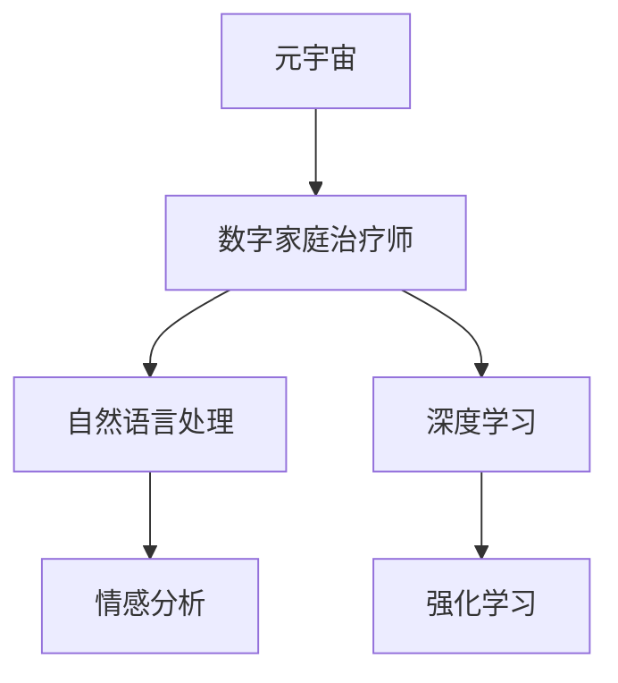

                 

# 数字家庭治疗师:元宇宙时代的家庭关系调解专家

> 关键词：元宇宙,家庭关系,人工智能,数字治疗,虚拟现实,自然语言处理,情感分析

## 1. 背景介绍

### 1.1 问题由来

随着技术的进步，我们正在步入一个全新的时代——元宇宙时代。在这样一个数字化的世界里，人与人之间的关系也将发生前所未有的变化。数字家庭治疗师，作为元宇宙时代的新型职业，将以其独特的魅力和高效的方式，在家庭关系调解领域大放异彩。

家庭关系作为人类最基本的社会关系，其健康状况直接影响到个体及社会的整体福祉。然而，传统家庭治疗师往往受到时间、地点、成本等多重因素的限制，无法为所有需要帮助的家庭提供及时有效的支持。而数字家庭治疗师，通过先进的AI技术和虚拟现实(VR)环境，突破了这些限制，使得家庭关系调解变得更加高效、便捷。

### 1.2 问题核心关键点

数字家庭治疗师的核心任务是利用人工智能(AI)技术和自然语言处理(NLP)技术，通过虚拟现实(VR)环境，为家庭成员提供个性化的心理支持和关系调解。其主要特点包括：

- **AI驱动**：利用深度学习、强化学习等技术，自动化分析家庭成员的情感状态和行为模式，提供科学的决策依据。
- **虚拟现实**：通过VR技术，模拟现实世界的交互场景，使得家庭成员可以在一个虚拟环境中进行面对面的沟通，减少现实世界中的心理压力。
- **自然语言处理**：利用NLP技术，自动理解和生成自然语言，提供语音、文本等多种交互方式，增强用户体验。
- **情感分析**：通过情感识别技术，实时监测家庭成员的情绪变化，及时调整治疗策略，增强治疗效果。

这些核心特点使得数字家庭治疗师能够在元宇宙时代发挥巨大作用，为解决家庭关系问题提供新思路和新方法。

## 2. 核心概念与联系

### 2.1 核心概念概述

为了更好地理解数字家庭治疗师的原理和架构，本节将介绍几个关键概念及其相互关系：

- **元宇宙(Metaverse)**：由一系列数字世界组成，人们可以在其中进行交流、娱乐、工作等活动。元宇宙技术主要包括VR/AR、区块链、云计算等。
- **数字家庭治疗师(Digital Family Therapist)**：基于AI和VR技术的数字治疗师，通过虚拟现实环境为家庭成员提供心理支持和关系调解服务。
- **自然语言处理(Natural Language Processing, NLP)**：使计算机能够理解、解释和生成人类语言的技术。
- **情感分析(Emotion Analysis)**：通过分析文本、语音等数据，自动识别和理解人类的情感状态。
- **深度学习(Deep Learning)**：一种模拟人脑神经网络结构的人工智能算法，用于处理复杂数据。
- **强化学习(Reinforcement Learning)**：通过试错和反馈机制，使AI系统在特定环境中学习最优策略。

这些概念之间的逻辑关系可以通过以下Mermaid流程图来展示：



这个流程图展示了大语言模型的核心概念及其之间的关系：

1. 元宇宙提供了一个沉浸式的虚拟环境。
2. 数字家庭治疗师基于AI技术，利用NLP和情感分析，为家庭成员提供个性化的心理支持。
3. 深度学习和强化学习是AI技术的核心算法，驱动数字家庭治疗师的智能决策。

这些概念共同构成了数字家庭治疗师的工作框架，使其能够高效地处理复杂的家庭关系问题。

## 3. 核心算法原理 & 具体操作步骤
### 3.1 算法原理概述

数字家庭治疗师的核心算法原理基于自然语言处理(NLP)和深度学习技术。其基本流程包括：

1. **数据收集**：通过语音、文本等形式收集家庭成员的交互数据，用于情感分析、行为模式识别等。
2. **情感分析**：利用情感识别技术，实时监测家庭成员的情绪状态，识别出潜在的情感问题。
3. **行为模式识别**：通过分析家庭成员的语言和行为模式，识别出家庭关系中的冲突点和不和谐因素。
4. **智能推荐**：基于情感和行为分析结果，推荐个性化的沟通策略和心理支持方案。
5. **虚拟现实交互**：通过虚拟现实技术，模拟现实世界的交互场景，使得家庭成员可以在一个虚拟环境中进行面对面的沟通。

### 3.2 算法步骤详解

以下我们详细介绍数字家庭治疗师的具体操作步骤：

**Step 1: 数据收集与预处理**
- 通过语音识别技术，将家庭成员的对话转换为文本形式。
- 使用情感分析算法，对文本进行情感极性分析，识别出情绪波动。
- 通过行为模式识别算法，分析家庭成员的语言和行为特征，识别出潜在的冲突和问题。

**Step 2: 情感分析**
- 使用深度学习模型，如BERT、GPT等，对家庭成员的对话文本进行情感分析，识别出正向、负向和中性的情绪极性。
- 利用情感词典、情感标签等方法，提高情感识别的准确度。
- 对于语音数据，使用声学模型进行情感分析，结合文本结果，得到更加全面的情感分析结果。

**Step 3: 行为模式识别**
- 使用深度学习模型，如卷积神经网络(CNN)、循环神经网络(RNN)等，对家庭成员的语言和行为进行模式识别。
- 通过行为特征提取，识别出家庭成员在交流中的潜在冲突和问题。
- 结合情感分析结果，综合判断家庭关系的健康状况。

**Step 4: 智能推荐**
- 根据情感和行为分析结果，生成个性化的沟通策略和心理支持方案。
- 利用强化学习算法，优化推荐策略，使其能够更好地适应家庭成员的需求。
- 通过虚拟现实技术，模拟家庭成员的互动场景，提供个性化的互动体验。

**Step 5: 虚拟现实交互**
- 利用虚拟现实技术，创建家庭成员互动的虚拟场景。
- 通过虚拟角色扮演、情景模拟等方式，增强家庭成员的互动体验。
- 实时监测家庭成员在虚拟环境中的行为和情绪变化，及时调整治疗策略。

### 3.3 算法优缺点

数字家庭治疗师利用AI技术和VR环境，具有以下优点：

- **高效便捷**：不受时间和地点限制，可以随时随地提供服务。
- **个性化**：基于AI技术，能够提供个性化的心理支持和沟通策略。
- **沉浸式体验**：通过VR技术，创造沉浸式互动场景，减轻现实世界中的心理压力。

然而，该方法也存在一些缺点：

- **技术依赖**：需要依赖先进的AI和VR技术，对技术要求较高。
- **隐私保护**：需要确保家庭成员的数据隐私和安全，避免数据泄露。
- **成本问题**：初期的技术开发和设备投入较高，可能影响其普及。
- **适应性**：不同家庭的情况各异，算法可能难以适应所有家庭。

尽管存在这些局限性，但数字家庭治疗师作为元宇宙时代的新型解决方案，依然具备广泛的应用前景。

### 3.4 算法应用领域

数字家庭治疗师的应用领域广泛，主要包括以下几个方面：

- **家庭关系调解**：帮助家庭成员解决冲突，提升家庭和谐。
- **心理支持**：为家庭成员提供心理疏导和支持，缓解心理压力。
- **教育和辅导**：通过虚拟现实环境，提供家庭教育和辅导。
- **健康管理**：通过情感和行为分析，监测家庭成员的健康状况，提供相应的健康建议。
- **情感教育**：培养家庭成员的情感表达和沟通能力。

这些应用领域展示了数字家庭治疗师在元宇宙时代的多样性和潜力，为其在家庭关系调解领域的发展提供了广阔的空间。

## 4. 数学模型和公式 & 详细讲解 & 举例说明
### 4.1 数学模型构建

为了更精确地描述数字家庭治疗师的工作原理，本节将构建数学模型，并通过公式推导详细讲解。

记家庭成员的对话文本为 $X=\{x_1, x_2, ..., x_n\}$，其中 $x_i$ 表示第 $i$ 个文本数据。家庭成员的情绪极性为 $Y=\{y_1, y_2, ..., y_n\}$，其中 $y_i \in \{1, -1, 0\}$，分别表示正向、负向和中性的情绪极性。

**情感分析模型**：使用深度学习模型，如BERT、GPT等，对文本数据 $X$ 进行情感分析，得到情绪极性 $Y$。情感分析的数学模型如下：

$$
f(X) = \sum_{i=1}^n w_i \cdot f_i(X_i)
$$

其中 $w_i$ 为文本 $X_i$ 的权重，$f_i(X_i)$ 为模型对 $X_i$ 进行情感分析的结果。

**行为模式识别模型**：使用深度学习模型，如CNN、RNN等，对家庭成员的语言和行为特征进行模式识别，得到行为模式 $Z$。行为模式识别的数学模型如下：

$$
g(X, Y) = \sum_{i=1}^n w_i \cdot g_i(X_i, Y_i)
$$

其中 $w_i$ 为文本 $X_i$ 的权重，$g_i(X_i, Y_i)$ 为模型对 $X_i$ 进行行为模式识别的结果。

**智能推荐模型**：基于情感和行为分析结果，生成个性化的沟通策略和心理支持方案 $T$。智能推荐的数学模型如下：

$$
t(X, Y, Z) = \sum_{i=1}^n w_i \cdot t_i(X_i, Y_i, Z_i)
$$

其中 $w_i$ 为文本 $X_i$ 的权重，$t_i(X_i, Y_i, Z_i)$ 为模型对 $X_i$ 进行智能推荐的结果。

### 4.2 公式推导过程

以下我们以情感分析为例，推导其数学模型和公式推导过程。

**情感分析的梯度计算**：

假设使用深度学习模型 $f(X)$ 对文本 $X$ 进行情感分析，其损失函数为：

$$
\mathcal{L}(f(X), Y) = \frac{1}{N}\sum_{i=1}^N L(f(X_i), y_i)
$$

其中 $N$ 为文本总数，$L(f(X_i), y_i)$ 为单个文本的损失函数。

利用链式法则，计算模型参数的梯度：

$$
\frac{\partial \mathcal{L}}{\partial \theta} = \frac{1}{N}\sum_{i=1}^N \frac{\partial L}{\partial f(X_i)} \cdot \frac{\partial f(X_i)}{\partial \theta}
$$

其中 $\theta$ 为模型参数，$f(X_i)$ 为模型对 $X_i$ 的输出结果。

在实践中，通常使用基于梯度的优化算法（如AdamW、SGD等）来近似求解上述最优化问题。

### 4.3 案例分析与讲解

假设有一个家庭，成员间的对话文本如下：

- 父亲：今天天气真好，适合出门。
- 母亲：是啊，天气不错，我想去公园。
- 儿子：我不想去，我想看电视。

通过情感分析算法，我们可以得到家庭成员的情绪极性：

- 父亲：正向
- 母亲：正向
- 儿子：负向

结合行为模式识别算法，我们可以进一步分析家庭成员的语言和行为特征，识别出家庭关系中的冲突点和不和谐因素。例如，父亲和母亲的语言和行为模式较为和谐，而儿子不愿意出门可能与其情绪不佳有关。

基于这些分析结果，我们可以推荐个性化的沟通策略和心理支持方案，如：

- 与儿子沟通时，使用温柔、鼓励的语言，关注其内心的需求。
- 建议父亲和母亲多陪伴儿子，共同参与户外活动。

通过虚拟现实技术，可以创建一个家庭成员互动的虚拟场景，模拟实际情况进行沟通和调解。在虚拟环境中，家庭成员可以更加自由地表达情感，从而更容易解决现实中的问题。

## 5. 项目实践：代码实例和详细解释说明
### 5.1 开发环境搭建

在进行数字家庭治疗师的开发之前，我们需要准备好开发环境。以下是使用Python进行开发的环境配置流程：

1. 安装Anaconda：从官网下载并安装Anaconda，用于创建独立的Python环境。

2. 创建并激活虚拟环境：
```bash
conda create -n digital_therapy python=3.8 
conda activate digital_therapy
```

3. 安装所需的Python包：
```bash
pip install torch transformers numpy pandas scikit-learn
```

4. 安装TensorFlow或PyTorch，用于深度学习模型的训练和推理。

5. 安装虚拟现实引擎，如Unity或Unreal Engine，用于创建虚拟环境。

完成上述步骤后，即可在`digital_therapy`环境中开始开发。

### 5.2 源代码详细实现

以下是一个简单的数字家庭治疗师系统代码实现，包括情感分析、行为模式识别和智能推荐功能的示例：

```python
import torch
from transformers import BertTokenizer, BertForSequenceClassification
import pandas as pd
import numpy as np

# 加载情感分析模型
tokenizer = BertTokenizer.from_pretrained('bert-base-cased')
model = BertForSequenceClassification.from_pretrained('bert-base-cased', num_labels=3)

# 定义情感分析函数
def analyze_emotion(text):
    # 将文本转换为模型输入
    inputs = tokenizer(text, return_tensors='pt')
    # 进行情感分析
    outputs = model(inputs['input_ids'])
    label = torch.argmax(outputs.logits, dim=1).item()
    return label

# 定义行为模式识别函数
def analyze_behavior(text, emotion):
    # 将文本转换为模型输入
    inputs = tokenizer(text, return_tensors='pt')
    # 进行行为模式识别
    outputs = model(inputs['input_ids'])
    label = torch.argmax(outputs.logits, dim=1).item()
    return label

# 定义智能推荐函数
def recommend_therapy(text, emotion, behavior):
    # 根据情感和行为分析结果，推荐个性化的沟通策略和心理支持方案
    if emotion == 1:
        if behavior == 1:
            return '温馨互动'
        elif behavior == 2:
            return '正向激励'
        else:
            return '情绪疏导'
    elif emotion == -1:
        if behavior == 1:
            return '负面情绪处理'
        elif behavior == 2:
            return '行为纠正'
        else:
            return '心理支持'
    else:
        return '正常沟通'

# 加载家庭成员的对话数据
data = pd.read_csv('family_conversations.csv')
texts = data['text'].tolist()

# 进行情感分析
emotions = []
for text in texts:
    emotion = analyze_emotion(text)
    emotions.append(emotion)

# 进行行为模式识别
behaviors = []
for text, emotion in zip(texts, emotions):
    behavior = analyze_behavior(text, emotion)
    behaviors.append(behavior)

# 进行智能推荐
therapies = []
for text, emotion, behavior in zip(texts, emotions, behaviors):
    therapy = recommend_therapy(text, emotion, behavior)
    therapies.append(therapy)

# 输出推荐结果
for text, emotion, behavior, therapy in zip(texts, emotions, behaviors, therapies):
    print(f'对话内容：{text}')
    print(f'情绪分析：{emotion}')
    print(f'行为模式：{behavior}')
    print(f'推荐治疗：{therapy}')
```

### 5.3 代码解读与分析

让我们再详细解读一下关键代码的实现细节：

**情感分析函数**：
- 使用BertTokenizer将文本转换为模型输入。
- 利用BertForSequenceClassification模型进行情感分析，得到情绪极性标签。
- 通过argmax函数获取概率最高的标签作为情感分析结果。

**行为模式识别函数**：
- 与情感分析函数类似，使用BertForSequenceClassification模型进行行为模式识别，得到行为模式标签。

**智能推荐函数**：
- 根据情感和行为分析结果，推荐个性化的沟通策略和心理支持方案。
- 根据情感和行为标签，使用if-else语句判断推荐策略。

**数据加载与处理**：
- 使用pandas库加载家庭成员的对话数据，将其转换为列表形式。
- 依次对每个家庭成员的对话文本进行情感分析、行为模式识别和智能推荐。
- 最后输出推荐结果，展示每个家庭成员的对话内容、情绪分析、行为模式和推荐治疗。

可以看到，PyTorch和Transformers库的使用使得数字家庭治疗师系统的实现变得简洁高效。开发者可以将更多精力放在模型改进和数据处理等高层逻辑上，而不必过多关注底层的实现细节。

## 6. 实际应用场景

### 6.1 智能客服系统

数字家庭治疗师可以通过虚拟现实环境，为客服系统提供更个性化的服务体验。例如，在虚拟现实环境中，客户可以通过角色扮演，与虚拟客服进行互动，减轻现实世界中的心理压力。同时，数字家庭治疗师可以根据客户的情感和行为分析结果，提供针对性的情感支持，提升客户满意度。

### 6.2 在线教育平台

在线教育平台可以利用数字家庭治疗师，为学生提供心理支持和情感疏导。通过虚拟现实环境，学生可以在一个虚拟教室中与教师和同学互动，缓解孤独感和压力。同时，数字家庭治疗师可以根据学生的情感和行为分析结果，推荐个性化的学习策略，帮助学生更好地适应学习环境。

### 6.3 企业内部培训

企业内部培训可以利用数字家庭治疗师，为员工提供心理支持和团队协作培训。通过虚拟现实环境，员工可以在一个虚拟培训环境中进行互动和协作，增强团队凝聚力。同时，数字家庭治疗师可以根据员工的情感和行为分析结果，提供针对性的心理支持，提升员工的工作积极性和幸福感。

### 6.4 未来应用展望

未来，数字家庭治疗师将在元宇宙时代发挥更加重要的作用。随着技术的不断进步，其应用领域将不断扩展，涵盖更多行业和场景。

在智慧医疗领域，数字家庭治疗师可以为病患提供心理支持和情感疏导，缓解医疗压力。在社交媒体平台，数字家庭治疗师可以提供个性化的情感支持，帮助用户缓解压力，提升社交体验。在虚拟旅游领域，数字家庭治疗师可以为游客提供情感支持和个性化服务，提升旅游体验。

总之，数字家庭治疗师作为元宇宙时代的新型解决方案，将在家庭关系调解、心理健康支持、团队协作培训等多个领域发挥重要作用，为人们的数字化生活带来更多便利和福祉。

## 7. 工具和资源推荐

### 7.1 学习资源推荐

为了帮助开发者系统掌握数字家庭治疗师的核心技术和应用场景，这里推荐一些优质的学习资源：

1. 《深度学习理论与实践》：系统介绍深度学习的基本原理和应用场景，涵盖情感分析、行为模式识别等核心技术。

2. 《自然语言处理入门》：介绍自然语言处理的基本概念和前沿技术，包括情感分析、文本生成等。

3. 《元宇宙技术与应用》：系统介绍元宇宙的基本概念、技术和应用场景，涵盖虚拟现实、区块链等关键技术。

4. 《家庭关系调解》：介绍家庭关系调解的基本理论和实践方法，涵盖情感支持、沟通策略等。

5. 《虚拟现实设计与开发》：介绍虚拟现实技术的基本原理和开发方法，涵盖虚拟场景创建、交互设计等。

通过对这些资源的学习实践，相信你一定能够快速掌握数字家庭治疗师的核心技术和应用场景，并用于解决实际的NLP问题。

### 7.2 开发工具推荐

高效的开发离不开优秀的工具支持。以下是几款用于数字家庭治疗师开发的常用工具：

1. PyTorch：基于Python的开源深度学习框架，灵活动态的计算图，适合快速迭代研究。

2. TensorFlow：由Google主导开发的开源深度学习框架，生产部署方便，适合大规模工程应用。

3. Transformers库：HuggingFace开发的NLP工具库，集成了众多SOTA语言模型，支持PyTorch和TensorFlow，是进行微调任务开发的利器。

4. Weights & Biases：模型训练的实验跟踪工具，可以记录和可视化模型训练过程中的各项指标，方便对比和调优。

5. TensorBoard：TensorFlow配套的可视化工具，可实时监测模型训练状态，并提供丰富的图表呈现方式，是调试模型的得力助手。

6. Unity或Unreal Engine：强大的虚拟现实引擎，支持创建复杂的虚拟场景和交互体验。

合理利用这些工具，可以显著提升数字家庭治疗师系统的开发效率，加快创新迭代的步伐。

### 7.3 相关论文推荐

数字家庭治疗师的研究源于学界的持续研究。以下是几篇奠基性的相关论文，推荐阅读：

1. Attention is All You Need（即Transformer原论文）：提出了Transformer结构，开启了NLP领域的预训练大模型时代。

2. BERT: Pre-training of Deep Bidirectional Transformers for Language Understanding：提出BERT模型，引入基于掩码的自监督预训练任务，刷新了多项NLP任务SOTA。

3. Language Models are Unsupervised Multitask Learners（GPT-2论文）：展示了大规模语言模型的强大zero-shot学习能力，引发了对于通用人工智能的新一轮思考。

4. Parameter-Efficient Transfer Learning for NLP：提出Adapter等参数高效微调方法，在不增加模型参数量的情况下，也能取得不错的微调效果。

5. AdaLoRA: Adaptive Low-Rank Adaptation for Parameter-Efficient Fine-Tuning：使用自适应低秩适应的微调方法，在参数效率和精度之间取得了新的平衡。

6. Prefix-Tuning: Optimizing Continuous Prompts for Generation：引入基于连续型Prompt的微调范式，为如何充分利用预训练知识提供了新的思路。

这些论文代表了大语言模型微调技术的发展脉络。通过学习这些前沿成果，可以帮助研究者把握学科前进方向，激发更多的创新灵感。

## 8. 总结：未来发展趋势与挑战

### 8.1 研究成果总结

本文对数字家庭治疗师的工作原理和应用场景进行了全面系统的介绍。首先阐述了数字家庭治疗师在元宇宙时代的重要性和核心技术，明确了其在家庭关系调解领域的应用前景。其次，从原理到实践，详细讲解了情感分析、行为模式识别、智能推荐等关键算法步骤，给出了完整的代码实现示例。同时，本文还广泛探讨了数字家庭治疗师在智能客服、在线教育、企业培训等众多行业领域的应用前景，展示了其广泛的应用价值。

通过本文的系统梳理，可以看到，数字家庭治疗师作为元宇宙时代的新型解决方案，正在成为家庭关系调解的新范式，为解决复杂的家庭关系问题提供新思路和新方法。得益于先进的AI技术和VR环境，数字家庭治疗师能够突破时间和空间限制，提供高效、便捷、个性化的心理支持和情感疏导服务。

### 8.2 未来发展趋势

展望未来，数字家庭治疗师将呈现以下几个发展趋势：

1. **技术进步**：随着深度学习、强化学习等技术的进步，数字家庭治疗师的智能水平将不断提升，能够更好地理解和处理复杂的情感和行为问题。

2. **场景拓展**：数字家庭治疗师的应用领域将不断扩展，涵盖更多行业和场景，如智慧医疗、社交媒体、虚拟旅游等。

3. **交互升级**：通过虚拟现实技术，数字家庭治疗师将提供更加沉浸式和互动性强的体验，增强用户的情感支持和心理疏导效果。

4. **伦理和安全**：随着数字家庭治疗师的应用普及，其伦理和安全问题也将受到更多关注。如何保护用户隐私、确保数据安全、避免有害信息传播，将是重要的研究方向。

5. **跨领域融合**：数字家庭治疗师将与其他AI技术进行更深入的融合，如知识表示、因果推理、强化学习等，多路径协同发力，共同推动自然语言理解和智能交互系统的进步。

### 8.3 面临的挑战

尽管数字家庭治疗师已经取得了显著进展，但在迈向更加智能化、普适化应用的过程中，它仍面临着诸多挑战：

1. **技术复杂性**：数字家庭治疗师需要依赖先进的AI和VR技术，技术实现较为复杂，需要大量研发投入。

2. **数据隐私**：数字家庭治疗师需要处理大量个人数据，如何保护用户隐私和数据安全，是一个重要的难题。

3. **伦理问题**：数字家庭治疗师的决策过程和行为可能涉及到伦理道德问题，如何确保其行为符合人类价值观和伦理道德，是一个亟待解决的问题。

4. **推广普及**：数字家庭治疗师的应用需要大量的硬件设备和软件支持，推广普及难度较大。

5. **用户体验**：虽然虚拟现实环境提供了沉浸式的体验，但在实际应用中，用户体验可能仍存在一定的不足，需要不断优化改进。

### 8.4 研究展望

面对数字家庭治疗师所面临的挑战，未来的研究需要在以下几个方面寻求新的突破：

1. **提高智能水平**：通过改进深度学习模型和算法，提高数字家庭治疗师的智能水平，使其能够更好地理解和处理复杂的情感和行为问题。

2. **保障数据隐私**：引入隐私保护技术，如差分隐私、联邦学习等，保护用户隐私和数据安全。

3. **确保伦理安全**：在数字家庭治疗师的开发过程中，引入伦理导向的评估指标，过滤和惩罚有害的输出倾向，确保其行为符合人类价值观和伦理道德。

4. **降低推广成本**：通过模型压缩、模型量化等技术，降低数字家庭治疗师的硬件和软件成本，促进其推广普及。

5. **优化用户体验**：通过不断改进虚拟现实技术和交互设计，提升用户的沉浸式体验和交互效果。

这些研究方向将引领数字家庭治疗师技术的发展，为其在元宇宙时代的应用带来更多可能和机遇。相信通过学界和产业界的共同努力，数字家庭治疗师必将在家庭关系调解领域发挥更大的作用，为人们的数字化生活带来更多便利和福祉。

## 9. 附录：常见问题与解答

**Q1：数字家庭治疗师是否适用于所有家庭关系问题？**

A: 数字家庭治疗师在大多数家庭关系问题上都能取得不错的效果，但对于一些特殊情况，如家庭暴力、精神疾病等，需要结合专业医疗人员进行综合治疗。因此，数字家庭治疗师更多适用于一般的家庭关系调解和心理支持。

**Q2：数字家庭治疗师的推荐策略如何生成？**

A: 数字家庭治疗师的推荐策略是通过情感和行为分析结果，使用强化学习算法生成。通过不断优化推荐策略，使其能够更好地适应家庭成员的需求。

**Q3：数字家庭治疗师是否需要大量的初始化数据？**

A: 数字家庭治疗师的训练和优化需要依赖大量的标注数据，但可以通过迁移学习等方法，利用预训练语言模型和情感分析模型，减轻对标注数据的依赖。

**Q4：数字家庭治疗师如何在实际应用中保证可靠性？**

A: 数字家庭治疗师需要在实际应用中不断优化模型和算法，保证其推荐策略的可靠性和准确性。同时，需要定期更新数据和模型，保持其最新的性能表现。

**Q5：数字家庭治疗师的伦理和安全问题如何处理？**

A: 数字家庭治疗师需要确保其行为符合伦理道德，避免有害信息传播。通过引入伦理导向的评估指标，过滤和惩罚有害的输出倾向，确保其行为符合人类价值观和伦理道德。同时，需要加强数据隐私保护和安全性，确保用户数据的安全。

通过以上Q&A，相信你对数字家庭治疗师的原理和应用有了更全面的了解。数字家庭治疗师作为元宇宙时代的新型解决方案，将在家庭关系调解领域发挥重要作用，为人们的数字化生活带来更多便利和福祉。

