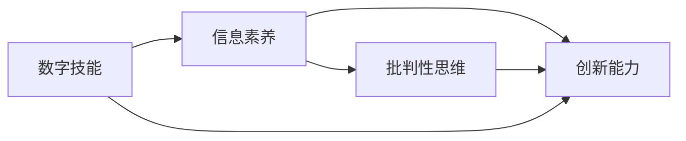

                 

# 数字素养：公民参与的基石

## 1. 背景介绍

### 1.1 问题由来

在数字时代，信息技术的迅猛发展极大地改变了社会生活和工作方式。数字素养（Digital Literacy），作为公民在信息社会中生存和发展的基本能力，其重要性日益凸显。数字素养不仅涉及对数字技术的掌握和应用，更涵盖了批判性思维、信息筛选、创新创造等高阶能力。然而，当前数字素养的普及程度参差不齐，部分群体，尤其是老年人、儿童、低收入家庭，在数字技术普及和应用方面存在较大差距。

数字素养的提升，不仅能帮助个体更好地适应数字化社会，提升生活质量和工作效率，还能促进社会整体的信息共享、协作和创新。此外，公民的广泛数字素养也是推动数字经济发展的关键，有助于促进信息消费、推动智慧城市建设、促进社会包容性发展。因此，从政策层面推动数字素养的普及，是当前和未来社会发展的重要任务。

### 1.2 问题核心关键点

数字素养的核心关键点包括：

- **数字技能**：掌握基本数字技术，如计算机操作、网络使用、移动设备应用等。
- **信息获取与分析**：能够从海量信息中筛选有价值内容，利用工具进行信息加工和分析。
- **数字化沟通**：熟练使用电子邮件、社交媒体、视频会议等在线沟通工具，促进信息共享和协作。
- **批判性思维**：具备辨别信息真伪、筛选噪音数据的能力，避免被虚假信息误导。
- **创新与创造**：能够运用数字工具进行创意表达、设计和开发，解决实际问题。

数字素养不仅仅是个人技能，更是社会整体发展和进步的基石。本文将系统介绍数字素养的理论基础、实践方法和应用场景，为推动数字素养的普及和提升提供参考。

## 2. 核心概念与联系

### 2.1 核心概念概述

数字素养概念具有多维度的内涵，涉及信息获取、处理、评估、创新等多方面能力的培养。核心概念包括：

- **数字技能（Digital Skills）**：计算机操作、网络使用、移动应用等基本技能。
- **信息素养（Information Literacy）**：信息获取、信息筛选、信息分析等能力。
- **创新能力（Creative Skills）**：利用数字工具进行设计和开发，解决实际问题的能力。

这些概念之间相互关联，构成数字素养的整体框架。其中，信息素养是数字素养的核心，通过提升信息获取和分析能力，可以更好地掌握数字技能和创新能力。

### 2.2 核心概念原理和架构的 Mermaid 流程图



这个流程图展示了数字素养各核心概念之间的逻辑关系：数字技能是信息素养的基础，批判性思维是信息素养的重要补充，创新能力是信息素养和批判性思维的综合体现。

## 3. 核心算法原理 & 具体操作步骤

### 3.1 算法原理概述

数字素养的培养，需要系统性的理论指导和实践操作。本文将从理论和实践两个层面，介绍数字素养的培养方法和步骤。

数字素养培养的算法原理，主要基于认知心理学和教育学的理论框架。核心思想是：通过逐步构建学生的信息意识、信息技能和信息伦理，培养其全面发展的数字素养。具体步骤如下：

1. **信息意识培养**：引入信息时代的概念，让学生理解信息技术的普遍应用和重要性。
2. **信息技能训练**：通过系统性课程和实践活动，训练学生掌握基本的信息获取、处理和分析技能。
3. **信息伦理教育**：强调信息获取和使用的道德规范，培养学生的批判性思维和信息安全意识。

### 3.2 算法步骤详解

数字素养的培养步骤，可以大致分为理论学习、实践操作和评估反馈三个阶段。具体步骤包括：

#### 3.2.1 理论学习阶段

- **课程设置**：根据学生年龄和知识背景，设计适合的信息素养课程。课程应涵盖计算机操作、网络使用、信息筛选、数据分析、创新设计等多个方面。
- **教学材料**：使用丰富的教学资源，包括多媒体课件、案例分析、实践任务等，帮助学生理解和掌握相关知识。
- **教师指导**：教师在课程中应注重引导和启发，通过互动教学、小组讨论等形式，激发学生的学习兴趣和积极性。

#### 3.2.2 实践操作阶段

- **实操训练**：通过实际操作，让学生在真实的数字环境中体验信息获取、处理和应用。例如，设计课程项目、参加在线竞赛、参与社区服务等方式。
- **案例分析**：引导学生通过分析实际案例，理解信息素养的重要性，提升批判性思维能力。
- **创新设计**：鼓励学生运用数字工具进行创意设计和项目开发，培养其创新能力和问题解决能力。

#### 3.2.3 评估反馈阶段

- **学习评估**：通过定期的测试和项目评估，了解学生的学习进展和薄弱环节。
- **反馈改进**：根据评估结果，调整教学计划和课程内容，不断优化教学效果。
- **持续支持**：提供课外辅导、在线资源等支持，帮助学生持续提升数字素养水平。

### 3.3 算法优缺点

数字素养培养的算法具有以下优点：

- **系统性和全面性**：理论学习和实践操作相结合，帮助学生全面掌握数字技能、信息素养和创新能力。
- **灵活性和适应性**：可根据学生的不同需求和兴趣，设计多样化的教学内容和活动，适应不同层次和背景的学生。

同时，该算法也存在一些局限性：

- **时间成本高**：系统性的课程设计和实践活动需要较长时间和资源投入。
- **教师资源有限**：高素质的教师资源相对稀缺，可能影响教学效果。
- **技术更新快**：信息技术快速发展，课程内容和教学方法需要及时更新。

### 3.4 算法应用领域

数字素养培养的算法，不仅适用于学校教育，还能扩展到企业培训、社区推广等多个领域。具体应用包括：

- **学校教育**：通过信息素养课程和实践活动，培养学生的数字素养，提升其信息处理和创新能力。
- **企业培训**：通过专业技能培训和数字工具使用指导，提升员工的信息素养，提升工作效率和创新能力。
- **社区推广**：通过公众讲座、在线课程等方式，普及数字素养知识，促进社会整体的信息共享和协作。

## 4. 数学模型和公式 & 详细讲解 & 举例说明

### 4.1 数学模型构建

数字素养的培养可以通过数学模型来量化和评估。以下是一个简化的数学模型：

- **输入**：学生的初始数字素养水平（S），教师的指导能力（T），教学资源（R）。
- **输出**：学生最终的数字素养水平（S'）。

模型如下：

$$S' = f(S, T, R)$$

其中，$f$ 表示函数关系，用于描述输入和输出之间的关系。

### 4.2 公式推导过程

根据数字素养的培养步骤，可以推导出如下公式：

$$S' = S + \alpha(T \times R)$$

其中，$\alpha$ 表示权重系数，$T \times R$ 表示教师指导和教学资源的乘积，反映了教学效果。

### 4.3 案例分析与讲解

以学校信息素养课程为例，分析数字素养培养的数学模型：

- **初始数字素养水平**：S
- **教师指导能力**：T
- **教学资源**：R

通过系统的课程和实操训练，学生最终的数字素养水平提升为 $S'$。

**案例分析**：
- 假设初始数字素养水平为 50，教师指导能力为 80，教学资源为 90。
- 根据公式 $S' = 50 + 0.7 \times 80 \times 90$，计算得 $S' \approx 646$。

**解释**：
- 通过优秀的教师指导和丰富的教学资源，学生的数字素养水平有显著提升。
- 该模型反映了数字素养培养的关键因素：教师能力和教学资源。

## 5. 项目实践：代码实例和详细解释说明

### 5.1 开发环境搭建

数字素养培养的项目实践，需要搭建一个包含在线课程、互动教学、评估反馈等功能的系统。以下是具体搭建流程：

1. **环境配置**：使用 Python 和 Flask 搭建后端服务器，使用 React 和 Node.js 搭建前端界面。
2. **课程设计**：开发在线课程管理系统，设计涵盖计算机操作、网络使用、信息筛选、数据分析、创新设计等多个模块的课程。
3. **互动教学**：实现在线答疑、小组讨论、互动测试等功能，增强学生的参与度和学习效果。
4. **评估反馈**：开发在线评估系统，通过定期的测试和项目评估，了解学生的学习进展和薄弱环节。
5. **资源支持**：提供丰富的教学资源，包括多媒体课件、案例分析、实践任务等，帮助学生理解和掌握相关知识。

### 5.2 源代码详细实现

以下是使用 Flask 和 React 搭建数字素养培养系统的简要代码实现：

**Flask 后端代码**：

```python
from flask import Flask, request, render_template
from flask_sqlalchemy import SQLAlchemy

app = Flask(__name__)
app.config['SQLALCHEMY_DATABASE_URI'] = 'sqlite:////tmp/test.db'
db = SQLAlchemy(app)

class Student(db.Model):
    id = db.Column(db.Integer, primary_key=True)
    name = db.Column(db.String(50))
    age = db.Column(db.Integer)
    skill_level = db.Column(db.Integer)

@app.route('/')
def index():
    students = Student.query.all()
    return render_template('index.html', students=students)

@app.route('/add_student', methods=['POST'])
def add_student():
    name = request.form['name']
    age = request.form['age']
    skill_level = request.form['skill_level']
    student = Student(name=name, age=age, skill_level=skill_level)
    db.session.add(student)
    db.session.commit()
    return 'Student added successfully'

if __name__ == '__main__':
    app.run(debug=True)
```

**React 前端代码**：

```javascript
import React, { useState, useEffect } from 'react';
import axios from 'axios';

function App() {
  const [students, setStudents] = useState([]);

  useEffect(() => {
    axios.get('/api/students')
      .then(response => setStudents(response.data))
      .catch(error => console.log(error));
  }, []);

  return (
    <div>
      <h1>Student List</h1>
      <table>
        <thead>
          <tr>
            <th>Name</th>
            <th>Age</th>
            <th>Skill Level</th>
          </tr>
        </thead>
        <tbody>
          {students.map(student => (
            <tr key={student.id}>
              <td>{student.name}</td>
              <td>{student.age}</td>
              <td>{student.skill_level}</td>
            </tr>
          ))}
        </tbody>
      </table>
    </div>
  );
}

export default App;
```

### 5.3 代码解读与分析

以下是关键代码的实现细节：

**Flask 后端代码**：
- 定义 Flask 应用，配置数据库连接，定义学生模型。
- 实现首页和添加学生的路由处理。
- 通过 SQLAlchemy 进行数据库操作，实现学生信息的 CRUD 操作。

**React 前端代码**：
- 使用 useState 和 useEffect 管理组件状态和数据获取。
- 通过 axios 发送 HTTP 请求，获取后端学生列表数据。
- 展示学生列表，通过表格形式展示学生信息。

### 5.4 运行结果展示

通过上述代码，可以搭建一个简单的学生信息管理系统。学生信息包括姓名、年龄和技能水平。教师可以通过添加学生信息、查看学生列表等方式，管理学生的学习进展。

## 6. 实际应用场景

### 6.1 智慧校园

数字素养培养在智慧校园中的应用，可以通过以下方式实现：

- **线上学习平台**：提供在线课程、互动教学、评估反馈等功能，帮助学生提升数字素养。
- **智能教室**：使用智能黑板、交互式投影等设备，增强课堂互动和教学效果。
- **学习数据分析**：通过大数据分析，了解学生学习行为和效果，及时调整教学策略。

### 6.2 企业培训

企业可以通过以下方式，提升员工的数字素养：

- **在线培训平台**：提供在线课程和实践任务，培养员工的数字技能和创新能力。
- **技能认证**：通过在线考试和项目评估，认证员工的信息素养水平，激励员工学习。
- **知识共享**：建立知识库和社区平台，促进员工之间的知识分享和协作。

### 6.3 社区教育

数字素养培养在社区教育中的应用，可以通过以下方式实现：

- **在线讲座和课程**：通过社区活动中心或线上平台，普及数字素养知识。
- **家庭指导**：开展家庭数字素养培训，帮助家长和孩子共同提升数字素养。
- **志愿服务**：组织社区志愿者进行数字素养推广，提供线上线下指导。

## 7. 工具和资源推荐

### 7.1 学习资源推荐

为了帮助读者深入理解数字素养的理论基础和实践方法，以下是一些优质的学习资源：

1. **《数字素养教育手册》**：系统介绍了数字素养的核心概念、培养方法和评估方法，适合教师和家长参考。
2. **Khan Academy**：提供丰富的在线课程和互动教学资源，帮助学生提升数字技能和信息素养。
3. **Google Digital Garage**：提供免费的在线课程和实战项目，帮助用户掌握数字技能和创新能力。

### 7.2 开发工具推荐

数字素养培养的开发，需要多种工具支持。以下是一些推荐的开发工具：

1. **Python**：Python 语言简单易用，拥有丰富的科学计算和数据分析库，适合开发数字素养培养系统。
2. **Flask**：轻量级的 Web 框架，易于搭建在线课程和管理系统。
3. **React**：流行的前端框架，适合开发交互式用户界面和互动教学功能。
4. **TensorFlow**：强大的深度学习框架，适合开发数据分析和智能推荐系统。

### 7.3 相关论文推荐

数字素养的理论研究和技术实践，推动了学术界和产业界的发展。以下是几篇重要的相关论文：

1. **《数字素养教育的未来》**：展望数字素养教育的未来发展方向，提出多种创新教育方法。
2. **《数字素养与信息技术应用》**：探讨数字素养对信息技术应用的影响，提出多种数字素养培养策略。
3. **《数字素养评估与提升策略》**：提出多种数字素养评估方法，评估学生在不同阶段的数字素养水平。

## 8. 总结：未来发展趋势与挑战

### 8.1 研究成果总结

数字素养的培养已经取得显著进展，但仍面临诸多挑战。主要成果包括：

- **理论框架构建**：建立数字素养的理论框架，系统性指导数字素养培养。
- **实践方法探索**：通过多种教学方法和工具，提升学生的数字素养。
- **应用场景拓展**：在智慧校园、企业培训、社区教育等多个领域，推广数字素养培养。

### 8.2 未来发展趋势

未来数字素养的发展趋势包括：

- **全员普及**：数字素养的普及将进一步拓展，覆盖更多年龄和背景的群体。
- **终身学习**：数字素养将成为终身学习的重要内容，适应数字化社会的不断变化。
- **跨学科融合**：数字素养与STEM（科学、技术、工程、数学）教育深度融合，提升学生综合素质。

### 8.3 面临的挑战

数字素养培养仍面临以下挑战：

- **资源不足**：高质量的教学资源和专业教师相对稀缺，限制了数字素养的普及。
- **技术更新快**：信息技术快速发展，需要不断更新教学内容和工具。
- **差异化需求**：不同群体的数字素养需求不同，需要差异化的教学策略。

### 8.4 研究展望

未来数字素养的研究方向包括：

- **个性化培养**：通过智能推荐系统，个性化培养学生的数字素养。
- **多模态学习**：结合图像、音频、视频等多种模态信息，提升学习效果。
- **虚拟现实技术**：利用虚拟现实技术，提供沉浸式学习体验，增强教学效果。

## 9. 附录：常见问题与解答

**Q1：数字素养培养的核心要素是什么？**

A: 数字素养培养的核心要素包括数字技能、信息素养、创新能力、批判性思维等。

**Q2：如何评估学生的数字素养水平？**

A: 数字素养水平的评估可以通过定期的测试、项目评估、课堂表现等多种方式进行。

**Q3：数字素养培养的主要挑战是什么？**

A: 数字素养培养的主要挑战包括资源不足、技术更新快、差异化需求等。

**Q4：数字素养培养的未来方向是什么？**

A: 未来数字素养培养的方向包括全员普及、终身学习、跨学科融合、个性化培养、多模态学习等。

作者：禅与计算机程序设计艺术 / Zen and the Art of Computer Programming

