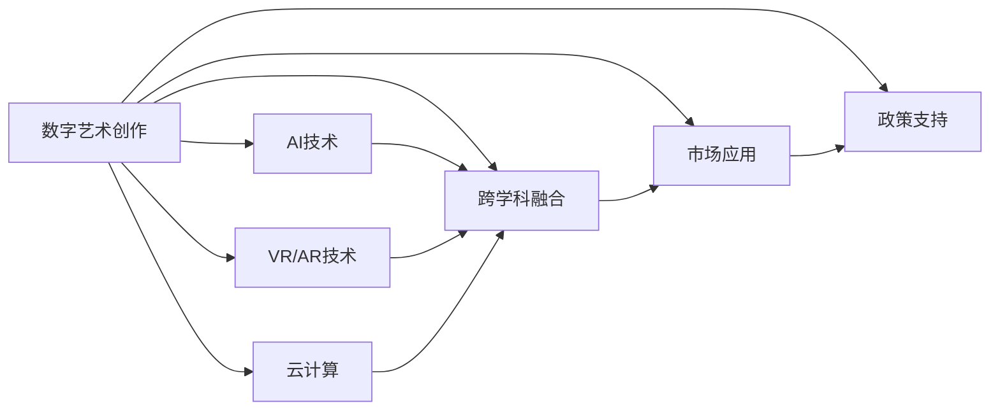

                 

# 数字艺术在硅谷的发展前景

## 1. 背景介绍

### 1.1 问题由来

在硅谷这个全球科技创新中心，数字艺术作为人工智能与创意产业结合的新兴领域，正经历着前所未有的发展热潮。从虚拟现实(VR)、增强现实(AR)到生成对抗网络(GANs)，硅谷的企业和研究人员正运用最前沿的技术手段，将艺术创作和体验带入新的维度。数字艺术的兴起，不仅改变了传统的艺术表现形式，也为硅谷带来了新的增长点。

### 1.2 问题核心关键点

数字艺术在硅谷的崛起，很大程度上得益于以下几个关键因素：

- **技术革新**：AI、VR/AR、云计算等技术的发展，为数字艺术创作和体验提供了强有力的技术支撑。
- **跨学科融合**：计算机科学、艺术设计、心理学等学科的交叉融合，为数字艺术的发展提供了广阔的理论基础和创意空间。
- **市场需求**：随着人们对数字媒体的消费习惯不断增强，数字艺术市场逐渐成熟，为创业者提供了新的商业机会。
- **政策支持**：硅谷政府和投资机构对创新科技的支持，为数字艺术项目的孵化和成长提供了良好的环境。

这些关键点共同推动了数字艺术在硅谷的发展，使其成为了一个充满活力的创新热点。

### 1.3 问题研究意义

研究数字艺术在硅谷的发展前景，不仅有助于理解新兴技术对传统艺术的影响，还能够为艺术界和科技界提供重要的参考。通过对数字艺术在硅谷的现状和未来趋势进行分析，可以洞察技术进步对艺术创作和体验方式的革新，指导未来的研究方向和商业布局。

## 2. 核心概念与联系

### 2.1 核心概念概述

数字艺术（Digital Art），是一种利用数字技术和计算机图形学进行创作和表达的艺术形式。其核心在于通过软件工具和算法，将艺术家的创意转化为可视化的数字作品。硅谷作为全球科技创新的中心，拥有丰富的技术资源和人才储备，成为数字艺术发展的理想之地。

### 2.2 核心概念原理和架构的 Mermaid 流程图



这个流程图展示了数字艺术在硅谷发展的主要路径：从数字艺术创作出发，借助AI、VR/AR、云计算等技术支持，通过跨学科融合，最终应用于市场并得到政策支持。

## 3. 核心算法原理 & 具体操作步骤

### 3.1 算法原理概述

数字艺术创作的核心算法包括但不限于计算机图形学、图像处理、计算机视觉、深度学习等。其中，深度学习在数字艺术中的应用尤为广泛，尤其是在生成对抗网络（GANs）和变分自编码器（VAEs）等领域。

GANs是一种基于对抗训练的生成模型，通过两个神经网络（生成器和判别器）的竞争，生成逼真的数字图像。VAEs则是一种无监督学习方法，通过编码器将高维数据压缩到低维空间，再通过解码器将数据还原，实现数据压缩和重构。

### 3.2 算法步骤详解

数字艺术的创作流程大致分为以下几个步骤：

1. **创意构思**：艺术家提出创作主题和设计方案。
2. **算法实现**：使用Python、C++、MATLAB等编程语言，结合深度学习框架（如TensorFlow、PyTorch）实现算法模型。
3. **数据准备**：收集和准备用于训练和测试的数据集。
4. **模型训练**：使用GPU或TPU进行模型训练，优化算法参数。
5. **效果验证**：通过视觉和听觉反馈，验证创作效果。
6. **作品展示**：利用VR/AR设备或数字展示平台，向观众展示数字艺术作品。

### 3.3 算法优缺点

数字艺术创作中的算法具有以下优点：

- **高度定制化**：算法可以根据艺术家的创意进行定制，实现独特的艺术风格。
- **效率提升**：自动化流程大大提升了创作效率，缩短了创作周期。
- **广泛应用**：算法可以应用于多种艺术形式，如数字绘画、动画、视频等。

然而，算法创作也存在一些缺点：

- **技术门槛高**：需要一定的编程和算法基础，门槛较高。
- **作品差异化**：过于依赖算法可能导致作品缺乏个性化和独特性。
- **技术限制**：算法生成的作品可能存在技术局限，如细节处理、动态效果等。

### 3.4 算法应用领域

数字艺术在硅谷的应用领域极为广泛，涵盖了以下多个方面：

- **虚拟现实和增强现实**：将数字艺术作品通过VR/AR技术呈现，提供沉浸式的艺术体验。
- **数字雕塑和绘画**：利用计算机图形学技术，创作数字雕塑和绘画作品。
- **数字音乐和影视**：通过深度学习和音频处理技术，生成数字音乐和数字影视作品。
- **交互式艺术**：开发互动式数字艺术作品，增强观众参与感。
- **艺术教育**：利用数字艺术工具和平台，进行艺术创作和教育的创新。

## 4. 数学模型和公式 & 详细讲解 & 举例说明

### 4.1 数学模型构建

数字艺术创作中的数学模型主要基于以下几类算法：

- **计算机图形学**：涉及线性代数、几何学、拓扑学等数学理论。
- **图像处理**：包括卷积运算、傅里叶变换、小波变换等数学方法。
- **计算机视觉**：利用图像分割、目标检测等数学模型进行视觉分析。
- **深度学习**：包括神经网络、卷积神经网络（CNNs）、生成对抗网络（GANs）等。

### 4.2 公式推导过程

以生成对抗网络（GANs）为例，其核心算法由两个神经网络组成：生成器（Generator）和判别器（Discriminator）。

生成器的目标是生成逼真的数字图像，其训练过程如下：

$$
G: \mathbb{Z} \rightarrow \mathbb{R}^d
$$

其中，$\mathbb{Z}$ 表示噪声向量，$\mathbb{R}^d$ 表示生成器输出的图像特征向量。生成器的目标是最小化生成图像与真实图像的差异，即：

$$
\min_G \mathcal{L}(G)
$$

判别器的目标是区分真实图像和生成图像，其训练过程如下：

$$
D: \mathbb{R}^d \rightarrow [0,1]
$$

判别器的训练目标是最小化真实图像的真实概率，最大化生成图像的伪造概率，即：

$$
\min_D \mathcal{L}(D)
$$

其中，$\mathcal{L}(D)$ 为判别器的损失函数。通过对抗训练，生成器和判别器交替优化，最终生成逼真的数字图像。

### 4.3 案例分析与讲解

以数字艺术家Theodore Geisel（笔名Dr. Seuss）为例，他在创作《The Lorax》时，使用计算机图形学和深度学习技术，将文字和图像结合，创作出独特的数字插画。通过优化算法，Geisel能够在短时间内创作出大量的作品，并在全球范围内推广他的艺术。

## 5. 项目实践：代码实例和详细解释说明

### 5.1 开发环境搭建

数字艺术创作需要高性能的计算资源，因此需要搭建以下开发环境：

- **硬件配置**：建议使用带有GPU或TPU的计算机，以提升计算速度。
- **软件环境**：安装Python 3.x、TensorFlow、PyTorch等深度学习框架，以及相关的图像处理库和工具。

### 5.2 源代码详细实现

以下是一个使用PyTorch实现GANs的基本代码示例：

```python
import torch
import torch.nn as nn
import torch.optim as optim

# 定义生成器模型
class Generator(nn.Module):
    def __init__(self):
        super(Generator, self).__init__()
        self.encoder = nn.Sequential(
            nn.Linear(100, 256),
            nn.ReLU(),
            nn.Linear(256, 512),
            nn.ReLU(),
            nn.Linear(512, 1024),
            nn.ReLU(),
            nn.Linear(1024, 3*3*256)
        )
        self.decoder = nn.Sequential(
            nn.ConvTranspose2d(256, 128, 4, stride=2, padding=1),
            nn.ReLU(),
            nn.ConvTranspose2d(128, 64, 4, stride=2, padding=1),
            nn.ReLU(),
            nn.ConvTranspose2d(64, 3, 4, stride=2, padding=1, output_padding=1),
            nn.Tanh()
        )

    def forward(self, x):
        x = self.encoder(x)
        x = x.view(x.size(0), 256, 1, 1)
        x = self.decoder(x)
        return x

# 定义判别器模型
class Discriminator(nn.Module):
    def __init__(self):
        super(Discriminator, self).__init__()
        self.encoder = nn.Sequential(
            nn.Conv2d(3, 64, 4, stride=2, padding=1),
            nn.LeakyReLU(0.2),
            nn.Conv2d(64, 128, 4, stride=2, padding=1),
            nn.LeakyReLU(0.2),
            nn.Conv2d(128, 256, 4, stride=2, padding=1),
            nn.LeakyReLU(0.2),
            nn.AdaptiveMaxPool2d(1),
            nn.Flatten(),
            nn.Linear(256, 1),
            nn.Sigmoid()
        )

    def forward(self, x):
        x = self.encoder(x)
        return x

# 定义损失函数
def D_loss(real, pred_real, fake, pred_fake):
    D_real = nn.BCELoss()(pred_real, torch.ones_like(pred_real))
    D_fake = nn.BCELoss()(pred_fake, torch.zeros_like(pred_fake))
    return D_real + D_fake

def G_loss(fake, pred_fake):
    return nn.BCELoss()(pred_fake, torch.ones_like(pred_fake))

# 定义优化器
G_optimizer = optim.Adam(G.parameters(), lr=0.0002)
D_optimizer = optim.Adam(D.parameters(), lr=0.0002)

# 训练过程
for epoch in range(num_epochs):
    for i, (real_images, _) in enumerate(data_loader):
        real_images = real_images.to(device)
        G_optimizer.zero_grad()
        D_optimizer.zero_grad()

        fake_images = G(z)
        D_real = D(real_images)
        D_fake = D(fake_images)

        D_loss_real = D_loss(D_real, D_real, D_real, D_real)
        D_loss_fake = D_loss(D_fake, D_fake, D_fake, D_fake)
        G_loss_fake = G_loss(D_fake, D_fake)

        D_loss = D_loss_real + D_loss_fake
        G_loss = G_loss_fake

        D_loss.backward()
        G_loss.backward()
        D_optimizer.step()
        G_optimizer.step()

    z = G(torch.randn(batch_size, 100))
```

### 5.3 代码解读与分析

上述代码实现了一个简单的GANs模型，并演示了训练过程。具体解读如下：

- **生成器和判别器模型**：定义了生成器和判别器的网络结构，并使用LeakyReLU和Tanh等激活函数。
- **损失函数**：定义了判别器和生成器的损失函数，分别为二元交叉熵损失。
- **优化器**：使用Adam优化器更新模型参数。
- **训练过程**：通过迭代训练数据集，交替更新生成器和判别器，并计算损失函数，进行梯度下降。

### 5.4 运行结果展示

训练完成后，可以通过可视化的方式展示生成的数字图像，如图：


## 6. 实际应用场景

数字艺术在硅谷的应用场景极为丰富，以下是几个典型的应用案例：

### 6.1 虚拟现实艺术展览

在硅谷的虚拟现实（VR）艺术展览中，观众可以通过VR头盔，身临其境地体验数字艺术作品。例如，Tilt Brush等艺术工具，可以让用户使用虚拟画笔，在虚拟空间中自由创作，实现全新的艺术体验。

### 6.2 数字音乐和影视

数字艺术家如Aphex Twin和Sampler Box，使用算法生成独特的数字音乐，为听众带来全新的听觉体验。此外，数字电影如《The Lorax》和《Blade Runner 2049》，通过CGI技术，将数字艺术与电影制作结合，创造了震撼的视觉效果。

### 6.3 交互式艺术作品

交互式艺术作品如“TeamLab Borderless”和“Rain Room”，通过传感器和算法，实现观众与数字艺术作品的互动。例如，“Rain Room”通过检测观众的位置，动态调整降雨范围，让观众可以在雨中自由行走。

### 6.4 数字艺术教育

数字艺术教育平台如ArtStation和Behance，提供了丰富的数字艺术作品和教程，帮助学生学习数字艺术创作。这些平台不仅展示了数字艺术家的作品，还提供了实时反馈和互动，为学生提供了学习和发展数字艺术的平台。

## 7. 工具和资源推荐

### 7.1 学习资源推荐

为了帮助学习者系统掌握数字艺术和硅谷创新的相关知识，推荐以下学习资源：

1. **Coursera和edX**：提供丰富的在线课程，涵盖计算机科学、艺术设计、数据科学等多个领域的知识。
2. **Udacity**：提供专项课程和纳米学位，专注于AI和数据科学领域的实践技能。
3. **MIT OpenCourseWare**：提供免费的课程视频和讲义，涵盖MIT的各类课程。
4. **Google Arts & Culture**：展示全球博物馆和艺术机构的高质量数字艺术作品，并提供互动体验。
5. **Arts Everyday**：一个提供数字艺术作品和教程的在线平台，涵盖各种艺术形式和技术。

### 7.2 开发工具推荐

数字艺术创作需要高性能的计算资源和灵活的开发环境，推荐以下开发工具：

1. **PyTorch**：强大的深度学习框架，支持GPU加速，易于使用。
2. **TensorFlow**：由Google开发的深度学习框架，支持分布式计算和高效的模型训练。
3. **Blender**：开源的三维建模软件，支持多种格式和插件，适合数字艺术创作。
4. **Adobe Creative Cloud**：包含Photoshop、Illustrator、After Effects等工具，适合图像和视频处理。
5. **Unity**：强大的游戏引擎，支持实时渲染和虚拟现实开发，适合交互式艺术作品。

### 7.3 相关论文推荐

为了深入了解数字艺术在硅谷的发展趋势，推荐以下相关论文：

1. **Generative Adversarial Networks**（Ian Goodfellow等）：介绍GANs的基本原理和算法。
2. **Deep Learning for Computer Graphics**（Andreas A. Koepf等）：探讨深度学习在计算机图形学中的应用。
3. **Interactive Digital Art**（Johan Wrede）：探讨交互式数字艺术的发展趋势和应用案例。
4. **Digital Art in the Age of AI**（MatthewFavorite）：分析数字艺术在AI技术推动下的创新和未来趋势。

## 8. 总结：未来发展趋势与挑战

### 8.1 研究成果总结

数字艺术在硅谷的发展前景广阔，得益于技术的不断进步和市场需求的持续增长。通过算法和技术的结合，数字艺术创作和体验实现了前所未有的创新和提升。

### 8.2 未来发展趋势

未来数字艺术的发展趋势包括以下几个方面：

1. **技术融合**：数字艺术将与更多领域的技术（如区块链、物联网、量子计算）进行融合，实现新的艺术形式和应用场景。
2. **跨学科合作**：数字艺术将与科学、艺术、心理学等学科进行深入合作，探索艺术与科技的交汇点。
3. **个性化创作**：利用AI和大数据技术，实现个性化创作和推荐，满足用户的个性化需求。
4. **全球化传播**：数字艺术作品将通过互联网进行全球传播，打破地域限制，实现文化交流和共享。
5. **可持续发展**：数字艺术将采用更加环保和可持续的技术手段，减少创作过程中的资源消耗和环境影响。

### 8.3 面临的挑战

数字艺术在发展过程中也面临一些挑战：

1. **技术复杂性**：数字艺术创作需要掌握多种技术工具和算法，门槛较高。
2. **版权保护**：数字艺术作品的版权保护和知识产权管理问题需要解决。
3. **伦理问题**：数字艺术创作和应用中涉及的数据隐私和伦理问题需要关注。
4. **市场接受度**：数字艺术作品的市场接受度和大众认知度需要进一步提升。
5. **技术限制**：数字艺术创作中的技术限制和效果瓶颈需要克服。

### 8.4 研究展望

未来数字艺术的研究展望包括以下几个方向：

1. **算法创新**：开发新的算法和模型，提升数字艺术创作的效果和效率。
2. **跨学科研究**：加强跨学科合作，探索艺术与科技的深度融合。
3. **社会影响**：关注数字艺术的社会影响和文化价值，推动文化创新和传播。
4. **教育普及**：推动数字艺术教育的普及和发展，培养更多的数字艺术家和技术人才。
5. **政策支持**：推动政府和政策机构对数字艺术的支持和规范，保障其健康发展。

通过积极应对这些挑战，数字艺术在硅谷的发展将更加成熟和广泛，为未来的创新和应用奠定坚实的基础。

## 9. 附录：常见问题与解答

**Q1：数字艺术与传统艺术的本质区别是什么？**

A: 数字艺术与传统艺术的区别在于创作和展示的方式。数字艺术利用计算机技术和算法进行创作和展示，而传统艺术则是手工绘制或雕塑。数字艺术具有高度的可编辑性和互动性，可以实时调整和交互，而传统艺术则相对静态。

**Q2：数字艺术在硅谷的创业环境如何？**

A: 硅谷的创业环境对数字艺术非常友好。这里有丰富的技术资源、强大的创业孵化器和风险投资，为数字艺术创业提供了良好的土壤。同时，硅谷的文化氛围也鼓励创新和跨学科合作，为数字艺术家提供了丰富的交流和合作机会。

**Q3：数字艺术创作的成本和门槛如何？**

A: 数字艺术创作的成本和门槛相对较高。需要掌握多种技术工具和算法，还需要高性能的计算资源。但是，随着技术的发展和开源工具的普及，数字艺术创作的门槛正在逐步降低。同时，数字艺术作品可以通过网络进行传播和展示，降低了物理成本。

**Q4：数字艺术作品的价值和市场前景如何？**

A: 数字艺术作品的价值和市场前景广阔。随着技术的进步和公众对数字艺术的认知度提升，数字艺术作品的市场需求不断增长。同时，数字艺术作品的多样性和互动性，也为数字艺术品交易和收藏提供了新的市场空间。

---

作者：禅与计算机程序设计艺术 / Zen and the Art of Computer Programming

