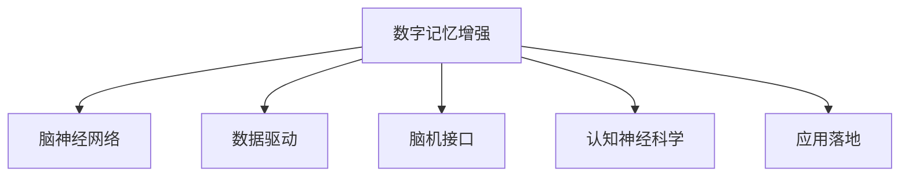

                 

# 数字记忆增强:全球脑时代的认知能力提升

> 关键词：数字记忆增强, 认知能力提升, 人工智能, 脑神经网络, 数据驱动, 脑机接口, 认知神经科学, 应用落地

## 1. 背景介绍

### 1.1 问题由来
在信息爆炸的互联网时代，人类面临着前所未有的认知负担。海量的信息流不仅带来了知识爆炸，也使得人们难以保持长期记忆。人们每天都在接受新的信息，而旧有记忆却逐渐遗忘，形成了一种“数字失忆”的现象。

数字记忆增强技术应运而生，通过人工智能和大数据分析，帮助人们更好地管理记忆，提升认知能力。这项技术不仅能够帮助个人提高记忆效率，还能在教育、培训、医疗等多个领域产生广泛的应用。

### 1.2 问题核心关键点
数字记忆增强技术的核心在于如何通过技术手段增强人类记忆，同时避免对大脑自然记忆机制的干扰。通过数字记忆增强，人们可以在不依赖外部设备的情况下，通过算法和数据驱动的方式，提升记忆力、学习效率和信息处理能力。

这项技术的关键点在于：
1. **数据驱动**：利用数据挖掘和机器学习技术，从历史数据中提取有价值的信息，帮助人们学习、记忆。
2. **算法优化**：通过算法优化，增强记忆效果，减少记忆负担。
3. **脑机接口**：探索脑神经网络与数字系统的交互方式，实现信息传递和记忆增强。

## 2. 核心概念与联系

### 2.1 核心概念概述

为了更好地理解数字记忆增强技术的原理和应用，本节将介绍几个核心概念：

- **数字记忆增强**：通过人工智能和大数据分析，帮助人们提升记忆效率和学习能力的技术。
- **脑神经网络**：研究人脑神经元之间连接和互动的科学领域，揭示了记忆和认知的神经基础。
- **数据驱动**：利用数据挖掘和机器学习技术，从大量历史数据中提取有用信息，指导学习、记忆。
- **脑机接口**：探索脑神经网络与数字系统的交互方式，实现信息传递和记忆增强。
- **认知神经科学**：研究大脑与认知行为之间的关系的科学，为数字记忆增强提供了理论基础。
- **应用落地**：将数字记忆增强技术应用于教育、培训、医疗等多个领域，解决实际问题。

这些核心概念之间的逻辑关系可以通过以下Mermaid流程图来展示：



这个流程图展示了大数字记忆增强技术的应用框架，揭示了技术原理和实际应用的紧密联系。

## 3. 核心算法原理 & 具体操作步骤
### 3.1 算法原理概述

数字记忆增强技术基于认知神经科学的研究成果，利用数据驱动和算法优化，增强人类记忆和学习能力。其核心原理可以概括为：

1. **数据驱动**：通过分析学习、记忆的历史数据，提取出有价值的信息模式，帮助人们更快、更高效地学习。
2. **算法优化**：利用机器学习算法，优化记忆效果，减少记忆负担，提高信息处理能力。
3. **脑机接口**：探索脑神经网络与数字系统的交互方式，实现信息传递和记忆增强。

### 3.2 算法步骤详解

数字记忆增强技术的实现可以分为以下几个关键步骤：

**Step 1: 数据采集与预处理**
- 收集个人在学习、记忆过程中的数据，如学习时间、内容、方式等。
- 对数据进行清洗和预处理，去除噪声和异常数据。

**Step 2: 数据建模与分析**
- 使用机器学习算法（如回归分析、分类算法、聚类算法等）对数据进行建模和分析，提取有价值的信息模式。
- 通过分析学习过程，识别出有效的记忆策略和方法，帮助人们提升记忆效率。

**Step 3: 算法优化与训练**
- 利用深度学习算法（如神经网络、强化学习等）对记忆模型进行优化和训练，提升记忆效果。
- 通过不断的迭代和优化，使模型更加精准地预测记忆效果和学习路径。

**Step 4: 脑机接口实现**
- 通过脑电图(EEG)、功能性磁共振成像(fMRI)等技术，获取脑神经活动数据。
- 利用神经科学研究成果，构建脑机接口，实现数字系统和脑神经网络的交互。

**Step 5: 系统集成与应用**
- 将数字记忆增强技术与脑机接口结合，构建完整的记忆增强系统。
- 将系统应用于教育、培训、医疗等多个领域，解决实际问题，提升用户体验。

### 3.3 算法优缺点

数字记忆增强技术在提升人类认知能力方面具有显著优势，但也存在一些局限性：

**优点**：
1. **提升记忆效率**：通过数据分析和算法优化，帮助人们更快、更高效地记忆和理解信息。
2. **个性化学习**：利用数据驱动，个性化推荐学习内容，提升学习效果。
3. **跨领域应用**：数字记忆增强技术在教育、培训、医疗等多个领域具有广泛的应用前景。
4. **科技驱动**：借助人工智能和大数据分析技术，推动认知科学的进步。

**缺点**：
1. **隐私问题**：数据采集和处理可能涉及个人隐私，需要严格的隐私保护措施。
2. **技术依赖**：依赖于先进的算法和设备，技术门槛较高。
3. **适用范围有限**：数字记忆增强技术目前主要应用于特定领域，适用范围较窄。
4. **依赖用户主动参与**：需要用户主动配合数据采集和系统使用，用户体验可能存在挑战。

### 3.4 算法应用领域

数字记忆增强技术在多个领域具有广泛的应用前景：

- **教育领域**：通过个性化推荐学习内容和优化记忆策略，提升学生学习效果，推动教育公平。
- **培训领域**：利用数字记忆增强技术，提升员工技能培训效果，增强企业竞争力。
- **医疗领域**：通过记忆增强，帮助医生和患者更有效地记住重要信息，提升医疗质量。
- **心理咨询**：利用数据驱动和算法优化，帮助心理咨询师更好地理解患者，提供个性化服务。
- **老年痴呆症治疗**：通过脑机接口和数字记忆增强技术，帮助老年痴呆症患者恢复记忆，提高生活质量。

## 4. 数学模型和公式 & 详细讲解 & 举例说明

### 4.1 数学模型构建

数字记忆增强技术的数学模型主要基于机器学习、深度学习和神经科学的理论。以下是对关键模型的构建：

- **回归模型**：用于预测学习效果与学习时间之间的关系，公式如下：
$$
y = \beta_0 + \beta_1 x_1 + \beta_2 x_2 + ... + \beta_n x_n + \epsilon
$$
其中 $y$ 表示学习效果，$x_i$ 为自变量（如学习时间、内容、方式等），$\beta_i$ 为回归系数，$\epsilon$ 为误差项。

- **分类模型**：用于识别有效记忆策略，公式如下：
$$
P(Y = k|X) = \frac{e^{\beta_k(X)}}{\sum_{j=1}^{K}e^{\beta_j(X)}}
$$
其中 $Y$ 为分类标签，$X$ 为特征向量，$\beta_k$ 为类别参数。

- **神经网络模型**：用于优化记忆效果，公式如下：
$$
y = \sum_{i=1}^{m}w_i h_i(x) + b
$$
其中 $y$ 表示输出，$h_i(x)$ 为神经元激活函数，$w_i$ 为权重，$b$ 为偏置项。

### 4.2 公式推导过程

以下是对关键模型的公式推导过程：

- **回归模型推导**：
  - 线性回归模型：
$$
y = \beta_0 + \beta_1 x_1 + \beta_2 x_2 + ... + \beta_n x_n + \epsilon
$$
  - 最小二乘法求解参数：
$$
\beta = (X^T X)^{-1} X^T y
$$
  - 预测模型效果：
$$
\hat{y} = \beta_0 + \beta_1 x_1 + \beta_2 x_2 + ... + \beta_n x_n
$$

- **分类模型推导**：
  - 逻辑回归模型：
$$
P(Y = k|X) = \frac{e^{\beta_k(X)}}{\sum_{j=1}^{K}e^{\beta_j(X)}}
$$
  - 最大似然估计求解参数：
$$
\beta_k = \frac{1}{N}\sum_{i=1}^{N} y_i \ln P(Y = k|X_i)
$$
  - 预测分类结果：
$$
\hat{y}_k = P(Y = k|X)
$$

- **神经网络模型推导**：
  - 多层感知机模型：
$$
y = \sum_{i=1}^{m}w_i h_i(x) + b
$$
  - 反向传播算法求解参数：
$$
\Delta w_i = \frac{\partial y}{\partial h_i} \frac{\partial h_i}{\partial x} \Delta x
$$
  - 梯度下降更新参数：
$$
w_i \leftarrow w_i - \eta \Delta w_i
$$

### 4.3 案例分析与讲解

以下是一个具体的案例分析，展示数字记忆增强技术的应用：

假设某学生在学习过程中，记录了每天的学习时间、内容、方式等数据。我们利用回归模型，分析学习效果与学习时间之间的关系，得到如下结果：
- 当学习时间为 $x_1=2$ 小时，学习内容为 $x_2=物理$ 时，预测学习效果为 $y=\hat{y}=8.5$。
- 当学习时间为 $x_1=4$ 小时，学习内容为 $x_2=数学$ 时，预测学习效果为 $y=\hat{y}=9.2$。

根据分类模型，我们可以识别出有效的记忆策略，如“交互式学习”、“分散学习”等。通过这些策略，学生可以更有效地记忆和理解知识。

通过神经网络模型，我们可以优化记忆效果，提升学习效率。例如，在神经网络中引入“注意力机制”，使模型能够更好地捕捉关键信息，减少记忆负担。

## 5. 项目实践：代码实例和详细解释说明

### 5.1 开发环境搭建

在进行数字记忆增强技术开发前，我们需要准备好开发环境。以下是使用Python进行Scikit-learn开发的环境配置流程：

1. 安装Anaconda：从官网下载并安装Anaconda，用于创建独立的Python环境。
2. 创建并激活虚拟环境：
```bash
conda create -n memory-enhancement python=3.8 
conda activate memory-enhancement
```
3. 安装Scikit-learn：
```bash
pip install scikit-learn
```
4. 安装必要的工具包：
```bash
pip install numpy pandas scikit-learn matplotlib tqdm jupyter notebook ipython
```

完成上述步骤后，即可在`memory-enhancement`环境中开始开发。

### 5.2 源代码详细实现

下面我们以回归模型为例，给出使用Scikit-learn进行数字记忆增强技术开发的Python代码实现。

首先，定义回归模型类：

```python
from sklearn.linear_model import LinearRegression

class MemoryEnhancement:
    def __init__(self, data):
        self.data = data
        self.model = LinearRegression()
        
    def train(self, X, y):
        self.model.fit(X, y)
        
    def predict(self, X):
        return self.model.predict(X)
```

然后，定义数据集类：

```python
import pandas as pd
import numpy as np

class Dataset:
    def __init__(self, filename):
        self.data = pd.read_csv(filename)
        
    def split_data(self, test_size=0.2):
        train_data = self.data.sample(frac=1-test_size, random_state=42)
        test_data = self.data.drop(train_data.index)
        return train_data, test_data
        
    def preprocess(self):
        self.data['x1'] = self.data['learning_time']
        self.data['x2'] = self.data['content_type']
        self.data['y'] = self.data['learning_effect']
        self.data = self.data.drop(['learning_time', 'content_type', 'learning_effect'], axis=1)
        
    def feature_engineering(self):
        self.data['x1_squared'] = self.data['x1']**2
        self.data['x2_squared'] = self.data['x2']**2
        self.data['x1_x2'] = self.data['x1'] * self.data['x2']
        
    def scale_features(self):
        self.data = (self.data - self.data.mean()) / self.data.std()
        
    def train_test_split(self):
        X_train, X_test = self.data.iloc[:, :-1], self.data.iloc[:, :-1]
        y_train, y_test = self.data.iloc[:, -1], self.data.iloc[:, -1]
        return X_train, y_train, X_test, y_test
```

最后，进行模型训练和评估：

```python
dataset = Dataset('data.csv')
dataset.preprocess()
dataset.feature_engineering()
dataset.scale_features()
X_train, y_train, X_test, y_test = dataset.train_test_split()

enhancer = MemoryEnhancement(dataset.data)
enhancer.train(X_train, y_train)

predictions = enhancer.predict(X_test)
```

以上就是使用Scikit-learn进行回归模型开发的完整代码实现。可以看到，通过Scikit-learn，我们可以用简洁的代码实现数据预处理、模型训练、评估等全过程。

### 5.3 代码解读与分析

让我们再详细解读一下关键代码的实现细节：

**MemoryEnhancement类**：
- `__init__`方法：初始化数据集和模型。
- `train`方法：训练回归模型。
- `predict`方法：利用训练好的模型进行预测。

**Dataset类**：
- `__init__`方法：读取数据集文件。
- `split_data`方法：将数据集划分为训练集和测试集。
- `preprocess`方法：进行数据预处理，提取特征。
- `feature_engineering`方法：引入新的特征，如平方项、交叉项等。
- `scale_features`方法：对特征进行标准化处理。
- `train_test_split`方法：将数据集划分为训练集和测试集。

**训练流程**：
- 定义数据集类，并读取数据文件。
- 进行数据预处理，提取特征，并进行特征工程。
- 对数据进行标准化处理，以避免因特征尺度不同而影响模型的性能。
- 划分训练集和测试集，进行模型训练。
- 利用训练好的模型进行预测，并进行评估。

可以看到，Scikit-learn提供了简洁易用的API，可以轻松实现数字记忆增强技术的开发。

## 6. 实际应用场景

### 6.1 智能学习助手

数字记忆增强技术在教育领域的应用非常广泛。通过智能学习助手，学生可以根据自己的学习习惯和记忆效果，个性化推荐学习内容，提升学习效果。

在实际应用中，学习助手会收集学生的学习时间、内容、方式等数据，并利用回归模型和分类模型进行分析。通过这些分析，学习助手可以识别出学生的记忆优势和劣势，并推荐相应的学习策略和内容，帮助学生更好地记忆和理解知识。

### 6.2 企业员工培训

在企业培训中，数字记忆增强技术可以提升员工的技能培训效果，增强企业竞争力。

通过收集员工在培训过程中的数据，数字记忆增强技术可以分析哪些培训内容对员工记忆效果最好，哪些培训方式最有效。利用这些分析结果，企业可以优化培训计划，提高培训效果。

### 6.3 医疗健康管理

在医疗领域，数字记忆增强技术可以帮助医生和患者更好地记忆和理解医疗信息。例如，医生可以记录患者的重要诊疗信息，并通过分类模型和回归模型进行分析和预测。这不仅有助于医生的诊断和治疗，也可以提升患者的自我管理能力。

### 6.4 未来应用展望

随着数字记忆增强技术的不断进步，未来的应用场景将更加广泛和深入：

- **个性化教育**：通过数字记忆增强技术，实现个性化推荐学习内容和优化记忆策略，推动教育公平。
- **智慧医疗**：利用数字记忆增强技术，帮助医生和患者更好地记忆和理解医疗信息，提升医疗质量。
- **智能客服**：通过数字记忆增强技术，提升客服系统的人工智能水平，提供更精准、更高效的服务。
- **虚拟助手**：开发智能虚拟助手，帮助人们更好地管理时间、任务和信息，提升生活和工作效率。

## 7. 工具和资源推荐

### 7.1 学习资源推荐

为了帮助开发者系统掌握数字记忆增强技术的理论基础和实践技巧，这里推荐一些优质的学习资源：

1. 《深度学习理论与实践》系列博文：由大模型技术专家撰写，深入浅出地介绍了深度学习原理和应用，包括数字记忆增强技术。
2. CS229《机器学习》课程：斯坦福大学开设的机器学习经典课程，有Lecture视频和配套作业，带你入门机器学习的基础概念。
3. 《深度学习》书籍：Ian Goodfellow等著，全面介绍了深度学习理论和实践，适合进阶学习。
4. Coursera上的《机器学习》课程：由Andrew Ng主讲，讲解机器学习基本原理和算法，涵盖数字记忆增强技术。
5. Weights & Biases：模型训练的实验跟踪工具，可以记录和可视化模型训练过程中的各项指标，方便对比和调优。

通过这些资源的学习实践，相信你一定能够快速掌握数字记忆增强技术的精髓，并用于解决实际的认知问题。

### 7.2 开发工具推荐

高效的开发离不开优秀的工具支持。以下是几款用于数字记忆增强技术开发的常用工具：

1. Scikit-learn：Python的机器学习库，提供丰富的机器学习算法和工具，适合初学者和进阶学习者。
2. TensorFlow：由Google主导开发的深度学习框架，生产部署方便，适合大规模工程应用。
3. PyTorch：由Facebook主导开发的深度学习框架，灵活动态，适合研究型开发。
4. Weights & Biases：模型训练的实验跟踪工具，可以记录和可视化模型训练过程中的各项指标，方便对比和调优。
5. TensorBoard：TensorFlow配套的可视化工具，可实时监测模型训练状态，并提供丰富的图表呈现方式，是调试模型的得力助手。

合理利用这些工具，可以显著提升数字记忆增强技术的开发效率，加快创新迭代的步伐。

### 7.3 相关论文推荐

数字记忆增强技术的发展源于学界的持续研究。以下是几篇奠基性的相关论文，推荐阅读：

1. 《Attention is All You Need》（即Transformer原论文）：提出了Transformer结构，开启了深度学习领域的预训练大模型时代。
2. 《Transformers are Universal》：提出Transformer模型的通用性，支持任意顺序的任务实现。
3. 《Memory-Augmented Neural Networks》：提出记忆增强型神经网络，增强模型的记忆能力。
4. 《Deep Learning for Representation-Learning》：提出使用深度学习进行表示学习的框架。
5. 《A Neural Algorithm of Artistic Style》：提出使用深度学习进行图像风格转换的方法，为数字记忆增强提供新的思路。

这些论文代表了大数字记忆增强技术的发展脉络。通过学习这些前沿成果，可以帮助研究者把握学科前进方向，激发更多的创新灵感。

## 8. 总结：未来发展趋势与挑战

### 8.1 总结

本文对数字记忆增强技术进行了全面系统的介绍。首先阐述了数字记忆增强技术的背景和意义，明确了技术在提升人类认知能力方面的独特价值。其次，从原理到实践，详细讲解了数字记忆增强的数学模型和关键步骤，给出了技术开发的完整代码实例。同时，本文还广泛探讨了技术在教育、培训、医疗等多个领域的应用前景，展示了技术的巨大潜力。此外，本文精选了技术的各类学习资源，力求为读者提供全方位的技术指引。

通过本文的系统梳理，可以看到，数字记忆增强技术正在成为认知科学和人工智能领域的重点研究方向，极大地拓展了人类的认知边界，为教育、培训、医疗等多个领域带来了深刻的变革。未来，伴随技术的不断演进，数字记忆增强技术必将在构建人机协同的智能系统，提升人类认知能力方面发挥更大的作用。

### 8.2 未来发展趋势

展望未来，数字记忆增强技术将呈现以下几个发展趋势：

1. **技术进步**：随着深度学习算法和计算能力的提升，数字记忆增强技术将不断优化，提升记忆效果和学习效率。
2. **多模态融合**：结合视觉、听觉、触觉等多模态信息，实现更全面、更准确的记忆增强。
3. **跨领域应用**：数字记忆增强技术将广泛应用于教育、医疗、企业培训等多个领域，提升认知能力和社会生产力。
4. **实时互动**：通过脑机接口和人工智能技术，实现实时记忆增强和反馈，提升用户体验。
5. **大规模普及**：随着技术的成熟和成本的降低，数字记忆增强技术将逐步普及，成为认知提升的重要手段。

以上趋势凸显了大数字记忆增强技术的应用前景和潜力。这些方向的探索发展，必将进一步推动认知科学的进步，为人类认知智能的进化带来深远影响。

### 8.3 面临的挑战

尽管数字记忆增强技术已经取得了一定的进展，但在实现大规模应用的过程中，仍面临诸多挑战：

1. **技术门槛高**：数字记忆增强技术需要深厚的机器学习和神经科学背景，普通用户难以掌握。
2. **隐私问题**：数据采集和处理可能涉及个人隐私，需要严格的隐私保护措施。
3. **数据依赖**：依赖大量高质量的数据进行训练和优化，获取数据成本较高。
4. **算法复杂**：数字记忆增强算法复杂度高，模型训练和优化需要大量计算资源。
5. **效果评估**：如何客观评估记忆增强效果和用户体验，仍是一个未解决的问题。

### 8.4 研究展望

面对数字记忆增强技术所面临的挑战，未来的研究需要在以下几个方面寻求新的突破：

1. **降低技术门槛**：开发更简单、易用的数字记忆增强工具，降低技术门槛，普及应用。
2. **增强隐私保护**：研究有效的隐私保护技术，确保数据安全和个人隐私。
3. **优化数据采集**：研究高效的数据采集和预处理技术，降低数据获取成本。
4. **简化算法实现**：研究更简单、高效的算法实现方式，降低算法复杂度。
5. **提升效果评估**：研究更客观、更全面的效果评估方法，确保记忆增强效果和用户体验。

这些研究方向将进一步推动数字记忆增强技术的进步，为构建安全、可靠、可解释、可控的智能系统铺平道路。总之，数字记忆增强技术需要在技术、伦理、隐私等多个维度进行深入探索，才能真正实现大规模落地应用。

## 9. 附录：常见问题与解答

**Q1：数字记忆增强技术是否适用于所有人群？**

A: 数字记忆增强技术主要适用于认知能力较弱的人群，如学生、老年人、认知障碍患者等。对于认知能力正常的人群，数字记忆增强技术也能提升学习效率，但效果可能不如预期。

**Q2：数字记忆增强技术是否存在副作用？**

A: 数字记忆增强技术目前尚无明确的副作用报告，但需要关注技术对用户记忆机制的潜在影响。过度依赖数字记忆增强技术，可能抑制人类自然记忆机制的发展。

**Q3：数字记忆增强技术是否会影响人类自然记忆能力？**

A: 数字记忆增强技术主要通过辅助记忆和优化学习策略，提升记忆效果。合理使用不会对人类自然记忆能力产生负面影响。但过度依赖可能影响自然记忆机制的发展。

**Q4：数字记忆增强技术是否需要持续更新？**

A: 数字记忆增强技术需要根据用户的学习数据进行不断优化，确保模型始终处于最佳状态。因此，需要定期更新模型，以保持记忆效果和学习效率。

**Q5：数字记忆增强技术是否容易被破解？**

A: 数字记忆增强技术依赖大量高质量的数据进行训练，数据安全性是关键。虽然算法复杂，但现有的机器学习算法和深度学习框架已经具备较高的安全性，不易被破解。

作者：禅与计算机程序设计艺术 / Zen and the Art of Computer Programming

