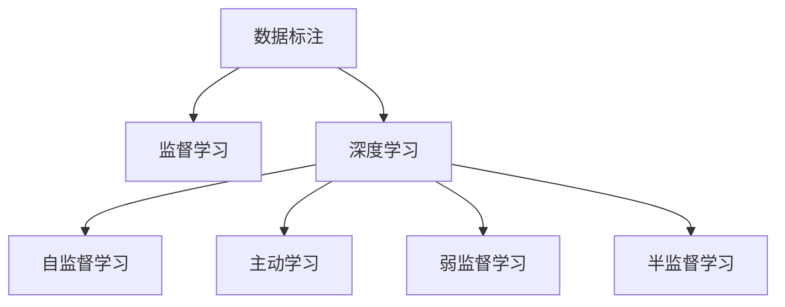

                 

# 数据标注：人工智能发展背后的幕后英雄

> 关键词：数据标注,人工智能,机器学习,深度学习,自然语言处理(NLP),计算机视觉(CV),智能推荐,数据处理

## 1. 背景介绍

### 1.1 问题由来

人工智能(AI)技术的迅速发展离不开数据标注，数据标注被誉为AI技术发展的“幕后英雄”。数据标注是指在原始数据上添加有意义的标签，为模型训练提供高质量的监督信号。在NLP、CV、推荐系统等领域，数据标注至关重要，但其成本和效率问题一直是困扰AI发展的瓶颈。

人工智能算法，尤其是深度学习模型，需要海量的标注数据进行训练。以自然语言处理(NLP)为例，训练一个高效的对话模型、翻译模型、情感分析模型等，通常需要数万条、甚至数百万条标注数据。然而，标注一条高质量数据往往需要大量人力物力，费用高昂，时间成本巨大。

在计算机视觉(CV)领域，标注数据更是重中之重。图像分类、物体检测、图像分割等任务，均需通过人工标注，标定出图像中的关键区域、目标类别等信息。以ImageNet为例，训练一个顶级的图像分类模型，需要标注超过140万张图像，每张图像需要进行5-10次标注，耗时惊人。

数据标注的成本问题，已严重制约了AI技术的普及和应用。然而，数据标注的重要性不可忽视，它是训练高质量AI模型、实现精准预测的关键步骤。如何高效、经济地进行数据标注，成为一个亟待解决的问题。

### 1.2 问题核心关键点

数据标注的核心关键点包括：
- 数据质量：标注数据必须准确、完整、一致，确保模型能够学习到有效的语言模式或视觉特征。
- 标注成本：标注过程应尽可能简化，减少人力物力投入。
- 标注效率：标注速度应尽可能快，缩短模型训练周期。
- 标注多样性：标注样本应尽可能覆盖数据空间，避免模型过拟合。

这些关键点决定了数据标注的质量和效率，进而影响AI模型的性能和应用效果。

## 2. 核心概念与联系

### 2.1 核心概念概述

为更好地理解数据标注的重要性和应用，本节将介绍几个核心概念：

- 数据标注：对原始数据进行加工，添加有意义的标签，形成监督信号的过程。
- 深度学习：通过多层神经网络对数据进行特征提取和模型训练，广泛应用于图像、语音、文本等领域的AI应用。
- 监督学习：基于有标签数据进行模型训练，学习输入和输出之间的映射关系。
- 自监督学习：无需标签数据，通过数据的内在结构进行特征学习和模型训练。
- 主动学习：基于模型的反馈，主动选择未标注数据进行标注，提升标注效率。
- 弱监督学习：在标注数据不足的情况下，利用不完全的、不准确的标签信息进行训练。
- 半监督学习：结合少量标注数据和大量未标注数据进行训练，提升模型泛化能力。

这些概念共同构成了AI模型训练的基础框架，数据标注在其中扮演着至关重要的角色。通过数据标注，深度学习模型能够学习到数据的真实分布，提高预测精度。

### 2.2 核心概念原理和架构的 Mermaid 流程图



这个流程图展示了数据标注与深度学习的关系。数据标注为监督学习提供数据，监督学习通过深度学习模型进行训练，而自监督、主动学习、弱监督、半监督等方法则是数据标注的补充，提升训练效率和模型性能。

## 3. 核心算法原理 & 具体操作步骤

### 3.1 算法原理概述

数据标注的原理是通过标注工具将原始数据转化为模型能够理解的格式，添加标签信息，用于监督模型的训练。常用的数据标注方法包括文本标注、图像标注、语音标注等。

数据标注的算法流程一般包括以下几个步骤：
1. 数据收集：收集需要标注的数据，如文本、图像、语音等。
2. 数据清洗：对原始数据进行预处理，去除噪声、无关信息。
3. 数据标注：人工或半自动工具进行标注，添加标签信息。
4. 标注验证：对标注结果进行验证，确保标注质量。
5. 数据集划分：将标注好的数据集划分为训练集、验证集、测试集。

### 3.2 算法步骤详解

#### 3.2.1 数据收集

数据收集是数据标注的第一步，也是最重要的环节。需要根据具体任务选择合适的数据源。以图像标注为例，可以使用以下几种数据源：
1. 公共数据集：如ImageNet、COCO等，提供大量标注图像和标签。
2. 第三方平台：如Kaggle、Coursera等，提供标注任务和数据集。
3. 自定义数据：根据具体应用需求，自己采集或合成数据。

#### 3.2.2 数据清洗

数据清洗的目的是提升标注数据的质量，去除噪声和无关信息。常见的数据清洗方法包括：
1. 数据去重：去除重复的标注数据，避免数据冗余。
2. 数据格式化：统一数据格式，便于后续处理。
3. 数据校正：修正错误标注，提高标注准确性。

#### 3.2.3 数据标注

数据标注分为人工标注和半自动标注两种方式。人工标注由人类专家进行标注，需要投入大量人力和时间。半自动标注则通过标注工具和算法辅助，提高标注效率。

人工标注过程如下：
1. 数据展示：将数据展示给标注员，如图像、文本等。
2. 标注操作：标注员进行标注操作，添加标签信息。
3. 标注提交：标注完成后，提交标注结果，进行审核和验证。

半自动标注过程如下：
1. 数据预标注：使用算法对数据进行初步标注，形成初步标注结果。
2. 标注验证：将初步标注结果展示给标注员，进行人工审核和验证。
3. 标注修正：标注员根据标注结果进行修正，生成最终标注结果。

#### 3.2.4 标注验证

标注验证的目的是确保标注结果的质量。常用的标注验证方法包括：
1. 人工审核：由人工专家对标注结果进行审核，判断标注质量。
2. 自动验证：使用标注工具和算法对标注结果进行自动验证，减少人工审核量。
3. 多重验证：将标注结果提交给多个标注员进行审核，取多数意见为最终结果。

#### 3.2.5 数据集划分

数据集划分的目的是将标注好的数据集划分为训练集、验证集、测试集。通常采用以下比例：
- 训练集：占总数据的70%，用于模型训练。
- 验证集：占总数据的15%，用于模型验证和调参。
- 测试集：占总数据的15%，用于模型测试和性能评估。

### 3.3 算法优缺点

数据标注具有以下优点：
1. 监督信号：标注数据为深度学习模型提供了监督信号，提高模型性能。
2. 泛化能力：通过标注数据，模型能够学习到数据的真实分布，提高泛化能力。
3. 准确性：标注数据可以纠正模型预测错误，提高预测准确性。

然而，数据标注也存在以下缺点：
1. 成本高：标注数据需要大量人力物力，费用高昂。
2. 时间成本：标注过程耗时长，影响模型训练周期。
3. 数据量：标注数据不足可能导致模型过拟合。
4. 标注误差：标注过程中可能存在误差，影响模型性能。

### 3.4 算法应用领域

数据标注在AI的各个领域都有广泛应用，具体如下：

#### 3.4.1 自然语言处理(NLP)

NLP领域的数据标注主要涉及文本分类、情感分析、机器翻译、命名实体识别等任务。标注过程通常需要标注工具和算法辅助，如NLTK、spaCy、BERT等。

#### 3.4.2 计算机视觉(CV)

CV领域的数据标注主要涉及图像分类、物体检测、图像分割等任务。常用的标注工具包括LabelImg、VGG Image Annotator、Labelbox等。

#### 3.4.3 智能推荐系统

推荐系统需要大量的用户行为数据进行训练，数据标注过程涉及用户画像、物品特征、用户评分等标签的添加。常用的标注工具包括Amazon Review Annotator、Tedeluza等。

#### 3.4.4 医疗影像分析

医疗影像分析需要标注大量医学影像数据，标注过程涉及病变位置、病灶类型等标签的添加。常用的标注工具包括Annotation Labeling for Medical Image Analysis等。

#### 3.4.5 智能交互系统

智能交互系统需要标注大量的对话数据，标注过程涉及用户意图、对话场景等标签的添加。常用的标注工具包括Dialogflow Annotator等。

## 4. 数学模型和公式 & 详细讲解 & 举例说明

### 4.1 数学模型构建

数据标注的数学模型通常基于监督学习框架，可以表示为：

$$
\theta^* = \mathop{\arg\min}_{\theta} \mathcal{L}(\theta, D)
$$

其中，$\theta$ 为模型参数，$D$ 为标注数据集，$\mathcal{L}(\theta, D)$ 为损失函数，用于衡量模型输出与标注结果之间的差异。

标注数据集 $D$ 可以表示为 $(x_i, y_i)$ 的序列，其中 $x_i$ 为输入数据，$y_i$ 为标注结果。标注数据的生成过程可以表示为：

$$
y_i = f(x_i, \theta)
$$

其中，$f$ 为标注函数，$\theta$ 为模型参数。

### 4.2 公式推导过程

以图像分类任务为例，假设标注数据集 $D$ 包含 $N$ 张图像，每张图像的标注结果为 $y_i \in \{1, 2, \cdots, C\}$，其中 $C$ 为类别数。标注数据集可以表示为：

$$
D = \{(x_1, y_1), (x_2, y_2), \cdots, (x_N, y_N)\}
$$

假设模型参数为 $\theta$，分类模型为 $y = \mathop{\arg\max}_{c=1, 2, \cdots, C} s_c(\theta, x)$，其中 $s_c(\theta, x)$ 为第 $c$ 类的得分函数。分类任务的目标是最小化损失函数：

$$
\mathcal{L}(\theta) = -\frac{1}{N} \sum_{i=1}^N \log s_{y_i}(\theta, x_i)
$$

其中，$y_i$ 为第 $i$ 张图像的标注结果，$\log s_{y_i}(\theta, x_i)$ 为 $y_i$ 类别的得分函数的负对数似然。

在标注数据集 $D$ 上，分类模型的训练过程可以表示为：

$$
\theta^* = \mathop{\arg\min}_{\theta} \mathcal{L}(\theta, D)
$$

通过梯度下降等优化算法，最小化损失函数，更新模型参数 $\theta$，使得模型输出逼近真实的标注结果。

### 4.3 案例分析与讲解

以图像分类任务为例，以下是一个完整的标注流程：

#### 4.3.1 数据收集

从公开数据集中收集图像数据，使用ImageNet等数据集。数据集包括约1400万张训练图像和5万种分类。

#### 4.3.2 数据清洗

对图像数据进行预处理，包括去除噪声、调整大小、裁剪等操作。将图像转换为标准格式，便于后续标注。

#### 4.3.3 数据标注

使用LabelImg工具进行图像标注，添加标签信息。每个图像可以添加多个标签，表示该图像属于多个类别。

#### 4.3.4 标注验证

将标注结果提交给多个标注员进行审核，取多数意见为最终结果。对标注结果进行自动验证，检查是否存在重复标注、遗漏标注等问题。

#### 4.3.5 数据集划分

将标注好的数据集划分为训练集、验证集、测试集。训练集占总数据的70%，验证集占15%，测试集占15%。

## 5. 项目实践：代码实例和详细解释说明

### 5.1 开发环境搭建

#### 5.1.1 Python环境

首先需要安装Python 3.8版本，可以使用Anaconda来搭建虚拟环境。安装步骤如下：

1. 从官网下载Anaconda，并完成安装。
2. 打开终端，进入Anaconda的安装目录。
3. 创建虚拟环境，并激活虚拟环境：

   ```bash
   conda create -n myenv python=3.8
   conda activate myenv
   ```

   其中，`myenv`为虚拟环境名称。

4. 安装必要的Python库：

   ```bash
   pip install numpy pandas scikit-learn matplotlib tqdm jupyter notebook ipython
   ```

#### 5.1.2 深度学习框架

需要安装深度学习框架PyTorch和TensorFlow。以PyTorch为例，安装命令如下：

```bash
pip install torch torchvision torchaudio
```

TensorFlow的安装命令如下：

```bash
pip install tensorflow
```

#### 5.1.3 数据标注工具

常用的数据标注工具包括LabelImg、VGG Image Annotator、Labelbox等。这里以LabelImg为例，安装步骤如下：

1. 从LabelImg官网下载安装文件。
2. 解压安装文件。
3. 进入安装目录，运行安装脚本：

   ```bash
   bash install.sh
   ```

4. 安装完成后，可以通过终端启动LabelImg：

   ```bash
   labelImg
   ```

   启动LabelImg后，进入主界面，可以通过拖拽、点击等方式对图像进行标注。

### 5.2 源代码详细实现

以下是一个简单的Python脚本，用于标注图像数据集。

#### 5.2.1 数据读取

```python
import os
import cv2

# 读取数据集
img_dir = 'data'
labels = []
img_list = []
for img_name in os.listdir(img_dir):
    label = img_name.split('_')[0]
    label = label.replace('label_', '')
    label = int(label)
    img_path = os.path.join(img_dir, img_name)
    img = cv2.imread(img_path)
    img = cv2.cvtColor(img, cv2.COLOR_BGR2RGB)
    img_list.append(img)
    labels.append(label)
```

#### 5.2.2 数据标注

```python
import labelImg

# 创建LabelImg实例
labelImg = labelImg.create()

# 显示图像
labelImg.showImage(img, 'image')
```

#### 5.2.3 数据保存

```python
# 保存标注结果
with open('labels.txt', 'w') as f:
    for label in labels:
        f.write(str(label) + '\n')
```

### 5.3 代码解读与分析

在代码中，首先使用os库读取数据集，并使用OpenCV库将图像转换为RGB格式。然后使用LabelImg工具显示图像，进行标注操作。最后将标注结果保存为文本文件。

### 5.4 运行结果展示

运行上述代码后，即可在LabelImg界面中进行图像标注操作。标注完成后，将标注结果保存为文本文件，便于后续数据处理和模型训练。

## 6. 实际应用场景

### 6.1 智能推荐系统

智能推荐系统需要大量的用户行为数据进行训练。数据标注过程涉及用户画像、物品特征、用户评分等标签的添加。常用的标注工具包括Amazon Review Annotator、Tedeluza等。

### 6.2 医疗影像分析

医疗影像分析需要标注大量医学影像数据，标注过程涉及病变位置、病灶类型等标签的添加。常用的标注工具包括Annotation Labeling for Medical Image Analysis等。

### 6.3 金融风控

金融风控系统需要标注大量的交易数据，标注过程涉及交易类别、交易金额、交易时间等标签的添加。常用的标注工具包括Labelbox等。

## 7. 工具和资源推荐

### 7.1 学习资源推荐

#### 7.1.1 深度学习框架

- PyTorch：灵活的动态计算图，适合快速迭代研究。
- TensorFlow：生产部署方便，适合大规模工程应用。

#### 7.1.2 数据标注工具

- LabelImg：简单易用，支持图像标注。
- Labelbox：支持多种数据格式，支持半自动标注。

#### 7.1.3 学习资源

- 《深度学习》书籍：Ian Goodfellow、Yoshua Bengio、Aaron Courville著作，全面介绍深度学习基础。
- 《计算机视觉：算法与应用》书籍：Richard Szeliski著作，全面介绍计算机视觉基础。
- Coursera、edX等在线课程：提供深度学习、计算机视觉等领域的优质课程资源。

### 7.2 开发工具推荐

#### 7.2.1 Python环境

- Anaconda：创建和管理虚拟环境，方便Python库的安装和维护。
- Jupyter Notebook：交互式编程环境，支持代码的快速迭代和调试。

#### 7.2.2 深度学习框架

- PyTorch：灵活的动态计算图，适合快速迭代研究。
- TensorFlow：生产部署方便，适合大规模工程应用。

#### 7.2.3 数据标注工具

- LabelImg：简单易用，支持图像标注。
- Labelbox：支持多种数据格式，支持半自动标注。

### 7.3 相关论文推荐

#### 7.3.1 深度学习

- ImageNet Large Scale Visual Recognition Challenge：介绍ImageNet数据集和标注过程。
- AlphaGo Zero：介绍深度强化学习的经典案例。

#### 7.3.2 数据标注

- LabelImg：介绍LabelImg工具的使用方法。
- Labelbox：介绍Labelbox工具的使用方法。

## 8. 总结：未来发展趋势与挑战

### 8.1 总结

本文对数据标注的重要性和应用进行了全面系统的介绍。首先阐述了数据标注在AI技术发展中的核心作用，明确了数据标注在提升模型性能、训练速度、泛化能力等方面的重要意义。其次，从原理到实践，详细讲解了数据标注的数学模型和算法流程，给出了数据标注任务开发的完整代码实例。同时，本文还广泛探讨了数据标注在各个AI应用领域的应用前景，展示了数据标注范式的广泛价值。

通过本文的系统梳理，可以看到，数据标注是AI技术发展的重要基础，其质量和效率直接影响模型的性能和应用效果。未来，伴随深度学习、自然语言处理等技术的不断发展，数据标注将得到更深入的研究和应用，进一步推动AI技术的普及和应用。

### 8.2 未来发展趋势

数据标注的未来发展趋势包括以下几个方面：

#### 8.2.1 自动化标注

随着深度学习和大数据技术的发展，自动化标注技术逐渐成熟。未来，自动标注工具将能够自动识别图像、文本等数据，并添加合适的标签。自动标注能够大幅提高标注效率，降低人力物力成本。

#### 8.2.2 多模态标注

多模态标注是指同时标注图像、文本、语音等多种类型的数据。未来，多模态标注技术将得到更广泛的应用，能够更全面地刻画数据的特征，提高模型的泛化能力。

#### 8.2.3 数据增强

数据增强是指通过对原始数据进行一定的变换，生成新的标注数据。未来，数据增强技术将得到更广泛的应用，能够提升模型的泛化能力，减少过拟合风险。

#### 8.2.4 弱监督标注

弱监督标注是指利用不完全的、不准确的标签信息进行标注。未来，弱监督标注技术将得到更广泛的应用，能够减少标注成本，提升标注效率。

#### 8.2.5 在线标注

在线标注是指在标注过程中，用户可以通过网络提交标注结果，标注工具进行验证和修正。未来，在线标注技术将得到更广泛的应用，能够进一步提高标注效率和准确性。

#### 8.2.6 语义标注

语义标注是指在标注过程中，标注结果包含语义信息，如命名实体、关系抽取等。未来，语义标注技术将得到更广泛的应用，能够提升模型的语义理解能力。

### 8.3 面临的挑战

尽管数据标注在AI技术发展中扮演着重要角色，但其面临的挑战仍不可忽视。以下是几个主要的挑战：

#### 8.3.1 数据质量

数据质量是数据标注的基础。标注数据的准确性、完整性、一致性直接影响模型的性能。如何保证标注数据的质量，是一个长期存在的挑战。

#### 8.3.2 标注成本

标注成本是数据标注的核心瓶颈。大规模标注数据需要大量人力物力，费用高昂。如何降低标注成本，提高标注效率，是一个亟待解决的问题。

#### 8.3.3 标注效率

标注效率是数据标注的关键因素。标注过程耗时长，影响模型训练周期。如何提高标注效率，减少标注时间，是一个亟待解决的问题。

#### 8.3.4 标注多样性

标注多样性是数据标注的重要要求。标注数据应尽可能覆盖数据空间，避免模型过拟合。如何确保标注多样性，是一个亟待解决的问题。

#### 8.3.5 标注噪声

标注噪声是数据标注的常见问题。标注过程中可能存在误差，影响模型性能。如何减少标注噪声，提高标注质量，是一个亟待解决的问题。

### 8.4 研究展望

面对数据标注面临的挑战，未来的研究需要在以下几个方面寻求新的突破：

#### 8.4.1 自动化标注

自动化标注技术的发展将大幅提高标注效率，降低人力物力成本。未来，自动标注工具将能够自动识别图像、文本等数据，并添加合适的标签。自动标注能够进一步推动AI技术的普及和应用。

#### 8.4.2 多模态标注

多模态标注技术能够更全面地刻画数据的特征，提高模型的泛化能力。未来，多模态标注技术将得到更广泛的应用，能够进一步推动AI技术的普及和应用。

#### 8.4.3 数据增强

数据增强技术能够提升模型的泛化能力，减少过拟合风险。未来，数据增强技术将得到更广泛的应用，能够进一步推动AI技术的普及和应用。

#### 8.4.4 弱监督标注

弱监督标注技术能够减少标注成本，提升标注效率。未来，弱监督标注技术将得到更广泛的应用，能够进一步推动AI技术的普及和应用。

#### 8.4.5 在线标注

在线标注技术能够进一步提高标注效率和准确性。未来，在线标注技术将得到更广泛的应用，能够进一步推动AI技术的普及和应用。

#### 8.4.6 语义标注

语义标注技术能够提升模型的语义理解能力。未来，语义标注技术将得到更广泛的应用，能够进一步推动AI技术的普及和应用。

## 9. 附录：常见问题与解答

### 9.1 问题1：数据标注的常见问题有哪些？

答：数据标注的常见问题包括标注成本高、标注效率低、标注数据质量差、标注数据多样性不足、标注噪声等。

### 9.2 问题2：如何提高数据标注的质量？

答：提高数据标注的质量需要从多个方面入手，如选择合适的标注工具、引入自动标注技术、设置合适的标注规则、对标注结果进行验证和修正等。

### 9.3 问题3：数据标注在AI技术发展中扮演什么角色？

答：数据标注是AI技术发展的重要基础。数据标注为深度学习模型提供监督信号，提高模型性能，训练速度快，泛化能力强。

### 9.4 问题4：数据标注在不同领域的应用有哪些？

答：数据标注在NLP、CV、智能推荐系统、医疗影像分析、智能交互系统等各个领域都有广泛应用。

### 9.5 问题5：数据标注的未来发展趋势有哪些？

答：数据标注的未来发展趋势包括自动化标注、多模态标注、数据增强、弱监督标注、在线标注、语义标注等。

作者：禅与计算机程序设计艺术 / Zen and the Art of Computer Programming

