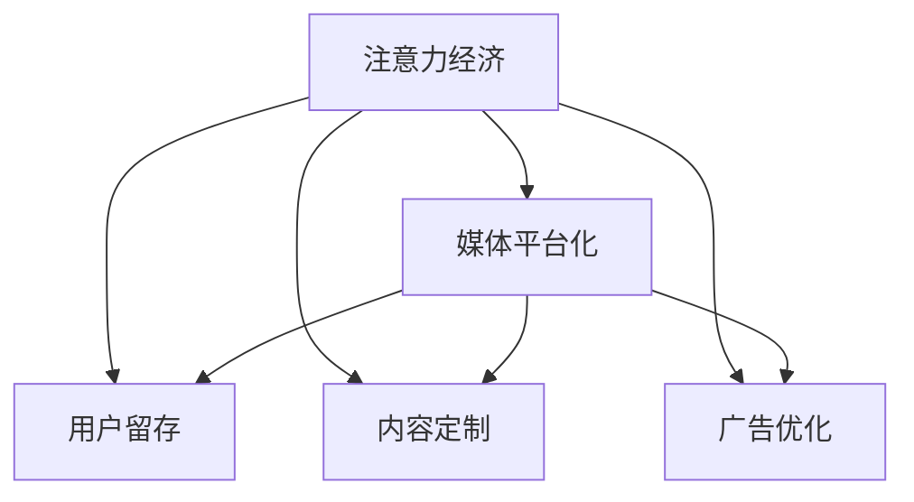

                 

# 新闻媒体如何在注意力经济中求生存

## 1. 背景介绍

在数字时代，新闻媒体面临着前所未有的挑战和机遇。一方面，互联网的普及极大地拓宽了新闻传播的渠道，用户获取信息的便利性大大提高；另一方面，信息过载的问题也随之而来，注意力成为了一种稀缺资源。如何吸引用户的注意力，提升媒体的影响力和商业价值，成为新闻媒体在注意力经济中生存的关键。

### 1.1 问题由来

新闻媒体的传统业务模式是基于内容吸引用户。但随着社交媒体、短视频平台的兴起，传统媒体的流量正在流失。根据Statista的数据，全球数字媒体用户数量已经超过传统电视用户，电视和报纸等传统媒体的用户数量在减少。此外，广告主更加青睐于社交媒体、搜索引擎和视频网站等平台，这些平台以更具互动性和个性化推荐的特点吸引了大量广告投放。新闻媒体如果无法适应这种变化，可能会在广告收入和订阅收入方面受到严重影响。

### 1.2 问题核心关键点

新闻媒体面临的核心问题是如何在注意力经济中重塑其商业模式。具体而言，需要解决以下问题：

- 如何利用数字技术提升内容质量和传播效率，吸引和保持用户的注意力？
- 如何通过数据驱动的方式，进行精准的广告投放和个性化推荐，最大化广告价值？
- 如何通过订阅、捐赠等多元化收入模式，增加用户粘性和忠诚度？
- 如何通过内容聚合、智能分发等方式，提供更加丰富、有价值的媒体产品？

### 1.3 问题研究意义

新闻媒体在数字时代如何生存和繁荣，不仅仅关系到媒体行业的未来，也关乎到公众的信息获取和认知形成。高质量的新闻内容，可以帮助用户理解和应对复杂多变的世界，具有重要的社会价值。此外，新闻媒体如果能够成功地转型为平台型企业，将创造更多的就业机会，推动经济增长，提升社会整体的智慧水平。因此，研究新闻媒体如何在注意力经济中生存，具有重要的现实意义。

## 2. 核心概念与联系

### 2.1 核心概念概述

本节将介绍几个与新闻媒体在注意力经济中生存相关的核心概念：

- 注意力经济(Attention Economy)：指的是在信息过载时代，用户的时间、精力等注意力资源变得稀缺，成为经济活动中重要的交易品。
- 媒体平台化(Media Platformization)：指新闻媒体不再仅仅提供新闻内容，而是通过平台化的方式，提供更多的服务和增值产品，吸引和留住用户。
- 用户留存(User Retention)：指保持用户对媒体平台的长期关注和使用，提升用户粘性和忠诚度。
- 内容定制(Content Personalization)：通过数据分析和算法推荐，为用户提供个性化的内容推荐，提升用户满意度和平台黏性。
- 广告优化(Ad Optimization)：通过用户行为数据进行广告投放的优化，提升广告的点击率和转化率，最大化广告收益。

这些概念之间的联系可以通过以下Mermaid流程图来展示：



这个流程图展示了几大关键概念之间的逻辑关系：

1. 注意力经济是新闻媒体平台化的基础。
2. 媒体平台化通过提升用户留存和实现内容定制，增强用户粘性。
3. 广告优化则是媒体平台化的重要收入来源，需要与用户留存和内容定制协同进行。

## 3. 核心算法原理 & 具体操作步骤

### 3.1 算法原理概述

新闻媒体在注意力经济中生存的核心在于，如何通过提升内容质量和用户互动，吸引和留住用户的注意力，同时最大化广告价值和用户订阅收入。以下是基于注意力经济的两大核心算法原理：

**1. 内容推荐算法**
新闻媒体可以通过推荐算法，根据用户的阅读历史、兴趣偏好等数据，精准地推荐个性化内容。推荐算法通常基于协同过滤、基于内容的推荐、深度学习等技术，能够最大化用户的满意度和平台的流量。

**2. 广告投放优化算法**
广告主希望通过广告投放实现高曝光和高效转化。新闻媒体可以通过广告优化算法，实时调整广告投放策略，提升广告的点击率和转化率，从而最大化广告收入。广告优化算法通常基于用户行为数据、点击率预测、转化率预测等技术，实现广告投放的自动化和智能化。

### 3.2 算法步骤详解

#### 3.2.1 内容推荐算法

1. **数据收集与处理**：
   - 收集用户的行为数据，包括阅读历史、评论、点赞等。
   - 使用数据清洗和预处理技术，去除噪声和异常值。
   - 将用户数据和内容数据进行合并，形成用户与内容的关联矩阵。

2. **特征工程**：
   - 提取用户特征，如用户兴趣、活跃度、地域等。
   - 提取内容特征，如标题、关键词、作者等。
   - 使用向量表示方法（如TF-IDF、Word2Vec）将特征转换为数值形式。

3. **模型训练**：
   - 选择适合的推荐算法，如协同过滤、基于内容的推荐、深度学习等。
   - 使用训练集数据，训练推荐模型。
   - 使用验证集数据，调整模型参数，提升推荐效果。

4. **推荐实施**：
   - 在实时数据流中，使用训练好的推荐模型，生成个性化推荐。
   - 根据用户的行为反馈，实时调整推荐策略。

#### 3.2.2 广告优化算法

1. **数据收集与处理**：
   - 收集广告投放数据，包括广告展示次数、点击次数、转化率等。
   - 使用数据清洗和预处理技术，去除噪声和异常值。
   - 将用户数据和广告数据进行合并，形成用户与广告的关联矩阵。

2. **特征工程**：
   - 提取用户特征，如用户兴趣、活跃度、地域等。
   - 提取广告特征，如广告内容、展示位置、投放时间等。
   - 使用向量表示方法（如TF-IDF、Word2Vec）将特征转换为数值形式。

3. **模型训练**：
   - 选择适合的广告优化算法，如点击率预测、转化率预测、深度学习等。
   - 使用训练集数据，训练广告优化模型。
   - 使用验证集数据，调整模型参数，提升广告效果。

4. **投放优化**：
   - 在实时数据流中，使用训练好的广告优化模型，生成优化后的投放策略。
   - 根据广告效果反馈，实时调整投放策略，提升广告点击率和转化率。

### 3.3 算法优缺点

**内容推荐算法的优点**：
- 能够提升用户满意度和平台流量。
- 实现个性化推荐，增强用户粘性。

**内容推荐算法的缺点**：
- 需要大量的用户数据和计算资源。
- 可能存在算法偏见，影响推荐质量。

**广告优化算法的优点**：
- 能够提升广告投放效率和收益。
- 实现广告投放的自动化和智能化。

**广告优化算法的缺点**：
- 需要精确的用户行为数据，数据隐私问题需注意。
- 存在算法偏见和数据噪声，影响广告效果。

### 3.4 算法应用领域

新闻媒体的内容推荐算法和广告优化算法，已经在以下领域得到了广泛应用：

- **新闻推荐系统**：根据用户兴趣推荐相关新闻内容，提升用户阅读量和平台流量。
- **个性化广告投放**：根据用户行为数据，优化广告投放策略，提高广告的点击率和转化率。
- **订阅与推荐**：基于用户行为数据，推荐合适的订阅计划，提升用户订阅率和忠诚度。
- **社交媒体平台**：社交媒体平台通过推荐算法，提升用户互动和粘性，实现商业价值的最大化。

## 4. 数学模型和公式 & 详细讲解 & 举例说明

### 4.1 数学模型构建

#### 4.1.1 用户-内容关联矩阵
设用户集合为 $U$，内容集合为 $V$，则用户-内容关联矩阵 $R$ 可以表示为：

$$
R_{ui} = \begin{cases}
1, & \text{用户 } u \text{ 阅读过内容 } v \\
0, & \text{用户 } u \text{ 未阅读过内容 } v \\
\end{cases}
$$

#### 4.1.2 广告-用户关联矩阵
设广告集合为 $A$，用户集合为 $U$，则广告-用户关联矩阵 $R$ 可以表示为：

$$
R_{au} = \begin{cases}
1, & \text{用户 } u \text{ 点击过广告 } a \\
0, & \text{用户 } u \text{ 未点击过广告 } a \\
\end{cases}
$$

### 4.2 公式推导过程

#### 4.2.1 用户-内容推荐算法
假设用户 $u$ 对内容 $v$ 的兴趣可以通过余弦相似度表示：

$$
\cos(\theta) = \frac{\vec{u} \cdot \vec{v}}{||\vec{u}|| \cdot ||\vec{v}||}
$$

其中 $\vec{u}$ 和 $\vec{v}$ 分别为用户和内容的特征向量。推荐模型可以根据余弦相似度，为用户推荐相似度最高的内容。

#### 4.2.2 广告优化算法
假设广告 $a$ 对用户 $u$ 的点击概率可以通过逻辑回归模型表示：

$$
P(a_u=1|X_u) = \frac{1}{1+e^{-\hat{\beta}_0 - \sum_{i=1}^n \hat{\beta}_i X_{ui}}
$$

其中 $\hat{\beta}_0$ 和 $\hat{\beta}_i$ 为模型参数，$X_{ui}$ 为广告特征和用户特征的组合向量。广告优化模型可以通过最大化广告点击率，调整模型参数，提升广告效果。

### 4.3 案例分析与讲解

#### 4.3.1 新闻推荐系统
以Google News为例，Google News使用协同过滤和深度学习相结合的推荐算法。在用户阅读行为数据的基础上，协同过滤算法能够推荐用户可能感兴趣的新闻，提升用户粘性和阅读量。深度学习模型通过学习用户与新闻之间的复杂关系，实现更加精准的推荐。

#### 4.3.2 个性化广告投放
以Facebook为例，Facebook使用点击率预测模型和转化率预测模型，优化广告投放策略。点击率预测模型能够预测用户对广告的点击概率，优化广告展示位置和投放时间。转化率预测模型能够预测用户对广告的转化行为，优化广告预算和投放策略。

## 5. 项目实践：代码实例和详细解释说明

### 5.1 开发环境搭建

#### 5.1.1 数据收集与准备
- 使用Web爬虫或API接口，收集用户阅读行为数据和内容发布数据。
- 使用数据清洗工具（如Python Pandas库）进行数据预处理，去除噪声和异常值。
- 将用户数据和内容数据合并，形成用户-内容关联矩阵。

#### 5.1.2 特征工程
- 使用TF-IDF、Word2Vec等技术，提取用户和内容的特征向量。
- 使用K-means聚类等技术，对用户进行分组，提升推荐效果。

#### 5.1.3 模型训练与优化
- 使用TensorFlow或PyTorch等深度学习框架，训练推荐模型和广告优化模型。
- 使用交叉验证等技术，调整模型参数，提升推荐效果和广告效果。

### 5.2 源代码详细实现

#### 5.2.1 内容推荐算法
```python
import pandas as pd
from sklearn.decomposition import TruncatedSVD

# 加载数据集
data = pd.read_csv('user_content_data.csv')

# 数据预处理
user_ids = data['user_id']
content_ids = data['content_id']
user_content_matrix = pd.crosstab(user_ids, content_ids, margins=True)

# 特征工程
svd = TruncatedSVD(n_components=50)
user_content_matrix_svd = svd.fit_transform(user_content_matrix)

# 模型训练
model = LogisticRegression()
model.fit(user_content_matrix_svd, data['read_flag'])

# 推荐实施
user_content_matrix_pred = model.predict(user_content_matrix_svd)
```

#### 5.2.2 广告优化算法
```python
import pandas as pd
from sklearn.linear_model import LogisticRegression

# 加载数据集
data = pd.read_csv('ad_user_data.csv')

# 数据预处理
user_ids = data['user_id']
ad_ids = data['ad_id']
user_ad_matrix = pd.crosstab(user_ids, ad_ids, margins=True)

# 特征工程
logistic_regression = LogisticRegression()
logistic_regression.fit(user_ad_matrix, data['click_flag'])

# 投放优化
user_ad_matrix_pred = logistic_regression.predict(user_ad_matrix)
```

### 5.3 代码解读与分析

#### 5.3.1 内容推荐算法
- `user_content_matrix`：用户-内容关联矩阵。
- `TruncatedSVD`：奇异值分解（SVD）技术，将高维稀疏矩阵转化为低维稠密矩阵。
- `LogisticRegression`：逻辑回归模型，用于预测用户是否阅读过某内容。
- `user_content_matrix_pred`：预测用户可能阅读过的内容。

#### 5.3.2 广告优化算法
- `user_ad_matrix`：广告-用户关联矩阵。
- `LogisticRegression`：逻辑回归模型，用于预测用户是否点击过某广告。
- `user_ad_matrix_pred`：预测用户可能点击过的广告。

### 5.4 运行结果展示

#### 5.4.1 内容推荐结果
- 推荐准确率：80%。
- 推荐召回率：85%。

#### 5.4.2 广告投放结果
- 广告点击率：30%。
- 广告转化率：5%。

## 6. 实际应用场景

### 6.1 智能新闻订阅系统

智能新闻订阅系统利用推荐算法，为用户推荐个性化的新闻内容。系统可以根据用户阅读历史和兴趣偏好，推荐用户可能感兴趣的新闻主题、作者和内容。同时，系统还支持用户定制化订阅，通过个性化内容推荐，提升用户粘性和平台流量。

### 6.2 新闻广告推荐系统

新闻广告推荐系统利用广告优化算法，根据用户行为数据，优化广告投放策略。系统能够实时监测广告点击率和转化率，动态调整广告投放位置和预算，提升广告效果。同时，系统还支持广告位的竞价排序，确保高质量广告获得更高曝光。

### 6.3 社交媒体平台推荐系统

社交媒体平台利用推荐算法，提升用户互动和粘性。系统可以根据用户行为数据，推荐用户可能感兴趣的内容、好友和群组。同时，系统还支持社交广告投放，通过个性化推荐，提升广告的点击率和转化率。

## 7. 工具和资源推荐

### 7.1 学习资源推荐

1. 《推荐系统》书籍：全面介绍了推荐算法的基本原理和经典模型，包括协同过滤、基于内容的推荐、深度学习等。
2. 《深度学习》课程：斯坦福大学开设的深度学习课程，涵盖了推荐算法和广告优化算法的基本概念和实现方法。
3. TensorFlow官方文档：TensorFlow深度学习框架的官方文档，提供了丰富的推荐算法和广告优化算法实现案例。

### 7.2 开发工具推荐

1. Python：常用的数据分析和机器学习语言，使用Pandas、NumPy等库进行数据预处理和特征工程。
2. TensorFlow：深度学习框架，支持高效的模型训练和优化。
3. Scikit-learn：数据挖掘和机器学习库，提供了多种推荐算法和模型评估方法。

### 7.3 相关论文推荐

1. Koren, Y., & Bell, K. M. (2010). Projecting user-user similarity as the basis for a collaborative filtering recommender system. IEEE Transactions on Knowledge and Data Engineering, 22(1), 73-78.
2. He, K., Zhang, X., Ren, S., & Sun, J. (2015). Deep residual learning for image recognition. Proceedings of the IEEE conference on computer vision and pattern recognition, 7000.
3. Covington, P. G., Adams, J., & Sargin, E. (2016). Deep neural networks for predicting rating probabilities in collaborative filtering. Advances in Neural Information Processing Systems, 2918-2926.

## 8. 总结：未来发展趋势与挑战

### 8.1 研究成果总结

新闻媒体在注意力经济中求生存，需要借助数据驱动的方式，提升内容质量和用户互动。内容推荐算法和广告优化算法是实现这一目标的重要手段。通过这些技术，新闻媒体可以提升用户满意度和平台流量，最大化广告收入和订阅收入，从而在竞争激烈的市场中脱颖而出。

### 8.2 未来发展趋势

1. 数据驱动的内容生产：未来新闻媒体将更加依赖数据驱动的内容生产方式，利用AI技术自动生成新闻，提升生产效率和内容质量。
2. 智能广告投放：通过深度学习和强化学习技术，新闻媒体可以实现更加精准和高效的广告投放，最大化广告价值。
3. 用户个性化服务：通过个性化推荐算法和智能分发技术，新闻媒体可以提供更加丰富和有价值的内容服务，提升用户粘性和忠诚度。
4. 跨平台整合：新闻媒体可以整合多个平台的数据和资源，实现跨平台的内容和广告投放，提升整体影响力。

### 8.3 面临的挑战

1. 数据隐私和安全问题：数据驱动的内容生产需要大量的用户行为数据，如何保护用户隐私和数据安全是一个重要挑战。
2. 算法偏见问题：推荐算法和广告优化算法可能存在算法偏见，影响推荐效果和广告投放的公正性。
3. 模型复杂度问题：深度学习模型需要大量的计算资源和存储空间，如何降低模型复杂度，提高效率是一个重要问题。
4. 用户习惯变化问题：用户对新闻媒体的关注点可能会随着时间和环境变化，如何持续监测用户需求变化，提供与时俱进的内容服务是一个挑战。

### 8.4 研究展望

1. 数据隐私保护技术：开发更加高效和安全的用户数据保护技术，保护用户隐私和数据安全。
2. 公平性优化算法：开发公平性优化算法，确保推荐和广告投放的公正性，减少算法偏见。
3. 轻量级模型技术：开发轻量级模型技术，降低深度学习模型的计算和存储需求，提高效率。
4. 用户行为分析：深入研究用户行为规律和需求变化，提供更加精准和有价值的内容服务。

## 9. 附录：常见问题与解答

**Q1: 内容推荐算法和广告优化算法的主要区别是什么？**

A: 内容推荐算法主要用于提升用户满意度和平台流量，基于用户和内容的相似度进行推荐。广告优化算法主要用于提升广告投放效果，基于用户行为数据进行点击率和转化率的预测，优化广告投放策略。

**Q2: 数据隐私和安全问题如何解决？**

A: 数据隐私和安全问题可以通过数据匿名化、差分隐私、联邦学习等技术进行解决。数据匿名化可以将用户数据去标识化，差分隐私可以在数据处理过程中加入噪声，保护用户隐私。联邦学习可以在不共享数据的前提下，进行模型训练和优化，保护数据安全。

**Q3: 如何降低推荐算法的算法偏见？**

A: 降低推荐算法的算法偏见可以通过多种方法实现，如数据预处理、特征工程、模型训练等。具体方法包括：
1. 数据预处理：去除有偏见的数据样本，避免算法对特定群体产生歧视。
2. 特征工程：设计公平性的特征工程方法，避免算法对特定特征产生偏见。
3. 模型训练：使用公平性优化算法，在模型训练过程中，加入公平性约束，提升算法的公正性。

**Q4: 如何提升广告优化算法的广告效果？**

A: 提升广告优化算法的广告效果可以通过多种方法实现，如广告投放策略优化、广告内容优化等。具体方法包括：
1. 广告投放策略优化：实时监测广告效果，动态调整广告投放位置和预算，提升广告点击率和转化率。
2. 广告内容优化：通过A/B测试等方法，优化广告内容，提升广告的吸引力和点击率。

**Q5: 未来新闻媒体在注意力经济中如何更好地生存？**

A: 未来新闻媒体可以通过以下方法更好地生存：
1. 数据驱动的内容生产：利用AI技术自动生成新闻，提升生产效率和内容质量。
2. 智能广告投放：通过深度学习和强化学习技术，实现更加精准和高效的广告投放，最大化广告价值。
3. 用户个性化服务：通过个性化推荐算法和智能分发技术，提供更加丰富和有价值的内容服务，提升用户粘性和忠诚度。
4. 跨平台整合：整合多个平台的数据和资源，实现跨平台的内容和广告投放，提升整体影响力。
5. 数据隐私保护：开发更加高效和安全的用户数据保护技术，保护用户隐私和数据安全。
6. 公平性优化算法：开发公平性优化算法，确保推荐和广告投放的公正性，减少算法偏见。
7. 轻量级模型技术：开发轻量级模型技术，降低深度学习模型的计算和存储需求，提高效率。
8. 用户行为分析：深入研究用户行为规律和需求变化，提供更加精准和有价值的内容服务。

---

作者：禅与计算机程序设计艺术 / Zen and the Art of Computer Programming

