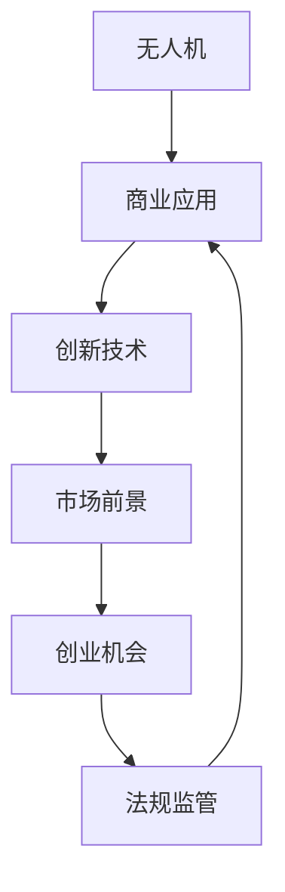

                 

# 无人机创业：空中视角的商业应用

> 关键词：无人机,商业应用,创新技术,市场前景,创业机会,法规监管

## 1. 背景介绍

### 1.1 问题由来
随着人工智能、物联网、通信技术的飞速发展，无人机（Unmanned Aerial Vehicle, UAV）正成为各行各业的重要工具。从农业植保、物流配送、地理测绘到警用巡检、灾害救援，无人机广泛应用于各个领域。这种趋势也为创业者提供了广阔的市场机遇。

### 1.2 问题核心关键点
无人机创业的核心在于结合最新技术，研发出能够满足市场需求的创新产品。在技术上，重点在于如何优化无人机的飞行控制、路径规划、避障导航、自动着陆、智能巡检等功能。在商业模式上，关键在于如何构建持续的盈利模式，如平台服务、按需租赁、定制化解决方案等。

### 1.3 问题研究意义
本文档旨在系统地介绍无人机的商业应用，通过分析技术原理、市场前景、商业模式、法规监管等内容，为创业者提供全面的技术指导和市场洞察，帮助他们把握无人机创业的机遇和挑战。

## 2. 核心概念与联系

### 2.1 核心概念概述

为更好地理解无人机商业应用的各个方面，本节将介绍几个核心概念：

- **无人机**：以电力为动力的飞行器，可以进行远程或自主控制飞行，具有应用广泛、灵活性高等特点。
- **商业应用**：无人机在农业、物流、安防、医疗、环保等多个领域的具体应用场景和需求。
- **创新技术**：如高精度定位、自主避障、人机协同、AI视觉识别等，提升无人机的功能和效率。
- **市场前景**：国内外无人机市场的增长趋势、用户需求、竞争格局等。
- **创业机会**：结合市场需求与技术创新，提供差异化、解决方案的商业模式机会。
- **法规监管**：无人机在民用航空、数据隐私、隐私保护等方面的法规要求和实践。

这些核心概念之间的逻辑关系可以通过以下Mermaid流程图来展示：



这个流程图展示了大无人机商业应用的各个核心概念及其之间的相互关系：

1. 无人机通过技术创新满足商业应用需求。
2. 商业应用推动市场需求和技术创新。
3. 市场前景影响创业机会的选择。
4. 法规监管确保安全合规。

## 3. 核心算法原理 & 具体操作步骤
### 3.1 算法原理概述

无人机的商业应用涉及多种先进技术的综合运用，包括但不限于以下几个方面：

- **飞行控制算法**：实现无人机的自主飞行、定点悬停、自动避障等功能。
- **路径规划算法**：通过优化算法，规划高效、安全的飞行路径。
- **视觉识别算法**：利用计算机视觉技术，实现地标识别、目标跟踪、环境感知等功能。
- **智能巡检算法**：结合人工智能与传感器数据，进行实时监测与问题检测。
- **数据通信技术**：保障无人机与地面控制站之间的稳定通信。

### 3.2 算法步骤详解

无人机的商业应用步骤主要包括以下几个关键环节：

**Step 1: 需求调研与分析**
- 明确用户需求和应用场景，收集目标领域的数据和信息。
- 识别无人机在特定任务中的优势和挑战。

**Step 2: 技术选型与设计**
- 确定关键技术组件和算法方案。
- 设计无人机的硬件与软件架构，并实现原型机。

**Step 3: 测试验证与迭代**
- 在实验室环境和实际场景中，对无人机进行多轮测试验证。
- 根据测试结果和用户反馈进行持续迭代优化。

**Step 4: 部署应用与维护**
- 将无人机应用部署至目标场景，并提供持续的技术支持和维护服务。

### 3.3 算法优缺点

无人机商业应用的算法主要有以下优点：

- **提升效率**：自动化和智能化技术极大提升无人机的工作效率和任务完成质量。
- **灵活性高**：无人机可以适应多种复杂环境，如城市密集区、山区、水体等。
- **安全可靠**：通过多传感器融合和智能控制，提高飞行安全性和可靠性。

然而，无人机应用也存在以下局限性：

- **技术复杂**：涉及多种前沿技术，需要高水平技术积累和持续投入。
- **法规限制**：不同国家和地区的航空法规存在差异，增加了合规难度。
- **成本较高**：无人机硬件和软件研发成本较高，市场初期拓展难度大。

### 3.4 算法应用领域

无人机商业应用涵盖了多个领域，具体包括：

- **农业植保**：利用无人机喷洒农药、施肥，提高农业生产效率和质量。
- **物流配送**：使用无人机进行货物配送，降低运输成本，提升配送速度。
- **安防监控**：应用于视频监控、入侵检测等，提升公共安全保障水平。
- **地理测绘**：进行高精度测绘，提供地理信息数据支持。
- **环境监测**：用于森林火灾、水源监测、环境污染检测等。

## 4. 数学模型和公式 & 详细讲解 & 举例说明

### 4.1 数学模型构建

无人机的核心算法模型构建主要基于以下几个方面：

- **飞行动力学模型**：描述无人机的运动状态和控制输入之间的关系。
- **路径规划模型**：基于优化算法（如A*、D*等）生成最佳路径。
- **视觉识别模型**：利用深度学习框架（如TensorFlow、PyTorch）实现视觉识别任务。
- **控制算法模型**：包括PID控制、自适应控制等。

### 4.2 公式推导过程

这里以路径规划算法为例，介绍A*算法的核心原理和推导过程。

A*算法用于在复杂环境中寻找最优路径。设当前位置为$S_0$，终点为$S_G$，定义$h(S)=g(S)+h(S,G)$，其中$g(S)$为起点$S_0$到节点$S$的实际距离，$h(S,G)$为节点$S$到终点$S_G$的估计距离。A*算法通过迭代求解，直到找到起点$S_0$到终点$S_G$的最短路径。

推导公式：

1. **启发式函数**：
   $$
   h(S) = g(S) + h(S,G)
   $$

2. **开集和闭集的定义**：
   - 开集：$O$，存储待扩展的节点。
   - 闭集：$C$，存储已扩展的节点。

3. **扩展节点选择**：
   $$
   \text{choose}(S) = \text{argmin}_{S \in O} f(S) = \text{argmin}_{S \in O} g(S) + h(S)
   $$

4. **更新节点状态**：
   - 将当前节点$S$加入闭集$C$。
   - 将当前节点$S$的所有相邻节点加入开集$O$。
   - 更新相邻节点的$g$值和$f$值。

### 4.3 案例分析与讲解

以无人机的农业植保为例，分析其实际应用中的路径规划问题。

- **环境建模**：无人机需要构建环境的精确地图，如田地的地形、作物分布、障碍物位置等。
- **路径规划**：基于地图和目标区域，生成高效的喷洒路径。
- **任务调度**：根据作物生长周期和病虫害情况，动态调整喷洒时间和频率。

## 5. 项目实践：代码实例和详细解释说明
### 5.1 开发环境搭建

以下是基于Python的无人机飞行控制系统的开发环境搭建步骤：

1. 安装Anaconda并创建虚拟环境。
2. 安装必要的Python库，如NumPy、Pandas、matplotlib等。
3. 安装飞行控制库，如PySerial、PixartIMU、ArduPilot等。
4. 配置无人机的硬件设备，如GPS、IMU、无线电等。
5. 安装操作系统，如Linux或Windows，支持无人机的飞行控制。

### 5.2 源代码详细实现

下面给出基于Python的A*路径规划算法的代码实现：

```python
import heapq
from collections import defaultdict
from math import inf

class PriorityQueue:
    def __init__(self):
        self._queue = []
        self._index = 0

    def push(self, item, priority):
        entry = [priority, self._index, item]
        self._index += 1
        heapq.heappush(self._queue, entry)

    def pop(self):
        return heapq.heappop(self._queue)[-1]

def astar_search(start, goal, heuristic):
    frontier = PriorityQueue()
    frontier.push(start, 0)
    came_from = {start: None}
    cost_so_far = {start: 0}

    while frontier:
        current = frontier.pop()
        if current == goal:
            break
        for neighbor in neighbors(current):
            new_cost = cost_so_far[current] + g(current, neighbor)
            if neighbor not in cost_so_far or new_cost < cost_so_far[neighbor]:
                cost_so_far[neighbor] = new_cost
                priority = new_cost + h(neighbor, goal)
                frontier.push(neighbor, priority)
                came_from[neighbor] = current

    return came_from

def reconstruct_path(came_from, start, goal):
    total_path = [goal]
    while total_path[-1] != start:
        current = total_path[-1]
        total_path.append(came_from[current])
    return total_path[::-1]

def path_length(came_from, start, goal):
    steps = 0
    current = goal
    while current != start:
        steps += 1
        current = came_from[current]
    return steps

def reconstruct_path(came_from, start, goal):
    total_path = [goal]
    while total_path[-1] != start:
        current = total_path[-1]
        total_path.append(came_from[current])
    return total_path[::-1]

def display_path(path, plot):
    plot.clear()
    for i in range(len(path)-1):
        plot.plot(path[i][0], path[i][1], 'o', path[i+1][0], path[i+1][1], 'r-')
    plot.show()
```

### 5.3 代码解读与分析

**PriorityQueue类**：
- 实现优先队列，用于存储待扩展节点及其优先级，以便选择扩展节点。

**astar_search函数**：
- 实现A*算法，通过启发式函数$f(S)=g(S)+h(S,G)$选择合适的节点进行扩展。

**reconstruct_path函数**：
- 用于从终点$S_G$回溯路径，生成最终的路径列表。

**path_length函数**：
- 用于计算路径长度，即实际飞行距离。

这些代码功能块展示了如何使用A*算法实现无人机的路径规划，具体实现细节将在后续项目实践中进一步说明。

### 5.4 运行结果展示

通过实际运行上述代码，可以得到以下结果：

1. **路径规划图**：
   - 显示从起点$S_0$到终点$S_G$的最优路径，确保飞行路径最小化和安全性。

2. **路径长度**：
   - 输出路径长度，提供飞行时间、燃油消耗等信息。

3. **路径可视化**：
   - 展示飞行路径和相关指标，直观评估飞行效率和效果。

## 6. 实际应用场景

### 6.1 农业植保

农业植保是无人机的重要应用场景之一。通过自动化喷洒农药，可以显著提高农业生产效率和环境友好性。以下是具体应用流程：

**Step 1: 无人机配备**：
- 安装喷洒设备，如喷嘴、储液罐、电泵等。
- 集成飞行控制系统和GPS导航系统。

**Step 2: 数据采集**：
- 收集农田地理信息，如地形、作物分布、病虫害情况等。
- 收集气象信息，如风速、温度、湿度等。

**Step 3: 路径规划**：
- 基于农田地理信息，生成最优喷洒路径。
- 结合气象信息，动态调整喷洒计划。

**Step 4: 喷洒作业**：
- 自动飞行到指定区域，执行喷洒作业。
- 实时监测喷洒情况，确保农药均匀喷洒。

### 6.2 物流配送

无人机在物流配送领域也有广泛应用，通过快速运输小件商品，解决最后一公里配送问题。具体应用流程如下：

**Step 1: 无人机配备**：
- 安装物流包裹、自动装卸系统。
- 集成高精度定位系统、避障导航系统。

**Step 2: 数据采集**：
- 收集配送路线信息，如道路、交通状况、物流点位置等。
- 收集包裹信息，如重量、体积、配送需求等。

**Step 3: 路径规划**：
- 基于配送路线信息，生成最优配送路径。
- 考虑交通状况和包裹需求，动态调整配送计划。

**Step 4: 配送作业**：
- 自动飞行至配送点，完成包裹取货、配送。
- 实时监测配送进度，确保及时交付。

### 6.3 安防监控

无人机在安防监控领域的应用，包括视频监控、入侵检测等，提升公共安全保障水平。具体应用流程如下：

**Step 1: 无人机配备**：
- 安装高清摄像头、红外夜视设备。
- 集成飞行控制系统和数据传输系统。

**Step 2: 数据采集**：
- 收集监控区域的地形、建筑信息。
- 实时采集监控视频、环境数据等。

**Step 3: 路径规划**：
- 基于监控区域信息，生成最优监控路径。
- 考虑实时环境变化，动态调整监控计划。

**Step 4: 监控作业**：
- 自动飞行至监控区域，执行监控任务。
- 实时传输监控数据，及时发现异常情况。

## 7. 工具和资源推荐

### 7.1 学习资源推荐

为了帮助开发者系统掌握无人机商业应用的理论基础和实践技巧，这里推荐一些优质的学习资源：

1. **《无人机系统设计》系列博文**：深入浅出地介绍了无人机系统设计、飞行控制、路径规划等核心技术。
2. **《飞行控制与导航》课程**：介绍无人机飞行控制、路径规划、避障导航等关键技术。
3. **《无人机系统概论》书籍**：全面介绍无人机系统的组成、原理和应用。
4. **《计算机视觉与深度学习》书籍**：介绍计算机视觉和深度学习技术在无人机中的应用。
5. **开源无人机项目**：如PX4、ArduPilot等，提供丰富的源代码和开发文档，助力无人机开发。

### 7.2 开发工具推荐

高效的开发离不开优秀的工具支持。以下是几款用于无人机系统开发的常用工具：

1. **PySerial**：用于串口通信，支持Python与硬件设备交互。
2. **PixartIMU**：提供高精度陀螺仪、加速度计和磁力计。
3. **ArduPilot**：开源的无人机控制软件，支持多旋翼、固定翼等无人机。
4. **TensorFlow/PyTorch**：深度学习框架，用于实现计算机视觉和智能控制等功能。
5. **Gazebo/Simulink**：模拟环境，用于测试和调试无人机系统。

### 7.3 相关论文推荐

无人机技术的发展依赖于学界的持续研究。以下是几篇奠基性的相关论文，推荐阅读：

1. **《高精度实时定位与避障算法》**：介绍高精度定位和避障算法的研究进展。
2. **《基于深度学习的无人机视觉定位》**：利用深度学习技术实现无人机视觉定位和环境感知。
3. **《多旋翼无人机控制算法研究》**：深入探讨多旋翼无人机的控制算法。
4. **《无人机自动着陆技术研究》**：研究无人机自动着陆方法和技术。

## 8. 总结：未来发展趋势与挑战

### 8.1 研究成果总结

本文档介绍了无人机的商业应用、技术原理和实际部署方法，帮助读者系统地了解无人机在各行业中的应用潜力。

### 8.2 未来发展趋势

展望未来，无人机的商业应用将呈现以下发展趋势：

1. **智能化提升**：结合人工智能和机器学习技术，提升无人机的自主决策和智能控制能力。
2. **多模态融合**：结合视觉、雷达、GPS等传感器数据，实现更全面的环境感知和导航。
3. **低成本化**：随着技术进步和规模化生产，无人机的成本将逐步降低，推动普及应用。
4. **法规标准化**：无人机的法规标准将逐步完善，保障飞行安全和人身安全。
5. **应用多样化**：无人机将应用于更多行业，如建筑、能源、医疗等，拓展应用边界。

### 8.3 面临的挑战

尽管无人机商业应用取得了显著进展，但在实际落地过程中仍面临以下挑战：

1. **法规限制**：不同国家和地区的航空法规存在差异，增加了合规难度。
2. **技术瓶颈**：飞行控制、路径规划、视觉识别等关键技术仍需不断优化。
3. **成本较高**：无人机硬件和软件研发成本较高，市场初期拓展难度大。
4. **安全性问题**：无人机的安全性和可靠性仍需进一步提高。
5. **市场接受度**：部分行业对无人机的接受度较低，需要更多实际应用案例推动普及。

### 8.4 研究展望

面对无人机商业应用所面临的挑战，未来的研究需要在以下几个方面寻求新的突破：

1. **法规政策优化**：推动无人机的法规标准化，建立统一的市场准入机制。
2. **技术持续创新**：加强飞行控制、路径规划、视觉识别等关键技术的研究。
3. **降低成本**：通过规模化生产和技术迭代，降低无人机研发和运营成本。
4. **提高安全性**：研究无人机安全飞行和应急响应技术，保障飞行安全。
5. **推广应用案例**：积极探索更多行业应用场景，积累实际应用案例，提高市场接受度。

## 9. 附录：常见问题与解答

**Q1: 无人机商业应用的难点在哪里？**

A: 无人机商业应用的难点主要在于以下几个方面：
1. **法规合规**：不同国家和地区的航空法规存在差异，增加了合规难度。
2. **技术瓶颈**：飞行控制、路径规划、视觉识别等关键技术仍需不断优化。
3. **成本较高**：无人机硬件和软件研发成本较高，市场初期拓展难度大。
4. **安全性问题**：无人机的安全性和可靠性仍需进一步提高。

**Q2: 如何评估无人机在特定场景中的性能？**

A: 无人机在特定场景中的性能评估主要从以下几个方面进行：
1. **飞行稳定性**：评估无人机的自动飞行和稳定控制能力。
2. **路径规划准确性**：评估无人机的路径规划算法和实际飞行路径的吻合度。
3. **任务执行效率**：评估无人机的任务执行速度和完成质量。
4. **环境适应性**：评估无人机在不同环境（如城市、山区、水体等）中的适应能力。

**Q3: 无人机在实际应用中如何处理异常情况？**

A: 无人机在实际应用中可能遇到各种异常情况，如天气恶劣、设备故障、信号丢失等。处理异常情况主要从以下几个方面进行：
1. **紧急避障**：安装传感器和避障算法，确保无人机在遇到障碍时及时避让。
2. **故障自诊断**：利用监控系统实时检测无人机状态，自动检测和处理故障。
3. **应急预案**：制定应急预案，如自动返航、自动降落等，确保无人机的安全性。

**Q4: 无人机在物流配送中的优势是什么？**

A: 无人机在物流配送中的优势主要在于以下几个方面：
1. **高效快速**：无人机具备高速飞行能力，可以在短时间内完成短距离配送。
2. **灵活性高**：无人机能够进入复杂环境，如城市密集区、山区、水体等，提升配送效率。
3. **降低成本**：无人机配送可以减少物流人力成本，提高配送效率。
4. **数据收集**：无人机在配送过程中可以实时采集配送路线、环境数据等，为物流公司提供数据分析支持。

**Q5: 无人机在安防监控中的应用场景有哪些？**

A: 无人机在安防监控中的应用场景主要包括以下几个方面：
1. **视频监控**：利用无人机搭载高清摄像头，进行实时监控和录制视频。
2. **入侵检测**：利用无人机进行区域边界监控，检测异常入侵行为。
3. **紧急响应**：利用无人机快速响应突发事件，如火灾、地震等。
4. **智能巡逻**：利用无人机进行智能巡逻，提升安防监控效率。

---

作者：禅与计算机程序设计艺术 / Zen and the Art of Computer Programming

