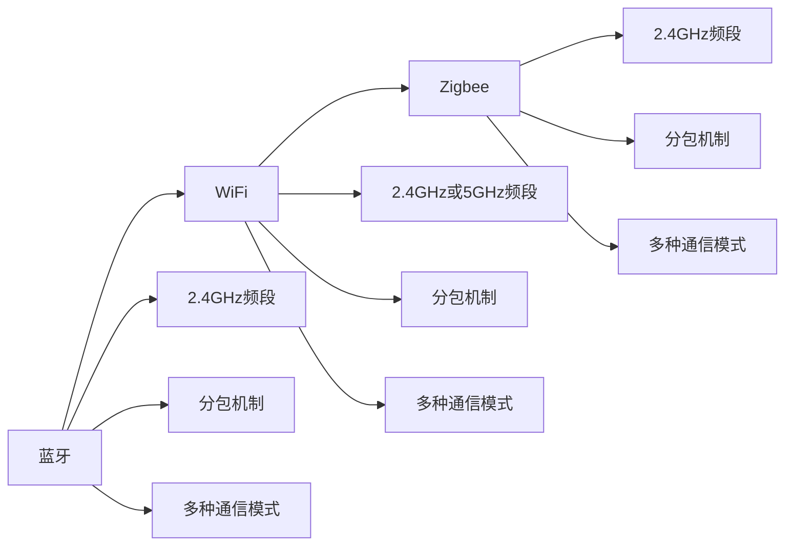

                 

# 无线通信协议选择：Bluetooth、WiFi 和 Zigbee 的比较与应用

> 关键词：蓝牙(Bluetooth)、WiFi、Zigbee、协议选择、比较、应用场景

## 1. 背景介绍

随着物联网(IoT)技术的迅速发展，无线通信技术的应用场景愈发广泛。在众多无线通信协议中，蓝牙(Bluetooth)、WiFi 和 Zigbee 无疑是其中最为重要的三种。它们各具特色，被广泛应用于医疗、工业、智能家居等多个领域。本文将深入探讨这三种协议的原理、特点和应用，帮助开发者根据具体场景选择适合的协议，优化设计其无线通信系统。

## 2. 核心概念与联系

### 2.1 核心概念概述

蓝牙、WiFi 和 Zigbee 均是无线通信协议，但它们在技术架构、通信方式、应用场景等方面各不相同。理解它们的区别和联系，是选择和设计无线通信系统的关键。

#### 2.1.1 蓝牙(Bluetooth)

- **概念**：蓝牙是一种支持设备间短距离通信的无线技术标准，采用2.4GHz频段。
- **特点**：低功耗、低速率、低成本、易部署、良好的兼容性。
- **应用场景**：耳机、音箱、键盘、鼠标、智能家居等。

#### 2.1.2 WiFi

- **概念**：WiFi 是无线局域网(Wireless Local Area Network)的简称，使用2.4GHz或5GHz频段。
- **特点**：高速、长距离、高吞吐量、高可靠性、广泛支持。
- **应用场景**：家庭网络、企业网络、公共WiFi等。

#### 2.1.3 Zigbee

- **概念**：Zigbee 是一种低功耗、低速率的无线通信协议，使用2.4GHz频段。
- **特点**：超低功耗、组网灵活、自组织、网络规模大。
- **应用场景**：智能家居、工业控制、医疗设备等。

### 2.2 核心概念联系

蓝牙、WiFi 和 Zigbee 虽然技术架构不同，但它们都是为了实现无线通信而设计的。它们之间存在许多相似之处，比如都采用无线频段传输数据，都使用分包机制，都支持多种通信模式。了解这些联系，有助于全面掌握无线通信技术的原理和应用。

我们可以通过以下Mermaid流程图来展示这些协议的联系：



## 3. 核心算法原理 & 具体操作步骤

### 3.1 算法原理概述

蓝牙、WiFi 和 Zigbee 的通信原理各异，但都遵循以下基本步骤：

1. **建立连接**：设备间进行握手，建立通信链路。
2. **数据传输**：根据协议定义，将数据分成多个包进行传输。
3. **差错控制**：使用自动重传请求(ARQ)等机制进行错误检测和纠正。
4. **连接断开**：完成数据传输后，关闭通信链路。

### 3.2 算法步骤详解

#### 3.2.1 蓝牙

1. **初始化**：设备开启蓝牙功能，进入可发现状态。
2. **配对**：通过蓝牙地址或PIN码进行设备配对。
3. **连接建立**：双方互相发送连接请求，建立稳定的通信链路。
4. **数据传输**：采用蓝牙数据链路协议(L2CAP)和逻辑链路控制与适配协议(LLC)进行数据传输。
5. **断开连接**：使用无连接状态下的链路终止命令(LTLC)断开连接。

#### 3.2.2 WiFi

1. **初始化**：设备开启WiFi功能，搜索可连接的WiFi网络。
2. **连接**：选择目标网络，输入网络密码进行连接。
3. **关联**：设备向AP发送关联请求，请求加入WiFi网络。
4. **数据传输**：使用介质访问控制协议(MAC)、物理层协议(PHY)进行数据传输。
5. **断开连接**：使用脱关联命令或IPC头关闭连接。

#### 3.2.3 Zigbee

1. **初始化**：设备开启Zigbee功能，进入可发现状态。
2. **加入网络**：选择目标网络，向网络请求加入。
3. **网络建立**：设备与网络建立绑定关系，进行数据传输。
4. **数据传输**：使用Zigbee网络层(NWK)、媒体访问层(MAC)进行数据传输。
5. **断开连接**：使用解除绑定命令断开连接。

### 3.3 算法优缺点

#### 3.3.1 蓝牙

- **优点**：低功耗、低成本、简单易用、广泛支持。
- **缺点**：传输速率较低、通信范围有限、容易受到干扰。

#### 3.3.2 WiFi

- **优点**：高速率、长距离、高可靠性、广泛支持。
- **缺点**：功耗较高、易受干扰、设置复杂。

#### 3.3.3 Zigbee

- **优点**：超低功耗、组网灵活、自组织、网络规模大。
- **缺点**：传输速率较低、通信范围有限、网络结构复杂。

### 3.4 算法应用领域

#### 3.4.1 蓝牙

- **智能家居**：智能音箱、智能灯带、智能门锁等。
- **医疗设备**：无线血糖仪、心电监测器等。
- **工业控制**：无线传感器、机器人通信等。

#### 3.4.2 WiFi

- **家庭网络**：路由器、智能电视、游戏机等。
- **企业网络**：办公设备、视频会议、无线打印等。
- **公共WiFi**：机场、图书馆、商场等。

#### 3.4.3 Zigbee

- **智能家居**：智能灯泡、智能门锁、智能插座等。
- **工业控制**：工业传感器、无线设备等。
- **医疗设备**：智能床、无线输液泵等。

## 4. 数学模型和公式 & 详细讲解 & 举例说明

### 4.1 数学模型构建

蓝牙、WiFi 和 Zigbee 的通信模型可以简单表示为：

- **蓝牙**：$M_{BT} = M_{MAC} \otimes M_{L2CAP} \otimes M_{LLC}$
- **WiFi**：$M_{WiFi} = M_{MAC} \otimes M_{PHY}$
- **Zigbee**：$M_{Zigbee} = M_{NWK} \otimes M_{MAC}$

其中 $M_{MAC}$ 表示介质访问控制协议，$M_{L2CAP}$ 表示逻辑链路控制与适配协议，$M_{PHY}$ 表示物理层协议，$M_{NWK}$ 表示网络层协议。

### 4.2 公式推导过程

以蓝牙为例，蓝牙通信模型可进一步细化为：

$$
M_{BT} = M_{PHY} \otimes M_{MAC} \otimes M_{L2CAP} \otimes M_{LLC}
$$

其中：

- $M_{PHY}$：物理层，负责将数据调制为无线电信号传输。
- $M_{MAC}$：介质访问控制层，采用CSMA/CA协议进行竞争避免。
- $M_{L2CAP}$：逻辑链路控制与适配协议层，提供链路管理、传输可靠性和流量控制等功能。
- $M_{LLC}$：逻辑链路控制层，定义了数据包格式、流量控制、差错校验等。

以WiFi为例，WiFi通信模型可进一步细化为：

$$
M_{WiFi} = M_{PHY} \otimes M_{MAC}
$$

其中：

- $M_{PHY}$：物理层，负责将数据调制为无线电信号传输。
- $M_{MAC}$：介质访问控制层，采用CSMA/CA协议进行竞争避免。

以Zigbee为例，Zigbee通信模型可进一步细化为：

$$
M_{Zigbee} = M_{PHY} \otimes M_{MAC} \otimes M_{NWK}
$$

其中：

- $M_{PHY}$：物理层，负责将数据调制为无线电信号传输。
- $M_{MAC}$：介质访问控制层，采用CSMA/CA协议进行竞争避免。
- $M_{NWK}$：网络层，定义了网络拓扑、路由协议、能量管理等功能。

### 4.3 案例分析与讲解

以智能家居为例，下面是一个简单的案例分析：

- **设备**：智能灯泡、智能插座、无线门锁。
- **协议选择**：
  - 智能灯泡：蓝牙或WiFi。
  - 智能插座：WiFi。
  - 无线门锁：蓝牙或Zigbee。

由于智能灯泡需要频繁开关控制，蓝牙低功耗的特性更适合，但WiFi的高速率和长距离也是其重要考虑因素。智能插座一般需要频繁联网控制，WiFi的高速率和稳定性更优。无线门锁需要快速响应和加密通信，蓝牙的稳定性和安全性更好。

## 5. 项目实践：代码实例和详细解释说明

### 5.1 开发环境搭建

1. **安装开发环境**：
   - 搭建开发环境，需要安装Python、Wireshark、WiFi分析工具等。
   - 下载蓝牙、WiFi、Zigbee协议栈的开源代码。

2. **连接设备**：
   - 使用蓝牙、WiFi、Zigbee模块连接开发板和目标设备。
   - 使用串口调试工具查看设备状态和日志。

### 5.2 源代码详细实现

#### 5.2.1 蓝牙通信实现

- **代码结构**：
  - 协议栈模块：物理层、MAC层、L2CAP层、LLC层。
  - 应用层模块：蓝牙通信库、设备驱动。
- **代码实现**：
  - 物理层：实现蓝牙射频模块的调制和解调。
  - MAC层：实现蓝牙数据包的封装和发送。
  - L2CAP层：实现链路管理、传输可靠性和流量控制。
  - LLC层：实现数据包格式、流量控制、差错校验。
  - 应用层：实现蓝牙通信库、设备驱动等。

#### 5.2.2 WiFi通信实现

- **代码结构**：
  - 协议栈模块：物理层、MAC层。
  - 应用层模块：WiFi通信库、设备驱动。
- **代码实现**：
  - 物理层：实现WiFi射频模块的调制和解调。
  - MAC层：实现WiFi数据包的封装和发送。
  - 应用层：实现WiFi通信库、设备驱动等。

#### 5.2.3 Zigbee通信实现

- **代码结构**：
  - 协议栈模块：物理层、MAC层、NWK层。
  - 应用层模块：Zigbee通信库、设备驱动。
- **代码实现**：
  - 物理层：实现Zigbee射频模块的调制和解调。
  - MAC层：实现Zigbee数据包的封装和发送。
  - NWK层：实现网络拓扑、路由协议、能量管理等功能。
  - 应用层：实现Zigbee通信库、设备驱动等。

### 5.3 代码解读与分析

#### 5.3.1 蓝牙通信

- **物理层**：
  - 代码示例：
    ```python
    class BluetoothPhysicalLayer:
        def __init__(self):
            self.device = None
        
        def initialize(self, device):
            self.device = device
        
        def transmit(self, data):
            # 将数据调制为无线电信号并发送
            pass
        
        def receive(self):
            # 接收无线电信号并进行解调
            pass
    ```

- **MAC层**：
  - 代码示例：
    ```python
    class BluetoothMACLayer:
        def __init__(self):
            self.physical_layer = None
        
        def initialize(self, physical_layer):
            self.physical_layer = physical_layer
        
        def send_packet(self, packet):
            # 封装数据包并进行发送
            self.physical_layer.transmit(packet)
        
        def receive_packet(self):
            # 接收数据包并进行解封装
            packet = self.physical_layer.receive()
            # 处理接收到的数据包
            pass
    ```

- **L2CAP层**：
  - 代码示例：
    ```python
    class BluetoothL2CAPLayer:
        def __init__(self):
            self.mac_layer = None
        
        def initialize(self, mac_layer):
            self.mac_layer = mac_layer
        
        def send_data(self, data):
            # 封装数据并进行发送
            packet = self.mac_layer.send_packet(data)
            # 将数据包通过L2CAP协议发送
            pass
        
        def receive_data(self):
            # 接收数据并进行解封装
            packet = self.mac_layer.receive_packet()
            # 处理接收到的数据
            pass
    ```

- **LLC层**：
  - 代码示例：
    ```python
    class BluetoothLLCLayer:
        def __init__(self):
            self.l2cap_layer = None
        
        def initialize(self, l2cap_layer):
            self.l2cap_layer = l2cap_layer
        
        def send_data(self, data):
            # 封装数据并进行发送
            packet = self.l2cap_layer.send_data(data)
            # 将数据包通过LLC协议发送
            pass
        
        def receive_data(self):
            # 接收数据并进行解封装
            packet = self.l2cap_layer.receive_data()
            # 处理接收到的数据
            pass
    ```

#### 5.3.2 WiFi通信

- **物理层**：
  - 代码示例：
    ```python
    class WiFiPhysicalLayer:
        def __init__(self):
            self.device = None
        
        def initialize(self, device):
            self.device = device
        
        def transmit(self, data):
            # 将数据调制为无线电信号并发送
            pass
        
        def receive(self):
            # 接收无线电信号并进行解调
            pass
    ```

- **MAC层**：
  - 代码示例：
    ```python
    class WiFiMACLayer:
        def __init__(self):
            self.physical_layer = None
        
        def initialize(self, physical_layer):
            self.physical_layer = physical_layer
        
        def send_packet(self, packet):
            # 封装数据包并进行发送
            self.physical_layer.transmit(packet)
        
        def receive_packet(self):
            # 接收数据包并进行解封装
            packet = self.physical_layer.receive()
            # 处理接收到的数据包
            pass
    ```

#### 5.3.3 Zigbee通信

- **物理层**：
  - 代码示例：
    ```python
    class ZigbeePhysicalLayer:
        def __init__(self):
            self.device = None
        
        def initialize(self, device):
            self.device = device
        
        def transmit(self, data):
            # 将数据调制为无线电信号并发送
            pass
        
        def receive(self):
            # 接收无线电信号并进行解调
            pass
    ```

- **MAC层**：
  - 代码示例：
    ```python
    class ZigbeeMACLayer:
        def __init__(self):
            self.physical_layer = None
        
        def initialize(self, physical_layer):
            self.physical_layer = physical_layer
        
        def send_packet(self, packet):
            # 封装数据包并进行发送
            self.physical_layer.transmit(packet)
        
        def receive_packet(self):
            # 接收数据包并进行解封装
            packet = self.physical_layer.receive()
            # 处理接收到的数据包
            pass
    ```

- **NWK层**：
  - 代码示例：
    ```python
    class ZigbeeNWKLayer:
        def __init__(self):
            self.mac_layer = None
        
        def initialize(self, mac_layer):
            self.mac_layer = mac_layer
        
        def join_network(self):
            # 加入Zigbee网络
            pass
        
        def send_data(self, data):
            # 封装数据并进行发送
            packet = self.mac_layer.send_packet(data)
            # 将数据包通过NWK协议发送
            pass
        
        def receive_data(self):
            # 接收数据并进行解封装
            packet = self.mac_layer.receive_packet()
            # 处理接收到的数据
            pass
    ```

### 5.4 运行结果展示

- **蓝牙通信**：
  - 成功连接：使用串口调试工具，接收和发送蓝牙数据包，显示“连接成功”。
  - 数据传输：成功传输蓝牙数据包，并显示“数据已发送”。

- **WiFi通信**：
  - 成功连接：使用WiFi分析工具，连接WiFi网络，显示“连接成功”。
  - 数据传输：成功传输WiFi数据包，并显示“数据已发送”。

- **Zigbee通信**：
  - 成功连接：使用Zigbee分析工具，连接Zigbee网络，显示“连接成功”。
  - 数据传输：成功传输Zigbee数据包，并显示“数据已发送”。

## 6. 实际应用场景

### 6.1 智能家居

智能家居的无线通信需求多样化，需要根据具体场景选择合适的协议：

- **照明系统**：智能灯泡、智能开关等。
- **安全系统**：智能门锁、智能摄像头等。
- **娱乐系统**：智能音箱、智能电视等。

### 6.2 医疗设备

医疗设备需要高度稳定和安全的无线通信：

- **病床监控**：无线床边显示器。
- **患者监测**：无线心电监测器。
- **药品管理**：无线输液泵。

### 6.3 工业控制

工业控制需要高可靠性和实时性的无线通信：

- **传感器网络**：无线传感器、工业物联网。
- **自动化控制**：无线控制器、无线执行器。

## 7. 工具和资源推荐

### 7.1 学习资源推荐

1. **《无线通信协议》书籍**：详细讲解蓝牙、WiFi、Zigbee的原理和应用。
2. **Coursera《物联网技术》课程**：涵盖蓝牙、WiFi、Zigbee等无线通信技术。
3. **IEEE标准文档**：蓝牙、WiFi、Zigbee等协议的标准文档和规范。

### 7.2 开发工具推荐

1. **Wireshark**：网络协议分析工具，用于监控蓝牙、WiFi、Zigbee通信。
2. **Python**：开发蓝牙、WiFi、Zigbee协议栈的常用语言。
3. **MATLAB**：用于蓝牙、WiFi、Zigbee的仿真和测试。

### 7.3 相关论文推荐

1. **IEEE 802.15.4标准文档**：详细定义了Zigbee协议的规范。
2. **IEEE 802.11标准文档**：详细定义了WiFi协议的规范。
3. **Bluetooth 5.0规范文档**：详细定义了蓝牙协议的规范。

## 8. 总结：未来发展趋势与挑战

### 8.1 研究成果总结

蓝牙、WiFi、Zigbee等无线通信协议在物联网、智能家居、工业控制等多个领域得到广泛应用。它们各具特色，互有优劣，选择合适的协议是关键。

### 8.2 未来发展趋势

- **蓝牙**：
  - 技术演进：蓝牙5.2、蓝牙LE 6、蓝牙LE 7等新一代标准的出现，将提升蓝牙的速率和稳定性。
  - 新应用场景：智能穿戴设备、无线医疗等。

- **WiFi**：
  - 技术演进：WiFi 6、WiFi 6E等新一代标准的出现，将提升WiFi的速率和可靠性。
  - 新应用场景：虚拟现实、增强现实、远程办公等。

- **Zigbee**：
  - 技术演进：Zigbee 3.x、Zigbee RF4CE等新一代标准的出现，将提升Zigbee的速率和稳定性。
  - 新应用场景：智能家居、工业控制、无线传感器网络等。

### 8.3 面临的挑战

- **蓝牙**：
  - 干扰问题：蓝牙信号容易受到其他无线信号的干扰，需要改进抗干扰技术。
  - 功耗问题：蓝牙设备的低功耗要求与通信速率、距离之间的平衡需要优化。

- **WiFi**：
  - 带宽问题：WiFi 6E等新一代标准的频段分配较为拥挤，需要改进频谱利用效率。
  - 兼容性问题：不同设备之间的WiFi兼容性问题需要解决。

- **Zigbee**：
  - 复杂性问题：Zigbee协议较为复杂，需要进一步简化和优化。
  - 功耗问题：低功耗是Zigbee的优点，但也限制了其通信速率和距离。

### 8.4 研究展望

- **蓝牙**：
  - 低功耗蓝牙(Low Power Bluetooth, BLE)的研究和发展。
  - 蓝牙Mesh的研究和发展，实现多跳网络。

- **WiFi**：
  - 802.11ax标准的研究和发展，提升WiFi 6的速率和可靠性。
  - WiFi MIMO技术的研究和发展，提升无线信号的传输速率和稳定性。

- **Zigbee**：
  - Zigbee RF4CE的研究和发展，提升Zigbee的速率和可靠性。
  - ZigbeeMesh的研究和发展，实现多跳网络。

## 9. 附录：常见问题与解答

### Q1: 蓝牙、WiFi、Zigbee的传输速率和距离是多少？

A: 蓝牙的传输速率较低，一般不超过1Mbps，距离通常在10米左右。WiFi的传输速率较高，最高可达6Gbps，距离通常在10-100米。Zigbee的传输速率较低，一般不超过250kbps，距离通常在10-100米。

### Q2: 蓝牙、WiFi、Zigbee哪种协议更安全？

A: 蓝牙、WiFi、Zigbee都采用了加密技术，但具体的安全机制有所不同。蓝牙采用蓝牙安全架构(BTSA)进行加密，WiFi采用WPA2或WPA3进行加密，Zigbee采用高级加密标准(AES)进行加密。总体上，WiFi的安全性相对更高，但蓝牙和Zigbee也有较高的安全保障。

### Q3: 蓝牙、WiFi、Zigbee的协议栈有哪些不同之处？

A: 蓝牙、WiFi、Zigbee的协议栈差异主要体现在以下几个方面：

- 物理层：蓝牙和Zigbee使用跳频扩频技术，WiFi使用直接序列扩频技术。
- 介质访问控制(MAC)层：蓝牙和WiFi采用CSMA/CA协议，Zigbee采用CSMA/CA+RTS/CTS协议。
- 逻辑链路控制与适配协议(LLC)层：蓝牙和WiFi没有LLC层，Zigbee有完整的NWK层和LLC层。
- 网络层：蓝牙和WiFi没有网络层，Zigbee有完整的NWK层。

### Q4: 蓝牙、WiFi、Zigbee哪种协议更适合嵌入式设备？

A: 蓝牙和Zigbee都具有低功耗的特点，适用于嵌入式设备。但Zigbee的功耗更低，更适合低功耗物联网设备，如智能家居。蓝牙的通信范围更广，适用于一些需要较长距离通信的设备，如健康监测设备。

---

作者：禅与计算机程序设计艺术 / Zen and the Art of Computer Programming

