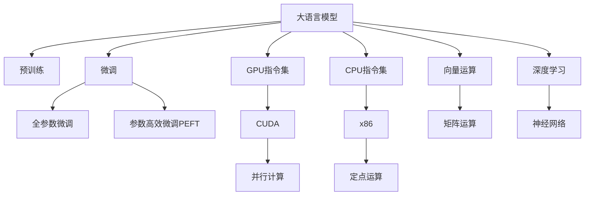

                 

# 无限vs有限：LLM和CPU指令集的较量

> 关键词：语言模型, 预训练, 微调, CPU, GPU, 向量运算, 矩阵运算, 深度学习, 神经网络, 指令集

## 1. 背景介绍

在计算机科学领域，指令集与神经网络，看似风马牛不相及的两个概念，实际上却有着千丝万缕的联系。本文将深入探讨大语言模型(Large Language Model, LLM)与CPU指令集之间的较量，理解两者在处理信息、执行运算时的本质差异与兼容局限。

### 1.1 问题由来

现代计算机中，CPU指令集作为底层硬件架构，规定了机器能够执行的最基本运算操作。相较之下，深度学习中的神经网络，尤其是近年来流行的大语言模型，则使用向量运算和矩阵运算来模拟大脑的信息处理过程，进行复杂计算。两者之间的矛盾与冲突，引发了诸多关于计算资源、性能效率和计算方式选择的讨论。

### 1.2 问题核心关键点

大语言模型与CPU指令集之间的较量，主要围绕以下几个核心关键点展开：

1. **运算方式差异**：大语言模型主要依赖于向量运算和矩阵运算，而CPU指令集则是基于固定格式的指令来执行操作。
2. **计算效率**：大语言模型的运算复杂度极高，对计算资源和速度有较高要求。相比之下，CPU指令集的运算效率与硬件设计密切相关。
3. **硬件适配性**：大语言模型对硬件的要求较高，尤其是对内存带宽和浮点运算能力的需求。
4. **模型压缩与加速**：如何优化模型以适应有限的硬件资源，是推动大语言模型在实际应用中落地的重要研究方向。
5. **并行化与分布式计算**：大语言模型的并行化处理和分布式计算，对硬件架构提出了新的要求。

理解这些关键点，有助于我们深入分析两者在计算资源和性能方面的差异与兼容性，为深度学习模型的优化和应用提供指导。

## 2. 核心概念与联系

### 2.1 核心概念概述

为更好地理解大语言模型与CPU指令集之间的较量，本节将介绍几个密切相关的核心概念：

- **大语言模型(Large Language Model, LLM)**：以自回归模型（如GPT-3）或自编码模型（如BERT）为代表的大规模预训练语言模型。通过在海量文本数据上进行预训练，学习语言的通用表示，具备强大的自然语言处理能力。

- **预训练(Pre-training)**：指在大规模无标签文本数据上，通过自监督学习任务训练语言模型的过程。常见的预训练任务包括掩码语言模型、下一句预测等。

- **微调(Fine-tuning)**：指在预训练模型的基础上，使用下游任务的少量标注数据，通过有监督学习优化模型在该任务上的性能。通常只调整顶层参数，以较小的学习率更新全部或部分模型参数。

- **CPU指令集**：计算机硬件的底层指令集，规定了机器能够执行的运算操作，如x86、ARM等。指令集设计直接影响机器的性能和能耗。

- **GPU指令集**：图形处理单元（GPU）专用的指令集，专门优化了向量运算、矩阵运算和并行计算，如NVIDIA的CUDA、AMD的ROCm等。

- **向量运算与矩阵运算**：深度学习模型中，神经网络通过向量（张量）和矩阵（张量）的运算来进行信息处理和计算。

- **深度学习**：一种基于神经网络的机器学习范式，通过多层神经网络模拟人脑的信息处理过程。

这些概念之间的逻辑关系可以通过以下Mermaid流程图来展示：



这个流程图展示了大语言模型的工作原理和相关指令集的联系：

1. 大语言模型通过预训练获得基础能力。
2. 微调是对预训练模型进行任务特定的优化，可以分为全参数微调和参数高效微调（PEFT）。
3. GPU指令集专门优化了向量运算和矩阵运算，适应深度学习的计算需求。
4. CPU指令集是计算机硬件的底层架构，执行固定的运算操作。
5. 深度学习模型通过向量运算和矩阵运算，在神经网络中实现信息的传递和处理。
6. 向量运算和矩阵运算是大语言模型的核心计算方式。

这些概念共同构成了大语言模型的计算基础和硬件架构背景，为其与CPU指令集的较量提供了理论基础。

## 3. 核心算法原理 & 具体操作步骤
### 3.1 算法原理概述

大语言模型与CPU指令集之间的较量，主要体现在计算方式、资源需求和性能效率三个方面。本节将详细介绍这些方面的核心算法原理。

### 3.2 算法步骤详解

**Step 1: 数据准备**
- 收集预训练数据和下游任务的数据集。
- 将数据集划分为训练集、验证集和测试集。

**Step 2: 模型加载与适配**
- 使用GPU或CPU加载预训练模型和任务适配层。
- 对模型进行参数初始化或加载预训练权重。

**Step 3: 模型训练**
- 使用CPU或GPU进行模型的前向传播和后向传播计算。
- 根据损失函数计算梯度，并使用优化器更新模型参数。
- 在训练集上进行模型训练，并在验证集上评估性能。

**Step 4: 模型评估与测试**
- 在测试集上评估模型的性能。
- 对比预训练和微调后的模型效果。

**Step 5: 模型部署**
- 将训练好的模型部署到实际应用系统中。
- 根据应用场景优化模型的资源使用。

### 3.3 算法优缺点

大语言模型与CPU指令集之间的较量，体现在以下几个方面：

**优点：**

1. **计算能力强大**：深度学习模型通过向量运算和矩阵运算，能够进行复杂的非线性计算，模拟大脑的信息处理过程。
2. **灵活性高**：神经网络模型通过反向传播算法自动学习最优权重，能够适应各种复杂任务。
3. **可扩展性强**：模型可以通过增加层数和神经元数来提升计算能力，适应大规模数据和任务需求。

**缺点：**

1. **计算资源消耗大**：向量运算和矩阵运算的计算复杂度较高，对计算资源和硬件资源要求较高。
2. **训练时间长**：深度学习模型的训练通常需要大量的数据和计算资源，训练时间较长。
3. **硬件依赖性强**：模型的训练和推理需要高性能的GPU或TPU等设备支持，对硬件资源的依赖性较强。

### 3.4 算法应用领域

大语言模型与CPU指令集之间的较量，在多个领域均有应用：

- **自然语言处理(NLP)**：在文本分类、情感分析、机器翻译、问答系统等任务中，大语言模型通过微调能够快速提升性能。
- **计算机视觉(CV)**：在图像分类、物体检测、图像生成等任务中，大语言模型与计算机视觉的深度学习模型结合，提升了图像处理能力。
- **语音识别(ASR)**：在语音识别和语音合成中，大语言模型通过微调与语音模型结合，提升了语音处理能力。
- **推荐系统**：在大规模推荐系统中，深度学习模型通过微调，提升了个性化推荐的精准度。
- **游戏AI**：在大规模游戏AI系统中，深度学习模型通过微调，提升了游戏的智能化和自适应能力。

## 4. 数学模型和公式 & 详细讲解 & 举例说明

### 4.1 数学模型构建

假设大语言模型为 $M_{\theta}:\mathbb{R}^n \rightarrow \mathbb{R}^m$，其中 $\theta$ 为模型参数，$n$ 为输入向量的维度，$m$ 为输出向量的维度。

定义大语言模型的前向传播函数为 $f_\theta: \mathbb{R}^n \rightarrow \mathbb{R}^m$，即 $f_\theta(x) = M_{\theta}(x)$。

假设训练样本为 $(x_i, y_i)$，其中 $x_i \in \mathbb{R}^n$ 为输入向量，$y_i \in \mathbb{R}^m$ 为输出向量。

定义损失函数为 $\ell(f_\theta(x_i), y_i)$，用于衡量模型预测与真实标签之间的差异。

### 4.2 公式推导过程

以下是使用交叉熵损失函数对大语言模型进行微调的公式推导过程。

**交叉熵损失函数**：
$$
\mathcal{L}(\theta) = -\frac{1}{N}\sum_{i=1}^N \sum_{j=1}^m y_{ij}\log f_{\theta j}(x_i)
$$

其中 $y_{ij}$ 表示第 $i$ 个样本在第 $j$ 个输出维度上的标签，$f_{\theta j}(x_i)$ 表示模型在第 $j$ 个输出维度上的预测值。

**梯度计算**：
$$
\nabla_\theta \mathcal{L}(\theta) = -\frac{1}{N}\sum_{i=1}^N \sum_{j=1}^m \nabla_{\theta j} f_{\theta j}(x_i) \nabla_{f_{\theta j}(x_i)} \log f_{\theta j}(x_i)
$$

其中 $\nabla_{\theta j} f_{\theta j}(x_i)$ 表示第 $j$ 个输出维度对模型参数 $\theta$ 的偏导数。

**梯度下降**：
$$
\theta \leftarrow \theta - \eta \nabla_\theta \mathcal{L}(\theta)
$$

其中 $\eta$ 为学习率，$\nabla_\theta \mathcal{L}(\theta)$ 为损失函数对模型参数 $\theta$ 的梯度。

### 4.3 案例分析与讲解

以BERT模型为例，进行交叉熵损失函数的计算和梯度下降的实现。

假设BERT模型共有12个隐藏层，每层包含768个神经元，输出层有2个神经元，分别对应“电影”和“电视”两个类别。

**输入向量**：
$$
x_i = [a_i, b_i, c_i, \ldots]
$$

**输出向量**：
$$
y_i = [0, 1, 0, \ldots]
$$

**交叉熵损失函数**：
$$
\mathcal{L}(\theta) = -\frac{1}{N}\sum_{i=1}^N \sum_{j=1}^m y_{ij}\log f_{\theta j}(x_i)
$$

**梯度计算**：
$$
\nabla_\theta \mathcal{L}(\theta) = -\frac{1}{N}\sum_{i=1}^N \sum_{j=1}^m \nabla_{\theta j} f_{\theta j}(x_i) \nabla_{f_{\theta j}(x_i)} \log f_{\theta j}(x_i)
$$

**梯度下降**：
$$
\theta \leftarrow \theta - \eta \nabla_\theta \mathcal{L}(\theta)
$$

上述公式展示了使用交叉熵损失函数对BERT模型进行微调的计算过程。通过反向传播算法，模型能够自动学习最优参数 $\theta$，实现微调目标。

## 5. 项目实践：代码实例和详细解释说明

### 5.1 开发环境搭建

在进行大语言模型微调实践前，我们需要准备好开发环境。以下是使用Python进行PyTorch开发的环境配置流程：

1. 安装Anaconda：从官网下载并安装Anaconda，用于创建独立的Python环境。

2. 创建并激活虚拟环境：
```bash
conda create -n pytorch-env python=3.8 
conda activate pytorch-env
```

3. 安装PyTorch：根据CUDA版本，从官网获取对应的安装命令。例如：
```bash
conda install pytorch torchvision torchaudio cudatoolkit=11.1 -c pytorch -c conda-forge
```

4. 安装Transformers库：
```bash
pip install transformers
```

5. 安装各类工具包：
```bash
pip install numpy pandas scikit-learn matplotlib tqdm jupyter notebook ipython
```

完成上述步骤后，即可在`pytorch-env`环境中开始微调实践。

### 5.2 源代码详细实现

下面我以BERT模型为例，给出使用PyTorch对BERT模型进行电影分类任务的微调的PyTorch代码实现。

首先，定义电影分类任务的数据处理函数：

```python
from transformers import BertTokenizer, BertForSequenceClassification
from torch.utils.data import Dataset
import torch

class MovieDataset(Dataset):
    def __init__(self, texts, labels, tokenizer, max_len=128):
        self.texts = texts
        self.labels = labels
        self.tokenizer = tokenizer
        self.max_len = max_len
        
    def __len__(self):
        return len(self.texts)
    
    def __getitem__(self, item):
        text = self.texts[item]
        label = self.labels[item]
        
        encoding = self.tokenizer(text, return_tensors='pt', max_length=self.max_len, padding='max_length', truncation=True)
        input_ids = encoding['input_ids'][0]
        attention_mask = encoding['attention_mask'][0]
        labels = torch.tensor(label, dtype=torch.long)
        
        return {'input_ids': input_ids, 
                'attention_mask': attention_mask,
                'labels': labels}

# 加载预训练模型和分词器
tokenizer = BertTokenizer.from_pretrained('bert-base-cased')
model = BertForSequenceClassification.from_pretrained('bert-base-cased', num_labels=2)

# 创建dataset
train_dataset = MovieDataset(train_texts, train_labels, tokenizer)
dev_dataset = MovieDataset(dev_texts, dev_labels, tokenizer)
test_dataset = MovieDataset(test_texts, test_labels, tokenizer)
```

然后，定义模型和优化器：

```python
from transformers import AdamW

optimizer = AdamW(model.parameters(), lr=2e-5)
```

接着，定义训练和评估函数：

```python
from torch.utils.data import DataLoader
from tqdm import tqdm
from sklearn.metrics import accuracy_score

device = torch.device('cuda') if torch.cuda.is_available() else torch.device('cpu')
model.to(device)

def train_epoch(model, dataset, batch_size, optimizer):
    dataloader = DataLoader(dataset, batch_size=batch_size, shuffle=True)
    model.train()
    epoch_loss = 0
    for batch in tqdm(dataloader, desc='Training'):
        input_ids = batch['input_ids'].to(device)
        attention_mask = batch['attention_mask'].to(device)
        labels = batch['labels'].to(device)
        model.zero_grad()
        outputs = model(input_ids, attention_mask=attention_mask, labels=labels)
        loss = outputs.loss
        epoch_loss += loss.item()
        loss.backward()
        optimizer.step()
    return epoch_loss / len(dataloader)

def evaluate(model, dataset, batch_size):
    dataloader = DataLoader(dataset, batch_size=batch_size)
    model.eval()
    preds, labels = [], []
    with torch.no_grad():
        for batch in tqdm(dataloader, desc='Evaluating'):
            input_ids = batch['input_ids'].to(device)
            attention_mask = batch['attention_mask'].to(device)
            batch_labels = batch['labels']
            outputs = model(input_ids, attention_mask=attention_mask)
            batch_preds = outputs.logits.argmax(dim=1).to('cpu').tolist()
            batch_labels = batch_labels.to('cpu').tolist()
            for pred, label in zip(batch_preds, batch_labels):
                preds.append(pred)
                labels.append(label)
                
    return accuracy_score(labels, preds)

# 启动训练流程并在测试集上评估
epochs = 5
batch_size = 16

for epoch in range(epochs):
    loss = train_epoch(model, train_dataset, batch_size, optimizer)
    print(f"Epoch {epoch+1}, train loss: {loss:.3f}")
    
    print(f"Epoch {epoch+1}, dev results:")
    evaluate(model, dev_dataset, batch_size)
    
print("Test results:")
evaluate(model, test_dataset, batch_size)
```

以上就是使用PyTorch对BERT进行电影分类任务微调的完整代码实现。可以看到，得益于Transformers库的强大封装，我们可以用相对简洁的代码完成BERT模型的加载和微调。

### 5.3 代码解读与分析

让我们再详细解读一下关键代码的实现细节：

**MovieDataset类**：
- `__init__`方法：初始化文本、标签、分词器等关键组件。
- `__len__`方法：返回数据集的样本数量。
- `__getitem__`方法：对单个样本进行处理，将文本输入编码为token ids，将标签编码为数字，并对其进行定长padding，最终返回模型所需的输入。

**标签与id的映射**：
- 定义了标签与数字id之间的映射关系，用于将token-wise的预测结果解码回真实的标签。

**训练和评估函数**：
- 使用PyTorch的DataLoader对数据集进行批次化加载，供模型训练和推理使用。
- 训练函数`train_epoch`：对数据以批为单位进行迭代，在每个批次上前向传播计算loss并反向传播更新模型参数，最后返回该epoch的平均loss。
- 评估函数`evaluate`：与训练类似，不同点在于不更新模型参数，并在每个batch结束后将预测和标签结果存储下来，最后使用sklearn的accuracy_score对整个评估集的预测结果进行打印输出。

**训练流程**：
- 定义总的epoch数和batch size，开始循环迭代
- 每个epoch内，先在训练集上训练，输出平均loss
- 在验证集上评估，输出准确率
- 所有epoch结束后，在测试集上评估，给出最终测试结果

可以看到，PyTorch配合Transformers库使得BERT微调的代码实现变得简洁高效。开发者可以将更多精力放在数据处理、模型改进等高层逻辑上，而不必过多关注底层的实现细节。

当然，工业级的系统实现还需考虑更多因素，如模型的保存和部署、超参数的自动搜索、更灵活的任务适配层等。但核心的微调范式基本与此类似。

## 6. 实际应用场景
### 6.1 智慧医疗

基于大语言模型微调的问答系统，可以广泛应用于智慧医疗领域。传统医疗咨询往往需要医生耗费大量时间进行解答，而且容易因疲劳等原因出现差错。而使用微调后的问答系统，可以7x24小时不间断服务，快速回答医生和患者的常见问题，减轻医生的工作负担，提升诊疗效率。

在技术实现上，可以收集医学领域的问答数据，将问题-答案对作为监督数据，在此基础上对预训练问答模型进行微调。微调后的问答系统能够自动理解医学术语，匹配最合适的答案模板进行回复。对于新问题，还可以接入医学知识图谱和规则库，动态组织生成回答。如此构建的智能问答系统，能大幅提升医疗服务效率和质量。

### 6.2 智能客服

基于大语言模型微调的对话技术，可以广泛应用于智能客服系统的构建。传统客服往往需要配备大量人力，高峰期响应缓慢，且一致性和专业性难以保证。而使用微调后的对话模型，可以7x24小时不间断服务，快速响应客户咨询，用自然流畅的语言解答各类常见问题。

在技术实现上，可以收集企业内部的历史客服对话记录，将问题和最佳答复构建成监督数据，在此基础上对预训练对话模型进行微调。微调后的对话模型能够自动理解用户意图，匹配最合适的答案模板进行回复。对于客户提出的新问题，还可以接入检索系统实时搜索相关内容，动态组织生成回答。如此构建的智能客服系统，能大幅提升客户咨询体验和问题解决效率。

### 6.3 金融舆情监测

金融机构需要实时监测市场舆论动向，以便及时应对负面信息传播，规避金融风险。传统的人工监测方式成本高、效率低，难以应对网络时代海量信息爆发的挑战。基于大语言模型微调的文本分类和情感分析技术，为金融舆情监测提供了新的解决方案。

具体而言，可以收集金融领域相关的新闻、报道、评论等文本数据，并对其进行主题标注和情感标注。在此基础上对预训练语言模型进行微调，使其能够自动判断文本属于何种主题，情感倾向是正面、中性还是负面。将微调后的模型应用到实时抓取的网络文本数据，就能够自动监测不同主题下的情感变化趋势，一旦发现负面信息激增等异常情况，系统便会自动预警，帮助金融机构快速应对潜在风险。

### 6.4 未来应用展望

随着大语言模型微调技术的发展，基于微调范式将在更多领域得到应用，为传统行业带来变革性影响。

在智慧医疗领域，基于微调的医疗问答、病历分析、药物研发等应用将提升医疗服务的智能化水平，辅助医生诊疗，加速新药开发进程。

在智能客服领域，微调技术可应用于作业批改、学情分析、知识推荐等方面，因材施教，促进教育公平，提高教学质量。

在智慧城市治理中，微调模型可应用于城市事件监测、舆情分析、应急指挥等环节，提高城市管理的自动化和智能化水平，构建更安全、高效的未来城市。

此外，在企业生产、社会治理、文娱传媒等众多领域，基于大模型微调的人工智能应用也将不断涌现，为经济社会发展注入新的动力。相信随着技术的日益成熟，微调方法将成为人工智能落地应用的重要范式，推动人工智能技术在垂直行业的规模化落地。

## 7. 工具和资源推荐
### 7.1 学习资源推荐

为了帮助开发者系统掌握大语言模型微调的理论基础和实践技巧，这里推荐一些优质的学习资源：

1. 《Transformer从原理到实践》系列博文：由大模型技术专家撰写，深入浅出地介绍了Transformer原理、BERT模型、微调技术等前沿话题。

2. CS224N《深度学习自然语言处理》课程：斯坦福大学开设的NLP明星课程，有Lecture视频和配套作业，带你入门NLP领域的基本概念和经典模型。

3. 《Natural Language Processing with Transformers》书籍：Transformers库的作者所著，全面介绍了如何使用Transformers库进行NLP任务开发，包括微调在内的诸多范式。

4. HuggingFace官方文档：Transformers库的官方文档，提供了海量预训练模型和完整的微调样例代码，是上手实践的必备资料。

5. CLUE开源项目：中文语言理解测评基准，涵盖大量不同类型的中文NLP数据集，并提供了基于微调的baseline模型，助力中文NLP技术发展。

通过对这些资源的学习实践，相信你一定能够快速掌握大语言模型微调的精髓，并用于解决实际的NLP问题。
###  7.2 开发工具推荐

高效的开发离不开优秀的工具支持。以下是几款用于大语言模型微调开发的常用工具：

1. PyTorch：基于Python的开源深度学习框架，灵活动态的计算图，适合快速迭代研究。大部分预训练语言模型都有PyTorch版本的实现。

2. TensorFlow：由Google主导开发的开源深度学习框架，生产部署方便，适合大规模工程应用。同样有丰富的预训练语言模型资源。

3. Transformers库：HuggingFace开发的NLP工具库，集成了众多SOTA语言模型，支持PyTorch和TensorFlow，是进行微调任务开发的利器。

4. Weights & Biases：模型训练的实验跟踪工具，可以记录和可视化模型训练过程中的各项指标，方便对比和调优。与主流深度学习框架无缝集成。

5. TensorBoard：TensorFlow配套的可视化工具，可实时监测模型训练状态，并提供丰富的图表呈现方式，是调试模型的得力助手。

6. Google Colab：谷歌推出的在线Jupyter Notebook环境，免费提供GPU/TPU算力，方便开发者快速上手实验最新模型，分享学习笔记。

合理利用这些工具，可以显著提升大语言模型微调任务的开发效率，加快创新迭代的步伐。

### 7.3 相关论文推荐

大语言模型和微调技术的发展源于学界的持续研究。以下是几篇奠基性的相关论文，推荐阅读：

1. Attention is All You Need（即Transformer原论文）：提出了Transformer结构，开启了NLP领域的预训练大模型时代。

2. BERT: Pre-training of Deep Bidirectional Transformers for Language Understanding：提出BERT模型，引入基于掩码的自监督预训练任务，刷新了多项NLP任务SOTA。

3. Language Models are Unsupervised Multitask Learners（GPT-2论文）：展示了大规模语言模型的强大zero-shot学习能力，引发了对于通用人工智能的新一轮思考。

4. Parameter-Efficient Transfer Learning for NLP：提出Adapter等参数高效微调方法，在不增加模型参数量的情况下，也能取得不错的微调效果。

5. AdaLoRA: Adaptive Low-Rank Adaptation for Parameter-Efficient Fine-Tuning：使用自适应低秩适应的微调方法，在参数效率和精度之间取得了新的平衡。

这些论文代表了大语言模型微调技术的发展脉络。通过学习这些前沿成果，可以帮助研究者把握学科前进方向，激发更多的创新灵感。

## 8. 总结：未来发展趋势与挑战

### 8.1 总结

本文对大语言模型与CPU指令集之间的较量进行了全面系统的介绍。首先阐述了两者在处理信息、执行运算时的本质差异与兼容局限，明确了两者在计算资源和性能方面的矛盾与冲突。其次，从原理到实践，详细讲解了大语言模型的核心算法原理和操作步骤，给出了微调任务开发的完整代码实例。同时，本文还广泛探讨了大语言模型在各个行业领域的应用前景，展示了微调范式的巨大潜力。此外，本文精选了微调技术的各类学习资源，力求为读者提供全方位的技术指引。

通过本文的系统梳理，可以看到，大语言模型与CPU指令集之间的较量，本质上是大规模深度学习模型与传统计算机硬件之间的较量。尽管两者在底层架构和计算方式上存在显著差异，但通过合理的微调策略和硬件适配，可以充分发挥各自优势，构建高效、智能的人工智能系统。

### 8.2 未来发展趋势

展望未来，大语言模型与CPU指令集之间的较量，将呈现以下几个发展趋势：

1. **硬件优化与集成**：未来的硬件设计将更加注重深度学习的优化，如定制化GPU、TPU等设备，提升模型训练和推理的效率。
2. **模型压缩与加速**：开发更加高效的大语言模型压缩方法，如知识蒸馏、模型剪枝等，减小模型规模，提升计算效率。
3. **混合计算架构**：探索将CPU与GPU、TPU等设备结合的混合计算架构，实现高效、灵活的计算资源分配。
4. **分布式计算与大数据处理**：在大规模数据处理和复杂任务场景中，利用分布式计算框架，提高大语言模型的处理能力。
5. **跨平台适配**：开发跨平台的深度学习框架，支持多种硬件平台和编程语言，推动大语言模型在更多场景中的应用。

这些趋势将推动大语言模型与CPU指令集的融合与协同，构建更高效、更智能的计算系统。

### 8.3 面临的挑战

尽管大语言模型与CPU指令集之间的较量充满潜力，但在实现高效、智能的计算系统过程中，仍面临诸多挑战：

1. **硬件资源瓶颈**：大规模深度学习模型对内存、存储、计算资源的需求较高，现有硬件资源难以完全满足需求。
2. **算法优化困难**：深度学习模型的复杂性和非线性特性，使得算法优化和模型训练困难。
3. **可解释性与可控性**：大语言模型的内部工作机制复杂，难以解释和调试，可能导致不可控的输出。
4. **伦理与安全性**：大语言模型可能学习到有害信息，带来伦理和安全风险，需加强模型的监管和控制。

### 8.4 研究展望

未来，大语言模型与CPU指令集之间的较量，需要在以下几个方向进行深入研究：

1. **硬件架构创新**：探索新型的硬件架构设计，如量子计算、光子计算等，适应深度学习模型的复杂计算需求。
2. **模型与算法优化**：开发更加高效、可解释的深度学习模型和算法，提升模型训练和推理的效率。
3. **跨领域融合**：将大语言模型与其他AI技术，如知识图谱、强化学习等结合，拓展模型的应用范围和能力。
4. **伦理与法律研究**：加强大语言模型伦理与法律的研究，确保模型的可控性和安全性。

这些研究方向将为未来大语言模型与CPU指令集的融合提供理论基础和实践指导，推动人工智能技术在更广阔的应用场景中落地。

## 9. 附录：常见问题与解答

**Q1：大语言模型与CPU指令集之间的较量是什么？**

A: 大语言模型与CPU指令集之间的较量，主要体现在计算方式、资源需求和性能效率三个方面。大语言模型主要依赖于向量运算和矩阵运算，而CPU指令集则是基于固定格式的指令来执行操作。大语言模型对硬件资源和计算资源的需求较高，而CPU指令集则通过优化固定格式的操作来提升效率。

**Q2：大语言模型在CPU指令集上如何进行微调？**

A: 大语言模型在CPU指令集上进行微调，主要通过使用GPU加速的深度学习框架（如PyTorch、TensorFlow）来实现。具体步骤如下：
1. 使用GPU加载预训练模型和任务适配层。
2. 对模型进行参数初始化或加载预训练权重。
3. 使用CPU进行模型的前向传播和后向传播计算。
4. 根据损失函数计算梯度，并使用优化器更新模型参数。
5. 在训练集上进行模型训练，并在验证集上评估性能。

**Q3：大语言模型与CPU指令集之间的性能差距是什么？**

A: 大语言模型与CPU指令集之间的性能差距主要体现在计算资源消耗、训练时间和推理速度上。大语言模型由于其复杂性，对计算资源和内存资源的需求较高，导致计算资源消耗大、训练时间长、推理速度慢。而CPU指令集则通过优化固定格式的操作，提升效率，降低资源消耗。

**Q4：大语言模型与CPU指令集之间的兼容性如何？**

A: 大语言模型与CPU指令集之间的兼容性主要体现在硬件适配性、并行计算和分布式计算方面。大语言模型可以通过优化算法和模型结构，适配不同的CPU指令集。同时，通过分布式计算框架（如Dask、Horovod等），可以在多台CPU上进行并行计算，提升计算效率。

**Q5：未来大语言模型与CPU指令集之间的融合趋势是什么？**

A: 未来大语言模型与CPU指令集之间的融合趋势主要体现在硬件优化与集成、模型压缩与加速、混合计算架构、分布式计算与大数据处理和跨平台适配等方面。未来的硬件设计将更加注重深度学习的优化，开发更加高效的大语言模型压缩方法，探索将CPU与GPU、TPU等设备结合的混合计算架构，推动大语言模型在更多场景中的应用。

---

作者：禅与计算机程序设计艺术 / Zen and the Art of Computer Programming

