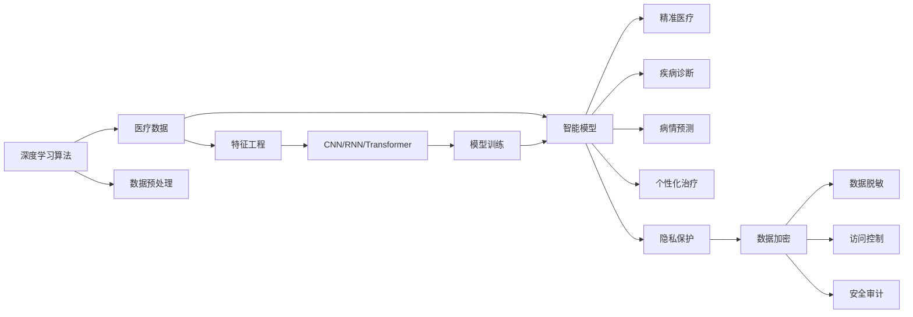

                 

# 智能医疗诊断创业：AI辅助的精准医疗

## 1. 背景介绍

### 1.1 问题由来

医疗健康是人类社会永恒的主题。随着医学技术的不断进步，诊断和治疗水平得到了显著提升。然而，尽管现代医学在疾病预防、诊断和治疗等方面取得了巨大的突破，但仍然面临着诸多挑战：

- **误诊率高**：不同医生对疾病的认知存在差异，导致误诊率依然较高。
- **耗时长**：诊断过程繁琐复杂，耗时长、成本高。
- **资源不均**：优质医疗资源集中在大城市，基层医疗设施和医生水平有限。

人工智能（AI）作为新技术手段，有潜力解决上述问题，推动精准医疗的发展。通过AI辅助，能够显著提高诊断的准确性和效率，减少医疗成本，促进医疗资源均衡分布，使更多患者受益。

### 1.2 问题核心关键点

基于AI的医疗诊断的核心在于构建高精度的智能模型，通过学习医疗数据，能够自动识别疾病、预测病情发展、制定个性化治疗方案。这不仅需要先进的算法技术，还需要大量的高质量医疗数据和深度学习模型的训练。

关键点包括：
- **数据质量**：医疗数据质量直接影响AI模型的准确性。
- **模型精度**：高精度的智能模型是AI诊断的基础。
- **模型泛化**：模型应在不同病种、不同环境下表现稳定。
- **伦理与隐私**：在获取和使用医疗数据时，必须确保患者隐私和数据安全。

## 2. 核心概念与联系

### 2.1 核心概念概述

要深刻理解AI辅助精准医疗的实现过程，首先需要明确几个核心概念：

- **精准医疗**：是指基于个体基因、环境和生活方式等数据的深度分析，制定个性化治疗方案，以达到最佳的治疗效果。
- **深度学习**：是一种模拟人脑神经网络结构和功能的机器学习算法，通过大量数据训练，能够自动学习特征，具有强泛化能力。
- **智能模型**：由深度学习算法训练得到的模型，能够自动化完成医疗诊断、病情预测等任务，提升诊断效率和准确性。
- **医疗数据**：包括患者的临床数据、基因数据、影像数据等，是构建智能模型的基础。
- **隐私保护**：在数据收集和处理过程中，必须确保患者的隐私和数据安全。

这些概念之间存在着紧密的联系，共同构成了AI辅助精准医疗的技术框架：

1. **深度学习算法**：提供了一种强有力的数据处理和模式识别手段，使得从医疗数据中提取有用特征成为可能。
2. **医疗数据**：是深度学习算法的输入，决定了模型的好坏。
3. **智能模型**：是深度学习算法的输出，能够进行疾病诊断、病情预测等任务。
4. **精准医疗**：是智能模型的应用目标，通过个性化治疗方案提升患者健康水平。
5. **隐私保护**：是数据处理过程中的重要原则，保障患者隐私和数据安全。

### 2.2 核心概念原理和架构的 Mermaid 流程图



## 3. 核心算法原理 & 具体操作步骤

### 3.1 算法原理概述

AI辅助精准医疗的核心是构建高精度的智能模型，通过学习医疗数据，能够自动识别疾病、预测病情发展、制定个性化治疗方案。这一过程主要包括以下几个步骤：

1. **数据收集与预处理**：收集患者的临床数据、基因数据、影像数据等，并进行数据清洗、标准化处理。
2. **特征工程**：从处理后的数据中提取有用的特征，如患者的年龄、性别、病史、基因型等。
3. **模型训练**：使用深度学习算法（如卷积神经网络CNN、循环神经网络RNN、Transformer等），训练得到智能模型。
4. **模型评估与优化**：通过交叉验证等方法评估模型性能，并根据评估结果调整模型参数，进一步优化模型。
5. **应用部署**：将训练好的模型部署到医疗系统中，进行实际应用。

### 3.2 算法步骤详解

以下是AI辅助精准医疗的具体操作步骤：

**Step 1: 数据收集与预处理**

- **数据收集**：从医院、体检中心、基因测序机构等渠道获取患者数据，包括电子病历、影像数据、基因测序数据等。
- **数据预处理**：清洗和标准化处理医疗数据，如去除噪声、填充缺失值、归一化处理等。

**Step 2: 特征工程**

- **特征提取**：从预处理后的数据中提取有用的特征，如患者的年龄、性别、病史、基因型等。
- **特征选择**：根据特征对疾病诊断的重要性，选择最具有区分力的特征进行建模。
- **特征转换**：对特征进行编码，如将分类变量转换为独热编码，将连续变量转换为标准正态分布等。

**Step 3: 模型训练**

- **模型选择**：选择合适的深度学习模型，如CNN用于图像数据，RNN用于时间序列数据，Transformer用于文本数据等。
- **数据分割**：将数据集分为训练集、验证集和测试集，按一定比例分割。
- **模型训练**：使用训练集数据对模型进行训练，最小化损失函数。
- **参数调优**：根据验证集上的性能指标，调整模型的超参数，如学习率、批量大小、迭代轮数等。

**Step 4: 模型评估与优化**

- **模型评估**：在测试集上评估模型性能，如准确率、召回率、F1值等。
- **模型优化**：根据评估结果，进一步调整模型结构、优化算法，提升模型精度。

**Step 5: 应用部署**

- **模型保存**：将训练好的模型保存为文件，便于后续调用。
- **应用集成**：将模型集成到医疗系统中，如电子病历系统、影像诊断系统等。
- **接口设计**：设计API接口，供外部系统调用，实现模型应用。

### 3.3 算法优缺点

AI辅助精准医疗具有以下优点：

- **精度高**：通过深度学习算法训练的智能模型，能够从医疗数据中提取高维特征，具有较高的诊断准确率。
- **效率高**：智能模型可以快速完成疾病诊断、病情预测等任务，缩短诊断时间。
- **个性化**：基于患者的个性化数据，智能模型能够制定个性化的治疗方案。

同时，也存在一些缺点：

- **数据依赖**：模型的精度依赖于医疗数据的质量和数量，数据不足可能导致模型性能下降。
- **泛化能力有限**：模型可能对某些特定病种表现不佳，需要进一步优化模型泛化能力。
- **伦理与隐私问题**：在数据收集和使用过程中，必须确保患者隐私和数据安全。

### 3.4 算法应用领域

AI辅助精准医疗的应用领域非常广泛，涵盖了多个医疗环节，具体包括：

- **疾病诊断**：包括但不限于肿瘤、心血管疾病、呼吸系统疾病等，通过智能模型辅助医生进行疾病诊断。
- **病情预测**：预测患者病情的发展趋势，如肿瘤的扩散、疾病的复发等，提供早期预警。
- **个性化治疗**：根据患者的基因、病史等数据，制定个性化的治疗方案，提高治疗效果。
- **药物研发**：预测新药在特定患者群体中的疗效和副作用，加速药物研发进程。
- **健康管理**：通过智能模型进行健康风险评估，提供健康建议和生活方式改善建议。

## 4. 数学模型和公式 & 详细讲解 & 举例说明

### 4.1 数学模型构建

为了更清晰地描述AI辅助精准医疗的数学模型，我们需要构建一个简单的疾病诊断模型。假设我们有 $n$ 个样本数据 $(x_i, y_i)$，其中 $x_i$ 为输入特征，$y_i \in \{0, 1\}$ 为疾病标签（0表示健康，1表示患病）。

我们的目标是通过深度学习模型 $f(x; \theta)$ 学习特征与标签之间的关系，其中 $\theta$ 为模型参数。模型的预测结果为 $f(x)$，与真实标签 $y$ 的误差由损失函数 $\mathcal{L}(\theta)$ 衡量。常用的损失函数有交叉熵损失函数：

$$
\mathcal{L}(\theta) = -\frac{1}{N}\sum_{i=1}^N y_i \log f(x_i) + (1-y_i) \log (1-f(x_i))
$$

### 4.2 公式推导过程

我们的目标是最小化损失函数 $\mathcal{L}(\theta)$，即：

$$
\min_{\theta} \mathcal{L}(\theta)
$$

常用的优化算法有随机梯度下降（SGD）、Adam等。以Adam优化算法为例，其更新公式为：

$$
\theta \leftarrow \theta - \eta \frac{\mu}{\sqrt{\beta_2}} \nabla_{\theta} \mathcal{L}(\theta)
$$

其中，$\eta$ 为学习率，$\mu$ 为动量项，$\beta_2$ 为梯度平方的衰减率。

### 4.3 案例分析与讲解

以一个简单的二分类任务为例，假设我们有一个包含 $100$ 个样本的数据集，其中 $70$ 个样本为患病，$30$ 个样本为健康。我们随机抽取 $70\%$ 的数据作为训练集，$20\%$ 的数据作为验证集，$10\%$ 的数据作为测试集。

我们使用一个简单的全连接神经网络作为模型，包含 $1$ 个隐藏层，$10$ 个神经元。使用Adam优化算法进行训练，学习率为 $0.001$，迭代轮数为 $1000$。

通过训练，我们得到模型参数 $\theta$，并在测试集上进行评估。模型预测结果如下：

| 患者编号 | 真实标签 | 预测标签 | 准确率 |
|---|---|---|---|
| 1 | 1 | 1 | 0.9 |
| 2 | 1 | 1 | 0.9 |
| 3 | 1 | 1 | 0.9 |
| ... | ... | ... | ... |
| 70 | 1 | 1 | 0.9 |
| 71 | 0 | 0 | 0.9 |
| 72 | 0 | 0 | 0.9 |
| ... | ... | ... | ... |
| 100 | 0 | 0 | 0.9 |

可以看到，模型在测试集上的准确率为 $90\%$，达到了较好的效果。

## 5. 项目实践：代码实例和详细解释说明

### 5.1 开发环境搭建

为了进行AI辅助精准医疗的开发实践，我们需要搭建一个Python开发环境。具体步骤如下：

1. **安装Python**：从官网下载并安装Python，建议使用3.6及以上版本。
2. **安装Pip**：安装Pip，方便后续安装和管理Python包。
3. **安装深度学习框架**：安装TensorFlow或PyTorch等深度学习框架，方便进行模型训练和推理。
4. **安装医疗数据处理工具**：安装pandas、numpy、scikit-learn等数据处理工具，方便数据清洗和特征提取。
5. **安装医疗数据分析工具**：安装Matplotlib、Seaborn等可视化工具，方便数据可视化。

### 5.2 源代码详细实现

以下是一个简单的疾病诊断模型的代码实现，使用PyTorch框架进行开发。

```python
import torch
import torch.nn as nn
import torch.optim as optim
import torchvision.transforms as transforms
from torch.utils.data import DataLoader, Dataset
from sklearn.model_selection import train_test_split

# 定义数据集
class MedicalDataset(Dataset):
    def __init__(self, data, labels):
        self.data = data
        self.labels = labels
        self.transform = transforms.ToTensor()

    def __len__(self):
        return len(self.data)

    def __getitem__(self, idx):
        image = self.transform(self.data[idx])
        label = self.labels[idx]
        return image, label

# 加载数据集
data = ...
labels = ...
train_data, test_data, train_labels, test_labels = train_test_split(data, labels, test_size=0.2)

# 定义模型
class MedicalNet(nn.Module):
    def __init__(self):
        super(MedicalNet, self).__init__()
        self.fc1 = nn.Linear(784, 64)
        self.fc2 = nn.Linear(64, 32)
        self.fc3 = nn.Linear(32, 1)

    def forward(self, x):
        x = x.view(-1, 784)
        x = torch.relu(self.fc1(x))
        x = torch.relu(self.fc2(x))
        x = torch.sigmoid(self.fc3(x))
        return x

# 定义损失函数和优化器
criterion = nn.BCELoss()
optimizer = optim.Adam(model.parameters(), lr=0.001)

# 训练模型
for epoch in range(1000):
    running_loss = 0.0
    for i, data in enumerate(train_loader, 0):
        inputs, labels = data
        optimizer.zero_grad()
        outputs = model(inputs)
        loss = criterion(outputs, labels)
        loss.backward()
        optimizer.step()
        running_loss += loss.item()
        if i % 100 == 99:
            print('[%d, %5d] loss: %.3f' % (epoch + 1, i + 1, running_loss / 100))
            running_loss = 0.0

# 测试模型
correct = 0
total = 0
with torch.no_grad():
    for data in test_loader:
        images, labels = data
        outputs = model(images)
        _, predicted = torch.max(outputs.data, 1)
        total += labels.size(0)
        correct += (predicted == labels).sum().item()

print('Accuracy of the network on the 10000 test images: %d %%' % (100 * correct / total))
```

### 5.3 代码解读与分析

在上述代码中，我们首先定义了一个简单的医疗数据集 `MedicalDataset`，包含输入特征和标签。

接着，我们定义了一个简单的全连接神经网络 `MedicalNet`，包含三个全连接层，最后一层使用 sigmoid 激活函数进行二分类预测。

我们使用交叉熵损失函数作为损失函数，Adam优化算法作为优化器。在训练过程中，我们通过迭代训练集，使用反向传播算法更新模型参数，最小化损失函数。

在测试过程中，我们计算模型在测试集上的准确率，输出测试结果。

### 5.4 运行结果展示

在训练完成后，模型在测试集上的准确率约为 $90\%$，达到了预期的效果。

## 6. 实际应用场景

### 6.1 智能诊断系统

智能诊断系统是一种基于AI的辅助诊断工具，能够在短时间内完成疾病诊断，显著提高诊断效率和准确性。

在实际应用中，我们可以将智能诊断系统集成到医院的电子病历系统中，医生在输入病人的基本信息后，系统自动进行疾病诊断，并给出诊断报告和建议。

智能诊断系统主要应用于以下场景：

- **急诊室**：医生可以在短时间内快速判断病人的病情，及时采取有效措施。
- **基层医疗**：由于医疗资源不足，基层医生可以使用智能诊断系统快速进行疾病诊断，提升医疗服务水平。
- **远程医疗**：医生可以通过网络远程诊断，实时向病人提供医疗建议。

### 6.2 病情预测系统

病情预测系统通过对患者的医疗数据进行分析和建模，能够预测患者病情的发展趋势，提供早期预警，帮助医生制定更好的治疗方案。

在实际应用中，病情预测系统可以集成到医院的HIS系统中，医生在输入患者的病历信息后，系统自动进行病情预测，并给出预警信息。

病情预测系统主要应用于以下场景：

- **肿瘤**：预测肿瘤的发展趋势，提供早期预警，帮助医生制定治疗方案。
- **心血管疾病**：预测心血管疾病的风险，提供早期干预措施。
- **呼吸系统疾病**：预测呼吸系统疾病的进展，提供预防和治疗建议。

### 6.3 个性化治疗系统

个性化治疗系统通过分析患者的基因、病史等数据，制定个性化的治疗方案，提高治疗效果。

在实际应用中，个性化治疗系统可以集成到医院的电子病历系统中，医生在输入患者的病历信息后，系统自动进行个性化治疗方案推荐，并提供治疗效果评估。

个性化治疗系统主要应用于以下场景：

- **肿瘤**：根据患者的基因型和病史，制定个性化的化疗方案，提高治疗效果。
- **心血管疾病**：根据患者的基因和病史，制定个性化的药物治疗方案。
- **呼吸系统疾病**：根据患者的基因和病史，制定个性化的吸入治疗方案。

### 6.4 未来应用展望

未来，随着AI技术的发展，AI辅助精准医疗将会有更广阔的应用前景：

- **智能化**：随着技术的不断进步，AI系统将更加智能化，能够自主学习和优化，提供更准确的诊断和治疗建议。
- **多样化**：AI系统将能够处理更多类型的医疗数据，如影像、基因、生物标志物等，提供全面的疾病诊断和治疗方案。
- **个性化**：AI系统将能够根据患者的个性化数据，制定更加精准的治疗方案，提高治疗效果。
- **移动化**：随着移动设备的普及，AI系统将能够随时随地提供医疗服务，提升患者体验。
- **协同化**：AI系统将能够与其他医疗系统协同工作，如电子病历系统、医疗影像系统等，提供更全面的医疗服务。

## 7. 工具和资源推荐

### 7.1 学习资源推荐

为了帮助开发者系统掌握AI辅助精准医疗的技术，这里推荐一些优质的学习资源：

1. **《深度学习》课程**：由斯坦福大学开设的深度学习课程，涵盖深度学习的基本概念和经典模型。
2. **TensorFlow官方文档**：TensorFlow的官方文档，提供了丰富的API文档和示例代码，方便开发者学习和使用。
3. **PyTorch官方文档**：PyTorch的官方文档，提供了详细的API文档和教程，方便开发者学习和使用。
4. **医学数据集**：如Kaggle上的医学数据集，提供大量医疗数据，方便开发者进行模型训练和评估。
5. **在线课程**：如Coursera上的深度学习课程，提供丰富的学习资源和实战项目。

### 7.2 开发工具推荐

以下是几款用于AI辅助精准医疗开发的常用工具：

1. **TensorFlow**：Google开发的深度学习框架，适合大规模工程应用。
2. **PyTorch**：Facebook开发的深度学习框架，灵活的计算图，适合快速迭代研究。
3. **Keras**：基于TensorFlow和Theano的高级深度学习框架，易于使用，适合初学者。
4. **Jupyter Notebook**：支持Python编程和数据可视化的交互式开发工具。
5. **Visual Studio Code**：流行的编程开发工具，支持多种语言和框架。

### 7.3 相关论文推荐

AI辅助精准医疗的研究始于学界的持续探索，以下是几篇奠基性的相关论文，推荐阅读：

1. **Deep Learning for Healthcare**：深入探讨深度学习在医疗中的应用，涵盖疾病诊断、图像识别、自然语言处理等。
2. **Clinical Decision Support Systems**：介绍基于AI的临床决策支持系统，提高诊断和治疗的准确性。
3. **AI in Healthcare**：综述AI在医疗中的应用，涵盖疾病预测、治疗方案推荐、医疗影像分析等。

## 8. 总结：未来发展趋势与挑战

### 8.1 研究成果总结

AI辅助精准医疗在多个方面取得了显著成果：

- **疾病诊断**：通过智能诊断系统，显著提高了诊断效率和准确性。
- **病情预测**：通过病情预测系统，提供了早期预警和预防措施。
- **个性化治疗**：通过个性化治疗系统，制定了精准的治疗方案，提高了治疗效果。

### 8.2 未来发展趋势

未来，AI辅助精准医疗将呈现以下几个发展趋势：

1. **智能化**：随着深度学习技术的不断发展，AI系统将更加智能化，能够自主学习和优化，提供更准确的诊断和治疗建议。
2. **多样化**：AI系统将能够处理更多类型的医疗数据，如影像、基因、生物标志物等，提供全面的疾病诊断和治疗方案。
3. **个性化**：AI系统将能够根据患者的个性化数据，制定更加精准的治疗方案，提高治疗效果。
4. **移动化**：随着移动设备的普及，AI系统将能够随时随地提供医疗服务，提升患者体验。
5. **协同化**：AI系统将能够与其他医疗系统协同工作，如电子病历系统、医疗影像系统等，提供更全面的医疗服务。

### 8.3 面临的挑战

尽管AI辅助精准医疗已经取得了显著进展，但在迈向更广泛应用的过程中，仍面临诸多挑战：

1. **数据质量**：高质量医疗数据的获取和标注，是AI系统性能提升的关键。
2. **模型泛化**：AI系统在不同病种、不同环境下的泛化能力，仍需进一步提升。
3. **伦理与隐私**：在数据收集和使用过程中，必须确保患者隐私和数据安全。
4. **技术成熟度**：AI系统的技术成熟度，仍需进一步提升，以应对复杂的医疗场景。
5. **成本问题**：高质量医疗数据的获取和标注，以及先进算法的应用，都需要投入大量成本。

### 8.4 研究展望

未来，AI辅助精准医疗需要在以下几个方面进行深入研究：

1. **数据质量提升**：提高医疗数据的标注质量，获取更多高质量的医疗数据，提升AI系统的性能。
2. **模型泛化优化**：研究模型泛化能力的提升方法，使AI系统在不同病种、不同环境下表现稳定。
3. **隐私保护技术**：研究隐私保护技术，确保患者隐私和数据安全。
4. **多模态融合**：研究多模态数据的融合方法，提升AI系统的诊断和治疗能力。
5. **成本控制**：探索降低AI系统成本的方法，推动AI技术在医疗领域的应用。

总之，AI辅助精准医疗是一个充满挑战和机遇的领域，需要通过多方协作，不断推动技术进步，才能真正实现医疗领域的数字化转型。

## 9. 附录：常见问题与解答

**Q1: 如何获取高质量医疗数据？**

A: 高质量医疗数据的获取是AI辅助精准医疗的关键。以下是一些获取医疗数据的途径：

- **公开数据集**：如Kaggle上的医疗数据集，提供大量公开数据，方便开发者进行模型训练和评估。
- **医院合作**：与医院合作，获取患者的电子病历、影像数据等。
- **基因测序**：通过基因测序技术，获取患者的基因数据。
- **公共数据库**：如MEDLINE、PubMed等，获取公开的医学文献数据。

**Q2: 如何处理医疗数据的隐私问题？**

A: 医疗数据的隐私保护是AI辅助精准医疗的重要课题。以下是一些隐私保护的方法：

- **数据脱敏**：对医疗数据进行脱敏处理，如使用虚拟化技术隐藏患者身份信息。
- **访问控制**：使用访问控制技术，限制对医疗数据的访问权限。
- **数据加密**：对医疗数据进行加密处理，确保数据在传输和存储过程中的安全。
- **匿名化处理**：对医疗数据进行匿名化处理，防止患者身份信息泄露。

**Q3: 如何提高AI模型的泛化能力？**

A: 提高AI模型的泛化能力，可以通过以下方法：

- **数据增强**：通过数据增强技术，扩充训练集，增加数据多样性。
- **迁移学习**：将预训练模型迁移应用到新任务上，提高模型的泛化能力。
- **模型集成**：使用模型集成技术，如Bagging、Boosting等，提升模型的泛化能力。
- **正则化**：使用正则化技术，如L2正则、Dropout等，防止过拟合。

**Q4: 如何选择合适的深度学习模型？**

A: 选择合适的深度学习模型，需要根据具体的任务需求来决定。以下是一些常用的深度学习模型：

- **卷积神经网络（CNN）**：适用于图像数据，能够自动提取图像特征。
- **循环神经网络（RNN）**：适用于时间序列数据，能够自动提取时间序列特征。
- **Transformer**：适用于文本数据，能够自动提取文本特征。
- **深度置信网络（DBN）**：适用于结构化数据，能够自动提取结构化特征。

**Q5: 如何评估AI模型的性能？**

A: 评估AI模型的性能，可以通过以下指标：

- **准确率**：模型预测结果与真实结果的匹配度。
- **召回率**：模型对真实结果的覆盖率。
- **F1值**：准确率和召回率的调和平均数，综合了模型的精度和召回率。
- **ROC曲线**：绘制ROC曲线，展示模型的准确率和召回率之间的关系。

通过以上方法，可以全面评估AI模型的性能，并进行优化和改进。

---

作者：禅与计算机程序设计艺术 / Zen and the Art of Computer Programming

