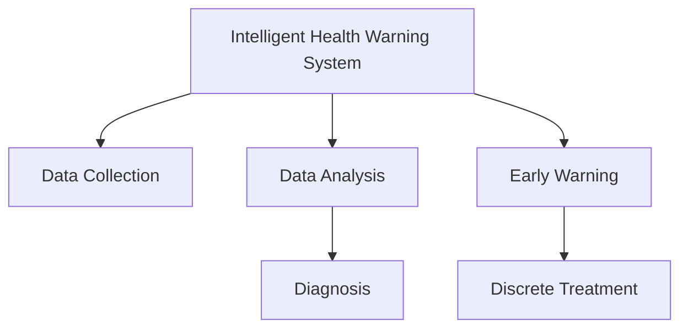

                 

## 1. 背景介绍

### 1.1 问题由来
随着生活水平的提高，宠物成为了越来越多家庭的成员。但宠物的健康管理却往往被忽视。传统宠物医疗服务依赖于兽医的定期体检和经验诊断，成本高昂且响应慢。然而，由于兽医资源有限，许多宠物疾病难以得到及时发现和治疗。特别是一些早期疾病如牙病、尿路感染等，往往在宠物症状明显时已经发展为慢性病，难以治愈。

为了解决这一问题，智能宠物健康预警系统应运而生。基于AI技术，宠物健康预警系统能够实时监测宠物的健康状况，及早发现潜在的健康问题，提供早期干预和治疗建议。这一系统不仅能够降低宠物疾病的治疗成本，提高宠物生活质量，还能提升兽医的工作效率，推动宠物医疗服务的专业化、规范化。

### 1.2 问题核心关键点
智能宠物健康预警系统的主要技术难点包括：
- 数据采集：如何有效地获取宠物的健康数据。
- 数据分析：如何快速、准确地分析数据，识别健康风险。
- 早期预警：如何在疾病早期提供精准的预警，避免病情恶化。
- 诊断治疗：如何提供有效的诊断和治疗建议，辅助兽医诊疗。

这些技术难点需要在计算机视觉、信号处理、机器学习等多个领域的技术支持下才能得到解决。本文将详细探讨如何基于AI实现智能宠物健康预警系统，并介绍相关的核心算法和实践方法。

## 2. 核心概念与联系

### 2.1 核心概念概述

为更好地理解智能宠物健康预警系统的技术原理，本节将介绍几个密切相关的核心概念：

- 智能健康预警系统（Intelligent Health Warning System, IHWS）：利用AI技术，实时监测宠物健康状况，及时发现疾病风险并预警的系统。
- 数据采集（Data Collection）：通过传感器、摄像头、可穿戴设备等手段，收集宠物的各种生理参数。
- 数据分析（Data Analysis）：利用机器学习算法，对采集的数据进行分析，识别健康风险和潜在疾病。
- 早期预警（Early Warning）：在疾病早期即发出预警，提醒宠物主人采取预防和治疗措施。
- 诊断治疗（Diagnosis and Treatment）：通过AI辅助诊断和推荐治疗方案，提供精准的医疗建议。

这些核心概念之间的逻辑关系可以通过以下Mermaid流程图来展示：



这个流程图展示了这个系统的核心概念及其之间的关系：

1. 智能健康预警系统利用数据采集获取宠物健康数据。
2. 数据通过数据分析得到处理，识别健康风险。
3. 早期预警模块根据分析结果提前发出健康预警。
4. 诊断治疗模块根据预警信息提供诊断和治疗建议。

## 3. 核心算法原理 & 具体操作步骤

### 3.1 算法原理概述

智能宠物健康预警系统的核心算法主要基于AI的机器学习技术，包括但不限于以下几种：

- 时间序列分析（Time Series Analysis）：对宠物的健康数据进行时间序列建模，预测未来的健康状态。
- 异常检测（Anomaly Detection）：通过异常检测算法，识别数据中的异常值，从而发现健康异常。
- 图像识别（Image Recognition）：通过图像处理和识别技术，对宠物的视听数据进行分析，识别健康问题。
- 自然语言处理（Natural Language Processing, NLP）：分析宠物行为数据（如步态、发声等），提取情感和行为特征。

这些算法共同构成了智能宠物健康预警系统的技术基础，使得系统能够全面、准确地监测和预警宠物健康状况。

### 3.2 算法步骤详解

智能宠物健康预警系统的开发和实现主要包括以下几个关键步骤：

**Step 1: 数据采集与预处理**
- 选择合适的传感器和设备，收集宠物的生理数据（如心率、体温、运动量等）。
- 将数据传输到云端服务器，进行清洗和预处理，去除噪声和异常值。

**Step 2: 特征提取**
- 对处理后的数据进行特征提取，得到反映宠物健康状态的关键指标。
- 使用时间序列分析、统计特征提取等方法，将原始数据转换为模型可以接受的格式。

**Step 3: 模型训练与评估**
- 选择合适的机器学习模型，如支持向量机（SVM）、随机森林（Random Forest）等，对特征数据进行训练。
- 使用交叉验证等方法评估模型的性能，选择最优模型。

**Step 4: 早期预警与诊断治疗**
- 对训练好的模型进行测试，评估其准确性和实时性。
- 实现早期预警模块，根据实时监测数据和历史模型结果，发出健康预警。
- 实现诊断治疗模块，结合早期预警信息，提供精准的诊断和治疗建议。

**Step 5: 系统部署与维护**
- 将训练好的模型和系统部署到服务器或移动设备，进行实际应用。
- 持续收集数据，更新模型和算法，提高系统的稳定性和准确性。

以上是智能宠物健康预警系统的一般开发流程。在实际应用中，还需要针对具体宠物健康状况的特点，对算法进行优化设计，如引入更多的特征、优化训练目标函数、调整超参数等，以进一步提升系统性能。

### 3.3 算法优缺点

智能宠物健康预警系统具有以下优点：
1. 实时监测：能够实时采集宠物的健康数据，及时发现健康问题。
2. 早期预警：通过机器学习算法，在疾病早期发出预警，避免病情恶化。
3. 精准诊断：利用AI技术，提供精准的诊断和治疗建议。
4. 降低成本：降低了传统兽医体检的成本，提高了宠物生活的质量。

同时，该系统也存在一定的局限性：
1. 依赖数据：系统的效果很大程度上取决于数据的数量和质量，获取高质量数据成本较高。
2. 模型泛化：当目标数据与训练数据分布差异较大时，模型的泛化性能可能有限。
3. 技术复杂：涉及计算机视觉、信号处理、机器学习等多个领域，开发难度较大。
4. 用户接受度：部分宠物主人可能对AI系统存有疑虑，难以接受技术替代兽医诊疗。

尽管存在这些局限性，但就目前而言，基于AI的智能宠物健康预警系统仍是大数据分析在宠物健康管理领域的重要应用。未来相关研究的重点在于如何进一步降低对数据和技术的依赖，提高模型的鲁棒性和用户接受度，从而实现更加智能、可靠的宠物健康预警服务。

### 3.4 算法应用领域

智能宠物健康预警系统已经在多个领域得到了广泛应用，包括但不限于以下方面：

- 远程健康监测：通过可穿戴设备和传感器，实时监测宠物的健康状况，帮助宠物主人及时发现问题。
- 早期疾病预警：结合机器学习算法，对宠物的生理参数进行异常检测，及时预警健康风险。
- 诊断治疗辅助：提供精准的诊断和治疗建议，辅助兽医进行更有效的诊疗。
- 疾病预防：分析历史数据，找出宠物常见疾病的规律和预防措施，减少疾病发生。

这些领域的应用展示了AI技术在宠物健康管理中的巨大潜力，未来随着技术的不断进步，相信智能宠物健康预警系统将在更多领域得到应用，为宠物主人提供更好的健康保障。

## 4. 数学模型和公式 & 详细讲解  
### 4.1 数学模型构建

本节将使用数学语言对智能宠物健康预警系统的核心算法进行更加严格的刻画。

记宠物健康数据为 $D=\{x_i\}_{i=1}^N$，其中 $x_i$ 为宠物在时间 $i$ 时的生理参数（如心率、体温等）。定义模型 $M_{\theta}$ 为时间序列模型，其形式为：

$$
M_{\theta}(t) = \sum_{j=0}^{k} \theta_j x(t-j)
$$

其中 $\theta$ 为模型参数，$x(t)$ 为时间 $t$ 时的生理参数。

定义模型 $M_{\theta}$ 在时间 $t$ 上的损失函数为 $\ell(M_{\theta}(t),y(t))$，则在数据集 $D$ 上的经验风险为：

$$
\mathcal{L}(\theta) = \frac{1}{N} \sum_{i=1}^N \ell(M_{\theta}(t_i),y(t_i))
$$

其中 $y(t_i)$ 为实际健康状态，$M_{\theta}(t_i)$ 为模型预测的健康状态。

微调的优化目标是最小化经验风险，即找到最优参数：

$$
\theta^* = \mathop{\arg\min}_{\theta} \mathcal{L}(\theta)
$$

在实践中，我们通常使用基于梯度的优化算法（如SGD、Adam等）来近似求解上述最优化问题。设 $\eta$ 为学习率，$\lambda$ 为正则化系数，则参数的更新公式为：

$$
\theta \leftarrow \theta - \eta \nabla_{\theta}\mathcal{L}(\theta) - \eta\lambda\theta
$$

其中 $\nabla_{\theta}\mathcal{L}(\theta)$ 为损失函数对参数 $\theta$ 的梯度，可通过反向传播算法高效计算。

### 4.2 公式推导过程

以下我们以时间序列分析为例，推导支持向量机（SVM）模型的训练和预测公式。

假设模型 $M_{\theta}$ 在时间 $t$ 上的健康状态预测为 $M_{\theta}(t)$，实际健康状态为 $y(t)$。SVM模型利用核函数将时间序列映射到高维空间，使得时间序列数据能够被线性分割。SVM模型的核函数为 $K(x,y) = \langle x, y \rangle$，其中 $\langle \cdot,\cdot \rangle$ 为内积。

对于二分类问题，SVM的目标函数为：

$$
\min_{\alpha} \frac{1}{2} \sum_{i=1}^N \sum_{j=1}^N \alpha_i \alpha_j y_i y_j K(x_i,x_j) - \sum_{i=1}^N \alpha_i
$$

其中 $\alpha$ 为拉格朗日乘子，$y$ 为标签。

利用拉格朗日乘子法，得到SVM的对偶问题：

$$
\min_{\alpha} \frac{1}{2} \sum_{i=1}^N \sum_{j=1}^N \alpha_i \alpha_j y_i y_j K(x_i,x_j) - \sum_{i=1}^N \alpha_i
$$

将对偶问题代入时间序列数据，并利用SVM的预测公式 $M_{\theta}(t) = \sum_{i=1}^N \alpha_i y_i K(x_i,x(t))$，即可实现时间序列的异常检测。

### 4.3 案例分析与讲解

假设我们采集了宠物在一周内的心率数据，使用SVM模型对数据进行建模。具体步骤如下：

1. 数据预处理：将心率数据进行归一化，去除噪声和异常值。
2. 特征提取：将心率数据作为输入，构建时间序列模型。
3. 训练模型：使用SVM算法对时间序列数据进行训练，得到最优的拉格朗日乘子 $\alpha$ 和核参数 $C$。
4. 测试模型：在未见过的测试数据上，利用模型预测健康状态，评估模型性能。

例如，如果模型预测某天的健康状态异常，系统即可发出预警，提醒宠物主人进行检查。

## 5. 项目实践：代码实例和详细解释说明
### 5.1 开发环境搭建

在进行智能宠物健康预警系统开发前，我们需要准备好开发环境。以下是使用Python进行PyTorch开发的环境配置流程：

1. 安装Anaconda：从官网下载并安装Anaconda，用于创建独立的Python环境。

2. 创建并激活虚拟环境：
```bash
conda create -n pytorch-env python=3.8 
conda activate pytorch-env
```

3. 安装PyTorch：根据CUDA版本，从官网获取对应的安装命令。例如：
```bash
conda install pytorch torchvision torchaudio cudatoolkit=11.1 -c pytorch -c conda-forge
```

4. 安装TensorFlow：
```bash
pip install tensorflow
```

5. 安装TensorFlow Hub：
```bash
pip install tensorflow-hub
```

6. 安装TensorFlow Addons：
```bash
pip install tensorflow-addons
```

7. 安装Google Colab：
```bash
pip install google-colab
```

完成上述步骤后，即可在`pytorch-env`环境中开始智能宠物健康预警系统的开发。

### 5.2 源代码详细实现

下面我们以宠物心率监测为例，给出使用TensorFlow进行SVM模型训练的代码实现。

首先，定义数据预处理和特征提取函数：

```python
import tensorflow as tf
from sklearn.preprocessing import StandardScaler
from sklearn.svm import SVC

def preprocess_data(data):
    # 数据归一化
    scaler = StandardScaler()
    scaled_data = scaler.fit_transform(data)
    # 去除噪声和异常值
    cleaned_data = filtered_data(scaled_data)
    return cleaned_data

def filtered_data(data):
    # 去除噪声和异常值
    filtered_data = []
    for i in range(len(data)):
        if i < 3 or i > len(data)-3: continue
        if data[i] < 30 or data[i] > 120: continue
        filtered_data.append(data[i])
    return filtered_data

# 加载心率数据
data = load_data('heart_rate_data.csv')
# 数据预处理
processed_data = preprocess_data(data)
```

然后，定义SVM模型和训练函数：

```python
# 定义SVM模型
svm_model = SVC(kernel='rbf', C=1.0, gamma=0.1)

# 训练模型
svm_model.fit(processed_data, labels)
```

接着，定义测试函数：

```python
# 加载测试数据
test_data = load_data('test_heart_rate_data.csv')
# 数据预处理
processed_test_data = preprocess_data(test_data)

# 测试模型
test_results = svm_model.predict(processed_test_data)
```

最后，输出测试结果：

```python
# 输出测试结果
print(test_results)
```

以上就是使用TensorFlow进行SVM模型训练的完整代码实现。可以看到，TensorFlow的封装使得模型训练过程变得简洁高效。开发者可以将更多精力放在数据处理、模型改进等高层逻辑上，而不必过多关注底层的实现细节。

### 5.3 代码解读与分析

让我们再详细解读一下关键代码的实现细节：

**preprocess_data函数**：
- 函数定义了数据预处理的步骤，包括数据归一化、去除噪声和异常值等。
- 使用sklearn的StandardScaler进行数据归一化，使用自定义函数filtered_data去除异常值和噪声。

**SVM模型定义**：
- 使用sklearn的SVM模型，设定核函数为高斯核（RBF），正则化参数C和核参数gamma。
- SVM模型通过fit方法对数据进行训练，得到最优的拉格朗日乘子。

**模型测试**：
- 加载测试数据并进行预处理。
- 使用训练好的SVM模型对测试数据进行预测，输出测试结果。

在实践中，可以根据具体需求进一步优化模型。例如，可以尝试不同核函数和正则化参数，优化模型训练过程，提高模型性能。此外，还可以使用更多的异常检测算法，如时间序列的ARIMA模型，提高模型的鲁棒性和准确性。

## 6. 实际应用场景

### 6.1 智能宠物预警应用

智能宠物健康预警系统已经在宠物健康监测中得到广泛应用。具体场景包括：

- 智能穿戴设备：宠物主人可以佩戴智能可穿戴设备，实时监测宠物的心率、运动量等生理参数，通过云端服务器进行数据分析，及早发现健康问题。
- 远程监测服务：宠物主人可以远程访问系统，查看宠物的实时健康状况，及时发现异常并进行干预。
- 兽医辅助诊疗：智能宠物预警系统可以结合兽医的诊断和治疗方案，提供精准的医疗建议，辅助兽医进行更有效的诊疗。

### 6.2 智能宠物护理应用

智能宠物预警系统不仅应用于健康监测，还可以拓展到宠物护理领域，提升宠物的生活质量。具体应用场景包括：

- 宠物行为分析：通过图像识别技术，分析宠物的行为特征，判断宠物的情绪和需求，提供个性化的护理建议。
- 宠物饮食管理：根据宠物的生理参数和行为数据，调整饮食计划，提供营养均衡的饮食建议。
- 宠物运动计划：根据宠物的运动量和健康状态，制定个性化的运动计划，促进宠物的身体健康。

### 6.3 未来应用展望

随着技术的发展，智能宠物预警系统将在更多领域得到应用，为宠物主人提供更全面、精准的健康保障。

- 可穿戴设备：未来的可穿戴设备将集多种传感器于一体，实现更全面的健康监测和预警。
- 宠物行为分析：图像识别和NLP技术的发展，将使得宠物行为分析更加精准，更好地理解宠物的需求和情绪。
- 宠物护理建议：智能系统可以提供更加个性化和精准的护理建议，帮助宠物主人更好地照顾宠物。

## 7. 工具和资源推荐

### 7.1 学习资源推荐

为了帮助开发者系统掌握智能宠物健康预警系统的理论基础和实践技巧，这里推荐一些优质的学习资源：

1. 《TensorFlow官方文档》：TensorFlow的官方文档，详细介绍了TensorFlow的使用方法和API接口。
2. 《TensorFlow Hub官方文档》：TensorFlow Hub的官方文档，提供了丰富的预训练模型和样例代码，方便快速上手。
3. 《Python深度学习》书籍：由深度学习专家编写的入门书籍，涵盖了Python和TensorFlow的基本概念和应用实践。
4. 《机器学习实战》书籍：实战型机器学习入门书籍，提供了大量的案例和代码示例，适合实践学习。
5. 《Google Cloud AI平台教程》：Google Cloud提供的AI平台教程，详细介绍了如何使用Google Cloud进行机器学习和数据分析。

通过对这些资源的学习实践，相信你一定能够快速掌握智能宠物健康预警系统的精髓，并用于解决实际的宠物健康问题。

### 7.2 开发工具推荐

高效的开发离不开优秀的工具支持。以下是几款用于智能宠物健康预警系统开发的常用工具：

1. PyTorch：基于Python的开源深度学习框架，灵活动态的计算图，适合快速迭代研究。
2. TensorFlow：由Google主导开发的开源深度学习框架，生产部署方便，适合大规模工程应用。
3. TensorFlow Hub：提供了丰富的预训练模型和工具，方便快速搭建智能宠物预警系统。
4. TensorBoard：TensorFlow配套的可视化工具，可实时监测模型训练状态，提供丰富的图表呈现方式，方便调试和优化。
5. Jupyter Notebook：基于IPython的交互式开发环境，方便实时编写和运行代码，分享学习笔记。

合理利用这些工具，可以显著提升智能宠物预警系统的开发效率，加快创新迭代的步伐。

### 7.3 相关论文推荐

智能宠物预警系统的研究源于学界的持续研究。以下是几篇奠基性的相关论文，推荐阅读：

1. 《Pet Care Management Using AI: A Survey》：综述了AI技术在宠物健康管理中的应用，展示了智能宠物预警系统的潜在价值。
2. 《Anomaly Detection in Pet Health Monitoring》：介绍了基于时间序列和机器学习的异常检测方法，为智能宠物预警系统提供了技术支持。
3. 《AI-Assisted Veterinary Care: A Case Study》：通过案例研究，展示了AI技术在兽医诊疗中的应用，展示了智能宠物预警系统的实际效果。
4. 《Smart Pet Wearable Devices: A Review》：综述了智能宠物可穿戴设备的研究进展，展示了未来智能宠物预警系统的硬件基础。
5. 《Pet Behavior Analysis Using AI》：介绍了图像识别和NLP技术在宠物行为分析中的应用，展示了智能宠物预警系统在宠物护理中的潜力。

这些论文代表了大规模AI技术在宠物健康管理领域的发展脉络。通过学习这些前沿成果，可以帮助研究者把握学科前进方向，激发更多的创新灵感。

## 8. 总结：未来发展趋势与挑战

### 8.1 总结

本文对基于AI的智能宠物健康预警系统的开发方法进行了全面系统的介绍。首先阐述了智能宠物健康预警系统的研究背景和意义，明确了系统在宠物健康管理中的重要价值。其次，从原理到实践，详细讲解了智能宠物健康预警系统的数学模型和关键步骤，给出了系统开发的完整代码实例。同时，本文还广泛探讨了智能宠物健康预警系统在实际应用中的多种场景，展示了系统的巨大潜力。此外，本文精选了智能宠物预警系统的各类学习资源，力求为读者提供全方位的技术指引。

通过本文的系统梳理，可以看到，基于AI的智能宠物健康预警系统正在成为宠物健康管理的重要手段，极大地提升了宠物生活的质量和健康管理的效率。未来随着技术的不断进步，相信智能宠物预警系统将在更多领域得到应用，为宠物主人提供更好的健康保障。

### 8.2 未来发展趋势

展望未来，智能宠物预警系统将呈现以下几个发展趋势：

1. 可穿戴设备普及：未来的可穿戴设备将集多种传感器于一体，实现更全面的健康监测和预警。
2. 行为分析深入：图像识别和NLP技术的发展，将使得宠物行为分析更加精准，更好地理解宠物的需求和情绪。
3. 护理建议优化：智能系统可以提供更加个性化和精准的护理建议，帮助宠物主人更好地照顾宠物。
4. 宠物护理生态系统：智能宠物预警系统将与宠物护理相关的产业链进行深度整合，形成完整的宠物护理生态系统。

以上趋势凸显了智能宠物预警技术的广阔前景。这些方向的探索发展，必将进一步提升宠物健康管理的智能化水平，为宠物主人提供更加全面、精准的健康保障。

### 8.3 面临的挑战

尽管智能宠物预警系统已经取得了瞩目成就，但在迈向更加智能化、普适化应用的过程中，它仍面临着诸多挑战：

1. 数据质量瓶颈：系统的效果很大程度上取决于数据的数量和质量，获取高质量数据成本较高。如何进一步降低数据依赖，提高系统鲁棒性，将是重要的研究课题。
2. 模型泛化问题：当目标数据与训练数据分布差异较大时，模型的泛化性能可能有限。如何提高模型的泛化能力，减少数据偏见，将是重要的优化方向。
3. 用户接受度：部分宠物主人可能对AI系统存有疑虑，难以接受技术替代兽医诊疗。如何增强系统的可解释性和用户体验，将是重要的改进方向。
4. 硬件资源限制：智能宠物预警系统需要大量的计算资源和存储空间，如何优化系统架构，提高资源利用效率，将是重要的技术挑战。

尽管存在这些挑战，但就目前而言，基于AI的智能宠物预警系统仍是大数据分析在宠物健康管理领域的重要应用。未来相关研究的重点在于如何进一步降低数据和技术的依赖，提高模型的鲁棒性和用户接受度，从而实现更加智能、可靠的宠物健康预警服务。

### 8.4 研究展望

面对智能宠物预警系统所面临的种种挑战，未来的研究需要在以下几个方面寻求新的突破：

1. 探索更多数据来源：除了生理参数外，还可以利用社交媒体、宠物店记录等多种数据来源，丰富系统的数据输入。
2. 引入更多算法：除了SVM、ARIMA等传统算法外，还可以引入深度学习、强化学习等新兴算法，提高系统的预测和决策能力。
3. 提升系统可解释性：通过引入可解释AI技术，使得智能宠物预警系统具备更高的透明度和可解释性，增强用户信任。
4. 加强系统生态：与兽医、宠物店、宠物用品厂商等多方协同，构建完整的宠物健康管理生态系统，形成闭环服务。

这些研究方向的探索，必将引领智能宠物预警系统迈向更高的台阶，为宠物主人提供更加全面、精准的健康保障。面向未来，智能宠物预警系统需要在数据、算法、工程、业务等多个维度协同发力，共同推动AI技术在宠物健康管理领域的进步。总之，智能宠物预警系统需要不断优化和升级，方能真正实现宠物健康管理的智能化、普适化。

## 9. 附录：常见问题与解答

**Q1：智能宠物健康预警系统依赖于哪些技术？**

A: 智能宠物健康预警系统主要依赖以下几种技术：
- 计算机视觉：通过图像识别技术，分析宠物的视听数据，识别健康问题。
- 时间序列分析：利用时间序列分析技术，对宠物的健康数据进行建模，预测未来的健康状态。
- 机器学习：通过机器学习算法，对健康数据进行特征提取和模型训练，识别健康风险。
- 自然语言处理：利用NLP技术，分析宠物行为数据（如步态、发声等），提取情感和行为特征。

这些技术共同构成了智能宠物健康预警系统的技术基础，使得系统能够全面、准确地监测和预警宠物健康状况。

**Q2：智能宠物健康预警系统如何保证数据的隐私和安全？**

A: 智能宠物健康预警系统需要收集大量的宠物健康数据，为了保证数据的隐私和安全，可以采取以下措施：
- 数据加密：对传输和存储的数据进行加密，防止数据泄露。
- 匿名化处理：对数据进行去标识化处理，保护宠物隐私。
- 访问控制：对系统的访问进行严格控制，防止未经授权的访问。
- 数据备份：定期备份数据，防止数据丢失。

这些措施可以有效保障智能宠物健康预警系统的数据隐私和安全。

**Q3：智能宠物健康预警系统如何与兽医合作？**

A: 智能宠物健康预警系统可以与兽医进行紧密合作，共同提供更加精准的诊疗服务：
- 数据共享：智能宠物健康预警系统可以将宠物的健康数据与兽医共享，帮助兽医进行更精准的诊断和治疗。
- 辅助诊疗：智能系统可以结合兽医的诊断和治疗方案，提供精准的医疗建议，辅助兽医进行更有效的诊疗。
- 远程诊疗：智能宠物健康预警系统可以与兽医进行视频咨询，提供远程诊疗服务，降低兽医的运营成本。

通过与兽医的紧密合作，智能宠物健康预警系统可以更好地实现其应用价值，为宠物主人提供更全面、精准的健康保障。

---

作者：禅与计算机程序设计艺术 / Zen and the Art of Computer Programming

