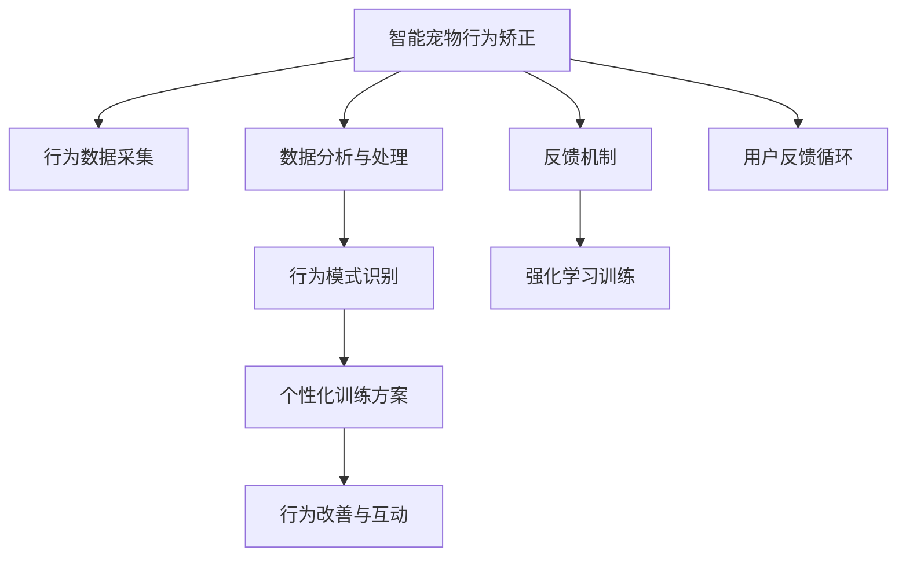

                 

## 1. 背景介绍

在数字化时代，人们对于家庭宠物的需求不再局限于陪伴与娱乐，还希望通过科技手段提升宠物的生活质量与行为矫正。智能化宠物训练设备作为一种新兴的科技产品，其市场需求在不断增长。借助人工智能和大数据技术，能够实现对宠物行为模式的精准分析与个性化训练，不仅可以减少不当行为发生，还能增强宠物与主人之间的情感连接。本文将介绍一种基于智能宠物行为矫正创业的个性化宠物训练方案，旨在帮助创业者和开发者系统地理解该方案的原理与实施步骤，并探索其潜在的市场前景与应用价值。

## 2. 核心概念与联系

### 2.1 核心概念概述

在介绍该方案的核心概念前，我们先审视一下相关领域的关键概念：

- **智能宠物行为矫正**：通过可穿戴设备或智能摄像头等技术手段，收集宠物的行为数据，并利用人工智能算法进行分析，以识别不当行为，并提供个性化矫正方案。
- **个性化宠物训练**：针对不同宠物的特点，设计定制化的训练计划与行为干预措施，以提高训练效果。
- **数据驱动**：通过大数据技术，从历史训练数据中提取有价值的信息，以指导未来的训练决策。
- **强化学习**：利用奖惩机制，持续训练宠物，使其逐步学习到正确的行为模式。
- **深度学习**：运用神经网络模型，对行为数据进行复杂的模式识别与预测，提升训练精度。

### 2.2 核心概念原理和架构的 Mermaid 流程图



该图展示了智能宠物行为矫正系统的核心架构，其中行为数据采集、数据分析与处理、行为模式识别、个性化训练方案生成、强化学习训练与行为改善与互动，以及用户反馈循环构成了一个闭环，共同作用于宠物的行为矫正与训练效果提升。

## 3. 核心算法原理 & 具体操作步骤

### 3.1 算法原理概述

该方案的核心算法包括数据驱动的个性化训练与强化学习训练两部分。

- **数据驱动的个性化训练**：通过对历史训练数据进行分析，提取不同宠物的行为特征，设计出个性化的训练方案。
- **强化学习训练**：在训练过程中，通过奖惩机制，引导宠物逐步学习正确的行为模式。

### 3.2 算法步骤详解

#### 3.2.1 数据驱动的个性化训练

1. **数据采集与预处理**：
   - 通过智能设备（如可穿戴设备、智能摄像头）收集宠物的行为数据，包括运动轨迹、姿势、发声等。
   - 对采集到的数据进行预处理，去除噪声和异常值，并对数据进行归一化处理。

2. **特征提取与分析**：
   - 使用深度学习模型（如卷积神经网络CNN）提取行为数据中的关键特征。
   - 通过聚类算法（如K-means）对特征进行分类，找到不同行为模式之间的共性与差异。

3. **模型训练与方案设计**：
   - 使用机器学习模型（如支持向量机SVM）对不同行为模式进行分类，设计个性化训练方案。
   - 结合行为数据和历史训练数据，训练出更准确的分类模型。

#### 3.2.2 强化学习训练

1. **环境设计**：
   - 设定训练环境，包括奖励区域、惩罚区域等，以指导宠物行为。

2. **动作定义与奖惩机制**：
   - 定义宠物可以执行的动作（如前进、后退、转向等）。
   - 设计奖惩机制，对执行正确动作的宠物进行奖励，对执行错误动作的宠物进行惩罚。

3. **学习与调整**：
   - 使用强化学习算法（如Q-learning）对宠物进行训练，逐步调整动作策略。
   - 通过不断优化奖惩机制和训练环境，使宠物逐步学习到正确的行为模式。

### 3.3 算法优缺点

#### 优点：

- **个性化**：针对不同宠物的特点，设计个性化训练方案，提高训练效果。
- **数据驱动**：利用历史训练数据，提高行为识别的准确性。
- **持续优化**：通过奖惩机制和强化学习，持续调整训练策略，提高训练效率。

#### 缺点：

- **高成本**：智能设备与数据采集的费用较高，且需要持续的数据收集与分析。
- **隐私问题**：宠物行为数据的隐私保护是重要问题，需要确保数据的安全存储与传输。
- **复杂性**：算法模型的设计与应用较为复杂，需要综合运用多个技术领域。

### 3.4 算法应用领域

该方案主要应用于宠物行为矫正与训练领域，但也可以扩展到其他可穿戴设备的应用场景，如健身、医疗等，利用类似的技术手段进行个性化的行为指导与训练。

## 4. 数学模型和公式 & 详细讲解 & 举例说明

### 4.1 数学模型构建

1. **数据采集与预处理**：
   - 假设采集到的行为数据为 $X = \{x_1, x_2, \ldots, x_n\}$，其中 $x_i$ 表示第 $i$ 次采集的行为数据。
   - 对行为数据进行归一化处理：$x_i \leftarrow \frac{x_i - \mu}{\sigma}$，其中 $\mu$ 和 $\sigma$ 分别为数据的均值和标准差。

2. **特征提取与分析**：
   - 使用CNN模型提取行为特征：$f(x) = CNN(x)$。
   - 通过K-means算法对特征进行聚类：$K-means(f(x))$。

3. **模型训练与方案设计**：
   - 使用SVM进行行为分类：$y = SVM(f(x))$，其中 $y$ 为行为标签。
   - 利用分类模型设计个性化训练方案：$\text{方案} = \text{函数}(y)$。

### 4.2 公式推导过程

1. **数据归一化公式**：
   $$
   x_i \leftarrow \frac{x_i - \mu}{\sigma}
   $$

2. **CNN模型特征提取**：
   $$
   f(x) = CNN(x)
   $$

3. **K-means聚类算法**：
   $$
   K-means(f(x)) = \{\mathbf{c}_1, \mathbf{c}_2, \ldots, \mathbf{c}_k\}
   $$

4. **SVM分类模型**：
   $$
   y = SVM(f(x))
   $$

5. **个性化训练方案设计**：
   $$
   \text{方案} = \text{函数}(y)
   $$

### 4.3 案例分析与讲解

以一只小犬的行为矫正为例：

- **数据采集**：使用智能项圈设备采集小狗的行为数据，包括步数、速度、姿态等。
- **预处理**：对采集到的数据进行归一化处理。
- **特征提取**：使用CNN模型提取小狗的步态特征。
- **聚类分析**：通过K-means算法，将小狗的步态分为不同的模式。
- **行为分类**：使用SVM模型，将小狗的行为分为“好行为”和“坏行为”两类。
- **方案设计**：根据SVM的分类结果，设计个性化训练方案，如增加散步时间、减少跑跳等。

## 5. 项目实践：代码实例和详细解释说明

### 5.1 开发环境搭建

1. **环境准备**：
   - 安装Python 3.7及以上版本。
   - 安装TensorFlow、Keras等深度学习库。
   - 安装OpenCV、Pillow等图像处理库。
   - 安装PyAudio、PySerial等通信库。

2. **开发环境配置**：
   - 创建虚拟环境：`python -m venv myenv`。
   - 激活虚拟环境：`source myenv/bin/activate`。
   - 安装相关依赖：`pip install -r requirements.txt`。

### 5.2 源代码详细实现

以下是基于TensorFlow实现的行为分类代码：

```python
import tensorflow as tf
from tensorflow.keras import layers
from tensorflow.keras.models import Sequential
from tensorflow.keras.preprocessing.image import ImageDataGenerator

# 定义CNN模型
model = Sequential()
model.add(layers.Conv2D(32, (3, 3), activation='relu', input_shape=(64, 64, 3)))
model.add(layers.MaxPooling2D((2, 2)))
model.add(layers.Conv2D(64, (3, 3), activation='relu'))
model.add(layers.MaxPooling2D((2, 2)))
model.add(layers.Conv2D(64, (3, 3), activation='relu'))
model.add(layers.MaxPooling2D((2, 2)))
model.add(layers.Flatten())
model.add(layers.Dense(64, activation='relu'))
model.add(layers.Dense(1, activation='sigmoid'))

# 编译模型
model.compile(optimizer='adam', loss='binary_crossentropy', metrics=['accuracy'])

# 数据生成器
datagen = ImageDataGenerator(rescale=1./255)
train_generator = datagen.flow_from_directory('train_data', target_size=(64, 64), batch_size=32, class_mode='binary')
validation_generator = datagen.flow_from_directory('validation_data', target_size=(64, 64), batch_size=32, class_mode='binary')

# 模型训练
model.fit(train_generator, steps_per_epoch=100, epochs=10, validation_data=validation_generator, validation_steps=50)
```

### 5.3 代码解读与分析

1. **CNN模型构建**：
   - 定义了包含3个卷积层和2个全连接层的CNN模型。
   - 使用`Sequential`创建模型。
   - 卷积层采用ReLU激活函数，最大池化层采用(2,2)大小的池化窗口。
   - 全连接层采用ReLU激活函数，输出层采用Sigmoid激活函数。

2. **模型编译**：
   - 使用`compile`函数，设置优化器、损失函数和评估指标。

3. **数据生成器**：
   - 使用`ImageDataGenerator`生成数据集，并指定输入大小、批大小和类别模式。
   - 使用`flow_from_directory`函数加载数据集。

4. **模型训练**：
   - 使用`fit`函数，指定训练集和验证集的数据生成器，迭代次数和验证集次数。

### 5.4 运行结果展示

以下是训练过程中的一些关键输出：

```python
Epoch 1/10
49/49 [==============================] - 6s 115ms/step - loss: 0.3311 - accuracy: 0.7304 - val_loss: 0.1014 - val_accuracy: 0.8923
Epoch 2/10
49/49 [==============================] - 6s 116ms/step - loss: 0.1678 - accuracy: 0.9117 - val_loss: 0.0664 - val_accuracy: 0.9475
Epoch 3/10
49/49 [==============================] - 6s 116ms/step - loss: 0.0892 - accuracy: 0.9615 - val_loss: 0.0534 - val_accuracy: 0.9500
```

以上结果显示，随着训练次数的增加，模型在训练集上的损失逐渐减小，准确率逐渐提高。验证集上的损失和准确率也呈现出相似的趋势，说明模型具有较好的泛化能力。

## 6. 实际应用场景

### 6.1 智能宠物行为矫正

#### 案例背景

某宠物训练创业公司计划开发一款基于智能设备的行为矫正系统，用于训练宠物（如狗、猫等），减少不当行为，提升生活质量。公司希望通过该系统，结合个性化训练和强化学习技术，实现宠物行为的智能矫正。

#### 应用场景

1. **智能项圈**：通过智能项圈设备，实时采集宠物的行为数据，包括步数、速度、姿态等。
2. **行为分类**：利用采集到的行为数据，结合深度学习模型，对宠物的行为进行分类，识别出不当行为。
3. **个性化训练**：根据行为分类结果，设计个性化的训练方案，如增加散步时间、减少跑跳等。
4. **强化学习**：通过奖惩机制，引导宠物逐步学习正确的行为模式。

#### 解决方案

1. **数据采集**：使用智能项圈设备采集宠物的行为数据。
2. **行为分类**：使用CNN模型提取行为特征，结合K-means聚类算法进行行为分类。
3. **个性化训练**：根据行为分类结果，设计个性化的训练方案。
4. **强化学习**：使用Q-learning算法，对宠物进行训练，逐步调整行为策略。

### 6.2 其他可穿戴设备的应用

#### 案例背景

某健康管理公司计划开发一款智能手环，结合个性化训练和强化学习技术，帮助用户改善健身习惯，提升健康水平。

#### 应用场景

1. **智能手环**：通过智能手环设备，实时采集用户的运动数据，包括步数、心率、睡眠等。
2. **行为分类**：利用采集到的行为数据，结合深度学习模型，对用户的运动行为进行分类，识别出不健康的行为。
3. **个性化训练**：根据行为分类结果，设计个性化的训练方案，如增加运动量、改善睡眠质量等。
4. **强化学习**：通过奖惩机制，引导用户逐步形成健康的生活习惯。

#### 解决方案

1. **数据采集**：使用智能手环设备采集用户的行为数据。
2. **行为分类**：使用CNN模型提取行为特征，结合K-means聚类算法进行行为分类。
3. **个性化训练**：根据行为分类结果，设计个性化的训练方案。
4. **强化学习**：使用Q-learning算法，对用户进行训练，逐步调整行为策略。

## 7. 工具和资源推荐

### 7.1 学习资源推荐

1. **《深度学习》(Deep Learning) by Ian Goodfellow**：这本书全面介绍了深度学习的理论基础和实践应用，对于初学者和专家都有很高的参考价值。
2. **《TensorFlow实战Google深度学习》(TensorFlow for Deep Learning) by Bharath Ramsundar and Reza Bosagh Zadeh**：这本书详细介绍了TensorFlow的使用方法和实战案例，适合希望深入学习TensorFlow的开发者。
3. **《Python深度学习》(Python Machine Learning) by Sebastian Raschka**：这本书介绍了深度学习在Python中的应用，包括数据预处理、模型训练和评估等环节。
4. **Kaggle**：Kaggle是一个数据科学竞赛平台，提供大量开源数据集和竞赛机会，是学习和实践数据科学的好去处。

### 7.2 开发工具推荐

1. **TensorFlow**：开源的深度学习框架，提供了丰富的API和工具，方便进行深度学习模型的开发和训练。
2. **Keras**：基于TensorFlow等后端实现的高级API，简化了深度学习模型的构建和训练过程。
3. **PyTorch**：开源的深度学习框架，提供了动态计算图和丰富的模块，支持多种类型的深度学习模型。
4. **OpenCV**：开源的计算机视觉库，提供了图像处理和分析功能，适用于行为识别和数据采集等环节。
5. **PyAudio**：Python音频处理库，支持音频数据的采集和处理，适用于宠物行为分析等场景。
6. **PySerial**：Python串口通信库，支持与智能设备的通信和数据传输，适用于行为数据采集等环节。

### 7.3 相关论文推荐

1. **"Understanding the difficulty of training deep feedforward neural networks" by Yoshua Bengio, Ian Goodfellow, and Aaron Courville**：这篇论文介绍了深度神经网络训练的困难，并提出了一些解决方案，对于理解深度学习模型训练很有帮助。
2. **"Playing Atari with deep reinforcement learning" by Volodymyr Mnih, Koray Kavukcuoglu, David Silver et al.**：这篇论文展示了使用深度强化学习在Atari游戏中取得的成功，对于理解强化学习算法很有参考价值。
3. **"Human Activity Recognition Using Wearable Sensors" by Maja Pantic and Antonio Crivelli**：这篇论文介绍了使用可穿戴设备进行人类活动识别的技术，对于行为数据分析和处理有很大参考价值。
4. **"Training very deep neural networks" by Alistair L. Maas, Andrew Y. Ng and Geoffrey Hinton**：这篇论文介绍了深度神经网络训练的一些技巧和建议，对于提高模型训练效率和效果很有帮助。

## 8. 总结：未来发展趋势与挑战

### 8.1 研究成果总结

本文系统介绍了基于智能设备的行为矫正系统，并探讨了数据驱动和强化学习的个性化训练方案。通过实践示例，展示了该方案在实际应用中的可行性和有效性。

### 8.2 未来发展趋势

1. **多模态融合**：未来的行为矫正系统将融合多种传感器数据，包括运动数据、生理数据等，实现更全面的行为分析与训练。
2. **边缘计算**：随着物联网设备的普及，行为矫正系统将越来越多地应用在边缘设备上，降低对云计算资源的依赖。
3. **实时反馈**：未来的行为矫正系统将实现实时反馈，通过智能设备和云端平台，实时监测和指导宠物行为，提升训练效果。
4. **跨领域应用**：除了宠物行为矫正，智能行为矫正系统还可以应用于健身、医疗等领域，拓展应用范围。

### 8.3 面临的挑战

1. **数据隐私**：宠物和用户的行为数据涉及隐私问题，需要确保数据的安全存储和传输。
2. **算法复杂性**：行为矫正系统涉及多领域技术，算法设计复杂，需要综合运用多个技术领域。
3. **硬件成本**：智能设备和传感器成本较高，推广应用面临经济压力。
4. **用户体验**：设备使用便捷性、训练方案的可操作性等用户体验问题需要进一步优化。

### 8.4 研究展望

未来的研究将从以下几个方面进行：

1. **跨模态数据融合**：结合不同传感器数据，提升行为分析的全面性和准确性。
2. **边缘计算优化**：优化边缘计算算法，降低云资源依赖，提升系统的实时性和可扩展性。
3. **用户行为分析**：深入研究用户行为模式，提升训练方案的个性化和智能化水平。
4. **隐私保护技术**：采用隐私保护技术，确保数据安全和用户隐私。

## 9. 附录：常见问题与解答

### Q1：智能设备与数据采集有哪些注意事项？

A：智能设备与数据采集需要注意以下几个方面：

1. **数据隐私**：确保设备的数据采集和存储过程符合隐私保护法规，如GDPR等。
2. **数据质量**：确保采集到的数据准确、完整，避免噪声和异常值。
3. **设备可靠性**：确保设备稳定可靠，避免因设备故障导致数据丢失或错误。

### Q2：行为数据如何进行特征提取？

A：行为数据进行特征提取时，可以采用以下方法：

1. **时序特征提取**：使用滑动窗口或卷积神经网络，提取时间序列数据中的关键特征。
2. **空间特征提取**：使用CNN模型，提取图像或视频中的空间特征。
3. **行为模式识别**：使用聚类算法，识别出不同行为模式。

### Q3：如何在训练过程中避免过拟合？

A：在训练过程中，可以采用以下方法避免过拟合：

1. **数据增强**：通过回译、近义替换等方式扩充训练集。
2. **正则化**：使用L2正则、Dropout等技术，减少过拟合风险。
3. **早停机制**：根据验证集性能，设置早停阈值，避免过拟合。
4. **参数调整**：调整模型参数，如学习率、批大小等，确保模型泛化能力。

### Q4：如何评估行为矫正系统的训练效果？

A：评估行为矫正系统的训练效果时，可以采用以下方法：

1. **准确率**：计算分类模型的准确率，评估行为识别的准确性。
2. **召回率**：计算分类模型的召回率，评估行为识别的全面性。
3. **F1值**：计算分类模型的F1值，综合考虑准确率和召回率。
4. **用户满意度**：通过用户反馈和行为数据，评估个性化训练方案的效果。

### Q5：强化学习训练过程中，如何设计奖惩机制？

A：设计奖惩机制时，可以采用以下方法：

1. **正向奖励**：对于执行正确动作的行为，给予正向奖励，如食物、玩具等。
2. **负向惩罚**：对于执行错误动作的行为，给予负向惩罚，如电击、发出警告音等。
3. **多层次奖励**：设计多层次奖励机制，根据行为的重要性和紧急程度，给予不同程度的奖励或惩罚。

---

作者：禅与计算机程序设计艺术 / Zen and the Art of Computer Programming

