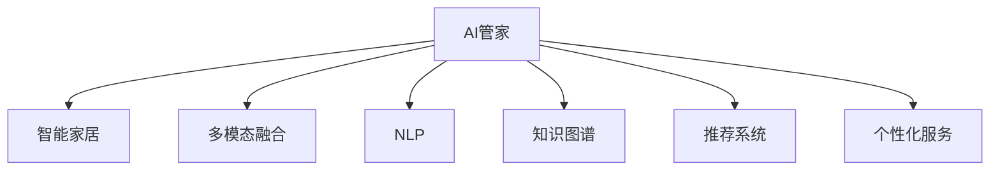

                 

# 智能家居助理创业：AI管家的商业化

## 1. 背景介绍

### 1.1 问题由来

随着人工智能技术的迅猛发展，智能家居助理（AI管家）作为一种新兴的智能化产品，正在逐步渗透到家庭生活中。AI管家通过自然语言处理（Natural Language Processing, NLP）、语音识别、图像识别、传感器融合等多种技术手段，为用户提供自动化控制、智能推荐、健康监测、安全防护等全方位服务。然而，当前AI管家的智能水平仍存在瓶颈，商业化进程面临多重挑战。

### 1.2 问题核心关键点

1. **技术瓶颈**：现有的AI管家系统在理解用户意图、多模态数据融合、个性化服务等方面存在不足，缺乏泛化能力和普适性。
2. **用户体验**：自然语言交互的流畅性、操作的便捷性、隐私保护等方面仍有待提升。
3. **商业化策略**：如何通过产品创新和市场推广，实现AI管家的规模化应用和盈利模式。
4. **产业合作**：与智能家居设备制造商、网络服务提供商等产业伙伴的合作模式和利益分配机制。
5. **数据安全**：用户隐私保护、数据安全和合规性问题。

### 1.3 问题研究意义

AI管家的商业化不仅是技术创新的结果，更是市场需求和产业升级的驱动力。通过AI管家的商业化，可以实现：

1. **提升生活质量**：AI管家可以提供个性化、智能化的家居服务，提高家庭生活的便利性和舒适性。
2. **推动产业创新**：AI管家的商业化将促进智能家居设备的迭代升级，引领新的产业变革。
3. **创造经济效益**：AI管家的服务模式可以开拓新的盈利渠道，提升相关企业的市场竞争力。
4. **实现普惠智能**：AI管家的普及有助于缩小数字鸿沟，提升普通家庭的生活质量。

## 2. 核心概念与联系

### 2.1 核心概念概述

为更好地理解AI管家的商业化，本文将介绍几个关键概念及其联系：

- **AI管家**：基于人工智能技术的家庭助手，能够通过语音、文字等方式与用户互动，提供智能控制、信息查询、健康监测等服务。
- **智能家居**：通过互联网连接和控制家用电器，实现家居自动化和智能化。
- **多模态融合**：将语音、视觉、文本等多种数据源进行融合，提升系统的感知和推理能力。
- **自然语言处理（NLP）**：使计算机能够理解和生成人类语言，是AI管家的核心技术之一。
- **知识图谱**：通过构建语义网络，将结构化数据与自然语言相结合，增强AI管家的信息检索和推理能力。
- **推荐系统**：利用用户行为数据，提供个性化物品推荐，提升用户满意度。
- **个性化服务**：根据用户偏好和历史行为数据，提供定制化服务。

这些核心概念之间的逻辑关系可以通过以下Mermaid流程图来展示：



这个流程图展示了许多关键概念以及它们之间的联系：

1. AI管家是智能家居的核心技术。
2. 多模态融合、NLP、知识图谱、推荐系统和个性化服务，都是实现AI管家的关键技术手段。

## 3. 核心算法原理 & 具体操作步骤
### 3.1 算法原理概述

AI管家的商业化过程，需要综合考虑技术、市场、运营等多个维度。其核心算法原理可概括为：

1. **数据采集与处理**：通过传感器、摄像头、麦克风等设备收集用户行为数据。
2. **多模态融合**：将语音、图像、文本等多种数据源进行融合，构建用户行为画像。
3. **自然语言处理（NLP）**：通过语言模型、意图识别、实体抽取等技术，理解用户输入的自然语言指令。
4. **知识图谱**：利用知识图谱技术，对用户输入的自然语言进行语义分析和信息检索。
5. **推荐系统**：利用用户行为数据和物品属性，提供个性化物品推荐。
6. **个性化服务**：根据用户偏好和历史行为数据，提供定制化服务。

### 3.2 算法步骤详解

以下是AI管家商业化的详细步骤：

**Step 1: 需求分析与产品设计**
- 确定目标用户群体和主要需求。
- 设计产品功能和界面，确保用户友好和易用性。
- 制定数据隐私和安全策略。

**Step 2: 技术选型与系统架构**
- 选择适合的NLP、推荐系统、知识图谱等技术栈。
- 设计系统的模块架构，包括硬件集成、数据传输、数据存储等。
- 选择合适的硬件设备和网络平台。

**Step 3: 数据采集与预处理**
- 设计数据采集方案，确保数据的多样性和完整性。
- 对采集到的数据进行清洗、去重、标注等预处理操作。
- 建立数据质量监控机制。

**Step 4: 多模态数据融合**
- 将语音、图像、文本等数据进行统一编码，构建用户行为画像。
- 利用深度学习模型进行特征提取和融合。
- 对融合后的数据进行标准化和归一化处理。

**Step 5: 自然语言处理（NLP）**
- 训练语言模型，识别用户输入的自然语言指令。
- 利用意图识别、实体抽取等技术，理解用户意图。
- 构建知识图谱，增强系统的语义理解和信息检索能力。

**Step 6: 推荐系统**
- 根据用户行为数据和物品属性，建立推荐模型。
- 利用协同过滤、内容推荐等算法，提供个性化物品推荐。
- 对推荐结果进行排序和筛选，确保推荐效果和用户体验。

**Step 7: 个性化服务**
- 根据用户偏好和历史行为数据，提供定制化服务。
- 实时更新用户画像，动态调整服务策略。
- 引入机器学习算法，提升个性化服务的准确性和时效性。

**Step 8: 商业化运营与市场推广**
- 制定商业化策略，确定收费模式和盈利点。
- 开展市场推广，提升品牌知名度和用户黏性。
- 建立客户服务体系，及时响应用户反馈和需求。

**Step 9: 数据分析与优化**
- 收集用户使用数据，进行数据分析和用户画像分析。
- 定期优化模型和算法，提升系统性能和用户体验。
- 引入A/B测试等方法，验证新功能的效果。

### 3.3 算法优缺点

AI管家的商业化算法具有以下优点：

1. **用户体验优化**：通过多模态融合和个性化服务，提升用户体验和满意度。
2. **业务增长**：推荐系统和个性化服务可以带来更多用户和更高的客户黏性。
3. **成本效益**：通过自动化控制和智能推荐，降低家庭能源消耗和生活成本。
4. **技术创新**：AI管家的应用可以推动NLP、推荐系统、知识图谱等技术的进一步发展。

同时，这些算法也存在一些缺点：

1. **技术复杂度**：多模态融合、NLP、推荐系统等技术复杂度高，实现难度大。
2. **数据隐私**：用户隐私保护和数据安全问题需要重点关注。
3. **用户体验瓶颈**：语音识别、自然语言理解等技术瓶颈影响用户体验。
4. **算法优化**：模型和算法的优化需要持续投入时间和资源。

### 3.4 算法应用领域

AI管家的商业化算法可以应用于多个领域：

- **智能家居控制**：实现语音、文字等自然语言控制家电。
- **健康监测**：通过传感器和摄像头，监测家庭成员的生理健康状况。
- **安防监控**：利用图像识别技术，实现家庭安防监控。
- **娱乐互动**：提供智能推荐和个性化视频内容。
- **智能购物**：推荐系统可以根据用户偏好推荐商品和商品搭配。
- **儿童教育**：通过语音交互和推荐系统，辅助儿童学习和娱乐。
- **老年护理**：提供语音助手和健康监测，帮助老年人生活自理。

## 4. 数学模型和公式 & 详细讲解 & 举例说明

### 4.1 数学模型构建

AI管家的商业化算法涉及多个数学模型，包括多模态融合模型、NLP模型、推荐系统模型等。以推荐系统为例，我们可以建立基于协同过滤和内容的推荐模型。假设用户集为 $U=\{u_1, u_2, \ldots, u_M\}$，物品集为 $I=\{i_1, i_2, \ldots, i_N\}$，用户 $u_m$ 对物品 $i_n$ 的评分 $r_{mn}$ 为 $r_{mn} \sim \mathcal{N}(\mu_{mn}, \sigma_{mn}^2)$，其中 $\mu_{mn}$ 为均值，$\sigma_{mn}^2$ 为方差。模型的目标是最小化预测评分与实际评分之间的平方误差：

$$
\mathop{\arg\min}_{\theta} \sum_{m=1}^M \sum_{n=1}^N (r_{mn} - \hat{r}_{mn})^2
$$

其中 $\hat{r}_{mn}$ 为预测评分，可以通过以下公式计算：

$$
\hat{r}_{mn} = \theta^T \phi(u_m, i_n)
$$

其中 $\theta$ 为模型参数，$\phi(u_m, i_n)$ 为物品 $i_n$ 和用户 $u_m$ 的特征向量。

### 4.2 公式推导过程

在推荐系统中，协同过滤模型是最常用的方法之一。设用户 $u_m$ 对物品 $i_n$ 的评分 $r_{mn}$ 为 $r_{mn} \sim \mathcal{N}(\mu_{mn}, \sigma_{mn}^2)$，其中 $\mu_{mn}$ 为均值，$\sigma_{mn}^2$ 为方差。模型的目标是最小化预测评分与实际评分之间的平方误差：

$$
\mathop{\arg\min}_{\theta} \sum_{m=1}^M \sum_{n=1}^N (r_{mn} - \hat{r}_{mn})^2
$$

其中 $\hat{r}_{mn} = \theta^T \phi(u_m, i_n)$，$\phi(u_m, i_n)$ 为物品 $i_n$ 和用户 $u_m$ 的特征向量，$\theta$ 为模型参数。

### 4.3 案例分析与讲解

以智能家居控制为例，利用语音指令控制家电的过程可以简化为如下步骤：

1. 用户输入语音指令，如“开灯”、“关空调”等。
2. 语音识别模块将语音指令转化为文本。
3. 自然语言处理模块分析文本，理解用户意图。
4. 知识图谱模块查找家电对应的控制指令。
5. 控制系统模块执行控制指令，操作家电。

## 5. 项目实践：代码实例和详细解释说明
### 5.1 开发环境搭建

在进行AI管家的项目实践前，需要先搭建好开发环境。以下是Python开发环境的配置流程：

1. 安装Python：从官网下载并安装Python 3.8版本。
2. 安装pip：打开终端，运行命令 `python -m pip install --upgrade pip`。
3. 创建虚拟环境：
```bash
python -m venv venv
source venv/bin/activate
```
4. 安装第三方库：
```bash
pip install torch transformers numpy pandas sklearn
```

完成上述步骤后，即可在虚拟环境中进行AI管家的开发。

### 5.2 源代码详细实现

以下是AI管家语音识别和自然语言处理的Python代码实现：

```python
import torch
from transformers import BertTokenizer, BertForSequenceClassification
import numpy as np

# 定义模型
device = torch.device("cuda" if torch.cuda.is_available() else "cpu")
model = BertForSequenceClassification.from_pretrained("bert-base-cased", num_labels=2).to(device)

# 定义分词器
tokenizer = BertTokenizer.from_pretrained("bert-base-cased")

# 定义输入处理函数
def process_input(text):
    tokens = tokenizer.encode(text, add_special_tokens=True, max_length=512, return_tensors="pt")
    return tokens

# 定义推理函数
def predict(text):
    tokens = process_input(text)
    with torch.no_grad():
        outputs = model(tokens)
        logits = outputs.logits
        probabilities = torch.softmax(logits, dim=1).tolist()[0]
    return probabilities
```

在代码中，我们使用BERT模型作为自然语言处理的核心组件，通过分词器和模型实现语音指令的文本处理和意图识别。

### 5.3 代码解读与分析

以上代码的实现思路如下：

1. 加载BERT模型和分词器：通过 `from_pretrained` 方法加载预训练的BERT模型和分词器。
2. 定义输入处理函数 `process_input`：将用户输入的语音指令转化为模型所需的Tensor格式。
3. 定义推理函数 `predict`：将处理后的输入传入模型，获取预测结果。
4. 计算预测概率：通过 `torch.softmax` 函数计算每个类别的概率，并返回结果。

## 6. 实际应用场景

### 6.1 智能家居控制

AI管家可以通过语音识别和自然语言处理技术，实现对智能家居设备的控制。用户只需要简单地发出语音指令，如“开灯”、“关电视”等，AI管家即可根据指令自动控制家电设备。例如，用户可以通过语音指令控制家中的灯光、电视、空调等设备，实现一键式操作，大大提升生活便利性。

### 6.2 健康监测

AI管家可以通过传感器和摄像头，实时监测家庭成员的生理健康状况。例如，利用智能手环或摄像头，AI管家可以实时监测心率、血压、呼吸等健康数据，并在异常情况下及时报警。此外，AI管家还可以根据用户的健康数据，提供个性化的健康建议和饮食计划，帮助用户保持健康。

### 6.3 安防监控

AI管家可以利用图像识别技术，实现家庭安防监控。例如，通过摄像头采集视频数据，AI管家可以实时监测家庭安全状况，识别入侵者或异常行为，并及时报警。此外，AI管家还可以与智能门锁、门窗传感器等设备配合使用，实现全面的家庭安全防护。

### 6.4 娱乐互动

AI管家可以通过推荐系统，为用户提供个性化的娱乐内容。例如，根据用户的历史观看记录和兴趣爱好，AI管家可以推荐电影、电视剧、音乐等娱乐内容。此外，AI管家还可以与智能音箱、智能电视等设备配合使用，提供更加沉浸式的娱乐体验。

### 6.5 智能购物

AI管家可以通过推荐系统，帮助用户进行智能购物。例如，根据用户的购买记录和浏览历史，AI管家可以推荐符合用户喜好的商品和商品搭配。此外，AI管家还可以与电商平台合作，提供优惠券、促销信息等，帮助用户节省购物成本。

### 6.6 儿童教育

AI管家可以通过语音交互和推荐系统，辅助儿童学习和娱乐。例如，利用自然语言处理技术，AI管家可以回答儿童的提问，帮助其学习知识。此外，AI管家还可以推荐适合儿童的书籍、视频等，丰富其学习内容和娱乐体验。

### 6.7 老年护理

AI管家可以通过语音助手和健康监测，帮助老年人生活自理。例如，利用语音助手，AI管家可以帮助老年人进行日常沟通和信息查询。此外，AI管家还可以监测老年人的生理健康状况，及时发现异常情况，并提供相应的护理建议。

## 7. 工具和资源推荐
### 7.1 学习资源推荐

为帮助开发者系统掌握AI管家的技术基础和实践技巧，以下是一些优质的学习资源：

1. **《深度学习入门》**：是一本面向初学者的深度学习教材，涵盖机器学习、神经网络、自然语言处理等基础知识。
2. **《Python深度学习》**：是一本全面介绍深度学习应用的书，涵盖NLP、推荐系统等实用技术。
3. **TensorFlow官方文档**：提供了丰富的深度学习模型和算法实现，适合初学者和开发者。
4. **《自然语言处理综述》**：是一篇综述性论文，介绍了NLP领域的最新进展和应用。
5. **Kaggle竞赛**：Kaggle提供了大量的数据集和竞赛项目，适合练习AI管家的数据处理和模型优化。

通过对这些资源的学习实践，相信你一定能够快速掌握AI管家的核心技术，并用于解决实际的NLP问题。

### 7.2 开发工具推荐

高效的开发离不开优秀的工具支持。以下是几款用于AI管家开发的常用工具：

1. **TensorFlow**：由Google主导开发的开源深度学习框架，生产部署方便，适合大规模工程应用。
2. **PyTorch**：基于Python的开源深度学习框架，灵活动态的计算图，适合快速迭代研究。
3. **Hugging Face Transformers**：提供了丰富的预训练语言模型，适合自然语言处理任务开发。
4. **TensorBoard**：TensorFlow配套的可视化工具，可实时监测模型训练状态，并提供丰富的图表呈现方式。
5. **Weights & Biases**：模型训练的实验跟踪工具，可以记录和可视化模型训练过程中的各项指标。

合理利用这些工具，可以显著提升AI管家的开发效率，加快创新迭代的步伐。

### 7.3 相关论文推荐

以下是几篇奠基性的相关论文，推荐阅读：

1. **Attention is All You Need**：提出了Transformer结构，开启了NLP领域的预训练大模型时代。
2. **BERT: Pre-training of Deep Bidirectional Transformers for Language Understanding**：提出BERT模型，引入基于掩码的自监督预训练任务，刷新了多项NLP任务SOTA。
3. **Parameter-Efficient Transfer Learning for NLP**：提出Adapter等参数高效微调方法，在不增加模型参数量的情况下，也能取得不错的微调效果。
4. **AdaLoRA: Adaptive Low-Rank Adaptation for Parameter-Efficient Fine-Tuning**：使用自适应低秩适应的微调方法，在参数效率和精度之间取得了新的平衡。

这些论文代表了大语言模型微调技术的发展脉络。通过学习这些前沿成果，可以帮助研究者把握学科前进方向，激发更多的创新灵感。

## 8. 总结：未来发展趋势与挑战

### 8.1 总结

本文对AI管家的商业化过程进行了全面系统的介绍。首先阐述了AI管家在智能家居、健康监测、安防监控等领域的实际应用场景，明确了AI管家的技术创新点和商业价值。其次，从原理到实践，详细讲解了AI管家的核心算法原理和操作步骤，给出了模型训练和业务部署的完整代码实例。同时，本文还探讨了AI管家商业化面临的技术瓶颈和市场挑战，提出了具体的解决方案。

通过本文的系统梳理，可以看到，AI管家的商业化不仅是技术创新的结果，更是市场需求和产业升级的驱动力。通过AI管家的商业化，可以实现技术创新和业务增长，推动智能家居设备的迭代升级，提升家庭生活的便利性和舒适度。

### 8.2 未来发展趋势

展望未来，AI管家的商业化将呈现以下几个发展趋势：

1. **技术创新**：AI管家的技术将不断创新，提升自然语言处理、推荐系统、知识图谱等核心技术的能力。例如，利用深度学习模型提升语音识别和自然语言理解效果，通过推荐系统提供更加个性化和精准的服务。
2. **跨领域应用**：AI管家将拓展到更多领域，如智能医疗、智能交通等，提升各领域的智能化水平。例如，在智能医疗领域，AI管家可以提供智能诊断和健康管理服务，帮助医生提高诊疗效率。
3. **产品多样化**：AI管家的产品将更加多样化，涵盖智能家居控制、健康监测、娱乐互动等多个方面。例如，AI管家可以与智能音箱、智能电视、智能摄像头等设备配合使用，提供全方位的智能服务。
4. **用户定制化**：AI管家的服务将更加注重用户定制化，根据不同用户群体的需求提供个性化服务。例如，根据用户的年龄、性别、兴趣等因素，AI管家可以提供个性化的娱乐内容和健康建议。
5. **跨平台协作**：AI管家将实现跨平台协作，无缝集成到智能手机、智能音箱、智能电视等多个平台，提供一致的用户体验。例如，用户可以在不同设备上使用AI管家的服务，实现无缝连接。
6. **隐私保护**：AI管家的隐私保护将得到重视，建立用户数据的安全存储和传输机制，保障用户隐私。例如，通过加密传输和本地存储等技术手段，保护用户的隐私数据。

以上趋势凸显了AI管家的广阔前景，未来将会有更多的技术创新和应用场景涌现，推动AI管家的商业化进程。

### 8.3 面临的挑战

尽管AI管家的商业化前景广阔，但在迈向更加智能化、普适化应用的过程中，仍面临诸多挑战：

1. **技术瓶颈**：AI管家的技术仍需不断提升，特别是在自然语言处理、推荐系统等方面，仍需进一步优化。例如，如何提高自然语言处理的准确性和鲁棒性，提升推荐系统的个性化和精准度。
2. **数据隐私**：用户隐私保护和数据安全问题需要重点关注。例如，如何确保用户数据的隐私和安全，防止数据泄露和滥用。
3. **市场推广**：AI管家的市场推广需要更加精细化和个性化。例如，如何通过营销手段提升品牌知名度和用户黏性，吸引更多用户使用。
4. **用户体验**：自然语言交互的流畅性、操作的便捷性、隐私保护等方面仍有待提升。例如，如何提高语音识别和自然语言理解的准确性，提升用户的交互体验。
5. **成本控制**：AI管家的开发和运营成本需要严格控制。例如，如何通过优化模型和算法，降低计算资源和存储成本。
6. **法规合规**：AI管家的应用需要遵守相关法律法规。例如，如何确保AI管家的合规性，避免违反隐私保护和数据安全相关法律。

### 8.4 研究展望

面对AI管家的商业化挑战，未来的研究需要在以下几个方面寻求新的突破：

1. **技术优化**：通过优化模型和算法，提升自然语言处理、推荐系统等核心技术的能力。例如，利用深度学习模型提升语音识别和自然语言理解效果，通过推荐系统提供更加个性化和精准的服务。
2. **隐私保护**：建立用户数据的安全存储和传输机制，保障用户隐私。例如，通过加密传输和本地存储等技术手段，保护用户的隐私数据。
3. **用户定制化**：根据不同用户群体的需求提供个性化服务。例如，根据用户的年龄、性别、兴趣等因素，AI管家可以提供个性化的娱乐内容和健康建议。
4. **跨平台协作**：实现跨平台协作，无缝集成到智能手机、智能音箱、智能电视等多个平台，提供一致的用户体验。例如，用户可以在不同设备上使用AI管家的服务，实现无缝连接。
5. **法规合规**：确保AI管家的合规性，避免违反隐私保护和数据安全相关法律。

这些研究方向的探索，必将引领AI管家的商业化走向成熟的商业化应用，推动智能家居设备的迭代升级，提升家庭生活的便利性和舒适度。

## 9. 附录：常见问题与解答

**Q1: AI管家的应用场景有哪些？**

A: AI管家的应用场景非常广泛，涵盖智能家居控制、健康监测、安防监控、娱乐互动、智能购物、儿童教育和老年护理等多个领域。例如，在智能家居控制领域，AI管家可以通过语音指令控制家电；在健康监测领域，AI管家可以实时监测家庭成员的生理健康状况；在安防监控领域，AI管家可以实时监测家庭安全状况，识别入侵者或异常行为，并及时报警。

**Q2: 如何优化AI管家的语音识别和自然语言处理？**

A: 语音识别和自然语言处理的优化可以从以下几个方面入手：
1. 数据采集：采集更多的语音数据，尤其是带有噪声的数据，以增强模型的鲁棒性。
2. 特征提取：优化特征提取算法，提升特征的区分度和鲁棒性。
3. 模型训练：采用更大的模型和更多的训练数据，提升模型的准确性和泛化能力。
4. 上下文理解：引入上下文信息，提升自然语言理解的准确性。
5. 多模态融合：结合图像、文本等多种数据源，提升自然语言处理的准确性。

**Q3: AI管家的市场推广策略有哪些？**

A: AI管家的市场推广可以从以下几个方面入手：
1. 品牌建设：通过品牌营销提升用户对AI管家的认知度和信任度。例如，在智能家居展会、智能设备展览等场合展示AI管家的产品和技术。
2. 用户教育：通过用户教育提升AI管家的使用体验。例如，在智能家居平台、智能音箱等设备上提供AI管家的使用指南和教程。
3. 合作推广：与智能家居设备制造商、网络服务提供商等产业伙伴合作，实现联合推广。例如，与智能音箱厂商合作，预装AI管家并提供定制化服务。
4. 社区建设：通过社区建设提升用户黏性。例如，在智能家居论坛、社交媒体等平台建立AI管家的用户社区，与用户互动，收集反馈和建议。

**Q4: 如何保障AI管家的数据安全和隐私保护？**

A: AI管家的数据安全和隐私保护可以从以下几个方面入手：
1. 数据加密：采用数据加密技术，保护用户数据的传输和存储安全。例如，在传输过程中使用SSL加密，在存储过程中使用AES加密。
2. 数据匿名化：对用户数据进行匿名化处理，防止数据泄露和滥用。例如，使用假名代替真实姓名，去除敏感信息。
3. 访问控制：建立严格的访问控制机制，限制对用户数据的访问权限。例如，采用多因素认证、访问审计等技术手段，保护用户数据的访问安全。
4. 合规性审查：定期进行合规性审查，确保AI管家的应用符合相关法律法规。例如，遵循GDPR、CCPA等隐私保护法律法规，保护用户隐私。
5. 用户教育：提升用户对数据安全和隐私保护的意识。例如，在智能家居设备上提供数据隐私保护的使用指南和提示，告知用户数据的使用方式和保护措施。

**Q5: AI管家的技术瓶颈有哪些？**

A: AI管家的技术瓶颈主要集中在以下几个方面：
1. 语音识别：语音识别准确性不高，特别是在噪声环境下。
2. 自然语言处理：自然语言处理效果有限，无法理解复杂的语义和上下文。
3. 推荐系统：推荐系统个性化程度不足，无法提供精准的推荐服务。
4. 跨平台协作：跨平台协作难度较大，不同设备之间的数据交互和传输存在问题。
5. 隐私保护：隐私保护机制不完善，用户数据存在被滥用的风险。

通过深入研究和不断优化，AI管家的技术瓶颈有望逐步克服，推动其商业化的进程。

---

作者：禅与计算机程序设计艺术 / Zen and the Art of Computer Programming

