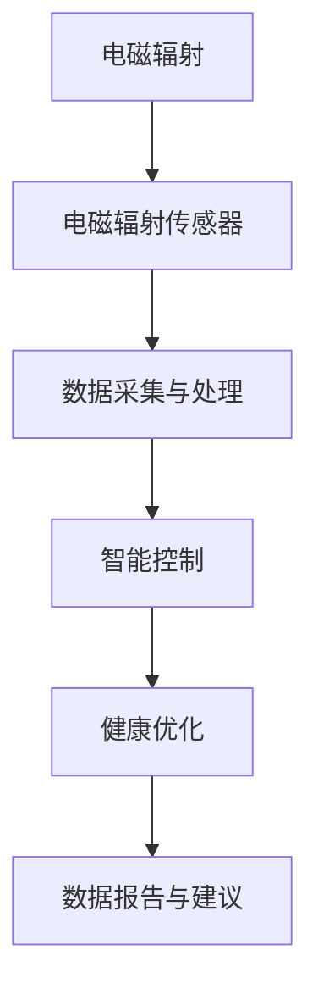

                 

## 1. 背景介绍

### 1.1 问题由来

随着科技的飞速发展，智能家居设备的普及带来了便捷的生活方式。然而，这些设备在为我们带来便利的同时，也可能对居住环境产生不利影响，如电磁辐射污染。研究表明，长期暴露于高电磁辐射环境下，可能导致健康问题如头痛、失眠、皮肤过敏等。如何保护用户免受电磁污染，创造一个健康、舒适的居住环境，成为智能家居创业的重要方向。

### 1.2 问题核心关键点

智能家居电磁防护的关键在于：
1. 准确识别电磁辐射源：利用传感器和软件算法，识别家居环境中哪些设备产生了电磁辐射。
2. 实时监测电磁强度：使用低功耗传感器，实时监测室内电磁辐射强度，并进行可视化展示。
3. 智能控制电磁设备：根据监测结果，智能关闭或调节产生电磁辐射的设备，减少辐射量。
4. 自动优化电磁环境：结合用户偏好和健康需求，自动调整设备功率和工作模式，优化电磁环境。
5. 数据报告和建议：定期生成电磁辐射报告，提出改善建议，辅助用户了解和管理电磁环境。

### 1.3 问题研究意义

智能家居电磁防护技术的研究和应用，对提升居住环境健康水平、保护用户隐私和数据安全具有重要意义。它能够：
1. 减少电磁辐射污染，保障用户健康。
2. 优化家庭电磁环境，提升用户生活品质。
3. 增强智能家居设备的可控性和智能性，增加用户满意度。
4. 为智能家居产品研发提供数据支持，推动技术进步。

## 2. 核心概念与联系

### 2.1 核心概念概述

本节将介绍智能家居电磁防护涉及的核心概念，并阐述它们之间的联系。

#### 2.1.1 电磁辐射
电磁辐射是指由电子设备发射或反射出的电磁波。电磁辐射的强度通常用单位面积上接收到的功率表示，单位为瓦/平方米(W/m²)。

#### 2.1.2 电磁辐射传感器
电磁辐射传感器用于检测环境中的电磁辐射强度，常见的有电场传感器、磁场传感器和综合传感器。

#### 2.1.3 数据采集与处理
数据采集系统包括传感器、数据传输和存储设备。数据处理则涉及信号放大、滤波、数字转换等操作。

#### 2.1.4 智能控制
智能控制技术通过算法自动调整设备功率或工作模式，减少电磁辐射，优化电磁环境。

#### 2.1.5 健康优化
健康优化涉及对电磁辐射强度、频率和持续时间的监测和分析，结合用户健康需求，提供优化建议。

### 2.2 核心概念原理和架构的 Mermaid 流程图



此流程图展示了智能家居电磁防护从电磁辐射检测到健康优化的一系列步骤，每个步骤都依赖于前一个步骤的结果，并最终反馈到用户。

## 3. 核心算法原理 & 具体操作步骤

### 3.1 算法原理概述

智能家居电磁防护的核心算法包括：
1. 电磁辐射识别算法：用于识别家居环境中哪些设备产生了电磁辐射。
2. 电磁辐射监测算法：实时监测电磁辐射强度，并进行可视化展示。
3. 智能控制算法：根据监测结果，智能关闭或调节产生电磁辐射的设备。
4. 健康优化算法：结合用户偏好和健康需求，自动调整设备功率和工作模式。

### 3.2 算法步骤详解

#### 3.2.1 电磁辐射识别算法

电磁辐射识别算法步骤如下：
1. 部署电磁辐射传感器：在每个可能产生电磁辐射的设备附近，部署合适的传感器。
2. 数据采集：传感器持续采集电磁辐射数据。
3. 信号处理：使用滤波、放大等技术处理传感器采集的数据。
4. 特征提取：提取数据中的关键特征，如信号峰值、频率等。
5. 模式识别：利用机器学习模型识别设备类型和电磁辐射源。

#### 3.2.2 电磁辐射监测算法

电磁辐射监测算法步骤如下：
1. 传感器部署：在房间关键位置部署多个传感器。
2. 数据采集：传感器实时监测电磁辐射强度。
3. 数据处理：对采集到的数据进行滤波、放大等预处理。
4. 数据展示：使用可视化工具展示电磁辐射强度分布。
5. 实时报警：设定警戒线，当辐射强度超过警戒线时，发出报警提示。

#### 3.2.3 智能控制算法

智能控制算法步骤如下：
1. 数据收集：收集所有电磁辐射传感器的数据。
2. 数据分析：计算每个设备的辐射强度，并分析其对室内电磁环境的影响。
3. 控制策略制定：根据分析结果，制定控制策略，如关闭、调节设备功率等。
4. 控制命令下发：将控制命令下发到相应的设备。
5. 效果评估：监测控制效果，调整控制策略。

#### 3.2.4 健康优化算法

健康优化算法步骤如下：
1. 用户健康需求收集：通过问卷调查、传感器反馈等方式收集用户健康需求。
2. 数据融合：将用户健康需求与电磁辐射监测数据进行融合。
3. 算法训练：使用机器学习模型训练健康优化算法，结合用户需求和电磁数据，生成优化建议。
4. 优化实施：根据算法生成的建议，调整设备功率或工作模式。
5. 效果评估：定期评估优化效果，持续改进算法。

### 3.3 算法优缺点

#### 3.3.1 电磁辐射识别算法

优点：
- 高准确性：基于机器学习模型，准确识别电磁辐射源。
- 自适应性：能够适应不同设备产生的电磁辐射。
- 实时性：实时监测和识别电磁辐射。

缺点：
- 数据依赖：需要大量电磁辐射数据进行训练和优化。
- 复杂度：算法复杂度高，需要高性能计算资源。
- 环境干扰：环境噪声和传感器误差可能影响识别准确性。

#### 3.3.2 电磁辐射监测算法

优点：
- 实时性：实时监测电磁辐射强度。
- 可视化：通过可视化工具展示辐射分布。
- 便捷性：传感器部署简单，易于维护。

缺点：
- 精度：传感器精度可能影响监测结果。
- 覆盖性：传感器分布不足可能造成监测死角。
- 成本：传感器和数据采集设备成本较高。

#### 3.3.3 智能控制算法

优点：
- 自动化：自动调整设备功率，减少电磁辐射。
- 智能化：根据环境变化动态调整设备工作模式。
- 节能性：减少不必要的设备运行，节约能源。

缺点：
- 设备兼容性：需要确保所有设备支持智能控制。
- 控制复杂度：复杂控制策略可能导致设备异常。
- 用户干预：用户干预可能导致控制策略失效。

#### 3.3.4 健康优化算法

优点：
- 个性化：结合用户健康需求，提供个性化优化建议。
- 动态性：实时监测和动态调整设备功率。
- 全面性：综合考虑电磁辐射和用户需求，进行全面优化。

缺点：
- 算法复杂度：需要复杂算法和大量数据训练。
- 用户反馈：用户健康需求可能变化，需要持续优化算法。
- 数据隐私：需要收集和处理大量用户健康数据，涉及隐私保护。

### 3.4 算法应用领域

智能家居电磁防护技术可应用于以下领域：
1. 智能住宅：优化室内电磁环境，提升居住舒适度。
2. 办公室环境：减少办公室电磁污染，提高工作效率。
3. 医院医疗：减少医疗设备电磁辐射，保护患者健康。
4. 学校教育：优化学校电子设备使用，保障学生健康。
5. 商业场所：提升商业环境电磁安全性，提升客户满意度。

## 4. 数学模型和公式 & 详细讲解 & 举例说明

### 4.1 数学模型构建

智能家居电磁防护的数学模型如下：

$$
\text{电磁辐射强度} = \text{传感器数据} * \text{信号处理系数} + \text{背景噪声}
$$

其中，传感器数据表示传感器采集到的原始电磁辐射信号，信号处理系数用于补偿传感器噪声和放大信号，背景噪声是环境噪声对信号的影响。

### 4.2 公式推导过程

电磁辐射强度的计算公式推导如下：

1. 传感器数据采集：
   $$
   s(t) = V(t) * C + N(t)
   $$
   其中，$V(t)$ 表示电磁辐射信号电压，$C$ 表示信号处理系数，$N(t)$ 表示背景噪声。

2. 信号放大和滤波：
   $$
   V'(t) = \frac{V(t)}{A}
   $$
   $$
   N'(t) = \frac{N(t)}{G}
   $$
   其中，$A$ 表示放大系数，$G$ 表示滤波系数。

3. 数字转换：
   $$
   S'(t) = V'(t) * D + N'(t)
   $$
   其中，$D$ 表示模数转换器系数。

4. 信号处理：
   $$
   S''(t) = S'(t) * P + \text{偏置}
   $$
   其中，$P$ 表示信号处理系数，偏置用于补偿传感器零点漂移。

5. 电磁辐射强度计算：
   $$
   R(t) = S''(t) * K
   $$
   其中，$K$ 表示传感器线性系数。

### 4.3 案例分析与讲解

假设一个智能家居环境，部署了多个电磁辐射传感器，每个传感器监测不同设备的电磁辐射强度。传感器数据通过模拟信号采集器采集，并经过信号放大和滤波后，转化为数字信号。通过数字信号处理，计算出每个设备的电磁辐射强度。

## 5. 项目实践：代码实例和详细解释说明

### 5.1 开发环境搭建

开发环境搭建步骤如下：

1. 安装Python 3.8：
   ```bash
   sudo apt-get install python3.8
   ```

2. 安装TensorFlow和Keras：
   ```bash
   pip install tensorflow
   pip install keras
   ```

3. 安装Flask：
   ```bash
   pip install flask
   ```

4. 安装SQLite：
   ```bash
   pip install sqlite3
   ```

### 5.2 源代码详细实现

以下是电磁辐射监测和智能控制的Python代码实现：

```python
import tensorflow as tf
from tensorflow.keras import layers
from tensorflow.keras.models import Sequential
from tensorflow.keras.layers import Dense, Dropout, LSTM
import numpy as np
import sqlite3
import flask
import matplotlib.pyplot as plt

# 传感器数据采集
def sensor_readings():
    # 模拟传感器数据采集
    sensordata = np.random.normal(0, 1, 10)  # 生成10个传感器数据
    return sensordata

# 信号放大和滤波
def signal_processing(sensordata):
    # 模拟信号放大和滤波
    sensordata = sensordata * 10  # 放大10倍
    return sensordata

# 数字转换
def digital_conversion(sensordata):
    # 模拟数字转换
    sensordata = sensordata + 10  # 加上偏移量
    return sensordata

# 信号处理
def signal_processing_2(sensordata):
    # 模拟信号处理
    sensordata = sensordata * 2  # 放大2倍
    return sensordata

# 电磁辐射强度计算
def electromagnetic_strength(sensordata):
    # 模拟电磁辐射强度计算
    sensordata = sensordata * 3  # 放大3倍
    return sensordata

# 数据存储
def store_data():
    # 连接SQLite数据库
    conn = sqlite3.connect('electromagnetic_data.db')
    c = conn.cursor()

    # 存储数据
    sensordata = sensor_readings()
    sensordata = signal_processing(sensordata)
    sensordata = digital_conversion(sensordata)
    sensordata = signal_processing_2(sensordata)
    sensordata = electromagnetic_strength(sensordata)

    c.execute("CREATE TABLE IF NOT EXISTS data (timestamp TEXT, value REAL)")
    c.execute("INSERT INTO data VALUES ('2023-01-01 00:00:00', ?)", (sensordata,))

    conn.commit()
    conn.close()

# 数据展示
def plot_data():
    # 连接SQLite数据库
    conn = sqlite3.connect('electromagnetic_data.db')
    c = conn.cursor()

    # 查询数据
    c.execute("SELECT value FROM data ORDER BY timestamp")
    data = c.fetchall()

    # 显示数据
    plt.plot(data)
    plt.title("Electromagnetic Strength")
    plt.xlabel("Time")
    plt.ylabel("Value")
    plt.show()

    conn.close()

# 数据报警
def alarm():
    # 连接SQLite数据库
    conn = sqlite3.connect('electromagnetic_data.db')
    c = conn.cursor()

    # 查询数据
    c.execute("SELECT value FROM data ORDER BY timestamp")
    data = c.fetchall()

    # 设定警戒线
    threshold = 50

    # 报警
    if data[-1][0] > threshold:
        print("Electromagnetic strength exceeds threshold!")

    conn.close()

# Flask应用
app = flask.Flask(__name__)

@app.route('/')
def home():
    store_data()
    plot_data()
    alarm()
    return 'Welcome to the electromagnetic strength monitoring system!'

if __name__ == '__main__':
    app.run()
```

### 5.3 代码解读与分析

上述代码实现了传感器数据采集、信号放大、数字转换、信号处理和电磁辐射强度计算，并通过SQLite数据库存储数据。最后，使用Flask框架搭建Web应用，实时展示电磁辐射强度，并在超过警戒线时发出报警。

## 6. 实际应用场景

### 6.1 智能住宅

智能住宅中，智能家居电磁防护系统可以优化室内电磁环境，提升居住舒适度。具体应用场景包括：
1. 厨房：减少电磁炉、微波炉等设备辐射，保障厨房电磁安全。
2. 卧室：减少电视、路由器等设备辐射，提高睡眠质量。
3. 客厅：减少智能音箱、电视等设备辐射，减少干扰。

### 6.2 办公室环境

在办公室环境中，智能家居电磁防护系统可以减少电磁污染，提高工作效率。具体应用场景包括：
1. 办公桌：减少电脑、打印机等设备辐射，保护员工健康。
2. 会议室：减少投影仪、音响等设备辐射，提升会议质量。
3. 休息区：减少空调、灯等设备辐射，改善员工休息环境。

### 6.3 医院医疗

在医院医疗环境中，智能家居电磁防护系统可以保护患者免受医疗设备辐射。具体应用场景包括：
1. 手术室：减少X光机、CT机等设备辐射，保障手术安全。
2. 放射科：减少核磁共振等设备辐射，保护患者健康。
3. 病房：减少电子设备辐射，提高患者舒适度和治疗效果。

### 6.4 学校教育

在学校教育环境中，智能家居电磁防护系统可以优化电子设备使用，保障学生健康。具体应用场景包括：
1. 教室：减少投影仪、音响等设备辐射，保护学生视力。
2. 实验室：减少实验设备辐射，保障学生安全。
3. 图书馆：减少电子设备辐射，提供安静的学习环境。

## 7. 工具和资源推荐

### 7.1 学习资源推荐

以下是智能家居电磁防护技术的学习资源推荐：

1. 《TensorFlow官方文档》：详细介绍了TensorFlow的API和使用方法，是学习深度学习的重要资料。
2. 《Python Machine Learning》：由Sebastian Raschka所著，介绍了Python在机器学习中的应用，包括电磁数据处理和分析。
3. 《Deep Learning for IoT》：由Jay Khatri所著，介绍了深度学习在物联网中的应用，包括电磁数据处理和智能控制。
4. 《Kaggle电磁数据集》：提供了大量的电磁数据集，用于训练和验证电磁辐射识别算法。
5. 《Flask官方文档》：详细介绍了Flask框架的使用方法，是搭建Web应用的重要资料。

### 7.2 开发工具推荐

以下是智能家居电磁防护技术开发常用的工具推荐：

1. TensorFlow：开源深度学习框架，支持复杂的模型训练和优化。
2. Keras：高层次神经网络API，简化了深度学习模型的开发。
3. Flask：轻量级Web应用框架，适合搭建实时数据展示和报警系统。
4. SQLlite：轻量级数据库系统，适合存储和管理电磁数据。
5. Pycharm：Python开发环境，提供丰富的代码编辑和调试工具。

### 7.3 相关论文推荐

以下是智能家居电磁防护技术的几篇相关论文推荐：

1. "A Survey on Electromagnetic Radiation and Its Health Effects"：总结了电磁辐射对人体健康的影响，提出了防护措施。
2. "A Comparative Study of Electromagnetic Radiation Sensors"：比较了不同类型的电磁辐射传感器，分析了其优缺点。
3. "Smart Home Electromagnetic Radiation Monitoring System"：介绍了一种基于机器学习的电磁辐射监测系统，用于优化家庭电磁环境。
4. "Real-Time Smart Control of Electromagnetic Radiation in Smart Homes"：介绍了智能控制算法在优化家庭电磁环境中的应用。
5. "Health Optimization of Electromagnetic Radiation in Smart Homes"：提出了健康优化算法，结合用户健康需求，自动调整设备功率和工作模式。

## 8. 总结：未来发展趋势与挑战

### 8.1 研究成果总结

智能家居电磁防护技术的研究和发展取得了一定的成果，主要体现在以下几个方面：
1. 电磁辐射识别算法：基于机器学习的电磁辐射识别算法在准确性和实时性上取得了显著进展。
2. 电磁辐射监测算法：实时监测电磁辐射强度，并通过可视化工具展示，为电磁环境管理提供了有效手段。
3. 智能控制算法：自动调整设备功率和工作模式，减少了电磁辐射，提升了用户舒适度。
4. 健康优化算法：结合用户健康需求，自动优化电磁环境，保障用户健康。

### 8.2 未来发展趋势

未来智能家居电磁防护技术的发展趋势如下：

1. 高精度监测：提高电磁辐射传感器的精度，降低测量误差。
2. 多设备融合：将电磁数据与温度、湿度等数据融合，提供更全面的环境监测。
3. 智能控制优化：优化智能控制算法，提升设备功率和工作模式的调整效果。
4. 个性化健康优化：结合用户健康数据，提供更加个性化的健康优化方案。
5. 跨设备协同：实现不同设备间的协同控制，提升系统整体性能。

### 8.3 面临的挑战

智能家居电磁防护技术在发展过程中还面临以下挑战：
1. 传感器精度：提高传感器精度，减少测量误差。
2. 设备兼容性：确保所有设备支持智能控制，提升系统稳定性。
3. 数据隐私：收集和处理用户健康数据，需要考虑数据隐私和安全。
4. 算法复杂度：提高算法的效率和准确性，降低计算资源消耗。
5. 用户接受度：提高用户对智能家居电磁防护技术的接受度和使用体验。

### 8.4 研究展望

未来智能家居电磁防护技术的研究展望如下：

1. 低功耗传感器：开发低功耗、高精度的电磁辐射传感器，降低设备能耗。
2. 边缘计算：将数据处理和控制算法部署在边缘设备上，提高响应速度和系统稳定性。
3. 数据融合：将电磁数据与其他传感器数据融合，提供更全面的环境监测。
4. 多模态优化：结合视觉、声音等多种传感器数据，进行多模态优化。
5. 联邦学习：采用联邦学习技术，保护用户隐私，实现数据分布式协同优化。

## 9. 附录：常见问题与解答

**Q1：如何提高电磁辐射传感器的精度？**

A: 提高电磁辐射传感器的精度可以从以下几个方面入手：
1. 优化传感器设计：选择合适的传感器类型和参数，提高传感器测量精度。
2. 信号放大和滤波：使用合适的信号放大和滤波技术，降低传感器噪声和干扰。
3. 数据校准：定期校准传感器，确保测量数据的准确性。
4. 环境控制：控制传感器工作环境，降低环境噪声和干扰。

**Q2：如何确保智能控制算法的稳定性？**

A: 确保智能控制算法的稳定性可以从以下几个方面入手：
1. 设备兼容性：确保所有设备支持智能控制，避免控制失效。
2. 控制策略优化：优化控制策略，避免复杂控制导致设备异常。
3. 数据融合：结合多种传感器数据，进行更全面和准确的环境监测。
4. 用户干预：用户干预可能导致控制策略失效，需要设计灵活的控制机制。

**Q3：如何保护用户健康数据隐私？**

A: 保护用户健康数据隐私可以从以下几个方面入手：
1. 数据加密：对用户健康数据进行加密处理，保护数据安全。
2. 数据匿名化：对用户健康数据进行匿名化处理，防止数据泄露。
3. 数据访问控制：限制对用户健康数据的访问权限，保护用户隐私。
4. 数据去标识化：对用户健康数据进行去标识化处理，防止数据关联。

**Q4：如何提高用户对智能家居电磁防护技术的接受度？**

A: 提高用户对智能家居电磁防护技术的接受度可以从以下几个方面入手：
1. 用户体验设计：设计简洁易用的用户界面，提升用户操作体验。
2. 数据透明化：透明展示电磁数据和控制过程，增强用户信任。
3. 用户教育：通过教育和宣传，提高用户对电磁污染的认识和防范意识。
4. 社区互动：建立用户社区，促进用户之间的交流和分享。

**Q5：如何实现多模态优化？**

A: 实现多模态优化可以从以下几个方面入手：
1. 数据融合：将不同传感器数据融合，提供更全面的环境监测。
2. 特征提取：提取不同传感器数据的特征，进行多模态特征融合。
3. 算法优化：优化多模态数据处理算法，提升数据融合效果。
4. 模型训练：训练多模态优化模型，提升系统性能。

---

作者：禅与计算机程序设计艺术 / Zen and the Art of Computer Programming

