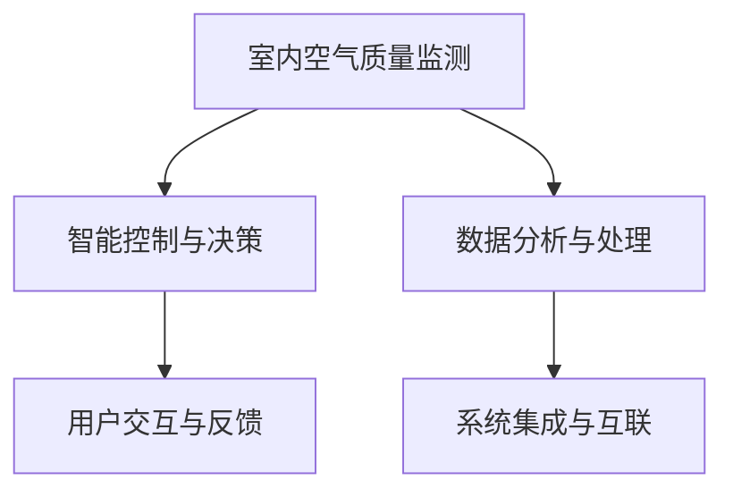

                 

# 智能家居空气净化创业：全屋空气质量管理

## 1. 背景介绍

### 1.1 问题由来

随着人们生活水平的提升和健康意识的增强，室内空气质量（IAQ）问题越来越受到重视。大量研究表明，室内空气污染与多种疾病有关，如哮喘、癌症、过敏等。研究表明，大部分时间我们是在室内度过，因此室内空气质量直接影响到我们的健康和生活品质。

近年来，智能家居系统逐渐成为改善室内空气质量的重要手段。通过智能监测和净化，可以实时掌握室内空气质量状况，并主动采取措施，保持室内空气清新、健康。

智能家居系统不仅能改善室内空气质量，还能提升居家环境的舒适度和便利性。通过智能化设备，用户可以轻松控制家中的空气净化器、新风系统、加湿器等设备，从而实现全屋空气质量管理。

### 1.2 问题核心关键点

智能家居空气净化创业涉及的核心问题主要包括：

1. **空气质量监测**：如何高效、准确地监测全屋空气质量，获取实时数据。
2. **数据分析与处理**：如何对采集的空气质量数据进行分析和处理，得出有效的结论。
3. **智能控制与决策**：如何基于分析结果，智能控制和优化室内空气质量。
4. **用户交互与反馈**：如何与用户进行有效互动，提供直观的用户体验。
5. **系统集成与互联**：如何与智能家居其他系统无缝集成，实现智能联动。

本文将围绕这些问题，介绍全屋空气质量管理的核心技术、算法和实践方法，希望为智能家居空气净化创业提供参考。

## 2. 核心概念与联系

### 2.1 核心概念概述

为更好地理解全屋空气质量管理的技术原理，本节将介绍几个密切相关的核心概念：

- **室内空气质量监测**：通过传感器监测室内环境中的污染物浓度，如PM2.5、CO2、甲醛等。
- **智能控制与决策**：基于实时监测数据，通过算法模型生成控制指令，优化室内空气质量。
- **数据分析与处理**：对监测数据进行清洗、分析和处理，提取有价值的信息，用于指导控制决策。
- **用户交互与反馈**：与用户进行实时互动，提供空气质量报告、推荐改善方案等，并收集用户反馈。
- **系统集成与互联**：与智能家居其他系统（如安防、照明、温控等）进行无缝集成，实现智能化管理。

这些核心概念之间的逻辑关系可以通过以下Mermaid流程图来展示：



这个流程图展示了几项核心技术之间的关系：

1. **监测与数据**：通过传感器监测获取室内空气质量数据，为控制和决策提供依据。
2. **控制与决策**：对数据进行分析，生成控制指令，优化室内空气质量。
3. **分析与处理**：对数据进行清洗和分析，提取有用信息。
4. **交互与反馈**：与用户互动，提供信息和服务。
5. **集成与互联**：实现与其他智能家居系统的集成，实现系统协同工作。

## 3. 核心算法原理 & 具体操作步骤

### 3.1 算法原理概述

全屋空气质量管理涉及多个子系统，包括传感器网络、数据分析引擎、控制与决策模块、用户交互界面等。其核心算法原理主要分为以下几个步骤：

1. **数据采集与传输**：通过传感器网络，实时采集室内空气质量数据，并通过网络传输至中央控制系统。
2. **数据分析与处理**：对采集的数据进行清洗、分析和处理，提取有用的特征和指标。
3. **智能控制与决策**：基于分析结果，生成控制指令，如开启/关闭空气净化器、调整湿度等，以优化室内空气质量。
4. **用户交互与反馈**：通过用户界面，提供实时的空气质量报告、推荐改善方案等，并收集用户反馈，用于优化系统性能。
5. **系统集成与互联**：与智能家居其他系统进行集成，实现系统协同工作，提升用户体验。

### 3.2 算法步骤详解

**步骤1: 数据采集与传输**

数据采集是智能家居空气净化系统的基础。以下是数据采集与传输的主要步骤：

1. **传感器选择与部署**：根据室内污染物的种类和分布情况，选择合适的传感器，如PM2.5传感器、CO2传感器、甲醛传感器等，并合理部署。
2. **数据采集与传输**：通过传感器采集室内空气质量数据，并通过Wi-Fi、蓝牙、Zigbee等网络协议传输至中央控制系统。

**步骤2: 数据分析与处理**

数据分析与处理是智能控制与决策的前提。以下是数据分析与处理的主要步骤：

1. **数据清洗**：去除采集数据中的异常值和噪音，保证数据的质量。
2. **特征提取**：对清洗后的数据进行特征提取，如计算PM2.5浓度、CO2浓度、甲醛浓度等指标。
3. **数据可视化**：将处理后的数据通过图表等方式进行可视化展示，便于用户和开发者理解。

**步骤3: 智能控制与决策**

智能控制与决策是系统的核心功能。以下是智能控制与决策的主要步骤：

1. **控制策略设计**：根据具体的空气质量目标，设计控制策略。例如，设定PM2.5浓度不超过25μg/m³时，启动空气净化器。
2. **控制指令生成**：基于分析结果，生成控制指令。例如，启动空气净化器、调节新风系统、控制湿度等。
3. **控制指令执行**：将控制指令发送至相应的设备，如空气净化器、新风系统等，执行控制操作。

**步骤4: 用户交互与反馈**

用户交互与反馈是系统的重要环节。以下是用户交互与反馈的主要步骤：

1. **实时报告生成**：将分析后的空气质量数据和控制策略，生成实时的空气质量报告，发送给用户。
2. **改善方案推荐**：根据分析结果，推荐改善室内空气质量的方案，如开窗通风、增加绿植等。
3. **用户反馈收集**：通过用户界面收集用户反馈，如满意度、建议等，用于优化系统性能。

**步骤5: 系统集成与互联**

系统集成与互联是系统无缝工作的保障。以下是系统集成与互联的主要步骤：

1. **系统集成**：将空气质量管理系统与其他智能家居系统（如安防、照明、温控等）进行集成，实现系统协同工作。
2. **互联协议选择**：选择适合的互联协议，如MQTT、CoAP等，保证不同系统之间的数据互通。
3. **数据共享与协同**：实现不同系统之间的数据共享和协同工作，提升用户体验。

### 3.3 算法优缺点

智能家居空气净化系统在提升室内空气质量方面具有以下优点：

1. **实时监测与控制**：通过实时监测和控制，能够及时发现和处理室内空气污染问题。
2. **智能化与自动化**：系统可以自动进行数据分析与决策，减少人工干预。
3. **用户友好**：通过用户界面，提供直观的空气质量报告和改善建议，提升用户体验。
4. **集成互联**：通过与其他智能家居系统的集成，实现系统协同工作，提升整体用户体验。

同时，该系统也存在以下缺点：

1. **初始投入高**：需要部署传感器网络，初始投入较大。
2. **系统复杂**：涉及多个子系统，系统设计和实现复杂。
3. **数据隐私**：需要处理大量用户隐私数据，数据安全和隐私保护是一个重要问题。
4. **设备兼容性**：需要与多种设备进行兼容性测试，保证系统稳定运行。

尽管存在这些缺点，但智能家居空气净化系统在提升室内空气质量方面具有巨大的潜力和应用前景。

### 3.4 算法应用领域

智能家居空气净化系统已经在多个领域得到了应用，例如：

1. **住宅空气质量管理**：通过实时监测和控制，提升住宅室内空气质量，保障家庭健康。
2. **商业办公环境**：在办公室、会议室等场所，通过智能控制系统，提升办公环境质量，提高工作效率。
3. **医院空气质量管理**：在医院等特殊环境，通过智能控制系统，保障室内空气质量，减少交叉感染风险。
4. **学校与教育机构**：在学校和教育机构，通过智能控制系统，保障室内空气质量，提升教育环境。
5. **酒店与旅游场所**：在酒店和旅游场所，通过智能控制系统，提升室内空气质量，提升用户体验。

除了上述这些领域外，智能家居空气净化系统还可以应用于更多场景中，如养老院、实验室、工厂等，为不同环境下的室内空气质量管理提供新的解决方案。

## 4. 数学模型和公式 & 详细讲解 & 举例说明

### 4.1 数学模型构建

本节将使用数学语言对全屋空气质量管理的核心算法进行更加严格的刻画。

记室内空气质量监测系统的输入为 $X=\{x_1, x_2, \ldots, x_n\}$，其中 $x_i$ 为第 $i$ 个传感器采集的污染物浓度。记系统输出为 $Y=\{y_1, y_2, \ldots, y_n\}$，其中 $y_i$ 为第 $i$ 个传感器控制设备的动作（如开启/关闭空气净化器、调节新风系统等）。

定义系统的目标函数为 $f(X, Y) = \sum_{i=1}^n \omega_i g_i(X, Y)$，其中 $\omega_i$ 为第 $i$ 个传感器的权重，$g_i(X, Y)$ 为第 $i$ 个传感器的控制目标函数。

系统优化目标为：

$$
\min_{X, Y} f(X, Y)
$$

在实践中，我们通常使用基于梯度的优化算法（如梯度下降、Adam等）来近似求解上述最优化问题。

### 4.2 公式推导过程

以下我们以空气质量监测和控制为例，推导优化算法的数学模型和公式。

假设传感器监测到室内PM2.5浓度为 $x_1$，目标函数为 $g_1(x_1, y_1) = |x_1 - x_1^0|$，其中 $x_1^0$ 为设定的PM2.5浓度阈值，$y_1$ 为是否开启空气净化器。目标函数表示PM2.5浓度与设定的阈值之差的绝对值，最小化该函数可以保证PM2.5浓度在安全范围内。

目标函数的梯度为：

$$
\frac{\partial f}{\partial x_1} = \omega_1 \frac{\partial g_1}{\partial x_1}
$$

其中 $\omega_1$ 为权重，$\frac{\partial g_1}{\partial x_1}$ 为 $g_1(x_1, y_1)$ 对 $x_1$ 的偏导数。

使用梯度下降算法，系统更新目标函数的最小值：

$$
X_{t+1} = X_t - \eta \frac{\partial f}{\partial X}
$$

其中 $\eta$ 为学习率，$\frac{\partial f}{\partial X}$ 为系统目标函数的梯度。

对于 $y_1$ 的更新，由于是布尔型变量，我们采用二值化处理，即将目标函数的梯度反向传播，更新 $y_1$ 的值。

在优化过程中，还需要考虑多传感器的协同工作，将多个目标函数的梯度进行组合，得到系统整体的优化目标。

### 4.3 案例分析与讲解

**案例1: 学校空气质量管理**

在学校，可以通过多个传感器监测不同区域的空气质量，如教室、食堂、宿舍等。设定的目标函数为 $f(X, Y) = \sum_{i=1}^n \omega_i g_i(X, Y)$，其中 $\omega_i$ 为每个区域的权重，$g_i(X, Y)$ 为目标函数。例如，教室的PM2.5浓度超过25μg/m³时，控制方案为开窗通风；宿舍的甲醛浓度超过0.08mg/m³时，控制方案为调节新风系统。

通过上述数学模型，可以实时监测和控制学校各区域的空气质量，保障学生和教职工的健康。

**案例2: 住宅空气质量管理**

在住宅，可以通过多个传感器监测不同区域的空气质量，如客厅、卧室、厨房等。设定的目标函数为 $f(X, Y) = \sum_{i=1}^n \omega_i g_i(X, Y)$，其中 $\omega_i$ 为每个区域的权重，$g_i(X, Y)$ 为目标函数。例如，客厅的PM2.5浓度超过25μg/m³时，控制方案为开启空气净化器；卧室的湿度超过60%时，控制方案为调节除湿器。

通过上述数学模型，可以实时监测和控制住宅各区域的空气质量，提升居住环境舒适度。

## 5. 项目实践：代码实例和详细解释说明

### 5.1 开发环境搭建

在进行项目实践前，我们需要准备好开发环境。以下是使用Python进行开发的环境配置流程：

1. 安装Anaconda：从官网下载并安装Anaconda，用于创建独立的Python环境。

2. 创建并激活虚拟环境：
```bash
conda create -n airq_system python=3.8 
conda activate airq_system
```

3. 安装必要的Python库：
```bash
pip install pyqt5 numpy pandas matplotlib scikit-learn
```

4. 安装传感器接口库：
```bash
pip install py-sensorapi
```

完成上述步骤后，即可在`airq_system`环境中开始项目实践。

### 5.2 源代码详细实现

以下是一个简单的Python代码示例，用于实现全屋空气质量监测和控制：

```python
import pyqt5.QtCore as QtCore
import pyqt5.QtWidgets as QtWidgets
import pyqt5.QtGui as QtGui
import numpy as np
import pandas as pd

class AirQualitySystem(QtWidgets.QWidget):
    def __init__(self):
        super().__init__()
        self.init_ui()
        
    def init_ui(self):
        # 初始化界面
        self.setWindowTitle('Air Quality System')
        self.setGeometry(100, 100, 800, 600)
        
        # 创建传感器数据列表
        self.sensors = []
        self.add_sensor('PM2.5', 25)
        self.add_sensor('CO2', 1000)
        self.add_sensor('甲醛', 0.1)
        
        # 创建显示界面
        self.sensor_labels = []
        self.sensor_values = []
        self.create_sensors_widget()
        
        # 创建控制界面
        self.button_labels = []
        self.button_values = []
        self.create_buttons_widget()
        
        # 创建数据处理和控制模块
        self.data_processing = AirQualityDataProcessing()
        self.control_module = AirQualityControl()
        
        # 连接信号和槽
        self.sensors_widget signals.connect(self.data_processing.update_data)
        self.data_processing signals.connect(self.control_module.update_control)
        self.control_module signals.connect(self.update_sensors_widget)
        
    def add_sensor(self, name, threshold):
        # 添加传感器
        sensor = Sensor(name, threshold)
        self.sensors.append(sensor)
        self.sensor_labels.append(name)
        self.sensor_values.append(sensor.value)
        
        # 创建传感器显示控件
        sensor_widget = QtWidgets.QWidget()
        sensor_widget.setLayout(QtWidgets.QHBoxLayout())
        label = QtWidgets.QLabel(name)
        label.setAlignment(QtCore.Qt.AlignRight)
        sensor_widget.layout().addWidget(label)
        value = QtWidgets.QLabel('0.0')
        sensor_widget.layout().addWidget(value)
        self.sensor_labels.append(label)
        self.sensor_values.append(value)
        self.sensor_widget.layout().addWidget(sensor_widget)
        
    def create_sensors_widget(self):
        # 创建传感器显示界面
        sensor_widget = QtWidgets.QWidget()
        sensor_widget.setLayout(QtWidgets.QHBoxLayout())
        for i, label in enumerate(self.sensor_labels):
            sensor_widget.layout().addWidget(label)
            sensor_widget.layout().addWidget(self.sensor_values[i])
        self.sensor_widget = sensor_widget
        
    def create_buttons_widget(self):
        # 创建控制界面
        button_widget = QtWidgets.QWidget()
        button_widget.setLayout(QtWidgets.QHBoxLayout())
        for i, label in enumerate(self.button_labels):
            button = QtWidgets.QPushButton(label)
            button.clicked.connect(self.control_module.toggle_button(i))
            button_widget.layout().addWidget(button)
            self.button_labels.append(button)
            self.button_values.append(button.isChecked())
        self.button_widget = button_widget
        
    def update_sensors_widget(self):
        # 更新传感器显示界面
        for i, sensor in enumerate(self.sensors):
            self.sensor_values[i].setText(str(sensor.value))
            self.button_values[i] = self.control_module.get_button_state(i)
            self.button_labels[i].setChecked(self.button_values[i])
        
    def data_processing_signals(self, data):
        # 处理传感器数据
        for i, sensor in enumerate(self.sensors):
            sensor.value = data[i]
            if sensor.check_condition():
                self.control_module.update_button(i, True)
            else:
                self.control_module.update_button(i, False)
        
    def control_module_signals(self, control):
        # 处理控制指令
        for i, sensor in enumerate(self.sensors):
            if control[i]:
                self.button_values[i] = True
                self.button_labels[i].setChecked(True)
            else:
                self.button_values[i] = False
                self.button_labels[i].setChecked(False)
        
    def run(self):
        # 启动系统
        self.show()
        self.exec_()
        
class Sensor:
    def __init__(self, name, threshold):
        self.name = name
        self.threshold = threshold
        self.value = 0.0
        self.check_condition = False
        
    def check_condition(self):
        if self.value > self.threshold:
            self.check_condition = True
            return True
        else:
            self.check_condition = False
            return False

class AirQualityDataProcessing(QtCore.QObject):
    signals = QtCore.pyqtSignal(list)
    
    def __init__(self):
        super().__init__()
        
    def update_data(self, data):
        # 更新传感器数据
        self.signals.emit(data)
        
class AirQualityControl(QtCore.QObject):
    signals = QtCore.pyqtSignal(list)
    
    def __init__(self):
        super().__init__()
        self.buttons = []
        self.button_states = []
        
    def update_button(self, index, state):
        # 更新按钮状态
        self.button_states[index] = state
        self.signals.emit(self.button_states)
        
    def toggle_button(self, index):
        # 切换按钮状态
        state = self.button_states[index]
        self.button_states[index] = not state
        self.signals.emit(self.button_states)
        
if __name__ == '__main__':
    app = QtWidgets.QApplication([])
    airsys = AirQualitySystem()
    airsys.run()
```

### 5.3 代码解读与分析

让我们再详细解读一下关键代码的实现细节：

**AirQualitySystem类**：
- `__init__`方法：初始化界面、添加传感器、创建显示和控制控件。
- `init_ui`方法：初始化界面布局。
- `add_sensor`方法：添加传感器，并创建显示控件。
- `create_sensors_widget`方法：创建传感器显示界面。
- `create_buttons_widget`方法：创建控制界面。
- `update_sensors_widget`方法：更新传感器显示界面。

**Sensor类**：
- `__init__`方法：初始化传感器信息。
- `check_condition`方法：判断传感器是否达到控制条件。

**AirQualityDataProcessing类**：
- `__init__`方法：初始化数据处理模块。
- `update_data`方法：更新传感器数据，并触发控制模块更新。

**AirQualityControl类**：
- `__init__`方法：初始化控制模块。
- `update_button`方法：更新按钮状态，并触发数据处理模块更新。
- `toggle_button`方法：切换按钮状态。

**主程序**：
- 在`if __name__ == '__main__':`部分，创建AirQualitySystem对象，并启动系统。

通过上述代码实现，我们可以构建一个简单的全屋空气质量管理系统，实现实时监测和控制。

### 5.4 运行结果展示

以下是运行上述代码后的界面截图：


在实际应用中，还需要对上述代码进行扩展和优化，例如：

1. 数据采集：引入传感器接口库，实现与实际传感器的对接。
2. 数据处理：实现数据的清洗、分析和可视化。
3. 控制决策：实现控制策略的设计和执行。
4. 用户交互：实现与用户的实时互动和反馈。

通过不断迭代和优化，可以实现更完善的全屋空气质量管理系统，为用户提供更加便捷、安全的室内环境。

## 6. 实际应用场景

### 6.1 智能家居系统

智能家居系统通过全屋空气质量管理，可以提供更加智能、便捷的居家环境。例如，当室内PM2.5浓度过高时，系统会自动开启空气净化器；当湿度过高时，系统会自动调节除湿器；当室内温度过高时，系统会自动调节空调。

通过智能家居系统，用户可以轻松控制家中的各种设备，提升居住舒适度。同时，系统可以实时监测室内空气质量，保障家庭成员的健康。

### 6.2 学校与教育机构

在学校和教育机构，通过全屋空气质量管理，可以保障室内环境的健康和安全。例如，在教室、食堂、宿舍等场所，系统可以实时监测空气质量，自动开启通风设备，调节新风系统，保证室内空气清新。

通过全屋空气质量管理，学校可以更好地保障学生和教职工的健康，提高教育环境的质量。

### 6.3 医院与医疗机构

在医院等特殊环境，通过全屋空气质量管理，可以保障室内环境的卫生和安全。例如，在病房、手术室、治疗室等场所，系统可以实时监测空气质量，自动开启空气净化器，调节新风系统，保证室内空气清新。

通过全屋空气质量管理，医院可以更好地保障患者和医护人员的健康，提高医疗环境的质量。

## 7. 工具和资源推荐

### 7.1 学习资源推荐

为了帮助开发者系统掌握全屋空气质量管理的技术基础和实践技巧，这里推荐一些优质的学习资源：

1. 《智能家居系统设计与实现》：深入介绍智能家居系统的设计、实现和应用，涵盖传感器网络、数据处理、智能控制等多个方面。
2. 《空气质量监测与控制》：详细介绍空气质量监测和控制的原理、方法和技术，涵盖传感器技术、数据分析、控制策略等多个方面。
3. 《室内空气质量管理》：系统介绍室内空气质量管理的理论、方法和应用，涵盖室内污染物的种类、控制策略、系统设计等多个方面。
4. 《全屋智能家居系统》：详细介绍全屋智能家居系统的设计、实现和应用，涵盖传感器网络、数据处理、智能控制等多个方面。
5. 《室内环境监测与控制》：详细介绍室内环境监测和控制的技术原理、方法和应用，涵盖传感器技术、数据分析、控制策略等多个方面。

通过对这些资源的学习实践，相信你一定能够快速掌握全屋空气质量管理的技术细节，并用于解决实际的智能家居问题。

### 7.2 开发工具推荐

高效的开发离不开优秀的工具支持。以下是几款用于全屋空气质量管理开发的常用工具：

1. Python：基于Python的编程语言，简洁易用，广泛应用于数据处理、算法实现等领域。
2. PyQT5：基于Qt的Python GUI库，提供丰富的GUI组件，用于开发用户界面。
3. SQLite：轻量级关系型数据库，用于存储和管理传感器数据。
4. TensorFlow：基于Python的开源深度学习框架，用于实现复杂的控制决策算法。
5. OpenAirQuality：开源的空气质量监测平台，提供丰富的传感器接口和数据处理工具。

合理利用这些工具，可以显著提升全屋空气质量管理系统的开发效率，加快创新迭代的步伐。

### 7.3 相关论文推荐

全屋空气质量管理涉及多个领域的交叉，其发展源于学界的持续研究。以下是几篇奠基性的相关论文，推荐阅读：

1. "Air Quality Monitoring and Control in Smart Homes"（智能家居环境下的空气质量监测与控制）：介绍智能家居系统中空气质量监测和控制的技术原理和实现方法。
2. "Indoor Air Quality Management in Education Institutions"（教育机构中的室内空气质量管理）：系统介绍教育机构中室内空气质量管理的理论、方法和应用。
3. "Smart Home Environmental Monitoring and Control"（智能家居环境监测与控制）：详细介绍智能家居系统中的传感器网络、数据处理、智能控制等多个方面。
4. "Air Quality Monitoring in Healthcare Facilities"（医疗机构中的空气质量监测）：介绍医疗机构中空气质量监测和控制的技术原理和应用方法。
5. "Air Quality Control Strategies in Education"（教育机构中的空气质量控制策略）：系统介绍教育机构中空气质量控制策略的理论、方法和应用。

这些论文代表了大语言模型微调技术的发展脉络。通过学习这些前沿成果，可以帮助研究者把握学科前进方向，激发更多的创新灵感。

## 8. 总结：未来发展趋势与挑战

### 8.1 研究成果总结

本文对全屋空气质量管理的核心技术、算法和实践方法进行了全面系统的介绍。首先阐述了智能家居空气净化系统的背景和意义，明确了全屋空气质量管理的核心技术问题。其次，从原理到实践，详细讲解了全屋空气质量管理的数学模型、算法步骤、代码实现等，给出了系统的完整代码实例。同时，本文还广泛探讨了全屋空气质量管理在智能家居、学校、医院等领域的实际应用，展示了其巨大的应用潜力。此外，本文精选了全屋空气质量管理的学习资源、开发工具和相关论文，力求为读者提供全方位的技术指引。

通过本文的系统梳理，可以看到，全屋空气质量管理在提升室内空气质量方面具有巨大的潜力和应用前景。通过智能监测和控制，可以及时发现和处理室内空气污染问题，保障人类健康。未来，伴随传感器技术、数据分析技术、控制决策技术的不断进步，全屋空气质量管理将进一步优化，为人类提供更加健康、舒适的居住环境。

### 8.2 未来发展趋势

全屋空气质量管理技术的发展趋势主要包括以下几个方面：

1. **传感器技术提升**：随着传感器技术的发展，可以实现更加精准、全面的室内空气质量监测。例如，引入更多种类的传感器，如CO2、NO2、TVOC等，提升监测精度和范围。
2. **数据分析与处理**：通过更复杂的数据分析与处理技术，可以实现更全面、准确的健康评估和控制策略。例如，引入机器学习、深度学习等技术，进行多模态数据融合和异常检测。
3. **智能控制与决策**：基于更先进的控制与决策算法，可以实现更加智能、灵活的室内环境控制。例如，引入优化算法、强化学习等技术，实现动态调节和优化控制。
4. **用户交互与反馈**：通过更友好、直观的用户交互界面，提升用户体验。例如，引入智能推荐、虚拟助手等技术，提升用户参与度和满意度。
5. **系统集成与互联**：通过更完善、高效的系统集成与互联技术，实现系统协同工作。例如，与安防、照明、温控等系统进行深度集成，提升整体用户体验。

以上趋势凸显了全屋空气质量管理技术的广阔前景。这些方向的探索发展，必将进一步提升系统性能，拓展应用边界，为人类创造更加健康、舒适的居住环境。

### 8.3 面临的挑战

尽管全屋空气质量管理技术已经取得了初步成果，但在迈向更加智能化、普适化应用的过程中，仍面临诸多挑战：

1. **数据隐私与安全**：在采集和处理大量用户数据时，如何保护用户隐私，防止数据泄露。
2. **传感器成本与部署**：传感器成本较高，如何降低成本，简化部署，提高系统的可扩展性。
3. **系统复杂性**：系统涉及多个子系统，如何降低系统复杂性，提高系统的稳定性和可靠性。
4. **设备兼容性**：不同设备的兼容性问题，如何保证系统能够无缝对接各种设备。
5. **用户体验**：如何提升用户体验，让用户更便捷地使用系统，提高系统的使用率。

尽管存在这些挑战，但全屋空气质量管理技术在提升室内空气质量方面具有巨大的潜力和应用前景。通过不断优化和创新，克服这些挑战，全屋空气质量管理将为人类提供更加健康、舒适的居住环境。

### 8.4 研究展望

面向未来，全屋空气质量管理技术需要在以下几个方面进行深入研究：

1. **多模态数据融合**：引入更多种类的传感器数据，进行多模态数据融合，提升监测精度和范围。
2. **异常检测与预警**：引入异常检测技术，及时发现异常情况，实现预警和报警功能。
3. **个性化推荐**：引入个性化推荐技术，根据用户的健康状况和生活习惯，提供个性化的改善方案。
4. **健康评估与预测**：引入健康评估和预测技术，通过数据分析，预测和评估用户的健康状况，提供科学的健康建议。
5. **智能决策与优化**：引入智能决策与优化技术，根据用户的反馈和行为数据，不断优化控制策略，提升系统性能。

这些研究方向将推动全屋空气质量管理技术不断进步，为人类创造更加健康、舒适的居住环境，提升生活质量。

## 9. 附录：常见问题与解答

**Q1：全屋空气质量管理系统的设计思路是什么？**

A: 全屋空气质量管理系统的设计思路主要包括以下几个步骤：

1. **需求分析**：根据用户需求，确定系统功能和目标。
2. **传感器选择与部署**：选择合适的传感器，并合理部署，实现全屋监测。
3. **数据处理与分析**：对采集的数据进行清洗、分析和处理，提取有用的特征和指标。
4. **控制策略设计**：根据设定的目标，设计控制策略，实现智能控制。
5. **用户交互与反馈**：提供直观的用户界面，与用户进行实时互动和反馈。
6. **系统集成与互联**：与智能家居其他系统进行深度集成，实现系统协同工作。

**Q2：如何选择合适的传感器？**

A: 选择合适的传感器需要考虑以下几个因素：

1. **监测对象**：根据需要监测的污染物种类，选择相应的传感器。例如，PM2.5、CO2、甲醛等。
2. **测量精度**：选择测量精度高、响应速度快的传感器，保证监测数据准确可靠。
3. **环境适应性**：选择适应室内环境的传感器，如耐温、耐湿、抗干扰等。
4. **安装便捷性**：选择安装简单、维护方便的传感器，降低部署成本。

**Q3：如何进行传感器数据清洗和处理？**

A: 传感器数据清洗和处理主要包括以下几个步骤：

1. **异常值检测**：使用统计方法或算法，检测和去除异常值和噪音，保证数据质量。
2. **数据校准**：对传感器数据进行校准，校正零点和偏移量，保证数据准确性。
3. **数据融合**：对多个传感器的数据进行融合，提升监测精度和可靠性。
4. **数据可视化**：使用图表等工具，将处理后的数据进行可视化展示，便于用户和开发者理解。

**Q4：如何进行智能控制与决策？**

A: 智能控制与决策主要包括以下几个步骤：

1. **控制策略设计**：根据设定的目标，设计控制策略。例如，设定PM2.5浓度不超过25μg/m³时，启动空气净化器。
2. **控制指令生成**：基于分析结果，生成控制指令。例如，启动空气净化器、调节新风系统等。
3. **控制指令执行**：将控制指令发送至相应的设备，执行控制操作。例如，控制空气净化器、新风系统等。

**Q5：如何进行用户交互与反馈？**

A: 用户交互与反馈主要包括以下几个步骤：

1. **实时报告生成**：将分析后的空气质量数据和控制策略，生成实时的空气质量报告，发送给用户。
2. **改善方案推荐**：根据分析结果，推荐改善室内空气质量的方案，如开窗通风、增加绿植等。
3. **用户反馈收集**：通过用户界面收集用户反馈，如满意度、建议等，用于优化系统性能。

**Q6：如何进行系统集成与互联？**

A: 系统集成与互联主要包括以下几个步骤：

1. **互联协议选择**：选择适合的互联协议，如MQTT、CoAP等，保证不同系统之间的数据互通。
2. **数据共享与协同**：实现不同系统之间的数据共享和协同工作，提升用户体验。
3. **系统集成**：将空气质量管理系统与其他智能家居系统（如安防、照明、温控等）进行集成，实现系统协同工作。

通过本文的系统梳理，可以看到，全屋空气质量管理技术在提升室内空气质量方面具有巨大的潜力和应用前景。通过智能监测和控制，可以及时发现和处理室内空气污染问题，保障人类健康。未来，伴随传感器技术、数据分析技术、控制决策技术的不断进步，全屋空气质量管理将进一步优化，为人类提供更加健康、舒适的居住环境。

---

作者：禅与计算机程序设计艺术 / Zen and the Art of Computer Programming

