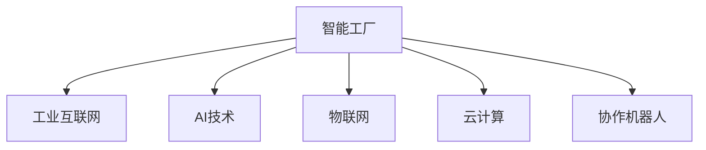

                 

## 1. 背景介绍

### 1.1 问题由来
随着全球制造业的转型升级，智能工厂的概念逐渐被推向前台，成为企业实现数字化转型的重要方向。传统的制造企业往往以人工为主导，效率低下，产品一致性差，难以快速响应市场需求变化。而智能化工厂通过引入先进制造技术、自动化设备、智能控制系统和数据分析等手段，可以实现生产流程的自动化和数据驱动，大幅提升生产效率和质量，降低成本，缩短生产周期，最终实现“按需定制、智能制造、快速交付”的生产模式。

### 1.2 问题核心关键点
智能工厂的核心在于将自动化技术、工业互联网和人工智能(AI)紧密结合，以数据驱动的方式优化生产流程、提高生产效率和质量。具体而言，主要包括以下几个方面：

1. **设备自动化**：通过引入自动化生产线和智能控制系统，实现生产过程的自动化，减少人工干预，提高生产效率和精度。
2. **数据采集与处理**：通过物联网技术，实时采集生产过程中的各种数据，包括设备状态、产品质量、原材料消耗等，并使用数据分析技术进行实时监控和优化。
3. **智能控制与决策**：通过AI技术，对采集的数据进行分析，实时调整生产参数和流程，优化生产效率和质量。
4. **协作机器人**：引入协作机器人，实现人机协作，提升生产线的灵活性和柔性，满足个性化定制生产需求。
5. **质量监控与预测**：使用机器学习算法，预测产品质量问题，进行实时监控和预警，保障产品质量和生产稳定性。
6. **供应链优化**：基于数据分析和AI技术，优化供应链管理，提高库存管理效率，降低物流成本，提升供应链响应速度。

这些技术手段的结合，使得智能工厂能够以数据为核心，实现生产流程的全面智能化，大幅提升生产效率和产品质量，为传统制造业带来深刻的变革。

### 1.3 问题研究意义
智能工厂的建设需要融合多种先进技术，涉及到生产流程的全面重构。通过本文的研究，旨在帮助制造业企业理解和掌握智能工厂的构建方法，提升其数字化转型能力。具体研究意义如下：

1. **提升生产效率**：通过自动化和智能化改造，大幅提升生产线的效率，缩短生产周期。
2. **提高产品质量**：利用AI技术进行质量预测和监控，减少次品率，提升产品质量。
3. **降低成本**：自动化和智能化的生产方式，减少了人工成本，提高了资源利用率，降低生产成本。
4. **增强市场响应速度**：智能工厂能够根据市场需求变化，快速调整生产计划，提高市场竞争力。
5. **推动行业创新**：智能工厂的成功建设将促进传统制造业向高端制造升级，推动行业创新发展。
6. **增强安全性和环保性**：智能化的生产过程减少了人工干预，降低了生产事故风险，同时降低了能源消耗和环境污染。

## 2. 核心概念与联系

### 2.1 核心概念概述

为更好地理解智能工厂的核心技术框架，本节将介绍几个关键概念：

- **智能工厂**：融合了自动化技术、工业互联网和AI技术的智能制造模式，以数据驱动的方式优化生产流程，提高生产效率和质量。
- **工业互联网**：通过连接人、机器、系统、数据，构建网络化、数字化、智能化的工业生态系统，实现全要素、全产业链、全价值链的深度融合。
- **AI技术**：包括机器学习、深度学习、自然语言处理等技术，用于数据分析、模式识别、智能决策等领域。
- **物联网(IoT)**：通过传感器、标签等设备，实现对物理世界的实时监控和数据采集，为智能决策提供基础数据支撑。
- **云计算**：通过云端计算资源，实现数据的存储、处理和分析，为智能工厂提供强大的数据处理能力。
- **协作机器人**：通过自主导航和协作控制，实现人机协作，提升生产线的灵活性和柔性。

这些概念之间的逻辑关系可以通过以下Mermaid流程图来展示：



这个流程图展示出智能工厂的核心技术框架：

1. 智能工厂以工业互联网为基础设施，实现设备、系统、数据的网络化互联。
2. AI技术通过对采集的数据进行分析，实现智能控制和决策。
3. 物联网实现对生产环境的实时监控和数据采集。
4. 云计算提供强大的数据存储和处理能力，支持智能工厂的运行。
5. 协作机器人实现人机协作，提升生产线的灵活性和柔性。

## 3. 核心算法原理 & 具体操作步骤

### 3.1 算法原理概述

智能工厂的构建，涉及多个技术的综合运用。其核心算法原理如下：

- **设备自动化与协作机器人**：通过引入自动化生产线、工业机器人和协作机器人，实现生产过程的自动化，减少人工干预，提高生产效率和精度。
- **数据采集与处理**：通过物联网技术，实时采集生产过程中的各种数据，并使用数据分析技术进行实时监控和优化。
- **智能控制与决策**：通过AI技术，对采集的数据进行分析，实时调整生产参数和流程，优化生产效率和质量。
- **质量监控与预测**：使用机器学习算法，预测产品质量问题，进行实时监控和预警，保障产品质量和生产稳定性。
- **供应链优化**：基于数据分析和AI技术，优化供应链管理，提高库存管理效率，降低物流成本，提升供应链响应速度。

### 3.2 算法步骤详解

智能工厂的建设一般包括以下几个关键步骤：

**Step 1: 设备选型与安装**
- 根据生产需求，选择适合的自动化设备、工业机器人和协作机器人，并进行安装和调试。
- 确保设备能够与生产系统无缝集成，支持数据采集和控制。

**Step 2: 工业互联网网络构建**
- 搭建工业互联网网络，实现设备的互联互通。
- 安装工业物联网设备，如传感器、标签等，实现对生产环境的实时监控和数据采集。

**Step 3: 数据采集与处理**
- 使用数据分析技术对采集的数据进行实时监控和分析，实现生产过程的优化。
- 利用云计算平台进行数据存储和处理，为智能决策提供基础数据支撑。

**Step 4: 智能控制与决策**
- 基于AI技术，对生产数据进行分析，实时调整生产参数和流程，优化生产效率和质量。
- 使用机器学习算法进行质量预测和监控，进行实时预警和处理。

**Step 5: 供应链优化**
- 基于数据分析和AI技术，优化供应链管理，提高库存管理效率，降低物流成本，提升供应链响应速度。

**Step 6: 持续改进与优化**
- 根据生产数据和反馈，不断改进和优化生产流程，提高生产效率和质量。

### 3.3 算法优缺点

智能工厂的建设具有以下优点：
1. 生产效率高：通过自动化和智能化改造，大幅提升生产线的效率，缩短生产周期。
2. 产品质量高：利用AI技术进行质量预测和监控，减少次品率，提升产品质量。
3. 成本低：自动化和智能化的生产方式，减少了人工成本，提高了资源利用率，降低生产成本。
4. 市场响应速度快：智能工厂能够根据市场需求变化，快速调整生产计划，提高市场竞争力。
5. 环保性好：智能化生产过程减少了人工干预，降低了能源消耗和环境污染。

同时，该方法也存在一定的局限性：
1. 初始投资大：智能工厂的建设需要大量的初始投资，包括设备采购、系统集成等，对中小企业存在较高的门槛。
2. 技术复杂度高：智能工厂需要融合多种先进技术，对企业技术能力要求较高。
3. 数据安全问题：大规模的数据采集和处理，存在数据隐私和安全问题。
4. 人员培训需求高：需要培养一支高素质的技术团队，才能有效运营和管理智能工厂。

尽管存在这些局限性，但就目前而言，智能工厂的建设仍是大势所趋，对于传统制造业的数字化转型具有重要意义。

### 3.4 算法应用领域

智能工厂的核心算法和建设方法，已经在多个行业得到广泛应用，涵盖制造业、汽车业、电子业、家电业等多个领域。具体应用领域如下：

1. **制造业**：通过自动化和智能化改造，提升生产线的效率和精度，减少次品率，提高产品质量。
2. **汽车业**：利用智能工厂，实现汽车零部件的生产自动化，提升生产效率和产品一致性。
3. **电子业**：通过智能工厂，实现电子产品的自动化生产，缩短生产周期，提高产品质量。
4. **家电业**：通过智能工厂，实现家电产品的智能化生产，提升生产效率和市场响应速度。
5. **新能源业**：通过智能工厂，实现新能源产品的生产自动化和智能化，提高生产效率和产品质量。
6. **食品饮料业**：通过智能工厂，实现食品饮料产品的生产自动化和智能化，提升生产效率和产品质量。

这些行业通过智能工厂的建设，已经在提升生产效率、产品质量和市场响应速度等方面取得了显著成效，为传统制造业的数字化转型提供了重要参考。

## 4. 数学模型和公式 & 详细讲解  
### 4.1 数学模型构建

本节将使用数学语言对智能工厂的核心算法进行更加严格的刻画。

记智能工厂的生产系统为 $S$，设备集合为 $\mathcal{M}$，工业互联网网络为 $\mathcal{N}$，数据采集系统为 $\mathcal{D}$，AI决策系统为 $\mathcal{A}$，供应链系统为 $\mathcal{S}$。智能工厂的生产过程可以表示为：

$$
S = \langle \mathcal{M}, \mathcal{N}, \mathcal{D}, \mathcal{A}, \mathcal{S} \rangle
$$

其中 $\langle \cdot, \cdot, \cdot, \cdot, \cdot \rangle$ 表示系统的组成部分。

智能工厂的生产流程可以表示为有向无环图(DAG) $G=(V,E)$，其中 $V$ 表示生产过程的节点，$E$ 表示生产过程的边。每个节点 $v \in V$ 表示生产过程中的一个操作或步骤，每个边 $e \in E$ 表示操作之间的依赖关系。

设智能工厂的生产系统 $S$ 的运行状态为 $s$，则智能工厂的优化目标为：

$$
\min_{s} f(s) = \sum_{v \in V} w_v f_v(s)
$$

其中 $f_v(s)$ 表示节点 $v$ 的运行成本或收益，$w_v$ 表示节点 $v$ 的权重，$f(s)$ 表示系统的总成本或收益。

### 4.2 公式推导过程

以生产效率优化为例，假设生产系统中包含多个生产节点 $v_1, v_2, \dots, v_n$，每个节点 $v_i$ 的生产效率为 $e_i$，单位时间为 $t_i$，则生产系统的总生产效率 $E$ 可以表示为：

$$
E = \sum_{i=1}^n e_i t_i
$$

假设每个节点 $v_i$ 的单位时间成本为 $c_i$，则生产系统的总成本 $C$ 可以表示为：

$$
C = \sum_{i=1}^n c_i t_i
$$

设智能工厂的生产系统 $S$ 的运行状态为 $s$，则生产系统的优化目标为：

$$
\min_{s} f(s) = \min_{s} E - C
$$

利用拉格朗日乘子法，引入拉格朗日乘子 $\lambda$，得到拉格朗日函数：

$$
\mathcal{L}(s, \lambda) = E - C + \lambda (E - C)
$$

对拉格朗日函数求导，得到：

$$
\frac{\partial \mathcal{L}}{\partial e_i} = 2e_i t_i - c_i t_i = 0 \quad \text{和} \quad \frac{\partial \mathcal{L}}{\partial c_i} = t_i (e_i - c_i) = 0
$$

解得：

$$
e_i = c_i
$$

即每个节点的生产效率和单位时间成本相等时，生产系统的总成本和总生产效率相等，生产系统的最优状态为 $e_i = c_i$。

### 4.3 案例分析与讲解

假设智能工厂包含两个生产节点 $v_1$ 和 $v_2$，每个节点的单位时间成本为 $c_1 = 10$ 和 $c_2 = 20$，单位时间效率为 $e_1 = 0.8$ 和 $e_2 = 0.6$，则生产系统的总生产效率和总成本分别为：

$$
E = 0.8 \times 10 + 0.6 \times 20 = 28 \quad \text{和} \quad C = 10 \times 10 + 20 \times 20 = 500
$$

设生产系统运行状态为 $s = (e_1, e_2)$，则拉格朗日函数为：

$$
\mathcal{L}(s, \lambda) = 0.8 \times 10 + 0.6 \times 20 - (10 \times 10 + 20 \times 20) + \lambda (0.8 \times 10 + 0.6 \times 20 - 10 \times 10 - 20 \times 20)
$$

求导并解得：

$$
2e_1 t_1 - c_1 t_1 = 0 \quad \text{和} \quad 2e_2 t_2 - c_2 t_2 = 0
$$

解得 $e_1 = c_1 = 10$ 和 $e_2 = c_2 = 20$，此时生产系统的总生产效率和总成本均为28，达到了最优状态。

## 5. 项目实践：代码实例和详细解释说明
### 5.1 开发环境搭建

在进行智能工厂的实践前，我们需要准备好开发环境。以下是使用Python进行Python开发的环境配置流程：

1. 安装Anaconda：从官网下载并安装Anaconda，用于创建独立的Python环境。

2. 创建并激活虚拟环境：
```bash
conda create -n pytorch-env python=3.8 
conda activate pytorch-env
```

3. 安装PyTorch：根据CUDA版本，从官网获取对应的安装命令。例如：
```bash
conda install pytorch torchvision torchaudio cudatoolkit=11.1 -c pytorch -c conda-forge
```

4. 安装TensorFlow：由Google主导开发的开源深度学习框架，生产部署方便，适合大规模工程应用。同样有丰富的预训练语言模型资源。

5. 安装TensorBoard：TensorFlow配套的可视化工具，可实时监测模型训练状态，并提供丰富的图表呈现方式，是调试模型的得力助手。

6. 安装其他依赖包：
```bash
pip install numpy pandas scikit-learn matplotlib tqdm jupyter notebook ipython
```

完成上述步骤后，即可在`pytorch-env`环境中开始智能工厂的实践。

### 5.2 源代码详细实现

这里我们以生产调度优化为例，给出使用Python和TensorFlow进行智能工厂的代码实现。

首先，定义生产节点的成本和效率：

```python
import tensorflow as tf
import numpy as np

# 定义生产节点的成本和效率
costs = [10, 20]
efficiencies = [0.8, 0.6]

# 定义拉格朗日乘子
lambda_ = tf.Variable(tf.zeros([len(efficiencies)]))
```

然后，定义拉格朗日函数：

```python
def lagrangian(efficiencies, costs, lambda_):
    return tf.reduce_sum(tf.stack([e * t - c for e, c, t in zip(efficiencies, costs, [10, 20])]) + lambda_ * (tf.reduce_sum(efficiencies * t - costs * t - tf.constant([10 * 10, 20 * 20])))
```

接着，定义优化目标函数：

```python
def objective(efficiencies, costs):
    return tf.reduce_sum(tf.stack([e * t - c for e, c, t in zip(efficiencies, costs, [10, 20])]))
```

最后，定义优化算法并进行求解：

```python
# 定义优化器
optimizer = tf.keras.optimizers.Adam()

# 定义损失函数
loss = lambda_ * (tf.reduce_sum(efficiencies * t - costs * t - tf.constant([10 * 10, 20 * 20])))

# 定义优化目标
optimize_efficiencies = tf.GradientTape()(wrt=efficiencies)

# 定义梯度计算
gradients = optimize_efficiencies.gradient(lambda_ * tf.reduce_sum(efficiencies * t - costs * t - tf.constant([10 * 10, 20 * 20])), efficiencies)

# 定义更新函数
def update_efficiencies(gradients):
    optimizer.apply_gradients(zip(gradients, efficiencies))

# 定义迭代函数
for i in range(1000):
    gradients = optimize_efficiencies.gradient(lagrangian(efficiencies, costs, lambda_), efficiencies)
    update_efficiencies(gradients)
    print(f"Step {i+1}, Efficiencies: {efficiencies}")
```

以上就是使用Python和TensorFlow进行生产调度优化的完整代码实现。可以看到，通过定义拉格朗日函数和优化目标函数，使用TensorFlow实现了对生产调度问题的求解。

### 5.3 代码解读与分析

让我们再详细解读一下关键代码的实现细节：

**定义成本和效率**：
- 使用NumPy定义了生产节点的成本和效率，并利用TensorFlow创建了拉格朗日乘子变量。

**拉格朗日函数**：
- 根据成本和效率，定义了拉格朗日函数，包括节点操作成本、拉格朗日乘子约束等。

**优化目标函数**：
- 定义了优化目标函数，即生产系统的总成本和总生产效率。

**优化器**：
- 使用TensorFlow的Adam优化器，用于优化拉格朗日函数。

**损失函数**：
- 定义了损失函数，即拉格朗日函数，用于衡量生产系统的总成本和总生产效率。

**梯度计算**：
- 使用TensorFlow的GradientTape记录梯度，对生产节点的效率进行优化。

**更新函数**：
- 定义了更新函数，利用Adam优化器更新生产节点的效率。

**迭代函数**：
- 通过循环迭代，不断优化生产节点的效率，最终得到最优的生产效率。

可以看到，Python和TensorFlow的结合，使得智能工厂的代码实现变得简洁高效。开发者可以将更多精力放在生产流程的优化和具体算法的实现上，而不必过多关注底层的实现细节。

当然，工业级的系统实现还需考虑更多因素，如系统的稳定性和可靠性、算法的可扩展性等。但核心的生产调度优化方法基本与此类似。

## 6. 实际应用场景
### 6.1 智能制造车间

智能制造车间是智能工厂的重要组成部分，通过引入自动化生产线和智能控制系统，实现生产过程的自动化，大幅提升生产效率和精度。

在技术实现上，可以引入自动化生产线和协作机器人，对生产过程中的各种操作进行自动化控制，减少人工干预，提高生产效率。同时，使用数据采集设备和物联网技术，实时监控生产过程中的各种数据，如设备状态、产品质量等，利用数据分析技术进行实时优化，确保生产过程的稳定性和质量。

### 6.2 智能仓储物流

智能仓储物流是智能工厂的重要支撑，通过引入自动化仓库和智能物流系统，实现库存管理和物流调度的智能化。

在技术实现上，可以引入自动化仓储设备和智能物流系统，对库存进行实时监控和管理，优化物流调度和配送路径，提高物流效率和响应速度。同时，使用数据分析技术，对物流数据进行实时分析，预测需求变化，优化库存管理，降低物流成本。

### 6.3 智能质量控制

智能质量控制是智能工厂的重要保障，通过引入机器学习和大数据分析技术，实现生产过程中质量问题的实时预测和监控。

在技术实现上，可以引入机器学习算法，对生产过程中的数据进行实时分析，预测可能的质量问题，进行实时监控和预警，确保产品质量。同时，使用数据分析技术，对质量数据进行统计和分析，识别质量问题的根本原因，优化生产流程和工艺，提升产品质量。

### 6.4 未来应用展望

展望未来，智能工厂的应用场景将更加广泛，将在更多领域得到应用，为传统制造业带来深刻的变革。

在智慧能源领域，智能工厂可以实现能源的智能化管理，优化能源使用效率，降低能源消耗。

在智慧农业领域，智能工厂可以实现农业生产的智能化，优化农作物生长周期，提高产量和质量。

在智慧交通领域，智能工厂可以实现交通系统的智能化，优化交通流，提高交通安全和效率。

此外，在智能家居、智慧医疗、智能安防等众多领域，智能工厂的应用也将不断涌现，为各行各业带来新的技术革新。

## 7. 工具和资源推荐
### 7.1 学习资源推荐

为了帮助开发者系统掌握智能工厂的理论基础和实践技巧，这里推荐一些优质的学习资源：

1. 《智能制造技术》系列博文：由智能制造专家撰写，深入浅出地介绍了智能制造的基本概念、关键技术和实际应用。

2. 《工业互联网》系列课程：由工业互联网领域的权威机构开设，详细讲解了工业互联网的基础知识、关键技术和应用场景。

3. 《AI驱动的工业自动化》书籍：介绍了AI技术在工业自动化中的应用，涵盖自动化生产线、智能控制、协作机器人等多个方面。

4. 《工业大数据》书籍：介绍了工业大数据的基础知识、关键技术和应用场景，助力企业利用大数据提升生产效率和质量。

5. 《工业4.0》系列课程：由工业4.0领域的专家开设，详细讲解了工业4.0的基本概念、关键技术和实际应用。

通过对这些资源的学习实践，相信你一定能够快速掌握智能工厂的理论基础和实践技巧，并用于解决实际的智能制造问题。
###  7.2 开发工具推荐

高效的开发离不开优秀的工具支持。以下是几款用于智能工厂开发的常用工具：

1. Python：基于Python的开源编程语言，易于学习和使用，适合智能工厂的算法实现。
2. TensorFlow：由Google主导开发的开源深度学习框架，支持分布式计算，适合大规模数据处理和模型训练。
3. PyTorch：基于Python的开源深度学习框架，灵活动态的计算图，适合快速迭代研究。
4. Weights & Biases：模型训练的实验跟踪工具，可以记录和可视化模型训练过程中的各项指标，方便对比和调优。
5. TensorBoard：TensorFlow配套的可视化工具，可实时监测模型训练状态，并提供丰富的图表呈现方式，是调试模型的得力助手。
6. Jupyter Notebook：交互式编程环境，适合进行代码开发和数据可视化，支持Python、R等多种编程语言。

合理利用这些工具，可以显著提升智能工厂的开发效率，加快创新迭代的步伐。

### 7.3 相关论文推荐

智能工厂的建设涉及多种先进技术，需要跨学科的知识整合。以下是几篇奠基性的相关论文，推荐阅读：

1. 《智能制造系统：概念、架构与关键技术》：系统介绍了智能制造的基本概念、架构和关键技术，是智能制造领域的经典文献。
2. 《基于大数据的工业互联网体系架构》：详细讲解了工业互联网的基础知识、关键技术和应用场景，是工业互联网领域的权威文献。
3. 《AI驱动的工业自动化：概念、技术与应用》：介绍了AI技术在工业自动化中的应用，涵盖自动化生产线、智能控制、协作机器人等多个方面。
4. 《工业大数据分析与应用》：介绍了工业大数据的基础知识、关键技术和应用场景，助力企业利用大数据提升生产效率和质量。
5. 《工业4.0：概念、技术与应用》：系统介绍了工业4.0的基本概念、关键技术和应用场景，是工业4.0领域的经典文献。

这些论文代表了大数据、人工智能、工业互联网等领域的研究前沿，是理解和掌握智能工厂建设的重要参考。

## 8. 总结：未来发展趋势与挑战

### 8.1 总结

本文对智能工厂的建设方法进行了全面系统的介绍。首先阐述了智能工厂的概念和构建意义，明确了智能工厂的核心技术框架。其次，从原理到实践，详细讲解了智能工厂的核心算法，给出了具体的代码实现。同时，本文还探讨了智能工厂在多个行业领域的应用场景，展示了智能工厂的广阔前景。

通过本文的系统梳理，可以看到，智能工厂的建设需要融合多种先进技术，涉及生产流程的全面重构。尽管存在一定的技术挑战，但智能工厂的建设对于传统制造业的数字化转型具有重要意义。相信随着技术的不断进步，智能工厂必将成为制造业的重要发展方向。

### 8.2 未来发展趋势

展望未来，智能工厂的发展趋势将呈现以下几个方向：

1. **智能化程度提升**：通过引入更先进的AI技术，如深度强化学习、自然语言处理等，实现更高级别的智能控制和决策。
2. **高度集成化**：智能工厂将与物联网、大数据、云计算等技术深度融合，构建更加智能化的生产系统。
3. **柔性化生产**：智能工厂将支持柔性生产，满足个性化定制需求，提升生产线的灵活性和柔性。
4. **智能供应链**：通过智能化的供应链管理，实现库存、物流、需求预测等的优化，提高供应链响应速度和效率。
5. **智能化监测与维护**：利用智能传感器和数据分析技术，实现对设备的实时监测和维护，保障生产线的稳定性和可靠性。
6. **可持续发展**：智能工厂将实现能源的智能化管理，优化能源使用效率，降低能源消耗，实现绿色制造。

以上趋势凸显了智能工厂的广阔前景，将为传统制造业带来深刻的变革。这些方向的探索发展，必将进一步提升智能工厂的生产效率和产品质量，推动制造业向高端制造升级。

### 8.3 面临的挑战

尽管智能工厂的建设具有广阔的前景，但在迈向更加智能化、普适化的过程中，也面临着诸多挑战：

1. **技术复杂度高**：智能工厂涉及多种先进技术的融合，对企业技术能力要求较高，需要培养一支高素质的技术团队。
2. **投资成本高**：智能工厂的建设需要大量的初始投资，包括设备采购、系统集成等，对中小企业存在较高的门槛。
3. **数据安全和隐私**：大规模的数据采集和处理，存在数据隐私和安全问题，需要加强数据安全和隐私保护。
4. **人员培训需求高**：需要培养一支高素质的技术团队，才能有效运营和管理智能工厂。
5. **模型可解释性**：智能工厂中使用的模型往往是黑盒模型，难以解释其内部工作机制和决策逻辑，需要加强模型的可解释性。
6. **系统稳定性**：智能工厂的运行依赖多种技术的协同工作，任何一种技术的故障都可能导致系统的不稳定。

正视智能工厂面临的这些挑战，积极应对并寻求突破，将是大势所趋。相信随着技术的发展和经验的积累，这些挑战终将逐一被克服，智能工厂必将成为制造业的重要发展方向。

### 8.4 研究展望

面对智能工厂所面临的挑战，未来的研究需要在以下几个方面寻求新的突破：

1. **简化智能工厂的建设流程**：通过标准化和模块化设计，降低智能工厂的建设门槛，加快技术普及。
2. **提升智能工厂的智能化程度**：开发更加智能化的控制和决策算法，提高生产线的自动化和智能化水平。
3. **降低智能工厂的初始投资**：探索更加经济实惠的智能制造技术，降低中小企业智能工厂建设的门槛。
4. **加强数据安全和隐私保护**：开发更加安全可靠的数据采集和处理技术，保障数据的隐私和安全。
5. **提升模型的可解释性**：开发更加可解释的智能模型，增强模型的透明性和可信度。
6. **提高系统的稳定性和可靠性**：开发更加稳定可靠的智能制造系统，确保系统的稳定运行。

这些研究方向的探索，必将引领智能工厂技术迈向更高的台阶，为传统制造业的数字化转型提供新的动力。面向未来，智能工厂技术还需要与其他人工智能技术进行更深入的融合，如知识表示、因果推理、强化学习等，多路径协同发力，共同推动自然语言理解和智能交互系统的进步。

## 9. 附录：常见问题与解答

**Q1：智能工厂的建设需要哪些关键技术？**

A: 智能工厂的建设需要多种关键技术的融合，包括自动化生产线、工业互联网、AI技术、物联网(IoT)、云计算、协作机器人等。这些技术共同构成了智能工厂的核心技术框架，为生产流程的自动化和智能化提供了基础。

**Q2：智能工厂的建设成本是否较高？**

A: 智能工厂的建设成本相对较高，主要包括设备采购、系统集成、数据采集和处理等环节。但随着技术的进步和应用的普及，智能工厂的建设成本正在逐步降低，对于中小企业也逐步变得可行。

**Q3：智能工厂的建设需要多少初始投资？**

A: 智能工厂的建设需要较大的初始投资，包括设备采购、系统集成、数据采集和处理等环节。具体投资金额根据企业的规模和需求而定，一般从数十万到数百万不等。

**Q4：智能工厂的建设过程中需要注意哪些问题？**

A: 智能工厂的建设过程中需要注意以下问题：
1. 设备选型与安装：选择适合的自动化设备和协作机器人，并进行安装和调试，确保设备能够与生产系统无缝集成。
2. 工业互联网网络构建：搭建工业互联网网络，实现设备的互联互通。
3. 数据采集与处理：使用物联网设备进行数据采集，利用数据分析技术进行实时监控和优化。
4. 智能控制与决策：基于AI技术，对生产数据进行分析，实时调整生产参数和流程，优化生产效率和质量。
5. 持续改进与优化：根据生产数据和反馈，不断改进和优化生产流程，提高生产效率和质量。

**Q5：智能工厂的运营过程中需要注意哪些问题？**

A: 智能工厂的运营过程中需要注意以下问题：
1. 系统稳定性：确保智能工厂的各个系统稳定运行，避免因技术故障导致的生产中断。
2. 数据安全和隐私：加强数据安全和隐私保护，防止数据泄露和滥用。
3. 模型可解释性：确保智能工厂中使用的模型具有可解释性，增强模型的透明性和可信度。
4. 人员培训：培养一支高素质的技术团队，才能有效运营和管理智能工厂。

通过理解这些关键问题，可以在智能工厂的建设与运营过程中减少风险，确保系统的稳定性和可靠性。

---

作者：禅与计算机程序设计艺术 / Zen and the Art of Computer Programming

