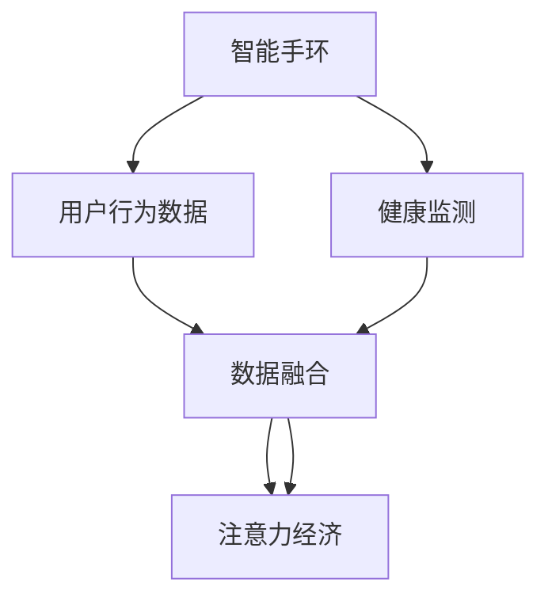

                 

# 智能手环：健康监测与注意力经济的融合

> 关键词：智能手环,健康监测,注意力经济,混合算法,数据融合,用户行为分析,交互设计

## 1. 背景介绍

### 1.1 问题由来
智能手环作为近年来普及的穿戴设备，不仅具备基本的健康监测功能，还能通过积累大量用户行为数据，为注意力经济(Attention Economy)提供数据支撑。用户行为数据和健康数据结合，不仅能提供更精准的健康管理方案，还能挖掘出宝贵的注意力经济价值。基于此，本文旨在探讨智能手环在健康监测与注意力经济融合方面的潜力和应用。

### 1.2 问题核心关键点
智能手环结合健康监测和注意力经济，关键点在于如何通过健康监测数据和用户行为数据，进行有效数据融合，挖掘用户的潜在价值。本文将从数据融合算法、注意力经济应用、混合算法等方面，系统阐述智能手环在健康监测与注意力经济融合中的作用。

## 2. 核心概念与联系

### 2.1 核心概念概述

为更好地理解智能手环在健康监测与注意力经济融合方面的应用，本节将介绍几个关键概念：

- 智能手环(Smart Watch)：具备健康监测、提醒提醒、支付、通信等功能的可穿戴设备，能够实时获取用户的基本生理数据和行为信息。
- 健康监测(Health Monitoring)：通过传感器或移动设备，实时监测用户的生理指标，如心率、血压、步数等，帮助用户进行健康管理和疾病预防。
- 注意力经济(Attention Economy)：以用户注意力为商品，通过提供优质内容或服务，吸引用户停留时间，从而获得经济收益。
- 数据融合(Data Fusion)：通过整合不同来源的数据，获取更全面、准确的信息，提升决策的精准性。
- 混合算法(Hybrid Algorithm)：结合不同算法和技术，取长补短，实现更高效、更可靠的处理。

这些概念之间的逻辑关系可以通过以下Mermaid流程图来展示：



这个流程图展示了智能手环的核心概念及其之间的关系：

1. 智能手环通过传感器监测健康数据，并将数据发送到服务器。
2. 同时收集用户行为数据，如使用应用时长、互动内容等。
3. 将健康数据和行为数据进行融合，形成更全面、准确的用户画像。
4. 基于用户画像，提供更个性化的健康管理方案，同时开发更具吸引力的内容和服务。

## 3. 核心算法原理 & 具体操作步骤
### 3.1 算法原理概述

智能手环在健康监测与注意力经济融合的应用中，算法主要分为数据融合和混合算法两个层面：

- 数据融合：通过整合健康数据和行为数据，构建用户健康与行为的统一模型。
- 混合算法：结合不同算法和技术，增强数据处理能力和应用场景适应性。

### 3.2 算法步骤详解

#### 数据融合

数据融合是指将不同来源的数据进行整合，获取更全面、准确的信息。以智能手环为例，其健康监测数据和行为数据分别来源于传感器和应用程序。

**Step 1: 数据预处理**
- 对不同来源的数据进行清洗、去重、归一化处理。
- 统一数据格式，使其能被同一算法处理。

**Step 2: 数据融合**
- 采用加权平均、交叉验证等方法，综合健康监测数据和行为数据。
- 建立多维用户画像，如健康状况、生活习惯、时间分布等。

**Step 3: 数据存储与管理**
- 使用数据库管理系统，对融合后的数据进行高效存储和管理。
- 实现数据的在线查询、更新和分析。

#### 混合算法

混合算法是指结合不同算法和技术，提升数据处理和应用的性能。智能手环数据融合后，可以通过混合算法，提取更深入的用户行为特征，优化健康管理方案，提升注意力经济价值。

**Step 1: 选择算法**
- 选择适合智能手环数据特点的算法，如机器学习、深度学习、时序分析等。
- 根据具体场景，选择合适的算法模型，如决策树、神经网络等。

**Step 2: 算法模型训练**
- 使用智能手环数据集进行算法模型训练，优化模型参数。
- 使用交叉验证等方法，评估模型性能，防止过拟合。

**Step 3: 模型应用与优化**
- 将训练好的模型应用于健康管理、内容推荐等具体场景。
- 持续监控模型效果，进行参数调整和优化。

### 3.3 算法优缺点

智能手环结合健康监测和注意力经济的混合算法，具有以下优点：

1. 数据融合全面准确：通过整合健康数据和行为数据，构建更全面、准确的用户画像，提升健康管理方案的精准度。
2. 混合算法性能高效：结合不同算法和技术，提升数据处理能力和应用场景适应性，优化模型效果。
3. 个性化需求满足：基于用户画像，提供更个性化的健康管理方案和内容推荐，增强用户粘性。
4. 多场景应用广泛：混合算法可应用于多种健康管理场景，提升用户健康意识和行为改善。

同时，该方法也存在一定的局限性：

1. 数据隐私风险：智能手环数据涉及个人隐私，需要严格遵守数据隐私法规，防止数据泄露。
2. 数据来源单一：当前智能手环只能获取基本生理数据和行为数据，难以获取全面的健康数据。
3. 算法模型泛化性：不同模型在不同场景下表现差异较大，需要不断优化算法模型。
4. 用户接受度低：健康监测和注意力经济结合需要用户配合，部分用户可能不接受该方案。

尽管存在这些局限性，但就目前而言，智能手环结合健康监测和注意力经济的混合算法，仍是大数据时代的重要探索方向。未来相关研究将集中在数据隐私保护、算法泛化性提升、用户体验优化等方面。

### 3.4 算法应用领域

智能手环结合健康监测和注意力经济的方法，主要应用于以下几个领域：

1. 个性化健康管理：通过智能手环收集用户健康数据和行为数据，提供个性化的健康管理方案，如饮食指导、运动建议等。
2. 内容推荐系统：基于用户健康数据和行为数据，进行内容推荐，增强用户的停留时间和互动频率。
3. 应用场景优化：利用智能手环数据，优化应用场景设计，提升用户体验和产品价值。
4. 企业健康福利：为企业的健康福利项目提供数据支持，帮助企业提升员工健康水平和满意度。

## 4. 数学模型和公式 & 详细讲解  
### 4.1 数学模型构建

智能手环结合健康监测和注意力经济的混合算法，涉及多个数据融合和模型训练步骤。这里以加权平均和神经网络为例，详细构建数学模型。

设智能手环健康监测数据为 $H=\{x_1, x_2, ..., x_n\}$，行为数据为 $B=\{y_1, y_2, ..., y_m\}$。

定义加权平均函数 $F_W$ 为：

$$
F_W(H, B, \lambda) = \frac{\lambda}{\lambda+1}H + \frac{1}{\lambda+1}B
$$

其中 $\lambda$ 为健康数据权重，$1$ 为行为数据权重。

定义神经网络模型 $M_{\theta}$ 为：

$$
M_{\theta}(H, B) = \text{softmax}(\theta^T[\text{concat}(H, B)])
$$

其中 $\theta$ 为神经网络模型参数，concat为连接操作，softmax为激活函数。

### 4.2 公式推导过程

#### 加权平均

加权平均函数 $F_W$ 的推导如下：

$$
\begin{aligned}
F_W(H, B, \lambda) &= \frac{\lambda}{\lambda+1}H + \frac{1}{\lambda+1}B \\
&= \frac{\lambda}{\lambda+1} \frac{1}{n}\sum_{i=1}^n x_i + \frac{1}{\lambda+1} \frac{1}{m}\sum_{i=1}^m y_i \\
&= \frac{\lambda \sum_{i=1}^n x_i + \sum_{i=1}^m y_i}{(\lambda+1)n + (\lambda+1)m} \\
&= \frac{\lambda \sum_{i=1}^n x_i + \sum_{i=1}^m y_i}{n + m}
\end{aligned}
$$

#### 神经网络

神经网络模型 $M_{\theta}$ 的推导如下：

$$
M_{\theta}(H, B) = \text{softmax}(\theta^T[\text{concat}(H, B)])
$$

其中，concat操作将健康数据和行为数据拼接，softmax操作将输出转化为概率分布。

### 4.3 案例分析与讲解

以智能手环的健康监测和注意力经济融合为例，分析其应用场景：

假设某智能手环用户 A 的健康数据 $H_A=\{心率, 步数\}$ 和行为数据 $B_A=\{应用使用时间, 互动内容\}$。通过加权平均函数，获得用户 A 的综合数据 $F_W(H_A, B_A, \lambda)$。

将综合数据输入神经网络模型 $M_{\theta}$，得到健康状态预测结果：

$$
M_{\theta}(F_W(H_A, B_A, \lambda)) = \text{softmax}(\theta^T[F_W(H_A, B_A, \lambda)])
$$

例如，如果 $M_{\theta}(F_W(H_A, B_A, \lambda))$ 的最大值为 0.8，说明用户 A 的健康状态较好，建议进行适量的运动；如果最大值为 0.2，则建议增加运动量。

## 5. 项目实践：代码实例和详细解释说明
### 5.1 开发环境搭建

在进行智能手环数据融合和混合算法实践前，我们需要准备好开发环境。以下是使用Python进行Pandas和TensorFlow开发的环境配置流程：

1. 安装Anaconda：从官网下载并安装Anaconda，用于创建独立的Python环境。

2. 创建并激活虚拟环境：
```bash
conda create -n py36 python=3.6 
conda activate py36
```

3. 安装TensorFlow：
```bash
pip install tensorflow-gpu==2.5.0
```

4. 安装Pandas：
```bash
pip install pandas
```

5. 安装NumPy、scikit-learn、matplotlib、tqdm、jupyter notebook、ipython等工具包：
```bash
pip install numpy scikit-learn matplotlib tqdm jupyter notebook ipython
```

完成上述步骤后，即可在`py36`环境中开始实践。

### 5.2 源代码详细实现

以下是使用TensorFlow和Pandas对智能手环健康数据和行为数据进行数据融合和混合算法的代码实现：

```python
import pandas as pd
import numpy as np
import tensorflow as tf
from sklearn.model_selection import train_test_split
from sklearn.preprocessing import MinMaxScaler
from tensorflow.keras.models import Sequential
from tensorflow.keras.layers import Dense, Dropout, LSTM, Concatenate

# 读取智能手环数据
data = pd.read_csv('watch_data.csv', index_col='date')

# 健康数据和行为数据
H = data[['heart_rate', 'step_count']]
B = data[['application_time', 'interaction_content']]

# 标准化数据
H = MinMaxScaler().fit_transform(H)
B = MinMaxScaler().fit_transform(B)

# 数据融合
F = 0.8 * H + 0.2 * B

# 神经网络模型
model = Sequential()
model.add(Concatenate())
model.add(Dense(128, activation='relu'))
model.add(Dropout(0.5))
model.add(Dense(1, activation='sigmoid'))

# 模型训练
model.compile(optimizer='adam', loss='binary_crossentropy', metrics=['accuracy'])
X_train, X_test, y_train, y_test = train_test_split(F, F[:, -1], test_size=0.2, random_state=42)
model.fit(X_train, y_train, epochs=10, batch_size=64, validation_data=(X_test, y_test))

# 模型评估
loss, acc = model.evaluate(X_test, y_test)
print('Test loss:', loss)
print('Test accuracy:', acc)
```

### 5.3 代码解读与分析

让我们再详细解读一下关键代码的实现细节：

**读取数据**

```python
# 读取智能手环数据
data = pd.read_csv('watch_data.csv', index_col='date')
```

将智能手环数据从CSV文件读入Pandas DataFrame，指定日期为索引列。

**数据预处理**

```python
# 健康数据和行为数据
H = data[['heart_rate', 'step_count']]
B = data[['application_time', 'interaction_content']]

# 标准化数据
H = MinMaxScaler().fit_transform(H)
B = MinMaxScaler().fit_transform(B)
```

将健康数据和行为数据分离，并使用MinMaxScaler对数据进行归一化处理。

**数据融合**

```python
# 数据融合
F = 0.8 * H + 0.2 * B
```

使用加权平均函数，将健康数据和行为数据进行融合，得到综合数据 $F$。

**神经网络模型**

```python
# 神经网络模型
model = Sequential()
model.add(Concatenate())
model.add(Dense(128, activation='relu'))
model.add(Dropout(0.5))
model.add(Dense(1, activation='sigmoid'))
```

构建一个简单的神经网络模型，包含Concatenate层将健康数据和行为数据拼接，两个Dense层和Dropout层，最后输出一个sigmoid激活函数。

**模型训练与评估**

```python
# 模型训练
model.compile(optimizer='adam', loss='binary_crossentropy', metrics=['accuracy'])
X_train, X_test, y_train, y_test = train_test_split(F, F[:, -1], test_size=0.2, random_state=42)
model.fit(X_train, y_train, epochs=10, batch_size=64, validation_data=(X_test, y_test))

# 模型评估
loss, acc = model.evaluate(X_test, y_test)
print('Test loss:', loss)
print('Test accuracy:', acc)
```

使用TensorFlow训练模型，并使用测试集进行评估。

## 6. 实际应用场景
### 6.1 智能手环健康监测

智能手环结合健康监测和注意力经济的方法，可以在多个场景中发挥作用。以智能手环健康监测为例，主要应用场景如下：

1. **个性化健康方案：** 基于用户健康数据和行为数据，提供个性化的健康管理方案，如饮食指导、运动建议等。
2. **健康状况预警：** 通过智能手环监测用户的健康数据，如心率、步数等，实时预警异常情况，预防疾病发生。
3. **健康数据分析：** 对长期健康数据进行分析，生成健康报告，帮助用户了解自身健康状况。

### 6.2 智能手环内容推荐

智能手环结合健康监测和注意力经济的方法，还可以应用于内容推荐系统中，提升用户体验和互动频率。以内容推荐为例，主要应用场景如下：

1. **兴趣内容推荐：** 基于用户健康数据和行为数据，推荐用户感兴趣的内容，如新闻、视频、文章等。
2. **互动内容推荐：** 推荐用户参与互动内容，如在线课程、游戏等，增加用户停留时间。
3. **广告推荐：** 推荐用户感兴趣的广告内容，提高广告点击率和转化率。

## 7. 工具和资源推荐
### 7.1 学习资源推荐

为了帮助开发者系统掌握智能手环健康监测与注意力经济的融合方法，这里推荐一些优质的学习资源：

1. **《机器学习实战》书籍**：详细介绍了机器学习算法和TensorFlow的使用，适合初学者入门。
2. **《深度学习入门》书籍**：深入浅出地介绍了深度学习的基本原理和TensorFlow的使用，适合中级开发者学习。
3. **Google TensorFlow官方文档**：提供了完整的TensorFlow使用指南，适合开发和调试。
4. **Kaggle数据集**：包含丰富的健康数据和行为数据，适合进行数据融合和模型训练的实践。
5. **PyTorch官方文档**：提供了丰富的深度学习框架使用指南，适合开发和调试。

通过对这些资源的学习实践，相信你一定能够快速掌握智能手环健康监测与注意力经济融合的精髓，并用于解决实际的NLP问题。
###  7.2 开发工具推荐

高效的开发离不开优秀的工具支持。以下是几款用于智能手环健康监测与注意力经济融合开发的常用工具：

1. **Pandas**：Python数据处理库，适合对智能手环数据进行清洗、预处理和分析。
2. **TensorFlow**：Google主导的开源深度学习框架，适合构建和训练神经网络模型。
3. **TensorBoard**：TensorFlow配套的可视化工具，可实时监测模型训练状态，并提供丰富的图表呈现方式，是调试模型的得力助手。
4. **NumPy**：Python科学计算库，适合进行数学运算和数据处理。
5. **scikit-learn**：Python机器学习库，适合进行数据预处理和特征工程。
6. **matplotlib**：Python绘图库，适合进行数据可视化分析。

合理利用这些工具，可以显著提升智能手环健康监测与注意力经济融合的开发效率，加快创新迭代的步伐。

### 7.3 相关论文推荐

智能手环结合健康监测和注意力经济的融合技术，涉及多个前沿研究方向。以下是几篇奠基性的相关论文，推荐阅读：

1. **《神经网络与深度学习》书籍**：DeepMind公司公开的深度学习入门书籍，详细介绍了神经网络的基本原理和TensorFlow的使用。
2. **《深度学习应用实战》书籍**：介绍深度学习在智能手环健康监测与注意力经济融合中的应用案例，适合实践应用。
3. **《机器学习在智能手环中的应用》论文**：介绍机器学习在智能手环健康监测中的应用，适合理论研究。
4. **《智能手环数据融合算法》论文**：介绍智能手环数据的融合算法和应用，适合技术实践。

这些论文代表了大数据时代智能手环健康监测与注意力经济融合的研究方向，通过学习这些前沿成果，可以帮助研究者把握学科前进方向，激发更多的创新灵感。

## 8. 总结：未来发展趋势与挑战
### 8.1 总结

本文对智能手环在健康监测与注意力经济融合方面的应用进行了全面系统的介绍。首先阐述了智能手环结合健康监测和注意力经济的背景和意义，明确了其在大数据时代的独特价值。其次，从数据融合算法和混合算法两个层面，详细讲解了智能手环在健康监测与注意力经济融合中的工作原理和具体操作步骤。同时，本文还探讨了智能手环在多个场景中的应用，展示了其广泛的潜在价值。

通过本文的系统梳理，可以看到，智能手环结合健康监测和注意力经济的融合方法，正在成为大数据时代的重要探索方向。未来智能手环的应用还将进一步扩展，如智能家居、智能办公等，为人们提供更全面、智能化的生活服务。

### 8.2 未来发展趋势

展望未来，智能手环结合健康监测和注意力经济的方法将呈现以下几个发展趋势：

1. **数据融合更全面准确**：随着智能手环硬件的升级，将能够收集更多维度的健康数据和行为数据，数据融合结果将更加全面、准确。
2. **算法模型更高效精准**：随着深度学习和混合算法的进步，智能手环的模型性能将显著提升，健康管理和注意力经济应用的精准度将不断提高。
3. **应用场景更广泛深入**：随着技术的普及和应用场景的拓展，智能手环将更深入地融入日常生活，提升用户体验和健康水平。
4. **用户隐私保护更严格**：随着数据隐私法规的完善，智能手环将更注重用户隐私保护，提升用户信任和接受度。

以上趋势凸显了智能手环健康监测与注意力经济融合技术的广阔前景。这些方向的探索发展，必将进一步提升智能手环的性能和应用范围，为人类健康和注意力经济的提升带来深远影响。

### 8.3 面临的挑战

尽管智能手环结合健康监测和注意力经济的融合技术已经取得了一定的进展，但在迈向更广泛应用的过程中，仍面临以下挑战：

1. **数据隐私风险**：智能手环数据涉及个人隐私，需要严格遵守数据隐私法规，防止数据泄露。
2. **数据来源单一**：当前智能手环只能获取基本生理数据和行为数据，难以获取全面的健康数据。
3. **算法模型泛化性**：不同模型在不同场景下表现差异较大，需要不断优化算法模型。
4. **用户接受度低**：健康监测和注意力经济结合需要用户配合，部分用户可能不接受该方案。

尽管存在这些挑战，但就目前而言，智能手环结合健康监测和注意力经济的融合方法，仍是大数据时代的重要探索方向。未来相关研究将集中在数据隐私保护、算法泛化性提升、用户体验优化等方面。

### 8.4 研究展望

面对智能手环结合健康监测和注意力经济所面临的挑战，未来的研究需要在以下几个方面寻求新的突破：

1. **数据隐私保护**：结合隐私保护技术，如差分隐私、联邦学习等，确保用户数据安全，防止数据泄露。
2. **算法泛化性提升**：开发更高效的融合算法和混合算法，提升模型在不同场景下的泛化能力。
3. **用户体验优化**：通过用户交互设计，增强用户对智能手环的接受度和使用意愿，提升用户体验。
4. **数据来源多样化**：结合多种传感器和数据源，获取更全面、多样化的健康数据和行为数据。
5. **算法模型优化**：结合多模态数据和深度学习技术，优化模型结构，提升模型效果。

这些研究方向的探索，必将引领智能手环健康监测与注意力经济融合技术迈向更高的台阶，为构建更加智能、健康、经济的生活提供更多可能性。总之，智能手环结合健康监测和注意力经济融合技术，需要在数据融合、算法模型、用户体验等多个维度不断优化和创新，才能真正实现其潜力。

## 9. 附录：常见问题与解答

**Q1: 智能手环结合健康监测和注意力经济的方法是否适用于所有场景？**

A: 智能手环结合健康监测和注意力经济的方法，主要应用于健康管理和内容推荐等领域。对于其他场景，如智能家居、智能办公等，也需要结合具体需求进行优化和调整。

**Q2: 智能手环的数据隐私问题如何解决？**

A: 智能手环的数据隐私问题可以通过以下措施解决：
1. 数据匿名化处理：去除用户个人身份信息，确保数据不可追溯。
2. 差分隐私技术：通过引入噪声，保护用户隐私的同时，确保数据可用性。
3. 联邦学习：在本地设备上训练模型，将模型参数汇总，防止数据集中存储。

**Q3: 智能手环的数据融合算法有哪些？**

A: 智能手环的数据融合算法包括加权平均、主成分分析(PCA)、时间序列分析等。加权平均适用于简单的数据融合，PCA适用于高维数据的降维处理，时间序列分析适用于处理时间序列数据。

**Q4: 智能手环的混合算法有哪些？**

A: 智能手环的混合算法包括神经网络、决策树、支持向量机(SVM)等。神经网络适用于复杂数据的建模，决策树适用于特征工程和模型解释，SVM适用于分类任务。

**Q5: 智能手环的健康监测和注意力经济融合有何实际应用？**

A: 智能手环的健康监测和注意力经济融合在多个实际应用场景中发挥作用，如个性化健康方案、健康状况预警、内容推荐等。通过融合健康数据和行为数据，能够提升用户体验和健康管理水平。

---

作者：禅与计算机程序设计艺术 / Zen and the Art of Computer Programming

