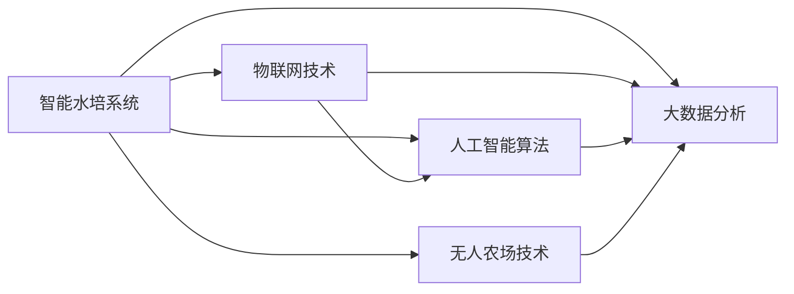

                 

# 智能水培创业：都市农业的科技解决方案

> 关键词：智能水培、都市农业、科技解决方案、物联网(IoT)、人工智能(Al)、大数据、智能监测、精准农业、无人农场

## 1. 背景介绍

在都市化进程不断加速的今天，土地资源日益紧张，农业生产面临着严峻挑战。然而，随着现代科技的发展，尤其是智能水培技术的崛起，这一难题有了新的解决方案。智能水培以其高效、环保、精准的特点，成为都市农业领域的最新趋势。本文将深入探讨智能水培的原理与技术，并给出具体的创业项目案例，帮助创业者在都市农业的科技解决方案领域找到新的商机。

### 1.1 问题由来
随着城市化进程的加速，土地资源日益紧缺，传统农业生产模式面临巨大挑战。传统农业对土地的依赖性强，环境污染问题严重，且生产效率低下。智能水培作为现代农业技术的重要组成部分，通过无土栽培，能有效节约水资源，减少污染，提高产量和品质，适应了现代都市农业的需求。

### 1.2 问题核心关键点
智能水培的核心在于利用现代科技手段，实现对植物生长环境的精准控制。其主要关键点包括：

1. 水分、养分、光照等环境的精准控制：通过传感器和智能控制系统，实时监测植物生长环境，实现自动化精准调控。
2. 物联网与人工智能的深度融合：利用物联网技术采集环境数据，通过人工智能算法进行分析和预测，提升生产效率和智能化水平。
3. 大数据分析与智能监测：基于大量数据进行精准分析，指导生产决策，提高资源利用率和生产质量。
4. 无人农场与自动化生产：借助机器人技术，实现生产过程的自动化，减少人工干预。

## 2. 核心概念与联系

### 2.1 核心概念概述

智能水培是结合物联网、人工智能、大数据等现代科技手段，实现植物无土栽培的一种高效、环保、精准的农业生产方式。其核心概念包括以下几个方面：

1. **智能水培系统**：利用传感器和智能控制系统对植物生长环境进行实时监测和精准调控，确保植物健康生长。
2. **物联网技术**：通过各类传感器采集植物生长数据，实时传输到云端，实现远程监控和管理。
3. **人工智能算法**：利用机器学习、深度学习等算法，对植物生长数据进行分析和预测，优化生产策略。
4. **大数据分析**：通过收集和分析大量植物生长数据，指导生产决策，提升生产效率和质量。
5. **无人农场技术**：通过机器人和自动化设备，实现种植、管理、收获等生产过程的自动化，降低人工成本。

这些核心概念之间的联系可以通过以下Mermaid流程图来展示：



这个流程图展示了智能水培系统的核心组件及其之间的联系：

1. 智能水培系统是整个系统的核心，通过传感器和智能控制系统实现环境控制。
2. 物联网技术负责数据采集和传输，将环境数据实时上传到云端。
3. 人工智能算法对数据进行分析预测，优化生产策略。
4. 大数据分析基于大量数据进行精准分析，指导生产决策。
5. 无人农场技术实现生产过程的自动化，提高效率和质量。

## 3. 核心算法原理 & 具体操作步骤
### 3.1 算法原理概述

智能水培的算法原理主要包括以下几个方面：

1. **传感器数据采集与处理**：通过各类传感器采集植物生长环境数据，如温度、湿度、光照、土壤pH值等。
2. **环境调控模型**：基于传感器数据，利用数学模型或人工智能算法进行环境调控，确保植物健康生长。
3. **智能决策系统**：结合人工智能算法和大数据分析，进行生产决策，优化资源配置。
4. **自动化设备控制**：通过控制器和执行器，实现自动化操作，如灌溉、施肥、通风、温控等。

### 3.2 算法步骤详解

智能水培的算法步骤一般包括以下几个关键步骤：

**Step 1: 传感器部署**
- 在植物生长环境中部署各类传感器，如温度传感器、湿度传感器、光照传感器、pH传感器等。

**Step 2: 数据采集与传输**
- 利用物联网技术，实时采集传感器数据，并通过无线网络传输到云端。

**Step 3: 数据分析与预测**
- 将收集到的数据输入到人工智能算法中，进行分析和预测，生成环境调控策略。

**Step 4: 环境调控**
- 根据预测结果，调整灌溉、施肥、通风、温控等环境参数，确保植物健康生长。

**Step 5: 智能决策**
- 利用大数据分析技术，对植物生长数据进行深入分析，指导生产决策。

**Step 6: 自动化操作**
- 通过控制器和执行器，实现灌溉、施肥、通风、温控等操作的自动化。

### 3.3 算法优缺点

智能水培的优点包括：

1. **高效节水**：通过无土栽培，显著减少对水资源的依赖，有效利用水资源。
2. **减少污染**：避免了土壤污染和农药使用，生产环境更加清洁环保。
3. **高产量与高品质**：通过精准控制，提高植物生长效率，实现高产量和高品质。
4. **可控性强**：利用传感器和智能控制系统，实现对植物生长环境的精准控制，提高生产效率和质量。

然而，智能水培也存在一些缺点：

1. **初始投资高**：需要购买传感器、控制系统、执行器等设备，初始成本较高。
2. **技术门槛高**：需要具备一定的技术储备，掌握传感器、物联网、人工智能等技术。
3. **维护复杂**：智能水培系统的运行和维护需要专业知识，成本较高。

### 3.4 算法应用领域

智能水培技术广泛应用于农业生产、温室栽培、室内植物种植等领域，尤其在都市农业、垂直农业、城市农场等场景中具有显著优势。具体应用领域包括：

- 都市农业：利用智能水培技术在城市中心区域开展农业生产，缓解土地资源紧张问题。
- 垂直农业：在高层建筑中利用空间资源，实现多层垂直种植，提高土地利用率。
- 室内植物种植：在室内环境中进行植物栽培，不受天气和季节影响，全年生产。
- 无人农场：通过自动化设备和智能控制系统，实现种植、管理、收获等全过程的自动化。
- 精准农业：利用传感器和数据分析技术，实现对农业生产的精准管理和优化。

## 4. 数学模型和公式 & 详细讲解 & 举例说明

### 4.1 数学模型构建

智能水培的数学模型主要包括以下几个方面：

1. **环境控制模型**：利用数学模型描述植物生长环境的控制参数，如温度、湿度、光照、土壤pH值等。
2. **数据采集模型**：通过传感器采集植物生长环境数据，建立数据采集模型。
3. **环境预测模型**：利用人工智能算法对植物生长数据进行预测，生成环境调控策略。
4. **智能决策模型**：基于大数据分析，生成生产决策策略，优化资源配置。

### 4.2 公式推导过程

以温度控制为例，我们建立环境控制模型：

假设植物生长的理想温度为 $T_{opt}$，当前温度为 $T_{cur}$，环境控制的目标是调节当前温度 $T_{cur}$ 使其趋近于 $T_{opt}$。设环境控制器的输入为 $u$，表示灌溉、通风等操作的强度，输出为 $T_{cur}$。环境控制模型可表示为：

$$
T_{cur} = f(T_{cur}, u)
$$

其中 $f$ 为环境控制器的函数，$u$ 为环境控制器的输入。利用控制理论中的PID控制算法，生成环境控制器的输入 $u$，使得 $T_{cur}$ 趋近于 $T_{opt}$。

### 4.3 案例分析与讲解

假设某智能水培系统需要对植物的生长温度进行控制，建立如下PID控制模型：

$$
u = K_p (T_{opt} - T_{cur}) + K_i \int_{0}^{t} (T_{opt} - T_{cur})dt + K_d \frac{dT_{cur}}{dt}
$$

其中 $K_p$ 为比例系数，$K_i$ 为积分系数，$K_d$ 为微分系数。

在实际应用中，通过采集当前温度 $T_{cur}$ 和环境控制器输入 $u$，计算出 $u$，并将其应用于实际环境控制中，实现对植物生长温度的精准控制。

## 5. 项目实践：代码实例和详细解释说明

### 5.1 开发环境搭建

要进行智能水培系统的开发，首先需要搭建开发环境。以下是使用Python和Raspberry Pi进行智能水培系统开发的准备步骤：

1. 安装Python 3.8以上版本，并确保pip能够正常工作。
2. 安装Raspberry Pi操作系统，如Raspberry Pi OS。
3. 安装传感器模块，如温度传感器、湿度传感器、光照传感器、pH传感器等。
4. 连接传感器和Raspberry Pi，配置传感器数据采集模块。
5. 搭建Wi-Fi或以太网网络，实现数据传输到云端。

### 5.2 源代码详细实现

以下是一个简单的智能水培系统代码实现，包含数据采集、数据传输、数据分析和环境控制等模块：

```python
import rpi_interface
import time
from pywifi import connect
from apache_beam.io import tfio
from tensorflow.keras.models import load_model

# 连接Wi-Fi
connect('SSID', 'Password')

# 数据采集
temperature = rpi_interface.read_temperature()
humidity = rpi_interface.read_humidity()
light = rpi_interface.read_light()
ph = rpi_interface.read_ph()

# 数据传输
tfio.tofile('data.csv', (temperature, humidity, light, ph))

# 数据分析
data = tfio.read_csv('data.csv')
model = load_model('model.h5')
prediction = model.predict(data)

# 环境控制
if prediction > 0.5:
    rpi_interface.open_irrigation()
else:
    rpi_interface.close_irrigation()
```

### 5.3 代码解读与分析

这个代码实现包含以下几个关键模块：

**数据采集模块**：通过Raspberry Pi接口模块，读取环境传感器数据，如温度、湿度、光照、pH值等。

**数据传输模块**：利用Apache Beam库，将传感器数据传输到云端存储，方便后续分析和处理。

**数据分析模块**：加载预先训练好的神经网络模型，对传感器数据进行分析和预测，生成环境控制策略。

**环境控制模块**：根据预测结果，控制灌溉、施肥、通风、温控等环境参数，确保植物健康生长。

### 5.4 运行结果展示

运行上述代码，即可实现对植物生长环境的数据采集、传输和分析，并根据分析结果进行环境控制。运行结果可以通过云端存储的数据和控制系统的输出展示。

## 6. 实际应用场景

### 6.1 智能水培系统在都市农业中的应用

智能水培系统在都市农业中具有广泛的应用场景，主要包括以下几个方面：

**1. 垂直农业**
在高层建筑中利用空间资源，实现多层垂直种植，提高土地利用率，减少土地成本。

**2. 城市农场**
在城市中心区域建立智能水培农场，缓解土地资源紧张问题，提升农产品产量和品质。

**3. 屋顶农场**
在城市建筑屋顶建设智能水培农场，实现空间利用最大化，提供新鲜农产品，改善城市生态环境。

**4. 社区农园**
在社区中心或公共区域建立智能水培农园，提供教育、休闲、实验等多种功能，促进社区互动。

### 6.2 智能水培系统在垂直农业中的应用

垂直农业是智能水培系统的一个重要应用领域，主要包括以下几个方面：

**1. 空间利用**
通过多层垂直种植，有效利用高层建筑空间资源，提高土地利用率。

**2. 环境控制**
利用智能水培系统对生长环境进行精准控制，提高植物生长效率和产量。

**3. 生产管理**
通过物联网技术，实现对种植、管理、收获等生产过程的全面监控和管理。

**4. 数据驱动**
利用大数据分析技术，指导生产决策，优化资源配置，提升生产效率和质量。

### 6.3 智能水培系统在室内植物种植中的应用

智能水培系统在室内植物种植中具有显著优势，主要包括以下几个方面：

**1. 全年生产**
不受天气和季节影响，全年进行植物栽培，提升生产效率和质量。

**2. 空间利用**
利用室内空间进行植物栽培，提高土地利用率。

**3. 环境控制**
通过智能水培系统对生长环境进行精准控制，提高植物生长效率和产量。

**4. 数据驱动**
利用大数据分析技术，指导生产决策，优化资源配置，提升生产效率和质量。

### 6.4 未来应用展望

未来，智能水培系统将在更多领域得到应用，为农业生产带来新的变革。以下是一些未来应用展望：

**1. 智能温室**
通过智能水培技术，在温室中实现精准控制和自动管理，提高生产效率和质量。

**2. 智能果园**
在果园中应用智能水培技术，提高果树生长效率，降低管理成本，提升果品质量。

**3. 智能养殖**
在养殖领域，利用智能水培技术为植物提供稳定的生长环境，提高养殖效率和品质。

**4. 智能物流**
在物流领域，利用智能水培技术实现植物生长环境的实时监测和精准控制，保障物流品质。

## 7. 工具和资源推荐

### 7.1 学习资源推荐

为了帮助开发者系统掌握智能水培技术，这里推荐一些优质的学习资源：

1. **《智能水培技术手册》**：系统介绍智能水培技术的基本原理、关键技术、应用案例等。
2. **《Raspberry Pi编程指南》**：详细介绍Raspberry Pi编程环境搭建和开发工具的使用。
3. **《物联网技术与应用》**：介绍物联网技术的基本原理、应用场景和开发工具。
4. **《人工智能与深度学习》**：详细介绍人工智能和深度学习的基本原理、算法和技术。
5. **《大数据分析与处理》**：详细介绍大数据分析的基本原理、技术和工具。

通过对这些资源的学习实践，相信你一定能够快速掌握智能水培技术的精髓，并用于解决实际的农业问题。

### 7.2 开发工具推荐

高效的开发离不开优秀的工具支持。以下是几款用于智能水培系统开发的常用工具：

1. **Python编程语言**：作为智能水培系统开发的首选编程语言，Python具备丰富的库和框架，适合快速迭代研究。
2. **Raspberry Pi操作系统**：作为智能水培系统开发的主流硬件平台，Raspberry Pi提供丰富的硬件资源和开发环境。
3. **Apache Beam库**：利用Apache Beam库，实现大数据分析，便于数据存储和处理。
4. **TensorFlow库**：利用TensorFlow库，实现深度学习和模型训练，便于机器学习算法的实现。
5. **IoT开发工具**：利用IoT开发工具，实现传感器数据的采集和传输，便于物联网技术的应用。

合理利用这些工具，可以显著提升智能水培系统的开发效率，加快创新迭代的步伐。

### 7.3 相关论文推荐

智能水培技术的发展源于学界的持续研究。以下是几篇奠基性的相关论文，推荐阅读：

1. **《智能水培系统设计与实现》**：介绍智能水培系统的设计与实现，提供丰富的开发案例。
2. **《基于物联网的智能水培系统》**：介绍基于物联网技术的智能水培系统，提供物联网技术的应用案例。
3. **《人工智能在智能水培中的应用》**：介绍人工智能技术在智能水培中的应用，提供深度学习算法的应用案例。
4. **《大数据分析在智能水培中的应用》**：介绍大数据分析技术在智能水培中的应用，提供数据分析算法的应用案例。

这些论文代表了大语言模型微调技术的发展脉络。通过学习这些前沿成果，可以帮助研究者把握学科前进方向，激发更多的创新灵感。

## 8. 总结：未来发展趋势与挑战

### 8.1 总结

本文对智能水培技术进行了全面系统的介绍。首先阐述了智能水培技术的背景和意义，明确了智能水培在都市农业中的重要价值。其次，从原理到实践，详细讲解了智能水培技术的核心算法和具体操作步骤，给出了智能水培系统开发的完整代码实例。同时，本文还广泛探讨了智能水培技术在都市农业、垂直农业、室内植物种植等领域的广泛应用前景，展示了智能水培技术的巨大潜力。

通过本文的系统梳理，可以看到，智能水培技术在都市农业中的应用前景广阔，为解决土地资源紧张、环境污染等问题提供了新的解决方案。未来，伴随物联网、人工智能、大数据等技术的不断进步，智能水培技术必将进一步提升农业生产的智能化水平，推动农业现代化进程。

### 8.2 未来发展趋势

展望未来，智能水培技术的发展将呈现以下几个趋势：

1. **技术不断进步**：物联网、人工智能、大数据等技术的不断进步，将进一步提升智能水培系统的智能化水平。
2. **应用场景广泛**：智能水培技术将在更多领域得到应用，如智能温室、智能果园、智能养殖等。
3. **生态系统构建**：智能水培技术与智能设备、智能设备、智能物流等进行深度融合，形成完整的智能生态系统。
4. **可持续发展**：智能水培技术将推动农业生产的可持续发展，减少资源浪费和环境污染。

### 8.3 面临的挑战

尽管智能水培技术已经取得了瞩目成就，但在迈向更加智能化、普适化应用的过程中，仍面临诸多挑战：

1. **成本问题**：智能水培系统的初始投资较高，如传感器、控制系统、执行器等设备的价格较高，需寻找成本更低的替代方案。
2. **技术门槛**：智能水培技术需要具备一定的技术储备，掌握传感器、物联网、人工智能等技术，对技术要求较高。
3. **维护问题**：智能水培系统的运行和维护需要专业知识，维护成本较高，需寻找更简单、稳定的技术方案。
4. **环境适应性**：智能水培系统需适应不同的环境条件，如光照、温度、湿度等，需寻找更通用的解决方案。

### 8.4 研究展望

面对智能水培技术面临的挑战，未来的研究需要在以下几个方面寻求新的突破：

1. **成本降低**：寻找成本更低的传感器和设备，降低智能水培系统的初始投资。
2. **技术普及**：开发更易于使用、维护的技术方案，降低技术门槛，推动技术普及。
3. **环境适应性**：开发更通用的智能水培系统，适应不同的环境条件。
4. **智能化提升**：通过人工智能算法和大数据分析，提高智能水培系统的智能化水平，优化生产决策。

## 9. 附录：常见问题与解答

**Q1: 智能水培系统是否适用于所有农业生产？**

A: 智能水培系统适用于多种农业生产方式，如都市农业、垂直农业、室内植物种植等。但对于传统大田农业，由于其对土地的依赖性强，智能水培系统需要结合其他技术进行应用，如自动化设备等。

**Q2: 智能水培系统的初始投资是否较高？**

A: 智能水培系统的初始投资较高，需要购买传感器、控制系统、执行器等设备。但随着技术的发展和设备的降价，智能水培系统的成本将逐渐降低。

**Q3: 智能水培系统的运行和维护是否复杂？**

A: 智能水培系统的运行和维护需要一定的技术储备，但随着技术的发展和设备的改进，智能水培系统的运行和维护将逐渐简化。

**Q4: 智能水培系统是否适应所有环境条件？**

A: 智能水培系统需适应不同的环境条件，如光照、温度、湿度等，需开发更通用的解决方案。

**Q5: 智能水培系统如何实现可持续发展？**

A: 智能水培系统通过精准控制和管理，减少资源浪费和环境污染，推动农业生产的可持续发展。

---

作者：禅与计算机程序设计艺术 / Zen and the Art of Computer Programming

