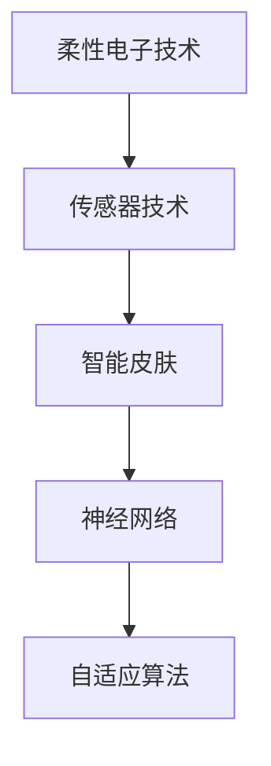

                 

# 智能皮肤技术：为机器人提供触觉感知

> 关键词：智能皮肤技术,触觉感知,机器人,传感器技术,人工智能,柔性电子,模拟触觉,神经网络,实时反馈

## 1. 背景介绍

### 1.1 问题由来
触觉感知是机器人与外界交互的重要能力之一，直接关系到机器人的灵活性和适应性。然而，传统机器人的触觉系统往往依赖于结构复杂的机械触觉传感器，不仅成本高昂，而且体积庞大、维护复杂。这不仅限制了机器人的普及应用，也制约了机器人任务的拓展。随着柔性电子技术和人工智能技术的发展，智能皮肤（Smart Skin）技术应运而生，成为新一代机器人触觉感知系统的重要发展方向。

智能皮肤技术通过将柔性电子元件与微型传感器、执行器相结合，模拟人类皮肤的触觉特性，实现对温度、压力、震动等环境信息的实时感知与反馈。这种技术突破了传统触觉传感器的限制，具有体积小、重量轻、灵活可调等优势，能够在复杂多变的环境中提供高效、准确的触觉感知能力。

### 1.2 问题核心关键点
智能皮肤技术的核心关键点包括：

- 柔性电子元件：用于感知环境和变形的柔性电子器件，如压敏电阻、应变片等。
- 微型传感器：用于实时测量温度、压力等环境参数的传感器，如MEMS压力传感器、柔性温度传感器等。
- 执行器：用于对外施加力或压力的柔性器件，如柔性电机、变形致动器等。
- 神经网络：用于处理传感器数据的神经网络模型，实现对环境信息的识别和处理。
- 自适应算法：用于优化神经网络参数，提高智能皮肤的感知性能和自适应能力。

这些关键组件通过精确配合，能够在各种复杂环境中模拟人类触觉，为机器人提供精准的环境感知与互动能力。

## 2. 核心概念与联系

### 2.1 核心概念概述

为更好地理解智能皮肤技术的核心原理和架构，本节将介绍几个密切相关的核心概念：

- 柔性电子技术（Flexible Electronics）：指通过柔性基底材料制成的电子器件，能够弯曲折叠，适应不同形状和尺寸的电子产品。
- 传感器技术（Sensing Technology）：指利用物理或化学原理，对环境参数进行检测和转换的技术。
- 人工智能（AI）：指利用计算机模拟人类智能过程的技术，包括机器学习、深度学习等。
- 柔性电子皮肤（Flexible Electronic Skin）：指结合柔性电子、传感器和神经网络技术，能够模拟人类触觉感知和反馈的电子系统。
- 神经网络（Neural Network）：指由大量神经元及其连接关系构成的计算模型，用于处理和分析复杂数据。
- 自适应算法（Adaptive Algorithm）：指能够自动调整模型参数，以适应环境变化的算法。

这些核心概念之间的逻辑关系可以通过以下Mermaid流程图来展示：



这个流程图展示了几大核心概念之间的联系：

1. 柔性电子技术为传感器和执行器提供了可变形的基底材料，保证了智能皮肤的柔性和适应性。
2. 传感器技术用于检测环境参数，为神经网络提供输入数据。
3. 神经网络用于处理和分析传感器数据，实现对环境信息的识别和分类。
4. 自适应算法根据环境变化调整神经网络参数，提高智能皮肤的实时感知和反馈能力。

## 3. 核心算法原理 & 具体操作步骤
### 3.1 算法原理概述

智能皮肤技术的工作原理可概述如下：

1. **柔性电子元件**：在智能皮肤中，柔性电子元件作为传感器和执行器的基础，可以感知外界压力、温度、湿度等环境参数，并根据外界作用力产生形变。

2. **微型传感器**：微型传感器（如MEMS压力传感器、柔性温度传感器）将柔性电子元件检测到的物理量转换为电信号，供后续处理和分析。

3. **神经网络**：神经网络模型通过对传感器数据进行训练，识别环境变化和机器人状态，并生成相应的触觉响应策略。

4. **自适应算法**：自适应算法根据环境变化实时调整神经网络参数，优化感知性能，提高智能皮肤的自适应能力。

5. **实时反馈**：智能皮肤将触觉感知信息实时传输给机器人控制系统，实现对机器人行为的动态调整。

### 3.2 算法步骤详解

智能皮肤技术的实现步骤可总结如下：

**Step 1: 设计柔性电子元件**
- 选择合适的柔性材料，如PDMS（聚二甲基硅氧烷）、PET（聚对苯二甲酸乙二醇酯）等，制备柔性电子基底。
- 在基底上沉积压敏电阻、应变片等柔性电子元件。

**Step 2: 集成微型传感器**
- 在柔性电子元件表面集成微型传感器，如MEMS压力传感器、柔性温度传感器等。
- 将传感器数据通过无线通信模块传输到中央处理单元。

**Step 3: 训练神经网络模型**
- 使用标记数据训练神经网络模型，识别不同环境参数和机器人状态。
- 选择合适的网络结构和优化器，如卷积神经网络（CNN）、长短期记忆网络（LSTM）等。

**Step 4: 实现自适应算法**
- 根据环境变化调整神经网络参数，优化模型性能。
- 使用自适应算法如AdaGrad、Adam等，自动调整学习率。

**Step 5: 实时反馈与控制**
- 将智能皮肤的触觉感知信息实时传输给机器人控制系统。
- 根据感知信息调整机器人行为，实现实时反馈和控制。

### 3.3 算法优缺点

智能皮肤技术具有以下优点：

1. **高灵敏度**：柔性电子元件和微型传感器能够提供高灵敏度的环境感知能力，实时捕捉微小变化。
2. **低功耗**：柔性电子器件和微型传感器消耗能量较低，智能皮肤能够长时间持续工作。
3. **适应性强**：柔性基底材料和自适应算法使得智能皮肤能够适应各种复杂环境，具有高度的灵活性和可调性。
4. **体积小巧**：柔性电子技术和传感器技术的集成使得智能皮肤体积小巧，便于安装和携带。

同时，智能皮肤技术也存在一些局限性：

1. **成本较高**：柔性电子元件和微型传感器的制备和集成成本较高，限制了技术的应用普及。
2. **脆弱性**：柔性电子器件和微型传感器在长期使用和外界环境作用下可能出现损坏，影响系统的稳定性。
3. **信号处理复杂**：传感器数据的多样性和复杂性增加了信号处理的难度，需要高级信号处理技术支持。
4. **实时性要求高**：实时反馈和控制对数据传输和处理的速度提出了较高要求，需要高效的算法和硬件支持。

### 3.4 算法应用领域

智能皮肤技术在多个领域具有广泛应用前景，主要包括：

- **医疗康复**：智能皮肤可用于监测患者的生理参数，如心率和血压，提供实时健康反馈。
- **智能家居**：智能皮肤可用于检测环境温度、湿度等参数，调节室内环境，提升居住舒适度。
- **机器人辅助**：智能皮肤可用于机器人的触觉感知和交互，增强机器人的灵活性和适应性。
- **汽车安全**：智能皮肤可用于汽车安全气囊的触觉感知，检测撞击力度和方向，优化安全性能。
- **穿戴设备**：智能皮肤可用于智能手表、智能眼镜等穿戴设备的触觉感知，提升设备的用户体验。

## 4. 数学模型和公式 & 详细讲解 & 举例说明

### 4.1 数学模型构建

智能皮肤技术的数学模型主要涉及传感器数据的处理和神经网络的训练。

设传感器数据为 $\boldsymbol{x} = [x_1, x_2, \ldots, x_n]^T$，其中 $x_i$ 为第 $i$ 个传感器测量的环境参数（如压力、温度）。神经网络模型为 $y = f(\boldsymbol{x}, \boldsymbol{\theta})$，其中 $\boldsymbol{\theta}$ 为模型的参数向量。

智能皮肤的任务是训练模型 $y = f(\boldsymbol{x}, \boldsymbol{\theta})$，使其能够准确预测环境变化，生成触觉响应策略。

### 4.2 公式推导过程

假设智能皮肤中使用的传感器数据为 $\boldsymbol{x} = [x_1, x_2, \ldots, x_n]^T$，其中 $x_i$ 为第 $i$ 个传感器测量的环境参数。神经网络模型的输出为 $y = f(\boldsymbol{x}, \boldsymbol{\theta})$，其中 $\boldsymbol{\theta}$ 为模型的参数向量。

智能皮肤的目标是最小化损失函数 $L(y, \boldsymbol{y}^*)$，其中 $\boldsymbol{y}^*$ 为真实标签向量。损失函数通常采用均方误差（MSE）或交叉熵（CE）等形式。

例如，均方误差损失函数为：

$$
L(y, \boldsymbol{y}^*) = \frac{1}{N}\sum_{i=1}^N (y_i - y^*_i)^2
$$

在训练神经网络时，采用梯度下降等优化算法更新参数 $\boldsymbol{\theta}$，使得损失函数最小化。

### 4.3 案例分析与讲解

以智能皮肤在机器人辅助中的应用为例，进行详细分析：

假设智能皮肤用于监测机器人关节的触觉感知。传感器数据 $\boldsymbol{x} = [x_1, x_2, \ldots, x_n]^T$ 为关节压力、温度等参数。神经网络模型 $y = f(\boldsymbol{x}, \boldsymbol{\theta})$ 用于预测机器人的当前状态和行为。

训练神经网络时，使用标注数据 $\{(\boldsymbol{x}_i, y_i^*)\}_{i=1}^N$ 进行训练。模型输出 $y = f(\boldsymbol{x}, \boldsymbol{\theta})$ 通过损失函数 $L(y, y^*)$ 与真实标签 $y^*$ 进行比较，更新参数 $\boldsymbol{\theta}$。

例如，使用MSE损失函数：

$$
L(y, y^*) = \frac{1}{N}\sum_{i=1}^N (y_i - y_i^*)^2
$$

使用梯度下降算法更新参数：

$$
\boldsymbol{\theta} \leftarrow \boldsymbol{\theta} - \eta \nabla_{\boldsymbol{\theta}}L(y, y^*)
$$

其中 $\eta$ 为学习率，$\nabla_{\boldsymbol{\theta}}L(y, y^*)$ 为损失函数对参数 $\boldsymbol{\theta}$ 的梯度。

通过不断迭代优化，智能皮肤能够实时监测机器人关节的压力变化，预测机器人状态，生成相应的触觉响应策略，如调整机器人关节的力矩、速度等参数，确保机器人安全高效地完成任务。

## 5. 项目实践：代码实例和详细解释说明

### 5.1 开发环境搭建

在进行智能皮肤技术开发前，需要准备以下开发环境：

1. **硬件平台**：选用具备柔性电子器件和微型传感器的硬件平台，如Arduino、Raspberry Pi等。
2. **编程环境**：安装Python及其相关库，如TensorFlow、PyTorch等。
3. **工具和库**：安装传感器接口库，如Adafruit库，用于传感器数据的读取和处理。
4. **数据集**：准备标注数据集，用于神经网络模型的训练。

### 5.2 源代码详细实现

以下是一个使用Python和TensorFlow实现智能皮肤感知系统的代码示例：

```python
import tensorflow as tf
import numpy as np
import Adafruit_ADS1115

# 读取传感器数据
def read_sensors():
    i2c = Adafruit_ADS1115.ADS1115(0x48, busnum=1)
    sensors = []
    for channel in range(4):
        sensors.append(i2c.read_adc(channel))
    return sensors

# 定义神经网络模型
def create_model():
    model = tf.keras.Sequential([
        tf.keras.layers.Dense(64, activation='relu', input_shape=(4,)),
        tf.keras.layers.Dense(16, activation='relu'),
        tf.keras.layers.Dense(1, activation='sigmoid')
    ])
    return model

# 训练神经网络
def train_model(model, data, labels, epochs=10, batch_size=32):
    model.compile(optimizer='adam', loss='binary_crossentropy', metrics=['accuracy'])
    model.fit(data, labels, epochs=epochs, batch_size=batch_size, verbose=0)

# 实时监测和反馈
def monitor_and_feedback(model):
    while True:
        sensors_data = read_sensors()
        labels = np.array([sensors_data[0] > 500])
        predictions = model.predict(np.array([sensors_data]))
        if predictions > 0.5:
            print("High pressure detected! Adjusting joint force.")
            # 调整机器人关节力矩、速度等参数
        else:
            print("Normal pressure detected.")
```

**代码解释**：

- `read_sensors()`：读取传感器数据，使用Adafruit库读取四个传感器的模拟电压值，并进行归一化处理。
- `create_model()`：定义一个简单的神经网络模型，包括输入层、隐藏层和输出层。
- `train_model()`：使用标注数据训练神经网络模型，优化器采用Adam，损失函数为二元交叉熵。
- `monitor_and_feedback()`：实时监测传感器数据，使用训练好的模型进行预测，根据预测结果调整机器人关节力矩、速度等参数。

### 5.3 代码解读与分析

代码中使用了TensorFlow框架来实现神经网络模型的训练和实时监测。Adafruit库用于读取传感器数据，实现了与硬件平台的无缝集成。

代码的核心部分是神经网络模型的定义和训练。通过选择合适的网络结构和优化器，训练模型能够准确预测传感器数据的异常情况，生成相应的触觉响应策略。

在实时监测和反馈部分，代码实现了对传感器数据的持续读取和模型预测，根据预测结果动态调整机器人行为。这需要实时处理大量传感器数据，对计算速度和数据传输提出了较高要求。

### 5.4 运行结果展示

运行上述代码后，可以观察到智能皮肤系统的实时监测和反馈结果。例如，当传感器检测到高压力时，系统输出“High pressure detected! Adjusting joint force.”，并根据模型预测结果调整机器人关节力矩和速度，以适应环境变化。

## 6. 实际应用场景

### 6.1 智能家居

智能皮肤技术在智能家居中具有广泛应用前景。例如，智能皮肤可用于检测室内温度、湿度等参数，自动调节空调和加湿器，提升居住舒适度。此外，智能皮肤还可用于检测室内空气质量，通过无线传输到中央控制系统，实现环境优化。

### 6.2 医疗康复

在医疗康复领域，智能皮肤可用于监测患者的生理参数，如心率和血压，提供实时健康反馈。例如，智能皮肤贴在患者手腕上，实时检测心率变化，生成报警信号，及时通知医护人员进行干预。

### 6.3 机器人辅助

智能皮肤技术在机器人辅助中具有重要应用价值。例如，智能皮肤可用于监测机器人关节的压力和温度，优化机器人行为，提升作业安全性和效率。在物流、清洁等领域，智能皮肤可显著提高机器人的灵活性和适应性，减少人工干预，降低成本。

## 7. 工具和资源推荐

### 7.1 学习资源推荐

- 《柔性电子器件技术与应用》：介绍柔性电子器件的制备、性能和应用，适合初步学习和入门。
- 《传感器技术基础与设计》：深入讲解各类传感器的工作原理和应用，提供详细的数据处理和分析方法。
- 《深度学习理论与实践》：讲解深度学习的基本原理和应用，提供丰富的神经网络模型和训练技巧。
- 《TensorFlow官方文档》：TensorFlow的全面教程和API文档，适合深入学习和项目开发。
- 《智能皮肤与柔性电子技术》课程：在线学习平台提供的智能皮肤技术课程，涵盖设计、制造和应用等多个方面。

### 7.2 开发工具推荐

- Arduino：开源的电子原型平台，适合柔性电子器件的开发和集成。
- Raspberry Pi：廉价、功能强大的单板计算机，适合传感器数据采集和处理。
- TensorFlow：强大的深度学习框架，提供丰富的神经网络库和工具支持。
- PyTorch：灵活的深度学习框架，适合快速迭代和实验研究。
- ROS（Robot Operating System）：机器人操作系统，提供多种传感器和执行器的API接口。

### 7.3 相关论文推荐

- "Adaptive sensor networks for smart skin: a survey"（2020）：综述了智能皮肤中传感器网络的最新研究进展。
- "Flexible sensors and actuators for smart skin in robotic applications"（2019）：介绍了柔性传感器和执行器在机器人辅助中的应用。
- "Deep learning based smart skin for real-time tactile sensing and feedback"（2021）：利用深度学习技术实现智能皮肤的触觉感知和反馈。
- "Optimization of a flexible sensor network for smart skin"（2022）：讨论了智能皮肤中传感器网络优化的方法。

## 8. 总结：未来发展趋势与挑战

### 8.1 总结

本文对智能皮肤技术进行了全面系统的介绍。首先阐述了智能皮肤技术在机器人触觉感知中的重要地位和应用前景，明确了智能皮肤的核心关键点。其次，从原理到实践，详细讲解了智能皮肤技术的实现步骤和关键算法。最后，探讨了智能皮肤技术在多个实际应用场景中的具体应用，并提供了丰富的学习资源和开发工具。

通过本文的系统梳理，可以看到，智能皮肤技术在柔性电子器件、传感器和神经网络等技术的支持下，能够模拟人类触觉，为机器人提供精准的环境感知与互动能力。未来，伴随技术的不断进步，智能皮肤技术必将在更多领域得到应用，推动人工智能技术向更加智能化、普适化方向发展。

### 8.2 未来发展趋势

展望未来，智能皮肤技术将呈现以下几个发展趋势：

1. **传感器集成**：未来的智能皮肤将集成更多种类的传感器，如温度、湿度、气体等，实现更全面、精确的环境感知。
2. **自适应算法优化**：自适应算法将不断优化，提高智能皮肤的实时感知和反馈能力，适应复杂多变的环境。
3. **柔性电子器件的改进**：柔性电子器件的性能和稳定性将不断提升，增强智能皮肤的可靠性和耐用性。
4. **神经网络模型的改进**：神经网络模型将不断优化，提高智能皮肤对复杂环境数据的处理能力，实现更精准的预测和响应。
5. **跨领域应用拓展**：智能皮肤技术将拓展到更多领域，如智能家居、医疗康复等，提升用户体验和应用价值。
6. **与物联网的融合**：智能皮肤将与物联网技术深度融合，实现设备间的互联互通，提升整体系统性能。

### 8.3 面临的挑战

尽管智能皮肤技术已经取得了一定的进展，但在迈向更广泛应用的过程中，仍面临以下挑战：

1. **成本问题**：柔性电子器件和微型传感器的成本较高，限制了技术的普及应用。
2. **稳定性问题**：柔性电子器件和微型传感器在长期使用和外界环境作用下可能出现损坏，影响系统的稳定性。
3. **数据处理问题**：传感器数据的多样性和复杂性增加了信号处理的难度，需要高效的算法和硬件支持。
4. **实时性要求高**：实时反馈和控制对数据传输和处理的速度提出了较高要求，需要高效的算法和硬件支持。
5. **数据隐私问题**：智能皮肤技术涉及大量个人数据，如何在保障数据隐私的同时实现智能感知，是一个重要的挑战。

### 8.4 研究展望

未来的研究需要在以下几个方向进行突破：

1. **降低成本**：研发低成本、高性能的柔性电子器件和微型传感器，降低智能皮肤技术的成本，促进其普及应用。
2. **提高稳定性**：提高柔性电子器件和微型传感器的可靠性和耐用性，确保系统长时间稳定运行。
3. **优化算法**：改进神经网络模型和自适应算法，提高智能皮肤的实时感知和反馈能力，适应复杂多变的环境。
4. **跨领域融合**：将智能皮肤技术与物联网、人工智能等技术深度融合，实现更全面、智能化的应用。
5. **数据隐私保护**：研究数据隐私保护技术，保障智能皮肤系统在采集和处理个人数据时的安全性。

这些研究方向的探索发展，必将引领智能皮肤技术迈向更高的台阶，为构建智能化的未来社会贡献力量。总之，智能皮肤技术将与人工智能、柔性电子器件等技术协同发力，推动智能系统向更加智能化、普适化方向发展，实现人与机器的更深度互动。

## 9. 附录：常见问题与解答

**Q1: 智能皮肤与传统触觉传感器的主要区别是什么？**

A: 智能皮肤技术通过柔性电子器件和微型传感器模拟人类触觉，具有高灵敏度、低功耗、适应性强等优势。与传统机械触觉传感器相比，智能皮肤体积小巧、成本较低，且具有更灵活、可调的特性，能够适应复杂多变的环境。

**Q2: 智能皮肤技术的主要应用场景有哪些？**

A: 智能皮肤技术在医疗康复、智能家居、机器人辅助等多个领域具有广泛应用前景。例如，在医疗康复中，智能皮肤可用于监测患者的生理参数，提供实时健康反馈；在智能家居中，智能皮肤可用于检测环境参数，提升居住舒适度；在机器人辅助中，智能皮肤可用于监测机器人关节的压力和温度，优化机器人行为，提升作业安全性和效率。

**Q3: 智能皮肤技术面临的主要挑战是什么？**

A: 智能皮肤技术面临的主要挑战包括成本高、稳定性差、数据处理复杂、实时性要求高等问题。其中，柔性电子器件和微型传感器的成本较高，且在长期使用和外界环境作用下可能出现损坏。此外，传感器数据的多样性和复杂性增加了信号处理的难度，对数据传输和处理的速度提出了较高要求。

**Q4: 如何提高智能皮肤技术的实时感知和反馈能力？**

A: 提高智能皮肤技术的实时感知和反馈能力，需要从以下几个方面进行优化：
1. 改进传感器性能，提高数据采集的精度和速度。
2. 优化神经网络模型，提高对环境数据的处理能力和响应速度。
3. 改进自适应算法，根据环境变化自动调整模型参数，提高系统的适应能力。
4. 使用高带宽通信协议，提高数据传输速度和实时性。

**Q5: 智能皮肤技术未来的发展方向有哪些？**

A: 智能皮肤技术未来的发展方向包括传感器集成、自适应算法优化、柔性电子器件改进、神经网络模型改进、跨领域应用拓展、与物联网的融合等多个方面。通过这些方向的研究，智能皮肤技术将具备更全面、精确的环境感知能力，提升应用场景的智能化水平。

