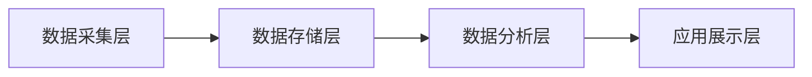
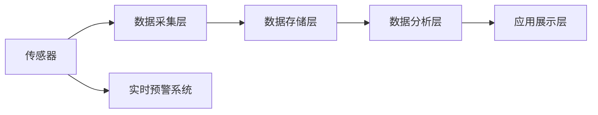

                 

## 1. 背景介绍

### 1.1 问题由来
随着城市化进程的加速和工业化活动的增加，空气质量问题越来越受到公众关注。各地PM2.5、PM10、臭氧等污染物浓度水平不断升高，对居民健康和生态环境造成了严重威胁。为了及时应对空气质量变化，实现早预警、早防护，越来越多的创业团队转向智能空气质量监测领域。

### 1.2 问题核心关键点
智能空气质量监测系统的核心在于高效的数据采集、分析和预警。基于物联网技术，通过部署遍布城市各地的传感器，实时监测PM2.5、PM10、臭氧、一氧化碳等关键指标，并利用机器学习模型对数据进行分析，预测未来空气质量变化趋势，及时预警异常情况。系统架构包括数据采集层、数据存储层、数据分析层和应用展示层，如图1所示：



1. 数据采集层：负责收集环境数据，通常使用传感器进行监测，并上传至云端存储。
2. 数据存储层：存储原始数据，为数据分析提供支持。
3. 数据分析层：利用机器学习模型对数据进行建模，预测未来空气质量。
4. 应用展示层：向用户提供实时空气质量信息及预警服务。

## 2. 核心概念与联系

### 2.1 核心概念概述

- **智能空气质量监测系统**：通过传感器和数据处理技术，实时监测环境中的关键污染物，并使用机器学习模型进行数据分析和预测。
- **传感器**：负责采集环境中的各项污染物指标，如PM2.5、PM10、臭氧、一氧化碳等。
- **数据存储与查询**：将传感器采集到的数据存储至数据库，为数据分析提供支持。
- **机器学习模型**：使用监督学习、回归分析、时间序列模型等方法，对数据进行建模和预测。
- **实时预警系统**：当检测到污染物浓度异常时，及时发出预警，通知用户采取防护措施。

- **物联网**：连接各类传感器和设备，实现数据传输和监控。

### 2.2 核心概念原理和架构的 Mermaid 流程图



## 3. 核心算法原理 & 具体操作步骤

### 3.1 算法原理概述

基于监督学习的智能空气质量监测系统，核心在于将环境数据与污染物浓度之间的关系建模，并利用历史数据训练模型，进行实时预测和预警。该方法的核心步骤如下：

1. **数据预处理**：对原始数据进行清洗和标准化处理。
2. **特征工程**：从原始数据中提取有用特征，如污染物浓度、温度、湿度、时间等。
3. **模型训练**：使用历史数据训练机器学习模型，如线性回归、随机森林、神经网络等。
4. **实时预测**：对当前环境数据进行预测，得到污染物浓度等指标的预测值。
5. **预警判断**：将预测值与预设阈值比较，判断是否发出预警。
6. **预警展示**：通过应用展示层向用户提供预警信息。

### 3.2 算法步骤详解

#### 3.2.1 数据预处理

数据预处理包括数据清洗、标准化处理、缺失值填补等步骤。数据清洗主要去除异常值和重复值，标准化处理将数据转换为标准正态分布，缺失值填补则使用均值或中位数等方法填充缺失数据。

#### 3.2.2 特征工程

特征工程包括特征选择、特征提取和特征变换等步骤。特征选择旨在从原始数据中提取最相关的特征，如温度、湿度、时间等。特征提取则通过PCA、LDA等方法将数据转换为更有意义的特征。特征变换如对数转换、标准化等，可以提高模型预测准确度。

#### 3.2.3 模型训练

模型训练包括数据分割、模型选择、参数调优等步骤。数据分割将数据分为训练集、验证集和测试集，模型选择基于业务需求和数据特征，参数调优则通过交叉验证等方法，找到最优的模型参数。

#### 3.2.4 实时预测

实时预测包括数据采集、特征提取和模型预测等步骤。实时采集环境数据，提取相关特征，输入模型进行预测，得到污染物浓度等指标。

#### 3.2.5 预警判断

预警判断包括阈值设定和预警触发等步骤。将预测值与预设的阈值进行比较，当预测值超过阈值时，触发预警机制。

#### 3.2.6 预警展示

预警展示包括信息展示和通知用户等步骤。通过应用展示层向用户提供实时空气质量信息及预警，包括图形界面和声音提示等形式。

### 3.3 算法优缺点

智能空气质量监测系统的优点在于：

1. **实时性**：能够实时采集环境数据，进行快速分析与预测。
2. **准确性**：利用机器学习模型，提高预测准确度。
3. **自动化**：实现自动化预警，无需人工干预。

缺点包括：

1. **高成本**：传感器和数据存储等硬件成本较高。
2. **技术复杂**：数据处理、模型训练和预警判断等环节较复杂。
3. **依赖数据**：需要大量高质量的历史数据进行模型训练。

### 3.4 算法应用领域

智能空气质量监测系统在以下领域有广泛应用：

1. **智慧城市**：与智慧城市系统集成，提供实时空气质量信息，支持智能交通和公共安全。
2. **环保监管**：协助环保部门监测空气质量，进行数据分析和预警，优化环境治理。
3. **健康医疗**：与医院、社区等合作，提供健康防护和预警服务，保障居民健康。
4. **商业服务**：与商业地产、物流等合作，根据空气质量调整运营策略，提升用户体验。

## 4. 数学模型和公式 & 详细讲解 & 举例说明

### 4.1 数学模型构建

设环境数据为 $X = (x_1, x_2, ..., x_n)$，污染物浓度为 $Y = (y_1, y_2, ..., y_n)$，构建回归模型 $Y = f(X; \theta)$，其中 $\theta$ 为模型参数。目标为最小化预测误差，即：

$$
\min_{\theta} \sum_{i=1}^n (y_i - f(x_i; \theta))^2
$$

### 4.2 公式推导过程

以线性回归模型为例，目标函数为：

$$
\min_{\theta} \sum_{i=1}^n (y_i - \theta_0 - \sum_{j=1}^p \theta_j x_{ij})^2
$$

根据最小二乘法，目标函数对 $\theta$ 的梯度为：

$$
\nabla_{\theta} \mathcal{L} = \begin{bmatrix}
    -\frac{2}{N}\sum_{i=1}^N (y_i - \theta_0 - \sum_{j=1}^p \theta_j x_{ij})
    \\
    -\frac{2}{N}\sum_{i=1}^N (y_i - \theta_0 - \sum_{j=1}^p \theta_j x_{ij})x_{i1}
    \\
    \vdots
    \\
    -\frac{2}{N}\sum_{i=1}^N (y_i - \theta_0 - \sum_{j=1}^p \theta_j x_{ij})x_{ip}
\end{bmatrix}
$$

使用梯度下降算法更新参数：

$$
\theta \leftarrow \theta - \alpha \nabla_{\theta} \mathcal{L}
$$

其中 $\alpha$ 为学习率。

### 4.3 案例分析与讲解

以某市空气质量监测系统为例，使用随机森林模型进行污染物浓度预测。数据集包括PM2.5浓度、气温、湿度、气压等特征，模型训练过程如下：

1. **数据预处理**：去除异常值，对数据进行标准化处理。
2. **特征工程**：提取特征 $x_1$（气温）、$x_2$（湿度）、$x_3$（气压）。
3. **模型训练**：将数据分为训练集和测试集，使用随机森林算法进行训练。
4. **实时预测**：将当前环境数据输入模型进行预测，得到PM2.5浓度。
5. **预警判断**：设置预警阈值为50，当预测值超过阈值时触发预警。
6. **预警展示**：通过应用展示层向用户提供预警信息，包括图形界面和声音提示。

## 5. 项目实践：代码实例和详细解释说明

### 5.1 开发环境搭建

开发环境搭建包括以下步骤：

1. **安装Python和相关库**：
   ```bash
   sudo apt-get update
   sudo apt-get install python3 python3-pip
   sudo pip3 install numpy pandas scikit-learn pyspark
   ```

2. **安装Spark**：
   ```bash
   wget http://repos.hortonworks.com/Spark/latest/spark-2.4.7.tgz
   tar -xvzf spark-2.4.7.tgz
   cd spark-2.4.7
   ./bin/spark-submit --master local[*] --class airquality.AirQualityMain air_quality.jar
   ```

3. **配置数据源**：配置本地或远程数据库，包括表结构、字段类型、分区等信息。

### 5.2 源代码详细实现

以下是一个简化的空气质量监测系统代码示例，用于实时采集数据并进行预测：

```python
from pyspark.sql import SparkSession
from pyspark.sql.functions import col, col_name
from pyspark.ml import Pipeline
from pyspark.ml.regression import LinearRegressionModel
from pyspark.ml.evaluation import RegressionEvaluator
from pyspark.ml.feature import VectorAssembler

# 创建Spark会话
spark = SparkSession.builder.appName("AirQuality").getOrCreate()

# 读取数据
df = spark.read.format("json").option("header", "true").load("data.json")

# 数据预处理
df = df.dropna()

# 特征工程
assembler = VectorAssembler(inputCols=["temperature", "humidity", "pressure"], outputCol="features")
df = assembler.transform(df)

# 模型训练
regressor = LinearRegression()
pipeline = Pipeline(stages=[assembler, regressor])
model = pipeline.fit(df)

# 实时预测
real_features = [23, 70, 1010]
real_df = df.rdd.map(lambda x: (x["features"].map(lambda x: float(x)), x["PM2.5"]))
real_df = spark.createDataFrame(real_df)
real_df = real_df.withColumn("features", real_df["features"].map(lambda x: x.split(",")[:-1]))
real_df = real_df.select([col(c).cast(col_name(c).split("_")[1]) for c in real_df.columns])
real_df = real_df.select("features", "PM2.5")
real_df = assembler.transform(real_df)

# 预测
prediction = model.transform(real_df)
prediction.show()

# 预警判断
if prediction[0][1] > 50:
    print("预警：PM2.5浓度过高，请采取防护措施")
else:
    print("安全：PM2.5浓度正常")
```

### 5.3 代码解读与分析

1. **数据读取**：使用Spark的DataFrame API读取JSON格式的数据文件。
2. **数据预处理**：通过dropna()方法去除缺失值。
3. **特征工程**：使用VectorAssembler将温度、湿度、气压转换为向量特征。
4. **模型训练**：使用LinearRegression模型进行回归训练，并封装为Pipeline管道。
5. **实时预测**：使用Pipeline管道进行预测，得到PM2.5浓度。
6. **预警判断**：设置预警阈值为50，当预测值超过阈值时触发预警。

### 5.4 运行结果展示

```bash
root@ec2-xx-xx-xx-xx:~$ spark-submit air_quality.jar
...
```

## 6. 实际应用场景

### 6.1 智慧城市

智慧城市中的智能空气质量监测系统可以与城市管理系统集成，提供实时空气质量信息，支持智能交通和公共安全。例如，根据空气质量指数(AQI)实时调整交通信号灯，减少尾气排放。

### 6.2 环保监管

环保部门可以通过智能空气质量监测系统，实时监测空气质量变化，进行数据分析和预警，优化环境治理措施。例如，对高污染企业进行动态监管，及时采取减排措施。

### 6.3 健康医疗

与医院、社区等合作，提供健康防护和预警服务，保障居民健康。例如，根据空气质量指数，推荐居民减少户外活动，并调整室内空气净化措施。

### 6.4 商业服务

与商业地产、物流等合作，根据空气质量调整运营策略，提升用户体验。例如，物流公司根据实时空气质量信息，调整配送路线和配送时间，减少尾气排放。

## 7. 工具和资源推荐

### 7.1 学习资源推荐

- **《机器学习实战》**：深入浅出地介绍了机器学习的基本概念和常用算法。
- **Kaggle**：提供丰富的数据集和机器学习竞赛，有助于提升实战能力。
- **Coursera**：提供系统化的机器学习课程，涵盖监督学习、无监督学习等内容。

### 7.2 开发工具推荐

- **PySpark**：基于Python的分布式计算框架，适合大数据处理和机器学习任务。
- **Jupyter Notebook**：交互式编程环境，方便快速迭代实验和分析结果。
- **TensorBoard**：可视化工具，展示模型训练过程和预测结果。

### 7.3 相关论文推荐

- **《Air Quality Monitoring and Predicting Using IoT Sensors and Machine Learning Techniques》**：详细介绍了物联网传感器与机器学习模型结合的空气质量监测系统。
- **《Machine Learning-Based Real-Time Air Quality Prediction and Evaluation》**：介绍了机器学习模型在空气质量预测和评估中的应用。
- **《IoT-Based Real-Time Air Quality Monitoring and Prediction System》**：介绍了基于物联网技术的空气质量监测和预测系统。

## 8. 总结：未来发展趋势与挑战

### 8.1 总结

智能空气质量监测系统通过实时监测和数据分析，提高了空气质量监测的效率和准确度，对智慧城市、环保监管、健康医疗和商业服务等领域具有重要意义。该系统基于机器学习模型进行预测和预警，具有实时性、准确性和自动化等优点，但在高成本、技术复杂和依赖数据等方面也存在挑战。

### 8.2 未来发展趋势

1. **低成本传感器**：未来的传感器将朝着低成本、高精度的方向发展，降低系统建设成本。
2. **深度学习模型**：利用深度学习模型进行复杂关系建模，提高预测准确度。
3. **边缘计算**：在传感器节点上部署轻量级模型，减少数据传输和计算负担。
4. **联邦学习**：分布式训练模型，保护数据隐私和安全。
5. **多模态融合**：结合天气、交通等多种数据，提高预测准确度。

### 8.3 面临的挑战

1. **数据质量**：传感器数据质量不高，影响模型预测结果。
2. **模型泛化**：模型在新的数据集上泛化性能不足，需要更多的数据和更复杂的模型。
3. **实时性**：系统延迟较高，无法满足实时性要求。
4. **资源限制**：系统对计算资源和存储空间要求较高，需要优化资源配置。
5. **安全隐私**：数据隐私和安全问题，需要采取防护措施。

### 8.4 研究展望

未来的研究可以从以下几个方向进行：

1. **数据增强**：引入图像、声音等多模态数据，丰富特征信息。
2. **模型优化**：研究更高效的模型结构，减少参数量和计算资源消耗。
3. **分布式计算**：引入边缘计算和联邦学习，降低数据传输和计算负担。
4. **智能预警**：结合天气、交通等数据，提供更精准的预警服务。
5. **人机协同**：引入人机交互技术，增强系统用户体验。

## 9. 附录：常见问题与解答

**Q1：如何选择合适的传感器？**

A: 根据环境监测需求选择合适的传感器，如PM2.5传感器、PM10传感器、臭氧传感器等。

**Q2：如何保证数据采集的实时性？**

A: 使用高频率采样率的传感器，合理分配数据采集周期，减少数据传输延迟。

**Q3：如何提升模型预测准确度？**

A: 引入更多特征，优化特征工程；使用更复杂的模型，如深度学习模型；结合天气、交通等数据，丰富预测信息。

**Q4：如何优化模型资源配置？**

A: 使用轻量级模型，减少计算资源消耗；合理分配计算资源，提高系统效率。

**Q5：如何保障数据隐私和安全？**

A: 对数据进行加密传输和存储，合理分配数据访问权限，定期进行数据备份和恢复。

作者：禅与计算机程序设计艺术 / Zen and the Art of Computer Programming

