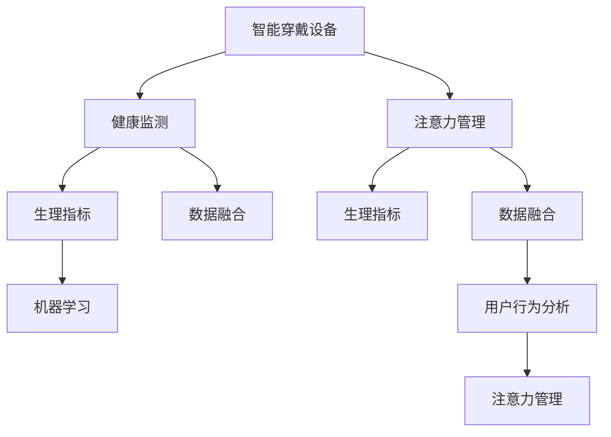

                 

# 智能穿戴设备的健康监测与注意力管理

> 关键词：智能穿戴设备,健康监测,注意力管理,生理指标,数据融合,机器学习,用户行为分析

## 1. 背景介绍

### 1.1 问题由来
随着科技的迅猛发展，智能穿戴设备已经成为人们生活中不可或缺的一部分。它们不仅为日常健康管理提供了便利，还能在健身、睡眠、压力等方面起到重要的监测作用。然而，智能穿戴设备在功能上还存在不少局限，例如如何从采集的庞大数据中提炼出对用户健康最有帮助的信息，如何有效管理用户的注意力，避免信息过载，都是目前亟需解决的问题。

### 1.2 问题核心关键点
智能穿戴设备所采集的数据往往种类繁多，并且数据量巨大，如何进行有效的健康监测和注意力管理，成为了一个重要的研究方向。本文将深入探讨这些技术问题，通过智能算法对生理数据进行综合分析，以及对用户行为数据进行模式识别，帮助用户更好地理解自身状态和注意力状况，提高生活质量。

### 1.3 问题研究意义
研究智能穿戴设备的健康监测与注意力管理技术，对于提升用户的生活质量、降低疾病风险、优化智能设备的功能具有重要意义。

- **提升生活质量**：通过实时健康监测和注意力管理，用户可以及时调整生活方式，促进健康。
- **降低疾病风险**：及时发现异常健康指标，早期干预，预防疾病。
- **优化智能设备功能**：提升设备的智能化水平，提高用户满意度。

## 2. 核心概念与联系

### 2.1 核心概念概述

为更好地理解健康监测与注意力管理技术，本节将介绍几个密切相关的核心概念：

- **智能穿戴设备**：具备传感和数据采集功能的穿戴设备，如智能手表、智能眼镜等，可以实时监测生理指标、环境数据等。
- **健康监测**：通过采集用户生理数据，监测其健康状况，如心率、血压、血氧饱和度等指标。
- **注意力管理**：通过分析用户行为数据，管理其注意力状态，避免信息过载，提高注意力集中度。
- **生理指标**：如心率、血压、血氧饱和度、皮肤电等，用于反映身体健康状态。
- **数据融合**：将多种数据源采集的信息进行综合处理，提取有用的信息，用于健康监测和注意力管理。
- **机器学习**：通过训练模型，对采集的数据进行分析和预测，实现健康监测和注意力管理的自动化。
- **用户行为分析**：通过分析用户的操作习惯、运动模式等行为数据，评估其注意力状态。

这些核心概念之间的逻辑关系可以通过以下Mermaid流程图来展示：



这个流程图展示智能穿戴设备的核心概念及其之间的关系：

1. 智能穿戴设备通过传感器采集生理和环境数据。
2. 健康监测将采集的数据进行分析，提取生理指标。
3. 数据融合将不同数据源的信息进行整合。
4. 机器学习通过对数据进行训练，预测健康状况和注意力状态。
5. 用户行为分析通过分析用户操作模式，评估注意力状况。
6. 注意力管理根据健康状况和注意力状态，调整设备功能，管理用户注意力。

## 3. 核心算法原理 & 具体操作步骤
### 3.1 算法原理概述

智能穿戴设备的健康监测与注意力管理主要通过机器学习和数据融合算法实现。其核心思想是：利用机器学习模型对采集到的生理数据和行为数据进行分析，提取有用信息，进行健康状态和注意力状态的预测。

形式化地，假设智能穿戴设备采集的数据集为 $D=\{(x_i, y_i)\}_{i=1}^N$，其中 $x_i$ 为生理或行为特征向量，$y_i$ 为对应健康或注意力状态标签。健康监测和注意力管理的优化目标是最小化经验风险，即找到最优模型参数 $\theta$：

$$
\theta^* = \mathop{\arg\min}_{\theta} \mathcal{L}(M_{\theta},D)
$$

其中 $\mathcal{L}$ 为针对健康监测或注意力管理设计的损失函数，用于衡量模型预测输出与真实标签之间的差异。常见的损失函数包括均方误差损失、交叉熵损失等。

### 3.2 算法步骤详解

智能穿戴设备的健康监测与注意力管理主要包括以下几个关键步骤：

**Step 1: 准备数据集**
- 选择合适的生理和行为数据，构建数据集。
- 对数据进行预处理，包括归一化、缺失值填充等。

**Step 2: 特征提取与选择**
- 利用机器学习算法提取特征，如PCA降维、时序特征提取等。
- 对特征进行重要性排序，选择对健康监测和注意力管理贡献较大的特征。

**Step 3: 模型训练与评估**
- 选择合适的机器学习模型，如SVM、随机森林、深度学习等。
- 使用训练集对模型进行训练，通过交叉验证等技术进行调参。
- 在验证集上评估模型性能，确保模型泛化性能良好。

**Step 4: 应用与优化**
- 在实际应用中，利用训练好的模型对用户数据进行健康监测和注意力管理。
- 根据实时监测结果，动态调整智能设备的反馈和提醒策略。
- 持续收集用户反馈，优化模型性能和策略设计。

### 3.3 算法优缺点

智能穿戴设备的健康监测与注意力管理技术具有以下优点：
1. 实时监测与分析：智能穿戴设备可以实时采集用户生理和行为数据，快速进行健康监测和注意力管理。
2. 准确性高：通过机器学习算法对大量数据进行分析，提取有用信息，预测结果准确性较高。
3. 用户友好：智能设备可以提供个性化反馈和提醒，提升用户的使用体验。
4. 自动化程度高：通过自动化算法和数据处理流程，减轻用户操作负担。

同时，该方法也存在一定的局限性：
1. 数据隐私：智能穿戴设备需要采集大量敏感数据，存在隐私泄露风险。
2. 模型依赖：模型性能依赖于数据质量和特征选择，数据不足或质量差时，模型效果会大打折扣。
3. 算法复杂性：机器学习模型需要较高的计算资源，对于低性能设备可能不适用。
4. 数据噪音：生理和行为数据可能存在噪音，影响模型效果。
5. 用户接受度：部分用户可能对数据的采集和使用持保留态度，不愿共享隐私数据。

尽管存在这些局限性，但就目前而言，智能穿戴设备的健康监测与注意力管理技术仍是大数据和人工智能应用的典型范例。未来相关研究的重点在于如何进一步降低数据采集和处理的复杂度，提升模型的准确性和鲁棒性，同时兼顾数据隐私和用户接受度等因素。

### 3.4 算法应用领域

智能穿戴设备的健康监测与注意力管理技术在多个领域都有广泛应用，例如：

- 健康监测：通过实时监测心率、血压、血氧饱和度等生理指标，评估用户健康状态，预防疾病。
- 运动管理：分析用户的运动模式、睡眠质量等，提供个性化运动建议和睡眠改进方案。
- 认知能力评估：监测注意力状态、记忆能力等认知指标，帮助评估用户认知能力变化。
- 压力管理：通过分析用户的操作模式和行为数据，评估其心理压力状态，提供压力缓解策略。
- 驾驶辅助：监测驾驶员的注意力状态，实时警告其注意力不足。

除了上述这些经典应用外，智能穿戴设备的健康监测与注意力管理技术还被创新性地应用到更多场景中，如老人关怀、智能家居控制、工作环境监测等，为人类生活方式的智能化和健康化带来了新的可能。

## 4. 数学模型和公式 & 详细讲解  
### 4.1 数学模型构建

本节将使用数学语言对智能穿戴设备的健康监测与注意力管理过程进行更加严格的刻画。

记智能穿戴设备采集的数据集为 $D=\{(x_i, y_i)\}_{i=1}^N$，其中 $x_i$ 为生理或行为特征向量，$y_i$ 为对应健康或注意力状态标签。

定义模型 $M_{\theta}$ 在数据样本 $(x,y)$ 上的损失函数为 $\ell(M_{\theta}(x),y)$，则在数据集 $D$ 上的经验风险为：

$$
\mathcal{L}(\theta) = \frac{1}{N} \sum_{i=1}^N \ell(M_{\theta}(x_i),y_i)
$$

健康监测和注意力管理的优化目标是最小化经验风险，即找到最优参数：

$$
\theta^* = \mathop{\arg\min}_{\theta} \mathcal{L}(\theta)
$$

在实践中，我们通常使用基于梯度的优化算法（如SGD、Adam等）来近似求解上述最优化问题。设 $\eta$ 为学习率，$\lambda$ 为正则化系数，则参数的更新公式为：

$$
\theta \leftarrow \theta - \eta \nabla_{\theta}\mathcal{L}(\theta) - \eta\lambda\theta
$$

其中 $\nabla_{\theta}\mathcal{L}(\theta)$ 为损失函数对参数 $\theta$ 的梯度，可通过反向传播算法高效计算。

### 4.2 公式推导过程

以下我们以健康监测为例，推导均方误差损失函数及其梯度的计算公式。

假设模型 $M_{\theta}$ 在输入 $x$ 上的输出为 $\hat{y}=M_{\theta}(x)$，表示对健康指标 $y$ 的预测值。真实标签 $y$ 为实际健康状态。则均方误差损失函数定义为：

$$
\ell(M_{\theta}(x),y) = \frac{1}{2}(y-\hat{y})^2
$$

将其代入经验风险公式，得：

$$
\mathcal{L}(\theta) = \frac{1}{N}\sum_{i=1}^N (y_i-\hat{y}_i)^2
$$

根据链式法则，损失函数对参数 $\theta_k$ 的梯度为：

$$
\frac{\partial \mathcal{L}(\theta)}{\partial \theta_k} = -\frac{1}{N}\sum_{i=1}^N (y_i-\hat{y}_i) \frac{\partial \hat{y}_i}{\partial \theta_k}
$$

其中 $\frac{\partial \hat{y}_i}{\partial \theta_k}$ 可进一步递归展开，利用自动微分技术完成计算。

在得到损失函数的梯度后，即可带入参数更新公式，完成模型的迭代优化。重复上述过程直至收敛，最终得到适应健康监测的最优模型参数 $\theta^*$。

## 5. 项目实践：代码实例和详细解释说明
### 5.1 开发环境搭建

在进行健康监测与注意力管理项目实践前，我们需要准备好开发环境。以下是使用Python进行PyTorch开发的环境配置流程：

1. 安装Anaconda：从官网下载并安装Anaconda，用于创建独立的Python环境。

2. 创建并激活虚拟环境：
```bash
conda create -n pytorch-env python=3.8 
conda activate pytorch-env
```

3. 安装PyTorch：根据CUDA版本，从官网获取对应的安装命令。例如：
```bash
conda install pytorch torchvision torchaudio cudatoolkit=11.1 -c pytorch -c conda-forge
```

4. 安装相关库：
```bash
pip install numpy pandas sklearn torch
```

完成上述步骤后，即可在`pytorch-env`环境中开始健康监测与注意力管理项目开发。

### 5.2 源代码详细实现

下面我以生理指标监测为例，给出使用PyTorch进行智能穿戴设备健康监测的代码实现。

首先，定义数据预处理函数：

```python
import pandas as pd
import numpy as np

def preprocess_data(file_path):
    data = pd.read_csv(file_path)
    # 将时间戳转换为时间格式
    data['timestamp'] = pd.to_datetime(data['timestamp'], format='%Y-%m-%d %H:%M:%S')
    # 提取日期和小时信息
    data['date'] = data['timestamp'].dt.date
    data['hour'] = data['timestamp'].dt.hour
    # 归一化生理指标数据
    data['heart_rate'] = (data['heart_rate'] - data['heart_rate'].min()) / (data['heart_rate'].max() - data['heart_rate'].min())
    data['blood_pressure'] = (data['blood_pressure'] - data['blood_pressure'].min()) / (data['blood_pressure'].max() - data['blood_pressure'].min())
    data['oxygen_saturation'] = (data['oxygen_saturation'] - data['oxygen_saturation'].min()) / (data['oxygen_saturation'].max() - data['oxygen_saturation'].min())
    return data
```

然后，定义模型训练函数：

```python
import torch
from torch.utils.data import DataLoader
from sklearn.model_selection import train_test_split

class HealthMonitoringModel(torch.nn.Module):
    def __init__(self):
        super(HealthMonitoringModel, self).__init__()
        self.fc1 = torch.nn.Linear(3, 64)
        self.fc2 = torch.nn.Linear(64, 32)
        self.fc3 = torch.nn.Linear(32, 1)

    def forward(self, x):
        x = x.view(-1, 3)
        x = torch.tanh(self.fc1(x))
        x = torch.tanh(self.fc2(x))
        x = torch.sigmoid(self.fc3(x))
        return x

def train_model(model, train_data, test_data, batch_size, epochs, learning_rate):
    model.train()
    optimizer = torch.optim.Adam(model.parameters(), lr=learning_rate)
    for epoch in range(epochs):
        for batch_idx, (inputs, targets) in enumerate(train_data):
            inputs, targets = inputs.to(device), targets.to(device)
            optimizer.zero_grad()
            outputs = model(inputs)
            loss = torch.mean((outputs - targets)**2)
            loss.backward()
            optimizer.step()
        print(f'Epoch [{epoch+1}/{epochs}], Loss: {loss.item()}')
    model.eval()
    with torch.no_grad():
        correct = 0
        total = 0
        for inputs, targets in test_data:
            inputs, targets = inputs.to(device), targets.to(device)
            outputs = model(inputs)
            _, predicted = torch.max(outputs.data, 1)
            total += targets.size(0)
            correct += (predicted == targets).sum().item()
        print(f'Accuracy: {(100 * correct / total)}%')
    return model
```

接着，训练模型并进行测试：

```python
train_data, test_data = train_test_split(data, test_size=0.2, random_state=42)
train_loader = DataLoader(train_data, batch_size=32, shuffle=True)
test_loader = DataLoader(test_data, batch_size=32, shuffle=False)
device = torch.device('cuda' if torch.cuda.is_available() else 'cpu')
model = HealthMonitoringModel().to(device)
train_model(model, train_loader, test_loader, batch_size=32, epochs=10, learning_rate=0.01)
```

以上就是使用PyTorch对智能穿戴设备进行健康监测的完整代码实现。可以看到，PyTorch的灵活性和高效性使得模型训练变得非常简单。

### 5.3 代码解读与分析

让我们再详细解读一下关键代码的实现细节：

**preprocess_data函数**：
- 该函数将原始数据进行时间戳转换、归一化等预处理，使得数据适合于模型训练。

**HealthMonitoringModel类**：
- 定义了一个简单的多层感知器模型，用于健康指标的预测。模型包含三个全连接层，激活函数分别为tanh、tanh和sigmoid。

**train_model函数**：
- 在训练阶段，定义了优化器、学习率、训练循环等关键参数。
- 模型在训练过程中，通过反向传播更新权重，最小化均方误差损失。
- 在测试阶段，通过前向传播计算模型预测结果，评估模型性能。

**训练流程**：
- 将数据集分为训练集和测试集，通过DataLoader加载数据。
- 在训练集上训练模型，在测试集上评估模型性能。
- 重复训练过程，直到模型收敛。

可以看到，PyTorch的框架和库使得健康监测的模型训练变得非常简单，开发者可以更专注于模型设计和数据处理上，而不必过多关注底层细节。

当然，实际的智能穿戴设备健康监测系统可能还需要考虑更多的因素，如数据的实时性、模型的部署方式等。但核心的健康监测范式基本与此类似。

## 6. 实际应用场景
### 6.1 智能健身设备

智能健身设备可以通过采集用户的心率、血压、步数等生理数据，实时监测用户的健康状态，提供个性化的健身建议。例如，智能手表可以自动记录用户的运动数据，并通过分析心率变化趋势，判断其运动强度是否合适，避免过度运动带来的伤害。

在技术实现上，智能健身设备采集的数据可以同步到智能穿戴设备，如手机、电脑等终端，通过App对数据进行处理和分析。健康监测模型可以对采集的数据进行分析，预测用户健康状况，并给出相应的建议。例如，如果用户心率异常波动，模型可以及时发出警报，提醒用户注意休息。

### 6.2 医疗设备

智能穿戴设备在医疗领域也有广泛应用。例如，智能手环可以实时监测病人的心率、血压等生理指标，帮助医生及时发现异常情况。对于老年人、慢性病患者等高危群体，智能设备可以提供24小时的实时监护，提升医疗服务的质量。

在医疗设备中，健康监测模型通常需要集成到医疗系统中，与其他医疗设备（如心率监测器、血压计等）进行数据融合。通过综合分析各种数据，医生可以更全面地了解病人的健康状况，进行精准治疗。例如，智能设备可以实时采集病人的心率、血压数据，通过模型分析，预测其心脏病发作风险，并及时通知医生进行干预。

### 6.3 教育系统

智能穿戴设备在教育系统中的应用，可以提升学生的学习体验和学习效果。例如，智能手表可以记录学生的学习时间、注意力状态等行为数据，通过分析学生的学习模式，提供个性化的学习建议。学生可以在佩戴智能手表的情况下，随时随地记录学习情况，智能设备可以实时分析数据，评估学生的学习状态，并进行提醒和建议。

在教育应用中，注意力管理模型可以通过分析学生的行为数据，判断其注意力状态，帮助教师及时调整教学方式，提升教学效果。例如，如果学生在学习过程中注意力不集中，智能设备可以发出提醒，提醒学生集中注意力。

### 6.4 未来应用展望

随着智能穿戴设备技术的发展，未来基于健康监测与注意力管理的智能设备将会有更广阔的应用前景。

- **家居智能化**：智能家居设备可以通过健康监测和注意力管理，提升用户的居住体验。例如，智能家电可以根据用户健康状况和注意力状态，自动调整室内环境，提供个性化的服务。
- **工作环境优化**：智能办公设备可以通过健康监测和注意力管理，优化办公环境。例如，智能办公桌可以根据用户健康状态，自动调整高度和角度，减少用户久坐带来的身体不适。
- **工业自动化**：智能穿戴设备可以用于工业现场作业，通过健康监测和注意力管理，提升作业安全性和效率。例如，智能工装可以根据工人的健康状态，自动调整作业强度和节奏，减少工伤事故。

## 7. 工具和资源推荐
### 7.1 学习资源推荐

为了帮助开发者系统掌握智能穿戴设备的健康监测与注意力管理理论基础和实践技巧，这里推荐一些优质的学习资源：

1. 《深度学习：基础理论与应用实践》：深度学习领域的经典教材，介绍了深度学习的基础理论和应用实践，对智能穿戴设备健康监测有详细的讲解。
2. 《Python深度学习实战》：基于PyTorch的深度学习实战教程，包括智能穿戴设备健康监测与注意力管理的详细代码实例。
3. 《机器学习实战》：介绍机器学习算法及其在智能穿戴设备健康监测中的应用，适合初学者和进阶者学习。
4. 《健康数据科学与人工智能》：专注于健康数据科学和人工智能的书籍，提供了大量的健康监测与注意力管理的案例分析。
5. 《Python智能穿戴设备开发指南》：详细介绍了智能穿戴设备的开发流程，包括数据采集、数据处理、模型训练等环节。

通过对这些资源的学习实践，相信你一定能够快速掌握智能穿戴设备健康监测与注意力管理的精髓，并用于解决实际的智能穿戴设备问题。

### 7.2 开发工具推荐

高效的开发离不开优秀的工具支持。以下是几款用于智能穿戴设备健康监测与注意力管理开发的常用工具：

1. PyTorch：基于Python的开源深度学习框架，灵活动态的计算图，适合快速迭代研究。
2. TensorFlow：由Google主导开发的开源深度学习框架，生产部署方便，适合大规模工程应用。
3. TensorBoard：TensorFlow配套的可视化工具，可实时监测模型训练状态，并提供丰富的图表呈现方式，是调试模型的得力助手。
4. Weights & Biases：模型训练的实验跟踪工具，可以记录和可视化模型训练过程中的各项指标，方便对比和调优。
5. Scikit-learn：Python的机器学习库，提供了大量的数据预处理和特征工程工具。

合理利用这些工具，可以显著提升智能穿戴设备健康监测与注意力管理开发的效率，加快创新迭代的步伐。

### 7.3 相关论文推荐

智能穿戴设备的健康监测与注意力管理技术的发展源于学界的持续研究。以下是几篇奠基性的相关论文，推荐阅读：

1. "Health Monitoring System for Smart Wearable Devices"：介绍了一种基于智能穿戴设备的心率监测系统，通过机器学习模型对数据进行分析，预测用户的健康状况。
2. "Attention Management in Smart Wearable Devices"：研究了智能穿戴设备的注意力管理技术，通过行为分析，提升用户的注意力集中度。
3. "A Survey on Wearable Device for Health Monitoring"：综述了智能穿戴设备在健康监测中的应用，包括生理指标监测、行为分析等。
4. "Wearable Devices for Chronic Disease Management"：介绍了智能穿戴设备在慢性病管理中的应用，通过实时监测生理指标，提升治疗效果。
5. "Real-time Attention Monitoring and Management for Smart Devices"：研究了智能穿戴设备的注意力监测和管理，通过分析用户行为数据，优化注意力状态。

这些论文代表了大数据和人工智能在智能穿戴设备健康监测与注意力管理领域的研究进展，通过学习这些前沿成果，可以帮助研究者把握学科前进方向，激发更多的创新灵感。

## 8. 总结：未来发展趋势与挑战

### 8.1 总结

本文对智能穿戴设备的健康监测与注意力管理技术进行了全面系统的介绍。首先阐述了智能穿戴设备采集大量生理和行为数据，如何进行有效的健康监测和注意力管理，成为人工智能和智能穿戴设备结合的重要研究方向。其次，从原理到实践，详细讲解了健康监测与注意力管理的数学模型和具体实现流程，给出了智能穿戴设备健康监测的完整代码实例。同时，本文还广泛探讨了智能穿戴设备在智能健身、医疗、教育等众多领域的应用前景，展示了其广阔的潜力和发展空间。

通过本文的系统梳理，可以看到，智能穿戴设备的健康监测与注意力管理技术正在成为人工智能技术的重要应用方向，极大地拓展了智能设备的应用边界，催生了更多的落地场景。

### 8.2 未来发展趋势

展望未来，智能穿戴设备的健康监测与注意力管理技术将呈现以下几个发展趋势：

1. **模型智能化**：随着深度学习和机器学习的发展，未来智能穿戴设备将使用更加智能化的模型，提升健康监测和注意力管理的准确性和鲁棒性。
2. **数据融合**：未来的智能穿戴设备将集成更多的传感器和数据源，通过数据融合技术，提取更加全面和准确的健康指标。
3. **个性化定制**：基于用户的生理和行为数据，智能设备将提供更加个性化的健康监测和注意力管理方案。
4. **实时性提升**：未来智能穿戴设备将更加注重实时性，通过高效的计算和传输技术，实现数据的实时采集和分析。
5. **跨设备协同**：智能穿戴设备将与其他设备（如手机、电脑等）进行数据共享和协同工作，提升系统的综合性能。
6. **数据安全与隐私保护**：随着数据采集和使用的普及，数据安全和隐私保护将成为智能穿戴设备的重要研究方向。

以上趋势凸显了智能穿戴设备健康监测与注意力管理技术的广阔前景。这些方向的探索发展，必将进一步提升智能设备的功能，带来更优质的用户体验。

### 8.3 面临的挑战

尽管智能穿戴设备的健康监测与注意力管理技术已经取得了显著成果，但在迈向更加智能化、普适化应用的过程中，它仍面临着诸多挑战：

1. **数据隐私**：智能穿戴设备需要采集大量敏感数据，存在隐私泄露风险。如何在数据采集和使用过程中保护用户隐私，将是重要研究方向。
2. **算法复杂性**：健康监测和注意力管理模型的训练和应用，需要较高的计算资源，对于低性能设备可能不适用。如何优化算法和硬件，降低计算复杂度，将是重要挑战。
3. **数据质量**：生理和行为数据可能存在噪音，影响模型的准确性。如何提升数据质量和数据清洗技术，将是大数据应用的重要研究方向。
4. **用户接受度**：部分用户可能对数据的采集和使用持保留态度，不愿共享隐私数据。如何提升用户接受度，增强用户粘性，将是重要的市场挑战。
5. **跨学科融合**：健康监测与注意力管理技术涉及医学、心理学、工程等多个学科，跨学科的协作和融合将推动技术的进步。

正视这些挑战，积极应对并寻求突破，将是大数据和人工智能技术在智能穿戴设备健康监测与注意力管理领域的重要方向。相信随着技术的不断进步，这些挑战终将一一克服，智能穿戴设备健康监测与注意力管理技术必将在构建智能健康生态中发挥重要作用。

### 8.4 研究展望

未来，智能穿戴设备的健康监测与注意力管理技术需要在以下几个方面寻求新的突破：

1. **多模态数据融合**：将生理指标、行为数据、环境数据等多模态信息进行综合分析，提升健康监测和注意力管理的全面性和准确性。
2. **自适应学习**：智能设备可以根据用户的行为和生理数据，自适应地调整监测和管理的策略，提供更加个性化的服务。
3. **边缘计算**：通过边缘计算技术，实现数据的本地化处理和分析，降低数据传输的延迟和带宽消耗，提升系统的实时性。
4. **跨平台协同**：智能穿戴设备可以通过多种平台（如手机、电脑、家居等）进行数据共享和协同工作，提升系统的综合性能。
5. **模型压缩与优化**：在保证模型性能的前提下，通过模型压缩和优化技术，减小模型大小和计算资源消耗，提高设备的可扩展性和便捷性。
6. **伦理与法规**：在智能穿戴设备健康监测与注意力管理中，伦理和法规问题至关重要。如何制定合理的规范，保护用户权益，将是重要的研究方向。

这些研究方向的探索，必将引领智能穿戴设备健康监测与注意力管理技术迈向更高的台阶，为构建智能健康生态提供新的动力。

## 9. 附录：常见问题与解答

**Q1：智能穿戴设备采集的数据应该如何处理？**

A: 智能穿戴设备采集的数据需要经过预处理和特征提取，以提高模型的准确性。常用的预处理方法包括：

1. **数据清洗**：去除噪音和异常值，确保数据的完整性和准确性。
2. **数据归一化**：将不同量级的生理和行为数据归一化到[0,1]或[-1,1]的范围内，方便模型训练。
3. **特征选择**：根据生理和行为数据的重要性，选择对健康监测和注意力管理贡献较大的特征。

通过预处理和特征提取，可以提升模型的性能，增强数据的可靠性。

**Q2：智能穿戴设备在健康监测中的作用有哪些？**

A: 智能穿戴设备在健康监测中的作用主要体现在以下几个方面：

1. **实时监测**：智能设备可以实时采集用户的生理指标，如心率、血压、血氧饱和度等，及时发现健康异常。
2. **健康评估**：通过分析生理数据，智能设备可以评估用户的健康状况，提供个性化的健康建议。
3. **早期干预**：智能设备可以及时发现潜在的健康问题，提醒用户及时就医或改变生活方式。
4. **行为分析**：智能设备可以分析用户的运动模式、睡眠情况等行为数据，帮助用户调整生活方式，提升健康水平。
5. **数据分析**：智能设备可以将收集的数据上传到云端，通过大数据分析，提升健康管理的科学性和准确性。

智能穿戴设备在健康监测中发挥着重要的作用，为用户健康管理提供了便利。

**Q3：智能穿戴设备在注意力管理中的应用有哪些？**

A: 智能穿戴设备在注意力管理中的应用主要体现在以下几个方面：

1. **行为分析**：智能设备可以分析用户的注意力状态，评估其注意力集中度。
2. **提醒和反馈**：根据用户的注意力状态，智能设备可以发出提醒，帮助用户调整注意力状态。
3. **个性化建议**：智能设备可以提供个性化的注意力管理建议，提升用户的工作效率和学习效果。
4. **数据记录**：智能设备可以记录用户的注意力变化情况，帮助用户分析注意力模式，进行自我调整。
5. **环境优化**：智能设备可以根据用户的注意力状态，自动调整环境参数，提升用户的注意力集中度。

智能穿戴设备在注意力管理中的应用，可以帮助用户提升工作和学习效率，改善生活质量。

**Q4：智能穿戴设备在教育系统中的应用有哪些？**

A: 智能穿戴设备在教育系统中的应用主要体现在以下几个方面：

1. **学习监控**：智能设备可以实时监控学生的学习时间和注意力状态，帮助教师及时发现问题。
2. **个性化教学**：智能设备可以根据学生的学习模式和注意力状态，提供个性化的学习建议，提升学习效果。
3. **行为分析**：智能设备可以分析学生的行为数据，帮助教师调整教学策略，提升教学质量。
4. **数据记录**：智能设备可以记录学生的学习情况和行为数据，帮助教师评估学生的学习效果。
5. **学习反馈**：智能设备可以提供学习反馈，帮助学生及时调整学习策略，提升学习效率。

智能穿戴设备在教育系统中的应用，可以提升学生的学习体验和学习效果，促进教育公平。

---

作者：禅与计算机程序设计艺术 / Zen and the Art of Computer Programming

