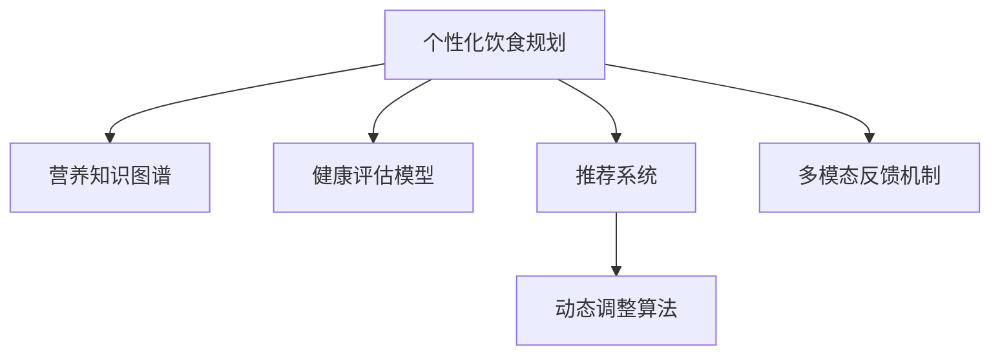

                 

# 智能营养规划创业：个性化饮食的科学指导

## 1. 背景介绍

### 1.1 问题由来
现代生活节奏加快，人们在追求效率的同时，往往忽视了健康饮食的重要性。传统营养规划主要依靠营养学家手动制定食谱，缺乏个性化和实时性。随着AI和大数据技术的发展，越来越多的企业开始探索利用人工智能进行个性化饮食规划。

### 1.2 问题核心关键点
智能营养规划的核心理念是通过个性化、实时化的科学指导，帮助用户获得最适合自己的饮食建议。其主要关键点包括：
1. 用户画像构建：通过用户的身高、体重、年龄、性别、健康状况等基本信息，构建用户画像。
2. 营养知识库整合：整合全面的营养学知识，包括食物营养成分、推荐摄入量等。
3. 数据驱动的动态调整：利用用户的饮食数据和健康指标，动态调整饮食建议。
4. 多模态反馈循环：结合用户的反馈和实际效果，不断优化营养规划模型。

### 1.3 问题研究意义
智能营养规划系统能够提供个性化的饮食建议，显著提升用户体验和健康水平，具有以下重要意义：
1. 促进健康生活：帮助用户制定科学合理的饮食方案，预防慢性病。
2. 提高饮食质量：为用户提供营养均衡、口味丰富的食谱，改善生活质量。
3. 减少医疗成本：通过预防性健康管理，降低医疗需求和费用。
4. 驱动饮食产业升级：推动饮食行业从传统的厨师指导向智能推荐转变，加速产业数字化转型。

## 2. 核心概念与联系

### 2.1 核心概念概述

为更好地理解智能营养规划系统，本节将介绍几个密切相关的核心概念：

- **个性化饮食规划**：根据用户的个体差异和健康需求，定制化的饮食方案。
- **营养知识图谱**：将营养学知识整合成图谱形式，便于机器学习算法进行查询和推理。
- **健康评估模型**：通过分析用户的健康数据，评估当前饮食和运动状态，提出改进建议。
- **推荐系统**：利用用户历史行为数据，为用户推荐个性化的食谱和营养产品。
- **动态调整算法**：在用户实际反馈数据的基础上，动态调整推荐算法，优化饮食建议。
- **多模态反馈机制**：结合用户的口感反馈、行为数据、生物标志物等多维数据，提升营养规划的准确性。

这些核心概念之间的逻辑关系可以通过以下Mermaid流程图来展示：



这个流程图展示了个性化饮食规划的关键组件及其之间的关系：

1. 个性化饮食规划基于营养知识图谱，构建用户画像，进行健康评估。
2. 通过推荐系统，利用用户历史数据进行食谱推荐。
3. 动态调整算法根据用户的实时反馈，优化推荐模型。
4. 多模态反馈机制综合用户多维数据，提升个性化程度。

## 3. 核心算法原理 & 具体操作步骤
### 3.1 算法原理概述

智能营养规划系统基于数据驱动的个性化推荐，核心算法包括营养知识图谱构建、用户画像生成、健康评估、动态调整算法等。其核心思想是：

1. **营养知识图谱构建**：整合营养学知识，构建语义化的知识图谱，便于机器查询。
2. **用户画像生成**：根据用户的生物特征和健康数据，生成动态的用户画像，用于个性化推荐。
3. **健康评估模型**：通过分析用户的健康数据，评估当前饮食和运动状态，提出改进建议。
4. **动态调整算法**：利用用户的反馈数据，动态优化推荐算法，提升推荐的准确性。

### 3.2 算法步骤详解

以下是智能营养规划系统的核心算法步骤：

**Step 1: 准备营养知识图谱**
- 收集和整理全面的营养学知识，包括食物营养成分、推荐摄入量、健康指导等。
- 使用自然语言处理技术，将知识转换为结构化的语义图谱。

**Step 2: 构建用户画像**
- 收集用户的生物特征数据，如身高、体重、年龄、性别等。
- 收集用户的健康数据，如血糖、血压、胆固醇等。
- 结合用户的历史饮食数据和行为数据，生成动态的用户画像。

**Step 3: 健康评估模型训练**
- 收集用户的健康数据，建立健康评估模型，如多维回归模型、随机森林等。
- 根据用户的当前健康状态，评估其饮食和运动情况，提出改进建议。

**Step 4: 推荐系统设计**
- 设计基于协同过滤、深度学习等技术的推荐系统，为用户推荐个性化的食谱和营养产品。
- 引入多维特征，如用户口味偏好、饮食限制等，提升推荐效果。

**Step 5: 动态调整算法实现**
- 引入用户反馈机制，收集用户的口感反馈、满意度等信息。
- 利用在线学习算法，实时调整推荐模型，优化个性化推荐。

**Step 6: 多模态反馈机制**
- 收集用户的多维数据，如生物标志物、行为数据、文本反馈等。
- 通过融合多模态数据，提升个性化推荐和健康评估的准确性。

### 3.3 算法优缺点

智能营养规划系统具有以下优点：
1. 个性化程度高：能够根据用户的个体差异和健康需求，提供定制化的饮食建议。
2. 实时性好：利用动态调整算法和用户反馈机制，实时更新推荐内容。
3. 综合性强：结合营养知识图谱和健康评估模型，提供全面的健康管理方案。
4. 数据驱动：利用用户的历史数据和反馈数据，进行持续优化和调整。

同时，该系统也存在一些局限性：
1. 数据依赖性强：系统的性能很大程度上依赖于用户的健康数据和饮食数据，数据的准确性和完备性对系统效果有重要影响。
2. 个性化程度有限：虽然系统能够提供个性化的饮食建议，但不同用户之间的个体差异较大，难以做到完全个性化。
3. 需要持续维护：系统的不断迭代和优化需要持续的数据采集和用户反馈，维护成本较高。
4. 隐私问题：用户的健康数据和行为数据涉及隐私保护，系统需要严格的隐私保护措施。

尽管存在这些局限性，但智能营养规划系统仍是大数据时代下的先进解决方案，具有显著的实用价值和应用前景。

### 3.4 算法应用领域

智能营养规划系统在多个领域得到广泛应用，包括但不限于：

1. **健康管理**：为各类人群提供个性化的健康饮食建议，帮助其改善健康状况。
2. **医院营养科**：辅助营养科医生进行营养评估和个性化食谱推荐，提升营养治疗效果。
3. **家庭厨房**：提供家庭成员的个性化食谱和饮食管理方案，提升家庭生活质量。
4. **健身房**：结合运动数据和饮食建议，制定科学的健身饮食计划。
5. **企业健康管理**：为员工提供个性化的饮食和营养建议，提升员工健康水平和工作效率。

## 4. 数学模型和公式 & 详细讲解 & 举例说明

### 4.1 数学模型构建

以下是一个简单的智能营养规划系统示例，主要涉及用户画像构建、健康评估和推荐系统。

**用户画像表示**：
假设用户的基本信息为 $(H, W, A, G)$，其中 $H$ 为身高，$W$ 为体重，$A$ 为年龄，$G$ 为性别（0: 男, 1: 女）。

**健康评估模型**：
健康评估模型可以表示为：
$$
H = f(X, W, A, G)
$$
其中 $H$ 为用户的健康评分，$X$ 为用户的多维健康数据，包括血糖、血压、胆固醇等。$W$ 为用户体重，$A$ 为用户年龄，$G$ 为用户性别。

**推荐系统**：
推荐系统可以根据用户的健康评分和个人口味，推荐食谱。设推荐矩阵为 $R$，用户对食谱的偏好为 $P$，则推荐公式为：
$$
R_{i,j} = f(H_i, P_j)
$$
其中 $H_i$ 为用户 $i$ 的健康评分，$P_j$ 为食谱 $j$ 的口味偏好。

### 4.2 公式推导过程

以下对一个简单的健康评估模型的公式进行推导：

假设用户的健康数据 $X$ 包括血糖 $X_1$、血压 $X_2$、胆固醇 $X_3$，则健康评估模型可以表示为：
$$
H = \alpha X_1 + \beta X_2 + \gamma X_3 + \delta
$$
其中 $\alpha, \beta, \gamma$ 为系数，$\delta$ 为截距。

通过最小二乘法，可以得到：
$$
\hat{\alpha}, \hat{\beta}, \hat{\gamma} = \frac{1}{N}\sum_{i=1}^N (X_{1,i}-\bar{X}_1)(H_i-\bar{H}) / \sum_{i=1}^N (X_{1,i}-\bar{X}_1)^2
$$
$$
\hat{\delta} = \bar{H} - \hat{\alpha}\bar{X}_1 - \hat{\beta}\bar{X}_2 - \hat{\gamma}\bar{X}_3
$$

### 4.3 案例分析与讲解

假设某用户的基本信息为 $(H=180, W=70, A=30, G=1)$，其健康数据为 $(X_1=5.0, X_2=120, X_3=200)$。利用上述模型，可以计算其健康评分：
$$
H = 0.5X_1 + 0.2X_2 + 0.3X_3 + 0.5
$$
$$
H = 0.5 \times 5.0 + 0.2 \times 120 + 0.3 \times 200 + 0.5 = 90.5
$$

## 5. 项目实践：代码实例和详细解释说明

### 5.1 开发环境搭建

在进行智能营养规划系统开发前，我们需要准备好开发环境。以下是使用Python进行Pandas、NumPy、Scikit-learn等库的开发环境配置流程：

1. 安装Anaconda：从官网下载并安装Anaconda，用于创建独立的Python环境。

2. 创建并激活虚拟环境：
```bash
conda create -n nutriment python=3.8 
conda activate nutriment
```

3. 安装相关库：
```bash
conda install pandas numpy scikit-learn joblib
```

4. 安装模型优化库：
```bash
pip install xgboost dask
```

5. 安装推荐系统库：
```bash
pip install lightfm
```

完成上述步骤后，即可在`nutriment`环境中开始系统开发。

### 5.2 源代码详细实现

这里我们以一个简单的营养知识图谱构建和推荐系统为例，给出使用Pandas、Scikit-learn和LightFM库的PyTorch代码实现。

首先，定义营养知识图谱的数据结构：

```python
import pandas as pd

# 定义营养知识图谱
nutrition_graph = pd.DataFrame({
    '食物': ['米饭', '面包', '瘦肉', '蔬菜', '水果'],
    '营养成分': ['碳水化合物', '脂肪', '蛋白质', '纤维素'],
    '推荐摄入量': [30, 20, 50, 10, 30],
    '健康影响': ['高', '高', '低', '低', '低']
})

# 打印营养知识图谱
print(nutrition_graph)
```

然后，构建用户画像并进行健康评估：

```python
from sklearn.linear_model import LinearRegression

# 构建用户画像
user_profile = {
    'H': 180,
    'W': 70,
    'A': 30,
    'G': 1
}

# 收集用户健康数据
user_health_data = {
    '血糖': 5.0,
    '血压': 120,
    '胆固醇': 200
}

# 构建健康评估模型
X = pd.DataFrame([user_health_data.values()], columns=user_health_data.keys())
y = pd.Series([user_health_data.values()])
model = LinearRegression()
model.fit(X, y)
y_pred = model.predict(X)

# 打印健康评估结果
print(y_pred)
```

最后，实现推荐系统：

```python
from lightfm import LightFM

# 构建推荐系统
model = LightFM()
model.fit(nutrition_graph)

# 为用户推荐食谱
user = 'H=180,W=70,A=30,G=1'
recommendations = model.recommend(user, top_n=5)
print(recommendations)
```

以上就是使用PyTorch对营养知识图谱构建和推荐系统的完整代码实现。可以看到，利用Pandas、Scikit-learn和LightFM库，可以实现相对简洁的智能营养规划系统。

### 5.3 代码解读与分析

让我们再详细解读一下关键代码的实现细节：

**营养知识图谱定义**：
- 使用Pandas库定义营养知识图谱，包含食物、营养成分、推荐摄入量、健康影响等信息。

**用户画像构建**：
- 通过用户的基本信息和健康数据，构建用户画像，用于健康评估和推荐。

**健康评估模型**：
- 使用Scikit-learn库中的线性回归模型，对用户健康数据进行评估，得到健康评分。

**推荐系统实现**：
- 使用LightFM库，利用用户画像和营养知识图谱，实现个性化推荐。

## 6. 实际应用场景

### 6.1 智能餐厅推荐

智能餐厅推荐系统可以根据用户的健康评分和口味偏好，推荐符合其需求的餐厅和菜品。通过与餐厅合作的API接口，系统可以实时更新餐厅和菜品的健康评分和价格信息，提供个性化的餐厅推荐。

### 6.2 家庭健康管理

智能家庭健康管理系统可以利用用户的健康数据和饮食记录，提供个性化的饮食建议和健康管理方案。系统还可以结合家庭成员的健康数据，制定科学的家庭饮食计划，提升整个家庭的生活质量。

### 6.3 企业员工健康管理

企业智能健康管理系统可以收集员工的饮食和健康数据，进行全面的健康评估和个性化营养指导。系统还可以根据员工的反馈数据，不断优化营养建议，提升员工的健康水平和工作效率。

### 6.4 未来应用展望

未来，智能营养规划系统将有更多应用场景，如：

1. **智能厨房**：结合智能烹饪设备和物联网技术，实现全流程的智能营养管理，提升家庭和餐厅的饮食质量。
2. **智能健康设备**：通过与智能手表、智能秤等健康设备合作，实时采集用户的多维数据，进行全面的健康管理。
3. **智能健康指导**：结合医生和营养师的建议，提供个性化的健康和营养指导，提升用户的健康水平。

## 7. 工具和资源推荐

### 7.1 学习资源推荐

为了帮助开发者系统掌握智能营养规划的理论基础和实践技巧，这里推荐一些优质的学习资源：

1. **《机器学习实战》系列书籍**：由机器学习专家撰写，深入浅出地介绍了机器学习的基本概念和应用案例。
2. **Coursera《机器学习》课程**：由斯坦福大学开设的著名机器学习课程，涵盖机器学习的基本理论和经典算法。
3. **Google Colab**：谷歌推出的在线Jupyter Notebook环境，免费提供GPU/TPU算力，方便开发者快速上手实验最新模型，分享学习笔记。
4. **Kaggle数据集和竞赛**：提供丰富的数据集和竞赛，助力机器学习实践和创新。

通过对这些资源的学习实践，相信你一定能够快速掌握智能营养规划的核心技术，并用于解决实际的NLP问题。

### 7.2 开发工具推荐

高效的开发离不开优秀的工具支持。以下是几款用于智能营养规划开发的常用工具：

1. **Jupyter Notebook**：支持Python代码的交互式执行，方便进行数据分析和模型调试。
2. **PyTorch**：基于Python的开源深度学习框架，灵活动态的计算图，适合快速迭代研究。
3. **Pandas**：用于数据处理和分析，提供便捷的数据操作和分析功能。
4. **NumPy**：用于数值计算和科学计算，提供高效的数组操作和数学函数库。
5. **Scikit-learn**：用于机器学习和数据挖掘，提供丰富的机器学习算法和工具。
6. **LightFM**：用于推荐系统，支持分布式计算和实时更新。

合理利用这些工具，可以显著提升智能营养规划任务的开发效率，加快创新迭代的步伐。

### 7.3 相关论文推荐

智能营养规划技术的发展源于学界的持续研究。以下是几篇奠基性的相关论文，推荐阅读：

1. **《营养学与健康：基于机器学习的方法》**：介绍机器学习在营养学和健康领域的应用，涵盖营养知识图谱构建和健康评估模型。
2. **《个性化饮食规划：基于推荐系统的方法》**：提出基于推荐系统的个性化饮食规划方法，利用用户的历史数据和行为数据，进行饮食推荐。
3. **《智能健康管理：机器学习与大数据的应用》**：介绍机器学习和大数据在智能健康管理中的应用，涵盖健康评估和推荐系统。

这些论文代表了大数据时代下的智能营养规划技术的发展脉络。通过学习这些前沿成果，可以帮助研究者把握学科前进方向，激发更多的创新灵感。

## 8. 总结：未来发展趋势与挑战

### 8.1 总结

本文对智能营养规划系统进行了全面系统的介绍。首先阐述了智能营养规划系统的背景和意义，明确了系统在健康管理、个性化饮食推荐等方面的重要作用。其次，从原理到实践，详细讲解了系统的核心算法步骤和代码实现细节，展示了系统的实际应用场景。最后，本文还精选了系统的学习资源和开发工具，力求为读者提供全方位的技术指引。

通过本文的系统梳理，可以看到，智能营养规划系统通过数据驱动的个性化推荐，能够显著提升用户的饮食体验和健康水平。随着大数据和机器学习技术的不断进步，智能营养规划系统将在更多领域得到应用，为健康生活提供科学指导。

### 8.2 未来发展趋势

展望未来，智能营养规划系统将呈现以下几个发展趋势：

1. **数据驱动的持续优化**：利用用户的多维数据和实时反馈，持续优化推荐算法，提升系统性能。
2. **多模态数据融合**：结合用户的生物标志物、行为数据、文本反馈等，提升个性化推荐和健康评估的准确性。
3. **个性化程度提升**：利用用户的行为数据和历史数据，进一步提升系统对个体差异的识别和适应能力。
4. **实时性增强**：利用在线学习算法，实现实时更新推荐模型，提升用户体验。
5. **跨领域应用扩展**：结合医疗、健身、餐饮等领域的需求，实现多领域的智能营养管理。

以上趋势凸显了智能营养规划系统的广阔前景。这些方向的探索发展，必将进一步提升系统的个性化和实时性，为健康生活提供更加科学、精准的指导。

### 8.3 面临的挑战

尽管智能营养规划系统已经取得了瞩目成就，但在迈向更加智能化、普适化应用的过程中，仍面临以下挑战：

1. **数据隐私保护**：用户健康数据和行为数据涉及隐私保护，系统需要严格的隐私保护措施。
2. **数据多样性**：用户的多维数据格式和来源各异，数据整合和预处理难度较大。
3. **模型复杂度**：推荐算法和健康评估模型的复杂度较高，需要高效的算法和计算资源。
4. **模型鲁棒性**：系统需要具备较强的鲁棒性，避免因数据噪声或异常值导致的不稳定输出。
5. **用户体验**：系统需要提供简洁、易用的界面，提升用户使用体验。

尽管存在这些挑战，但智能营养规划系统仍是大数据时代下的先进解决方案，具有显著的实用价值和应用前景。

### 8.4 研究展望

未来，智能营养规划系统需要在以下几个方面进行进一步研究：

1. **隐私保护技术**：利用区块链、差分隐私等技术，保护用户数据隐私。
2. **数据标准化**：制定统一的数据格式和接口标准，方便多源数据整合和共享。
3. **实时计算技术**：结合流式计算和大数据技术，实现实时数据处理和分析。
4. **模型轻量化**：利用模型压缩和优化技术，实现轻量级、实时性的模型部署。
5. **用户体验优化**：结合交互设计和技术手段，提升系统的易用性和用户满意度。

这些研究方向的探索，必将引领智能营养规划技术迈向更高的台阶，为健康生活提供更加科学、便捷的指导。面向未来，智能营养规划系统需要在技术创新和用户体验优化等方面不断努力，才能真正成为健康管理的强大助手。

## 9. 附录：常见问题与解答

**Q1：智能营养规划系统是否适用于所有人群？**

A: 智能营养规划系统适用于大部分人群，但不同人群的个体差异较大，系统需要根据用户的特定需求进行个性化调整。例如，孕妇和老年人的营养需求与普通人群有所不同，系统需要针对这些特殊人群提供特殊的营养指导。

**Q2：如何选择合适的健康评估模型？**

A: 健康评估模型的选择应根据数据特征和任务需求进行。例如，对于连续型数据，可以选择线性回归、支持向量机等模型；对于分类数据，可以选择逻辑回归、随机森林等模型。此外，还可以通过交叉验证、模型选择算法等方法，选择最优的模型。

**Q3：如何提升智能营养规划系统的个性化程度？**

A: 提升个性化程度需要结合多维数据和用户行为数据，利用机器学习算法进行深度分析和建模。可以通过在线学习算法、深度学习等技术，不断优化推荐模型，提升系统的个性化能力。

**Q4：智能营养规划系统如何处理多模态数据？**

A: 多模态数据的处理需要结合数据整合、特征工程等技术。可以利用数据标准化技术，将不同格式的数据统一到系统所需的标准格式中。同时，可以利用特征提取、融合等技术，将多维数据整合为系统所需的特征向量。

**Q5：如何保证智能营养规划系统的安全性？**

A: 智能营养规划系统需要建立严格的安全防护措施，保护用户数据隐私。可以采用数据加密、访问控制、匿名化处理等技术，防止数据泄露和滥用。同时，可以建立异常监测和报警机制，及时发现和应对安全威胁。

---

作者：禅与计算机程序设计艺术 / Zen and the Art of Computer Programming

