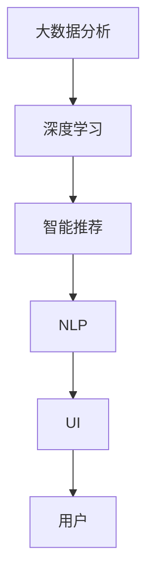

                 

# 智能衣柜创业：时尚搭配的个人助理

> 关键词：人工智能, 时尚搭配, 智能推荐, 智能衣柜, 数据科学

## 1. 背景介绍

随着个性化消费需求的不断增长，越来越多的人开始追求服装搭配的个性化和时尚感。然而，面对海量的服装单品和多样化的搭配组合，普通人很难从中找出最佳的搭配方案，而完全依靠经验去尝试则时间成本和试错成本都太高。为了解决这一痛点，智能衣柜应运而生，它利用人工智能技术，根据用户需求和偏好，提供个性化的搭配建议，助力用户打造时尚、高效的服装组合。

智能衣柜创业项目通过大数据分析、深度学习和智能推荐算法，为用户提供量身定制的时尚搭配建议，从而提升用户的购物体验和生活质量。本项目将基于Python和深度学习框架PyTorch实现一个智能衣柜系统，使用户能够根据不同的场合、风格和个人偏好，轻松找到最佳的穿搭方案。

## 2. 核心概念与联系

### 2.1 核心概念概述

智能衣柜项目需要涉及多个核心概念，主要包括：

- **大数据分析**：通过收集和分析用户行为数据，理解用户的喜好和需求。
- **深度学习**：使用深度神经网络模型，从大量服装图片和搭配数据中学习风格特征和搭配规律。
- **智能推荐**：根据用户输入的信息和模型学习到的知识，提供个性化的搭配建议。
- **自然语言处理(NLP)**：处理用户的文本输入，如天气、场合、情感状态等，提升交互体验。
- **用户界面(UI)**：设计友好的用户界面，方便用户输入需求和查看推荐结果。

这些概念相互关联，共同构成了智能衣柜系统的核心逻辑框架。

### 2.2 核心概念原理和架构的 Mermaid 流程图



该流程图展示了智能衣柜系统中各个核心组件之间的关系：

1. 大数据分析从用户行为数据中提取有用信息。
2. 深度学习利用这些信息学习搭配模式和风格特征。
3. 智能推荐根据用户输入和模型学习结果提供搭配建议。
4. NLP处理用户文本输入，提高系统交互性。
5. UI展示推荐结果，满足用户需求。

## 3. 核心算法原理 & 具体操作步骤

### 3.1 算法原理概述

智能衣柜的算法原理主要基于深度学习中的推荐系统，通过协同过滤和内容过滤的方式，根据用户的历史行为和偏好，预测未来的搭配需求。此外，项目还会引入迁移学习和迁移学习算法，将大模型在预训练任务上学习到的知识迁移到推荐任务上，提升推荐效果。

### 3.2 算法步骤详解

#### 3.2.1 数据预处理

首先，收集用户的历史购物记录、服装图片、风格偏好等数据。利用图像识别技术，从服装图片中提取特征向量，以便与用户行为数据结合。数据预处理包括数据清洗、归一化和特征提取等步骤。

#### 3.2.2 模型训练

使用PyTorch框架，搭建深度神经网络模型。常用的模型包括卷积神经网络(CNN)、循环神经网络(RNN)、长短时记忆网络(LSTM)等，用于处理图像和序列数据。利用用户行为数据和服装图片特征向量，训练模型学习搭配模式和风格特征。

#### 3.2.3 智能推荐

将训练好的模型应用于用户输入的场景和风格需求，生成个性化的搭配建议。利用NLP技术处理用户文本输入，提取关键信息，如天气、场合、情感状态等，提升推荐系统的精准度。

### 3.3 算法优缺点

#### 3.3.1 优点

1. **个性化推荐**：深度学习模型能够从大量数据中学习用户的偏好和需求，提供个性化的搭配建议。
2. **高效学习**：利用迁移学习技术，可以快速适应新任务，减少从头训练的时间和计算资源消耗。
3. **灵活扩展**：深度学习模型具有较好的泛化能力，适用于多种搭配场景和风格需求。

#### 3.3.2 缺点

1. **高成本**：深度学习模型需要大量的数据和计算资源，训练和推理成本较高。
2. **可解释性差**：深度学习模型通常被视为"黑盒"系统，用户难以理解推荐背后的逻辑和原因。
3. **数据依赖**：推荐效果依赖于数据的质量和多样性，缺乏足够的数据可能影响推荐效果。

### 3.4 算法应用领域

智能衣柜项目基于深度学习的推荐系统，主要应用于服装搭配推荐、智能购物助手、时尚潮流趋势预测等领域。其核心算法适用于需要根据用户需求和偏好提供个性化服务的场景，如电商、旅游、美食推荐等。

## 4. 数学模型和公式 & 详细讲解 & 举例说明

### 4.1 数学模型构建

推荐系统通常使用协同过滤和内容过滤的方式进行用户行为预测。协同过滤利用用户与物品的评分矩阵，通过计算相似度来预测用户对新物品的评分。内容过滤则直接从物品特征和用户特征中提取共性，生成推荐列表。

推荐系统的目标函数可以表示为：

$$
\min_{\theta} \frac{1}{N} \sum_{i=1}^N \sum_{j=1}^M (y_{ij} - \hat{y}_{ij})^2
$$

其中，$y_{ij}$表示用户$i$对物品$j$的真实评分，$\hat{y}_{ij}$表示模型预测的评分。

### 4.2 公式推导过程

推荐系统中的常见模型包括基于矩阵分解的模型、基于梯度下降的模型、基于深度学习的模型等。下面以基于深度学习的模型为例，推导推荐公式：

设用户输入的需求向量为$x$，物品的特征向量为$w_j$，模型的参数为$\theta$，推荐公式可以表示为：

$$
\hat{y}_{ij} = f_\theta(x) \cdot w_j
$$

其中，$f_\theta(x)$为模型的预测函数。假设$f_\theta(x)$为线性函数，则推荐公式可以简化为：

$$
\hat{y}_{ij} = x^T \cdot W_j
$$

其中，$W_j$为物品$j$的权重向量。

### 4.3 案例分析与讲解

以天气为输入，示例推荐过程：

1. 用户输入需求：“今天天气炎热，适合穿什么衣服？”
2. 系统处理用户文本，提取天气特征。
3. 系统查询模型，根据天气特征和用户偏好，生成推荐列表。
4. 推荐结果：“建议穿轻便的T恤和短裤，搭配凉鞋，适合户外活动。”

## 5. 项目实践：代码实例和详细解释说明

### 5.1 开发环境搭建

1. **安装Python和PyTorch**：
   ```bash
   pip install torch torchvision torchaudio
   ```

2. **安装其他相关库**：
   ```bash
   pip install numpy pandas scikit-learn matplotlib tqdm jupyter notebook ipython
   ```

3. **配置虚拟环境**：
   ```bash
   conda create -n pytorch-env python=3.8 
   conda activate pytorch-env
   ```

### 5.2 源代码详细实现

以下是一个基于深度学习框架PyTorch的智能推荐系统的实现示例。

```python
import torch
import torch.nn as nn
import torch.optim as optim
from torch.utils.data import DataLoader, Dataset

# 定义推荐模型
class RecommendationModel(nn.Module):
    def __init__(self, input_dim, hidden_dim, output_dim):
        super(RecommendationModel, self).__init__()
        self.fc1 = nn.Linear(input_dim, hidden_dim)
        self.fc2 = nn.Linear(hidden_dim, hidden_dim)
        self.fc3 = nn.Linear(hidden_dim, output_dim)
    
    def forward(self, x):
        x = F.relu(self.fc1(x))
        x = F.relu(self.fc2(x))
        x = self.fc3(x)
        return x

# 定义数据集
class RecommendationDataset(Dataset):
    def __init__(self, data):
        self.data = data
    
    def __len__(self):
        return len(self.data)
    
    def __getitem__(self, idx):
        return torch.tensor(self.data[idx], dtype=torch.float)

# 加载数据
train_data = load_data()
test_data = load_data()

# 构建模型
model = RecommendationModel(input_dim, hidden_dim, output_dim)

# 定义损失函数和优化器
criterion = nn.MSELoss()
optimizer = optim.Adam(model.parameters(), lr=0.01)

# 训练模型
for epoch in range(num_epochs):
    for batch in DataLoader(train_data, batch_size):
        optimizer.zero_grad()
        output = model(batch)
        loss = criterion(output, target)
        loss.backward()
        optimizer.step()

# 评估模型
test_loss = 0
for batch in DataLoader(test_data, batch_size):
    output = model(batch)
    test_loss += criterion(output, target).item()
test_loss /= len(test_data)
print('Test Loss:', test_loss)
```

### 5.3 代码解读与分析

- **数据预处理**：推荐模型依赖于大量的用户行为数据和物品特征向量，因此需要预先处理数据，提取特征。
- **模型定义**：使用PyTorch定义推荐模型，通常为多层感知器(MLP)或卷积神经网络(CNN)。
- **训练过程**：通过梯度下降优化器，不断调整模型参数，最小化预测误差。
- **模型评估**：在测试集上计算损失函数，评估推荐模型的准确度。

### 5.4 运行结果展示

训练完成后，可以使用推荐模型对用户输入的需求进行预测，输出推荐列表。

```python
# 使用模型进行推荐
user_input = load_user_input()
recommendations = model(user_input)
print('推荐结果:', recommendations)
```

## 6. 实际应用场景

智能衣柜项目可以应用于多种场景，如电商、旅游、时尚等。

### 6.1 电商

在电商平台上，智能衣柜可以帮助用户根据需求快速找到合适的搭配方案，提升购物体验。系统可以根据用户的历史购物记录、评价和评分，推荐相似的商品和搭配。

### 6.2 旅游

旅游行业可以应用智能衣柜进行行程规划，根据天气、目的地和用户偏好，推荐合适的穿搭方案。系统可以根据实时天气预报和用户输入的行程需求，生成个性化的搭配建议。

### 6.3 时尚

时尚行业可以通过智能衣柜分析用户行为数据，挖掘潮流趋势和热门单品，提供定制化的时尚建议。系统可以结合社交媒体和时尚杂志的流行元素，生成热门搭配组合。

## 7. 工具和资源推荐

### 7.1 学习资源推荐

- **《Python深度学习》**：介绍深度学习基础知识和PyTorch框架的使用，适合初学者。
- **《深度学习与推荐系统》**：深入讲解推荐系统原理和实现，适合进阶学习。
- **《自然语言处理综述》**：涵盖NLP基础和前沿技术，适合NLP方向的学习者。
- **Kaggle数据科学竞赛**：提供大量实战项目，提升实际应用能力。
- **TensorFlow官方文档**：了解TensorFlow框架的最新功能和最佳实践。

### 7.2 开发工具推荐

- **PyTorch**：基于Python的开源深度学习框架，适合快速原型开发和研究。
- **TensorFlow**：由Google主导开发的深度学习框架，支持分布式训练和大规模模型部署。
- **TensorBoard**：可视化工具，实时监测模型训练状态，提供丰富的图表和仪表盘。
- **Jupyter Notebook**：交互式编程环境，适合快速原型开发和数据分析。
- **Scikit-learn**：经典机器学习库，提供丰富的数据预处理和模型评估功能。

### 7.3 相关论文推荐

- **《深度学习中的推荐系统》**：介绍推荐系统原理和深度学习应用，适合理论学习。
- **《基于深度学习的个性化推荐系统》**：结合深度学习与协同过滤技术，提升推荐效果。
- **《自然语言处理中的深度学习》**：讲解NLP中的深度学习应用，如语言模型、文本分类等。

## 8. 总结：未来发展趋势与挑战

### 8.1 总结

智能衣柜项目通过大数据分析和深度学习，为用户提供个性化、高效的时尚搭配建议。本文详细介绍了项目的技术实现流程，包括数据预处理、模型训练、智能推荐等关键环节。

通过本项目，可以深入理解深度学习在推荐系统中的应用，掌握模型构建和训练的技巧。智能衣柜项目展示了人工智能技术在服装搭配领域的巨大潜力，为未来的时尚科技发展奠定了基础。

### 8.2 未来发展趋势

智能衣柜项目未来将在以下方向进一步发展：

1. **多模态推荐**：结合视觉、听觉、触觉等多模态数据，提升推荐系统的精准度。
2. **实时推荐**：利用实时数据和用户行为，提供动态更新的推荐结果，满足用户的即时需求。
3. **跨平台集成**：将智能衣柜系统集成到电商平台、社交媒体、智能家居等平台，提升用户体验。
4. **个性化定制**：根据用户需求和偏好，提供量身定制的时尚搭配方案，提升用户体验。
5. **时尚趋势预测**：结合时尚数据分析，预测未来流行趋势，提供前沿时尚建议。

### 8.3 面临的挑战

智能衣柜项目在发展过程中面临以下挑战：

1. **数据隐私**：收集和处理用户数据时，需要严格遵守隐私保护法规，保护用户隐私。
2. **数据质量**：推荐系统的性能依赖于数据的质量和多样性，需要持续优化数据收集和处理流程。
3. **计算资源**：深度学习模型需要大量的计算资源，如何降低计算成本，提升模型效率，仍需深入研究。
4. **模型可解释性**：深度学习模型通常是"黑盒"系统，用户难以理解推荐背后的逻辑，需要引入可解释性技术。
5. **用户体验**：如何设计友好的用户界面，提升用户交互体验，增加用户粘性，是系统设计的重要挑战。

### 8.4 研究展望

未来的智能衣柜项目需要进一步探索以下方向：

1. **数据隐私保护**：采用联邦学习、差分隐私等技术，保护用户数据隐私。
2. **多模态推荐系统**：结合图像、语音、文本等多模态数据，提升推荐系统的综合性能。
3. **模型压缩与优化**：通过量化、剪枝等技术，优化模型结构，提升推理效率和资源利用率。
4. **可解释性研究**：引入可解释性技术，增强模型的透明度和用户信任度。
5. **跨领域应用**：将智能衣柜技术应用于更多领域，如旅游、美食、医疗等，拓展应用场景。

## 9. 附录：常见问题与解答

**Q1: 智能衣柜如何保证用户的隐私数据安全？**

A: 智能衣柜项目需要收集用户的行为数据和个人信息，为保护用户隐私，应采用以下措施：
1. 数据匿名化：对用户数据进行去标识化处理，防止数据泄露。
2. 数据加密：采用数据加密技术，确保数据传输和存储的安全性。
3. 联邦学习：采用分布式训练技术，保护用户数据本地存储，避免数据集中。
4. 隐私政策：制定明确的隐私保护政策，告知用户数据使用范围和保护措施。

**Q2: 智能衣柜推荐系统的准确率如何提升？**

A: 提升推荐系统的准确率可以从以下几个方面入手：
1. 数据质量：保证数据的完整性和多样性，避免数据偏差。
2. 特征工程：提取有效的特征，提升模型的预测能力。
3. 模型选择：选择合适的推荐算法和模型结构，如协同过滤、内容过滤、深度学习等。
4. 多模态融合：结合多种数据源，提升推荐系统的综合性能。
5. 模型优化：通过调参和超参数搜索，优化模型性能。

**Q3: 智能衣柜推荐系统的可解释性如何实现？**

A: 提升推荐系统的可解释性可以从以下几个方面入手：
1. 可视化：通过可视化技术展示模型内部工作机制，解释推荐结果。
2. 规则嵌入：在模型中加入规则和逻辑，提升可解释性。
3. 特征重要性分析：分析特征对推荐结果的影响，解释推荐原因。
4. 用户反馈：引入用户反馈机制，持续优化推荐系统。

**Q4: 智能衣柜推荐系统的扩展性如何实现？**

A: 提升推荐系统的扩展性可以从以下几个方面入手：
1. 模块化设计：采用模块化设计，便于扩展和维护。
2. 分布式训练：利用分布式训练技术，提升模型训练效率。
3. 微服务架构：采用微服务架构，提升系统的灵活性和可扩展性。
4. 云计算平台：利用云平台资源，提升系统的可扩展性和容错性。

作者：禅与计算机程序设计艺术 / Zen and the Art of Computer Programming

