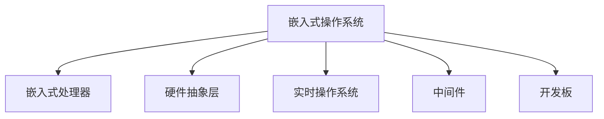

                 

# 智能设备开发：嵌入式系统设计与实现

> 关键词：
    - 嵌入式系统
    - 智能设备开发
    - 系统设计
    - 硬件开发
    - 软件架构
    - 原型开发
    - 系统测试
    - 应用部署

## 1. 背景介绍

### 1.1 问题由来
随着物联网(IoT)技术的发展，智能设备日益普及，成为人们日常生活中不可或缺的一部分。无论是可穿戴设备、智能家居设备，还是工业控制设备，都需要集成高性能、高可靠性的嵌入式系统。嵌入式系统作为智能设备的核心，其设计和实现关系到设备的性能、成本和用户体验。因此，了解和掌握嵌入式系统的设计和实现方法，对智能设备开发者来说至关重要。

### 1.2 问题核心关键点
嵌入式系统通常是指运行特定应用程序、执行特定任务而设计的操作系统，其特点是资源受限、应用场景多样。智能设备开发的核心关键点在于：
- **硬件选型与设计**：选择合适的硬件平台，确保硬件性能满足应用需求，同时考虑功耗、成本等因素。
- **软件架构设计**：设计高效、可扩展的软件架构，合理分配系统资源，确保系统稳定性和可靠性。
- **原型开发与测试**：快速迭代原型，进行系统测试和调试，验证系统的功能和性能。
- **应用部署与维护**：将系统部署到实际应用场景，定期进行系统维护和升级，保证设备长期稳定运行。

## 2. 核心概念与联系

### 2.1 核心概念概述

嵌入式系统设计涉及多个关键概念，如下：

- **嵌入式操作系统（Embedded Operating System, OS）**：专为嵌入式系统设计的操作系统，如FreeRTOS、Linux、RTOS等。操作系统负责管理硬件资源、调度任务、提供服务等功能。
- **嵌入式处理器（Embedded Processor）**：嵌入式系统的心脏，用于执行应用程序。常见的嵌入式处理器包括ARM Cortex系列、MIPS、RISC-V等。
- **硬件抽象层（Hardware Abstraction Layer, HAL）**：将硬件特性封装成抽象接口，方便上层软件开发。HAL通常包括驱动、中断管理、内存管理等功能。
- **实时操作系统（Real-Time Operating System, RTOS）**：对时间敏感的应用程序，如机器人、自动驾驶等。RTOS强调低延迟和高可靠性。
- **中间件（Middleware）**：提供标准化接口，简化系统开发，如MQTT、CoAP等通信协议。
- **开发板（Development Board）**：集成嵌入式处理器、内存、IO接口等的开发平台。常用的开发板包括树莓派（Raspberry Pi）、STM32 Nucleo系列等。

这些核心概念之间的逻辑关系可以通过以下Mermaid流程图来展示：



这个流程图展示了嵌入式系统的核心组件及其之间的关系：

1. 嵌入式操作系统管理硬件资源，调度任务。
2. 嵌入式处理器执行应用程序，实现系统功能。
3. 硬件抽象层封装硬件特性，提供标准化接口。
4. 实时操作系统强调低延迟和高可靠性。
5. 中间件提供标准化接口，简化系统开发。
6. 开发板集成处理器和IO接口，作为开发环境。

## 3. 核心算法原理 & 具体操作步骤

### 3.1 算法原理概述

嵌入式系统设计和实现涉及多个算法原理，主要包括以下几个方面：

- **任务调度算法**：决定任务的执行顺序和时间片大小，常见的有轮询、优先级调度、基于时间片的调度等。
- **内存管理算法**：管理程序的加载和卸载，内存分配和释放，如固定分区分配、动态分区分配、虚拟内存管理等。
- **中断处理算法**：中断请求的接收和处理，保证系统的实时性和响应性。
- **网络协议栈**：管理数据包的接收、发送和路由，如TCP/IP协议栈、UDP协议栈等。

### 3.2 算法步骤详解

嵌入式系统设计和实现的一般步骤包括：

1. **需求分析**：明确系统需求，确定功能和性能指标。
2. **硬件选型与设计**：选择合适的处理器和外围设备，进行硬件设计。
3. **软件架构设计**：设计软件架构，选择合适的操作系统和中间件。
4. **开发与测试**：进行原型开发，进行单元测试、集成测试和系统测试。
5. **应用部署与维护**：将系统部署到实际应用场景，进行系统维护和升级。

### 3.3 算法优缺点

嵌入式系统设计和实现的优势和劣势如下：

**优势**：
- **实时性**：嵌入式系统强调实时响应，适合处理时间敏感的任务。
- **资源效率**：嵌入式系统资源有限，设计高效的算法和数据结构可以显著提高系统性能。
- **稳定性**：嵌入式系统通常运行在物理设备上，可靠性高。

**劣势**：
- **开发复杂**：嵌入式系统需求多样，设计和实现复杂度较高。
- **维护困难**：嵌入式系统部署在物理设备上，维护难度大。
- **硬件限制**：硬件性能和成本直接影响系统设计和实现。

### 3.4 算法应用领域

嵌入式系统设计和实现广泛应用于多个领域，如智能家居、医疗设备、工业控制、智能穿戴等。

- **智能家居**：智能家电、智能安防、智能照明等，通过嵌入式系统实现自动化控制。
- **医疗设备**：可穿戴设备、健康监测设备、手术机器人等，通过嵌入式系统实现实时监测和控制。
- **工业控制**：自动化生产线、机器人、无人机等，通过嵌入式系统实现精确控制。
- **智能穿戴**：智能手表、智能眼镜、智能服装等，通过嵌入式系统实现交互和控制。

## 4. 数学模型和公式 & 详细讲解 & 举例说明

### 4.1 数学模型构建

嵌入式系统设计和实现涉及多个数学模型，主要包括以下几个方面：

- **任务调度模型**：任务的时间片大小、优先级、响应时间等，如最早截止时间优先（Earliest Deadline First, EDF）算法。
- **内存管理模型**：程序的加载和卸载，内存分配和释放，如固定分区分配、动态分区分配、虚拟内存管理等。
- **中断处理模型**：中断请求的接收和处理，如屏蔽中断、中断向量表等。
- **网络协议模型**：数据包的接收、发送和路由，如TCP/IP协议栈、UDP协议栈等。

### 4.2 公式推导过程

以任务调度算法中的EDF算法为例，推导其数学模型：

假设系统有$N$个任务，每个任务有一个截止时间$D_i$和一个处理时间$P_i$。任务的执行顺序和完成时间可以通过优先级和截止时间来计算。

任务的优先级$Q_i$定义为：

$$
Q_i = \frac{D_i}{P_i}
$$

任务的执行顺序按照优先级$Q_i$从大到小排列。优先级高的任务先执行，优先级低的任务后执行。

假设任务的截止时间满足单调递减的顺序，任务的优先级$Q_i$也满足单调递减的顺序。任务的执行时间$T_i$可以通过以下公式计算：

$$
T_i = \frac{D_i}{Q_i}
$$

所有任务的执行时间总和为：

$$
T_{\text{total}} = \sum_{i=1}^N \frac{D_i}{Q_i}
$$

系统的响应时间$R$为所有任务的执行时间总和，即：

$$
R = T_{\text{total}}
$$

### 4.3 案例分析与讲解

以智能家居设备为例，分析嵌入式系统的设计和实现过程：

1. **需求分析**：明确智能家居设备的需求，如远程控制、智能安防、智能照明等。
2. **硬件选型与设计**：选择合适的嵌入式处理器和外围设备，如树莓派（Raspberry Pi）、STM32 Nucleo系列等。
3. **软件架构设计**：设计软件架构，选择合适的操作系统和中间件，如Linux、FreeRTOS、MQTT协议等。
4. **开发与测试**：进行原型开发，进行单元测试、集成测试和系统测试。
5. **应用部署与维护**：将系统部署到实际应用场景，进行系统维护和升级。

## 5. 项目实践：代码实例和详细解释说明

### 5.1 开发环境搭建

在进行嵌入式系统设计和实现前，需要准备开发环境：

1. **安装开发工具**：如编译器（GCC/Clang）、调试器（GDB）、版本控制系统（Git）等。
2. **设置交叉编译环境**：准备目标平台的编译环境，如ARM、MIPS等。
3. **配置开发板**：连接开发板和PC，设置开发环境。

### 5.2 源代码详细实现

以STM32 Nucleo开发板为例，进行嵌入式系统开发：

1. **编写驱动程序**：编写硬件驱动，实现硬件操作，如GPIO、I2C、UART等。
2. **实现中断服务**：编写中断服务程序，实现实时响应。
3. **实现操作系统和任务调度**：选择FreeRTOS操作系统，实现任务调度和管理。
4. **实现网络协议**：实现TCP/IP协议栈，支持网络通信。

### 5.3 代码解读与分析

以FreeRTOS的任务调度算法为例，分析其代码实现：

```c
#define OS_TASK_PRIORITY_MAX 255
#define OS_TASK_PRIORITY_MIN 1

// 定义任务结构体
typedef struct _OS_TASK_STRUCT {
    const char *pcName;
    void *pvStackBase;
    void *pvStackTop;
    void *pvInitialStackSpace;
    int32_t usStackDepth;
    int32_t xTaskNumber;
    int32_t uxPriority;
    int32_t uxIdleTime;
    uint32_t uxIdleTimeCounter;
    void *pvArgs;
    void *pvInitialState;
    osTickType xTicksToYield;
    osTickType xNextEventTime;
    int32_t xEventListCount;
    int32_t xEventListHead;
    int32_t xEventListTail;
    int32_t xEventListHandle;
} OS_TASK_STRUCT, *OS_TASK_TYPE;

// 任务调度算法
void vTaskCreate( OS_TASK_TYPE pxNewTask, const char *pcName, size_t usStackDepth, void *pvInitialStackSpace, void *pvInitialState, void (*pvIdleFunction)( void *pvParameters ) )
{
    // 初始化任务结构体
    memset( pxNewTask, 0, sizeof( OS_TASK_STRUCT ) );
    pxNewTask->pcName = pcName;
    pxNewTask->pvInitialStackSpace = pvInitialStackSpace;
    pxNewTask->pvInitialState = pvInitialState;
    pxNewTask->pvIdleFunction = pvIdleFunction;
    // 设置优先级
    pxNewTask->uxPriority = OS_TASK_PRIORITY_MAX;
    // 添加任务到任务列表
    listAdd( &pxNewTask->xEventListHead, &pxNewTask->xEventListTail, &pxNewTask->xEventListHandle );
}
```

以上代码实现了FreeRTOS的任务创建函数`vTaskCreate`，主要步骤如下：

1. 初始化任务结构体，设置任务名称、栈空间、初始状态等。
2. 设置任务的优先级，优先级范围为1到255。
3. 将任务添加到任务列表中。

## 6. 实际应用场景

### 6.1 智能家居系统

智能家居系统通过嵌入式系统实现各种智能功能，如智能安防、智能照明、远程控制等。通过嵌入式系统的高性能和低延迟特性，智能家居设备可以实时响应用户指令，提升用户的生活体验。

### 6.2 医疗监测设备

医疗监测设备通过嵌入式系统实现对病人的实时监测和控制，如可穿戴设备、健康监测设备、手术机器人等。通过嵌入式系统的低功耗和高可靠性特性，医疗监测设备可以在各种环境下稳定运行，保证医疗数据的安全性和实时性。

### 6.3 工业控制系统

工业控制系统通过嵌入式系统实现对自动化生产线的精确控制，如自动化生产线、机器人、无人机等。通过嵌入式系统的实时性和稳定性特性，工业控制系统可以保证生产的精度和效率，提高生产线的自动化水平。

## 7. 工具和资源推荐

### 7.1 学习资源推荐

为了帮助开发者掌握嵌入式系统设计和实现的理论基础和实践技巧，以下是一些推荐的学习资源：

1. **《嵌入式系统设计与实现》书籍**：详细介绍了嵌入式系统的硬件、软件和系统设计，适合初学者和进阶开发者阅读。
2. **《Linux嵌入式系统开发》课程**：由知名教育平台提供的嵌入式系统开发课程，涵盖了Linux系统的安装、配置、开发等方面的知识。
3. **嵌入式系统设计论坛**：如ARM社区、MIPS社区等，开发者可以在论坛中交流经验、分享资源。
4. **嵌入式系统开发文档**：如STM32、NXP等芯片厂商提供的开发文档，提供了丰富的嵌入式系统开发资源和示例代码。

### 7.2 开发工具推荐

以下是几款常用的嵌入式系统开发工具：

1. **Keil MDK**：ST公司提供的STM32开发工具，支持ARM、Cortex等处理器。
2. **IAR Embedded Workbench**：IAR公司提供的嵌入式开发环境，支持多种处理器和操作系统。
3. **Eclipse IDE**：开源的IDE工具，支持多种语言和平台，适合跨平台开发。
4. **Visual Studio Code**：开源的轻量级IDE工具，支持调试和自动化测试。

### 7.3 相关论文推荐

以下是几篇重要的嵌入式系统设计和实现的论文，推荐阅读：

1. **"Real-Time Operating System Design and Implementation"**：详细介绍了RTOS的设计和实现原理，适合嵌入式系统开发人员阅读。
2. **"Energy-Efficient Embedded System Design"**：介绍了嵌入式系统的低功耗设计方法和技术，适合关注硬件设计的开发者阅读。
3. **"Designing Embedded Systems: A Comprehensive Guide"**：全面介绍了嵌入式系统的硬件、软件和系统设计，适合嵌入式系统开发人员阅读。

## 8. 总结：未来发展趋势与挑战

### 8.1 总结

本文对嵌入式系统设计和实现进行了全面系统的介绍。首先阐述了嵌入式系统设计和实现的研究背景和意义，明确了设计和实现嵌入式系统的核心关键点。其次，从原理到实践，详细讲解了嵌入式系统设计和实现的数学模型和算法原理，提供了完整的代码实例。同时，本文还广泛探讨了嵌入式系统设计和实现在智能家居、医疗监测、工业控制等多个行业领域的应用前景，展示了嵌入式系统设计和实现的广阔前景。最后，本文精选了嵌入式系统设计和实现的各类学习资源，力求为开发者提供全方位的技术指引。

通过本文的系统梳理，可以看到，嵌入式系统设计和实现已经成为了智能设备开发的核心环节，为智能设备带来了高效、稳定和可靠的技术支持。嵌入式系统设计和实现的研究还在不断进步，未来将有更多新技术和新方法涌现，推动嵌入式系统设计和实现技术的不断创新和提升。

### 8.2 未来发展趋势

展望未来，嵌入式系统设计和实现将呈现以下几个发展趋势：

1. **硬件多样化**：嵌入式系统硬件将不断多样化，出现更多高性能、低功耗的处理器和传感器。
2. **软件平台化**：嵌入式系统软件将逐步平台化，出现更多跨平台、跨设备的系统框架。
3. **人工智能应用**：嵌入式系统将集成更多人工智能技术，提升系统的智能化水平。
4. **边缘计算**：嵌入式系统将更多地集成边缘计算技术，实现数据处理和存储的本地化。
5. **安全性增强**：嵌入式系统将更加注重安全性，增强系统的安全防护能力。

### 8.3 面临的挑战

尽管嵌入式系统设计和实现已经取得了重要进展，但在迈向更智能化、普适化应用的过程中，仍面临诸多挑战：

1. **硬件成本高**：高性能的嵌入式系统硬件成本较高，需要寻找更多的成本效益的解决方案。
2. **软件开发复杂**：嵌入式系统软件开发复杂度较高，需要大量的测试和调试工作。
3. **系统资源受限**：嵌入式系统资源有限，需要优化算法和数据结构，提高系统效率。
4. **实时性要求高**：嵌入式系统对实时性和响应性要求高，需要优化任务调度算法和中断处理算法。
5. **系统可靠性差**：嵌入式系统环境复杂，需要设计可靠的故障检测和恢复机制。

### 8.4 研究展望

面对嵌入式系统设计和实现所面临的挑战，未来的研究需要在以下几个方面寻求新的突破：

1. **硬件平台优化**：开发更多高性能、低功耗的嵌入式硬件平台，降低硬件成本。
2. **软件平台化**：开发跨平台、跨设备的嵌入式系统软件框架，简化开发流程。
3. **算法优化**：优化嵌入式系统的算法和数据结构，提高系统效率和实时性。
4. **人工智能应用**：将人工智能技术集成到嵌入式系统中，提升系统的智能化水平。
5. **边缘计算集成**：集成边缘计算技术，实现数据处理和存储的本地化。
6. **安全性和可靠性**：增强嵌入式系统的安全性和可靠性，保障系统的稳定运行。

## 9. 附录：常见问题与解答

### Q1: 嵌入式系统设计和实现的核心关键点有哪些？

A: 嵌入式系统设计和实现的核心关键点包括：
- 硬件选型与设计
- 软件架构设计
- 原型开发与测试
- 应用部署与维护

### Q2: 嵌入式系统设计和实现的优势和劣势是什么？

A: 嵌入式系统设计和实现的优势包括：
- 实时性高
- 资源效率高
- 稳定性好

劣势包括：
- 开发复杂
- 维护困难
- 硬件成本高

### Q3: 嵌入式系统设计和实现的应用场景有哪些？

A: 嵌入式系统设计和实现广泛应用于智能家居、医疗设备、工业控制、智能穿戴等场景。

### Q4: 嵌入式系统设计和实现的发展趋势是什么？

A: 嵌入式系统设计和实现的发展趋势包括：
- 硬件多样化
- 软件平台化
- 人工智能应用
- 边缘计算
- 安全性增强

---

作者：禅与计算机程序设计艺术 / Zen and the Art of Computer Programming

