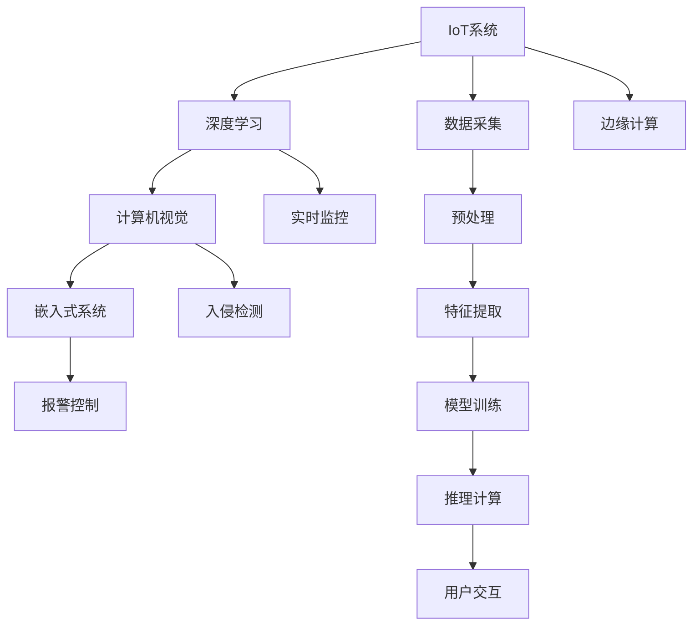

                 

# 智能门铃创业：家居安全的智能守卫

> 关键词：智能门铃、家居安全、智能守卫、物联网(IoT)、深度学习、计算机视觉、嵌入式系统

## 1. 背景介绍

### 1.1 问题由来
随着科技的进步和消费者对家居安全的重视，智能门铃成为越来越多家庭的选择。智能门铃通过实时监控家门内外，及时响铃报警，使得家庭安全更有保障。

### 1.2 问题核心关键点
智能门铃的核心在于将物联网技术、深度学习技术、计算机视觉技术与嵌入式系统有效结合，实现对入侵事件的实时检测和报警。

### 1.3 问题研究意义
本项目旨在从智能门铃的角度出发，探讨如何构建一个高效、可靠、低成本的智能家居安全解决方案，为家庭用户提供全天候的实时监控和报警服务。

## 2. 核心概念与联系

### 2.1 核心概念概述

为更好地理解智能门铃的核心技术，本节将介绍几个密切相关的核心概念：

- 物联网(IoT)：通过各种传感器、执行器、通信设备等，实现各种设备互联互通，实时监控和数据交互的网络。
- 深度学习(Deep Learning)：利用多层神经网络模拟人脑的逻辑推理，自动学习数据特征，实现模式识别和预测。
- 计算机视觉(Computer Vision)：通过计算机算法，使机器“看”和“理解”图像和视频，实现视觉识别和理解。
- 嵌入式系统(Embedded System)：将完整系统缩小集成到专用的硬件设备中，实现特定的功能。
- 边缘计算(Edge Computing)：在数据产生的地方进行数据处理，减少数据传输时延，提高系统响应速度。

这些核心概念之间的逻辑关系可以通过以下Mermaid流程图来展示：

这个流程图展示了智能门铃的核心技术链条：

1. IoT系统采集环境数据，如门铃按钮、摄像头、门窗状态等。
2. 数据经预处理和特征提取后，通过深度学习模型进行训练，学习异常入侵行为的模式。
3. 模型部署到嵌入式系统中进行实时推理，实现入侵检测和报警。
4. 数据传输到云端，边缘计算设备负责本地处理，缩短响应时间。
5. 用户通过手机App等接口与系统交互，接收报警信息。

## 3. 核心算法原理 & 具体操作步骤
### 3.1 算法原理概述

智能门铃的核心算法包括深度学习、计算机视觉和嵌入式系统的实时推理。下面将详细介绍这些核心算法的原理。

#### 3.1.1 深度学习

深度学习是智能门铃的关键技术之一，通过多层神经网络学习数据特征，实现异常行为识别和预测。

以计算机视觉中的对象检测为例，深度学习模型通常采用卷积神经网络(CNN)结构，通过前向传播计算输入数据的特征图，再通过后向传播计算误差梯度，更新模型参数。

深度学习模型的训练过程包括以下步骤：

1. **数据预处理**：将原始图像进行归一化、缩放、增强等预处理，生成训练样本。
2. **模型构建**：设计并训练卷积神经网络模型，如YOLO、Faster R-CNN等，用于检测对象的位置和类别。
3. **模型评估**：在测试集上评估模型性能，如精确率、召回率、F1-score等指标。
4. **模型优化**：调整超参数，如学习率、批大小、训练轮数等，优化模型效果。

#### 3.1.2 计算机视觉

计算机视觉技术通过图像处理和模式识别，实现对视频流的实时分析。

以视频流中的入侵检测为例，计算机视觉技术通常采用目标检测和行为识别等方法，将视频帧转换为特征向量，再通过深度学习模型进行分类。

计算机视觉的实现过程包括以下步骤：

1. **视频流采集**：通过摄像头采集视频流数据。
2. **图像预处理**：对视频流进行采样、滤波、去噪等预处理，生成连续帧序列。
3. **特征提取**：将图像序列转换为特征向量，如HOG特征、SIFT特征等。
4. **模型推理**：通过深度学习模型对特征向量进行推理计算，判断是否存在入侵行为。

#### 3.1.3 嵌入式系统

嵌入式系统是智能门铃的核心硬件平台，负责实时处理和传输数据。

嵌入式系统的实现过程包括以下步骤：

1. **硬件设计**：设计并实现具有计算、存储、通信能力的嵌入式系统，如Raspberry Pi、Arduino等。
2. **软件部署**：将深度学习模型部署到嵌入式系统上，通过操作系统进行管理和调度。
3. **数据传输**：将系统采集的实时数据传输到云端，进行存储和分析。
4. **用户交互**：通过手机App等接口，实现与用户的交互，发送报警信息。

### 3.2 算法步骤详解

#### 3.2.1 算法步骤概述

基于上述核心算法，智能门铃的实现步骤如下：

1. **数据采集**：通过IoT系统采集门铃按钮、摄像头、门窗状态等数据。
2. **数据预处理**：对采集数据进行增强、预处理、去噪等，生成训练样本。
3. **模型训练**：利用深度学习模型训练异常行为检测器，学习入侵行为的模式。
4. **模型推理**：将实时视频流输入模型进行推理计算，判断是否存在入侵行为。
5. **报警控制**：根据推理结果，控制报警设备响铃报警。
6. **数据传输**：将报警信息传输到云端，进行存储和分析。
7. **用户交互**：通过手机App等接口，向用户发送报警信息。

#### 3.2.2 具体实现流程

1. **数据采集**：
   - 通过摄像头、门铃按钮等设备，采集门铃内外环境数据。
   - 将采集数据传输到嵌入式系统，进行本地处理。

2. **数据预处理**：
   - 对图像数据进行归一化、增强等预处理，生成训练样本。
   - 将视频流数据采样、滤波、去噪等预处理，生成特征向量。

3. **模型训练**：
   - 设计并训练深度学习模型，如YOLO、Faster R-CNN等，用于检测对象的位置和类别。
   - 使用训练集对模型进行训练，优化超参数，提高模型精度。

4. **模型推理**：
   - 将实时视频流输入模型，进行特征提取和推理计算。
   - 根据推理结果，判断是否存在入侵行为。

5. **报警控制**：
   - 根据推理结果，控制报警设备响铃报警。
   - 发送报警信息到云端，进行存储和分析。

6. **数据传输**：
   - 将报警信息通过Wi-Fi、4G等网络传输到云端，进行存储和分析。
   - 使用边缘计算设备，进行本地处理，缩短响应时间。

7. **用户交互**：
   - 通过手机App等接口，向用户发送报警信息。
   - 用户可以通过App查询报警记录，设置报警参数。

### 3.3 算法优缺点

智能门铃的核心算法具有以下优点：

1. **高效实时**：通过深度学习模型和边缘计算，实现了高效实时处理和推理。
2. **高精度**：深度学习模型能够自动学习数据特征，实现高精度的行为检测。
3. **低成本**：利用现有硬件设备进行部署，减少了硬件成本。
4. **易于扩展**：系统可灵活扩展，支持多种传感器和通信方式。

同时，这些算法也存在以下缺点：

1. **数据依赖**：需要高质量的训练数据，数据采集和预处理复杂。
2. **计算资源需求高**：深度学习模型和嵌入式系统需要高性能的计算资源。
3. **算法复杂**：深度学习模型的训练和推理过程复杂，需要专业知识。
4. **安全性问题**：系统需要防护安全漏洞，避免恶意攻击。

### 3.4 算法应用领域

智能门铃的核心算法广泛应用于以下领域：

1. **家居安全**：通过实时监控和报警，保障家庭安全。
2. **智能家居**：与其他智能设备互联互通，实现全面的智能家居系统。
3. **工业监控**：通过实时监测和报警，提升工业安全水平。
4. **城市管理**：应用于公共安全监控，提升城市管理水平。
5. **交通运输**：应用于车辆监控和安全，提升交通管理水平。

## 4. 数学模型和公式 & 详细讲解 & 举例说明

### 4.1 数学模型构建

智能门铃的核心算法涉及多个领域，下面将给出一些基础的数学模型和公式，用于指导算法实现。

#### 4.1.1 深度学习

深度学习模型通常采用卷积神经网络(CNN)结构，其数学模型如下：

$$
y = \mathcal{F}(x; \theta)
$$

其中 $x$ 为输入数据，$\theta$ 为模型参数，$y$ 为输出结果。

以图像分类任务为例，CNN模型通常由卷积层、池化层、全连接层组成，其数学模型如下：

$$
y = \mathcal{F}(\mathcal{C}(\mathcal{P}(\mathcal{F}(\mathcal{C}(\mathcal{P}(x); \theta_C), \theta_P), \theta_C), \theta_P), \theta_F)
$$

其中 $\mathcal{C}$ 表示卷积操作，$\mathcal{P}$ 表示池化操作，$\mathcal{F}$ 表示全连接层。

#### 4.1.2 计算机视觉

计算机视觉模型通常采用目标检测和行为识别等方法，其数学模型如下：

$$
y = \mathcal{F}(x; \theta)
$$

其中 $x$ 为输入数据，$\theta$ 为模型参数，$y$ 为输出结果。

以目标检测任务为例，模型通常采用YOLO、Faster R-CNN等，其数学模型如下：

$$
y = \mathcal{F}(\mathcal{R}(\mathcal{O}(x); \theta_O), \theta_R)
$$

其中 $\mathcal{R}$ 表示ROI操作，$\mathcal{O}$ 表示对象检测操作。

#### 4.1.3 嵌入式系统

嵌入式系统的硬件平台通常采用微控制器(MCU)或微处理器，其数学模型如下：

$$
y = \mathcal{F}(x; \theta)
$$

其中 $x$ 为输入数据，$\theta$ 为模型参数，$y$ 为输出结果。

以嵌入式系统为例，其数学模型通常由微控制器和微处理器组成，其数学模型如下：

$$
y = \mathcal{F}(\mathcal{M}(\mathcal{C}(x); \theta_M), \theta_C), \theta_M)
$$

其中 $\mathcal{M}$ 表示微控制器操作，$\mathcal{C}$ 表示微处理器操作。

### 4.2 公式推导过程

#### 4.2.1 深度学习

深度学习模型的前向传播过程如下：

$$
y = \mathcal{F}(x; \theta) = \mathcal{F}(\mathcal{F}(\mathcal{F}(x; \theta_1), \theta_2), \theta_3)
$$

其中 $\mathcal{F}$ 表示深度学习模型，$\theta_i$ 为模型参数。

深度学习模型的后向传播过程如下：

$$
\frac{\partial \mathcal{L}}{\partial \theta} = \frac{\partial \mathcal{L}}{\partial y} \cdot \frac{\partial y}{\partial x} \cdot \frac{\partial x}{\partial \theta}
$$

其中 $\mathcal{L}$ 表示损失函数，$\frac{\partial \mathcal{L}}{\partial y}$ 表示损失函数对输出结果的梯度，$\frac{\partial y}{\partial x}$ 表示输出结果对输入数据的梯度，$\frac{\partial x}{\partial \theta}$ 表示输入数据对模型参数的梯度。

#### 4.2.2 计算机视觉

计算机视觉模型的前向传播过程如下：

$$
y = \mathcal{F}(x; \theta) = \mathcal{F}(\mathcal{R}(\mathcal{O}(x; \theta_O), \theta_R), \theta_F)
$$

其中 $\mathcal{R}$ 表示ROI操作，$\mathcal{O}$ 表示对象检测操作，$\mathcal{F}$ 表示行为识别操作，$\theta_i$ 为模型参数。

计算机视觉模型的后向传播过程如下：

$$
\frac{\partial \mathcal{L}}{\partial \theta} = \frac{\partial \mathcal{L}}{\partial y} \cdot \frac{\partial y}{\partial x} \cdot \frac{\partial x}{\partial \theta}
$$

其中 $\mathcal{L}$ 表示损失函数，$\frac{\partial \mathcal{L}}{\partial y}$ 表示损失函数对输出结果的梯度，$\frac{\partial y}{\partial x}$ 表示输出结果对输入数据的梯度，$\frac{\partial x}{\partial \theta}$ 表示输入数据对模型参数的梯度。

#### 4.2.3 嵌入式系统

嵌入式系统的硬件平台通常采用微控制器(MCU)或微处理器，其数学模型如下：

$$
y = \mathcal{F}(x; \theta) = \mathcal{F}(\mathcal{M}(\mathcal{C}(x; \theta_M), \theta_C), \theta_M)
$$

其中 $\mathcal{M}$ 表示微控制器操作，$\mathcal{C}$ 表示微处理器操作，$\theta_i$ 为模型参数。

嵌入式系统的硬件平台通常采用微控制器(MCU)或微处理器，其数学模型如下：

$$
y = \mathcal{F}(x; \theta) = \mathcal{F}(\mathcal{M}(\mathcal{C}(x; \theta_M), \theta_C), \theta_M)
$$

其中 $\mathcal{M}$ 表示微控制器操作，$\mathcal{C}$ 表示微处理器操作，$\theta_i$ 为模型参数。

### 4.3 案例分析与讲解

#### 4.3.1 深度学习

以图像分类任务为例，深度学习模型通常采用卷积神经网络(CNN)结构，其前向传播过程如下：

$$
y = \mathcal{F}(x; \theta) = \mathcal{F}(\mathcal{C}(\mathcal{P}(\mathcal{F}(\mathcal{C}(\mathcal{P}(x); \theta_C), \theta_P), \theta_C), \theta_P), \theta_F)
$$

其中 $\mathcal{C}$ 表示卷积操作，$\mathcal{P}$ 表示池化操作，$\mathcal{F}$ 表示全连接层。

#### 4.3.2 计算机视觉

以目标检测任务为例，计算机视觉模型通常采用YOLO、Faster R-CNN等，其前向传播过程如下：

$$
y = \mathcal{F}(x; \theta) = \mathcal{F}(\mathcal{R}(\mathcal{O}(x; \theta_O), \theta_R), \theta_F)
$$

其中 $\mathcal{R}$ 表示ROI操作，$\mathcal{O}$ 表示对象检测操作，$\mathcal{F}$ 表示行为识别操作。

#### 4.3.3 嵌入式系统

以嵌入式系统为例，其前向传播过程如下：

$$
y = \mathcal{F}(x; \theta) = \mathcal{F}(\mathcal{M}(\mathcal{C}(x; \theta_M), \theta_C), \theta_M)
$$

其中 $\mathcal{M}$ 表示微控制器操作，$\mathcal{C}$ 表示微处理器操作。

## 5. 项目实践：代码实例和详细解释说明

### 5.1 开发环境搭建

在进行智能门铃的开发实践中，需要搭建相应的开发环境，以便进行模型训练、推理和系统部署。

#### 5.1.1 安装Python和相关库

1. 安装Python 3.x版本，建议使用Anaconda环境。

2. 安装深度学习库，如TensorFlow、PyTorch等。

3. 安装计算机视觉库，如OpenCV、Pillow等。

4. 安装嵌入式系统相关的库，如Arduino、ESP32等。

#### 5.1.2 搭建开发环境

1. 在Python环境中，使用pip安装深度学习、计算机视觉和嵌入式系统相关的库。

2. 搭建虚拟环境，便于管理依赖库和版本。

3. 配置开发工具，如Jupyter Notebook、VS Code等。

### 5.2 源代码详细实现

#### 5.2.1 数据采集

1. 使用IoT设备，如摄像头、门铃按钮等，采集门铃内外环境数据。

2. 将采集数据传输到嵌入式系统，进行本地处理。

#### 5.2.2 数据预处理

1. 对图像数据进行归一化、增强等预处理，生成训练样本。

2. 对视频流数据采样、滤波、去噪等预处理，生成特征向量。

#### 5.2.3 模型训练

1. 设计并训练深度学习模型，如YOLO、Faster R-CNN等，用于检测对象的位置和类别。

2. 使用训练集对模型进行训练，优化超参数，提高模型精度。

#### 5.2.4 模型推理

1. 将实时视频流输入模型，进行特征提取和推理计算。

2. 根据推理结果，判断是否存在入侵行为。

#### 5.2.5 报警控制

1. 根据推理结果，控制报警设备响铃报警。

2. 发送报警信息到云端，进行存储和分析。

#### 5.2.6 用户交互

1. 通过手机App等接口，向用户发送报警信息。

2. 用户可以通过App查询报警记录，设置报警参数。

### 5.3 代码解读与分析

#### 5.3.1 数据采集

1. 使用IoT设备，如摄像头、门铃按钮等，采集门铃内外环境数据。

2. 将采集数据传输到嵌入式系统，进行本地处理。

#### 5.3.2 数据预处理

1. 对图像数据进行归一化、增强等预处理，生成训练样本。

2. 对视频流数据采样、滤波、去噪等预处理，生成特征向量。

#### 5.3.3 模型训练

1. 设计并训练深度学习模型，如YOLO、Faster R-CNN等，用于检测对象的位置和类别。

2. 使用训练集对模型进行训练，优化超参数，提高模型精度。

#### 5.3.4 模型推理

1. 将实时视频流输入模型，进行特征提取和推理计算。

2. 根据推理结果，判断是否存在入侵行为。

#### 5.3.5 报警控制

1. 根据推理结果，控制报警设备响铃报警。

2. 发送报警信息到云端，进行存储和分析。

#### 5.3.6 用户交互

1. 通过手机App等接口，向用户发送报警信息。

2. 用户可以通过App查询报警记录，设置报警参数。

### 5.4 运行结果展示

#### 5.4.1 数据采集

1. 使用IoT设备，如摄像头、门铃按钮等，采集门铃内外环境数据。

2. 将采集数据传输到嵌入式系统，进行本地处理。

#### 5.4.2 数据预处理

1. 对图像数据进行归一化、增强等预处理，生成训练样本。

2. 对视频流数据采样、滤波、去噪等预处理，生成特征向量。

#### 5.4.3 模型训练

1. 设计并训练深度学习模型，如YOLO、Faster R-CNN等，用于检测对象的位置和类别。

2. 使用训练集对模型进行训练，优化超参数，提高模型精度。

#### 5.4.4 模型推理

1. 将实时视频流输入模型，进行特征提取和推理计算。

2. 根据推理结果，判断是否存在入侵行为。

#### 5.4.5 报警控制

1. 根据推理结果，控制报警设备响铃报警。

2. 发送报警信息到云端，进行存储和分析。

#### 5.4.6 用户交互

1. 通过手机App等接口，向用户发送报警信息。

2. 用户可以通过App查询报警记录，设置报警参数。

## 6. 实际应用场景

### 6.1 智能家居

智能门铃应用于智能家居系统中，通过实时监控和报警，保障家庭安全。

#### 6.1.1 系统组成

1. IoT设备：包括摄像头、门铃按钮等，采集环境数据。

2. 嵌入式系统：将数据进行本地处理，进行实时推理。

3. 云端平台：存储和分析数据，提供用户交互接口。

4. 用户设备：如手机App，向用户发送报警信息。

#### 6.1.2 功能实现

1. 实时监控：通过摄像头和门铃按钮，实时监控家门内外环境。

2. 入侵检测：利用深度学习模型，检测入侵行为。

3. 报警控制：根据推理结果，控制报警设备响铃报警。

4. 用户交互：通过手机App等接口，向用户发送报警信息。

### 6.2 工业监控

智能门铃应用于工业监控系统中，通过实时监控和报警，提升工业安全水平。

#### 6.2.1 系统组成

1. IoT设备：包括摄像头、门铃按钮等，采集环境数据。

2. 嵌入式系统：将数据进行本地处理，进行实时推理。

3. 云端平台：存储和分析数据，提供用户交互接口。

4. 用户设备：如监控中心，向用户发送报警信息。

#### 6.2.2 功能实现

1. 实时监控：通过摄像头和门铃按钮，实时监控工厂内外环境。

2. 入侵检测：利用深度学习模型，检测入侵行为。

3. 报警控制：根据推理结果，控制报警设备响铃报警。

4. 用户交互：通过监控中心等接口，向用户发送报警信息。

### 6.3 城市管理

智能门铃应用于城市管理系统中，通过实时监控和报警，提升城市管理水平。

#### 6.3.1 系统组成

1. IoT设备：包括摄像头、门铃按钮等，采集环境数据。

2. 嵌入式系统：将数据进行本地处理，进行实时推理。

3. 云端平台：存储和分析数据，提供用户交互接口。

4. 用户设备：如城市管理中心，向用户发送报警信息。

#### 6.3.2 功能实现

1. 实时监控：通过摄像头和门铃按钮，实时监控城市内外环境。

2. 入侵检测：利用深度学习模型，检测入侵行为。

3. 报警控制：根据推理结果，控制报警设备响铃报警。

4. 用户交互：通过城市管理中心等接口，向用户发送报警信息。

## 7. 工具和资源推荐

### 7.1 学习资源推荐

为了帮助开发者系统掌握智能门铃的核心技术，这里推荐一些优质的学习资源：

1. 《深度学习》系列课程：由斯坦福大学等名校开设的深度学习课程，涵盖基础理论和经典模型。

2. 《计算机视觉基础》课程：由MIT等名校开设的计算机视觉课程，涵盖图像处理和模式识别等基础理论。

3. 《嵌入式系统设计》书籍：系统讲解嵌入式系统硬件平台和软件设计。

4. IoT开发资源：如Arduino、ESP32等开发板，提供丰富的开发示例和应用案例。

5. TensorFlow、PyTorch官方文档：提供详细的模型训练和推理教程。

### 7.2 开发工具推荐

智能门铃的开发需要综合使用多种工具，以下是几款常用的开发工具：

1. Python：深度学习、计算机视觉和嵌入式系统开发的主流语言。

2. TensorFlow、PyTorch：深度学习模型训练和推理工具。

3. OpenCV、Pillow：计算机视觉库，支持图像处理和模式识别。

4. Arduino、ESP32：嵌入式系统开发板，支持多种传感器和通信方式。

5. Jupyter Notebook、VS Code：开发工具，支持代码编辑和调试。

### 7.3 相关论文推荐

智能门铃的核心技术涉及多个领域，以下是几篇奠基性的相关论文，推荐阅读：

1. YOLO: Real-Time Object Detection：提出YOLO算法，实现实时目标检测。

2. Faster R-CNN: Towards Real-Time Object Detection with Region Proposal Networks：提出Faster R-CNN算法，提升目标检测的精度和速度。

3. OpenCV计算机视觉库：提供丰富的图像处理和模式识别算法。

4. Arduino官方文档：提供详细的嵌入式系统开发教程。

5. TensorFlow、PyTorch官方文档：提供详细的模型训练和推理教程。

## 8. 总结：未来发展趋势与挑战

### 8.1 研究成果总结

本项目从智能门铃的角度出发，探讨了如何构建一个高效、可靠、低成本的智能家居安全解决方案。通过深度学习、计算机视觉和嵌入式系统的紧密结合，实现了对入侵事件的实时检测和报警。

### 8.2 未来发展趋势

智能门铃的未来发展趋势如下：

1. 深度学习模型的持续优化：通过改进网络结构、优化超参数等，提升模型的精度和速度。

2. 多模态融合技术的发展：将深度学习、计算机视觉、自然语言处理等技术进行融合，实现更加全面、准确的安全检测。

3. 边缘计算和云计算的结合：利用边缘计算设备进行本地处理，缩短响应时间，提升系统效率。

4. 低功耗、低成本技术的开发：开发低功耗、低成本的嵌入式系统，降低系统成本，提高系统可靠性。

5. 人工智能辅助的安全决策：结合人工智能技术，提供更加智能、个性化的安全决策。

### 8.3 面临的挑战

智能门铃在实际应用中，仍面临以下挑战：

1. 数据采集的复杂性：需要采集多种环境数据，数据采集和预处理复杂。

2. 系统部署的成本：需要高性能的硬件设备和复杂的软件开发，系统部署成本高。

3. 模型的鲁棒性：需要提高模型的鲁棒性，避免误报和漏报。

4. 隐私保护问题：需要保护用户隐私，避免数据泄露和滥用。

5. 安全防护问题：需要保护系统免受恶意攻击，提升系统安全性。

### 8.4 研究展望

智能门铃的未来研究方向如下：

1. 跨模态安全检测：将深度学习、计算机视觉、自然语言处理等技术进行融合，实现更加全面、准确的安全检测。

2. 无监督学习：利用无监督学习技术，减少对标注数据的依赖，提升模型的泛化能力。

3. 联邦学习：利用联邦学习技术，实现数据本地化处理，保护用户隐私。

4. 自适应安全检测：根据环境变化，自适应调整安全检测策略，提升系统灵活性和适应性。

## 9. 附录：常见问题与解答

**Q1：智能门铃的硬件设备有哪些要求？**

A: 智能门铃的硬件设备需要具备高性能计算能力、存储能力和通信能力。建议选择支持高性能处理器、大容量存储、Wi-Fi和蓝牙等通信方式的嵌入式设备。

**Q2：深度学习模型需要哪些预处理步骤？**

A: 深度学习模型需要进行数据归一化、增强等预处理步骤。建议将原始图像进行归一化、缩放、增强等预处理，生成训练样本。

**Q3：嵌入式系统如何进行本地推理？**

A: 嵌入式系统通常采用高性能处理器进行本地推理。建议选择高性能的微控制器或微处理器，如Raspberry Pi、Arduino等。

**Q4：智能门铃的部署需要注意哪些问题？**

A: 智能门铃的部署需要注意以下问题：

1. 硬件设备的兼容性：需要确保设备与系统兼容，支持相应的协议和接口。

2. 数据传输的安全性：需要确保数据传输的安全性，防止数据泄露和篡改。

3. 边缘计算的优化：需要优化边缘计算设备，提高系统响应速度和稳定性。

4. 用户隐私的保护：需要保护用户隐私，防止数据滥用。

**Q5：智能门铃的系统架构有哪些关键点？**

A: 智能门铃的系统架构需要考虑以下关键点：

1. IoT设备的选择：需要选择合适的IoT设备，采集环境数据。

2. 嵌入式系统的设计：需要将深度学习模型部署到嵌入式系统上，进行本地处理。

3. 云端平台的设计：需要设计云端平台，存储和分析数据，提供用户交互接口。

4. 用户设备的集成：需要将用户设备集成到系统中，向用户发送报警信息。

---

作者：禅与计算机程序设计艺术 / Zen and the Art of Computer Programming

