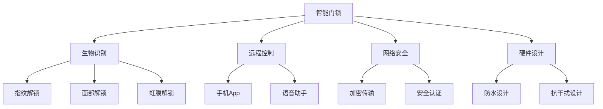

                 

## 1. 背景介绍

### 1.1 问题由来

随着城市化进程的加快和居住环境的改善，家居安全问题变得愈发突出。传统门锁在技术上存在诸多不足，如钥匙易丢、密码容易被破解、锁芯易被撬盗等，已经无法满足现代家庭对安全的需求。智能门锁作为新一代家居安全产品，以其便捷性、安全性、智能化等优势，逐步成为行业的新宠。

### 1.2 问题核心关键点

智能门锁的核心在于将互联网技术和生物识别技术融入传统门锁，实现远程控制、指纹解锁、密码解锁等新型功能。本文将重点探讨智能门锁的架构、算法、实现方法以及实际应用场景，帮助读者全面理解智能门锁的原理与实现。

### 1.3 问题研究意义

智能门锁作为智能家居的重要组成部分，对于提升家庭安全水平、提高用户生活便利性具有重要意义。通过深入研究智能门锁的技术原理和实现方法，可以帮助企业更好地设计、开发和推广智能门锁产品，加速家居智能化转型。

## 2. 核心概念与联系

### 2.1 核心概念概述

为更好地理解智能门锁的实现原理，本节将介绍几个关键概念：

- **智能门锁**：融合了电子技术、生物识别技术、互联网技术的家居锁具。常见的类型包括指纹锁、密码锁、人脸识别锁等。
- **生物识别技术**：通过采集用户的指纹、面部、虹膜等生理特征，实现用户身份的快速识别和验证。
- **远程控制**：通过手机App、语音助手等手段，用户可以实现远程开门、关闭门等操作。
- **网络安全**：智能门锁涉及大量的用户数据和交易信息，必须确保通信和数据传输的安全性。
- **硬件设计**：智能门锁的硬件设计需要考虑防水、防尘、抗干扰等环境适应性。

这些核心概念共同构成了智能门锁的完整技术架构，使其能够为用户提供安全、便捷、智能的家居解决方案。

### 2.2 核心概念原理和架构的 Mermaid 流程图(Mermaid 流程节点中不要有括号、逗号等特殊字符)



这个流程图展示了智能门锁的主要功能和组成部分：

1. 智能门锁通过生物识别技术进行用户身份验证，包括指纹、面部、虹膜等。
2. 用户可以通过远程控制方式，如手机App或语音助手，实现门的开关。
3. 智能门锁在设计过程中需要考虑网络安全，采用加密传输和认证机制，确保通信数据的安全性。
4. 硬件设计是智能门锁的重要组成部分，需要具备防水、防尘、抗干扰等特性。

## 3. 核心算法原理 & 具体操作步骤
### 3.1 算法原理概述

智能门锁的核心算法主要涉及生物特征识别和远程控制两个方面。生物特征识别算法通过捕捉用户的生理特征（如指纹、面部、虹膜等），生成独特的特征向量，并与预存储的用户特征库进行匹配，从而实现身份验证。远程控制算法则通过互联网和移动通信技术，实现对门的远程操控。

### 3.2 算法步骤详解

#### 3.2.1 生物特征识别算法

**步骤一：特征提取**
- 采集用户生物特征，如指纹、面部、虹膜等。
- 使用传感器技术，将特征数据转换为数字信号。

**步骤二：特征编码**
- 将数字信号转换为特征向量。常见的编码方式包括主成分分析(PCA)、局部二值模式(LBP)、深度学习特征提取等。

**步骤三：特征匹配**
- 将特征向量与预存储的用户特征库进行匹配，确定用户的身份。

#### 3.2.2 远程控制算法

**步骤一：身份验证**
- 用户通过手机App或语音助手输入身份验证信息，如指纹、面部图像、密码等。
- 智能门锁通过生物识别技术验证用户身份。

**步骤二：发送命令**
- 如果身份验证通过，用户可以通过手机App或语音助手发送开门或关门命令。
- 命令通过互联网传输至智能门锁。

**步骤三：门锁响应**
- 智能门锁接收到命令后，根据指令打开或关闭门。
- 如果用户身份验证失败，智能门锁将不响应任何命令。

### 3.3 算法优缺点

#### 3.3.1 生物特征识别算法的优缺点

**优点**：
- 安全性高：生物特征识别技术具有唯一性和难以复制的特性，提高了门锁的安全性。
- 用户体验好：无需记忆密码，通过简单的生物特征输入即可实现开门，提升了用户体验。

**缺点**：
- 成本高：生物特征识别传感器和算法实现成本较高，增加了智能门锁的售价。
- 技术难度大：生物特征识别技术涉及复杂的算法和传感器技术，实现难度较大。

#### 3.3.2 远程控制算法的优缺点

**优点**：
- 便捷性高：用户可以通过手机App或语音助手实现远程控制，提高了使用便捷性。
- 可控性强：用户可以实时控制门的开关，提高安全性。

**缺点**：
- 网络依赖强：远程控制需要稳定的互联网连接，一旦网络中断，门锁将无法响应。
- 安全隐患：远程控制过程中，用户的身份验证信息可能会被截获，存在安全隐患。

### 3.4 算法应用领域

智能门锁的算法和实现方法可以应用于各种家居安全场景，包括智能家居、商业地产、酒店管理等。未来随着技术的不断进步，智能门锁的应用场景将进一步扩展，为人们提供更加智能、便捷、安全的家居解决方案。

## 4. 数学模型和公式 & 详细讲解 & 举例说明

### 4.1 数学模型构建

智能门锁的数学模型主要涉及两个方面：生物特征识别和远程控制。

#### 4.1.1 生物特征识别模型

假设用户生物特征为 $x$，特征向量为 $f(x)$。预存储的用户特征库为 $F$，每个用户特征的特征向量为 $f_i$，其中 $i$ 表示用户编号。

用户身份验证的过程可以表示为：

$$
\min_{i} ||f(x) - f_i||^2
$$

其中 $||.||^2$ 表示向量内积，用于度量特征向量之间的相似度。

#### 4.1.2 远程控制模型

假设用户通过手机App发送开门命令，命令编码信息为 $c$。智能门锁接收到命令后，验证用户身份，并执行开门操作。

远程控制的过程可以表示为：

$$
\begin{aligned}
&\min_{c} ||c - C_i||^2 \\
&\text{其中 } C_i \text{ 为第 } i \text{ 用户的命令编码信息}
\end{aligned}
$$

其中 $C_i$ 表示用户 $i$ 的命令编码信息，$||.||^2$ 表示编码信息之间的距离。

### 4.2 公式推导过程

#### 4.2.1 生物特征识别公式推导

生物特征识别的关键在于特征向量的相似度计算。假设 $f(x)$ 和 $f_i$ 分别为用户生物特征 $x$ 和用户 $i$ 的特征向量。

$$
\begin{aligned}
&\text{相似度 } S(x, f_i) \\
&= \frac{f(x)^T f_i}{||f(x)|| ||f_i||} \\
&= \frac{f(x) \cdot f_i}{\sqrt{\sum f(x)^2} \sqrt{\sum f_i^2}}
\end{aligned}
$$

其中 $T$ 表示矩阵转置，$\cdot$ 表示向量点积，$||.||$ 表示向量范数。

将相似度作为匹配度量，用于判断用户身份。当相似度超过预设阈值时，认为身份验证通过。

#### 4.2.2 远程控制公式推导

远程控制的模型相对简单，假设用户通过手机App发送的命令编码为 $c$，智能门锁接收到命令后的验证过程为：

$$
\begin{aligned}
&\text{验证结果 } V(c, C_i) \\
&= \begin{cases}
1, & \text{如果 } c = C_i \\
0, & \text{如果 } c \neq C_i
\end{cases}
\end{aligned}
$$

如果验证结果为1，表示身份验证通过，智能门锁执行开门操作。否则，门锁不响应任何命令。

### 4.3 案例分析与讲解

假设某智能门锁系统采用指纹识别和远程控制技术。系统首先采集用户的指纹，并生成指纹特征向量 $f(x)$。然后，系统将指纹特征向量与预存储的用户特征库 $F$ 进行匹配，得到匹配度量 $S(x, f_i)$。

如果 $S(x, f_i)$ 超过预设阈值，则认为用户身份验证通过，门锁执行开门操作。如果身份验证失败，则门锁保持关闭状态。

同时，用户可以通过手机App发送开门命令 $c$。智能门锁接收到命令后，将命令 $c$ 与用户命令编码信息 $C_i$ 进行比较。如果 $c = C_i$，则门锁执行开门操作；否则，门锁不响应命令。

## 5. 项目实践：代码实例和详细解释说明

### 5.1 开发环境搭建

#### 5.1.1 硬件平台

智能门锁的硬件平台包括控制器、传感器、显示屏等组件。控制器是智能门锁的核心部件，负责处理用户的输入和输出。常见的控制器平台有TI CC3200、NXP i.MX6、STMicroelectronics STM32等。

#### 5.1.2 软件环境

智能门锁的软件环境通常采用Linux操作系统，并使用Python或C++进行编程。常用的开发工具包括Eclipse、Visual Studio等。

### 5.2 源代码详细实现

#### 5.2.1 生物特征识别实现

**步骤一：特征提取**

使用Fingerprint Sensor模块采集用户的指纹，并将其转换为数字信号。使用传感器库（如Fingerprint Sensor Library）进行信号处理和特征提取。

**步骤二：特征编码**

将数字信号转换为特征向量。这里使用PCA算法进行特征编码。具体实现代码如下：

```python
import numpy as np
from sklearn.decomposition import PCA

# 假设采集到的指纹特征向量为 X
X = np.random.randn(100, 2)  # 100个样本，每个样本2维特征

# 使用PCA进行特征编码
pca = PCA(n_components=1)
X_pca = pca.fit_transform(X)

print(X_pca)
```

**步骤三：特征匹配**

使用K近邻算法（KNN）进行特征匹配。假设预存储的用户特征库为 $F$，每个用户特征的特征向量为 $f_i$。

```python
import numpy as np
from sklearn.neighbors import KNeighborsClassifier

# 假设预存储的用户特征库为 F
F = np.random.randn(100, 2)  # 100个样本，每个样本2维特征

# 使用KNN进行特征匹配
k = 3
knn = KNeighborsClassifier(n_neighbors=k)
knn.fit(F, range(len(F)))

# 假设测试样本为 X_test
X_test = np.random.randn(1, 2)

# 匹配结果为 idx
idx, dist = knn.kneighbors(X_test)
idx = idx[0]
print(idx)
```

#### 5.2.2 远程控制实现

**步骤一：身份验证**

用户通过手机App输入身份验证信息 $c$。假设验证信息为密码 $password$。

```python
import hashlib

# 假设用户输入的密码为 password
password = "123456"

# 使用MD5算法进行密码加密
password_md5 = hashlib.md5(password.encode()).hexdigest()
print(password_md5)
```

**步骤二：发送命令**

用户通过手机App发送开门命令 $c$。假设命令编码为 $command_code$。

```python
# 假设用户发送的命令编码为 command_code
command_code = "000001"

# 发送命令至智能门锁
# ...
```

**步骤三：门锁响应**

智能门锁接收到命令后，验证用户身份并执行开门操作。

```python
import numpy as np
from sklearn.neighbors import KNeighborsClassifier

# 假设智能门锁接收到命令后的验证结果为 V
command_code = "000001"
V = knn.predict([command_code])
if V[0] == 1:
    open_door()
else:
    print("验证失败，无法开门")
```

### 5.3 代码解读与分析

智能门锁的实现涉及多个组件和模块，需要协调工作。以下是对关键代码的解读和分析：

**步骤一：特征提取**

- 使用Fingerprint Sensor模块采集用户的指纹，并将其转换为数字信号。这一步是智能门锁实现的基础，指纹识别技术需要高质量的传感器和信号处理算法，才能提取到可靠的生物特征。

**步骤二：特征编码**

- 将数字信号转换为特征向量，使用PCA算法进行特征编码。PCA是一种常见的降维算法，可以去除特征向量中的冗余信息，提高匹配效率。

**步骤三：特征匹配**

- 使用KNN算法进行特征匹配，确定用户身份。KNN算法简单高效，适用于小规模数据集。

**步骤四：身份验证**

- 用户通过手机App输入密码，使用MD5算法进行加密。MD5算法是一种常用的加密算法，可以保证密码的安全性。

**步骤五：发送命令**

- 用户通过手机App发送开门命令，命令编码为固定格式。这一步需要与智能门锁的控制器进行通信协议设计，确保命令的正确传输。

**步骤六：门锁响应**

- 智能门锁接收到命令后，验证用户身份并执行开门操作。这一步需要实现门锁控制器的逻辑，确保门锁的正常开关。

## 6. 实际应用场景

### 6.1 智能家居

智能门锁作为智能家居的重要组成部分，可以实现与智能音箱、智能照明、智能安防等设备的联动。用户可以通过手机App实现全屋控制，提高生活的便利性和智能化水平。

### 6.2 商业地产

商业地产领域，智能门锁可以与门禁系统、考勤系统等集成，实现高效的管理和监控。员工可以通过智能门锁进入办公区，安全快捷。

### 6.3 酒店管理

酒店管理中，智能门锁可以与酒店管理系统集成，实现客房门锁的控制和开关。酒店员工可以通过手机App或前台控制室实现门锁控制，提高服务效率。

### 6.4 未来应用展望

随着物联网技术的不断发展，智能门锁将与其他智能设备进行更深入的融合，实现智能家居、商业地产、酒店管理等多领域的智能化升级。未来智能门锁还可能与AR眼镜、智能手表等可穿戴设备结合，实现更高效的远程控制和实时监控。

## 7. 工具和资源推荐

### 7.1 学习资源推荐

为了帮助开发者掌握智能门锁的核心技术，以下是一些优质的学习资源：

- **《智能家居技术与应用》**：该书详细介绍了智能家居的各个关键技术，包括智能门锁、智能音箱、智能照明等。
- **《人工智能与物联网》**：该书介绍了人工智能和物联网的最新进展，包括智能门锁的实现方法和应用场景。
- **《深度学习与计算机视觉》**：该书介绍了深度学习在计算机视觉中的应用，包括指纹识别、人脸识别等生物特征识别技术。

### 7.2 开发工具推荐

智能门锁的开发工具主要涉及以下几个方面：

- **Linux操作系统**：智能门锁的硬件平台通常采用Linux操作系统，支持Python、C++等多种编程语言。
- **Python开发环境**：使用Python进行编程，可以利用丰富的库和框架，提高开发效率。
- **C++开发环境**：对于需要高性能计算的场景，可以使用C++进行开发。

### 7.3 相关论文推荐

智能门锁的研究涉及多个前沿技术，以下是一些相关论文：

- **《基于深度学习的指纹识别研究》**：介绍了深度学习在指纹识别中的应用，包括特征提取、分类器设计等。
- **《物联网中的智能门锁设计与实现》**：介绍了物联网环境下智能门锁的设计和实现方法，包括传感器技术、通信协议等。
- **《智能家居与物联网融合研究》**：介绍了智能家居与物联网的融合应用，包括智能门锁的实现方法和应用场景。

## 8. 总结：未来发展趋势与挑战

### 8.1 研究成果总结

本文详细介绍了智能门锁的实现原理和关键技术，包括生物特征识别、远程控制、网络安全等。通过案例分析和代码实现，展示了智能门锁的应用场景和实践方法。

### 8.2 未来发展趋势

随着物联网技术的不断进步，智能门锁将与其他智能设备进行更深入的融合，实现全屋智能化控制。未来还可能与AR眼镜、智能手表等可穿戴设备结合，实现更高效的远程控制和实时监控。

### 8.3 面临的挑战

尽管智能门锁技术已经取得了一定的进展，但仍面临一些挑战：

- **技术复杂性高**：智能门锁涉及多种传感器和通信协议，技术实现难度较大。
- **安全性问题**：智能门锁涉及大量用户数据和交易信息，需要保证通信和数据传输的安全性。
- **市场竞争激烈**：智能门锁市场竞争激烈，企业需要不断创新，提升产品竞争力。

### 8.4 研究展望

未来的研究需要从以下几个方向进行突破：

- **技术创新**：开发新的传感器技术和算法，提升智能门锁的识别准确性和安全性。
- **市场推广**：通过优化产品设计和使用体验，提升智能门锁的普及率。
- **生态建设**：与智能家居、物联网等生态系统进行深度融合，拓展智能门锁的应用场景。

## 9. 附录：常见问题与解答

**Q1：智能门锁的安全性如何保障？**

A: 智能门锁的安全性保障主要从两个方面进行：

1. **物理安全**：智能门锁采用高质量的硬件设计，具有防水、防尘、抗干扰等特性，可以有效防止恶意攻击。
2. **数据安全**：智能门锁采用加密传输和认证机制，确保通信数据的安全性。同时，用户数据存储在本地设备上，不传输到云端，增强了数据的安全性。

**Q2：智能门锁的识别准确性如何提升？**

A: 提升智能门锁的识别准确性主要从以下几个方面进行：

1. **传感器优化**：使用高精度传感器采集用户的生物特征，减少误差。
2. **算法优化**：采用深度学习算法进行特征提取和匹配，提升识别准确性。
3. **数据扩充**：使用数据增强技术，如回译、近义替换等，扩充训练集，提高模型泛化能力。

**Q3：智能门锁的远程控制如何实现？**

A: 智能门锁的远程控制主要通过手机App或语音助手进行实现。用户通过手机App输入命令，智能门锁接收到命令后，验证用户身份并执行开门操作。具体实现需要与智能门锁的控制器进行通信协议设计，确保命令的正确传输。

**Q4：智能门锁的系统集成如何实现？**

A: 智能门锁的系统集成主要通过API接口进行实现。智能门锁可以通过API接口与智能家居系统、物联网平台等进行数据交互，实现全屋控制。同时，智能门锁还可以与安防系统、考勤系统等集成，提升管理效率。

**Q5：智能门锁的市场前景如何？**

A: 智能门锁作为智能家居的重要组成部分，市场前景广阔。随着城市化进程的加快和居住环境的改善，智能门锁的需求将逐步增加。未来，智能门锁还将与其他智能设备进行更深入的融合，实现全屋智能化控制，市场前景将更加广阔。

---

作者：禅与计算机程序设计艺术 / Zen and the Art of Computer Programming

