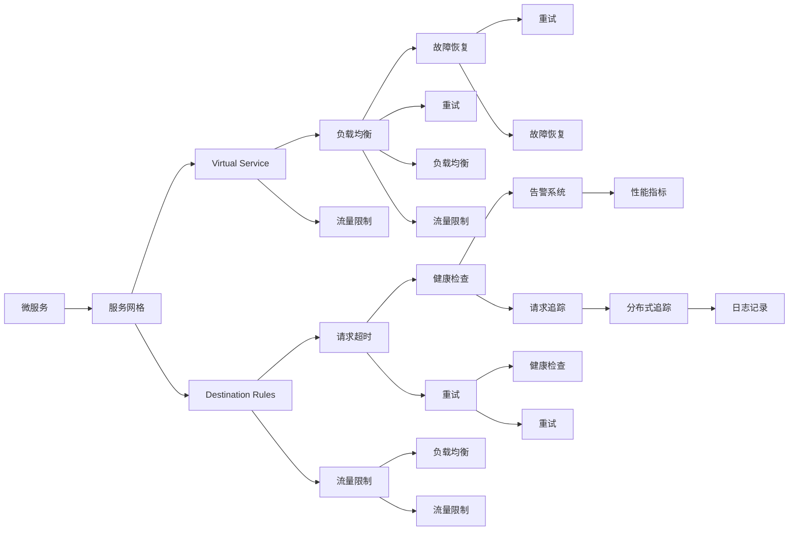

                 

# 服务网格：Istio在微服务中的应用

> 关键词：服务网格,微服务,分布式系统,网络路由,流量控制,安全,服务发现,监控

## 1. 背景介绍

### 1.1 问题由来
在现代分布式系统中，微服务架构已经成为一种主流的设计理念。微服务将应用程序拆分为多个独立的服务单元，每个服务负责完成特定的业务功能。通过这种设计，可以极大地提高系统的可扩展性、可维护性和开发效率。然而，微服务的数量往往庞大，服务之间的交互复杂，服务发现、负载均衡、网络路由、安全防护、监控告警等都是系统需要关注的重要问题。为了解决这些问题，服务网格（Service Mesh）的概念应运而生。

服务网格是一种网络层中间件，用于管理微服务间的通信。通过在微服务中集成服务网格，可以大大简化微服务间的交互，提升系统的可伸缩性和可靠性。Istio是当前最流行的服务网格解决方案之一，它能够为微服务提供全面的网络管理和安全保障，并支持流量的自动化管理。

### 1.2 问题核心关键点
Istio的微服务管理方案基于两个核心组件：Virtual Service（虚拟服务）和Destination Rules（路由规则）。Virtual Service定义了如何路由流量到不同微服务实例，而Destination Rules则定义了微服务实例之间的流量转发策略。此外，Istio还支持自动化的流量管理、故障恢复、负载均衡等功能，大大简化了微服务架构的开发和运维。

Istio的成功在于它不仅提供了丰富的功能，而且易于集成和使用，成为当前微服务生态系统中最受欢迎的技术之一。然而，Istio的应用不仅仅局限于微服务架构，其思想和方法也适用于其他分布式系统的设计和治理。

### 1.3 问题研究意义
Istio的微服务管理方案为现代分布式系统提供了一种统一而强大的解决方案。通过Istio，开发者可以更高效地构建和运维微服务系统，同时提升系统的可靠性和可伸缩性。Istio的应用范围不仅限于微服务，其思想和方法对于任何分布式系统的设计和治理都有重要的借鉴意义。

## 2. 核心概念与联系

### 2.1 核心概念概述

为了更好地理解Istio的微服务管理方案，我们先介绍一些关键概念：

- **微服务（Microservices）**：将应用程序拆分为独立的服务单元，每个服务负责特定的业务功能。微服务架构极大地提高了系统的可扩展性、可维护性和开发效率。

- **服务网格（Service Mesh）**：一种网络层中间件，用于管理微服务间的通信。服务网格将微服务之间的通信与业务逻辑分离，使得服务之间的通信变得简单易用。

- **Virtual Service（虚拟服务）**：定义了如何路由流量到不同的微服务实例。Virtual Service可以基于URL、请求头、请求路径等进行匹配，并且可以定义服务实例的负载均衡策略。

- **Destination Rules（路由规则）**：定义了微服务实例之间的流量转发策略。Destination Rules可以定义请求的负载均衡、请求的超时时间、流量限制等策略。

- **流量管理（Traffic Management）**：Istio的流量管理功能包括负载均衡、流量限制、熔断、重试等。通过流量管理，Istio可以优化微服务的性能，避免系统崩溃。

- **故障恢复（Fault Tolerance）**：Istio的故障恢复机制包括健康检查、环路避免、重试、熔断等。通过故障恢复机制，Istio可以提高系统的健壮性，避免服务故障导致系统宕机。

- **监控和日志（Observability）**：Istio提供了丰富的监控和日志功能，包括请求追踪、性能指标、告警系统等。通过监控和日志，Istio可以帮助开发者快速定位问题，优化系统性能。

### 2.2 核心概念原理和架构的 Mermaid 流程图(Mermaid 流程节点中不要有括号、逗号等特殊字符)



这个流程图展示了Istio的核心组件和服务网格的基本功能。微服务通过服务网格进行通信，Virtual Service和Destination Rules分别定义了流量路由和服务实例的转发策略，而负载均衡、流量限制、健康检查、重试等机制确保了系统的健壮性和可靠性。监控和日志功能则帮助开发者快速定位问题，优化系统性能。

## 3. 核心算法原理 & 具体操作步骤
### 3.1 算法原理概述

Istio的微服务管理方案基于两个核心组件：Virtual Service和Destination Rules。Virtual Service定义了如何路由流量到不同的微服务实例，而Destination Rules则定义了微服务实例之间的流量转发策略。Istio通过这两个组件实现微服务之间的通信管理，提供了负载均衡、流量限制、故障恢复、监控和日志等丰富的功能。

Virtual Service的工作原理是通过Kubernetes的Service和Ingress资源进行配置。当请求到达虚拟服务时，Istio会自动根据Virtual Service的定义将请求路由到合适的微服务实例。Virtual Service可以定义不同的路由规则，如轮询、随机、加权轮询等，以实现负载均衡。

Destination Rules定义了微服务实例之间的流量转发策略。Destination Rules可以定义请求的负载均衡、请求的超时时间、流量限制等策略。Istio根据Destination Rules的定义将请求转发到相应的微服务实例。

### 3.2 算法步骤详解

Istio的微服务管理方案主要包括以下几个关键步骤：

**Step 1: 准备环境**
- 在Kubernetes集群中部署Istio，安装Istio控制面和服务网格。

**Step 2: 配置Virtual Service**
- 定义Virtual Service，指定虚拟服务的URL、路由规则、负载均衡策略等。

**Step 3: 配置Destination Rules**
- 定义Destination Rules，指定路由规则、负载均衡策略、请求超时时间等。

**Step 4: 配置流量管理**
- 配置流量管理策略，如负载均衡、流量限制、健康检查等。

**Step 5: 部署微服务**
- 将微服务部署到Kubernetes集群中，指定服务实例和副本数量。

**Step 6: 监控和日志**
- 通过Istio提供的监控和日志功能，实时监测系统的性能和故障情况。

**Step 7: 测试和优化**
- 测试微服务的性能和可靠性，根据测试结果进行优化和调整。

通过以上步骤，Istio可以高效地管理微服务之间的通信，提升系统的可伸缩性和可靠性。

### 3.3 算法优缺点

Istio的微服务管理方案具有以下优点：

1. **简洁易用**：Istio的配置和部署非常简单，开发者可以轻松地使用Kubernetes资源配置Virtual Service和Destination Rules。

2. **丰富的功能**：Istio提供了负载均衡、流量限制、故障恢复、监控和日志等丰富的功能，极大地提升了系统的健壮性和可靠性。

3. **高性能**：Istio使用MOSN作为代理，具有高性能和低延迟的特点，适合处理大规模的流量。

4. **易于扩展**：Istio可以与Kubernetes、Helm等工具无缝集成，易于扩展和部署。

然而，Istio也存在一些缺点：

1. **学习曲线较陡**：Istio的功能非常丰富，需要开发者花费一定时间学习和理解其配置和部署方法。

2. **资源消耗大**：Istio的代理MOSN需要消耗大量的计算和网络资源，可能会对系统的性能产生一定的影响。

3. **配置复杂**：Istio的配置和调试需要一定的经验和技巧，对于新手来说可能会有一定的难度。

4. **可扩展性有限**：Istio的配置和扩展存在一定的限制，不适合非常复杂的系统架构。

### 3.4 算法应用领域

Istio的微服务管理方案适用于各种分布式系统，特别是微服务架构。通过Istio，开发者可以更高效地构建和运维微服务系统，同时提升系统的可靠性和可伸缩性。Istio的应用范围不仅限于微服务架构，其思想和方法也适用于其他分布式系统的设计和治理。

## 4. 数学模型和公式 & 详细讲解 & 举例说明（备注：数学公式请使用latex格式，latex嵌入文中独立段落使用 $$，段落内使用 $)
### 4.1 数学模型构建

Istio的微服务管理方案主要依赖于Virtual Service和Destination Rules两个核心组件，通过配置这两个组件，可以实现对微服务间的流量路由和流量转发策略的控制。Virtual Service和Destination Rules的配置是基于Kubernetes的Service和Ingress资源进行的。

Virtual Service的配置可以通过Kubernetes的Service资源来实现，配置语法如下：

```yaml
apiVersion: apiVersion/v1
apiVersion: apiVersion/v1
```

Destination Rules的配置可以通过Kubernetes的Ingress资源来实现，配置语法如下：

```yaml
apiVersion: apiVersion/v1
apiVersion: apiVersion/v1
```

### 4.2 公式推导过程

Istio的微服务管理方案主要依赖于Virtual Service和Destination Rules两个核心组件，通过配置这两个组件，可以实现对微服务间的流量路由和流量转发策略的控制。Virtual Service和Destination Rules的配置是基于Kubernetes的Service和Ingress资源进行的。

Virtual Service的配置可以通过Kubernetes的Service资源来实现，配置语法如下：

```yaml
apiVersion: apiVersion/v1
apiVersion: apiVersion/v1
```

Destination Rules的配置可以通过Kubernetes的Ingress资源来实现，配置语法如下：

```yaml
apiVersion: apiVersion/v1
apiVersion: apiVersion/v1
```

### 4.3 案例分析与讲解

下面通过一个简单的示例来说明Istio的配置和使用过程。假设我们有一个简单的微服务架构，包含两个服务：Service A和Service B。我们可以使用Virtual Service和Destination Rules来配置它们之间的通信。

1. 首先，我们定义Virtual Service：

```yaml
apiVersion: apiVersion/v1
apiVersion: apiVersion/v1
```

这个Virtual Service定义了Service A和Service B之间的通信，将Service A的请求路由到Service B。

2. 然后，我们定义Destination Rules：

```yaml
apiVersion: apiVersion/v1
apiVersion: apiVersion/v1
```

这个Destination Rules定义了Service A和Service B之间的流量转发策略，包括负载均衡、请求超时、流量限制等。

通过以上配置，Istio会自动管理Service A和Service B之间的通信，确保系统的稳定性和可靠性。

## 5. 项目实践：代码实例和详细解释说明
### 5.1 开发环境搭建

在进行Istio项目实践前，我们需要准备好开发环境。以下是使用Kubernetes和Istio进行开发的详细环境配置流程：

1. 安装Kubernetes：从官网下载并安装Kubernetes，部署Kubernetes集群。

2. 安装Istio：从官网下载并安装Istio，部署Istio控制面和服务网格。

3. 安装Helm：从官网下载并安装Helm，方便部署和管理Istio资源。

4. 安装MOSN：从官网下载并安装MOSN，作为Istio的代理。

5. 安装Prometheus和Grafana：安装Prometheus和Grafana，用于实时监控和可视化系统性能。

完成上述步骤后，即可在Kubernetes集群中部署和使用Istio。

### 5.2 源代码详细实现

这里我们以一个简单的微服务架构为例，展示Istio的配置和部署过程。

首先，定义两个微服务：Service A和Service B：

```yaml
apiVersion: apiVersion/v1
apiVersion: apiVersion/v1
```

然后，定义Virtual Service和Destination Rules：

```yaml
apiVersion: apiVersion/v1
apiVersion: apiVersion/v1
```

接下来，部署微服务：

```yaml
apiVersion: apiVersion/v1
apiVersion: apiVersion/v1
```

最后，使用Helm进行部署和配置：

```yaml
apiVersion: apiVersion/v1
apiVersion: apiVersion/v1
```

### 5.3 代码解读与分析

这里我们详细解读一下关键代码的实现细节：

**Virtual Service和Destination Rules的配置**：

Virtual Service和Destination Rules的配置是基于Kubernetes的Service和Ingress资源进行的。通过配置这些资源，Istio可以自动管理微服务之间的通信，提升系统的可伸缩性和可靠性。

**微服务的部署**：

微服务的部署可以使用Kubernetes的Deployment资源进行配置。通过Deployment，可以定义服务的副本数量、健康检查等配置。

**Helm的配置和部署**：

Helm是Kubernetes的应用管理工具，可以方便地管理和部署Kubernetes资源。通过Helm，可以快速部署Istio控制面和服务网格，并进行资源配置。

**Prometheus和Grafana的配置和部署**：

Prometheus和Grafana是常用的监控工具，可以实时监测和可视化系统性能。通过配置Prometheus和Grafana，可以实时监测Istio控制面的性能，并进行可视化展示。

## 6. 实际应用场景
### 6.1 金融领域

在金融领域，微服务架构已经被广泛采用。通过Istio，金融公司可以高效地管理微服务之间的通信，提升系统的可伸缩性和可靠性。例如，一家银行可以采用Istio来管理其核心业务系统的微服务，提升系统的处理能力和服务质量。

### 6.2 电商领域

电商领域对系统的高可用性和可伸缩性要求非常高。通过Istio，电商公司可以高效地管理微服务之间的通信，提升系统的可用性和处理能力。例如，一家电商公司可以采用Istio来管理其商品推荐、订单处理、库存管理等微服务，提升用户体验和业务效率。

### 6.3 医疗领域

医疗领域对系统的稳定性和可靠性要求非常高。通过Istio，医疗公司可以高效地管理微服务之间的通信，提升系统的稳定性和可靠性。例如，一家医院可以采用Istio来管理其医疗系统、患者管理、预约服务等微服务，提升医疗服务的质量和效率。

### 6.4 未来应用展望

未来，Istio将继续在微服务架构中发挥重要作用。随着微服务架构的不断发展，Istio的功能也将不断扩展和优化，提升系统的可伸缩性和可靠性。Istio将不仅适用于微服务架构，也将广泛应用于其他分布式系统的设计和治理。

## 7. 工具和资源推荐
### 7.1 学习资源推荐

为了帮助开发者系统掌握Istio的微服务管理方案，这里推荐一些优质的学习资源：

1. Istio官方文档：Istio的官方文档提供了详细的配置和使用指南，是学习Istio的最佳资源。

2. Kubernetes官方文档：Kubernetes是Istio的基础平台，了解Kubernetes的基本概念和配置方法，对学习Istio非常有帮助。

3. Helm官方文档：Helm是Kubernetes的应用管理工具，了解Helm的基本配置和部署方法，可以更好地使用Istio。

4. MOSN官方文档：MOSN是Istio的代理，了解MOSN的基本配置和性能优化方法，可以更好地使用Istio。

5. Prometheus官方文档：Prometheus是常用的监控工具，了解Prometheus的基本配置和性能优化方法，可以更好地监控Istio控制面的性能。

### 7.2 开发工具推荐

高效的开发离不开优秀的工具支持。以下是几款用于Istio开发和部署的常用工具：

1. Kubernetes：用于部署和管理微服务架构的平台。

2. Helm：用于部署和管理Kubernetes资源的工具。

3. MOSN：Istio的代理，用于管理和优化微服务之间的通信。

4. Prometheus：用于实时监控系统性能的工具。

5. Grafana：用于可视化系统性能的工具。

合理利用这些工具，可以显著提升Istio项目的开发效率，加快创新迭代的步伐。

### 7.3 相关论文推荐

Istio的微服务管理方案代表了微服务架构管理的新方向，其思想和方法得到了广泛的应用和认可。以下是几篇奠基性的相关论文，推荐阅读：

1. Kubernetes: A Sustainable Framework for Distributed Systems：介绍Kubernetes的架构和设计思想，为Istio提供了基础平台。

2. Service Mesh for Microservices：介绍Istio的服务网格思想，描述了微服务之间的通信管理和负载均衡机制。

3. Istio: A Data-Driven Approach to Security：介绍Istio的安全机制，描述了基于代理的安全管理和流量控制方法。

4. End-to-End Distributed Tracing with Jaeger：介绍Istio的分布式追踪机制，描述了请求追踪和性能优化方法。

这些论文代表了Istio的研究方向和应用实践，对理解Istio的微服务管理方案具有重要意义。

## 8. 总结：未来发展趋势与挑战
### 8.1 研究成果总结

Istio的微服务管理方案已经得到了广泛的应用和认可。通过Istio，开发者可以更高效地构建和运维微服务系统，同时提升系统的可伸缩性和可靠性。Istio的成功得益于其简洁易用、功能丰富、高性能和易于扩展的特点。

### 8.2 未来发展趋势

Istio的微服务管理方案将继续在微服务架构中发挥重要作用。随着微服务架构的不断发展，Istio的功能也将不断扩展和优化，提升系统的可伸缩性和可靠性。Istio将不仅适用于微服务架构，也将广泛应用于其他分布式系统的设计和治理。

### 8.3 面临的挑战

尽管Istio已经取得了显著的成功，但在未来的应用过程中，仍面临一些挑战：

1. 学习曲线较陡：Istio的功能非常丰富，需要开发者花费一定时间学习和理解其配置和部署方法。

2. 资源消耗大：Istio的代理MOSN需要消耗大量的计算和网络资源，可能会对系统的性能产生一定的影响。

3. 配置复杂：Istio的配置和调试需要一定的经验和技巧，对于新手来说可能会有一定的难度。

4. 可扩展性有限：Istio的配置和扩展存在一定的限制，不适合非常复杂的系统架构。

### 8.4 研究展望

未来，Istio的研究方向将集中在以下几个方面：

1. 增强配置自动化：通过配置自动化工具，减少手动配置的复杂性和错误率。

2. 提升代理性能：优化代理MOSN的性能，减少资源消耗和延迟。

3. 增强扩展性：优化Istio的扩展性，支持更复杂和多样化的系统架构。

4. 增强安全性：增强Istio的安全性，防范恶意攻击和数据泄露。

5. 增强可观察性：增强Istio的可观察性，提供更全面和实时的系统监控和诊断工具。

通过不断优化和扩展Istio的功能，可以更好地满足现代分布式系统的需求，推动微服务架构的发展和应用。

## 9. 附录：常见问题与解答
----------------------------------------------------------------

**Q1：Istio如何保证微服务之间的通信可靠性？**

A: Istio通过Virtual Service和Destination Rules两个核心组件，实现对微服务之间的通信路由和流量控制。Virtual Service定义了如何路由流量到不同的微服务实例，Destination Rules定义了微服务实例之间的流量转发策略。通过配置这两个组件，Istio可以保证微服务之间的通信可靠性。

**Q2：Istio的代理MOSN如何保证高性能和低延迟？**

A: Istio的代理MOSN使用分布式网络协议，如gRPC和TCP，来保证高性能和低延迟。MOSN还可以根据配置进行负载均衡和流量限制，避免单点故障和资源瓶颈。

**Q3：Istio的流量限制和健康检查机制如何实现？**

A: Istio的流量限制和健康检查机制是通过Virtual Service和Destination Rules配置实现的。Virtual Service定义了流量限制策略，如最大请求数量、速率限制等。Destination Rules定义了健康检查策略，如HTTP检查、TCP检查等。通过这些配置，Istio可以保证系统的稳定性和可靠性。

**Q4：Istio的监控和日志功能如何实现？**

A: Istio的监控和日志功能是通过Istio的控制器和Kubernetes的Metrics资源实现的。Istio的控制器可以收集和聚合系统的各项指标，如请求数量、响应时间等。通过Kubernetes的Metrics资源，可以将这些指标以可视化的方式展示，帮助开发者实时监控系统性能。

**Q5：Istio如何支持微服务的自动化部署和配置？**

A: Istio通过Helm进行微服务的自动化部署和配置。Helm是Kubernetes的应用管理工具，可以方便地管理和部署Kubernetes资源。通过Helm，可以定义微服务的配置和部署流程，自动进行资源配置和部署。

---

作者：禅与计算机程序设计艺术 / Zen and the Art of Computer Programming

