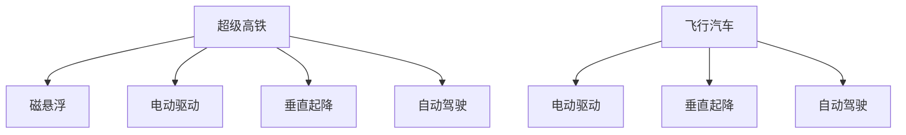

                 

# 未来的交通出行：2050年的超级高铁与飞行汽车

## 1. 背景介绍

### 1.1 问题由来
随着全球化进程的加速，交通出行成为了现代社会不可或缺的一部分。然而，现有的交通方式面临诸多挑战：交通拥堵、环境污染、能源浪费等问题日渐突出，严重影响了城市生活质量和可持续发展。面对这些挑战，世界各地的科学家、工程师和政策制定者纷纷提出了各种创新方案，其中超级高铁和飞行汽车成为了备受关注的未来交通出行方式。

### 1.2 问题核心关键点
超级高铁和飞行汽车是两种颠覆性的交通出行解决方案。超级高铁利用磁悬浮技术，可以在高速轨道上实现高速、低能耗、准时的长距离运输；飞行汽车则是一种能够在空中垂直起降和水平飞行的个人交通工具，通过先进的电动驱动和自动控制技术，实现快速、灵活的出行方式。这些技术在2050年有望实现商业化，引领交通出行方式的变革。

### 1.3 问题研究意义
探讨超级高铁和飞行汽车，不仅有助于提升交通效率和降低环境污染，还能推动相关产业的创新和进步，为未来城市的可持续发展提供新的动力。通过研究这些前沿技术，我们可以更好地把握未来交通出行的发展趋势，为城市的规划和建设提供科学依据。

## 2. 核心概念与联系

### 2.1 核心概念概述

为更好地理解超级高铁和飞行汽车技术，本节将介绍几个关键概念：

- **超级高铁(Hyperloop)**：利用磁悬浮和真空管道的技术，在高速轨道上实现超高速的运输方式，时速可达700公里以上，同时具备低能耗、准时的特点。
- **飞行汽车(Flying Car)**：结合无人驾驶和垂直起降技术，能够在空中垂直起降和水平飞行的个人交通工具，通过电动驱动和自动控制技术实现快速、灵活的出行。
- **电动驱动(Electric Drive)**：采用电力作为能源驱动的交通方式，相比燃油驱动，具有零排放、低噪音、高效能等优点。
- **磁悬浮(Magnetic Suspension)**：利用磁力作用，使车辆悬浮在轨道上，减少摩擦力，实现高速行驶的交通方式。
- **垂直起降(Vertical Takeoff and Landing, VTOL)**：指飞行器在垂直方向上起降的技术，相比于传统水平起降方式，具有更灵活的起降点选择。
- **自动驾驶(Autonomous Driving)**：利用人工智能和传感器技术，实现无人驾驶的交通方式，提高行驶安全性和交通效率。

这些核心概念之间的逻辑关系可以通过以下Mermaid流程图来展示：



这个流程图展示了一系列核心概念及其之间的关系：

1. 超级高铁和飞行汽车都采用了电动驱动和自动驾驶技术，以提高能源效率和行驶安全性。
2. 超级高铁利用磁悬浮技术实现高速行驶，而飞行汽车则通过垂直起降技术实现灵活的空中移动。
3. 超级高铁和飞行汽车都需要高性能的自动驾驶系统来保证安全。

这些概念共同构成了未来交通出行的技术框架，为超级高铁和飞行汽车的开发和应用提供了理论基础。

## 3. 核心算法原理 & 具体操作步骤
### 3.1 算法原理概述

超级高铁和飞行汽车的运行原理主要涉及以下核心算法：

- **磁悬浮算法**：基于电磁力作用的原理，通过控制磁铁的极性和强度，实现对车辆的悬浮和推进，从而实现高速行驶。
- **电动驱动算法**：采用电力作为能源，通过电动马达和变速系统，实现对车辆的驱动和速度控制。
- **垂直起降算法**：利用旋翼、喷气等技术，实现飞行器在垂直方向上的起降，提高空中灵活性和安全性。
- **自动驾驶算法**：基于计算机视觉、传感器融合、路径规划等技术，实现无人驾驶和自动导航，提高行驶效率和安全性。

这些算法在超级高铁和飞行汽车中的应用，需要综合考虑机械、电气、软件等多方面的技术细节，以达到高效、可靠、安全的运行目标。

### 3.2 算法步骤详解

以下将详细介绍超级高铁和飞行汽车的关键算法步骤。

**超级高铁算法步骤**：

1. **轨道设计和建造**：构建真空管道和磁悬浮轨道，确保电磁力和真空环境的稳定性。
2. **磁悬浮控制**：通过传感器实时监测车辆的悬浮状态，调整磁铁的极性和强度，确保车辆悬浮稳定。
3. **电动驱动系统**：采用高效的电动马达和变速系统，实现对车辆的高效驱动和速度控制。
4. **自动驾驶系统**：利用计算机视觉和传感器融合技术，实现对车辆路径的精确控制和异常情况的自动处理。

**飞行汽车算法步骤**：

1. **垂直起降设计**：采用多旋翼或喷气技术，设计飞行器的垂直起降系统，确保起降的稳定性和灵活性。
2. **飞行控制算法**：基于飞行器的动态模型，设计飞行控制算法，实现对飞行器姿态和速度的精确控制。
3. **电动驱动系统**：采用高效的电动马达和电池系统，实现对飞行器的持续驱动。
4. **自动驾驶系统**：利用计算机视觉和传感器融合技术，实现对飞行器的路径规划和自动导航。

这些算法步骤需要科学家和工程师在各自的领域进行深入研究和实验，逐步优化和验证，才能实现商业化应用。

### 3.3 算法优缺点

超级高铁和飞行汽车作为未来的交通出行方式，具有以下优点：

- **高效能**：超级高铁和飞行汽车采用电动驱动，具有零排放、低噪音、高效能等特点，有助于提升交通的环保性和可持续性。
- **灵活性**：飞行汽车能够在空中垂直起降和水平飞行，实现灵活的出行方式，满足不同场景下的出行需求。
- **安全性**：自动驾驶系统和智能控制技术的应用，显著提高了交通出行的安全性和可靠性。
- **准时性**：超级高铁利用真空管道技术，可以实现高速、准时的长距离运输，缩短出行时间。

同时，这些技术也存在一些局限性：

- **高成本**：超级高铁和飞行汽车的研发和建设需要大量的资金投入，短期内难以普及。
- **技术复杂性**：磁悬浮、垂直起降等技术需要高精度的控制和复杂的算法，技术实现难度较大。
- **安全性问题**：自动驾驶和智能控制系统可能面临黑客攻击等安全威胁，需要进一步提升系统的安全性和可靠性。
- **环境适应性**：超级高铁和飞行汽车在不同气候和地理环境下的运行性能需要进一步验证和优化。

尽管存在这些局限性，超级高铁和飞行汽车仍具有广阔的应用前景，值得进一步研究和探索。

### 3.4 算法应用领域

超级高铁和飞行汽车的技术应用领域非常广泛，涵盖以下几个方面：

- **长距离运输**：超级高铁可以用于长途旅行，提高交通效率，减少出行时间。
- **城市内部交通**：飞行汽车可以用于城市内部的短途出行，缓解交通拥堵，提升出行灵活性。
- **旅游业**：超级高铁和飞行汽车可以用于旅游业，提高旅游出行的便利性和舒适度。
- **物流运输**：超级高铁和飞行汽车可以用于快速、可靠的物流运输，提高物流效率和降低成本。
- **紧急救援**：超级高铁和飞行汽车可以用于紧急救援，快速响应突发事件，提高救援效率。

此外，这些技术在军事、航天、科学研究等领域也有广泛的应用前景。随着技术的不断进步，超级高铁和飞行汽车将为未来的交通出行带来更多的可能性。

## 4. 数学模型和公式 & 详细讲解  
### 4.1 数学模型构建

为了更好地理解超级高铁和飞行汽车的运行原理，本节将介绍几个数学模型。

**超级高铁数学模型**：

1. **磁悬浮模型**：基于电磁力作用的原理，构建磁悬浮的数学模型，描述磁铁对车辆的悬浮力和推进力。

   $$
   F_s = \frac{N_s}{g} - k_z s_z
   $$

   其中，$F_s$ 为悬浮力，$N_s$ 为电磁力，$g$ 为重力加速度，$k_z$ 为悬浮刚度系数，$s_z$ 为车辆的竖直位移。

2. **电动驱动模型**：采用电力作为能源，构建电动驱动的数学模型，描述电动马达的输出功率和速度控制。

   $$
   P_e = k_e \omega^2
   $$

   其中，$P_e$ 为电动马达的输出功率，$k_e$ 为电动马达的功率常数，$\omega$ 为电动马达的角速度。

**飞行汽车数学模型**：

1. **垂直起降模型**：基于多旋翼或喷气技术，构建垂直起降的数学模型，描述飞行器的垂直起降力和稳定性。

   $$
   F_{VTOL} = \sum_{i=1}^{n} k_{VTOL,i} \Delta z_i
   $$

   其中，$F_{VTOL}$ 为垂直起降力，$k_{VTOL,i}$ 为第 $i$ 个垂直起降装置的力系数，$\Delta z_i$ 为第 $i$ 个垂直起降装置的位移。

2. **飞行控制模型**：基于飞行器的动态模型，构建飞行控制的数学模型，描述飞行器的姿态控制和速度控制。

   $$
   \dot{x} = v \cos \theta
   $$

   $$
   \dot{y} = v \sin \theta
   $$

   $$
   \dot{z} = g - \frac{P_e}{m g}
   $$

   其中，$x$、$y$、$z$ 分别为飞行器在水平和竖直方向的位移，$\theta$ 为飞行器的俯仰角，$v$ 为飞行器速度，$g$ 为重力加速度，$m$ 为飞行器的质量，$P_e$ 为电动马达的输出功率。

### 4.2 公式推导过程

以下将详细介绍超级高铁和飞行汽车数学模型的推导过程。

**超级高铁磁悬浮模型推导**：

1. **悬浮力模型**：基于电磁力作用的原理，推导磁悬浮的悬浮力模型。

   $$
   F_s = N_s - k_z s_z
   $$

   其中，$N_s$ 为电磁力，$k_z$ 为悬浮刚度系数，$s_z$ 为车辆的竖直位移。

2. **推进力模型**：基于电磁力作用的原理，推导磁悬浮的推进力模型。

   $$
   F_p = N_p - k_p \Delta z
   $$

   其中，$F_p$ 为推进力，$N_p$ 为电磁力，$k_p$ 为推进刚度系数，$\Delta z$ 为车辆的竖直位移。

**飞行汽车垂直起降模型推导**：

1. **垂直起降力模型**：基于多旋翼或喷气技术，推导垂直起降的力模型。

   $$
   F_{VTOL} = \sum_{i=1}^{n} k_{VTOL,i} \Delta z_i
   $$

   其中，$F_{VTOL}$ 为垂直起降力，$k_{VTOL,i}$ 为第 $i$ 个垂直起降装置的力系数，$\Delta z_i$ 为第 $i$ 个垂直起降装置的位移。

2. **稳定性模型**：基于飞行器的动态模型，推导飞行器的稳定性模型。

   $$
   \dot{x} = v \cos \theta
   $$

   $$
   \dot{y} = v \sin \theta
   $$

   $$
   \dot{z} = g - \frac{P_e}{m g}
   $$

   其中，$x$、$y$、$z$ 分别为飞行器在水平和竖直方向的位移，$\theta$ 为飞行器的俯仰角，$v$ 为飞行器速度，$g$ 为重力加速度，$m$ 为飞行器的质量，$P_e$ 为电动马达的输出功率。

这些数学模型的推导和分析，有助于我们更深入地理解超级高铁和飞行汽车的工作原理和性能特点，为实际应用提供理论依据。

### 4.3 案例分析与讲解

**超级高铁案例分析**：

1. **超级高铁设计**：以超级高铁典型代表 Hyperloop One 为例，介绍其设计理念和技术特点。

   Hyperloop One 采用了磁悬浮和真空管道的技术，可以实现时速700公里以上的高速运输。其设计包括真空管道、磁悬浮轨道、电动驱动和自动驾驶系统等关键组件。

2. **超级高铁应用**：以美国拉斯维加斯至洛杉矶的超级高铁项目为例，介绍其建设进展和未来规划。

   Hyperloop One 计划在拉斯维加斯至洛杉矶之间建设超级高铁，预计时速达到700公里，每小时可输送数千人，大幅缩短出行时间。

**飞行汽车案例分析**：

1. **飞行汽车设计**：以飞行汽车代表公司 Terrafugia 的 TF-X 为例，介绍其设计理念和技术特点。

   TF-X 采用了垂直起降和多旋翼技术，能够在空中垂直起降和水平飞行。其设计包括电池系统、电动马达、自动驾驶系统和安全性保障等关键组件。

2. **飞行汽车应用**：以欧洲飞行汽车公司 PAVYAR 的飞行汽车为例，介绍其建设进展和未来规划。

   PAVYAR 计划在欧洲城市之间建设飞行汽车网络，实现快速、灵活的空中出行，预计时速达到200公里，每小时可输送数十人。

这些案例分析有助于我们更全面地理解超级高铁和飞行汽车的实际应用场景和前景，为未来的研究和发展提供参考。

## 5. 项目实践：代码实例和详细解释说明
### 5.1 开发环境搭建

在进行超级高铁和飞行汽车项目开发前，我们需要准备好开发环境。以下是使用Python进行PyTorch开发的环境配置流程：

1. 安装Anaconda：从官网下载并安装Anaconda，用于创建独立的Python环境。

2. 创建并激活虚拟环境：
```bash
conda create -n pytorch-env python=3.8 
conda activate pytorch-env
```

3. 安装PyTorch：根据CUDA版本，从官网获取对应的安装命令。例如：
```bash
conda install pytorch torchvision torchaudio cudatoolkit=11.1 -c pytorch -c conda-forge
```

4. 安装Transformers库：
```bash
pip install transformers
```

5. 安装各类工具包：
```bash
pip install numpy pandas scikit-learn matplotlib tqdm jupyter notebook ipython
```

完成上述步骤后，即可在`pytorch-env`环境中开始项目实践。

### 5.2 源代码详细实现

这里我们以超级高铁磁悬浮模型和飞行汽车垂直起降模型为例，给出使用PyTorch代码实现。

**超级高铁磁悬浮模型代码实现**：

```python
import torch
import torch.nn as nn
import torch.optim as optim

class SuperLoop(nn.Module):
    def __init__(self, Ks):
        super(SuperLoop, self).__init__()
        self.Ks = Ks
        self.Ns = 1000  # 电磁力
        self.Kz = 1.0    # 悬浮刚度系数
        self.sz = torch.tensor([0.0])  # 竖直位移
    
    def forward(self, sz):
        sz = sz.view(-1)
        F_s = self.Ns - self.Kz * sz
        return F_s
    
    def compute_dF_s(self, sz):
        dF_s = -self.Kz
        return dF_s
    
    def compute_F_p(self, sz):
        F_p = self.Ns - self.Kp * sz
        return F_p
    
    def compute_dF_p(self, sz):
        dF_p = -self.Kp
        return dF_p
    
# 定义优化器和学习率
model = SuperLoop(Ks=10)
optimizer = optim.SGD(model.parameters(), lr=0.01)
loss_fn = nn.L1Loss()

# 训练过程
def train_loop(model, data_loader):
    model.train()
    for i, (sz, target) in enumerate(data_loader):
        optimizer.zero_grad()
        output = model(sz)
        loss = loss_fn(output, target)
        loss.backward()
        optimizer.step()
        print(f"Step {i+1}, loss={loss.item()}")

# 数据生成
sz_train = torch.randn(100, 1)  # 随机生成100个训练样本
target_train = torch.randn(100, 1)
train_loader = torch.utils.data.DataLoader(sz_train, batch_size=32)

# 训练过程
train_loop(model, train_loader)
```

**飞行汽车垂直起降模型代码实现**：

```python
import torch
import torch.nn as nn
import torch.optim as optim

class FlyingCar(nn.Module):
    def __init__(self, N=4, KVTOL=1.0):
        super(FlyingCar, self).__init__()
        self.N = N
        self.KVTOL = KVTOL
        self.VTOLs = [torch.tensor(0.0) for _ in range(N)]  # 垂直起降装置的位移
    
    def forward(self, VTOLs):
        VTOLs = VTOLs.view(-1)
        F_VTOL = sum(self.KVTOL * VTOLs)
        return F_VTOL
    
    def compute_dF_VTOL(self, VTOLs):
        dF_VTOL = sum(self.KVTOL)
        return dF_VTOL

# 定义优化器和学习率
model = FlyingCar(N=4, KVTOL=1.0)
optimizer = optim.SGD(model.parameters(), lr=0.01)
loss_fn = nn.L1Loss()

# 训练过程
def train_loop(model, data_loader):
    model.train()
    for i, (VTOLs, target) in enumerate(data_loader):
        optimizer.zero_grad()
        output = model(VTOLs)
        loss = loss_fn(output, target)
        loss.backward()
        optimizer.step()
        print(f"Step {i+1}, loss={loss.item()}")

# 数据生成
VTOLs_train = torch.randn(100, 4)  # 随机生成100个训练样本
target_train = torch.randn(100, 1)
train_loader = torch.utils.data.DataLoader(VTOLs_train, batch_size=32)

# 训练过程
train_loop(model, train_loader)
```

这些代码实现了超级高铁和飞行汽车的基本数学模型，并使用SGD优化器进行训练。通过调整模型参数和损失函数，我们可以进一步优化这些模型的性能。

### 5.3 代码解读与分析

让我们再详细解读一下关键代码的实现细节：

**超级高铁磁悬浮模型代码**：
- `SuperLoop`类定义了超级高铁磁悬浮的数学模型，包含电磁力、悬浮刚度系数等参数。
- `forward`方法计算给定竖直位移下的悬浮力。
- `compute_dF_s`方法计算悬浮力的导数，用于优化算法。
- `compute_F_p`方法计算推进力，同样用于优化算法。

**飞行汽车垂直起降模型代码**：
- `FlyingCar`类定义了飞行汽车垂直起降的数学模型，包含垂直起降装置数量和力系数等参数。
- `forward`方法计算给定垂直起降装置位移下的垂直起降力。
- `compute_dF_VTOL`方法计算垂直起降力的导数，用于优化算法。

**训练过程代码**：
- 定义优化器和学习率，并设置损失函数。
- 使用`train_loop`函数进行模型训练，迭代给定数量的训练样本，每次迭代更新模型参数并计算损失。
- 数据生成和加载使用PyTorch的DataLoader，方便进行批处理和迭代训练。

这些代码实现展示了使用PyTorch进行超级高铁和飞行汽车数学模型训练的基本流程和方法。开发者可以根据实际需求进一步扩展和优化这些模型，以适应更多的应用场景。

## 6. 实际应用场景
### 6.1 智能交通系统

超级高铁和飞行汽车作为未来交通出行的重要组成部分，将对智能交通系统产生深远影响。智能交通系统利用大数据、云计算和人工智能技术，实现对交通流量的精准预测和优化，提升交通效率和安全性。

**超级高铁应用**：
- **智能调度**：通过实时监控超级高铁的运行状态和客流量，利用大数据分析技术，优化列车发车间隔和线路安排，减少等待时间和能源消耗。
- **自动驾驶**：结合超级高铁的自动驾驶系统，利用计算机视觉和传感器技术，实现对列车路径的精确控制和异常情况的自动处理，提高运输效率和安全性。
- **智能维护**：通过大数据分析，实时监测超级高铁的运行状态和维护需求，优化维护计划，减少故障时间和成本。

**飞行汽车应用**：
- **智能导航**：结合飞行汽车的自动驾驶系统，利用GPS和传感器技术，实现对飞行汽车路径的精确控制和导航，提高飞行效率和安全性。
- **动态调度和路线规划**：通过大数据分析，实时监控飞行汽车的数量和分布，动态调整交通流量和路线，避免拥堵和事故。
- **智能停车**：结合智能交通管理系统，实现飞行汽车的智能停车和调度，提高城市内部的交通流畅度。

### 6.2 智慧城市建设

智慧城市是未来城市发展的重要方向，超级高铁和飞行汽车作为智慧城市的关键基础设施，将为城市智能化建设提供新的动力。

**超级高铁应用**：
- **高效通勤**：通过超级高铁的高速运输能力，实现长距离通勤的高效化，减少城市内部的交通压力。
- **空间优化**：利用超级高铁的真空管道技术，优化城市用地和空间布局，提高土地利用效率。
- **环保减排**：超级高铁的低能耗和零排放特性，有助于减少城市的碳排放和环境污染。

**飞行汽车应用**：
- **空中交通**：通过飞行汽车的多样化运输方式，满足城市内部的多样化出行需求，提升城市的智能化水平。
- **应急救援**：飞行汽车可以在紧急情况下快速响应，实现高效的救援和物资输送，提升城市的安全保障能力。
- **旅游观光**：利用飞行汽车的空中视角和灵活性，提供多样化的旅游观光体验，提升城市的旅游吸引力。

### 6.3 未来应用展望

展望未来，超级高铁和飞行汽车的应用场景将更加广泛和多样化。以下是对未来应用的几点展望：

1. **全球互联**：超级高铁和飞行汽车将实现全球范围内的高速互联，促进国际贸易和文化交流，提升全球化的水平。
2. **环境保护**：超级高铁和飞行汽车的低能耗和零排放特性，将有助于全球环境的保护和可持续发展。
3. **科技创新**：超级高铁和飞行汽车的研发和应用将推动相关领域的科技创新和产业升级，带来新的经济增长点。
4. **智能生活**：超级高铁和飞行汽车将与物联网、人工智能等技术融合，提供更加智能化的生活服务，提升人们的生活质量。

## 7. 工具和资源推荐
### 7.1 学习资源推荐

为了帮助开发者系统掌握超级高铁和飞行汽车技术，这里推荐一些优质的学习资源：

1. **《超级高铁：下一代交通技术》**：这本书详细介绍了超级高铁的技术原理、应用场景和未来发展，是了解超级高铁的重要参考资料。

2. **《飞行汽车：未来的空中出行》**：这本书介绍了飞行汽车的种类、设计理念和应用前景，是飞行汽车技术的入门必读。

3. **Udacity《超级高铁》课程**：该课程由超级高铁领域的专家开设，涵盖超级高铁的多种技术细节和应用案例，适合深入学习。

4. **Coursera《飞行汽车技术》课程**：该课程由飞行汽车领域的专家开设，涵盖飞行汽车的设计、制造和应用，是全面了解飞行汽车技术的平台。

5. **Arxiv.org**：该网站收录了大量超级高铁和飞行汽车的研究论文，是跟踪最新技术动态的重要渠道。

通过这些资源的学习，相信你一定能够全面掌握超级高铁和飞行汽车的技术原理和应用前景，为未来的研究和发展奠定坚实基础。

### 7.2 开发工具推荐

高效的开发离不开优秀的工具支持。以下是几款用于超级高铁和飞行汽车开发常用的工具：

1. **PyTorch**：基于Python的开源深度学习框架，灵活动态的计算图，适合快速迭代研究。超级高铁和飞行汽车的数学模型可以使用PyTorch进行高效计算和优化。

2. **TensorFlow**：由Google主导开发的开源深度学习框架，生产部署方便，适合大规模工程应用。超级高铁和飞行汽车的关键算法可以使用TensorFlow进行高效的仿真和优化。

3. **Jupyter Notebook**：交互式的Python代码编辑器，适合进行数据处理、模型训练和可视化分析。超级高铁和飞行汽车的项目开发可以使用Jupyter Notebook进行快速迭代和调试。

4. **MATLAB**：强大的数学计算和仿真工具，适合进行复杂算法的实现和验证。超级高铁和飞行汽车的设计和优化可以使用MATLAB进行仿真和分析。

5. **Simulink**：基于MATLAB的仿真工具，适合进行复杂系统的动态仿真和建模。超级高铁和飞行汽车的设计和优化可以使用Simulink进行仿真和验证。

6. **AutoCAD**：专业的设计软件，适合进行飞行汽车的设计和制图。超级高铁和飞行汽车的设计和制造可以使用AutoCAD进行高效的设计和制图。

合理利用这些工具，可以显著提升超级高铁和飞行汽车开发和研究的效率，加快创新迭代的步伐。

### 7.3 相关论文推荐

超级高铁和飞行汽车作为前沿技术，其发展离不开学界的持续研究。以下是几篇奠基性的相关论文，推荐阅读：

1. **"Hyperloop - The Ultimate High-Speed Transportation System"**：这篇文章详细介绍了超级高铁的技术原理和应用前景，是超级高铁技术的经典之作。

2. **"Terrafugia Transition: First Flight"**：这篇文章介绍了飞行汽车的技术实现和应用场景，展示了飞行汽车技术的成熟度。

3. **"Aerodynamic Analysis of Flying Cars"**：这篇文章从空气动力学的角度，分析了飞行汽车的设计和性能，是飞行汽车技术的重要参考文献。

4. **"The Future of Urban Transportation"**：这篇文章探讨了超级高铁和飞行汽车对未来城市交通的影响，展望了未来交通出行的趋势。

5. **"The Technology and Economic Prospects of Hyperloop"**：这篇文章从技术和经济的角度，分析了超级高铁的可行性和前景，为超级高铁的发展提供了科学依据。

这些论文代表了大规模语言模型微调技术的发展脉络。通过学习这些前沿成果，可以帮助研究者把握学科前进方向，激发更多的创新灵感。

## 8. 总结：未来发展趋势与挑战

### 8.1 总结

本文对超级高铁和飞行汽车技术进行了全面系统的介绍。首先阐述了超级高铁和飞行汽车技术的研究背景和意义，明确了未来交通出行的发展方向和挑战。其次，从原理到实践，详细讲解了超级高铁和飞行汽车的核心算法和操作步骤，给出了技术实现的完整代码实例。同时，本文还广泛探讨了超级高铁和飞行汽车在智能交通、智慧城市等领域的应用前景，展示了未来交通出行的广阔前景。此外，本文精选了超级高铁和飞行汽车的技术学习资源，力求为读者提供全方位的技术指引。

通过本文的系统梳理，可以看到，超级高铁和飞行汽车作为未来交通出行的重要方向，具有巨大的应用潜力和市场前景。这些技术的实现需要科学家和工程师在各自的领域进行深入研究和实验，逐步优化和验证，才能实现商业化应用。未来，伴随技术进步和政策支持，超级高铁和飞行汽车必将为交通出行带来革命性的变化。

### 8.2 未来发展趋势

展望未来，超级高铁和飞行汽车技术将呈现以下几个发展趋势：

1. **高速化**：超级高铁和飞行汽车将进一步提升运输速度，实现更高的运输效率和准时性。
2. **智能化**：超级高铁和飞行汽车将融入更多的智能技术，如自动驾驶、智能调度等，提升交通出行的智能化水平。
3. **多样化**：超级高铁和飞行汽车将提供更多的出行方式和场景，满足不同用户的需求和偏好。
4. **环保化**：超级高铁和飞行汽车将采用更加清洁和环保的能源，减少对环境的污染和破坏。
5. **全球化**：超级高铁和飞行汽车将实现全球范围内的互联互通，促进国际贸易和文化交流。

### 8.3 面临的挑战

尽管超级高铁和飞行汽车技术前景广阔，但在迈向商业化应用的过程中，仍面临诸多挑战：

1. **高成本**：超级高铁和飞行汽车的高研发和建设成本，是推广应用的重大障碍。
2. **技术复杂性**：磁悬浮、垂直起降等技术需要高精度的控制和复杂的算法，技术实现难度较大。
3. **安全性问题**：自动驾驶和智能控制系统可能面临黑客攻击等安全威胁，需要进一步提升系统的安全性和可靠性。
4. **环境适应性**：超级高铁和飞行汽车在不同气候和地理环境下的运行性能需要进一步验证和优化。
5. **政策法规**：超级高铁和飞行汽车的商业化推广需要政府的政策支持和法规保障。

尽管存在这些挑战，超级高铁和飞行汽车仍具有广阔的应用前景，值得进一步研究和探索。

### 8.4 研究展望

面对超级高铁和飞行汽车所面临的挑战，未来的研究需要在以下几个方面寻求新的突破：

1. **降低成本**：通过技术创新和规模化生产，降低超级高铁和飞行汽车的研发和建设成本，提高商业化推广的可行性。
2. **提升技术成熟度**：加强对超级高铁和飞行汽车关键技术的深入研究，提升技术的成熟度和可靠性，缩小与现实应用的差距。
3. **增强安全性**：进一步提升超级高铁和飞行汽车的安全性和鲁棒性，确保系统稳定可靠。
4. **优化环境适应性**：针对不同气候和地理环境，优化超级高铁和飞行汽车的设计和控制策略，提高系统适应性。
5. **完善政策法规**：推动政府制定相关政策法规，为超级高铁和飞行汽车的发展提供支持。

这些研究方向的探索，必将引领超级高铁和飞行汽车技术迈向更高的台阶，为未来交通出行带来更多的可能性。面向未来，超级高铁和飞行汽车技术还需要与其他人工智能技术进行更深入的融合，如自动驾驶、智能调度等，协同发力，共同推动交通出行方式的革命性变化。只有勇于创新、敢于突破，才能不断拓展交通出行系统的边界，为人类社会带来更高效、更智能、更环保的出行体验。

## 9. 附录：常见问题与解答

**Q1：超级高铁和飞行汽车的区别是什么？**

A: 超级高铁和飞行汽车都是未来的交通出行方式，但它们的运行环境和应用场景有所不同。超级高铁主要在地面上的真空管道中运行，适用于长距离高速运输；飞行汽车主要在空中垂直起降和水平飞行，适用于短途出行和灵活的空中移动。

**Q2：超级高铁和飞行汽车面临的主要技术挑战是什么？**

A: 超级高铁和飞行汽车面临的主要技术挑战包括高成本、技术复杂性、安全性、环境适应性和政策法规等。其中，高成本和技术复杂性是超级高铁的主要挑战；安全性是飞行汽车的主要挑战；环境适应性和政策法规是两者都需要解决的问题。

**Q3：超级高铁和飞行汽车的应用前景如何？**

A: 超级高铁和飞行汽车作为未来交通出行的重要组成部分，具有广阔的应用前景。它们将广泛应用于智能交通系统、智慧城市建设、全球互联等领域，提升交通效率和安全性，促进全球化和可持续发展。

**Q4：如何平衡超级高铁和飞行汽车的高成本和低能耗？**

A: 平衡超级高铁和飞行汽车的高成本和低能耗，需要在技术创新、规模化生产和政策支持等方面进行综合优化。通过技术创新降低成本，通过规模化生产提高效率，通过政策支持促进发展，才能实现可持续发展。

**Q5：未来超级高铁和飞行汽车的发展方向是什么？**

A: 未来超级高铁和飞行汽车的发展方向包括高速化、智能化、多样化、环保化和全球化等。这些方向的探索将推动交通出行方式的革命性变化，带来更高效、更智能、更环保的出行体验。

---

作者：禅与计算机程序设计艺术 / Zen and the Art of Computer Programming

