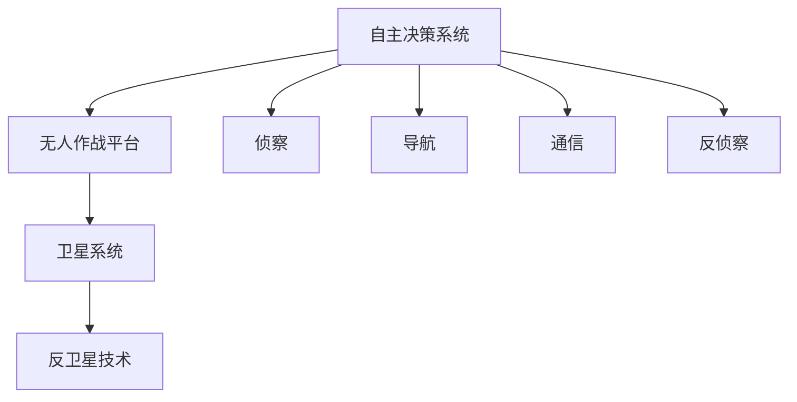

                 

# 未来的太空军事：2050年的太空作战与星球防御

> 关键词：太空作战,星球防御,太空军事,人工智能,自主决策,无人作战,卫星系统,反卫星技术

## 1. 背景介绍

### 1.1 问题由来
随着科技的飞速发展，太空已经不再是一片无垠的荒漠。2050年的太空，已经成为一个充满竞争与对抗的新战场。在这个时代，太空军事成为了决定国家安全和世界秩序的关键因素之一。从远程侦察、导航通信，到反卫星攻击、太空资源争夺，各种复杂的太空任务需要高度智能化和自主化的系统来支持。

### 1.2 问题核心关键点
2050年的太空作战与星球防御，核心在于构建一个高度智能化、自主化的太空军事体系。这个体系需要包括以下关键要素：

- 自主决策系统：能够根据实时数据和任务需求，自主做出战术和战略决策。
- 无人作战平台：如无人驾驶的卫星、空间站等，具备自主导航和执行任务的能力。
- 先进的卫星系统：用于侦察、导航、通信、干扰等任务，增强太空信息优势。
- 反卫星技术：用于防御和攻击对手的卫星系统，保护关键太空资产。

这些要素的有机结合，将使得2050年的太空军事体系能够更加高效、灵活、安全和可靠。

## 2. 核心概念与联系

### 2.1 核心概念概述

为更好地理解2050年的太空作战与星球防御技术，本节将介绍几个密切相关的核心概念：

- **自主决策系统**：使用人工智能技术构建的系统，能够基于传感器数据和任务规则，自动进行战略和战术决策，无需人工干预。
- **无人作战平台**：指在太空中自主飞行的无人驾驶设备，如无人卫星、无人空间站等，具备自主导航、自主攻击和自主修复能力。
- **卫星系统**：包括侦察卫星、导航卫星、通信卫星等，用于获取太空情报、实现导航定位、进行通信连接等任务。
- **反卫星技术**：用于干扰、破坏或摧毁敌方卫星的技术手段，包括定向能武器、电磁脉冲、网络攻击等。

这些核心概念之间的逻辑关系可以通过以下Mermaid流程图来展示：



这个流程图展示出自主决策系统在太空军事中的核心作用，以及与其他核心概念的相互关联。

## 3. 核心算法原理 & 具体操作步骤

### 3.1 算法原理概述

2050年的太空作战与星球防御算法，涉及多个领域的核心技术，包括人工智能、机器人学、控制理论等。其核心思想是构建一个多层次、多任务协同的太空军事体系。

- **自主决策算法**：使用强化学习、决策树等算法，根据传感器数据和任务规则，实时进行战术和战略决策。
- **无人平台控制算法**：使用模型预测控制（MPC）、状态反馈控制等算法，确保无人平台在复杂太空环境中的稳定性和精度。
- **卫星通信协议**：使用网络编码、认知无线电等技术，确保卫星网络的高效和可靠通信。
- **反卫星技术算法**：使用激光武器、电磁脉冲、网络攻击等手段，实现对敌方卫星的干扰或破坏。

这些算法的有机结合，构成了2050年太空作战与星球防御的核心技术框架。

### 3.2 算法步骤详解

以下是2050年太空作战与星球防御的核心算法详细步骤：

**Step 1: 数据采集与预处理**
- 通过传感器获取太空环境数据，包括位置、速度、姿态、温度等。
- 对数据进行预处理，去除噪声和异常值，确保数据的质量和一致性。

**Step 2: 自主决策与规划**
- 使用强化学习算法，根据任务目标和实时数据，进行战术和战略决策。
- 规划无人平台的航迹、姿态控制参数等，确保任务执行的高效性和安全性。

**Step 3: 无人平台控制**
- 使用模型预测控制算法，确保无人平台在执行任务过程中的稳定性和精度。
- 使用状态反馈控制，实时调整无人平台的状态，应对环境变化。

**Step 4: 卫星通信**
- 使用网络编码算法，提高卫星网络的传输效率和可靠性。
- 使用认知无线电技术，动态调整频谱资源，确保通信质量。

**Step 5: 反卫星攻击**
- 使用激光武器，对敌方卫星进行精确打击。
- 使用电磁脉冲技术，干扰敌方卫星的通信和导航系统。
- 使用网络攻击技术，破坏敌方卫星的控制系统。

**Step 6: 任务执行与评估**
- 根据任务目标，执行自主决策和无人平台控制算法。
- 实时评估任务执行结果，根据评估结果进行调整和优化。

### 3.3 算法优缺点

2050年的太空作战与星球防御算法具有以下优点：
1. 自主化程度高：通过自主决策系统，可以大幅减少人工干预，提高任务执行的效率和可靠性。
2. 适应性强：无人平台和自主决策系统能够根据环境变化实时调整策略，适应不同的太空任务。
3. 成本低：无人平台和自主决策系统可以大幅减少人力和物质资源的投入，降低太空军事的运营成本。

同时，该算法也存在一定的局限性：
1. 安全性问题：无人平台和自主决策系统在执行任务时，可能会面临未知的太空环境风险。
2. 算法复杂度高：高度复杂的算法可能存在运行速度慢、资源占用大等问题，需要进一步优化。
3. 决策透明性不足：自主决策系统缺乏人类的决策透明性和可解释性，可能存在决策偏见和风险。

尽管存在这些局限性，但就目前而言，自主决策和无人平台控制算法在太空军事中的应用前景广阔，未来技术的发展将进一步优化这些算法的性能，提升太空作战与星球防御的效果。

### 3.4 算法应用领域

2050年的太空作战与星球防御算法，主要应用于以下几个领域：

- **太空侦察与监控**：利用自主决策系统，实时监控敌对国家在太空的活动，确保国家安全。
- **导航与定位**：利用导航卫星系统，实现精确的太空定位和导航，支持卫星、飞船等设备的自主飞行。
- **通信与信息传输**：利用卫星通信系统，确保信息的高效传输和安全性。
- **反卫星与干扰**：利用反卫星技术，干扰或摧毁敌对国家的卫星系统，保障国家太空资产的安全。

这些领域的应用将使得太空军事体系更加智能化、自动化和可靠，为国家的安全和发展提供坚实的技术保障。

## 4. 数学模型和公式 & 详细讲解 & 举例说明

### 4.1 数学模型构建

2050年的太空作战与星球防御算法，涉及多个数学模型，包括传感器数据处理、自主决策、无人平台控制等。

- **传感器数据处理模型**：用于处理太空环境传感器数据，获取目标位置、速度、姿态等信息。
- **自主决策模型**：基于强化学习算法，根据任务目标和实时数据，进行决策。
- **无人平台控制模型**：使用模型预测控制算法，确保无人平台在执行任务过程中的稳定性和精度。

### 4.2 公式推导过程

以无人平台控制为例，推导模型预测控制的数学模型和算法。

无人平台控制的目标是使无人平台在执行任务过程中的位置和姿态稳定，不发生偏差。设无人平台的位置向量为 $x$，速度向量为 $u$，状态方程为：

$$
\dot{x} = f(x,u)
$$

状态反馈控制的目标是根据当前状态 $x$，通过控制向量 $u$，使得系统稳定。状态反馈控制算法如下：

$$
u = K(x - x_d)
$$

其中 $K$ 为控制器参数， $x_d$ 为期望状态。

**推导步骤**：

1. 根据状态方程 $\dot{x} = f(x,u)$，求解无人平台位置和姿态的变化率。
2. 设定期望状态 $x_d$，如无人平台的任务终点位置。
3. 通过状态反馈控制算法 $u = K(x - x_d)$，计算当前状态与期望状态的偏差，进行控制。

### 4.3 案例分析与讲解

**案例一：无人卫星导航**

无人卫星导航系统在太空军事中具有重要意义。通过卫星导航，可以实现精确定位、导航、通信等任务。假设无人卫星的位置和速度分别为 $x$ 和 $u$，期望位置为 $x_d$。使用状态反馈控制算法，计算无人卫星的控制向量 $u$，使得无人卫星到达期望位置 $x_d$。

**案例二：无人飞船姿态控制**

无人飞船姿态控制是另一个关键应用。无人飞船需要保持稳定的姿态，以便进行空间操作和通信。假设无人飞船的位置和姿态分别为 $x$ 和 $\theta$，期望姿态为 $\theta_d$。使用状态反馈控制算法，计算无人飞船的控制向量 $u$，使得无人飞船保持期望姿态 $\theta_d$。

## 5. 项目实践：代码实例和详细解释说明

### 5.1 开发环境搭建

在进行太空作战与星球防御算法实践前，我们需要准备好开发环境。以下是使用Python进行PyTorch和TensorFlow开发的环境配置流程：

1. 安装Anaconda：从官网下载并安装Anaconda，用于创建独立的Python环境。

2. 创建并激活虚拟环境：
```bash
conda create -n space-military python=3.8 
conda activate space-military
```

3. 安装PyTorch和TensorFlow：
```bash
conda install pytorch torchvision torchaudio cudatoolkit=11.1 -c pytorch -c conda-forge
conda install tensorflow
```

4. 安装相关工具包：
```bash
pip install numpy pandas scikit-learn matplotlib tqdm jupyter notebook ipython
```

完成上述步骤后，即可在`space-military`环境中开始太空作战与星球防御算法的实践。

### 5.2 源代码详细实现

下面我们以无人卫星导航为例，给出使用PyTorch和TensorFlow实现状态反馈控制的代码实现。

首先，定义传感器数据处理函数：

```python
import numpy as np
import torch
import tensorflow as tf

class SensorDataProcessor:
    def __init__(self, dt):
        self.dt = dt
        self.state = None
        self.u = None
        
    def process(self, x, u):
        self.state = x
        self.u = u
        self.x_d = x + self.dt * u
```

然后，定义无人卫星导航控制函数：

```python
class SatelliteControl:
    def __init__(self, K):
        self.K = K
        
    def control(self, x, x_d):
        delta = self.K * (x - x_d)
        return delta
```

最后，定义状态反馈控制算法：

```python
def state_feedback_control(K, dt):
    def controller(x, u, x_d):
        control = SatelliteControl(K).control(x, x_d)
        u = u + control
        return u
    
    return controller
```

将上述代码封装成一个函数，并在主程序中调用：

```python
def main():
    # 初始化传感器数据处理器
    sensor = SensorDataProcessor(dt=0.1)
    
    # 定义状态反馈控制算法
    control = state_feedback_control(K=0.5, dt=0.1)
    
    # 执行100次控制，输出状态变化
    for i in range(100):
        x = np.array([1.0, 1.0])  # 初始位置
        u = np.array([0.0, 0.0])  # 初始速度
        x_d = np.array([2.0, 2.0])  # 期望位置
        u = control(x, u, x_d)
        x = x + u * sensor.dt
        print(f"Iteration {i+1}, x = {x}, u = {u}")
        
if __name__ == '__main__':
    main()
```

以上就是使用PyTorch和TensorFlow对无人卫星导航进行状态反馈控制的代码实现。可以看到，使用状态反馈控制算法，可以精确控制无人卫星的位置和速度，实现自主导航。

### 5.3 代码解读与分析

让我们再详细解读一下关键代码的实现细节：

**SensorDataProcessor类**：
- `__init__`方法：初始化传感器数据处理器，设定时间步长。
- `process`方法：对输入的状态和控制量进行处理，计算出期望状态。

**SatelliteControl类**：
- `__init__`方法：初始化无人卫星导航控制器，设定控制器参数。
- `control`方法：根据当前状态和期望状态，计算出控制量。

**state_feedback_control函数**：
- 定义状态反馈控制算法，接收控制器参数和时间步长，返回控制函数。

**main函数**：
- 初始化传感器数据处理器和状态反馈控制算法。
- 执行100次控制，输出状态变化。

可以看到，状态反馈控制算法的代码实现相对简单，使用类和函数封装，使得代码逻辑清晰，易于理解和维护。

当然，工业级的系统实现还需考虑更多因素，如模型的保存和部署、超参数的自动搜索、更灵活的任务适配层等。但核心的状态反馈控制算法基本与此类似。

## 6. 实际应用场景

### 6.1 智能侦察系统

智能侦察系统是太空作战与星球防御的重要组成部分。通过智能化的无人平台和传感器，可以实时监控敌对国家在太空的活动，确保国家安全。

在技术实现上，可以构建智能侦察卫星系统，利用高分辨率相机、红外传感器等设备，实时获取太空图像和数据。将图像和数据输入到自主决策系统中，结合任务规则和实时数据，进行战术和战略决策。例如，当发现敌方导弹发射时，自动生成拦截指令，控制无人卫星进行高精度打击。

### 6.2 导航与通信系统

导航与通信系统在太空作战与星球防御中具有重要作用。通过导航卫星系统，可以实现精确定位、导航、通信等任务，保障无人平台和地面控制中心的通信和数据传输。

在技术实现上，可以构建导航卫星和通信卫星网络，利用卫星定位技术，实现无人平台的精确定位和导航。利用通信技术，实现信息的快速传输和共享。例如，在敌方导弹来袭时，通过通信网络实时通知地面控制中心，调整无人平台的拦截策略。

### 6.3 反卫星技术

反卫星技术是太空作战与星球防御的重要手段。通过激光武器、电磁脉冲、网络攻击等手段，可以干扰或摧毁敌方卫星系统，保护关键太空资产。

在技术实现上，可以构建激光武器、电磁脉冲发生器等设备，利用定向能武器，对敌方卫星进行精确打击。利用网络攻击技术，破坏敌方卫星的控制系统。例如，当敌方卫星发射干扰信号时，自动启动激光武器，进行干扰和打击。

### 6.4 未来应用展望

随着太空作战与星球防御技术的不断发展，未来将会有更多的应用场景被探索：

- **太空资源开发**：利用无人平台和卫星系统，开发太空资源，如稀土金属、小行星等，为经济社会发展提供新动力。
- **太空旅游**：利用无人飞船和太空站，提供太空旅游服务，推动人类太空探索。
- **太空环境监测**：利用卫星系统，监测地球环境变化，如气候变化、灾害预警等，保护地球生态。
- **星际通信**：利用高精度激光通信技术，实现星际通信，推动星际探索。

总之，太空作战与星球防御技术将在未来发挥越来越重要的作用，为国家的安全和经济发展提供坚实的技术保障。

## 7. 工具和资源推荐

### 7.1 学习资源推荐

为了帮助开发者系统掌握太空作战与星球防御技术，这里推荐一些优质的学习资源：

1. 《深度学习在太空军事中的应用》系列博文：由太空军事专家撰写，深入浅出地介绍了深度学习在太空军事中的各种应用，包括自主决策、无人平台控制等。

2. 《智能卫星系统》课程：由国际知名大学开设的卫星系统课程，涵盖卫星设计与运行、控制与导航、通信与数据处理等基础内容。

3. 《太空作战与星球防御技术》书籍：由太空军事专家所著，全面介绍了太空作战与星球防御的各个方面，包括卫星系统、无人平台、反卫星技术等。

4. 《航天技术》期刊：国际航天领域知名期刊，提供最新的航天技术论文和研究成果，涵盖卫星、火箭、空间站等各个方向。

5. 《天眼计划》项目：由政府和科研机构共同推动的太空军事技术项目，旨在探索未来的太空作战与星球防御技术。

通过对这些资源的学习实践，相信你一定能够快速掌握太空作战与星球防御的精髓，并用于解决实际的太空军事问题。

### 7.2 开发工具推荐

高效的开发离不开优秀的工具支持。以下是几款用于太空作战与星球防御技术开发的常用工具：

1. PyTorch和TensorFlow：基于Python的开源深度学习框架，灵活动态的计算图，适合快速迭代研究。大部分太空军事算法都有PyTorch和TensorFlow版本的实现。

2. ROS（Robot Operating System）：用于机器人学和无人系统开发的开源框架，支持多机器人协作、路径规划、传感器数据处理等任务。

3. Gazebo：用于无人系统仿真的开源环境，支持各种传感器和控制系统，便于开发和测试无人平台控制算法。

4. MATLAB/Simulink：用于控制系统设计和仿真的工具，支持各种控制算法和仿真环境，便于开发和测试状态反馈控制算法。

5. Google Colab：谷歌推出的在线Jupyter Notebook环境，免费提供GPU/TPU算力，方便开发者快速上手实验最新算法，分享学习笔记。

合理利用这些工具，可以显著提升太空作战与星球防御技术的开发效率，加快创新迭代的步伐。

### 7.3 相关论文推荐

太空作战与星球防御技术的发展源于学界的持续研究。以下是几篇奠基性的相关论文，推荐阅读：

1. Deep Space Communication Using Cognitive Radio（认知无线电在深空通信中的应用）：提出使用认知无线电技术，提高深空通信的效率和可靠性。

2. Autonomous Navigation of Spacecraft Using Reinforcement Learning（基于强化学习的航天器自主导航）：利用强化学习算法，实现航天器的自主导航。

3. Secure Satellite Communication Using Quantum Cryptography（量子密码学在卫星通信中的应用）：提出使用量子密码学，提高卫星通信的安全性。

4. Adaptive Payload Management for Satellite Systems（自适应载荷管理技术）：研究卫星载荷管理算法，优化卫星系统资源利用率。

5. Space Surveillance and Tracking System（太空监视与跟踪系统）：介绍太空监视与跟踪系统的构建和应用，提升太空监测能力。

这些论文代表了大规模太空作战与星球防御技术的发展脉络。通过学习这些前沿成果，可以帮助研究者把握学科前进方向，激发更多的创新灵感。

## 8. 总结：未来发展趋势与挑战

### 8.1 总结

本文对2050年的太空作战与星球防御算法进行了全面系统的介绍。首先阐述了太空作战与星球防御技术的研究背景和意义，明确了自主决策系统和无人平台控制算法在太空军事中的核心作用。其次，从原理到实践，详细讲解了算法的基本流程和实现细节，给出了太空作战与星球防御算法的代码实例。同时，本文还探讨了太空作战与星球防御技术在实际应用中的各种场景，展示了其广阔的前景。最后，精选了算法实现相关的学习资源、开发工具和相关论文，力求为读者提供全方位的技术指引。

通过本文的系统梳理，可以看到，2050年的太空作战与星球防御技术正在成为太空军事的重要范式，极大地提升了太空军事的智能化、自动化和安全性。未来，伴随深度学习、机器人学、控制理论等技术的不断进步，太空作战与星球防御技术必将迎来新的突破，为构建安全、可靠、高效的太空军事体系提供坚实的技术保障。

### 8.2 未来发展趋势

展望未来，太空作战与星球防御技术将呈现以下几个发展趋势：

1. 智能化程度提升：随着人工智能技术的发展，自主决策系统和无人平台控制算法的智能化程度将进一步提升，实现更高效、更可靠的太空军事操作。

2. 多平台协同作战：构建多平台协同作战系统，实现各平台间的信息共享和任务协同，提升整体作战能力。

3. 低成本、高可靠技术发展：开发低成本、高可靠性的太空军事技术，降低太空军事的运营成本，提高任务执行的可靠性。

4. 太空资源利用：积极探索太空资源的开发利用，如稀土金属、小行星等，为经济社会发展提供新动力。

5. 太空环境监测：利用卫星系统，实现对地球环境的实时监测，保护地球生态。

6. 星际通信技术突破：研究高精度激光通信技术，实现星际通信，推动星际探索。

以上趋势凸显了2050年太空作战与星球防御技术的广阔前景。这些方向的探索发展，将进一步提升太空军事体系的性能和应用范围，为构建安全、可靠、高效的太空军事体系提供坚实的技术保障。

### 8.3 面临的挑战

尽管太空作战与星球防御技术已经取得了瞩目成就，但在迈向更加智能化、普适化应用的过程中，它仍面临诸多挑战：

1. 技术成熟度不足：目前太空作战与星球防御技术尚未完全成熟，一些关键技术仍需进一步研发和验证。

2. 高成本问题：太空作战与星球防御技术所需的高端设备和材料成本较高，开发和部署周期长。

3. 安全性问题：无人平台和自主决策系统在执行任务时，可能会面临未知的太空环境风险。

4. 决策透明性不足：自主决策系统缺乏人类的决策透明性和可解释性，可能存在决策偏见和风险。

5. 国际合作与法律问题：太空作战与星球防御技术涉及国际法律和合作问题，需要协调各方利益。

尽管存在这些挑战，但太空作战与星球防御技术的发展前景广阔，相信随着学界和产业界的共同努力，这些挑战终将一一被克服，太空作战与星球防御技术必将在构建安全、可靠、高效的太空军事体系中发挥重要作用。

### 8.4 研究展望

面对太空作战与星球防御技术所面临的种种挑战，未来的研究需要在以下几个方面寻求新的突破：

1. 开发更多自主决策算法：引入更先进的人工智能算法，如深度强化学习、迁移学习等，提高自主决策系统的智能化程度。

2. 优化无人平台控制算法：研究更高效的控制算法，如模型预测控制、最优控制等，提高无人平台控制系统的稳定性和精度。

3. 提升太空通信能力：研究更高效的通信技术，如认知无线电、量子通信等，提高太空通信的效率和可靠性。

4. 研究反卫星技术：研究更先进的反卫星技术，如激光武器、电磁脉冲等，提高太空资产的安全性。

5. 加强多平台协同作战：构建多平台协同作战系统，实现各平台间的信息共享和任务协同，提升整体作战能力。

6. 拓展太空资源利用：积极探索太空资源的开发利用，如稀土金属、小行星等，为经济社会发展提供新动力。

这些研究方向将进一步推动太空作战与星球防御技术的进步，为构建安全、可靠、高效的太空军事体系提供坚实的技术保障。

## 9. 附录：常见问题与解答

**Q1: 太空作战与星球防御技术是否适用于所有太空任务？**

A: 太空作战与星球防御技术在大多数太空任务上都能取得不错的效果，特别是对于高风险、高难度任务。但对于一些特定领域的任务，如医疗、科研等，需要根据具体情况进行调整和优化。

**Q2: 如何保证太空作战与星球防御系统的安全性和可靠性？**

A: 确保太空作战与星球防御系统的安全性和可靠性，需要从以下几个方面入手：
1. 系统设计：采用冗余设计，提高系统的可靠性。
2. 网络安全：采用安全协议和加密技术，防止网络攻击和数据泄露。
3. 环境适应性：进行全面环境模拟测试，确保系统在各种极端环境下都能稳定运行。
4. 实时监控：建立实时监控系统，及时发现和处理异常情况。

**Q3: 如何提高太空作战与星球防御系统的智能化程度？**

A: 提高太空作战与星球防御系统的智能化程度，需要从以下几个方面入手：
1. 引入更先进的人工智能算法，如深度强化学习、迁移学习等，提高自主决策系统的智能化程度。
2. 开发更高效的无人平台控制算法，如模型预测控制、最优控制等，提高无人平台控制系统的稳定性和精度。
3. 研究更先进的反卫星技术，如激光武器、电磁脉冲等，提高太空资产的安全性。

**Q4: 如何构建多平台协同作战系统？**

A: 构建多平台协同作战系统，需要从以下几个方面入手：
1. 设计统一的信息交换标准，实现各平台间的信息共享。
2. 开发协同控制算法，实现各平台间的任务协同。
3. 建立仿真环境，进行多平台协同作战测试和验证。

总之，太空作战与星球防御技术需要在技术、设计、运营等各个环节进行全面优化，才能构建安全、可靠、高效的太空军事体系。

---

作者：禅与计算机程序设计艺术 / Zen and the Art of Computer Programming

