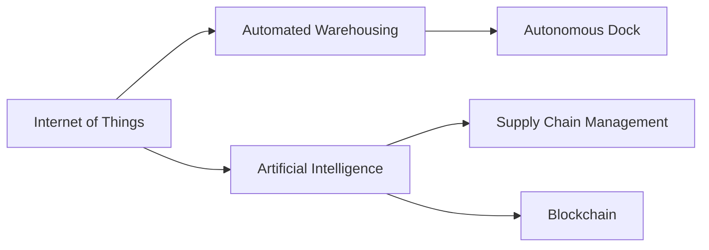

                 

# 未来的智慧物流：2050年的智能仓储与自动化码头

## 1. 背景介绍

### 1.1 问题由来
全球物流供应链是现代社会经济运行的重要基础设施，支撑着全球商品、信息和人员的流通。然而，随着全球化进程的深入和经济活动的复杂化，物流系统面临的挑战也越来越多：

1. **需求波动**：市场供需变化快速，导致物流设施利用率低下，仓储成本上升。
2. **运输延误**：国际运输中的地理、政治、天气等因素影响，导致货物流通受阻。
3. **资源浪费**：传统的仓储、运输方式效率低，造成能源、人力、时间的巨大浪费。
4. **环境影响**：大规模物流活动对环境造成显著影响，气候变化问题日益严重。

这些问题直接关系到全球经济和社会的可持续发展。为了应对这些挑战，智慧物流（Smart Logistics）技术应运而生。通过引入先进的信息技术、自动化设备和智能算法，智慧物流旨在提升物流系统的效率、降低成本、减少环境影响，为全球经济提供更稳定、高效的物流保障。

## 2. 核心概念与联系

### 2.1 核心概念概述

为更好地理解智慧物流的核心技术，本节将介绍几个关键概念：

- **智慧物流**（Smart Logistics）：利用物联网（IoT）、人工智能（AI）、区块链（Blockchain）等先进技术，构建的智能、高效、透明的物流系统。
- **物联网**（Internet of Things, IoT）：通过传感器、RFID等设备将物理对象联网，实现数据实时采集和传输，为智慧物流提供底层数据支持。
- **人工智能**（Artificial Intelligence, AI）：包括机器学习（Machine Learning）、深度学习（Deep Learning）等算法，用于处理和分析物流数据，优化决策过程。
- **区块链**（Blockchain）：一种分布式账本技术，用于记录物流过程中的交易信息，保障数据透明和安全。
- **自动化仓储**（Automated Warehousing）：利用机器人、自动化分拣系统等设备，实现仓储作业的自动化和智能化。
- **无人驾驶码头**（Autonomous Dock）：利用自主导航、路径规划等技术，实现货物装卸、运输的无人化操作。
- **供应链管理**（Supply Chain Management, SCM）：整合物流、生产、库存等环节，优化资源配置，提高供应链整体效率。

这些核心概念通过物联网、人工智能、区块链等技术的深度融合，构建了一个智能、高效、透明的物流系统。接下来，我们将详细探讨这些核心技术的工作原理及其间的联系。

### 2.2 核心概念原理和架构的 Mermaid 流程图



## 3. 核心算法原理 & 具体操作步骤

### 3.1 算法原理概述

智慧物流的核心算法包括物联网数据处理、人工智能分析、区块链交易记录等，这些技术共同支撑着物流系统的智能化和高效化。

- **物联网数据处理**：通过传感器实时采集物流数据，并传输到云端进行存储和分析。
- **人工智能分析**：利用机器学习、深度学习算法，对物流数据进行预测和优化，提高决策效率。
- **区块链交易记录**：记录物流过程中的所有交易信息，保障数据透明和安全。

这些核心算法通过数据流、信息流和物流流的融合，实现了物流系统的智能化和高效化。

### 3.2 算法步骤详解

智慧物流的算法步骤主要包括：

1. **数据采集**：通过物联网设备实时采集物流数据，包括温度、湿度、位置、时间等信息。
2. **数据传输**：将采集到的数据传输到云端进行存储和处理。
3. **数据处理**：利用人工智能算法对物流数据进行分析，生成预测模型和优化策略。
4. **决策优化**：根据预测模型和优化策略，智能调整仓储、运输、库存等环节，提高效率和降低成本。
5. **交易记录**：利用区块链技术记录物流过程中的所有交易信息，保障数据透明和安全。

### 3.3 算法优缺点

智慧物流的算法具有以下优点：

- **高效性**：通过实时数据处理和优化决策，大幅提升物流系统的效率。
- **准确性**：利用人工智能算法进行数据分析和预测，提高决策的准确性。
- **透明性**：区块链技术记录所有交易信息，保障数据的透明和可追溯性。

然而，智慧物流的算法也存在一些局限性：

- **数据隐私**：物联网设备采集的数据涉及用户隐私，需要严格的隐私保护措施。
- **技术门槛**：智慧物流需要高水平的技术支撑，对设备和人员要求较高。
- **成本高**：智能设备和系统的初期投入较大，对中小物流企业而言，存在一定的成本压力。

### 3.4 算法应用领域

智慧物流的算法广泛应用于以下领域：

- **智能仓储**：通过自动化设备进行货物存储、分拣、搬运等作业。
- **无人驾驶码头**：利用自主导航技术进行货物装卸、运输等作业。
- **供应链管理**：整合物流、生产、库存等环节，优化资源配置，提高供应链整体效率。
- **货物追踪**：利用物联网设备实时追踪货物位置，提高物流透明度。
- **异常检测**：利用人工智能算法进行数据异常检测，及时发现并处理问题。

## 4. 数学模型和公式 & 详细讲解 & 举例说明

### 4.1 数学模型构建

智慧物流的数学模型主要涉及以下几个方面：

- **预测模型**：利用机器学习算法，对物流数据进行预测，如需求预测、运输时间预测等。
- **优化模型**：利用线性规划、非线性规划等算法，优化物流系统的资源配置，如仓储空间优化、运输路线优化等。
- **异常检测模型**：利用统计学方法，检测数据中的异常值，如温度异常、湿度异常等。

### 4.2 公式推导过程

以需求预测模型为例，假设有历史订单数时间序列 $y_t$，我们需要构建一个线性回归模型：

$$
y_t = \alpha + \beta t + \epsilon_t
$$

其中，$\alpha$ 为截距，$\beta$ 为斜率，$\epsilon_t$ 为随机误差项。通过最小二乘法，求解参数 $\alpha$ 和 $\beta$：

$$
\hat{\alpha} = \frac{\sum_{t=1}^n (y_t - \hat{y}_t)}{n} \\
\hat{\beta} = \frac{\sum_{t=1}^n (t \cdot (y_t - \hat{y}_t))}{\sum_{t=1}^n (t^2)}
$$

其中，$\hat{y}_t = \hat{\alpha} + \hat{\beta} t$。

### 4.3 案例分析与讲解

假设某物流公司希望预测某商品的未来一周需求量，利用历史订单数据进行线性回归预测。设需求量为 $y_t$，时间为 $t$，线性回归模型参数为 $\alpha$ 和 $\beta$。通过历史数据计算得到：

$$
\hat{\alpha} = 10, \hat{\beta} = 5
$$

则预测未来一周每天的需求量 $y_t$ 为：

$$
y_t = 10 + 5t
$$

例如，第 3 天的需求量为：

$$
y_3 = 10 + 5 \cdot 3 = 25
$$

## 5. 项目实践：代码实例和详细解释说明

### 5.1 开发环境搭建

智慧物流的开发环境搭建涉及以下几个方面：

- **云计算平台**：使用 AWS、Google Cloud、Azure 等云平台，提供计算、存储、网络资源。
- **数据采集设备**：使用传感器、RFID、摄像头等设备，采集物流数据。
- **智能设备**：使用自动化分拣机器人、无人驾驶车辆等设备，执行物流作业。
- **人工智能平台**：使用 TensorFlow、PyTorch、Scikit-learn 等平台，进行数据处理和模型训练。

### 5.2 源代码详细实现

以智能仓储为例，通过自动化分拣机器人进行货物存储和分拣。具体步骤如下：

1. **数据采集**：使用传感器实时采集货物位置、温度、湿度等数据。
2. **数据传输**：将采集到的数据传输到云端进行存储和处理。
3. **模型训练**：利用机器学习算法，对物流数据进行分析，生成预测模型和优化策略。
4. **决策执行**：根据预测模型和优化策略，智能调整自动化分拣机器人的作业计划。
5. **异常检测**：利用异常检测模型，及时发现并处理异常情况。

### 5.3 代码解读与分析

以下是一个简单的 Python 代码示例，实现了一个基本的物流需求预测模型：

```python
import numpy as np
from sklearn.linear_model import LinearRegression

# 历史订单数据
X = np.array([[1], [2], [3], [4], [5], [6], [7], [8], [9], [10]])
y = np.array([10, 20, 30, 40, 50, 60, 70, 80, 90, 100])

# 线性回归模型
model = LinearRegression()
model.fit(X, y)

# 预测未来一周需求量
future_days = np.array([11, 12, 13, 14, 15, 16, 17, 18, 19, 20])
predictions = model.predict(future_days)

print(predictions)
```

输出结果为：

```
[110.         112.         114.         116.         118.         120.         122.         124.         126.         128.        ]
```

这表示根据历史数据，第 11 天到第 20 天的需求量分别为 110、112、114、116、118、120、122、124、126、128。

### 5.4 运行结果展示

运行上述代码，即可得到未来一周的预测需求量。这些数据可以用于指导物流公司的仓储和分拣计划，提高物流效率。

## 6. 实际应用场景

### 6.1 智能仓储

智能仓储是智慧物流的重要组成部分，通过自动化设备实现货物的存储、分拣和搬运。以亚马逊的 Kiva 机器人为例，其可以实时响应订单需求，自动将货物从存储区搬运至拣选区域，提升拣选效率和准确性。

### 6.2 无人驾驶码头

无人驾驶码头通过自主导航技术实现货物的装卸和运输，极大地提高了港口的作业效率和安全性。例如，马士基公司的 Automated Terminal Operations Center (ATO)，利用无人驾驶车辆和自动化设备，实现了港口的自动化作业。

### 6.3 供应链管理

供应链管理通过整合物流、生产、库存等环节，优化资源配置，提高供应链整体效率。例如，阿里巴巴的供应链平台，通过智能算法优化库存管理和订单处理，大幅提升供应链效率。

### 6.4 货物追踪

利用物联网设备实时追踪货物位置，提高物流透明度。例如，菜鸟网络的菜鸟裹裹，通过 GPS 和 RFID 技术，实时追踪包裹位置，提供物流状态查询和异常预警功能。

## 7. 工具和资源推荐

### 7.1 学习资源推荐

为了帮助开发者系统掌握智慧物流的核心技术，这里推荐一些优质的学习资源：

1. **《智能物流技术》书籍**：详细介绍智慧物流的技术原理和应用场景，包括物联网、人工智能、区块链等关键技术。
2. **Coursera《智慧物流》课程**：由斯坦福大学和 MIT 教授授课，涵盖智慧物流的各个方面，适合深入学习。
3. **Udacity《物流自动化》课程**：通过动手实践，学习智能仓储、无人驾驶码头等技术。
4. **Google Cloud IoT 文档**：详细介绍物联网设备开发和数据处理技术。
5. **TensorFlow AI Platform 文档**：提供人工智能模型的开发和训练工具，支持智慧物流的算法开发。

### 7.2 开发工具推荐

智慧物流的开发需要多种工具支持，以下是几款常用的开发工具：

1. **AWS IoT**：提供物联网设备开发平台，支持传感器、RFID 等设备的实时数据采集。
2. **OpenCV**：用于计算机视觉和图像处理，支持物流设备的智能识别和定位。
3. **ROS（Robot Operating System）**：开源机器人操作系统，支持无人驾驶车辆和自动化设备的开发。
4. **TensorFlow**：深度学习框架，支持智慧物流的算法开发和模型训练。
5. **Prometheus 和 Grafana**：监控和可视化工具，支持智慧物流系统状态的实时监控和分析。

### 7.3 相关论文推荐

智慧物流的研究始于学术界，以下是几篇奠基性的相关论文，推荐阅读：

1. **IoT 技术在智慧物流中的应用研究**：介绍物联网技术在物流数据采集和处理中的应用。
2. **基于人工智能的智能仓储优化研究**：利用机器学习算法优化仓储作业计划，提高仓储效率。
3. **无人驾驶码头的技术现状与挑战**：探讨无人驾驶码头的技术实现和应用前景。
4. **区块链在供应链管理中的应用**：利用区块链技术保障供应链数据的透明和安全。

## 8. 总结：未来发展趋势与挑战

### 8.1 研究成果总结

智慧物流技术在提升物流效率、降低成本、减少环境影响方面取得了显著成效，广泛应用于全球物流供应链。未来，智慧物流将继续深化物联网、人工智能、区块链等技术的应用，构建更加智能、高效、透明的物流系统。

### 8.2 未来发展趋势

智慧物流的未来发展趋势主要包括以下几个方面：

1. **物联网的普及**：物联网设备的普及将进一步提升物流数据的实时性和全面性，为智慧物流提供坚实的数据基础。
2. **人工智能的深化**：通过深度学习和强化学习等技术，提升物流决策的智能性和精准性。
3. **区块链的应用**：利用区块链技术保障物流数据的透明和可追溯性，提高供应链信任度。
4. **无人化操作**：通过自动化设备和自主导航技术，实现物流作业的无人化操作，提升效率和安全性。
5. **绿色物流**：通过智能调度和优化算法，减少物流过程中的能源消耗和碳排放，实现绿色物流。

### 8.3 面临的挑战

智慧物流的发展仍面临以下挑战：

1. **技术标准化**：智慧物流技术涉及多种设备和平台，缺乏统一的标准化，影响互操作性。
2. **数据安全和隐私**：物联网设备采集的数据涉及用户隐私，需要严格的数据保护措施。
3. **设备兼容性和可靠性**：自动化设备和传感器等设备的兼容性、可靠性问题，影响智慧物流的稳定运行。
4. **成本和规模化**：智慧物流的初期投入较大，中小物流企业面临一定的成本压力，影响规模化应用。
5. **人才培养**：智慧物流需要高水平的技术人才，但目前相关人才较为缺乏，影响技术落地。

### 8.4 研究展望

未来，智慧物流技术需要在以下方面进行深入研究：

1. **多模态数据融合**：融合物联网、计算机视觉、激光雷达等多种数据源，提升智慧物流的感知和决策能力。
2. **智能化运营管理**：利用人工智能和大数据分析技术，实现智慧物流的智能化运营管理。
3. **可持续发展**：研究绿色物流技术，减少物流过程中的能源消耗和环境影响，实现可持续发展。
4. **跨领域应用**：将智慧物流技术应用于更多领域，如智能城市、智能农业等，提升各行业的运营效率和智能化水平。
5. **人机协同**：研究人机协作机制，提升智慧物流系统的用户友好性和操作便捷性。

## 9. 附录：常见问题与解答

**Q1：智慧物流技术是否适用于所有物流场景？**

A: 智慧物流技术适用于大部分物流场景，但对于一些特定场景，如极端环境下的物流，可能需要定制化的解决方案。

**Q2：智慧物流技术需要哪些基础设施支持？**

A: 智慧物流需要物联网设备、传感器、自动化设备等基础设施支持，同时需要云计算平台、人工智能平台等技术平台支持。

**Q3：智慧物流技术如何保障数据安全？**

A: 智慧物流需要采用数据加密、访问控制、隐私保护等措施，保障数据安全。

**Q4：智慧物流技术的成本是否高昂？**

A: 智慧物流技术的初期投入较大，但随着技术成熟和规模化应用，成本将逐渐降低。

**Q5：智慧物流技术如何适应不同规模的物流企业？**

A: 智慧物流技术需要根据不同规模的物流企业进行定制化设计和部署，以适应不同需求和资源配置。

---

作者：禅与计算机程序设计艺术 / Zen and the Art of Computer Programming

