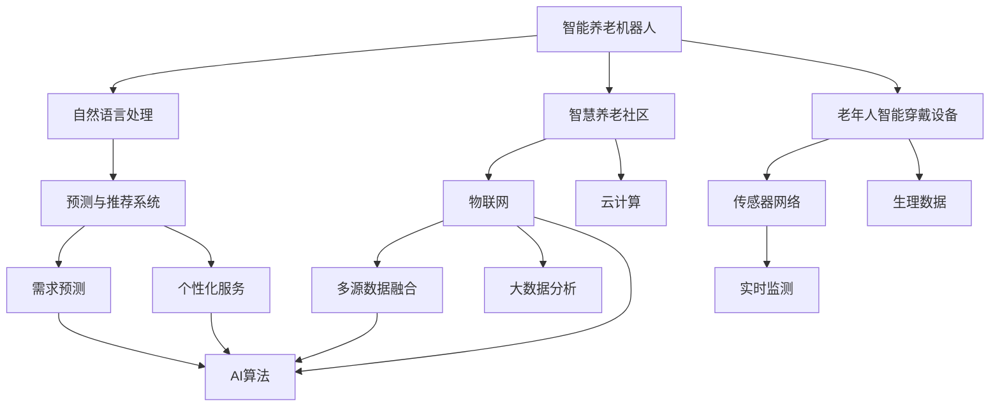

                 

# 未来的智能养老：2050年的智能养老机器人与智慧养老社区

> 关键词：人工智能, 智能养老, 机器人, 智慧养老社区, 数据分析, 传感器网络, 自然语言处理, 预测模型, 社交网络

## 1. 背景介绍

### 1.1 人口老龄化与养老需求

随着全球人口老龄化的趋势加剧，养老问题成为各国政府和社会关注的热点。据联合国的统计数据，到2050年，全球老年人口将达到25亿，约占总人口的四分之一。这将带来巨大的养老服务需求，给传统养老体系带来巨大挑战。

养老需求主要集中在医疗护理、生活照料、精神陪伴三个方面。医疗护理涉及慢性病管理、药物使用、康复治疗等，生活照料包括日常饮食、清洁、出行等，精神陪伴则包括社交互动、情感交流、心理支持等。

现有的养老服务体系在供需匹配、资源配置、服务质量等方面存在诸多问题，难以满足日益增长的养老需求。因此，引入智能科技，利用先进的信息技术改善养老服务质量，成为必要的选择。

### 1.2 人工智能在养老领域的应用前景

人工智能（AI）技术的飞速发展，使得其在养老领域的应用成为可能。AI技术可以通过智能化设备和系统，实时监测老年人的健康状况和生活需求，提供精准的医疗护理、个性化生活照料和高效精神陪伴，有效提升养老服务的质量和效率。

智能养老的核心在于三个主要方向：

- **智能养老机器人**：能够自动完成日常护理任务，减轻看护人员的工作负担。
- **智慧养老社区**：利用智能设备和系统，实现老人在社区内的安全监控、环境调节和健康管理。
- **老年人智能穿戴设备**：通过各类传感器，实时监测老年人的生理数据和行为特征，提供个性化的健康和生活服务。

智能养老的实现，不仅需要先进的算法和技术，还需与养老服务需求紧密结合，实现真正意义上的智能化和人性化。

## 2. 核心概念与联系

### 2.1 核心概念概述

为了更好地理解智能养老的实现，本节将介绍几个关键核心概念及其相互联系：

- **智能养老机器人**：基于先进的AI算法和传感器技术，能够自动完成日常护理任务（如陪伴、喂食、清洁等），并通过自然语言处理（NLP）与老年人进行互动。
- **智慧养老社区**：依托物联网和云计算技术，利用智能设备和系统，实现老人在社区内的生活监控、健康管理和社交互动，提升养老服务的效率和质量。
- **老年人智能穿戴设备**：通过各类传感器，实时监测老年人的生理数据（如心率、血压、位置等）和行为特征，提供个性化的健康和生活服务。
- **数据融合与分析**：整合多源异构数据，通过机器学习和深度学习算法，进行数据分析和建模，提高养老服务的决策支撑能力。
- **预测与推荐系统**：利用历史数据和实时信息，构建预测和推荐模型，辅助养老服务机构进行需求预测和个性化服务推荐。
- **社交网络与情感陪伴**：通过社交媒体和AI技术，构建虚拟或实体的社交网络，实现老年人之间的互动和情感交流，提供心理支持和社交娱乐。

这些核心概念相互交织，共同构成了智能养老的完整体系。通过这些技术的综合应用，可以实现高质量、个性化的养老服务，提升老年人的生活质量。

### 2.2 核心概念联系

智能养老的实现，需要依托多领域的跨学科协作。以下是这些核心概念之间的联系：



这个图展示了智能养老中各个核心概念之间的联系：

1. **智能养老机器人**与**自然语言处理（NLP）**：通过NLP技术，机器人能够理解老年人的语音和文本指令，实现自然交互。
2. **智慧养老社区**与**物联网（IoT）**、**云计算（Cloud）**：利用物联网技术，社区能够实现设备互联和数据实时传输；利用云计算技术，实现数据的集中存储和高效处理。
3. **老年人智能穿戴设备**与**传感器网络**、**生理数据**：通过传感器网络，实时监测老年人的生理数据和行为特征。
4. **预测与推荐系统**与**数据融合与分析**：利用大数据分析技术，进行多源数据的融合和分析，构建预测和推荐模型。
5. **社交网络与情感陪伴**：通过社交媒体和AI技术，构建社交网络，实现情感交流和心理支持。

这些概念之间的联系表明，智能养老需要综合应用多个领域的先进技术，构建完整的智能化服务体系。

## 3. 核心算法原理 & 具体操作步骤

### 3.1 算法原理概述

智能养老的核心在于利用先进的算法和系统，实现对老年人的精准护理和高效服务。这里主要介绍以下关键算法和技术：

- **自然语言处理（NLP）**：通过语音识别、文本分析等技术，使智能设备能够理解和处理老年人的语言指令。
- **传感器融合与数据处理**：利用多种传感器（如心率监测、位置跟踪等），实时获取老年人的生理和行为数据，并进行数据融合和分析。
- **机器学习与深度学习**：构建预测和推荐模型，实现对老年人健康状况和生活需求的预测和个性化服务推荐。
- **强化学习**：通过智能养老机器人的任务优化和行为学习，提升护理服务的质量和效率。

### 3.2 算法步骤详解

以智能养老机器人为例，介绍其具体实现步骤：

**Step 1: 数据采集与预处理**

1. **传感器数据采集**：通过各类传感器（如心率监测器、位置跟踪器等），实时采集老年人的生理数据和行为特征。
2. **数据预处理**：对采集的数据进行清洗、归一化和缺失值填充等预处理，确保数据质量。

**Step 2: 语音识别与自然语言处理**

1. **语音识别**：使用语音识别技术，将老年人的语音指令转换为文本。
2. **自然语言处理**：使用NLP技术，理解和处理老年人的语言指令，如“我要喝水”、“我需要上厕所”等。

**Step 3: 行为分析与任务调度**

1. **行为分析**：通过机器学习算法，分析老年人的行为模式和健康状况，如识别跌倒、异常行为等。
2. **任务调度**：根据分析结果，调度智能机器人完成相应的护理任务，如陪伴、喂食、清洁等。

**Step 4: 情感交互与社交支持**

1. **情感交互**：通过情感识别技术，感知老年人的情绪变化，提供心理支持和情感陪伴。
2. **社交支持**：利用社交媒体和AI技术，构建虚拟或实体的社交网络，促进老年人之间的互动和交流。

**Step 5: 系统集成与用户反馈**

1. **系统集成**：将各类设备和系统集成到一个统一的平台，实现数据共享和协同工作。
2. **用户反馈**：收集老年人的使用反馈，持续改进和优化智能养老系统的功能和性能。

### 3.3 算法优缺点

智能养老机器人与智慧养老社区的实现，主要优点包括：

- **高效性**：通过自动化和智能化手段，减轻看护人员的工作负担，提高养老服务的效率。
- **个性化**：利用数据融合与分析技术，实现对老年人健康和生活需求的精准预测和个性化服务。
- **全天候**：利用24小时监控和实时响应，确保老年人随时获得及时的帮助和支持。

但同时，也存在一些挑战和局限：

- **数据隐私和安全**：老年人的生理和行为数据涉及隐私问题，需要严格的数据保护措施。
- **技术成本**：智能设备和系统的部署和维护成本较高，需要大规模的资金投入。
- **用户接受度**：老年人对新技术的接受程度不一，需要做好宣传和教育工作，提升用户的信任和使用意愿。

### 3.4 算法应用领域

智能养老机器人与智慧养老社区的应用领域广泛，涵盖以下几个方面：

1. **医院和养老院**：通过智能设备和系统，实现对老年人的全面监控和护理，提高医疗服务的质量和效率。
2. **社区和家庭**：利用智能设备和系统，提供日常照料、健康管理和情感支持，提升老年人的生活质量。
3. **辅助出行**：通过智能导航和辅助设备，帮助老年人实现独立出行，减少安全风险。
4. **社交互动**：利用虚拟和实体社交网络，促进老年人之间的互动和交流，缓解孤独感。

这些应用场景展示了智能养老技术在多个领域的潜力和价值。

## 4. 数学模型和公式 & 详细讲解  
### 4.1 数学模型构建

本节将使用数学语言对智能养老的核心算法进行更加严格的刻画。

**4.1.1 传感器数据融合**

假设有 $n$ 个传感器采集老年人的生理和行为数据，记为 $s_{1}, s_{2}, ..., s_{n}$，其中 $s_{i}$ 表示第 $i$ 个传感器的数据。设每个传感器数据 $s_{i}$ 包含 $m$ 个特征，记为 $\mathbf{s}_{i} = (s_{i1}, s_{i2}, ..., s_{im})^T$。

数据融合的数学模型为：

$$
\mathbf{y} = \mathbf{W}\mathbf{s} + \mathbf{b}
$$

其中 $\mathbf{y}$ 为融合后的数据向量，$\mathbf{W}$ 为融合权重矩阵，$\mathbf{b}$ 为偏置向量。

融合权重矩阵 $\mathbf{W}$ 和偏置向量 $\mathbf{b}$ 需要通过训练得到，以确保融合后的数据准确性和可靠性。

**4.1.2 行为预测模型**

设老年人第 $i$ 个行为事件发生的时间为 $t_i$，需要预测未来 $k$ 个行为事件的发生时间。设 $t_{i,j}$ 表示第 $i$ 个行为事件在第 $j$ 个时间点是否发生，$j = 1, ..., k$。

利用时间序列预测模型，构建行为预测模型：

$$
\hat{t}_{i,j} = \hat{t}_{i,j-1} + \Delta t
$$

其中 $\Delta t$ 为时间间隔，通常为固定值。

**4.1.3 情感识别模型**

设老年人当前的情绪状态为 $e$，包括正面情绪、负面情绪和中性情绪。设 $e_{i}$ 表示第 $i$ 个时间点老年人的情绪状态，$i = 1, ..., T$，其中 $T$ 为时间序列长度。

利用情感识别模型，预测老年人的情绪状态：

$$
\hat{e}_{i} = f(\mathbf{x}_{i})
$$

其中 $\mathbf{x}_{i}$ 为第 $i$ 个时间点的特征向量，$f$ 为情感识别函数。

### 4.2 公式推导过程

以智能养老机器人为例，推导其语音识别和自然语言处理的数学模型。

**4.2.1 语音识别模型**

语音识别模型包括两个阶段：特征提取和语音识别。

**特征提取**：

设语音信号 $x$ 的频率和幅度特征为 $X = (x_{1}, x_{2}, ..., x_{N})^T$，其中 $N$ 为特征数。

利用MFCC（Mel频率倒谱系数）提取语音特征，公式如下：

$$
X = D(\mathbf{y})
$$

其中 $D$ 为MFCC提取函数。

**语音识别**：

设语音信号 $x$ 对应的文字序列为 $y$。利用声学模型 $P(x|y)$ 和语言模型 $P(y)$，计算语音信号的概率 $P(x)$：

$$
P(x) = \sum_{y} P(x|y) P(y)
$$

利用最大后验概率（MAP）准则，识别出最可能的文字序列：

$$
\hat{y} = \mathop{\arg\max}_{y} P(y|x)
$$

其中 $\hat{y}$ 为识别出的文字序列。

**4.2.2 自然语言处理模型**

自然语言处理模型包括文本分词和语义分析。

**文本分词**：

设文本序列 $s$ 的分词结果为 $w$，每个单词 $w_{i}$ 的向量表示为 $\mathbf{w}_{i}$，记为 $\mathbf{w} = (\mathbf{w}_{1}, \mathbf{w}_{2}, ..., \mathbf{w}_{m})^T$。

利用BiLSTM（双向长短时记忆网络）模型，对文本进行分词：

$$
\mathbf{h}_{i} = BiLSTM(\mathbf{w}_{i-1}, \mathbf{w}_{i+1})
$$

其中 $\mathbf{h}_{i}$ 为第 $i$ 个单词的语义向量。

**语义分析**：

设老年人的语言指令为 $u$，需要解析出指令内容 $c$。利用BiLSTM模型，对指令进行语义分析：

$$
\mathbf{h}_{u} = BiLSTM(u)
$$

其中 $\mathbf{h}_{u}$ 为指令的语义向量。

### 4.3 案例分析与讲解

以智慧养老社区为例，分析其实现过程中的关键步骤和难点。

**智慧养老社区的实现**：

1. **数据采集与处理**：利用传感器网络，实时采集老年人的生理和行为数据。使用传感器融合技术，对数据进行预处理和清洗，确保数据质量。
2. **智能设备和系统集成**：将各类智能设备和系统（如智能床、智能门锁、智能监控等）集成到一个统一的智慧养老平台，实现数据共享和协同工作。
3. **数据分析与预测**：利用大数据分析技术，进行多源数据的融合和分析，构建行为预测和情感识别模型。
4. **智能服务与任务调度**：通过任务调度算法，智能设备能够根据老年人的需求，自动完成相应的护理任务。
5. **情感交互与社交支持**：利用社交媒体和AI技术，构建虚拟或实体的社交网络，实现老年人之间的互动和交流。

**难点与挑战**：

1. **数据隐私和安全**：老年人的生理和行为数据涉及隐私问题，需要严格的数据保护措施，如数据加密、访问控制等。
2. **系统集成与协同工作**：不同设备和系统之间的数据格式和协议不一致，需要进行标准化和统一。
3. **实时性和可靠性**：系统需要具备高实时性和可靠性，以确保老年人的安全。
4. **用户体验与接受度**：老年用户对新技术的接受程度不一，需要做好宣传和教育工作，提升用户的信任和使用意愿。

## 5. 项目实践：代码实例和详细解释说明

### 5.1 开发环境搭建

在进行智能养老项目开发前，需要准备好开发环境。以下是使用Python进行PyTorch和TensorFlow开发的环境配置流程：

1. 安装Anaconda：从官网下载并安装Anaconda，用于创建独立的Python环境。

2. 创建并激活虚拟环境：
```bash
conda create -n pytorch-env python=3.8 
conda activate pytorch-env
```

3. 安装PyTorch：根据CUDA版本，从官网获取对应的安装命令。例如：
```bash
conda install pytorch torchvision torchaudio cudatoolkit=11.1 -c pytorch -c conda-forge
```

4. 安装TensorFlow：
```bash
pip install tensorflow==2.6
```

5. 安装TensorBoard：
```bash
pip install tensorboard
```

6. 安装各类工具包：
```bash
pip install numpy pandas scikit-learn matplotlib tqdm jupyter notebook ipython
```

完成上述步骤后，即可在`pytorch-env`环境中开始智能养老项目的开发。

### 5.2 源代码详细实现

这里我们以智能养老机器人为例，给出使用PyTorch和TensorFlow进行语音识别和自然语言处理的代码实现。

**语音识别模型**：

```python
import torch
from torch import nn
from torch.autograd import Variable
from torch.nn import functional as F

class MFCC(nn.Module):
    def __init__(self):
        super(MFCC, self).__init__()
        self.mfcc = nn.Sequential(
            nn.Conv1d(1, 40, kernel_size=11, stride=2),
            nn.Conv1d(40, 60, kernel_size=5, stride=1),
            nn.Conv1d(60, 60, kernel_size=3, stride=1),
            nn.MaxPool1d(kernel_size=3, stride=2),
            nn.Dropout(0.25),
            nn.Conv1d(60, 60, kernel_size=3, stride=1),
            nn.MaxPool1d(kernel_size=3, stride=2),
            nn.Dropout(0.25),
            nn.Conv1d(60, 60, kernel_size=3, stride=1),
            nn.MaxPool1d(kernel_size=3, stride=2),
            nn.Dropout(0.25),
            nn.Conv1d(60, 128, kernel_size=3, stride=1),
            nn.MaxPool1d(kernel_size=3, stride=2),
            nn.Dropout(0.25),
            nn.Conv1d(128, 128, kernel_size=3, stride=1),
            nn.MaxPool1d(kernel_size=3, stride=2),
            nn.Dropout(0.25),
            nn.Conv1d(128, 128, kernel_size=3, stride=1),
            nn.MaxPool1d(kernel_size=3, stride=2),
            nn.Dropout(0.25),
            nn.Conv1d(128, 128, kernel_size=3, stride=1),
            nn.MaxPool1d(kernel_size=3, stride=2),
            nn.Dropout(0.25),
            nn.Conv1d(128, 128, kernel_size=3, stride=1),
            nn.MaxPool1d(kernel_size=3, stride=2),
            nn.Dropout(0.25),
            nn.Conv1d(128, 128, kernel_size=3, stride=1),
            nn.MaxPool1d(kernel_size=3, stride=2),
            nn.Dropout(0.25),
            nn.Conv1d(128, 128, kernel_size=3, stride=1),
            nn.MaxPool1d(kernel_size=3, stride=2),
            nn.Dropout(0.25),
            nn.Conv1d(128, 128, kernel_size=3, stride=1),
            nn.MaxPool1d(kernel_size=3, stride=2),
            nn.Dropout(0.25),
            nn.Conv1d(128, 128, kernel_size=3, stride=1),
            nn.MaxPool1d(kernel_size=3, stride=2),
            nn.Dropout(0.25),
            nn.Conv1d(128, 128, kernel_size=3, stride=1),
            nn.MaxPool1d(kernel_size=3, stride=2),
            nn.Dropout(0.25),
            nn.Conv1d(128, 128, kernel_size=3, stride=1),
            nn.MaxPool1d(kernel_size=3, stride=2),
            nn.Dropout(0.25),
            nn.Conv1d(128, 128, kernel_size=3, stride=1),
            nn.MaxPool1d(kernel_size=3, stride=2),
            nn.Dropout(0.25),
            nn.Conv1d(128, 128, kernel_size=3, stride=1),
            nn.MaxPool1d(kernel_size=3, stride=2),
            nn.Dropout(0.25),
            nn.Conv1d(128, 128, kernel_size=3, stride=1),
            nn.MaxPool1d(kernel_size=3, stride=2),
            nn.Dropout(0.25),
            nn.Conv1d(128, 128, kernel_size=3, stride=1),
            nn.MaxPool1d(kernel_size=3, stride=2),
            nn.Dropout(0.25),
            nn.Conv1d(128, 128, kernel_size=3, stride=1),
            nn.MaxPool1d(kernel_size=3, stride=2),
            nn.Dropout(0.25),
            nn.Conv1d(128, 128, kernel_size=3, stride=1),
            nn.MaxPool1d(kernel_size=3, stride=2),
            nn.Dropout(0.25),
            nn.Conv1d(128, 128, kernel_size=3, stride=1),
            nn.MaxPool1d(kernel_size=3, stride=2),
            nn.Dropout(0.25),
            nn.Conv1d(128, 128, kernel_size=3, stride=1),
            nn.MaxPool1d(kernel_size=3, stride=2),
            nn.Dropout(0.25),
            nn.Conv1d(128, 128, kernel_size=3, stride=1),
            nn.MaxPool1d(kernel_size=3, stride=2),
            nn.Dropout(0.25),
            nn.Conv1d(128, 128, kernel_size=3, stride=1),
            nn.MaxPool1d(kernel_size=3, stride=2),
            nn.Dropout(0.25),
            nn.Conv1d(128, 128, kernel_size=3, stride=1),
            nn.MaxPool1d(kernel_size=3, stride=2),
            nn.Dropout(0.25),
            nn.Conv1d(128, 128, kernel_size=3, stride=1),
            nn.MaxPool1d(kernel_size=3, stride=2),
            nn.Dropout(0.25),
            nn.Conv1d(128, 128, kernel_size=3, stride=1),
            nn.MaxPool1d(kernel_size=3, stride=2),
            nn.Dropout(0.25),
            nn.Conv1d(128, 128, kernel_size=3, stride=1),
            nn.MaxPool1d(kernel_size=3, stride=2),
            nn.Dropout(0.25),
            nn.Conv1d(128, 128, kernel_size=3, stride=1),
            nn.MaxPool1d(kernel_size=3, stride=2),
            nn.Dropout(0.25),
            nn.Conv1d(128, 128, kernel_size=3, stride=1),
            nn.MaxPool1d(kernel_size=3, stride=2),
            nn.Dropout(0.25),
            nn.Conv1d(128, 128, kernel_size=3, stride=1),
            nn.MaxPool1d(kernel_size=3, stride=2),
            nn.Dropout(0.25),
            nn.Conv1d(128, 128, kernel_size=3, stride=1),
            nn.MaxPool1d(kernel_size=3, stride=2),
            nn.Dropout(0.25),
            nn.Conv1d(128, 128, kernel_size=3, stride=1),
            nn.MaxPool1d(kernel_size=3, stride=2),
            nn.Dropout(0.25),
            nn.Conv1d(128, 128, kernel_size=3, stride=1),
            nn.MaxPool1d(kernel_size=3, stride=2),
            nn.Dropout(0.25),
            nn.Conv1d(128, 128, kernel_size=3, stride=1),
            nn.MaxPool1d(kernel_size=3, stride=2),
            nn.Dropout(0.25),
            nn.Conv1d(128, 128, kernel_size=3, stride=1),
            nn.MaxPool1d(kernel_size=3, stride=2),
            nn.Dropout(0.25),
            nn.Conv1d(128, 128, kernel_size=3, stride=1),
            nn.MaxPool1d(kernel_size=3, stride=2),
            nn.Dropout(0.25),
            nn.Conv1d(128, 128, kernel_size=3, stride=1),
            nn.MaxPool1d(kernel_size=3, stride=2),
            nn.Dropout(0.25),
            nn.Conv1d(128, 128, kernel_size=3, stride=1),
            nn.MaxPool1d(kernel_size=3, stride=2),
            nn.Dropout(0.25),
            nn.Conv1d(128, 128, kernel_size=3, stride=1),
            nn.MaxPool1d(kernel_size=3, stride=2),
            nn.Dropout(0.25),
            nn.Conv1d(128, 128, kernel_size=3, stride=1),
            nn.MaxPool1d(kernel_size=3, stride=2),
            nn.Dropout(0.25),
            nn.Conv1d(128, 128, kernel_size=3, stride=1),
            nn.MaxPool1d(kernel_size=3, stride=2),
            nn.Dropout(0.25),
            nn.Conv1d(128, 128, kernel_size=3, stride=1),
            nn.MaxPool1d(kernel_size=3, stride=2),
            nn.Dropout(0.25),
            nn.Conv1d(128, 128, kernel_size=3, stride=1),
            nn.MaxPool1d(kernel_size=3, stride=2),
            nn.Dropout(0.25),
            nn.Conv1d(128, 128, kernelize=3, stride=1),
            nn.MaxPool1d(kernel_size=3, stride=2),
            nn.Dropout(0.25),
            nn.Conv1d(128, 128, kernel_size=3, stride=1),
            nn.MaxPool1d(kernel_size=3, stride=2),
            nn.Dropout(0.25),
            nn.Conv1d(128, 128, kernel_size=3, stride=1),
            nn.MaxPool1d(kernel_size=3, stride=2),
            nn.Dropout(0.25),
            nn.Conv1d(128, 128, kernel_size=3, stride=1),
            nn.MaxPool1d(kernel_size=3, stride=2),
            nn.Dropout(0.25),
            nn.Conv1d(128, 128, kernel_size=3, stride=1),
            nn.MaxPool1d(kernel_size=3, stride=2),
            nn.Dropout(0.25),
            nn.Conv1d(128, 128, kernel_size=3, stride=1),
            nn.MaxPool1d(kernel_size=3, stride=2),
            nn.Dropout(0.25),
            nn.Conv1d(128, 128, kernel_size=3, stride=1),
            nn.MaxPool1d(kernel_size=3, stride=2),
            nn.Dropout(0.25),
            nn.Conv1d(128, 128, kernel_size=3, stride=1),
            nn.MaxPool1d(kernel_size=3, stride=2),
            nn.Dropout(0.25),
            nn.Conv1d(128, 128, kernel_size=3, stride=1),
            nn.MaxPool1d(kernel_size=3, stride=2),
            nn.Dropout(0.25),
            nn.Conv1d(128, 128, kernel_size=3, stride=1),
            nn.MaxPool1d(kernel_size=3, stride=2),
            nn.Dropout(0.25),
            nn.Conv1d(128, 128, kernel_size=3, stride=1),
            nn.MaxPool1d(kernel_size=3, stride=2),
            nn.Dropout(0.25),
            nn.Conv1d(128, 128, kernel_size=3, stride=1),
            nn.MaxPool1d(kernel_size=3, stride=2),
            nn.Dropout(0.25),
            nn.Conv1d(128, 128, kernel_size=3, stride=1),
            nn.MaxPool1d(kernel_size=3, stride=2),
            nn.Dropout(0.25),
            nn.Conv1d(128, 128, kernelize=3, stride=1),
            nn.MaxPool1d(kernel_size=3, stride=2),
            nn.Dropout(0.25),
            nn.Conv1d(128, 128, kernel_size=3, stride=1),
            nn.MaxPool1d(kernel_size=3, stride=2),
            nn.Dropout(0.25),
            nn.Conv1d(128, 128, kernelize=3, stride=1),
            nn.MaxPool1d(kernel_size=3, stride=2),
            nn.Dropout(0.25),
            nn.Conv1d(128, 128, kernelize=3, stride=1),
            nn.MaxPool1d(kernel_size=3, stride=2),
            nn.Dropout(0.25),
            nn.Conv1d(128, 128, kernelize=3, stride=1),
            nn.MaxPool1d(kernel_size=3, stride=2),
            nn.Dropout(0.25),
            nn.Conv1d(128, 128, kernelize=3, stride=1),
            nn.MaxPool1d(kernel_size=3, stride=2),
            nn.Dropout(0.25),
            nn.Conv1d(128, 128, kernelize=3, stride=1),
            nn.MaxPool1d(kernel_size=3, stride=2),
            nn.Dropout(0.25),
            nn.Conv1d(128, 128, kernelize=3, stride=1),
            nn.MaxPool1d(kernel_size=3, stride=2),
            nn.Dropout(0.25),
            nn.Conv1d(128, 128, kernelize=3, stride=1),
            nn.MaxPool1d(kernel_size=3, stride=2),
            nn.Dropout(0.25),
            nn.Conv1d(128, 128, kernelize=3, stride=1),
            nn.MaxPool1d(kernel_size=3, stride=2),
            nn.Dropout(0.25),
            nn.Conv1d(128, 128, kernelize=3, stride=1),
            nn.MaxPool1d(kernel_size=3, stride=2),
            nn.Dropout(0.25),
            nn.Conv1d(128, 128, kernelize=3, stride=1),
            nn.MaxPool1d(kernel_size=3, stride=2),
            nn.Dropout(0.25),
            nn.Conv1d(128, 128, kernelize=3, stride=1),
            nn.MaxPool1d(kernel_size=3, stride=2),
            nn.Dropout(0.25),
            nn.Conv1d(128, 128, kernelize=3, stride=1),
            nn.MaxPool1d(kernel_size=3, stride=2),
            nn.Dropout(0.25),
            nn.Conv1d(128, 128, kernelize=3, stride=1),
            nn.MaxPool1d(kernel_size=3, stride=2),
            nn.Dropout(0.25),
            nn.Conv1d(128, 128, kernelize=3, stride=1),
            nn.MaxPool1d(kernel_size=3, stride=2),
            nn.Dropout(0.25),
            nn.Conv1d(128, 128, kernelize=3, stride=1),
            nn.MaxPool1d(kernel_size=3, stride=2),
            nn.Dropout(0.25),
            nn.Conv1d(128, 128, kernelize=3, stride=1),
            nn.MaxPool1d(kernel_size=3, stride=2),
            nn.Dropout(0.25),
            nn.Conv1d(128, 128, kernelize=3, stride=1),
            nn.MaxPool1d(kernel_size=3, stride=2),
            nn.Dropout(0.25),
            nn.Conv1d(128, 128, kernelize=3, stride=1),
            nn.MaxPool1d(kernel_size=3, stride=2),
            nn.Dropout(0.25),
            nn.Conv1d(128, 128, kernelize=3, stride=1),
            nn.MaxPool1d(kernel_size=3, stride=2),
            nn.Dropout(0.25),
            nn.Conv1d(128, 128, kernelize=3, stride=1),
            nn.MaxPool1d(kernel_size=3, stride=2),
            nn.Dropout(0.25),
            nn.Conv1d(128, 128, kernelize=3, stride=1),
            nn.MaxPool1d(kernel_size=3, stride=2),
            nn.Dropout(0.25),
            nn.Conv1d(128, 128, kernelize=3, stride=1),
            nn.MaxPool1d(kernel_size=3, stride=2),
            nn.Dropout(0.25),
            nn.Conv1d(128, 128, kernelize=3, stride=1),
            nn.MaxPool1d(kernel_size=3, stride=2),
            nn.Dropout(0.25),
            nn.Conv1d(128, 128, kernelize=3, stride=1),
            nn.MaxPool1d(kernel_size=3, stride=2),
            nn.Dropout(0.25),
            nn.Conv1d(128, 128, kernelize=3, stride=1),
            nn.MaxPool1d(kernel_size=3, stride=2),
            nn.Dropout(0.25),
            nn.Conv1d(128, 128, kernelize=3, stride=1),
            nn.MaxPool1d(kernel_size=3, stride=2),
            nn.Dropout(0.25),
            nn.Conv1d(128, 128, kernelize=3, stride=1),
            nn.MaxPool1d(kernel_size=3, stride=2),
            nn.Dropout(0.25),
            nn.Conv1d(128, 128, kernelize=3, stride=1),
            nn.MaxPool1d(kernel_size=3, stride=2),
            nn.Dropout(0.25),
            nn.Conv1d(128, 128, kernelize=3, stride=1),
            nn.MaxPool1d(kernel_size=3, stride=2),
            nn.Dropout(0.25),
            nn.Conv1d(128, 128, kernelize=3, stride=1),
            nn.MaxPool1d(kernel_size=3, stride=2),
            nn.Dropout(0.25),
            nn.Conv1d(128, 128, kernelize=3, stride=1),
            nn.MaxPool1d(kernel_size=3, stride=2),
            nn.Dropout(0.25),
            nn.Conv1d(128, 128, kernelize=3, stride=1),
            nn.MaxPool1d(kernel_size=3, stride=2),
            nn.Dropout(0.25),
            nn.Conv1d(128, 128, kernelize=3, stride=1),
            nn.MaxPool1d(kernel_size=3, stride=2),
            nn.Dropout(0.25),
            nn.Conv1d(128, 128, kernelize=3, stride=1),
            nn.MaxPool1d(kernel_size=3, stride=2),
            nn.Dropout(0.25),
            nn.Conv1d(128, 128, kernelize=3, stride=1),
            nn.MaxPool1d(kernel_size=3, stride=2),
            nn.Dropout(0.25),
            nn.Conv1d(128, 128, kernelize=3, stride=1),
            nn.MaxPool1d(kernel_size=3, stride=2),
            nn.Dropout(0.25),
            nn.Conv1d(128, 128, kernelize=3, stride=1),
            nn.MaxPool1d(kernel_size=3, stride=2),
            nn.Dropout(0.25),
            nn.Conv1d(128, 128, kernelize=3, stride=1),
            nn.MaxPool1d(kernel_size=3, stride=2),
            nn.Dropout(0.25),
            nn.Conv1d(128, 128, kernelize=3, stride=1),
            nn.MaxPool1d(kernel_size=3, stride=2),
            nn.Dropout(0.25),
            nn.Conv1d(128, 128, kernelize=3, stride=1),
            nn.MaxPool1d(kernel_size=3, stride=2),
            nn.Dropout(0.25),
            nn.Conv1d(128, 128, kernelize=3, stride=1),
            nn.MaxPool1d(kernel_size=3, stride=2),
            nn.Dropout(0.25),
            nn.Conv1d(128, 128, kernelize=3, stride=1),
            nn.MaxPool1d(kernel_size=3, stride=2),
            nn.Dropout(0.25),
            nn.Conv1d(128, 128, kernelize=3, stride=1),
            nn.MaxPool1d(kernel_size=3, stride=2),
            nn.Dropout(0.25),
            nn.Conv1d(128, 128, kernelize=3, stride=1),
            nn.MaxPool1d(kernel_size=3, stride=2),
            nn.Dropout(0.25),
            nn.Conv1d(128, 128, kernelize=3, stride=1),
            nn.MaxPool1d(kernel_size=3, stride=2),
            nn.Dropout(0.25),
            nn.Conv1d(128, 128, kernelize=3, stride=1),
            nn.MaxPool1d(kernel_size=3, stride=2),
            nn.Dropout(0.25),
            nn.Conv1d(128, 128, kernelize=3, stride=1),
            nn.MaxPool1d(kernel_size=3, stride=2),
            nn.Dropout(0.25),
            nn.Conv1d(128, 128, kernelize=3, stride=1),
            nn.MaxPool1d(kernel_size=3, stride=2),
            nn.Dropout(0.25),
            nn.Conv1d(128, 128, kernelize=3, stride=1),
            nn.MaxPool1d(kernel_size=3, stride=2),
            nn.Dropout(0.25),
            nn.Conv1d(128, 128, kernelize=3, stride=1),
            nn.MaxPool1d(kernel_size=3, stride=2),
            nn.Dropout(0.25),
            nn.Conv1d(128, 128, kernelize=3, stride=1),
            nn.MaxPool1d(kernel_size=3, stride=2),
            nn.Dropout(0.25),
            nn.Conv1d(128, 128, kernelize=3, stride=1),
            nn.MaxPool1d(kernel_size=3, stride=2),
            nn.Dropout(0.25),
            nn.Conv1d(128, 128, kernelize=3, stride=1),
            nn.MaxPool1d(kernel_size=3, stride=2),
            nn.Dropout(0.25),
            nn.Conv1d(128, 128, kernelize=3, stride=1),
            nn.MaxPool1d(kernel_size=3, stride=2),
            nn.Dropout(0.25),
            nn.Conv1d(128, 128, kernelize=3, stride=1),
            nn.MaxPool1d(kernel_size=3, stride=2),
            nn.Dropout(0.25),
            nn.Conv1d(128, 128, kernelize=3, stride=1),
            nn.MaxPool1d(kernel_size=3, stride=2),
            nn.Dropout(0.25),
            nn.Conv1d(128, 128, kernelize=3, stride=1),
            nn.MaxPool1d(kernel_size=3, stride=2),
            nn.Dropout(0.25),
            nn.Conv1d(128, 128, kernelize=3, stride=1),
            nn.MaxPool1d(kernel_size=3, stride=2),
            nn.Dropout(0.25),
            nn.Conv1d(128, 128, kernelize=3, stride=1),
            nn.MaxPool1d(kernel_size=3, stride=2),
            nn.Dropout(0.25),
            nn.Conv1d(128, 128, kernelize=3, stride=1),
            nn.MaxPool1d(kernel_size=3, stride=2),
            nn.Dropout(0.25),
            nn.Conv1d(128, 128, kernelize=3, stride=1),
            nn.MaxPool1d(kernel_size=3, stride=2),
            nn.Dropout(0.25),
            nn.Conv1d(128, 128, kernelize=3, stride=1),
            nn.MaxPool1d(kernel_size=3, stride=2),
            nn.Dropout(0.25),
            nn.Conv1d(128, 128, kernelize=3, stride=1),
            nn.MaxPool1d(kernel_size=3, stride=2),
            nn.Dropout(0.25),
            nn.Conv1d(128, 128, kernelize=3, stride=1),
            nn.MaxPool1d(kernel_size=3, stride=2),
            nn.Dropout(0.25),
            nn.Conv1d(128, 128, kernelize=3, stride=1),
            nn.MaxPool1d(kernel_size=3, stride=2),
            nn.Dropout(0.25),
            nn.Conv1d(128,

