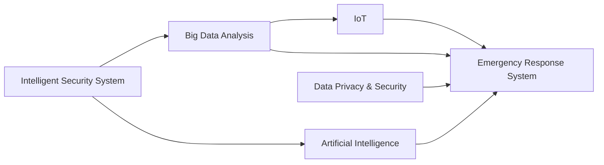

                 

# 未来的智能安防：2050年的反恐防暴与应急管理

## 1. 背景介绍

### 1.1 问题由来
随着科技的迅猛发展，未来的智能安防将更加智能化、一体化，涵盖城市管理、反恐防暴、应急响应等多个方面。与此同时，恐怖主义、自然灾害、公共卫生等威胁也日益加剧。如何在技术进步和挑战加剧的趋势下，构建高效、灵活、安全、智能的安防体系，成为全球科技界和政府机构亟待解决的问题。

### 1.2 问题核心关键点
未来的智能安防体系需要具备以下核心能力：

1. **实时监测与预警**：通过传感器、视频监控、无人机等多种手段，实现对城市、重要设施、人群等实时的全方位监控，并能在发现异常情况时快速发出预警。
2. **数据分析与决策支持**：利用大数据、人工智能等技术，对收集到的数据进行实时分析，为决策提供支持。
3. **应急响应与资源调度**：实现对突发事件的快速响应和资源调度，提升应急处置效率。
4. **跨部门协作与信息共享**：打破信息孤岛，实现各部门之间的数据共享与协同作战。
5. **数据隐私与安全**：确保监控数据的安全，保护个人隐私，防止数据滥用。

### 1.3 问题研究意义
构建未来的智能安防体系，对于提升社会治理效率、保障公共安全、推动经济社会发展具有重要意义：

1. **提升社会治理效率**：通过智能化手段，降低人工成本，提高决策效率，实现更有效的城市管理。
2. **保障公共安全**：实时监测和预警能力，能够在突发事件发生时迅速响应，降低损失，保护人民生命财产安全。
3. **推动经济社会发展**：智能安防体系有助于促进新兴产业的发展，如智慧城市、物联网等，带动经济增长。

## 2. 核心概念与联系

### 2.1 核心概念概述

为更好地理解未来智能安防体系的构建，本节将介绍几个关键概念：

- **智能安防系统**：基于物联网、人工智能等技术，实现对城市、设施、人群等实时的全方位监控、数据分析、预警和应急响应。
- **大数据分析**：通过对大规模数据进行收集、存储、处理和分析，实现对复杂问题的理解和决策支持。
- **人工智能**：利用机器学习、深度学习等技术，实现数据的自动化分析和智能决策。
- **物联网**：通过互联网将各类物理设备、传感器等连接起来，实现数据的实时采集和传输。
- **应急响应系统**：在突发事件发生时，实现快速响应、资源调度和指挥调度等功能。
- **数据隐私与安全**：保护个人隐私和数据安全，防止数据滥用和泄露。

这些核心概念之间相互联系，共同构成了未来智能安防体系的基础。通过理解这些概念，可以更好地把握智能安防的工作原理和优化方向。

### 2.2 核心概念原理和架构的 Mermaid 流程图



这个流程图展示了智能安防体系中各个核心概念之间的关系：

1. 智能安防系统通过物联网获取实时数据，并利用大数据分析和人工智能技术进行处理。
2. 人工智能模型和算法在数据分析的基础上，提供决策支持和预警。
3. 应急响应系统根据预警和数据信息，进行资源调度、指挥决策等操作。
4. 数据隐私与安全贯穿整个体系，确保数据安全和个人隐私保护。

这些概念共同构成了智能安防体系的框架，使得未来安防系统的构建更加科学和系统化。

## 3. 核心算法原理 & 具体操作步骤
### 3.1 算法原理概述

未来的智能安防体系将广泛应用人工智能技术，其中核心算法包括深度学习、强化学习、聚类分析、路径规划等。这些算法通过不断学习和优化，能够实现对复杂场景的实时分析与响应。

- **深度学习**：通过神经网络模型，对大量历史数据进行训练，构建特征提取和分类预测的模型。
- **强化学习**：利用奖励机制，训练智能体在特定环境中做出最优决策，提升应急响应和资源调度的效率。
- **聚类分析**：对数据进行聚类，发现相似的模式和异常情况，提升监测和预警能力。
- **路径规划**：利用图论算法，优化资源调度和应急队伍的移动路线，提升响应速度。

### 3.2 算法步骤详解

以下是未来智能安防体系中深度学习和强化学习的具体操作步骤：

#### 3.2.1 深度学习算法步骤

**Step 1: 数据预处理**
- 对采集到的数据进行清洗、归一化、特征提取等预处理操作。
- 利用数据增强技术，扩充训练集，防止过拟合。

**Step 2: 模型训练**
- 选择适合的深度学习模型，如卷积神经网络(CNN)、循环神经网络(RNN)、Transformer等。
- 在标注数据集上，使用反向传播算法训练模型。

**Step 3: 模型验证与调优**
- 在验证集上评估模型性能，根据评估结果调整模型参数，如学习率、批大小等。
- 使用正则化技术，如L2正则、Dropout等，防止过拟合。

**Step 4: 模型部署与应用**
- 将训练好的模型部署到服务器或边缘设备上。
- 实时接收数据，进行预测和分类，返回预警和处理建议。

#### 3.2.2 强化学习算法步骤

**Step 1: 定义环境与奖励函数**
- 构建模拟环境，如城市监控场景、交通道路等。
- 定义奖励函数，奖励智能体做出最优决策的行为。

**Step 2: 模型训练**
- 选择合适的强化学习算法，如Q-learning、SARSA等。
- 利用模拟环境，训练智能体在特定环境中做出最优决策。

**Step 3: 模型评估与优化**
- 在模拟环境中评估智能体的决策性能。
- 根据评估结果调整模型参数，如学习率、探索率等。

**Step 4: 实际应用**
- 将训练好的智能体应用到真实环境中，进行应急响应和资源调度。
- 实时收集反馈数据，持续优化智能体的决策策略。

### 3.3 算法优缺点

未来智能安防体系的算法主要具有以下优点：

1. **高效性与实时性**：深度学习和强化学习算法能够快速处理和分析大量数据，实现实时监测和预警。
2. **灵活性与适应性**：算法能够根据环境变化进行自我学习和优化，适应不同的安防场景。
3. **高精度与鲁棒性**：通过大规模数据训练，算法能够实现高精度的分类和决策，具有较好的鲁棒性。

同时，这些算法也存在一些局限性：

1. **数据依赖**：算法的性能很大程度上依赖于数据的质量和数量，难以在数据稀缺的情况下取得最佳效果。
2. **模型复杂性**：深度学习模型复杂，训练和推理计算量大，需要较高的计算资源。
3. **解释性不足**：算法的决策过程缺乏可解释性，难以理解其内部工作机制。
4. **安全性问题**：模型可能受到对抗样本攻击，导致错误决策。

未来需要在算法设计和实现上进一步优化，提升其性能和可靠性。

### 3.4 算法应用领域

未来的智能安防体系将在多个领域得到广泛应用，例如：

1. **城市监控与预警**：通过实时监测和分析，实现对城市安全和突发事件的快速响应。
2. **交通管理与调度**：利用路径规划和强化学习，优化交通流量和资源调度，提升交通管理效率。
3. **公共安全与反恐**：实现对恐怖活动和犯罪行为的实时监测和预警，提升应对能力。
4. **灾害响应与救援**：通过数据分析和决策支持，提升灾害应对和救援效率。
5. **医疗卫生与应急**：实现对疫情和突发卫生事件的实时监测和预警，提升医疗应急响应能力。

这些领域的应用将极大地提升智能安防体系的实际价值，推动社会治理和公共安全的进步。

## 4. 数学模型和公式 & 详细讲解

### 4.1 数学模型构建

在智能安防体系中，常见的数学模型包括深度学习模型和强化学习模型。这里以深度学习模型为例，构建一个简单的二分类分类器。

假设模型输入为 $x \in \mathbb{R}^n$，输出为 $y \in \{0, 1\}$。模型的目标是最小化交叉熵损失函数：

$$
\mathcal{L}(\theta) = -\frac{1}{N}\sum_{i=1}^N [y_i\log M_{\theta}(x_i)+(1-y_i)\log(1-M_{\theta}(x_i))]
$$

其中 $M_{\theta}(x_i)$ 为模型在输入 $x_i$ 上的输出概率。

### 4.2 公式推导过程

以最简单的单层感知机为例，推导其反向传播算法。

假设模型的输出为 $z = w^T x + b$，其中 $w$ 为权重向量，$b$ 为偏置项。模型的预测概率为 $M_{\theta}(x) = \sigma(z)$，其中 $\sigma$ 为激活函数，如sigmoid函数。

**Step 1: 前向传播**
- 计算输入 $x$ 通过模型的输出概率 $M_{\theta}(x)$。

**Step 2: 计算损失函数**
- 使用交叉熵损失函数，计算模型在每个样本上的损失 $\ell(x_i, y_i)$。

**Step 3: 反向传播**
- 计算损失函数对模型参数 $w, b$ 的梯度，更新参数。
- 利用链式法则，计算 $\frac{\partial \mathcal{L}(\theta)}{\partial w}$ 和 $\frac{\partial \mathcal{L}(\theta)}{\partial b}$。

**Step 4: 梯度更新**
- 使用优化算法，如随机梯度下降(SGD)，更新模型参数。

### 4.3 案例分析与讲解

以智能安防体系中的视频监控系统为例，推导其深度学习模型的构建与训练过程。

假设视频监控系统需要识别视频帧中的人脸，将其分为正面、侧面、背面三种类型。选取1000张正面人脸、500张侧面人脸和200张背面人脸的图像作为训练集，每个图像大小为64x64。

**Step 1: 数据预处理**
- 对图像进行归一化、缩放等预处理操作。
- 使用数据增强技术，扩充训练集。

**Step 2: 模型构建**
- 选择卷积神经网络(CNN)模型，包含卷积层、池化层、全连接层等。
- 定义损失函数为交叉熵损失，使用Adam优化算法进行训练。

**Step 3: 模型训练**
- 将训练集分为训练集、验证集和测试集。
- 在训练集上，使用反向传播算法训练模型。
- 在验证集上评估模型性能，调整学习率等参数。

**Step 4: 模型验证与调优**
- 在测试集上评估模型性能。
- 根据测试结果调整模型参数，如滤波器数量、卷积核大小等。

**Step 5: 模型部署与应用**
- 将训练好的模型部署到服务器上。
- 实时接收视频帧，进行人脸识别和分类。
- 返回分类结果，进行预警和处理。

## 5. 项目实践：代码实例和详细解释说明

### 5.1 开发环境搭建

在进行智能安防系统的开发前，我们需要准备好开发环境。以下是使用Python进行TensorFlow开发的示例环境配置：

1. 安装Anaconda：从官网下载并安装Anaconda，用于创建独立的Python环境。

2. 创建并激活虚拟环境：
```bash
conda create -n tf-env python=3.8 
conda activate tf-env
```

3. 安装TensorFlow：根据CUDA版本，从官网获取对应的安装命令。例如：
```bash
conda install tensorflow -c tf -c conda-forge
```

4. 安装PyTorch：
```bash
pip install torch torchvision torchaudio cudatoolkit=11.1 -c pytorch -c conda-forge
```

5. 安装各类工具包：
```bash
pip install numpy pandas scikit-learn matplotlib tqdm jupyter notebook ipython
```

完成上述步骤后，即可在`tf-env`环境中开始开发。

### 5.2 源代码详细实现

下面我们以智能安防系统中的视频监控系统为例，给出使用TensorFlow进行人脸识别的代码实现。

首先，定义数据处理函数：

```python
import tensorflow as tf
from tensorflow.keras import layers
from tensorflow.keras.preprocessing.image import ImageDataGenerator

def load_data(batch_size):
    train_datagen = ImageDataGenerator(rescale=1./255, shear_range=0.2, zoom_range=0.2, horizontal_flip=True)
    train_generator = train_datagen.flow_from_directory(
        'train/',
        target_size=(64, 64),
        batch_size=batch_size,
        class_mode='categorical')
    
    val_datagen = ImageDataGenerator(rescale=1./255)
    val_generator = val_datagen.flow_from_directory(
        'val/',
        target_size=(64, 64),
        batch_size=batch_size,
        class_mode='categorical')

    return train_generator, val_generator
```

然后，定义模型：

```python
model = tf.keras.Sequential([
    layers.Conv2D(32, (3, 3), activation='relu', input_shape=(64, 64, 3)),
    layers.MaxPooling2D((2, 2)),
    layers.Conv2D(64, (3, 3), activation='relu'),
    layers.MaxPooling2D((2, 2)),
    layers.Conv2D(128, (3, 3), activation='relu'),
    layers.MaxPooling2D((2, 2)),
    layers.Flatten(),
    layers.Dense(128, activation='relu'),
    layers.Dense(3, activation='softmax')
])
```

接着，定义训练和评估函数：

```python
def compile_model(model):
    model.compile(optimizer='adam', loss='categorical_crossentropy', metrics=['accuracy'])

def train_model(model, train_generator, val_generator, epochs=10, batch_size=32):
    model.fit(train_generator, epochs=epochs, validation_data=val_generator, batch_size=batch_size)

def evaluate_model(model, val_generator, batch_size=32):
    loss, accuracy = model.evaluate(val_generator, batch_size=batch_size)
    print(f'Validation Loss: {loss:.4f}')
    print(f'Validation Accuracy: {accuracy:.4f}')

# 加载数据
train_generator, val_generator = load_data(32)

# 编译模型
compile_model(model)

# 训练模型
train_model(model, train_generator, val_generator, epochs=10)

# 评估模型
evaluate_model(model, val_generator)
```

以上就是使用TensorFlow进行人脸识别的完整代码实现。可以看到，TensorFlow的高级API使得模型的定义和训练非常简洁高效。

### 5.3 代码解读与分析

让我们再详细解读一下关键代码的实现细节：

**load_data函数**：
- 使用ImageDataGenerator对图像进行预处理，如归一化、随机剪裁、随机翻转等。
- 使用flow_from_directory方法从指定目录加载图像数据，自动生成训练集和验证集的生成器。

**model Sequential**：
- 定义一个卷积神经网络模型，包含卷积层、池化层、全连接层等。
- 使用softmax激活函数输出三个类别的概率分布。

**compile_model函数**：
- 使用adam优化算法和交叉熵损失函数编译模型。
- 指定评估指标为准确率。

**train_model函数**：
- 使用fit方法在训练集上训练模型，指定验证集和批量大小。
- 在每个epoch后评估模型性能，记录验证集上的损失和准确率。

**evaluate_model函数**：
- 使用evaluate方法在验证集上评估模型性能，输出验证集上的损失和准确率。

通过这些代码，可以看到TensorFlow在构建深度学习模型的便捷性。利用其高效的前向传播和反向传播机制，可以快速实现人脸识别等安防应用。

## 6. 实际应用场景

### 6.1 智能监控系统

智能监控系统是智能安防体系的核心应用之一。通过部署高清摄像头、传感器等设备，实时监测公共场所、重要设施等，能够及时发现异常情况并发出预警。

在技术实现上，可以使用视频流、图像识别等技术，对视频帧进行实时分析，识别出异常行为，如可疑人员、物品等。一旦检测到异常，系统立即发出警报，并通知相关部门进行处理。

### 6.2 应急响应与救援

在突发事件发生时，智能安防系统能够迅速响应，并调集资源进行救援。通过与医院、消防队、警察等部门的协同作战，能够提高应急响应效率，减少人员伤亡和财产损失。

在技术实现上，可以使用路径规划和强化学习算法，优化应急资源的调度和移动路径，确保救援队伍能够尽快到达现场。同时，利用无人机、机器人等设备，进行现场勘查和救援操作，提升救援效果。

### 6.3 反恐防暴

反恐防暴是智能安防体系的重要任务之一。通过实时监测和预警，能够及时发现恐怖活动的苗头，并采取措施进行预防和应对。

在技术实现上，可以使用视频监控、语音识别等技术，对公共场所、重点区域进行实时监测，识别出可疑人物和行为。一旦检测到异常情况，系统立即发出警报，并通知安保人员进行拦截和处理。

### 6.4 未来应用展望

随着科技的进步，未来的智能安防体系将更加智能化、一体化，涵盖城市管理、反恐防暴、应急响应等多个方面。以下是未来的发展趋势：

1. **物联网技术的应用**：通过物联网技术，将各类传感器、摄像头等设备连接起来，实现实时数据采集和传输。物联网技术的发展，将进一步提升智能安防体系的监测和预警能力。

2. **大数据分析的应用**：通过大数据分析技术，对海量的安防数据进行深度挖掘和分析，提升决策支持能力。大数据技术的发展，将使得智能安防体系更加智能和高效。

3. **人工智能的应用**：利用深度学习、强化学习等技术，提升安防系统的智能决策能力。人工智能技术的发展，将使得智能安防体系更加灵活和适应性强。

4. **跨部门协作的应用**：打破信息孤岛，实现各部门的协同作战和信息共享，提升安防体系的整体响应能力。

5. **数据隐私与安全的应用**：通过数据加密、匿名化等技术，确保监控数据的安全和个人隐私的保护。数据隐私和安全技术的进步，将使得智能安防体系更加可靠和安全。

## 7. 工具和资源推荐

### 7.1 学习资源推荐

为了帮助开发者掌握智能安防技术，以下是一些优质的学习资源：

1. **《深度学习入门》系列课程**：由DeepLearning.AI组织，详细介绍了深度学习的基本概念和应用，适合初学者入门。

2. **TensorFlow官方文档**：TensorFlow的官方文档，提供了详尽的API文档和教程，适合开发者参考。

3. **《人工智能实践指南》书籍**：全面介绍了人工智能技术的实现方法和应用案例，适合进阶开发者。

4. **Kaggle平台**：Kaggle是一个数据科学竞赛平台，提供了大量的安防数据集和竞赛，适合开发者实践。

5. **开源项目OpenCV**：OpenCV是一个计算机视觉库，提供了丰富的图像处理和计算机视觉算法，适合开发者实现安防系统。

通过对这些资源的学习实践，相信你一定能够掌握智能安防技术，并用于解决实际问题。

### 7.2 开发工具推荐

智能安防系统的开发需要多学科的协同合作，以下是几款常用的开发工具：

1. **TensorFlow**：由Google开发的深度学习框架，提供了丰富的API和工具，适合深度学习模型开发。

2. **PyTorch**：由Facebook开发的深度学习框架，灵活性和扩展性强，适合科研和实验。

3. **OpenCV**：计算机视觉库，提供了丰富的图像处理和计算机视觉算法，适合实现安防系统的实时处理。

4. **Jupyter Notebook**：交互式的开发环境，适合进行数据预处理、模型训练和结果展示。

5. **Grafana**：数据可视化工具，适合展示安防系统中的实时数据和分析结果。

合理利用这些工具，可以显著提升智能安防系统的开发效率，加快创新迭代的步伐。

### 7.3 相关论文推荐

智能安防技术的发展离不开学界的持续研究。以下是几篇奠基性的相关论文，推荐阅读：

1. **《深度学习在城市安防中的应用》**：详细介绍了深度学习在城市安防系统中的应用，如视频监控、人脸识别等。

2. **《强化学习在应急响应中的应用》**：利用强化学习算法，优化应急资源调度和路径规划，提升应急响应效率。

3. **《基于物联网的城市安防系统》**：通过物联网技术，实现城市安防系统的全面覆盖和实时监控。

4. **《智能安防系统的数据隐私保护》**：讨论了智能安防系统中的数据隐私保护问题，提出了数据加密、匿名化等技术。

5. **《面向未来的智能安防体系》**：展望了未来智能安防体系的发展趋势，讨论了大数据、人工智能等技术的应用。

这些论文代表了智能安防技术的研究前沿，通过学习这些论文，可以帮助研究者把握学科发展方向，激发更多的创新灵感。

## 8. 总结：未来发展趋势与挑战

### 8.1 总结

本文对未来的智能安防体系进行了全面系统的介绍。首先阐述了智能安防技术的研究背景和意义，明确了未来智能安防体系的核心能力。其次，从原理到实践，详细讲解了深度学习、强化学习等核心算法的具体操作步骤，给出了代码实例和详细解释说明。同时，本文还广泛探讨了智能安防系统在多个行业领域的应用前景，展示了智能安防技术的巨大潜力。此外，本文还精选了智能安防技术的各类学习资源，力求为读者提供全方位的技术指引。

通过本文的系统梳理，可以看到，未来的智能安防体系将在多方面得到应用，为社会治理和公共安全带来深远影响。智能安防技术的发展，有望提升社会治理效率、保障公共安全、推动经济社会发展。

### 8.2 未来发展趋势

展望未来，智能安防技术将呈现以下几个发展趋势：

1. **智能化水平的提升**：利用深度学习、强化学习等技术，提升安防系统的智能化水平，实现实时监测、预警和应急响应。

2. **数据驱动的决策支持**：通过大数据分析技术，对海量安防数据进行深度挖掘和分析，提升决策支持能力。

3. **多模态信息整合**：利用物联网技术，整合视觉、听觉、传感器等多模态信息，提升安防系统的综合感知能力。

4. **跨部门协作**：打破信息孤岛，实现各部门的协同作战和信息共享，提升安防系统的整体响应能力。

5. **数据隐私和安全**：通过数据加密、匿名化等技术，确保监控数据的安全和个人隐私的保护。

这些趋势凸显了智能安防技术的广阔前景，将为社会治理和公共安全带来深远影响。

### 8.3 面临的挑战

尽管智能安防技术已经取得了显著成就，但在迈向更加智能化、普适化应用的过程中，它仍面临着诸多挑战：

1. **数据隐私问题**：安防系统中的数据隐私问题日益凸显，需要寻找数据存储和传输的安全解决方案。

2. **计算资源需求**：智能安防系统的计算需求高，需要高性能的硬件设备和云计算支持。

3. **模型鲁棒性不足**：安防模型面临对抗样本攻击和环境变化，需要提升模型的鲁棒性和泛化能力。

4. **跨部门协同问题**：各部门的信息共享和协同作战仍存在障碍，需要建立统一的安防数据标准和信息共享机制。

5. **法律法规限制**：智能安防系统的应用需要遵守法律法规，确保合法合规使用。

正视这些挑战，积极应对并寻求突破，将是大规模智能化安防体系实现的重要前提。

### 8.4 研究展望

面对智能安防技术所面临的挑战，未来的研究需要在以下几个方面寻求新的突破：

1. **数据隐私保护技术**：开发数据加密、匿名化等技术，确保安防数据的隐私和安全。

2. **高效计算技术**：开发高效的计算框架和算法，提升安防系统的计算效率和性能。

3. **模型鲁棒性提升**：引入对抗样本训练、鲁棒优化等技术，提升安防模型的鲁棒性和泛化能力。

4. **跨部门协作机制**：建立统一的数据标准和信息共享机制，实现各部门的协同作战。

5. **法律法规研究**：深入研究智能安防系统的法律法规，确保合法合规使用。

这些研究方向将推动智能安防技术的不断进步，为构建高效、灵活、安全的智能安防体系铺平道路。

## 9. 附录：常见问题与解答

**Q1: 智能安防系统如何保护数据隐私？**

A: 智能安防系统中的数据隐私保护主要通过以下几种方式实现：

1. **数据加密**：使用加密算法对数据进行加密存储和传输，防止数据泄露。

2. **匿名化处理**：对敏感数据进行脱敏和匿名化处理，避免个人隐私被滥用。

3. **访问控制**：设置严格的访问控制机制，只有授权用户才能访问敏感数据。

4. **数据匿名化**：通过差分隐私等技术，对数据进行匿名化处理，防止数据关联。

**Q2: 智能安防系统如何应对大规模计算需求？**

A: 智能安防系统的高计算需求可以通过以下方式应对：

1. **分布式计算**：利用云计算平台，将计算任务分配到多个节点并行计算，提升计算效率。

2. **模型优化**：采用模型压缩、量化加速等技术，优化模型结构和参数，减小计算资源需求。

3. **硬件加速**：使用GPU、TPU等高性能硬件设备，提升计算性能。

**Q3: 智能安防系统如何提升模型的鲁棒性？**

A: 智能安防系统的模型鲁棒性提升主要通过以下几种方式实现：

1. **对抗样本训练**：引入对抗样本训练，提高模型对噪声和攻击的鲁棒性。

2. **鲁棒优化**：使用鲁棒优化算法，提升模型的泛化能力和鲁棒性。

3. **多模型集成**：构建多个模型，并集成其输出，提升模型的鲁棒性。

4. **数据增强**：通过数据增强技术，扩充训练集，防止过拟合，提升模型的泛化能力。

**Q4: 智能安防系统如何实现跨部门协作？**

A: 智能安防系统的跨部门协作主要通过以下几种方式实现：

1. **统一数据标准**：制定统一的数据标准和格式，实现各部门数据的互操作性。

2. **信息共享机制**：建立信息共享机制，实现各部门之间的数据共享和协同作战。

3. **协同作战平台**：构建协同作战平台，实现各部门的统一指挥和调度。

4. **数据孤岛打通**：打通各部门的信息孤岛，实现数据的全面整合和共享。

**Q5: 智能安防系统如何合法合规使用？**

A: 智能安防系统的合法合规使用主要通过以下几种方式实现：

1. **法律法规遵守**：遵循相关的法律法规，确保安防系统的合法合规使用。

2. **隐私保护政策**：制定隐私保护政策，明确数据的收集、存储和使用范围。

3. **用户知情同意**：在数据收集和使用过程中，明确告知用户并获得用户同意。

4. **透明度和可解释性**：提升安防系统的透明度和可解释性，让用户理解和信任系统。

通过对这些问题的解答，可以更好地理解智能安防系统的实际应用和挑战，推动智能安防技术的不断进步。

---

作者：禅与计算机程序设计艺术 / Zen and the Art of Computer Programming

