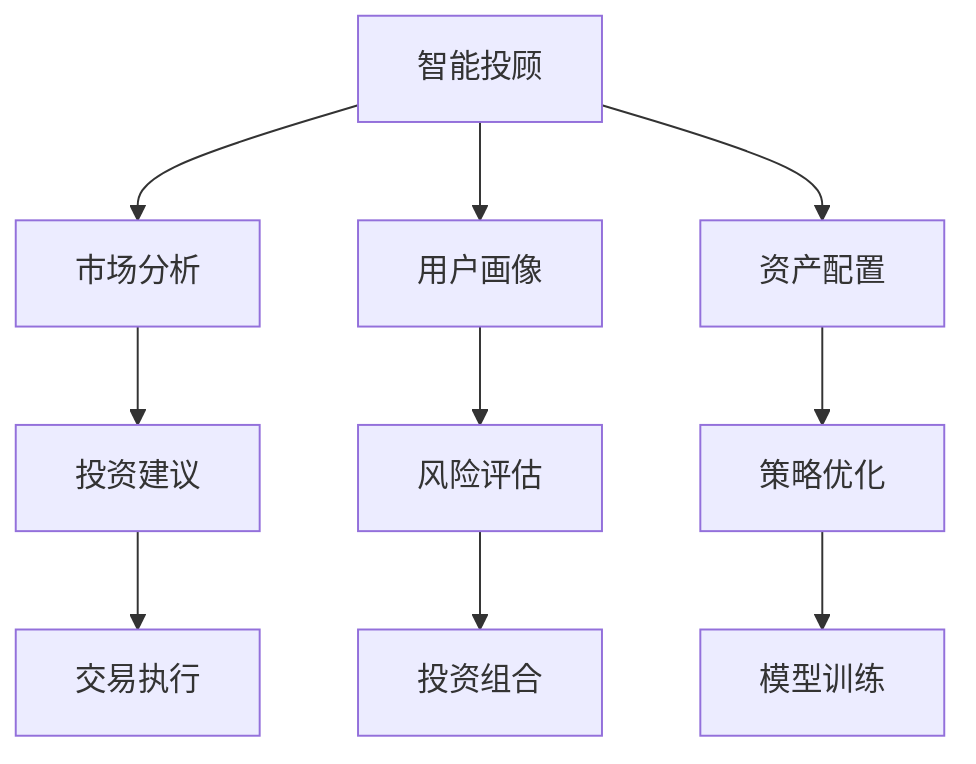

                 

# 未来的智能投资：2050年的智能投顾与资产配置

## 1. 背景介绍

随着人工智能技术的迅猛发展，未来的投资行业将迎来前所未有的变革。智能投顾与资产配置作为人工智能的重要应用，将深刻改变传统的投资方式，提升投资决策的效率和精准性。本文将详细探讨2050年智能投顾与资产配置的技术原理、实现方法、应用场景和未来趋势，以期为投资者和资产管理公司提供有价值的参考。

## 2. 核心概念与联系

### 2.1 核心概念概述

- **智能投顾**：利用人工智能技术，特别是机器学习和深度学习模型，为用户提供个性化的投资建议和资产配置策略。
- **资产配置**：根据投资者的风险偏好和收益目标，合理分配资产类别（如股票、债券、商品等），以优化投资组合的风险收益比。
- **强化学习**：一种通过试错过程优化策略的机器学习方法，特别适用于动态调整投资组合策略。
- **多臂老虎机模型**：一种常用的强化学习模型，用于模拟不同投资策略的回报和风险，指导资产配置决策。
- **非线性优化**：利用优化算法寻找非线性投资组合，以实现收益最大化或风险最小化。

### 2.2 核心概念原理和架构的 Mermaid 流程图



## 3. 核心算法原理 & 具体操作步骤

### 3.1 算法原理概述

智能投顾与资产配置的核心算法主要基于强化学习和优化理论。通过构建多臂老虎机模型，模拟不同投资策略的回报和风险，并通过强化学习不断优化策略，以适应市场的动态变化。同时，利用非线性优化算法，寻找最优的投资组合，以实现收益最大化或风险最小化。

### 3.2 算法步骤详解

#### 3.2.1 数据收集与预处理
- 收集历史市场数据、经济指标、行业动态等信息。
- 对数据进行清洗、归一化处理，以提高模型的准确性。

#### 3.2.2 用户画像构建
- 根据用户的风险偏好、收益目标、投资经验等，构建用户画像。
- 利用机器学习模型，如聚类分析，对用户进行分类，以制定个性化的投资策略。

#### 3.2.3 市场分析和策略制定
- 利用市场分析模型，如时间序列分析、情感分析等，对市场趋势进行预测。
- 结合用户画像，制定符合用户需求的多臂老虎机模型，以评估不同投资策略的回报和风险。

#### 3.2.4 策略优化与模型训练
- 利用强化学习算法，如Q-learning、Deep Q-learning等，对多臂老虎机模型进行优化，以最大化用户收益。
- 在优化过程中，不断训练模型，以适应市场的动态变化。

#### 3.2.5 资产配置与投资建议
- 根据多臂老虎机模型的输出，进行资产配置，优化投资组合。
- 生成个性化的投资建议，包括股票、债券、商品等资产类别的分配比例。

#### 3.2.6 交易执行与绩效评估
- 根据投资建议，执行交易操作。
- 定期评估投资组合的绩效，调整策略，以保持最优配置。

### 3.3 算法优缺点

#### 3.3.1 优点
- **个性化定制**：根据用户画像，提供个性化的投资建议和资产配置策略。
- **动态调整**：利用强化学习，动态优化投资策略，适应市场的变化。
- **高效率**：自动化的投资决策过程，减少人为干预，提高决策效率。

#### 3.3.2 缺点
- **模型依赖**：模型的性能依赖于历史数据的质量和数量，数据质量不佳可能导致模型失效。
- **复杂性**：算法实现复杂，需要专业的技术团队进行开发和维护。
- **不可解释性**：强化学习等算法通常被视为"黑盒"，模型的决策过程难以解释。

### 3.4 算法应用领域

智能投顾与资产配置技术已在以下领域得到广泛应用：

- **个人投资**：为个人投资者提供个性化的投资建议和资产配置。
- **企业理财**：为企业管理层制定财务决策和资产配置策略。
- **公共基金管理**：优化公共基金的投资组合，提高基金的收益和风险控制能力。
- **保险行业**：构建智能投顾，帮助保险客户优化投资组合，提升理财收益。

## 4. 数学模型和公式 & 详细讲解 & 举例说明

### 4.1 数学模型构建

基于多臂老虎机模型和强化学习的资产配置模型可以形式化表示为：

$$
\begin{aligned}
\pi(a_t|s_t) &= \frac{\exp(Q_t(a_t|s_t))}{\sum_{a \in \mathcal{A}} \exp(Q_t(a|s_t))} \\
Q_{t+1}(a|s_t) &= Q_t(a|s_t) + \alpha [r_t(a|s_t) + \gamma \max_{a' \in \mathcal{A}} Q_t(a'|s_{t+1}) - Q_t(a|s_t)]
\end{aligned}
$$

其中，$\pi(a_t|s_t)$ 表示在状态 $s_t$ 下采取行动 $a_t$ 的概率，$Q_t(a|s_t)$ 表示在状态 $s_t$ 下采取行动 $a$ 的累计回报估计，$\alpha$ 是学习率，$\gamma$ 是折扣因子。

### 4.2 公式推导过程

多臂老虎机模型可以看作是一个多维马尔可夫决策过程，其中每个臂代表一种投资策略，每个策略的回报是未知的，需要通过试错过程来估计。

- **状态转移**：状态 $s_t$ 表示当前市场和投资组合的状态，如市场指数、持仓比例等。
- **行动空间**：行动空间 $\mathcal{A}$ 表示可行的投资策略，如买入、卖出、持有等。
- **回报估计**：回报 $r_t(a|s_t)$ 表示采取行动 $a$ 在状态 $s_t$ 下获得的回报，通常包括市场涨跌幅和交易费用等。
- **累计回报估计**：累计回报估计 $Q_t(a|s_t)$ 表示在状态 $s_t$ 下采取行动 $a$ 的累计回报，可以通过蒙特卡洛模拟等方法估计。

通过公式推导，可以得到最优投资策略的概率分布 $\pi(a_t|s_t)$ 和累计回报估计的更新公式。

### 4.3 案例分析与讲解

以股票投资为例，假设有三个投资策略（买入、持有、卖出），每个策略的回报是未知的，且每个策略的回报概率分布是已知的。

- **初始状态**：市场指数为 $100$，持仓比例为 $50\%$。
- **行动选择**：根据多臂老虎机模型的输出，选择买入或卖出策略。
- **回报计算**：根据股票价格变化计算回报，更新累计回报估计 $Q_t$。
- **概率分布**：根据累计回报估计和回报概率分布，计算每个策略的概率分布 $\pi$。

通过多次迭代，模型可以动态调整策略，最大化用户收益。

## 5. 项目实践：代码实例和详细解释说明

### 5.1 开发环境搭建

- **Python**：选择 Python 3.x 版本，安装必要的库，如 NumPy、Pandas、TensorFlow 等。
- **数据集**：收集历史市场数据、经济指标、行业动态等，构建数据集。
- **机器学习框架**：选择 TensorFlow 或 PyTorch 进行模型训练和优化。

### 5.2 源代码详细实现

```python
import tensorflow as tf
import numpy as np
import pandas as pd

# 数据预处理
def preprocess_data(data):
    # 数据清洗
    data = data.dropna()
    # 归一化处理
    data = (data - data.mean()) / data.std()
    return data

# 多臂老虎机模型
class Bandit:
    def __init__(self, num_arms, learning_rate=0.1, discount_factor=0.9):
        self.num_arms = num_arms
        self.learning_rate = learning_rate
        self.discount_factor = discount_factor
        self.Q = np.zeros(num_arms)
        self.pi = np.zeros(num_arms)
    
    def choose_arm(self, state):
        # 选择行动概率
        pi = self.pi / np.sum(self.pi)
        # 随机选择行动
        arm = np.random.choice(self.num_arms, p=pi)
        return arm
    
    def update_q(self, state, arm, reward):
        # 更新累计回报估计
        self.Q[arm] += self.learning_rate * (reward + self.discount_factor * np.max(self.Q))
        # 更新概率分布
        self.pi[arm] = np.exp(self.Q[arm]) / np.sum(np.exp(self.Q))
    
# 训练多臂老虎机模型
def train_bandit(data, num_arms):
    # 数据预处理
    data = preprocess_data(data)
    # 创建多臂老虎机模型
    bandit = Bandit(num_arms)
    # 模拟训练过程
    for t in range(len(data)):
        state = data[t]
        arm = bandit.choose_arm(state)
        reward = data[t + 1]  # 假设回报为下一时刻的市场指数
        bandit.update_q(state, arm, reward)
    return bandit

# 测试多臂老虎机模型
def test_bandit(bandit, data):
    # 测试过程
    total_reward = 0
    for t in range(len(data)):
        state = data[t]
        arm = bandit.choose_arm(state)
        reward = data[t + 1]
        total_reward += reward
        bandit.update_q(state, arm, reward)
    return total_reward

# 主程序
if __name__ == "__main__":
    # 加载数据
    data = pd.read_csv('market_data.csv')
    # 训练多臂老虎机模型
    bandit = train_bandit(data, 3)
    # 测试模型性能
    test_reward = test_bandit(bandit, data)
    print(f"测试总回报：{test_reward}")
```

### 5.3 代码解读与分析

- **数据预处理**：通过清洗和归一化，确保数据的质量和一致性。
- **多臂老虎机模型**：定义模型的参数、选择行动和更新累计回报估计。
- **模型训练**：通过模拟训练过程，不断更新模型参数。
- **模型测试**：通过测试过程，评估模型的性能。

## 6. 实际应用场景

### 6.1 智能投顾

智能投顾可以通过多臂老虎机模型，动态调整投资策略，实现个性化的资产配置和投资建议。

#### 6.1.1 用户画像
- 收集用户的个人信息、投资经验、风险偏好等。
- 利用机器学习模型，如聚类分析，对用户进行分类。

#### 6.1.2 市场分析和策略制定
- 利用市场分析模型，如时间序列分析、情感分析等，对市场趋势进行预测。
- 结合用户画像，制定符合用户需求的多臂老虎机模型。

#### 6.1.3 投资建议和交易执行
- 根据多臂老虎机模型的输出，进行资产配置和投资建议。
- 自动执行交易操作，降低人为干预。

### 6.2 资产配置

资产配置通过优化算法，寻找最优的投资组合，以实现收益最大化或风险最小化。

#### 6.2.1 资产类别选择
- 选择不同的资产类别，如股票、债券、商品等。
- 通过多臂老虎机模型，评估不同策略的回报和风险。

#### 6.2.2 组合优化
- 利用非线性优化算法，如遗传算法、粒子群优化等，寻找最优的资产配置。
- 定期重新评估资产组合的绩效，调整策略。

#### 6.2.3 动态调整
- 利用强化学习算法，动态优化投资策略，适应市场的变化。
- 定期评估资产配置的绩效，调整组合。

### 6.3 未来应用展望

未来的智能投顾与资产配置技术将进一步融合区块链、物联网等新兴技术，提供更加智能和透明的服务。

- **区块链**：利用区块链技术，确保交易透明和安全。
- **物联网**：利用物联网设备，实时监测市场动态和用户行为。
- **大数据分析**：利用大数据技术，分析海量市场数据，提供更精准的投资建议。

## 7. 工具和资源推荐

### 7.1 学习资源推荐

- **TensorFlow官方文档**：提供详细的API文档和教程，帮助开发者快速上手。
- **Deep Q-learning in Python**：一本介绍深度强化学习的书籍，适合初学者学习。
- **Hands-On Machine Learning with Scikit-Learn、Keras、and TensorFlow**：一本实战型机器学习书籍，涵盖多个领域的机器学习应用。

### 7.2 开发工具推荐

- **Jupyter Notebook**：开源的交互式编程环境，适合数据探索和模型开发。
- **Git**：版本控制系统，方便代码版本管理和协作开发。
- **Keras**：高级神经网络API，简化深度学习模型的开发和调试。

### 7.3 相关论文推荐

- **"Deep Reinforcement Learning for Dynamic Portfolio Optimization"**：一篇关于深度强化学习在资产配置中的应用的论文。
- **"Multivariate GARCH and Multivariate Stochastic Volatility for Forecasting Commodity Price Indices"**：一篇关于多变量GARCH模型在资产配置中的应用研究。
- **"A Survey on Reinforcement Learning for Portfolio Selection"**：一篇关于强化学习在资产配置中的应用的综述论文。

## 8. 总结：未来发展趋势与挑战

### 8.1 研究成果总结

智能投顾与资产配置技术已经成为投资领域的重要工具，其应用范围和效果得到了广泛的认可。未来的研究将集中在以下几个方面：

- **算法优化**：改进强化学习和优化算法的效率和精度。
- **模型融合**：将多臂老虎机模型与其他机器学习模型融合，提高决策的准确性。
- **可解释性**：提高模型的可解释性，使投资者能够理解和信任模型的决策过程。

### 8.2 未来发展趋势

未来的智能投顾与资产配置技术将呈现出以下几个趋势：

- **个性化定制**：通过深度学习和大数据分析，提供更加个性化的投资建议和资产配置。
- **动态调整**：利用强化学习和大数据技术，动态调整投资策略，适应市场的变化。
- **跨领域融合**：将智能投顾与资产配置与其他技术融合，如区块链、物联网、大数据等。

### 8.3 面临的挑战

尽管智能投顾与资产配置技术在投资领域得到了广泛应用，但仍面临以下挑战：

- **数据隐私**：用户数据的隐私保护是一个重要问题，需要采取有效的措施保护用户信息。
- **模型鲁棒性**：模型在面对异常数据或新市场动态时，可能出现鲁棒性不足的问题。
- **算法复杂性**：算法实现复杂，需要专业的技术团队进行开发和维护。

### 8.4 研究展望

未来的研究需要在以下几个方面进行深入探讨：

- **隐私保护**：研究如何在保护用户隐私的前提下，利用大数据技术进行投资决策。
- **模型鲁棒性**：研究如何提高模型的鲁棒性和泛化能力，以应对市场动态的变化。
- **算法优化**：研究如何改进算法的效率和精度，降低计算资源消耗。

## 9. 附录：常见问题与解答

### Q1: 智能投顾与资产配置的主要应用场景有哪些？

A: 智能投顾与资产配置主要应用于以下几个场景：
- 个人投资：为个人投资者提供个性化的投资建议和资产配置。
- 企业理财：为企业管理层制定财务决策和资产配置策略。
- 公共基金管理：优化公共基金的投资组合，提高基金的收益和风险控制能力。
- 保险行业：构建智能投顾，帮助保险客户优化投资组合，提升理财收益。

### Q2: 如何评估智能投顾与资产配置模型的性能？

A: 评估智能投顾与资产配置模型的性能可以从以下几个方面入手：
- 收益率：评估模型在不同市场环境下的平均收益率。
- 风险控制：评估模型对投资组合风险的控制能力。
- 稳定性：评估模型在面对异常数据或市场动态时的鲁棒性。
- 用户满意度：通过用户反馈和调查问卷，评估模型的实际应用效果。

### Q3: 智能投顾与资产配置技术面临的主要挑战有哪些？

A: 智能投顾与资产配置技术面临的主要挑战包括：
- 数据隐私：用户数据的隐私保护是一个重要问题，需要采取有效的措施保护用户信息。
- 模型鲁棒性：模型在面对异常数据或新市场动态时，可能出现鲁棒性不足的问题。
- 算法复杂性：算法实现复杂，需要专业的技术团队进行开发和维护。

### Q4: 智能投顾与资产配置技术未来的发展趋势有哪些？

A: 智能投顾与资产配置技术未来的发展趋势包括：
- 个性化定制：通过深度学习和大数据分析，提供更加个性化的投资建议和资产配置。
- 动态调整：利用强化学习和大数据技术，动态调整投资策略，适应市场的变化。
- 跨领域融合：将智能投顾与资产配置与其他技术融合，如区块链、物联网、大数据等。

---

作者：禅与计算机程序设计艺术 / Zen and the Art of Computer Programming

