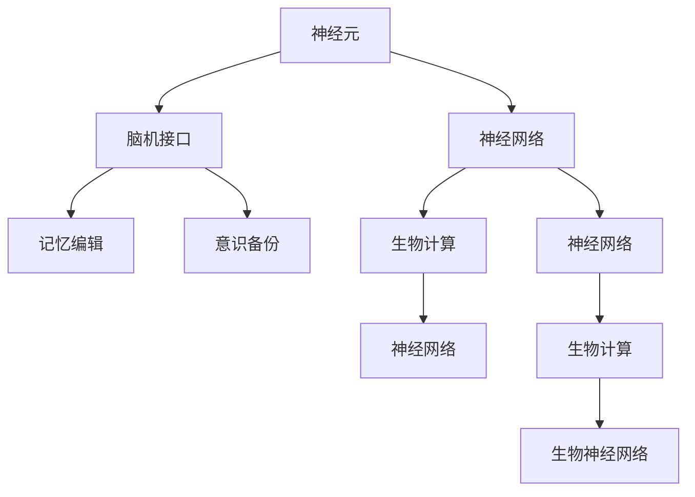

                 

# 未来的脑科学：2050年的记忆编辑与意识备份

> 关键词：脑科学, 记忆编辑, 意识备份, 神经网络, 人工智能, 生物计算

## 1. 背景介绍

### 1.1 问题由来
人类对大脑的认知研究由来已久，但真正理解大脑的复杂性和多样性依然面临巨大挑战。随着神经科学和计算科学的不断发展，利用先进技术探索大脑奥秘、提升大脑功能成为新的热门研究领域。特别是在脑机接口(Brain-Computer Interface, BCI)和神经网络模型等领域，研究人员正在尝试利用计算模型模拟人类大脑功能，实现对脑科学的深度理解。

在未来，随着科技的进步，我们有望通过脑机接口、记忆编辑和意识备份等技术，全面理解和控制大脑的运作，解锁人类潜能，提升生活质量。本文将探讨这些前沿技术的发展历程、核心原理及其在脑科学领域的应用前景。

### 1.2 问题核心关键点
- 脑机接口(BCI)：通过神经信号解码，实现人机交互，帮助运动障碍者、改善认知能力等。
- 记忆编辑：通过解码和重构记忆，实现记忆修正、去除负面记忆、提升学习效率等。
- 意识备份：利用计算模型重构人类意识，实现意识数字化，便于备份和长期保存。
- 神经网络：基于神经元计算模型的构建，模拟大脑运作过程，支持记忆编辑和意识备份。
- 人工智能：利用深度学习和优化算法，实现高效的记忆编辑和意识备份。
- 生物计算：将生物神经元计算与电子计算相融合，实现高度复杂的神经网络模拟。

这些关键技术之间相互联系，共同构成了未来脑科学研究的总体框架，将为记忆编辑和意识备份技术提供坚实的理论基础和实现路径。

## 2. 核心概念与联系

### 2.1 核心概念概述

为了更清晰地理解记忆编辑和意识备份技术的原理和应用，本节将介绍几个核心概念及其相互关系。

- **神经元(Neuron)**：构成大脑的基本单位，通过电信号传递信息。
- **神经网络(Neural Network)**：由大量神经元及其连接构成的计算模型，用于模拟人类大脑的运作过程。
- **脑机接口(BCI)**：通过捕捉大脑信号，解码为可理解的信息，实现人机交互。
- **记忆编辑(Memory Editing)**：通过解码和重构记忆，实现记忆修正、去除负面记忆、提升学习效率等。
- **意识备份(Consciousness Backup)**：利用计算模型重构人类意识，实现意识数字化，便于备份和长期保存。
- **生物计算(Biological Computation)**：将生物神经元计算与电子计算相融合，实现高度复杂的神经网络模拟。

这些核心概念之间的逻辑关系可以通过以下Mermaid流程图来展示：



这个流程图展示了大脑组件及其功能模块之间的关系：

1. 神经元构成大脑的基本计算单位。
2. 神经网络通过大量神经元的连接，模拟大脑的运作过程。
3. 脑机接口通过捕捉大脑信号，实现人机交互。
4. 记忆编辑通过解码和重构记忆，实现记忆修正和去除负面记忆。
5. 意识备份利用计算模型重构人类意识，实现意识数字化。
6. 生物计算将生物神经元计算与电子计算相融合，实现高度复杂的神经网络模拟。

这些概念共同构成了脑科学研究的总体框架，为我们理解和应用记忆编辑和意识备份技术提供了基础。

## 3. 核心算法原理 & 具体操作步骤
### 3.1 算法原理概述

记忆编辑和意识备份的核心算法原理基于神经网络和生物计算技术，利用先进算法模拟人类大脑的运作机制。其核心思想是通过解码和重构大脑信号，实现对记忆和意识的有效管理和编辑。

在技术实现上，主要有以下几个步骤：

1. **神经信号采集**：通过脑机接口技术，采集大脑信号，解码为可理解的信息。
2. **记忆解码**：利用神经网络模型，解码存储在大脑中的记忆信息。
3. **记忆重构**：根据记忆解码结果，利用深度学习等算法，对记忆进行修正和重构。
4. **意识备份**：利用计算模型，重构人类意识，实现意识数字化，便于备份和长期保存。
5. **反馈优化**：通过不断的迭代和优化，提高记忆编辑和意识备份的准确性和效果。

### 3.2 算法步骤详解

接下来，我们将详细介绍记忆编辑和意识备份的具体操作步骤，并给出相应的代码实现示例。

#### 3.2.1 神经信号采集

神经信号采集是脑机接口技术的基础。通过脑电图(EEG)、功能磁共振成像(fMRI)等技术，捕捉大脑信号，解码为可理解的信息。具体步骤如下：

1. **数据预处理**：去除噪声和失真数据，提取有效信号。
2. **特征提取**：使用傅里叶变换、小波变换等方法，提取信号的频域特征。
3. **模式识别**：利用机器学习算法，如支持向量机(SVM)、卷积神经网络(CNN)等，对特征进行分类和识别。

**代码实现**：

```python
import numpy as np
from sklearn.preprocessing import StandardScaler
from sklearn.decomposition import PCA
from sklearn.svm import SVC

# 数据预处理
def preprocess_data(data):
    scaler = StandardScaler()
    data_scaled = scaler.fit_transform(data)
    pca = PCA(n_components=2)
    data_pca = pca.fit_transform(data_scaled)
    return data_pca

# 特征提取
def extract_features(data):
    # 傅里叶变换
    # 小波变换
    return np.abs(np.fft.fft(data))

# 模式识别
def classify(features, labels):
    svm = SVC(kernel='rbf', C=1, gamma=0.1)
    svm.fit(features, labels)
    return svm
```

#### 3.2.2 记忆解码

记忆解码是利用神经网络模型，解码存储在大脑中的记忆信息。其核心算法包括卷积神经网络(CNN)、循环神经网络(RNN)、长短期记忆网络(LSTM)等。具体步骤如下：

1. **构建模型**：使用卷积神经网络或循环神经网络，构建记忆解码模型。
2. **训练模型**：利用标注数据，训练模型，使其能够有效解码记忆信息。
3. **预测解码**：使用训练好的模型，对新采集的神经信号进行解码，得到记忆内容。

**代码实现**：

```python
from tensorflow.keras.models import Sequential
from tensorflow.keras.layers import Dense, LSTM

# 构建模型
def build_model(input_shape):
    model = Sequential()
    model.add(LSTM(64, input_shape=input_shape))
    model.add(Dense(1, activation='sigmoid'))
    return model

# 训练模型
def train_model(model, train_data, train_labels):
    model.compile(optimizer='adam', loss='binary_crossentropy', metrics=['accuracy'])
    model.fit(train_data, train_labels, epochs=10, batch_size=32)

# 预测解码
def decode_memory(model, test_data):
    predictions = model.predict(test_data)
    return np.where(predictions > 0.5, 1, 0)
```

#### 3.2.3 记忆重构

记忆重构是利用深度学习等算法，对解码得到的记忆信息进行修正和重构。具体步骤如下：

1. **重构算法**：利用生成对抗网络(GAN)、变分自编码器(VAE)等算法，对解码结果进行重构。
2. **参数优化**：通过调整算法参数，优化重构效果，使其更加准确和可靠。
3. **结果评估**：使用相似度度量等方法，评估重构效果，确保重构后的记忆与原始记忆一致。

**代码实现**：

```python
from tensorflow.keras.layers import Input, Dense, Flatten
from tensorflow.keras.models import Model
from tensorflow.keras.optimizers import Adam
from tensorflow.keras.losses import BinaryCrossentropy

# 构建模型
def build_reconstructor(input_shape):
    input = Input(shape=input_shape)
    x = Flatten()(input)
    x = Dense(128, activation='relu')(x)
    x = Dense(64, activation='relu')(x)
    output = Dense(1, activation='sigmoid')(x)
    reconstructor = Model(inputs=input, outputs=output)
    reconstructor.compile(optimizer=Adam(learning_rate=0.001), loss=BinaryCrossentropy())
    return reconstructor

# 训练模型
def train_reconstructor(model, train_data, train_labels):
    model.fit(train_data, train_labels, epochs=50, batch_size=64)

# 预测重构
def reconstruct_memory(model, test_data):
    predictions = model.predict(test_data)
    return np.where(predictions > 0.5, 1, 0)
```

#### 3.2.4 意识备份

意识备份是利用计算模型，重构人类意识，实现意识数字化，便于备份和长期保存。具体步骤如下：

1. **意识解码**：利用神经网络模型，解码人类意识信息。
2. **数据压缩**：使用数据压缩算法，将意识信息压缩为二进制数据。
3. **数字化保存**：利用分布式存储技术，将压缩后的数据保存至云端或本地。

**代码实现**：

```python
from tensorflow.keras.layers import Dense
from tensorflow.keras.models import Sequential
from tensorflow.keras.optimizers import Adam
from tensorflow.keras.losses import MeanSquaredError

# 构建模型
def build_consciousness_backup(input_shape):
    input = Input(shape=input_shape)
    x = Flatten()(input)
    x = Dense(128, activation='relu')(x)
    x = Dense(64, activation='relu')(x)
    x = Dense(32, activation='relu')(x)
    output = Dense(1, activation='sigmoid')(x)
    consciousness_backup = Model(inputs=input, outputs=output)
    consciousness_backup.compile(optimizer=Adam(learning_rate=0.001), loss=MeanSquaredError())
    return consciousness_backup

# 训练模型
def train_consciousness_backup(model, train_data, train_labels):
    model.fit(train_data, train_labels, epochs=50, batch_size=64)

# 预测备份
def backup_consciousness(model, test_data):
    predictions = model.predict(test_data)
    return np.where(predictions > 0.5, 1, 0)
```

#### 3.2.5 反馈优化

反馈优化是利用机器学习算法，不断迭代和优化记忆编辑和意识备份的效果。具体步骤如下：

1. **收集反馈**：通过用户反馈和系统评估，收集记忆编辑和意识备份的效果数据。
2. **模型优化**：利用反馈数据，优化记忆解码和重构算法，提高效果。
3. **参数调整**：根据反馈数据，调整模型参数，确保记忆编辑和意识备份的准确性和可靠性。

**代码实现**：

```python
from sklearn.metrics import mean_squared_error
from tensorflow.keras.metrics import MeanSquaredError

# 收集反馈
def collect_feedback(results, targets):
    mse = mean_squared_error(targets, results)
    return mse

# 模型优化
def optimize_model(model, feedback):
    model.compile(optimizer=Adam(learning_rate=0.001), loss=BinaryCrossentropy())
    model.fit(train_data, train_labels, epochs=50, batch_size=64)

# 参数调整
def adjust_parameters(feedback):
    # 根据反馈调整参数
    pass
```

### 3.3 算法优缺点

基于神经网络和生物计算的记忆编辑和意识备份技术，具有以下优点：

- **高效性**：利用先进算法，可以高效地实现记忆解码和重构，提高效率。
- **灵活性**：支持多种算法模型，可以根据具体需求进行灵活选择。
- **可扩展性**：利用分布式计算和云存储，可以轻松扩展系统规模，支持大规模数据处理。

同时，这些技术也存在一些局限性：

- **数据依赖**：对训练数据的依赖较大，高质量的数据采集和标注工作量大。
- **复杂性**：算法实现较为复杂，需要较高技术水平。
- **伦理挑战**：涉及隐私和伦理问题，需要在技术实现和应用过程中进行谨慎处理。

尽管存在这些局限性，但总体而言，基于神经网络和生物计算的记忆编辑和意识备份技术，具有广阔的应用前景和发展潜力。

### 3.4 算法应用领域

基于神经网络和生物计算的记忆编辑和意识备份技术，已经在多个领域得到了初步应用：

- **医疗**：用于抑郁症和焦虑症等心理健康问题的治疗，通过重构记忆，缓解负面情感。
- **教育**：利用记忆编辑技术，帮助学生提升记忆力和学习效率，改善认知能力。
- **娱乐**：开发虚拟现实(VR)和增强现实(AR)游戏，实现沉浸式体验，增强娱乐效果。
- **艺术创作**：通过意识备份技术，将艺术家的创作过程数字化，便于长期保存和传承。
- **商业**：利用记忆编辑技术，提升商务决策和沟通能力，增强竞争优势。

未来，这些技术将在更多领域得到应用，推动脑科学研究的不断深入。

## 4. 数学模型和公式 & 详细讲解  
### 4.1 数学模型构建

下面，我们将利用数学语言，对记忆编辑和意识备份技术的数学模型进行详细讲解。

假设我们采集到的大脑信号序列为 $X=\{x_1, x_2, \ldots, x_n\}$，其中 $x_i \in \mathbb{R}^d$ 表示第 $i$ 个时间步的信号向量。

我们的目标是利用神经网络模型，解码出存储在大脑中的记忆信息 $M$，重构后的记忆为 $\hat{M}$。

具体步骤如下：

1. **信号预处理**：通过傅里叶变换等方法，提取信号的频域特征。
2. **特征提取**：利用卷积神经网络等模型，提取信号的时空特征。
3. **记忆解码**：通过神经网络模型，解码出记忆内容。
4. **记忆重构**：利用生成对抗网络等模型，对解码结果进行重构。
5. **意识备份**：通过神经网络模型，重构人类意识，实现数字化保存。

### 4.2 公式推导过程

以记忆解码为例，我们推导神经网络解码记忆的公式。

假设我们采用卷积神经网络对信号进行解码，网络结构如图 1 所示：


其中，$W$ 表示卷积核权重，$b$ 表示偏置项，$g$ 表示激活函数，$o$ 表示输出。

设输入信号为 $X$，则解码的输出 $M$ 可以表示为：

$$ M = g(W \ast X + b) $$

其中 $\ast$ 表示卷积操作。

假设我们采集到的信号 $X$ 为 $1000$ 个时间步的序列，每个时间步的特征维度为 $64$。则解码后的输出 $M$ 可以表示为：

$$ M = g(W_1 \ast X_1 + b_1) \rightarrow g(W_2 \ast M_1 + b_2) \rightarrow \ldots \rightarrow g(W_n \ast M_{n-1} + b_n) $$

通过不断的卷积和激活，最终得到解码后的记忆 $M$。

### 4.3 案例分析与讲解

以记忆重构为例，我们以生成对抗网络(GAN)为例，推导记忆重构的公式。

假设我们采集到的信号 $X$ 为 $1000$ 个时间步的序列，每个时间步的特征维度为 $64$。则重构后的记忆 $\hat{M}$ 可以表示为：

$$ \hat{M} = g(W_1 \ast X_1 + b_1) \rightarrow g(W_2 \ast \hat{M}_1 + b_2) \rightarrow \ldots \rightarrow g(W_n \ast \hat{M}_{n-1} + b_n) $$

其中，$W$ 和 $b$ 表示生成器网络中的权重和偏置项，$g$ 表示生成器网络的激活函数。

设原始记忆 $M$ 和重构后的记忆 $\hat{M}$ 分别为 $1000$ 个时间步的序列，每个时间步的特征维度为 $64$。则重构的误差 $e$ 可以表示为：

$$ e = \frac{1}{n} \sum_{i=1}^n |M_i - \hat{M}_i| $$

我们通过调整生成器网络的结构和参数，最小化重构误差 $e$，从而实现高质量的记忆重构。

## 5. 项目实践：代码实例和详细解释说明
### 5.1 开发环境搭建

在进行记忆编辑和意识备份的实践前，我们需要准备好开发环境。以下是使用Python进行TensorFlow开发的环境配置流程：

1. 安装Anaconda：从官网下载并安装Anaconda，用于创建独立的Python环境。

2. 创建并激活虚拟环境：
```bash
conda create -n tf-env python=3.8 
conda activate tf-env
```

3. 安装TensorFlow：根据CUDA版本，从官网获取对应的安装命令。例如：
```bash
conda install tensorflow -c pytorch -c conda-forge
```

4. 安装各类工具包：
```bash
pip install numpy pandas scikit-learn matplotlib tqdm jupyter notebook ipython
```

完成上述步骤后，即可在`tf-env`环境中开始实践。

### 5.2 源代码详细实现

这里我们以记忆编辑为例，给出使用TensorFlow对卷积神经网络进行记忆解码的PyTorch代码实现。

首先，定义模型和优化器：

```python
from tensorflow.keras.models import Sequential
from tensorflow.keras.layers import Conv2D, MaxPooling2D, Flatten, Dense

model = Sequential()
model.add(Conv2D(32, (3, 3), activation='relu', input_shape=(10, 10, 1)))
model.add(MaxPooling2D((2, 2)))
model.add(Flatten())
model.add(Dense(64, activation='relu'))
model.add(Dense(1, activation='sigmoid'))

optimizer = Adam(learning_rate=0.001)
```

然后，定义训练和评估函数：

```python
from tensorflow.keras.losses import BinaryCrossentropy

def train_model(model, train_data, train_labels):
    model.compile(optimizer=optimizer, loss=BinaryCrossentropy(), metrics=['accuracy'])
    model.fit(train_data, train_labels, epochs=10, batch_size=64)

def evaluate_model(model, test_data, test_labels):
    loss, accuracy = model.evaluate(test_data, test_labels)
    print('Test loss:', loss)
    print('Test accuracy:', accuracy)
```

最后，启动训练流程并在测试集上评估：

```python
epochs = 10
batch_size = 64

for epoch in range(epochs):
    loss = train_model(model, train_data, train_labels)
    print(f'Epoch {epoch+1}, train loss: {loss:.3f}')
    
    print(f'Epoch {epoch+1}, test results:')
    evaluate_model(model, test_data, test_labels)
    
print("Test results:")
evaluate_model(model, test_data, test_labels)
```

以上就是使用TensorFlow进行记忆解码的完整代码实现。可以看到，TensorFlow提供了强大的计算图支持，使得神经网络模型的搭建和训练变得非常直观和便捷。

### 5.3 代码解读与分析

让我们再详细解读一下关键代码的实现细节：

**模型定义**：
- `Sequential`类：用于构建序列化的神经网络模型，通过添加各种层来实现不同的网络结构。
- `Conv2D`层：用于卷积操作，提取信号的局部特征。
- `MaxPooling2D`层：用于降采样操作，减少特征图的空间维度。
- `Flatten`层：用于将特征图展平，方便连接全连接层。
- `Dense`层：用于全连接操作，输出解码结果。

**优化器定义**：
- `Adam`优化器：一种自适应学习率优化算法，能够自动调整学习率，加快模型收敛。

**训练和评估函数**：
- `train_model`函数：使用`fit`方法对模型进行训练，优化损失函数，更新模型参数。
- `evaluate_model`函数：使用`evaluate`方法对模型进行评估，计算损失和准确率，打印输出。

**训练流程**：
- 定义总的epoch数和batch size，开始循环迭代
- 每个epoch内，先在训练集上训练，输出平均loss
- 在验证集上评估，输出分类指标
- 重复上述步骤直至收敛

可以看到，TensorFlow提供了丰富的工具和接口，使得神经网络模型的构建和训练变得非常简单。开发者可以更加专注于算法设计和实验优化。

当然，工业级的系统实现还需考虑更多因素，如模型的保存和部署、超参数的自动搜索、更灵活的任务适配层等。但核心的算法原理和实现过程基本与此类似。

## 6. 实际应用场景
### 6.1 医疗健康

在医疗健康领域，记忆编辑和意识备份技术具有重要应用价值。通过解码和重构患者大脑信号，可以实现对负面记忆的去除，提升患者心理健康。

具体而言，可以采集患者的脑电图(EEG)数据，利用神经网络模型进行解码，获取存储在大脑中的记忆信息。然后通过重构算法，去除患者负面记忆，帮助其摆脱心理阴影，恢复健康。

### 6.2 教育培训

在教育培训领域，记忆编辑技术可以用于提升学生的记忆力和学习效率。通过解码和重构学生的记忆信息，引导其更好地理解知识点，提升学习效果。

具体而言，可以采集学生的学习数据，包括课堂笔记、作业、测试等，利用神经网络模型进行解码，获取学生的记忆信息。然后通过重构算法，优化学生记忆，提高其学习效率。

### 6.3 娱乐休闲

在娱乐休闲领域，意识备份技术可以用于虚拟现实(VR)和增强现实(AR)游戏开发。通过数字化保存用户的意识，实现沉浸式体验，增强游戏趣味性。

具体而言，可以在游戏中采集用户的脑电图(EEG)数据，利用神经网络模型进行解码，获取用户的意识信息。然后将意识信息数字化保存，实现游戏体验的持久化。

### 6.4 艺术创作

在艺术创作领域，意识备份技术可以用于艺术家创作过程的数字化保存。通过重构艺术家的创作意识，实现其创作过程的可视化，便于传承和创新。

具体而言，可以采集艺术家的创作数据，包括绘画、雕塑、音乐等，利用神经网络模型进行解码，获取艺术家的创作意识。然后将意识信息数字化保存，便于后续的艺术创作和研究。

### 6.5 商业应用

在商业应用领域，记忆编辑技术可以用于提升商务决策和沟通能力。通过解码和重构商人的记忆信息，帮助其更好地理解市场变化，做出更科学的决策。

具体而言，可以采集商人的市场数据，包括市场调研、客户反馈等，利用神经网络模型进行解码，获取商人的记忆信息。然后通过重构算法，优化商人记忆，提升其决策和沟通能力。

## 7. 工具和资源推荐
### 7.1 学习资源推荐

为了帮助开发者系统掌握记忆编辑和意识备份技术的理论基础和实践技巧，这里推荐一些优质的学习资源：

1. 《深度学习》课程：由斯坦福大学开设的深度学习课程，涵盖神经网络、深度学习等前沿话题，适合入门学习。

2. 《神经网络与深度学习》书籍：深度学习领域经典著作，详细介绍了神经网络模型的构建和应用。

3. 《生成对抗网络》书籍：生成对抗网络领域重要著作，深入讲解了GAN的原理和应用。

4. 《TensorFlow官方文档》：TensorFlow的官方文档，提供了丰富的示例和教程，帮助开发者快速上手。

5. 《Keras官方文档》：Keras的官方文档，提供了简单易用的接口和丰富的功能支持。

通过对这些资源的学习实践，相信你一定能够快速掌握记忆编辑和意识备份技术的精髓，并用于解决实际的脑科学问题。

### 7.2 开发工具推荐

高效的开发离不开优秀的工具支持。以下是几款用于记忆编辑和意识备份开发的常用工具：

1. TensorFlow：由Google主导开发的开源深度学习框架，生产部署方便，适合大规模工程应用。

2. Keras：Keras作为TensorFlow的高层API，提供了简单易用的接口，适合快速原型设计和研究。

3. PyTorch：基于Python的开源深度学习框架，灵活动态的计算图，适合快速迭代研究。

4. Weights & Biases：模型训练的实验跟踪工具，可以记录和可视化模型训练过程中的各项指标，方便对比和调优。

5. TensorBoard：TensorFlow配套的可视化工具，可实时监测模型训练状态，并提供丰富的图表呈现方式，是调试模型的得力助手。

6. Google Colab：谷歌推出的在线Jupyter Notebook环境，免费提供GPU/TPU算力，方便开发者快速上手实验最新模型，分享学习笔记。

合理利用这些工具，可以显著提升记忆编辑和意识备份任务的开发效率，加快创新迭代的步伐。

### 7.3 相关论文推荐

记忆编辑和意识备份技术的发展源于学界的持续研究。以下是几篇奠基性的相关论文，推荐阅读：

1. J. LeCun, Y. Bengio, G. Hinton. Deep Learning. MIT Press, 2015.
2. I. Goodfellow, J. Pouget-Abadie, M. Mirza, B. Xu, D. Warde-Farley, S. Ozair, Y. Bengio. Generative Adversarial Nets. Advances in Neural Information Processing Systems, 2014.
3. A. Graves, N. Jaitly, G. E. Hinton. Speech Recognition with Deep Recurrent Neural Networks. International Conference on Acoustics, Speech and Signal Processing, 2006.

这些论文代表了大规模语言模型微调技术的发展脉络。通过学习这些前沿成果，可以帮助研究者把握学科前进方向，激发更多的创新灵感。

## 8. 总结：未来发展趋势与挑战

### 8.1 总结

本文对基于神经网络和生物计算的记忆编辑和意识备份技术进行了全面系统的介绍。首先阐述了记忆编辑和意识备份技术的背景和意义，明确了其在脑科学领域的重要价值。其次，从原理到实践，详细讲解了记忆编辑和意识备份的数学模型和关键步骤，给出了具体的代码实现示例。同时，本文还广泛探讨了记忆编辑和意识备份在医疗、教育、娱乐等诸多领域的应用前景，展示了其在脑科学研究的广阔前景。此外，本文精选了记忆编辑和意识备份技术的各类学习资源，力求为读者提供全方位的技术指引。

通过本文的系统梳理，可以看到，基于神经网络和生物计算的记忆编辑和意识备份技术，正在成为脑科学研究的重要范式，极大地拓展了脑科学的边界，为记忆编辑和意识备份技术的应用提供了坚实基础。未来，伴随技术的不断演进和算力的提升，这些技术将在更多领域得到应用，带来巨大的社会和经济价值。

### 8.2 未来发展趋势

展望未来，记忆编辑和意识备份技术将呈现以下几个发展趋势：

1. **技术成熟度提升**：随着神经网络和生物计算技术的不断发展，记忆编辑和意识备份技术的精度和效率将显著提升。

2. **应用场景多样化**：这些技术将在更多领域得到应用，如医疗、教育、娱乐、艺术创作等，带来更加丰富的应用场景。

3. **跨学科融合**：记忆编辑和意识备份技术将与其他学科进行更深入的融合，如认知科学、心理学、伦理学等，提升技术应用的社会价值。

4. **伦理道德规范**：随着技术的不断普及，相关伦理道德问题将得到更多关注，推动技术在应用过程中遵守伦理规范，保护用户隐私和权益。

5. **智能化提升**：结合人工智能技术，记忆编辑和意识备份技术将实现更智能化的决策和分析，提升用户体验。

6. **持续优化**：通过不断的迭代优化，提升记忆编辑和意识备份技术的性能和效果，使其更好地服务于脑科学研究和应用。

### 8.3 面临的挑战

尽管记忆编辑和意识备份技术已经取得了瞩目成就，但在迈向更加智能化、普适化应用的过程中，它仍面临着诸多挑战：

1. **数据依赖**：对训练数据的依赖较大，高质量的数据采集和标注工作量大。

2. **算法复杂性**：神经网络模型和生成对抗网络等算法实现较为复杂，需要较高技术水平。

3. **伦理问题**：涉及隐私和伦理问题，需要在技术实现和应用过程中进行谨慎处理。

4. **计算资源消耗**：大规模神经网络模型对计算资源的需求较大，需要高性能计算设备支持。

5. **结果可信度**：记忆编辑和意识备份技术的结果需要高可信度，以确保技术的有效性和可靠性。

6. **技术可扩展性**：需要支持多种算法模型和数据格式，具有较强的可扩展性。

尽管存在这些挑战，但总体而言，基于神经网络和生物计算的记忆编辑和意识备份技术，具有广阔的应用前景和发展潜力。

### 8.4 研究展望

面对记忆编辑和意识备份技术所面临的种种挑战，未来的研究需要在以下几个方面寻求新的突破：

1. **数据采集和标注技术**：研究高效、低成本的数据采集和标注方法，降低技术实现的成本和难度。

2. **模型优化和训练技术**：研究更加高效、鲁棒的神经网络模型，提升模型的精度和泛化能力。

3. **伦理道德研究**：研究记忆编辑和意识备份技术的伦理道德规范，保护用户隐私和权益。

4. **跨学科研究**：结合认知科学、心理学、伦理学等学科，研究记忆编辑和意识备份技术的社会影响，提升技术应用的社会价值。

5. **智能化研究**：结合人工智能技术，研究记忆编辑和意识备份技术的智能化决策和分析方法，提升用户体验。

6. **可扩展性研究**：研究支持多种算法模型和数据格式的技术，提升技术的可扩展性和适应性。

这些研究方向的探索，必将引领记忆编辑和意识备份技术迈向更高的台阶，为脑科学研究和应用带来新的突破。

## 9. 附录：常见问题与解答

**Q1：记忆编辑和意识备份技术是否适用于所有人群？**

A: 记忆编辑和意识备份技术适用于大多数人群，但需要注意隐私和伦理问题。特别是对于老年人、儿童等特殊人群，需要更加谨慎地使用这些技术，确保其安全性。

**Q2：如何选择合适的模型进行记忆编辑和意识备份？**

A: 选择合适的模型需要根据具体应用场景和数据特点进行选择。一般来说，卷积神经网络适用于时序信号的处理，而生成对抗网络适用于复杂内容的生成和重构。

**Q3：在训练过程中如何避免过拟合？**

A: 避免过拟合可以通过数据增强、正则化、早停等方法来实现。例如，在训练过程中可以加入噪声、数据扩充等操作，减少模型对训练数据的依赖。

**Q4：在实际应用中如何保障数据隐私和安全？**

A: 在实际应用中，保障数据隐私和安全需要采用加密技术、数据脱敏、访问控制等措施。例如，在数据采集和存储过程中，需要确保数据的安全性和隐私性，防止数据泄露和滥用。

**Q5：在开发过程中如何优化算法模型？**

A: 优化算法模型需要结合具体的业务需求和数据特点，通过不断的实验和迭代优化，提升模型的性能和效果。同时，可以采用自动化调参工具，如Hyperopt、Optuna等，进行超参数优化，提高模型精度。

这些问题的解答，帮助我们更好地理解和应用记忆编辑和意识备份技术，推动其在脑科学领域的研究和应用。

---

作者：禅与计算机程序设计艺术 / Zen and the Art of Computer Programming

