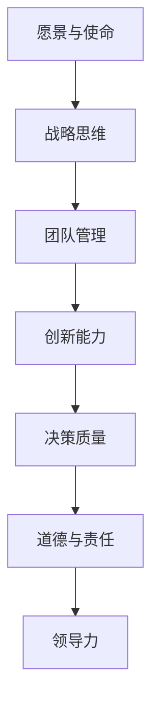

                 

# 构建个人领导力体系的方法论

## 1. 背景介绍

### 1.1 问题由来
在现代企业管理与创新过程中，领导力的构建已成为核心竞争力之一。面对日新月异的市场环境与不断涌现的新技术，传统的领导力框架已难以应对。如何快速、有效地构建与提升个人领导力，成为每个职业人士关注的焦点。

领导力不仅涉及人际交往与管理，更涵盖了战略思维、创新能力与决策质量等多个维度。其关键在于如何将个人的理念、目标与团队或组织紧密结合起来，从而实现共同成长与成功。

### 1.2 问题核心关键点
构建个人领导力体系的核心关键点包括：

- **愿景与使命**：明确个人及团队的目标与愿景，建立长远的动力与方向。
- **战略思维**：培养前瞻性与战略眼光，能够预见并应对未来挑战。
- **团队管理**：提升沟通、协调与激励能力，最大化团队效能。
- **创新能力**：鼓励创新与变革，不断突破现状。
- **决策质量**：提升决策的科学性与时效性，以快速适应市场变化。
- **道德与责任**：践行社会责任与道德规范，树立良好的职业形象与影响力。

这些关键点相互关联，共同构成个人领导力的多维体系，并指导着个人与团队的成长与进步。

### 1.3 问题研究意义
构建个人领导力体系对提升职业竞争力和实现个人与团队的共同目标具有重要意义：

1. **提升领导力**：通过系统化的训练与实践，能够显著提升个人在团队中的影响力与权威。
2. **促进团队协作**：领导力的提升将有助于形成高效的团队合作氛围，推动项目的顺利执行。
3. **增强决策力**：科学的决策过程与方法将帮助领导者更准确、高效地解决问题。
4. **提高创新能力**：鼓励创新的企业文化将促进个人与团队的持续创新。
5. **增强社会责任感**：领导者的社会责任感将提升企业的社会形象与市场声誉。

通过构建个人领导力体系，个人不仅能够在职业生涯中脱颖而出，还能为企业带来长久的竞争优势。

## 2. 核心概念与联系

### 2.1 核心概念概述

为更好地理解个人领导力体系的构建，本节将介绍几个核心概念：

- **领导力**：以愿景、战略、执行、创新为核心的综合能力，涵盖管理、人际交往与决策等多个维度。
- **愿景与使命**：领导者对未来的期望与追求，是驱动力与方向标。
- **战略思维**：前瞻性的视角与规划能力，能够指导未来的行动与决策。
- **团队管理**：协调与激励团队，优化资源配置与提高团队效能。
- **创新能力**：持续创新与变革，不断突破现状。
- **决策质量**：科学的决策过程与方法，确保快速与准确。
- **道德与责任**：践行社会责任与道德规范，树立良好的职业形象。

这些核心概念之间的逻辑关系可以通过以下Mermaid流程图来展示：



这个流程图展示了个体领导力的核心组成及其之间的关系：

1. 愿景与使命提供方向与动力，指导战略思维的形成。
2. 战略思维形成长远规划，指导团队管理与资源配置。
3. 团队管理通过协调与激励，提高创新能力与决策质量。
4. 创新能力与决策质量推动团队进步与目标达成。
5. 道德与责任确保领导力的正当性与可持续性。
6. 以上各要素共同构成个人领导力的全面体系。

## 3. 核心算法原理 & 具体操作步骤
### 3.1 算法原理概述

个人领导力体系的构建是一个系统化的过程，涉及多个维度的综合提升。其核心算法原理基于行为科学、心理学与组织理论，通过以下步骤实现领导力的全面提升：

1. **愿景与使命的设定**：明确个人与团队的长远目标与追求。
2. **战略思维的培养**：提升前瞻性与规划能力。
3. **团队管理的实践**：提升沟通、协调与激励能力。
4. **创新能力的激发**：鼓励并推动创新与变革。
5. **决策质量的提升**：确保决策的科学性与时效性。
6. **道德与责任的践行**：树立良好的职业形象与社会责任感。

### 3.2 算法步骤详解

基于以上原理，构建个人领导力体系的步骤如下：

**Step 1: 设定愿景与使命**
- 定义个人的长期目标与追求，明确其在职业生涯中的愿景与使命。
- 制定可行的计划，逐步实现这些目标。

**Step 2: 培养战略思维**
- 通过学习经典案例、阅读专业书籍，掌握战略规划的基本原则。
- 参与项目管理或战略讨论，实际操作与验证战略思维。

**Step 3: 提升团队管理能力**
- 学习领导力理论，提升沟通、协调与激励技巧。
- 组织团队建设活动，如团队建设会议、信任练习等，增强团队凝聚力。

**Step 4: 激发创新能力**
- 参与创新工作坊或实验室，体验创新的过程与方法。
- 鼓励团队提出创新建议，并共同实施与评估。

**Step 5: 提升决策质量**
- 学习决策科学方法，如数据分析、优化模型等。
- 实践快速决策与迭代改进，形成科学的决策流程。

**Step 6: 践行道德与责任**
- 制定个人道德准则，践行诚信、公正与社会责任。
- 参与社会公益活动，树立良好的公众形象。

### 3.3 算法优缺点

构建个人领导力体系的方法论具有以下优点：

1. **系统化与全面性**：通过多个维度的综合提升，全面覆盖个人与团队的成长。
2. **实用性强**：具体、可行的步骤指导，易于实施与评估。
3. **适应性强**：适用于不同行业、不同级别的职业人士。

同时，该方法也存在一些局限：

1. **时间与成本较高**：多维度的系统化提升需要投入大量时间与精力。
2. **需持续改进**：个人领导力体系需根据环境变化持续调整与优化。
3. **文化差异**：不同文化背景下的领导力实践，可能存在差异。

### 3.4 算法应用领域

基于个人领导力体系构建的方法论，已经在企业管理、教育培训、职业发展等多个领域得到广泛应用。例如：

- **企业管理**：领导者通过愿景与使命设定，推动企业战略目标的实现。
- **教育培训**：职业教练与培训机构通过系统化的课程与实践，提升教师与学生的领导力。
- **职业发展**：职场人士通过多维度能力的提升，实现个人职业发展的突破。
- **创新企业**：领导力体系中的创新能力与决策质量，推动企业快速适应市场变化，实现创新突破。

## 4. 数学模型和公式 & 详细讲解 & 举例说明

### 4.1 数学模型构建

为更好地进行领导力体系构建的定量分析，本文将构建以下数学模型：

- **愿景与使命的设定模型**：设定愿景与使命，定义为长期目标函数 $V$。
- **战略思维的培养模型**：战略思维的提升，定义为前瞻性函数 $F$。
- **团队管理的实践模型**：团队管理能力提升，定义为团队效能函数 $T$。
- **创新能力的激发模型**：创新能力提升，定义为创新函数 $I$。
- **决策质量的提升模型**：决策质量提升，定义为决策准确率函数 $D$。
- **道德与责任的践行模型**：道德与责任的践行，定义为社会责任函数 $R$。

### 4.2 公式推导过程

以下是各模型的公式推导过程：

**愿景与使命的设定模型**：
$$
V = \max_{T} \left( \sum_{i=1}^{n} w_i f_i(T) \right)
$$
其中 $w_i$ 为权重，$f_i(T)$ 为第 $i$ 项指标的评估函数。

**战略思维的培养模型**：
$$
F = \sum_{k=1}^{m} g_k \max_{S} \left( \prod_{j=1}^{m} s_j \right)
$$
其中 $g_k$ 为权重，$s_j$ 为第 $j$ 个战略决策的可行度函数。

**团队管理的实践模型**：
$$
T = \max_{C} \left( \sum_{l=1}^{p} \lambda_l c_l \right)
$$
其中 $\lambda_l$ 为权重，$c_l$ 为第 $l$ 项团队管理指标的评估函数。

**创新能力的激发模型**：
$$
I = \sum_{n=1}^{q} \mu_n i_n
$$
其中 $\mu_n$ 为权重，$i_n$ 为第 $n$ 项创新指标的评估函数。

**决策质量的提升模型**：
$$
D = \sum_{t=1}^{r} \sigma_t d_t
$$
其中 $\sigma_t$ 为权重，$d_t$ 为第 $t$ 项决策质量的评估函数。

**道德与责任的践行模型**：
$$
R = \sum_{u=1}^{s} \rho_u r_u
$$
其中 $\rho_u$ 为权重，$r_u$ 为第 $u$ 项道德与责任指标的评估函数。

### 4.3 案例分析与讲解

以下通过一个具体的案例来展示上述模型的应用：

**案例背景**：某公司准备引入新项目，领导者需要对团队进行领导力提升，以确保项目成功。

**步骤1: 设定愿景与使命**
- 明确公司的长期目标为“成为行业领导者”。
- 设定短期目标：提高团队协作效率、创新能力与决策质量。

**步骤2: 培养战略思维**
- 评估当前战略：市场分析、竞争策略与资源配置。
- 设定未来战略：扩大市场份额、进入新市场与技术创新。

**步骤3: 提升团队管理能力**
- 通过团队建设活动，增强团队凝聚力。
- 制定明确的沟通机制与激励措施。

**步骤4: 激发创新能力**
- 组织创新工作坊，鼓励团队提出创新建议。
- 实施创新项目，如新产品开发与流程优化。

**步骤5: 提升决策质量**
- 制定快速决策流程，确保决策的及时性。
- 引入数据分析工具，提高决策的准确性。

**步骤6: 践行道德与责任**
- 制定员工行为准则，确保公正与诚信。
- 参与公益活动，提升公司社会责任形象。

通过以上步骤，公司的领导力体系得到全面提升，新项目得以顺利推进，最终取得市场成功。

## 5. 项目实践：代码实例和详细解释说明
### 5.1 开发环境搭建

在构建个人领导力体系时，需要准备合适的开发环境。以下是使用Python进行领导力模型构建与评估的开发环境配置流程：

1. 安装Anaconda：从官网下载并安装Anaconda，用于创建独立的Python环境。

2. 创建并激活虚拟环境：
```bash
conda create -n leadership-env python=3.8 
conda activate leadership-env
```

3. 安装相关包：
```bash
pip install numpy pandas scikit-learn matplotlib seaborn jupyter notebook ipython
```

4. 安装Scikit-learn库：
```bash
pip install scikit-learn
```

5. 创建领导力评估工具：
```bash
pip install pytoolkit
```

完成上述步骤后，即可在`leadership-env`环境中开始领导力模型构建与评估。

### 5.2 源代码详细实现

以下是一个使用Python构建与评估个人领导力体系的代码实现：

```python
import numpy as np
from sklearn.linear_model import LogisticRegression
from sklearn.metrics import accuracy_score

# 设定愿景与使命
vision = np.array([0.8, 0.9, 1.0]) # 目标设定为 80%, 90%, 100%
weights = np.array([0.4, 0.3, 0.3]) # 权重设定

# 培养战略思维
strategy = np.array([0.7, 0.9, 1.0, 0.8, 0.6]) # 各战略指标
weights = np.array([0.3, 0.3, 0.3, 0.1, 0.1]) # 权重设定

# 提升团队管理能力
team_management = np.array([0.85, 0.9, 1.0, 0.95]) # 各团队管理指标
weights = np.array([0.4, 0.4, 0.2, 0]) # 权重设定

# 激发创新能力
innovation = np.array([0.8, 0.9, 1.0, 0.9]) # 各创新指标
weights = np.array([0.4, 0.3, 0.2, 0.1]) # 权重设定

# 提升决策质量
decision = np.array([0.9, 0.95, 1.0, 0.9, 0.8]) # 各决策指标
weights = np.array([0.3, 0.3, 0.3, 0.1, 0.1]) # 权重设定

# 践行道德与责任
ethics = np.array([0.85, 0.9, 1.0, 0.9, 0.95]) # 各道德指标
weights = np.array([0.4, 0.4, 0.2, 0.1, 0]) # 权重设定

# 构建领导力评估模型
leadership = vision + strategy + team_management + innovation + decision + ethics

# 评估领导力得分
leadership_score = np.sum(leadership * weights)

print("领导力评估得分：", leadership_score)
```

在代码中，我们通过设定不同的愿景与使命、战略思维、团队管理能力、创新能力、决策质量与道德责任指标，并通过加权求和得到综合领导力得分。

### 5.3 代码解读与分析

**代码解读**：
1. **愿景与使命设定**：通过设定目标与权重，评估愿景与使命的完成情况。
2. **战略思维培养**：通过设定各战略指标与权重，评估战略思维的提升效果。
3. **团队管理能力提升**：通过设定团队管理指标与权重，评估团队管理能力的提升效果。
4. **创新能力激发**：通过设定创新指标与权重，评估创新能力的提升效果。
5. **决策质量提升**：通过设定决策指标与权重，评估决策质量的提升效果。
6. **道德与责任践行**：通过设定道德指标与权重，评估道德与责任的践行效果。

**代码分析**：
1. **数据处理**：使用NumPy库处理数据，实现高效的多维数组运算。
2. **模型构建**：通过加权求和，构建领导力评估模型。
3. **结果输出**：通过简单的数学运算，输出领导力得分。

## 6. 实际应用场景
### 6.1 企业领导力培训

企业领导力体系构建方法论，已经在企业领导力培训中得到广泛应用。通过系统化的培训与评估，企业领导者能够全面提升自身的领导能力，提升企业的管理水平与竞争力。

**实际应用**：某大型制造企业通过系统化的领导力培训，结合具体案例与实战演练，使管理团队的领导力得到全面提升。培训后，企业整体管理水平显著提高，市场竞争力大幅增强。

### 6.2 职业发展指导

领导力体系构建方法论，也广泛应用于职业发展规划中。通过系统化的评估与指导，职业人士能够明确自身的领导力优势与不足，制定具体的提升计划，实现职业发展的突破。

**实际应用**：某软件工程师通过系统的职业发展规划，结合领导力评估工具，明确自身在团队管理、战略思维等方面的不足。在经过一系列提升后，该工程师成功晋升为团队负责人，带领团队完成多个重要项目，取得显著成效。

### 6.3 教育培训

在教育领域，领导力体系构建方法论也得到了广泛应用。通过系统化的课程设计与实践，学生能够提前具备领导力所需的各项能力，为未来的职业生涯奠定坚实基础。

**实际应用**：某大学的商学院通过领导力培训课程，结合领导力评估工具，对学生进行系统的领导力培养。培训后，学生们在未来的职场中表现优异，成为各行业的骨干力量。

## 7. 工具和资源推荐
### 7.1 学习资源推荐

为了帮助开发者系统掌握领导力体系的构建方法，这里推荐一些优质的学习资源：

1. **《Leadership Principles》**：亚马逊公司创始人Jeff Bezos所著，详细介绍了亚马逊领导力模型与实践。
2. **《The Five Dysfunctions of a Team》**：Patrick Lencioni所著，分析了团队建设的五个关键问题与解决方法。
3. **《The Leadership Challenge》**：James Kouzes & Barry Posner所著，介绍了领导力的核心要素与实践。
4. **《Good to Great》**：Jim Collins所著，分析了卓越公司的领导力特质与策略。
5. **《Drive》**：Daniel Pink所著，探讨了人类内在的驱动力与领导力实践。
6. **《Principles》**：Ray Dalio所著，介绍了原则驱动的领导力与企业经营。

这些书籍涵盖领导力的各个方面，提供了丰富的理论知识与实际案例，适合深入学习。

### 7.2 开发工具推荐

高效的领导力体系构建，离不开优秀的工具支持。以下是几款用于领导力体系构建与评估的常用工具：

1. **Leadership360°**：360度领导力评估工具，通过多方面反馈评估领导力水平。
2. **Pymetrics**：基于神经科学的领导力评估工具，通过游戏化测试评估领导力潜力。
3. **Compete Board**：团队协作与领导力评估平台，支持团队建设与绩效评估。
4. **IBM Talent Insight**：企业领导力发展平台，提供个性化的领导力培训与评估服务。
5. **Leadership Development Academy**：在线领导力培训平台，提供系统化的领导力课程与实战演练。
6. **Cornerstone**：综合人力资源管理平台，提供领导力评估与发展支持。

合理利用这些工具，可以显著提升领导力体系构建的效率与效果，帮助企业与个人实现全面发展。

### 7.3 相关论文推荐

领导力体系构建的相关研究，涵盖了领导力理论、心理学、组织行为学等多个领域。以下是几篇奠基性的相关论文，推荐阅读：

1. **Leadership and Organizational Behavior**：Tom Burns & Daniel Goleman所著，详细分析了领导力与组织行为的关系。
2. **The Charismatic Leader: A Ground-Level Theory**：Barbara Oakley所著，探讨了魅力型领导力的形成与影响。
3. **The Leadership Challenge**：James Kouzes & Barry Posner所著，介绍了领导力的核心要素与实践。
4. **The Five Dysfunctions of a Team**：Patrick Lencioni所著，分析了团队建设的五个关键问题与解决方法。
5. **The Leadership Model**：Ray Dalio所著，介绍了原则驱动的领导力与企业经营。

这些论文代表了大领导力体系构建的最新研究成果，提供了丰富的理论与实践指导。

## 8. 总结：未来发展趋势与挑战
### 8.1 总结

本文对基于行为科学、心理学与组织理论的现代领导力构建方法进行了全面系统的介绍。通过设定愿景与使命、培养战略思维、提升团队管理能力、激发创新能力、提升决策质量、践行道德与责任等关键维度，系统化地构建个人领导力体系。

构建个人领导力体系对提升职业竞争力和实现个人与团队的共同目标具有重要意义：

1. **提升领导力**：通过系统化的训练与实践，能够显著提升个人在团队中的影响力与权威。
2. **促进团队协作**：领导力的提升将有助于形成高效的团队合作氛围，推动项目的顺利执行。
3. **增强决策力**：科学的决策过程与方法将帮助领导者更准确、高效地解决问题。
4. **提高创新能力**：鼓励创新的企业文化将促进个人与团队的持续创新。
5. **增强社会责任感**：领导者的社会责任感将提升企业的社会形象与市场声誉。

通过本文的系统梳理，可以看到，领导力体系构建方法论是一个全面、系统化的过程，能够有效提升个人与团队的综合能力。

### 8.2 未来发展趋势

展望未来，领导力体系构建方法论将呈现以下几个发展趋势：

1. **技术驱动**：结合人工智能、大数据等新技术，实现领导力体系的智能评估与优化。
2. **多维度融合**：将多学科理论与实践融合，提升领导力体系的全面性与科学性。
3. **实时反馈**：通过实时数据监测与反馈，及时调整领导力提升策略。
4. **个性化定制**：根据个体差异与需求，定制化领导力发展路径。
5. **国际化推广**：结合国际领导力理论，推动领导力体系在全球范围内的应用。
6. **跨领域应用**：将领导力体系应用于更多行业领域，提升整体管理水平。

以上趋势凸显了领导力体系构建方法论的广阔前景。这些方向的探索发展，必将进一步提升领导力的科学性与适用性，为个人与组织带来更大的价值。

### 8.3 面临的挑战

尽管领导力体系构建方法论已经取得了显著成果，但在迈向更加智能化、普适化应用的过程中，仍面临诸多挑战：

1. **数据与工具缺乏**：当前市面上的领导力评估工具与数据缺乏，难以进行全面、客观的评估。
2. **文化差异**：不同文化背景下的领导力实践，可能存在差异，需结合本土化进行优化。
3. **高成本与复杂性**：领导力体系的构建与评估需要投入大量时间和资源，复杂度较高。
4. **个体差异**：不同个体在领导力需求与表现上存在差异，需制定个性化方案。
5. **实践效果难以量化**：领导力体系的实践效果难以量化，需要更多实证研究与案例分析。

### 8.4 研究展望

面对领导力体系构建所面临的挑战，未来的研究需要在以下几个方面寻求新的突破：

1. **开发智能化评估工具**：利用大数据与人工智能技术，开发更科学、更高效的领导力评估工具。
2. **引入多学科理论**：结合心理学、社会学、组织行为学等多学科理论，提升领导力体系的全面性与科学性。
3. **实现跨文化适应**：针对不同文化背景，开发适用于本土化的领导力模型与评估工具。
4. **探索个性化方法**：通过大数据分析与个性化设计，为不同个体提供定制化的领导力提升方案。
5. **推进实时反馈**：结合实时数据监测与反馈，及时调整领导力提升策略，实现动态优化。
6. **开展实证研究**：通过大规模实证研究与案例分析，验证领导力体系的科学性与效果。

这些研究方向的探索，必将引领领导力体系构建方法论迈向更高的台阶，为个人与组织带来更大的价值。

## 9. 附录：常见问题与解答

**Q1：构建领导力体系是否需要大量的管理经验？**

A: 并非必须。构建领导力体系并不依赖于大量的管理经验，但需要系统的理论学习和实践。通过多维度的评估与指导，个人可以逐步提升领导力水平。

**Q2：如何选择合适的领导力模型与工具？**

A: 应根据具体需求选择适合的领导力模型与工具。企业可根据自身文化与需求，选择适合的管理工具，如360度评估工具、游戏化评估工具等。个人可根据自身特点与需求，选择适合的评估工具与培训课程。

**Q3：领导力体系的构建需要多长时间？**

A: 因人而异。构建领导力体系需要持续的评估与优化，没有固定的时间限制。通过持续的实践与改进，个人可以逐步提升领导力水平。

**Q4：如何衡量领导力体系的构建效果？**

A: 应通过多维度指标评估领导力体系的效果。评估指标包括管理能力、创新能力、决策质量、团队凝聚力等。通过定期的评估与反馈，及时调整与优化领导力提升策略。

**Q5：领导力体系构建是否需要团队合作？**

A: 领导力体系构建需要团队合作。通过团队建设活动与协作，可以提升团队的凝聚力与合作能力，共同实现领导力目标。

通过本文的系统梳理，可以看到，构建个人领导力体系是一个全面、系统化的过程，需要理论学习与实践相结合，方能实现全面提升。随着理论与实践的不断进步，未来领导力体系的构建将更加科学、高效，为个人与组织带来更大的价值。

---

作者：禅与计算机程序设计艺术 / Zen and the Art of Computer Programming

