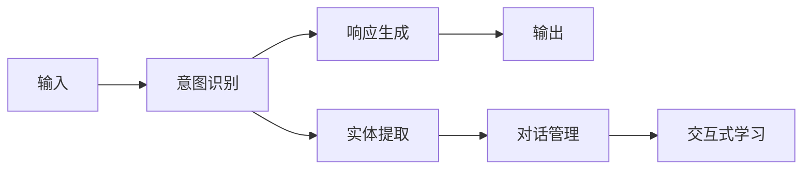

                 

# 构建你自己的聊天机器人：入门指南

## 1. 背景介绍

### 1.1 问题由来

在人工智能领域，构建聊天机器人（Chatbot）一直是热门话题。随着深度学习技术的迅猛发展，特别是自然语言处理（NLP）技术的突破，构建高效、智能的聊天机器人成为可能。如今，无论是企业级的客户服务，还是日常生活中的智能助手，聊天机器人都展示了强大的应用潜力。

然而，构建一个有效的聊天机器人并非易事。很多初学者在尝试构建自己的聊天机器人时，往往面临着技术栈选择、算法理解、数据处理等多方面的挑战。因此，本文旨在为那些对聊天机器人感兴趣但缺乏经验的人士提供一个系统的入门指南，帮助他们快速上手，构建自己的聊天机器人。

### 1.2 问题核心关键点

聊天机器人的核心在于其自然语言理解（Natural Language Understanding, NLU）和自然语言生成（Natural Language Generation, NLG）能力。NLU使机器人能够理解用户的意图和语境，NLG使机器人能够生成符合语法和语义规则的回复。基于这一核心，构建聊天机器人需要理解以下几个关键点：

- 对话管理：如何设计对话流程，管理对话状态。
- 意图识别：如何识别用户的意图，并决定应采取什么行动。
- 实体提取：如何从用户的输入中提取出关键信息。
- 响应生成：如何生成适当的回复。
- 交互式学习：如何根据用户的反馈调整模型。

### 1.3 问题研究意义

构建聊天机器人对企业和个人都具有重要的意义：

- 提高效率：自动化处理重复性工作，减少人工成本。
- 提升用户体验：提供全天候、智能化的客服支持。
- 数据驱动决策：通过分析用户互动数据，优化服务流程。
- 个性化服务：根据用户行为和偏好，提供定制化建议。

聊天机器人的发展不仅能提升工作效率，还能在医疗、金融、电商等多个领域带来深远的影响，成为企业数字化转型不可或缺的一部分。

## 2. 核心概念与联系

### 2.1 核心概念概述

在深入聊天机器人构建之前，我们先简要介绍几个核心概念及其之间的联系：

- **自然语言处理（NLP）**：研究如何让计算机理解、生成和处理自然语言的技术。
- **对话管理（Dialog Management）**：管理对话流程，确保对话连贯和高效。
- **意图识别（Intent Recognition）**：识别用户输入的意图，为后续处理提供依据。
- **实体提取（Entity Extraction）**：从用户输入中提取出关键信息，如人名、地点、时间等。
- **响应生成（Response Generation）**：根据用户意图和提取的实体，生成合适的回复。
- **交互式学习（Interactive Learning）**：通过用户的反馈不断调整模型，提升对话质量。

这些概念构成了聊天机器人系统的核心，通过合理设计，可以有效提升聊天机器人的智能化水平。

### 2.2 核心概念原理和架构的 Mermaid 流程图



这个流程图展示了聊天机器人系统的主要流程：

- 用户输入首先经过意图识别模块，判断用户的意图。
- 意图识别模块根据输入中的实体，调用实体提取模块，进一步解析输入。
- 实体提取模块提供的信息，用于对话管理模块，管理对话状态和流程。
- 对话管理模块与响应生成模块交互，根据当前对话状态和意图，生成合适的回复。
- 生成后的回复再次反馈给用户，进入交互式学习模块，用于调整模型。

这个流程图简洁地展示了聊天机器人的基本架构和工作流程。

## 3. 核心算法原理 & 具体操作步骤

### 3.1 算法原理概述

聊天机器人的核心算法基于NLP技术，具体来说包括以下几个部分：

1. **词嵌入（Word Embedding）**：将词汇映射到高维空间，捕捉词汇之间的语义关系。
2. **意图识别（Intent Recognition）**：通过分类算法，如支持向量机（SVM）、随机森林（Random Forest）等，识别用户意图。
3. **实体提取（Entity Extraction）**：使用命名实体识别（Named Entity Recognition, NER）技术，从文本中提取出关键实体。
4. **对话管理（Dialog Management）**：利用状态机、决策树等方法，管理对话流程和状态。
5. **响应生成（Response Generation）**：通过模板填充、生成式模型（如Seq2Seq、Transformer等）生成自然语言回复。
6. **交互式学习（Interactive Learning）**：利用强化学习（Reinforcement Learning, RL）、在线学习（Online Learning）等技术，根据用户反馈不断调整模型参数。

这些算法相互配合，构成了聊天机器人系统的完整框架。

### 3.2 算法步骤详解

构建聊天机器人可以分为以下几个关键步骤：

1. **数据收集和处理**：收集聊天记录、用户反馈等数据，并进行清洗、标注等预处理。
2. **模型选择和训练**：选择合适的模型（如BERT、GPT等），并使用标注数据对其进行训练。
3. **意图识别和实体提取**：使用预训练模型或自定义模型，对用户输入进行意图识别和实体提取。
4. **对话管理**：设计对话流程，实现基于状态机的对话管理。
5. **响应生成**：结合用户意图和提取的实体，生成回复文本。
6. **交互式学习**：通过用户反馈，不断优化模型参数，提高对话质量。

### 3.3 算法优缺点

聊天机器人构建的算法有如下优缺点：

#### 优点

- **自动化处理**：聊天机器人可以自动处理大量的重复性工作，减少人工干预。
- **全天候服务**：聊天机器人可以提供24/7的客服支持，提升用户满意度。
- **快速迭代**：通过交互式学习，聊天机器人可以根据用户反馈不断优化，提升性能。

#### 缺点

- **依赖标注数据**：构建聊天机器人需要大量的标注数据，这些数据的获取和处理成本较高。
- **模型复杂度**：构建高精度的聊天机器人模型，需要处理多轮对话，模型复杂度较高。
- **语言多样性**：不同语言的聊天机器人需要单独构建和训练，工作量较大。
- **上下文理解**：处理多轮对话时，准确理解上下文是一大挑战。

### 3.4 算法应用领域

聊天机器人技术在多个领域有着广泛的应用：

- **客户服务**：自动回复常见问题，提升客户满意度。
- **医疗咨询**：提供医疗知识和初步诊断，辅助医生工作。
- **金融咨询**：提供理财建议，解答投资疑问。
- **在线教育**：个性化推荐课程，辅助学生学习。
- **智能家居**：通过语音控制家电，提升生活便利性。

## 4. 数学模型和公式 & 详细讲解 & 举例说明

### 4.1 数学模型构建

聊天机器人构建涉及多个NLP任务，每个任务需要不同的数学模型和公式。下面简要介绍几个核心任务及其数学模型。

#### 4.1.1 意图识别

假设有一个二分类任务，需要判断用户输入是否为意图A。使用SVM作为分类器，模型公式为：

$$
\theta = \arg\min_{\theta} \frac{1}{2} \|\theta\|^2 + C\sum_{i=1}^N \log \sigma(-y_i\cdot x_i^\top\theta)
$$

其中，$\theta$为分类器参数，$x_i$为训练样本，$y_i$为标签，$\sigma$为sigmoid函数。

#### 4.1.2 实体提取

使用CRF模型进行命名实体识别，模型公式为：

$$
P(y|x;\theta) = \frac{e^{\theta^\top x + b}}{\sum_{y'} e^{\theta'^\top x + b'}}
$$

其中，$\theta$为模型参数，$x$为输入序列，$y$为实体标注，$b$为偏置项。

#### 4.1.3 响应生成

使用Seq2Seq模型生成回复，公式为：

$$
p_{\theta}(x|y) = \prod_{i=1}^n p_{\theta_i}(x_i|x_{i-1})
$$

其中，$\theta_i$为模型参数，$x$为输入序列，$y$为输出序列。

### 4.2 公式推导过程

#### 4.2.1 意图识别

在SVM中，目标是最小化经验风险，公式为：

$$
\min_{\theta} \frac{1}{N}\sum_{i=1}^N L(y_i, f_\theta(x_i))
$$

其中，$L$为损失函数，$f_\theta(x)$为模型预测函数。

根据梯度下降法，迭代更新模型参数：

$$
\theta \leftarrow \theta - \eta \nabla_{\theta}L(y_i, f_\theta(x_i))
$$

其中，$\eta$为学习率。

#### 4.2.2 实体提取

使用条件随机场（CRF）模型，目标是最小化损失函数：

$$
\min_{\theta} -\frac{1}{N}\sum_{i=1}^N \log P(y_i|x_i;\theta)
$$

根据CRF的模型定义，对输入序列$x$和标注序列$y$的联合概率定义为：

$$
P(x,y;\theta) = \prod_{i=1}^n p_{\theta_i}(x_i|x_{i-1},y_i) \prod_{i=1}^{n-1} \tau(y_{i-1},y_i)
$$

其中，$\tau(y_{i-1},y_i)$为状态转移概率。

### 4.3 案例分析与讲解

以一个简单的意图识别任务为例，分析模型的构建和训练过程。

假设有一个二分类任务，训练数据集包含100个样本，每个样本包含一个输入序列和对应的标签。使用SVM进行训练，参数$C=1$，初始化参数$\theta$。

1. 随机初始化参数$\theta$，设定学习率$\eta=0.01$。
2. 使用梯度下降法，迭代更新参数$\theta$，每次迭代计算梯度：

$$
\nabla_{\theta}L(y_i, f_\theta(x_i)) = \frac{1}{N}\sum_{i=1}^N (y_i - f_\theta(x_i))x_i
$$

3. 不断迭代更新$\theta$，直至收敛。

## 5. 项目实践：代码实例和详细解释说明

### 5.1 开发环境搭建

构建聊天机器人需要一个完善的开发环境。以下是搭建环境的步骤：

1. **安装Python和相关库**：安装Python 3.x，并使用pip安装必要的库，如TensorFlow、NLTK等。
2. **安装NLP框架**：安装NLTK、spaCy等NLP处理库，用于文本预处理和模型训练。
3. **安装聊天机器人框架**：安装Rasa、ChatterBot等聊天机器人框架，用于构建和管理聊天机器人。

### 5.2 源代码详细实现

以下是一个基于Rasa的聊天机器人项目示例，实现意图识别和实体提取功能。

**项目结构**：

```
- chatbot/
    - train.py
    - models/
        - intent/
            - intent.json
        - entity/
            - entity.json
    - data/
        - training/
            - intents/
            - entities/
    - nlu/
        - intent/
        - entity/
    - domain/
        - intent/
        - entity/
```

**intent.json**：

```json
{
    "responses": ["好的，我将为您查询您的账户余额"],
    "examples": ["请查询我的账户余额", "您现在的账户余额是多少", "请问我的账户里还有多少钱"],
    "regex": "余额",
    "features": []
}
```

**entity.json**：

```json
{
    "responses": ["请告诉我您的账户号"],
    "examples": ["请告诉我我的账户号", "我的账户号是多少"],
    "regex": "账户号",
    "features": []
}
```

**train.py**：

```python
from rasa.core.data import Data
from rasa.nlu.model import Interpreter

# 加载训练数据
training_data = Data.load_from_directory('data/training/intents/')\
    .load_from_directory('data/training/entities/')\
    .load_from_directory('data/training/')

# 加载模型
interpreter = Interpreter.load('models/intent/intent.json')

# 使用训练数据进行意图识别
interpretation = interpreter.parse(training_data.examples[0])
print(interpretation)
```

### 5.3 代码解读与分析

**intent.json和entity.json**：
- `responses`：机器人的回复。
- `examples`：样本输入，用于训练意图识别和实体提取模型。
- `regex`：正则表达式，用于提取实体。

**train.py**：
- 使用Rasa的`Data`类加载训练数据。
- 使用`Interpreter`类加载意图识别模型。
- 通过调用`parse`方法，将训练数据输入模型，输出意图识别结果。

### 5.4 运行结果展示

在`train.py`中运行后，会输出意图识别的结果，展示机器人的意图识别能力。

## 6. 实际应用场景

### 6.1 客户服务

聊天机器人可以用于客户服务，自动回复常见问题，减少人工客服的工作量，提升客户满意度。例如，某电商平台可以通过聊天机器人提供订单查询、退换货等服务，24/7为顾客提供支持。

### 6.2 在线教育

在线教育平台可以使用聊天机器人辅助学生学习，提供个性化推荐和答疑服务。例如，某在线教育平台可以基于学生的学习行为和偏好，推荐适合的课程和学习资源，提升学习效果。

### 6.3 智能家居

智能家居设备可以通过聊天机器人提供语音控制和信息查询服务。例如，某智能音箱可以基于用户的语音指令，控制家中的灯光、电器等设备，提供天气、新闻等信息查询。

### 6.4 未来应用展望

未来的聊天机器人技术将更加智能化和个性化，具体发展趋势如下：

1. **多轮对话处理**：未来的聊天机器人将能够处理多轮对话，理解上下文和语境，提供更加连贯和自然的对话体验。
2. **自然语言理解**：聊天机器人将具备更强大的自然语言理解能力，能够准确理解用户的意图和需求。
3. **上下文记忆**：聊天机器人将具备上下文记忆功能，能够记住对话历史，提供更加个性化的服务。
4. **跨平台集成**：聊天机器人将能够跨平台集成，支持多渠道交互，提供更便捷的用户体验。
5. **深度学习**：聊天机器人将广泛应用深度学习技术，提升模型的性能和效果。

## 7. 工具和资源推荐

### 7.1 学习资源推荐

1. **《Python自然语言处理》**：该书系统介绍了NLP和聊天机器人的基本原理和实现方法，适合初学者学习。
2. **《TensorFlow官方文档》**：详细介绍了TensorFlow框架及其在NLP任务中的应用。
3. **《Rasa官方文档》**：提供了Rasa聊天机器人框架的详细使用指南和示例代码。
4. **《NLTK官方文档》**：提供了Python NLP库NLTK的全面使用指南和示例代码。

### 7.2 开发工具推荐

1. **Rasa**：一个开源的聊天机器人框架，提供了多种模型和组件，支持多轮对话处理。
2. **ChatterBot**：一个简单的聊天机器人框架，提供了规则引擎和训练工具，适合快速开发。
3. **TensorFlow**：一个强大的深度学习框架，支持多种NLP任务和模型。
4. **NLTK**：一个流行的NLP库，提供了文本预处理和模型训练功能。

### 7.3 相关论文推荐

1. **《Attention is All You Need》**：提出Transformer模型，开启了预训练语言模型的时代。
2. **《BERT: Pre-training of Deep Bidirectional Transformers for Language Understanding》**：提出BERT模型，在多项NLP任务上刷新了SOTA。
3. **《A Survey on Machine Translation with Attention Models》**：综述了基于注意力机制的机器翻译模型。
4. **《Dialogue Systems: A Survey》**：综述了聊天机器人领域的研究进展和技术趋势。

## 8. 总结：未来发展趋势与挑战

### 8.1 研究成果总结

聊天机器人技术近年来取得了显著进展，主要研究成果如下：

1. **Transformer模型**：Transformer模型在NLP任务上取得了SOTA性能，广泛应用于聊天机器人构建。
2. **预训练语言模型**：BERT、GPT等预训练模型为聊天机器人提供了强大的语言理解能力。
3. **多轮对话处理**：基于Seq2Seq、Transformer等模型的多轮对话处理技术，提升了聊天机器人的交互体验。
4. **强化学习**：通过强化学习，聊天机器人能够根据用户反馈不断优化，提升对话质量。

### 8.2 未来发展趋势

未来聊天机器人技术的发展趋势如下：

1. **多模态交互**：未来的聊天机器人将支持多模态交互，结合语音、图像、视频等多种形式的信息，提供更加丰富的交互体验。
2. **情感分析**：未来的聊天机器人将具备情感分析能力，能够理解用户的情绪，提供更加人性化的服务。
3. **跨领域应用**：未来的聊天机器人将应用于更多领域，如医疗、金融、教育等，提升相关行业的效率和质量。
4. **知识图谱**：未来的聊天机器人将结合知识图谱技术，提供更加准确和全面的信息。

### 8.3 面临的挑战

尽管聊天机器人技术取得了显著进展，但仍面临诸多挑战：

1. **数据获取和标注**：构建高质量的聊天机器人需要大量的标注数据，数据获取和标注成本较高。
2. **模型复杂度**：构建高精度的聊天机器人模型需要处理多轮对话，模型复杂度较高。
3. **上下文理解**：处理多轮对话时，准确理解上下文是巨大挑战，需要提升模型的上下文记忆能力。
4. **语言多样性**：不同语言的聊天机器人需要单独构建和训练，工作量较大。

### 8.4 研究展望

未来的研究可以从以下几个方向展开：

1. **模型压缩和加速**：通过模型压缩和加速技术，提升聊天机器人的推理速度和资源利用效率。
2. **多轮对话优化**：结合上下文理解技术，优化多轮对话处理，提升对话质量。
3. **跨领域应用**：探索聊天机器人跨领域的通用技术，提升其在更多场景中的应用效果。
4. **深度学习应用**：结合深度学习技术，提升聊天机器人的语言理解和生成能力。

## 9. 附录：常见问题与解答

### Q1: 如何构建一个高精度的聊天机器人？

**A:** 构建高精度的聊天机器人需要以下几个步骤：
1. 收集和标注大量对话数据。
2. 选择合适的NLP框架和模型，如Rasa、ChatterBot、BERT等。
3. 设计对话流程和意图识别、实体提取等模型。
4. 进行多轮对话处理和交互式学习，不断优化模型。

### Q2: 聊天机器人的训练数据如何获取？

**A:** 聊天机器人的训练数据可以通过以下方式获取：
1. 爬取公开的聊天数据集，如Twitter上的聊天记录。
2. 自主构建标注数据集，通过人工标注或半自动标注方式获取数据。
3. 结合用户互动数据，从实际应用中获取对话数据。

### Q3: 如何处理多轮对话中的上下文信息？

**A:** 处理多轮对话中的上下文信息，可以使用以下方法：
1. 使用上下文向量存储对话历史信息，并将其作为模型输入。
2. 结合seq2seq模型，通过递归神经网络（RNN）或Transformer模型处理上下文信息。
3. 使用注意力机制（Attention）机制，从对话历史中提取关键信息。

### Q4: 聊天机器人如何与用户进行交互？

**A:** 聊天机器人与用户交互的过程如下：
1. 用户输入自然语言。
2. 聊天机器人接收输入，使用意图识别和实体提取等技术解析输入。
3. 根据解析结果，生成合适的回复，并提供给用户。
4. 用户根据回复进行下一步操作，聊天机器人根据用户的反馈进行迭代优化。

### Q5: 如何保证聊天机器人的安全性？

**A:** 保证聊天机器人的安全性需要注意以下几点：
1. 对用户输入进行严格的过滤和清理，防止恶意攻击和数据泄露。
2. 定期更新和维护聊天机器人，及时修复已知的安全漏洞。
3. 结合用户反馈，不断优化聊天机器人的安全策略。

---

作者：禅与计算机程序设计艺术 / Zen and the Art of Computer Programming

