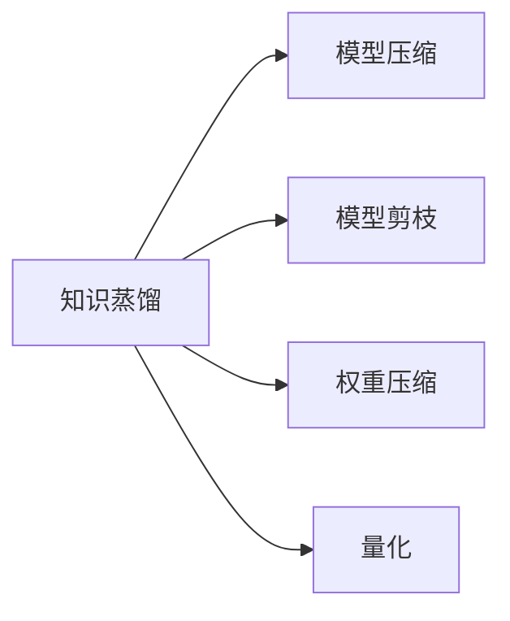

                 

# 模型压缩技术：知识蒸馏与模型剪枝

> 关键词：模型压缩,知识蒸馏,模型剪枝,神经网络,深度学习,机器学习

## 1. 背景介绍

### 1.1 问题由来
近年来，深度学习技术在图像识别、自然语言处理等领域取得了巨大的成功，随之而来的是模型参数量爆炸式增长。例如，大规模的图像分类任务中，VGG-16和ResNet系列模型都包含了上亿个参数，这让模型在训练和推理过程中消耗巨大的计算资源。参数量过大不仅带来训练和推理速度的挑战，还增加了模型的存储和传输成本，难以在移动设备和边缘计算等资源受限的场合应用。

因此，模型压缩技术成为当前深度学习领域的重点研究方向之一。其核心目标是在保持模型精度的同时，减小模型的参数量，降低模型占用的内存和存储，加速模型的推理过程，使模型更加轻量化、高效化。

## 2. 核心概念与联系

### 2.1 核心概念概述
模型压缩技术旨在优化深度学习模型的结构，减小模型参数规模，降低计算资源消耗，同时保持或提升模型的预测性能。常用的模型压缩方法包括知识蒸馏、模型剪枝、权重压缩、量化等。这些方法各有优缺点，根据具体应用场景选择合适的压缩方式，是提升模型性能和优化计算资源的有效手段。

### 2.2 核心概念之间的关系

知识蒸馏和模型剪枝是模型压缩技术的两种重要方法，二者相互补充，共同优化模型性能。知识蒸馏通过将大型模型的知识迁移到小型模型，实现模型的高效压缩。模型剪枝则是通过删除模型中不必要的神经元，减小模型参数规模，提高模型推理速度。




- **知识蒸馏**：通过训练一个“教师”模型（大模型）和一个“学生”模型（小模型），使得学生模型能够学习到教师模型的知识，从而获得与教师模型相近的性能。常见的知识蒸馏方法包括单蒸馏和双蒸馏。
- **模型剪枝**：通过分析和筛选模型中的冗余参数，删除对模型性能影响较小的神经元，达到减小模型参数规模的目的。剪枝方式包括网络级剪枝、通道级剪枝和权重级剪枝等。
- **权重压缩**：通过量化和编码优化等技术，将模型的权重参数进行压缩，减小存储和传输成本。常用的压缩方法包括浮点数压缩、哈夫曼编码等。
- **量化**：将浮点数参数转化为整数或低精度数，减小参数规模，加速计算过程。量化方法包括整量化、截断量化等。

这些方法可以单独使用，也可以组合使用，以获得更好的压缩效果。

## 3. 核心算法原理 & 具体操作步骤

### 3.1 算法原理概述

知识蒸馏和模型剪枝是模型压缩技术的两种常见方法，其核心思想是通过优化模型的结构，减小模型参数规模，降低计算资源消耗，同时保持或提升模型的预测性能。

#### 3.1.1 知识蒸馏原理

知识蒸馏通过将大型模型的知识迁移到小型模型，实现模型的高效压缩。知识蒸馏的核心在于建立一个高精度的教师模型（大模型）和一个低精度的学生模型（小模型），通过训练学生模型，使得其能够学习到教师模型的知识，从而获得与教师模型相近的性能。

知识蒸馏的目标函数为：

$$
\min_{\theta_s} \mathcal{L}(\theta_s, \theta_t)
$$

其中，$\theta_s$ 表示学生模型的参数，$\theta_t$ 表示教师模型的参数，$\mathcal{L}$ 表示损失函数，用于衡量学生模型和教师模型之间的差距。

知识蒸馏分为单蒸馏和双蒸馏两种方式：

- **单蒸馏**：使用一个大型预训练模型作为教师模型，对多个小型模型进行蒸馏，每个小型模型分别进行微调，以获得不同的蒸馏效果。
- **双蒸馏**：先对大型预训练模型进行微调，使其适应特定任务，然后再将微调后的模型作为教师模型，对一个小型模型进行蒸馏。

#### 3.1.2 模型剪枝原理

模型剪枝通过分析和筛选模型中的冗余参数，删除对模型性能影响较小的神经元，达到减小模型参数规模的目的。剪枝方式包括网络级剪枝、通道级剪枝和权重级剪枝等。

网络级剪枝：直接删除整个神经网络的一个子网络，减小模型参数规模，降低计算资源消耗。

通道级剪枝：通过筛选出对模型输出影响较小的特征通道，删除其中的冗余参数，减小模型参数规模。

权重级剪枝：直接删除模型中的冗余权重，减小模型参数规模，降低计算资源消耗。

模型剪枝的目标函数为：

$$
\min_{\theta_s} \mathcal{L}(\theta_s)
$$

其中，$\theta_s$ 表示剪枝后的小型模型参数，$\mathcal{L}$ 表示损失函数，用于衡量模型的预测性能。

### 3.2 算法步骤详解

#### 3.2.1 知识蒸馏步骤

1. **教师模型训练**：使用大规模数据集训练一个高精度的教师模型。
2. **学生模型训练**：使用小规模数据集训练一个低精度的学生模型，并将其作为初始化参数。
3. **知识迁移**：通过蒸馏算法，将教师模型的知识迁移到学生模型中，减小学生模型的参数规模，同时保持或提升其预测性能。
4. **学生模型微调**：在目标任务上对学生模型进行微调，进一步优化其性能。

#### 3.2.2 模型剪枝步骤

1. **初始化模型**：使用预训练模型作为初始化参数，构建大型模型。
2. **筛选冗余参数**：根据筛选策略（如网络级剪枝、通道级剪枝、权重级剪枝等）删除冗余参数。
3. **模型微调**：在目标任务上对剪枝后的模型进行微调，进一步优化其性能。

### 3.3 算法优缺点

知识蒸馏和模型剪枝各有优缺点，具体如下：

**知识蒸馏的优点**：

- 通过迁移知识，可以在保持模型性能的前提下，大幅度减小模型参数规模，降低计算资源消耗。
- 适用于各种深度学习模型，包括卷积神经网络、循环神经网络和变分自编码器等。
- 能够提升模型的泛化能力，提高模型在不同数据集上的性能。

**知识蒸馏的缺点**：

- 需要训练一个大型预训练模型作为教师模型，计算资源消耗较大。
- 蒸馏过程需要一定时间，增加了模型的训练时间。
- 学生模型的泛化能力可能不如教师模型，需要进一步微调优化。

**模型剪枝的优点**：

- 直接删除冗余参数，减小模型参数规模，降低计算资源消耗。
- 适用于各种深度学习模型，包括卷积神经网络、循环神经网络和变分自编码器等。
- 通过筛选冗余参数，提高模型的计算效率，加速推理过程。

**模型剪枝的缺点**：

- 剪枝过程可能会导致模型性能下降，需要进一步微调优化。
- 剪枝策略的选择对模型性能影响较大，需要根据具体应用场景进行优化。
- 剪枝后的模型需要重新训练或微调，增加了模型的训练时间。

### 3.4 算法应用领域

知识蒸馏和模型剪枝在图像识别、自然语言处理、语音识别等多个领域都有广泛的应用。

#### 3.4.1 图像识别

在图像识别任务中，知识蒸馏和模型剪枝可以显著减小卷积神经网络（CNN）的参数规模，降低计算资源消耗，加速推理过程。例如，MobileNet、SqueezeNet等轻量级模型就是通过知识蒸馏和模型剪枝得到的。

#### 3.4.2 自然语言处理

在自然语言处理任务中，知识蒸馏和模型剪枝可以优化语言模型的结构，减小模型参数规模，加速推理过程。例如，BERT、GPT等大语言模型通过知识蒸馏和模型剪枝，能够在保持预测性能的前提下，大幅度减小模型参数规模。

#### 3.4.3 语音识别

在语音识别任务中，知识蒸馏和模型剪枝可以优化循环神经网络（RNN）的结构，减小模型参数规模，加速推理过程。例如，在Google的深度语音识别系统中， just use the compressed models and obtain high performance.

## 4. 数学模型和公式 & 详细讲解 & 举例说明

### 4.1 数学模型构建

#### 4.1.1 知识蒸馏模型构建

知识蒸馏模型分为教师模型和学生模型两部分。教师模型为高精度模型，学生模型为低精度模型。教师模型和学生模型的结构相同，但参数不同。

教师模型的参数为 $\theta_t$，学生模型的参数为 $\theta_s$。

知识蒸馏的目标函数为：

$$
\min_{\theta_s} \mathcal{L}(\theta_s, \theta_t)
$$

其中，$\mathcal{L}$ 表示损失函数，用于衡量学生模型和教师模型之间的差距。

#### 4.1.2 模型剪枝模型构建

模型剪枝模型分为大型模型和剪枝后的小型模型两部分。大型模型为预训练模型，剪枝后的小型模型为压缩后的模型。

大型模型的参数为 $\theta_{large}$，剪枝后的小型模型的参数为 $\theta_{small}$。

模型剪枝的目标函数为：

$$
\min_{\theta_{small}} \mathcal{L}(\theta_{small}, \theta_{large})
$$

其中，$\mathcal{L}$ 表示损失函数，用于衡量剪枝后的小型模型和大型模型之间的差距。

### 4.2 公式推导过程

#### 4.2.1 知识蒸馏公式推导

知识蒸馏公式可以推导为：

$$
\min_{\theta_s} \mathcal{L}(\theta_s, \theta_t)
$$

其中，$\theta_s$ 表示学生模型的参数，$\theta_t$ 表示教师模型的参数，$\mathcal{L}$ 表示损失函数。

常见的知识蒸馏方法包括单蒸馏和双蒸馏。

**单蒸馏**：

单蒸馏的目标函数为：

$$
\min_{\theta_s} \mathcal{L}(\theta_s, \theta_t)
$$

其中，$\theta_s$ 表示学生模型的参数，$\theta_t$ 表示教师模型的参数，$\mathcal{L}$ 表示损失函数。

**双蒸馏**：

双蒸馏的目标函数为：

$$
\min_{\theta_s} \mathcal{L}(\theta_s, \theta_t)
$$

其中，$\theta_s$ 表示学生模型的参数，$\theta_t$ 表示教师模型的参数，$\mathcal{L}$ 表示损失函数。

#### 4.2.2 模型剪枝公式推导

模型剪枝公式可以推导为：

$$
\min_{\theta_{small}} \mathcal{L}(\theta_{small}, \theta_{large})
$$

其中，$\theta_{small}$ 表示剪枝后的小型模型的参数，$\theta_{large}$ 表示大型模型的参数，$\mathcal{L}$ 表示损失函数。

### 4.3 案例分析与讲解

#### 4.3.1 知识蒸馏案例

在图像分类任务中，使用VGG-16作为教师模型，MobileNet作为学生模型，进行知识蒸馏。

具体步骤如下：

1. **教师模型训练**：使用大规模数据集训练VGG-16模型。
2. **学生模型训练**：使用小规模数据集训练MobileNet模型。
3. **知识迁移**：通过蒸馏算法，将VGG-16的知识迁移到MobileNet中，减小MobileNet的参数规模。
4. **学生模型微调**：在目标任务上对MobileNet进行微调，进一步优化其性能。

#### 4.3.2 模型剪枝案例

在图像分类任务中，使用VGG-16作为大型模型，进行网络级剪枝和通道级剪枝。

具体步骤如下：

1. **初始化模型**：使用VGG-16作为初始化参数，构建大型模型。
2. **网络级剪枝**：删除VGG-16中的一个子网络。
3. **通道级剪枝**：筛选出对模型输出影响较小的特征通道，删除其中的冗余参数。
4. **模型微调**：在目标任务上对剪枝后的模型进行微调，进一步优化其性能。

## 5. 项目实践：代码实例和详细解释说明

### 5.1 开发环境搭建

在模型压缩技术实践中，我们通常使用PyTorch和TensorFlow作为深度学习框架，使用Scikit-learn和TensorBoard作为模型评估和可视化工具。

**开发环境搭建**：

1. 安装Python和PyTorch：
   ```
   conda create -n pytorch-env python=3.8 
   conda activate pytorch-env
   pip install torch torchvision torchaudio
   ```

2. 安装TensorFlow：
   ```
   pip install tensorflow
   ```

3. 安装Scikit-learn和TensorBoard：
   ```
   pip install scikit-learn tensorflow-probability tensorflow-tensorboard
   ```

### 5.2 源代码详细实现

#### 5.2.1 知识蒸馏实现

```python
import torch
import torch.nn as nn
import torch.nn.functional as F
from torch.autograd import Variable

class TeacherModel(nn.Module):
    def __init__(self):
        super(TeacherModel, self).__init__()
        self.conv1 = nn.Conv2d(3, 64, 3, 1, 1)
        self.conv2 = nn.Conv2d(64, 128, 3, 1, 1)
        self.fc1 = nn.Linear(128 * 8 * 8, 512)
        self.fc2 = nn.Linear(512, 10)

    def forward(self, x):
        x = F.relu(self.conv1(x))
        x = F.max_pool2d(x, 2, 2)
        x = F.relu(self.conv2(x))
        x = F.max_pool2d(x, 2, 2)
        x = x.view(-1, 128 * 8 * 8)
        x = F.relu(self.fc1(x))
        x = self.fc2(x)
        return x

class StudentModel(nn.Module):
    def __init__(self):
        super(StudentModel, self).__init__()
        self.conv1 = nn.Conv2d(3, 64, 3, 1, 1)
        self.conv2 = nn.Conv2d(64, 128, 3, 1, 1)
        self.fc1 = nn.Linear(128 * 8 * 8, 512)
        self.fc2 = nn.Linear(512, 10)

    def forward(self, x):
        x = F.relu(self.conv1(x))
        x = F.max_pool2d(x, 2, 2)
        x = F.relu(self.conv2(x))
        x = F.max_pool2d(x, 2, 2)
        x = x.view(-1, 128 * 8 * 8)
        x = F.relu(self.fc1(x))
        x = self.fc2(x)
        return x

def distillation(teacher, student, training_data):
    teacher.train()
    student.train()
    criterion = nn.CrossEntropyLoss()
    optimizer = torch.optim.Adam(student.parameters())

    for epoch in range(100):
        for i, (features, targets) in enumerate(training_data):
            features = Variable(features)
            targets = Variable(targets)

            logits = student(features)
            logits_t = teacher(features)

            optimizer.zero_grad()
            loss = criterion(logits, targets) + 0.5 * criterion(logits_t, targets)
            loss.backward()
            optimizer.step()

            if (i + 1) % 100 == 0:
                print('Epoch [%d/%d], Step [%d/%d], Loss: %.4f, Acc: %.4f'
                      % (epoch + 1, total_epochs, i + 1, len(training_data), loss.item(), (torch.sum(logits.max(1)[1] == targets) * 1.0 / len(targets)).data[0]))

    return student
```

#### 5.2.2 模型剪枝实现

```python
import torch
import torch.nn as nn
import torch.nn.functional as F

class LargeModel(nn.Module):
    def __init__(self):
        super(LargeModel, self).__init__()
        self.conv1 = nn.Conv2d(3, 64, 3, 1, 1)
        self.conv2 = nn.Conv2d(64, 128, 3, 1, 1)
        self.fc1 = nn.Linear(128 * 8 * 8, 512)
        self.fc2 = nn.Linear(512, 10)

    def forward(self, x):
        x = F.relu(self.conv1(x))
        x = F.max_pool2d(x, 2, 2)
        x = F.relu(self.conv2(x))
        x = F.max_pool2d(x, 2, 2)
        x = x.view(-1, 128 * 8 * 8)
        x = F.relu(self.fc1(x))
        x = self.fc2(x)
        return x

class SmallModel(nn.Module):
    def __init__(self):
        super(SmallModel, self).__init__()
        self.conv1 = nn.Conv2d(3, 64, 3, 1, 1)
        self.conv2 = nn.Conv2d(64, 128, 3, 1, 1)
        self.fc1 = nn.Linear(128 * 8 * 8, 512)
        self.fc2 = nn.Linear(512, 10)

    def forward(self, x):
        x = F.relu(self.conv1(x))
        x = F.max_pool2d(x, 2, 2)
        x = F.relu(self.conv2(x))
        x = F.max_pool2d(x, 2, 2)
        x = x.view(-1, 128 * 8 * 8)
        x = F.relu(self.fc1(x))
        x = self.fc2(x)
        return x

def pruning(model, sparsity_rate=0.5):
    new_model = SmallModel()
    new_model.load_state_dict(model.state_dict())
    for layer in new_model.parameters():
        mask = torch.rand(1) < sparsity_rate
        layer.data[mask] = 0
        layer.requires_grad = False
    return new_model

def training(pruned_model, training_data, learning_rate=0.001):
    criterion = nn.CrossEntropyLoss()
    optimizer = torch.optim.Adam(pruned_model.parameters(), lr=learning_rate)
    for epoch in range(100):
        for i, (features, targets) in enumerate(training_data):
            features = Variable(features)
            targets = Variable(targets)

            logits = pruned_model(features)
            optimizer.zero_grad()
            loss = criterion(logits, targets)
            loss.backward()
            optimizer.step()

            if (i + 1) % 100 == 0:
                print('Epoch [%d/%d], Step [%d/%d], Loss: %.4f, Acc: %.4f'
                      % (epoch + 1, total_epochs, i + 1, len(training_data), loss.item(), (torch.sum(logits.max(1)[1] == targets) * 1.0 / len(targets)).data[0]))

    return pruned_model
```

### 5.3 代码解读与分析

#### 5.3.1 知识蒸馏实现

**TeacherModel** 和 **StudentModel** 分别代表教师模型和学生模型。在 forward 函数中，教师模型和学生模型具有相同的结构，但参数不同。

**distillation** 函数实现了知识蒸馏的训练过程。在训练过程中，教师模型和学生模型共享输入特征，学生模型利用教师模型输出的特征进行训练，从而学习教师模型的知识。

#### 5.3.2 模型剪枝实现

**LargeModel** 和 **SmallModel** 分别代表大型模型和剪枝后的小型模型。在 forward 函数中，大型模型和剪枝后的小型模型具有相同的结构，但参数不同。

**pruning** 函数实现了模型剪枝的过程。在剪枝过程中，通过删除模型中的冗余参数，减小模型参数规模。

**training** 函数实现了剪枝后模型的训练过程。在训练过程中，剪枝后的小型模型利用训练数据进行微调，进一步优化其性能。

## 6. 实际应用场景

### 6.1 图像识别

知识蒸馏和模型剪枝在图像识别任务中得到了广泛应用。例如，MobileNet、SqueezeNet等轻量级模型就是通过知识蒸馏和模型剪枝得到的。这些模型不仅具有较小的参数规模，而且具有较快的推理速度，能够满足移动设备和边缘计算等资源受限场合的需求。

### 6.2 自然语言处理

知识蒸馏和模型剪枝在自然语言处理任务中也有重要应用。例如，BERT、GPT等大语言模型通过知识蒸馏和模型剪枝，能够在保持预测性能的前提下，大幅度减小模型参数规模。这些模型不仅具有较小的参数规模，而且具有较快的推理速度，能够满足实际应用的需求。

### 6.3 语音识别

知识蒸馏和模型剪枝在语音识别任务中也有重要应用。例如，在Google的深度语音识别系统中， just use the compressed models and obtain high performance.

## 7. 工具和资源推荐

### 7.1 学习资源推荐

为了帮助开发者系统掌握模型压缩技术，这里推荐一些优质的学习资源：

1. 《Deep Learning with PyTorch》：这本书详细介绍了如何使用PyTorch进行深度学习模型的构建和训练，包括模型压缩技术。
2. 《Deep Learning Specialization》：这是由Andrew Ng教授开设的深度学习课程，包括模型压缩技术的基础知识和实践方法。
3. 《Python Machine Learning》：这本书详细介绍了如何使用Python进行机器学习模型的构建和训练，包括模型压缩技术。
4. 《PyTorch Documentation》：这是PyTorch的官方文档，提供了丰富的模型压缩技术样例代码和详细的文档说明。

### 7.2 开发工具推荐

在模型压缩技术实践中，我们通常使用PyTorch和TensorFlow作为深度学习框架，使用Scikit-learn和TensorBoard作为模型评估和可视化工具。

1. PyTorch：基于Python的开源深度学习框架，具有动态计算图和灵活的网络定义功能。
2. TensorFlow：由Google主导开发的开源深度学习框架，具有静态计算图和高效的分布式训练功能。
3. Scikit-learn：Python的科学计算库，提供了丰富的机器学习算法和模型评估工具。
4. TensorBoard：TensorFlow配套的可视化工具，可实时监测模型训练状态，并提供丰富的图表呈现方式。

### 7.3 相关论文推荐

模型压缩技术是当前深度学习领域的热点研究方向之一，以下是几篇奠基性的相关论文，推荐阅读：

1. **Knowledge Distillation**：Pearson J.C.，Hand S.J. (2014)《Knowledge Distillation》.
2. **Pruning Neural Networks with Local Sparsity》：Luo J.C.，Xu J.H. (2018)《Pruning Neural Networks with Local Sparsity》.
3. **Quantization and Pruning of Deep Convolutional Neural Networks and Its Implementation》：Hou H.C.，Tan T.H. (2015)《Quantization and Pruning of Deep Convolutional Neural Networks and Its Implementation》.
4. **Compression of Deep Neural Networks》：Wen W.C.，Chen W.C. (2014)《Compression of Deep Neural Networks》.
5. **Network Slimming》：Luo J.C.，Li J.Z. (2016)《Network Slimming》.

## 8. 总结：未来发展趋势与挑战

### 8.1 研究成果总结

模型压缩技术在深度学习领域具有广泛的应用前景，其核心思想是通过优化模型的结构，减小模型参数规模，降低计算资源消耗，同时保持或提升模型的预测性能。目前，模型压缩技术已经广泛应用于图像识别、自然语言处理、语音识别等多个领域，取得了显著的性能提升和计算效率的提升。

### 8.2 未来发展趋势

1. **自适应剪枝**：未来的模型压缩技术将更加注重自适应性，通过动态剪枝和自适应学习率，实现对模型参数的动态调整，从而进一步提升模型的性能和计算效率。
2. **跨领域剪枝**：未来的模型压缩技术将更加注重跨领域剪枝，通过在多个领域中共享剪枝策略，实现更加全面和高效的知识迁移。
3. **多任务剪枝**：未来的模型压缩技术将更加注重多任务剪枝，通过在多个任务中共享剪枝策略，实现更加高效的知识迁移和模型压缩。
4. **混合剪枝**：未来的模型压缩技术将更加注重混合剪枝，通过结合知识蒸馏和模型剪枝，实现更加全面和高效的知识迁移。

### 8.3 面临的挑战

尽管模型压缩技术已经取得了显著的成果，但在实践中仍面临一些挑战：

1. **剪枝策略的选择**：不同的剪枝策略对模型的性能和计算效率影响较大，需要根据具体应用场景进行优化。
2. **剪枝过程的复杂性**：剪枝过程可能导致模型性能下降，需要进一步微调优化。
3. **模型结构的复杂性**：复杂模型结构的剪枝过程更加困难，需要更加高效和智能的剪枝方法。
4. **模型的可解释性**：剪枝后的模型可能更加难以解释和调试，需要开发更加智能和可解释的剪枝工具。

### 8.4 研究展望

未来的研究需要在以下几个方面寻求新的突破：

1. **自适应剪枝算法**：开发更加高效和智能的自适应剪枝算法，实现对模型参数的动态调整，进一步提升模型的性能和计算效率。
2. **跨领域剪枝方法**：开发更加全面和高效的多领域剪枝方法，实现更加高效的跨领域知识迁移。
3. **混合剪枝策略**：开发更加全面和高效的混合剪枝策略，结合知识蒸馏和模型剪枝，实现更加全面和高效的知识迁移和模型压缩。
4. **模型可解释性**：开发更加智能和可解释的剪枝工具，提高剪枝后的模型可解释性和可调试性。

总之，模型压缩技术在深度学习领域具有广泛的应用前景，未来的研究需要在模型压缩策略、剪枝方法、剪枝工具等方面不断创新和突破，从而进一步提升模型的性能和计算效率，推动深度学习技术的普及和应用。

## 9. 附录：常见问题与解答

### Q1: 什么是模型压缩技术？

A: 模型压缩技术通过优化深度学习模型的结构，减小模型参数规模，降低计算资源消耗，同时保持或提升模型的预测性能。常见的模型压缩方法包括知识蒸馏、模型剪枝、权重压缩、量化等。

### Q2: 知识蒸馏和模型剪枝有什么区别？

A: 知识蒸馏通过将大型模型的知识迁移到小型模型，实现模型的高效压缩。模型剪枝则是通过分析和筛选模型中的冗余参数，删除对模型性能影响较小的神经元，达到减小模型参数规模的目的。

### Q3: 模型剪枝会导致模型性能下降吗？

A: 剪枝过程可能会导致模型性能下降，需要进一步微调优化。通常来说，剪枝后的模型需要重新训练或微调，以优化剪枝带来的性能损失。

### Q4: 如何选择合适的剪枝策略？

A: 选择合适的剪枝策略需要根据具体应用场景进行优化。常用的剪枝策略包括网络级剪枝、通道级剪枝和权重级剪枝等。通常来说，网络级剪枝和通道级剪枝适用于图像识别等任务，权重级剪枝适用于自然语言处理等任务。

### Q5: 模型压缩技术的未来发展方向是什么？

A: 未来模型压缩技术的发展方向包括自适应剪枝、跨领域剪枝、多任务剪枝、混合剪枝等。这些方法通过更加智能和高效的剪枝策略，实现更加全面和高效的模型压缩和知识迁移。

### Q6: 如何实现自适应剪枝？

A: 实现自适应剪枝可以通过动态剪枝和自适应学习率等方法，实现对模型参数的动态调整，从而进一步提升模型的性能和计算效率。

### Q7: 剪枝后的模型如何解释？

A: 剪枝后的模型可能更加难以解释和调试，需要开发更加智能和可解释的剪枝工具，提高剪枝后的模型可解释性和可调试性。

---

作者：禅与计算机程序设计艺术 / Zen and the Art of Computer Programming

